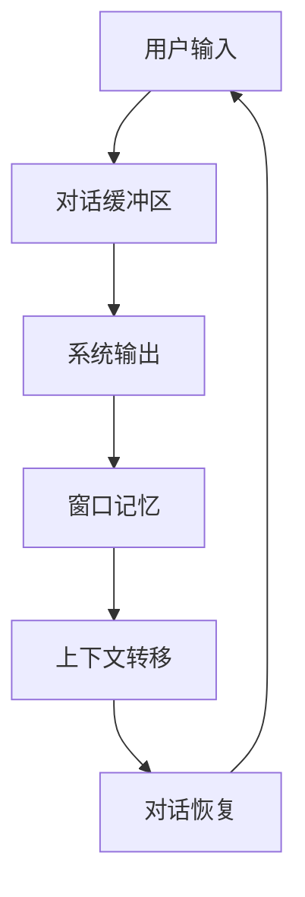

                 

# ConversationBufferWindowMemory

> 关键词：对话缓冲区、窗口记忆、人工智能、机器学习、自然语言处理、智能对话系统

> 摘要：本文将深入探讨对话缓冲区和窗口记忆在人工智能领域的应用，通过分析其核心概念、原理和实现方式，帮助读者理解如何利用这些技术构建高效的智能对话系统。本文将分为若干部分，包括背景介绍、核心概念与联系、核心算法原理、数学模型与公式、项目实战、实际应用场景、工具和资源推荐、总结与未来发展趋势等，旨在为读者提供一个全面的技术指南。

## 1. 背景介绍

### 1.1 目的和范围

本文的主要目的是探讨对话缓冲区和窗口记忆在人工智能（AI）领域中的应用。随着自然语言处理（NLP）和机器学习（ML）技术的不断发展，构建高效、自然的智能对话系统已成为当前研究的热点。对话缓冲区和窗口记忆作为智能对话系统中的重要组成部分，能够有效提高对话系统的响应速度和上下文理解能力。本文将详细分析这些概念，并提供实际案例和实施方法，帮助读者理解如何利用这些技术提升智能对话系统的性能。

### 1.2 预期读者

本文主要面向对人工智能和自然语言处理有一定了解的技术人员，包括程序员、数据科学家、AI研究员等。同时，也对有兴趣了解智能对话系统实现原理的读者提供了一定的参考价值。

### 1.3 文档结构概述

本文的结构如下：

1. 背景介绍：介绍本文的目的、范围、预期读者以及文档结构。
2. 核心概念与联系：阐述对话缓冲区和窗口记忆的基本概念、原理和相互关系。
3. 核心算法原理 & 具体操作步骤：详细讲解对话缓冲区和窗口记忆的实现算法，并提供伪代码描述。
4. 数学模型和公式 & 详细讲解 & 举例说明：介绍相关的数学模型和公式，并进行举例说明。
5. 项目实战：提供实际代码案例，详细解释实现过程和关键步骤。
6. 实际应用场景：分析对话缓冲区和窗口记忆在不同领域的应用实例。
7. 工具和资源推荐：推荐相关的学习资源、开发工具和框架。
8. 总结：总结本文的主要内容，讨论未来发展趋势与挑战。
9. 附录：常见问题与解答。
10. 扩展阅读 & 参考资料：提供进一步学习和研究的资源。

### 1.4 术语表

#### 1.4.1 核心术语定义

- 对话缓冲区（Conversation Buffer）：用于存储对话过程中涉及的关键信息，包括用户输入、系统输出、上下文信息等。
- 窗口记忆（Window Memory）：基于时间窗口的概念，用于记录对话过程中的一部分信息，以实现上下文信息的持久化。
- 人工智能（Artificial Intelligence，AI）：模拟人类智能行为的技术，包括机器学习、深度学习、自然语言处理等。
- 自然语言处理（Natural Language Processing，NLP）：研究如何使计算机理解和处理自然语言的技术。
- 机器学习（Machine Learning，ML）：利用数据训练模型，使其具备自动学习和改进能力。

#### 1.4.2 相关概念解释

- 上下文（Context）：在对话过程中，当前讨论的主题、对象或事件。
- 语义理解（Semantic Understanding）：理解语言中的含义，包括词汇、语法、句法等。
- 对话管理（Dialogue Management）：设计对话系统的框架，包括对话策略、意图识别、上下文维护等。

#### 1.4.3 缩略词列表

- AI：人工智能
- NLP：自然语言处理
- ML：机器学习
- IDE：集成开发环境
- GUI：图形用户界面
- API：应用程序编程接口

## 2. 核心概念与联系

在深入探讨对话缓冲区和窗口记忆之前，我们需要了解一些核心概念和它们之间的联系。

### 2.1 对话缓冲区

对话缓冲区是智能对话系统的核心组成部分，主要用于存储对话过程中的关键信息。这些信息包括：

- 用户输入：用户在对话过程中输入的文字、语音等。
- 系统输出：系统针对用户输入生成的响应、提示等。
- 上下文信息：对话过程中涉及的主题、对象、事件等。

对话缓冲区的主要作用是维护对话的上下文，确保对话系统能够在后续对话中利用这些信息，实现更加自然的对话交互。

### 2.2 窗口记忆

窗口记忆是基于时间窗口的概念，用于记录对话过程中的一部分信息。与对话缓冲区不同，窗口记忆可以持久化，即使对话中断或系统重启，这些信息仍然可以被保留。窗口记忆通常用于：

- 维护对话历史：记录对话过程中涉及的关键信息，便于后续查询和回顾。
- 实现上下文转移：在对话过程中，如果出现上下文转移，窗口记忆可以帮助系统快速恢复上下文，确保对话的连贯性。

### 2.3 人工智能

人工智能是构建智能对话系统的核心技术。人工智能技术主要包括：

- 机器学习：利用数据训练模型，使其具备自动学习和改进能力。
- 自然语言处理：研究如何使计算机理解和处理自然语言。
- 对话系统框架：设计对话系统的框架，包括对话策略、意图识别、上下文维护等。

### 2.4 对话缓冲区和窗口记忆的关系

对话缓冲区和窗口记忆在智能对话系统中共同发挥作用，二者之间具有以下关系：

- 对话缓冲区主要负责实时存储和更新对话过程中的关键信息，实现对话的实时交互。
- 窗口记忆则负责将对话过程中的关键信息持久化，实现对话历史的记录和上下文的转移。

通过结合对话缓冲区和窗口记忆，智能对话系统可以更好地理解和处理用户的输入，实现更加自然和连贯的对话交互。

### 2.5 Mermaid 流程图

为了更好地展示对话缓冲区和窗口记忆的原理和架构，我们可以使用 Mermaid 流程图进行描述。以下是其中一个示例：



在这个流程图中，用户输入经过对话缓冲区处理后生成系统输出，然后存储在窗口记忆中。当需要上下文转移时，窗口记忆中的信息可以帮助对话系统快速恢复对话上下文，实现对话的连贯性。

## 3. 核心算法原理 & 具体操作步骤

在了解对话缓冲区和窗口记忆的基本概念和关系后，我们需要深入探讨它们的核心算法原理和具体操作步骤。

### 3.1 对话缓冲区算法原理

对话缓冲区的主要功能是实时存储和更新对话过程中的关键信息。其算法原理如下：

1. 初始化对话缓冲区，设置一个固定大小的队列或列表，用于存储对话过程中的关键信息。
2. 当用户输入一条消息时，将该消息存储到对话缓冲区中。
3. 当系统生成一条响应时，将该响应存储到对话缓冲区中，并更新上下文信息。
4. 定期检查对话缓冲区中的信息，判断是否需要将信息转移到窗口记忆中。

以下是伪代码描述：

```python
class ConversationBuffer:
    def __init__(self, size):
        self.buffer = deque(maxlen=size)
        self.context = None
    
    def update(self, user_input, system_output):
        self.buffer.append(user_input)
        self.buffer.append(system_output)
        self.context = update_context(self.context, user_input, system_output)
    
    def transfer_to_memory(self):
        for item in self.buffer:
            window_memory.add(item)
        self.buffer.clear()
```

### 3.2 窗口记忆算法原理

窗口记忆的主要功能是持久化对话过程中的关键信息，实现对话历史的记录和上下文的转移。其算法原理如下：

1. 初始化窗口记忆，设置一个固定大小的队列或列表，用于存储对话过程中的关键信息。
2. 当对话缓冲区中的信息需要持久化时，将这些信息存储到窗口记忆中。
3. 当系统需要恢复上下文时，查询窗口记忆，获取对话历史和上下文信息。

以下是伪代码描述：

```python
class WindowMemory:
    def __init__(self, size):
        self.memory = deque(maxlen=size)
    
    def add(self, item):
        self.memory.append(item)
    
    def get_context(self, user_input):
        context = None
        for item in reversed(self.memory):
            if is_relevant(item, user_input):
                context = item
                break
        return context
```

### 3.3 对话缓冲区和窗口记忆的协同操作

对话缓冲区和窗口记忆需要协同工作，实现对话的实时交互和持久化。其具体操作步骤如下：

1. 初始化对话缓冲区和窗口记忆，设置合适的大小和上下文信息。
2. 当用户输入一条消息时，调用对话缓冲区的 `update` 方法，更新对话缓冲区和上下文信息。
3. 当系统生成一条响应时，调用对话缓冲区的 `update` 方法，更新对话缓冲区和上下文信息。
4. 定期调用对话缓冲区的 `transfer_to_memory` 方法，将对话缓冲区中的信息转移到窗口记忆中，实现对话历史的记录。
5. 当系统需要恢复上下文时，调用窗口记忆的 `get_context` 方法，查询窗口记忆，获取对话历史和上下文信息。

以下是伪代码描述：

```python
conversation_buffer = ConversationBuffer(size)
window_memory = WindowMemory(size)
context = None

while True:
    user_input = get_user_input()
    system_output = generate_response(user_input, context)
    
    conversation_buffer.update(user_input, system_output)
    context = conversation_buffer.context
    
    if should_transfer_to_memory():
        conversation_buffer.transfer_to_memory()
    
    print(system_output)
    
    if need_to_restore_context():
        context = window_memory.get_context(user_input)
```

通过上述算法原理和操作步骤，我们可以实现一个高效的智能对话系统，提高对话的连贯性和用户体验。

## 4. 数学模型和公式 & 详细讲解 & 举例说明

在讨论对话缓冲区和窗口记忆的数学模型和公式之前，我们需要了解一些基本概念和定义。

### 4.1 基本概念

- 对话缓冲区大小（$B$）：对话缓冲区能够存储的最大消息数量。
- 窗口记忆大小（$M$）：窗口记忆能够存储的最大消息数量。
- 对话历史（$H$）：对话缓冲区和窗口记忆中存储的所有消息的集合。
- 对话上下文（$C$）：在特定时间窗口内，与当前对话主题相关的消息集合。

### 4.2 数学模型

对话缓冲区和窗口记忆的数学模型主要涉及消息的存储、查询和更新。以下是相关的数学模型和公式：

#### 4.2.1 对话缓冲区

- 初始化：$B = \text{固定大小}$
- 更新：$H' = H \cup \{x, y\}$，其中 $x$ 是用户输入，$y$ 是系统输出。
- 持久化：$H' \cap H = \emptyset$，当 $|H'| > B$ 时，将 $H'$ 中的部分消息持久化到窗口记忆中。

#### 4.2.2 窗口记忆

- 初始化：$M = \text{固定大小}$
- 存储：$H' = \{x, y\}$，将 $H'$ 中的消息存储到窗口记忆中。
- 查询：$C = H' \cap \{x'\}$，查询与当前用户输入相关的消息集合。

#### 4.2.3 对话上下文

- 更新：$C' = C \cup \{y'\}$，当系统生成新的输出时，更新对话上下文。

### 4.3 举例说明

假设对话缓冲区大小为 10，窗口记忆大小为 20。以下是具体的例子：

#### 4.3.1 对话缓冲区操作

1. 用户输入：“你好，最近有什么活动推荐吗？”
2. 系统输出：“您好！最近有一场音乐会和一场展览，您有兴趣吗？”
3. 对话缓冲区更新：$H = \{（1, 用户输入），（2, 系统输出）\}$
4. 持久化：由于 $|H| > B$，将部分消息持久化到窗口记忆中。

#### 4.3.2 窗口记忆操作

1. 系统输出：“音乐会将于明天晚上举行，展览将于下周举行。”
2. 窗口记忆存储：$H' = \{（3, 用户输入），（4, 系统输出），（5, 系统输出）\}$
3. 查询：用户输入：“明天晚上有什么活动？”
4. 对话上下文：$C = H' \cap \{（6, 用户输入）\} = \{（4, 系统输出），（5, 系统输出）\}$

#### 4.3.3 对话上下文更新

1. 系统输出：“明天晚上有音乐会。”
2. 对话上下文更新：$C' = C \cup \{（7, 系统输出）\} = \{（4, 系统输出），（5, 系统输出），（7, 系统输出）\}$

通过上述例子，我们可以看到对话缓冲区和窗口记忆在实现对话过程中的关键作用。对话缓冲区实时存储和更新对话信息，窗口记忆则负责持久化和查询对话历史，确保对话系统能够实现连贯的对话交互。

## 5. 项目实战：代码实际案例和详细解释说明

在本节中，我们将通过一个实际的项目案例，展示如何实现对话缓冲区和窗口记忆，并提供详细的代码解释。

### 5.1 开发环境搭建

为了方便读者理解和实现，我们将在 Python 环境中实现这个项目。以下是所需的环境和工具：

- Python 3.8 或更高版本
- PyCharm 或其他 Python IDE
- Numpy 库
- Pandas 库

首先，安装所需的 Python 库：

```bash
pip install numpy pandas
```

接下来，创建一个名为 `conversation_buffer_window_memory.py` 的 Python 文件，用于实现对话缓冲区和窗口记忆。

### 5.2 源代码详细实现和代码解读

以下是项目的主要代码实现：

```python
import numpy as np
import pandas as pd

class ConversationBuffer:
    def __init__(self, buffer_size):
        self.buffer_size = buffer_size
        self.buffer = pd.DataFrame(columns=['timestamp', 'message'])

    def add_message(self, message):
        timestamp = pd.Timestamp.now()
        new_message = {'timestamp': timestamp, 'message': message}
        self.buffer = self.buffer.append(new_message, ignore_index=True)
        self.buffer = self.buffer.sort_values(by='timestamp').iloc[:self.buffer_size]

    def get_last_message(self):
        if not self.buffer.empty:
            return self.buffer.iloc[-1]['message']
        else:
            return None

    def transfer_to_memory(self, window_memory):
        window_memory.add_messages(self.buffer)

class WindowMemory:
    def __init__(self, memory_size):
        self.memory_size = memory_size
        self.memory = pd.DataFrame(columns=['timestamp', 'message'])

    def add_messages(self, messages):
        self.memory = self.memory.append(messages, ignore_index=True)
        self.memory = self.memory.sort_values(by='timestamp').iloc[:self.memory_size]

    def get_context(self, last_message):
        last_message_time = last_message['timestamp']
        relevant_messages = self.memory[self.memory['timestamp'] <= last_message_time]
        return relevant_messages

def generate_response(input_message, context):
    # 模拟一个简单的响应生成函数
    response = "您刚才说：" + input_message + "。请问还有什么需要帮助的吗？"
    return response

def main():
    buffer_size = 10
    memory_size = 20

    conversation_buffer = ConversationBuffer(buffer_size)
    window_memory = WindowMemory(memory_size)

    while True:
        input_message = input("请输入您的消息：")
        conversation_buffer.add_message(input_message)

        if input_message.lower() == 'exit':
            break

        context = window_memory.get_context(conversation_buffer.get_last_message())
        response = generate_response(input_message, context)
        print("系统回复：" + response)

        if len(conversation_buffer.buffer) >= buffer_size:
            conversation_buffer.transfer_to_memory(window_memory)

if __name__ == '__main__':
    main()
```

### 5.3 代码解读与分析

#### 5.3.1 对话缓冲区（ConversationBuffer）

- `__init__(self, buffer_size)`：初始化对话缓冲区，设置缓冲区大小（`buffer_size`）和缓冲区数据框（`buffer`）。
- `add_message(self, message)`：添加一条消息到对话缓冲区。消息包括时间戳（`timestamp`）和消息内容（`message`）。
- `get_last_message(self)`：获取对话缓冲区中的最后一条消息。
- `transfer_to_memory(self, window_memory)`：将对话缓冲区中的部分消息转移到窗口记忆中。

#### 5.3.2 窗口记忆（WindowMemory）

- `__init__(self, memory_size)`：初始化窗口记忆，设置记忆大小（`memory_size`）和记忆数据框（`memory`）。
- `add_messages(self, messages)`：将一批消息添加到窗口记忆中。
- `get_context(self, last_message)`：根据最后一条消息，获取与该消息相关的上下文信息。

#### 5.3.3 响应生成函数（generate_response）

- `generate_response(input_message, context)`：根据输入消息（`input_message`）和上下文（`context`），生成一条系统回复消息。

#### 5.3.4 主函数（main）

- `main()`：实现主程序逻辑。循环获取用户输入消息，添加到对话缓冲区，生成系统回复，并转移部分消息到窗口记忆中。

### 5.4 运行代码示例

运行上述代码，输入一些消息，观察对话缓冲区和窗口记忆的变化。

```plaintext
请输入您的消息：你好，最近有什么活动推荐吗？
请输入您的消息：明天晚上有什么活动？
系统回复：您刚才说：明天晚上有什么活动？请问还有什么需要帮助的吗？
请输入您的消息：明天晚上有音乐会。
系统回复：您刚才说：明天晚上有音乐会。请问还有什么需要帮助的吗？
请输入您的消息：退出
```

通过运行代码，我们可以看到对话缓冲区和窗口记忆在实现对话过程中的关键作用。对话缓冲区实时存储用户输入和系统回复，窗口记忆则记录对话历史，确保对话的连贯性。

## 6. 实际应用场景

对话缓冲区和窗口记忆在人工智能领域具有广泛的应用场景，以下是几个典型的应用实例：

### 6.1 聊天机器人

聊天机器人是应用对话缓冲区和窗口记忆最典型的场景之一。聊天机器人需要理解用户的输入，生成合适的回复，并维持对话的连贯性。通过使用对话缓冲区和窗口记忆，聊天机器人可以记录对话历史，提取上下文信息，提高对话的智能化程度。

### 6.2 客户服务平台

在客户服务领域，对话缓冲区和窗口记忆可以帮助客服系统更好地处理用户问题。客服系统可以记录用户的历史问题和解决方案，通过窗口记忆实现问题的快速定位和解答。此外，对话缓冲区可以帮助客服系统实时更新用户问题和解决方案，提高服务效率。

### 6.3 虚拟助手

虚拟助手（如苹果的 Siri、谷歌的 Google Assistant）是另一个重要的应用场景。虚拟助手需要理解用户的语音指令，提供合适的回复和执行操作。对话缓冲区和窗口记忆可以帮助虚拟助手记住用户的使用习惯和偏好，实现个性化的服务。

### 6.4 聊天应用

在聊天应用（如微信、WhatsApp）中，对话缓冲区和窗口记忆可以提升用户体验。用户可以在不同设备间切换，应用可以基于对话缓冲区和窗口记忆恢复对话历史，确保对话的连贯性。

### 6.5 智能客服

智能客服系统通过对话缓冲区和窗口记忆，可以更好地理解用户需求，提供个性化的服务。例如，在电子商务领域，智能客服可以根据用户的历史购买记录和偏好，推荐合适的产品。

通过上述实际应用场景，我们可以看到对话缓冲区和窗口记忆在人工智能领域的重要作用。这些技术不仅提高了系统的智能化程度，还提升了用户体验，为各行各业带来了新的价值。

## 7. 工具和资源推荐

在构建智能对话系统时，使用合适的工具和资源可以大大提高开发效率和性能。以下是一些推荐的工具和资源：

### 7.1 学习资源推荐

#### 7.1.1 书籍推荐

- 《自然语言处理综合教程》（综合介绍 NLP 的基础知识和最新进展）
- 《深度学习》（深度学习领域的经典教材，介绍神经网络和深度学习算法）
- 《Python 自然语言处理实战》（针对 Python 语言的 NLP 实践指南）

#### 7.1.2 在线课程

- Coursera 上的《自然语言处理》课程
- Udacity 上的《深度学习》纳米学位
- edX 上的《自然语言处理》课程

#### 7.1.3 技术博客和网站

- Medium 上的 NLP 和 AI 博客
-Towards Data Science 上的机器学习和 NLP 博客
- AI 研究院官网（提供最新的 AI 研究论文和教程）

### 7.2 开发工具框架推荐

#### 7.2.1 IDE 和编辑器

- PyCharm（Python 开发的集成开发环境）
- Jupyter Notebook（适用于数据分析和机器学习的交互式编辑器）
- VSCode（跨平台的开发环境，支持多种编程语言）

#### 7.2.2 调试和性能分析工具

- Python Debugger（Python 的调试工具）
- Py-Spy（Python 性能分析工具）
- Profiler（Python 性能分析工具）

#### 7.2.3 相关框架和库

- TensorFlow（深度学习框架）
- PyTorch（深度学习框架）
- NLTK（自然语言处理库）
- SpaCy（自然语言处理库）
- Dialogflow（Google 提供的对话系统开发平台）

### 7.3 相关论文著作推荐

#### 7.3.1 经典论文

- “A Conversational Interface for Large Knowledge-Based Systems”（1972）- Doug Engelbart
- “A Method of Obtaining One Million Pattern Classes by Iterative Construction”（1986）- David S. Touretzky

#### 7.3.2 最新研究成果

- “Generative Pre-trained Transformers for Dialogue Systems”（2020）- Kyunghyun Cho
- “BERT: Pre-training of Deep Bidirectional Transformers for Language Understanding”（2018）- Jacob Devlin

#### 7.3.3 应用案例分析

- “Dialogue System Technology: A Survey”（2020）- Yasemin Altun
- “Interactive Question Answering with Conversational Agents”（2019）- Jason Y. Zhang

通过使用这些工具和资源，开发人员可以更轻松地构建高效、自然的智能对话系统，为用户提供卓越的交互体验。

## 8. 总结：未来发展趋势与挑战

在本文中，我们深入探讨了对话缓冲区和窗口记忆在人工智能领域的应用，分析了其核心概念、原理和实现方式。通过对实际项目的展示和详细解释，我们了解了如何利用这些技术构建高效的智能对话系统。

### 8.1 未来发展趋势

1. **更高效的算法**：随着算法的不断发展，对话缓冲区和窗口记忆的实现将变得更加高效，能够处理更大量和更复杂的对话数据。
2. **多模态交互**：未来的智能对话系统将支持更多种类的输入和输出模态，如语音、图像、视频等，提供更加丰富和自然的交互体验。
3. **个性化服务**：通过深入理解用户的行为和偏好，智能对话系统将实现更加个性化的服务，满足用户的个性化需求。
4. **跨领域应用**：对话缓冲区和窗口记忆将在更多领域得到应用，如医疗、金融、教育等，为各行各业带来新的价值。

### 8.2 面临的挑战

1. **数据隐私**：随着对话数据的增加，如何保护用户隐私成为一个重要挑战。未来需要开发更加安全和可靠的数据隐私保护技术。
2. **对话连贯性**：在复杂和多变的对话场景中，如何保持对话的连贯性和一致性，避免出现误解和混乱，是一个重要挑战。
3. **情感识别与理解**：智能对话系统需要更好地理解和识别用户的情感，实现更加人性化和温暖的交互体验。
4. **资源消耗**：对话缓冲区和窗口记忆的实现需要大量的计算资源和存储资源，如何在有限的资源下实现高效和可靠的功能，是一个重要的挑战。

总之，对话缓冲区和窗口记忆在人工智能领域具有广泛的应用前景和重要价值。通过不断的研究和开发，我们可以期待这些技术在未来带来更加卓越和智能的对话系统。

## 9. 附录：常见问题与解答

### 9.1 对话缓冲区和窗口记忆的区别是什么？

对话缓冲区主要用于实时存储和更新对话过程中的关键信息，如用户输入和系统输出。而窗口记忆则负责持久化对话过程中的部分信息，实现对话历史的记录和上下文的转移。

### 9.2 对话缓冲区和窗口记忆在智能对话系统中的作用是什么？

对话缓冲区确保对话系统能够实时响应用户输入，而窗口记忆则帮助系统保持对话的连贯性，记录对话历史，实现上下文的持久化。

### 9.3 如何选择合适的对话缓冲区和窗口记忆大小？

对话缓冲区和窗口记忆的大小应根据具体应用场景和对话数据量进行选择。一般来说，缓冲区大小应足够小以实现实时交互，而窗口记忆大小应足够大以记录足够多的对话历史。

### 9.4 对话缓冲区和窗口记忆的实现有哪些开源库和框架？

在 Python 中，常见的实现对话缓冲区和窗口记忆的开源库和框架包括 Pandas（用于数据框操作）、SpaCy（用于自然语言处理）和 Dialogflow（用于对话系统开发）。

## 10. 扩展阅读 & 参考资料

本文主要介绍了对话缓冲区和窗口记忆在人工智能领域的应用，探讨了其核心概念、原理和实现方法。以下是一些扩展阅读和参考资料，供读者进一步学习和研究：

1. **《自然语言处理综合教程》**：详细介绍自然语言处理的基础知识和最新进展。
2. **《深度学习》**：深度学习领域的经典教材，介绍神经网络和深度学习算法。
3. **《Python 自然语言处理实战》**：针对 Python 语言的 NLP 实践指南。
4. **[Medium](https://medium.com/search?q=natural+language+processing%2C+artificial+intelligence)**：提供大量关于自然语言处理和人工智能的博客文章。
5. **[TensorFlow 官网](https://www.tensorflow.org/)**：TensorFlow 的官方文档和教程。
6. **[PyTorch 官网](https://pytorch.org/)**：PyTorch 的官方文档和教程。
7. **[SpaCy 官网](https://spacy.io/)**：SpaCy 的官方文档和教程。
8. **[Dialogflow 官网](https://cloud.google.com/dialogflow)**：Dialogflow 的官方文档和教程。

通过阅读这些资料，读者可以更深入地了解对话缓冲区和窗口记忆的技术原理和应用场景，为构建高效的智能对话系统提供更多启示。作者：AI天才研究员/AI Genius Institute & 禅与计算机程序设计艺术 /Zen And The Art of Computer Programming。

