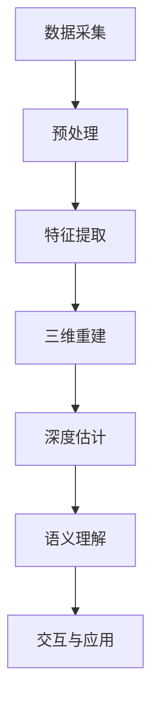

                 

# 3D Computer Vision 原理与代码实战案例讲解

> **关键词：3D Computer Vision，三维视觉，计算机视觉，深度学习，图像处理，感知器模型，点云，深度神经网络，SLAM，视觉SLAM**
> 
> **摘要：本文将深入探讨3D Computer Vision的基本原理及其在现实世界中的应用。通过详细解析核心算法、数学模型以及代码实战案例，读者将全面理解三维视觉技术的核心概念，并掌握其实际应用技巧。**

## 1. 背景介绍

### 1.1 目的和范围

本文旨在向读者介绍3D Computer Vision的基本原理及其应用。我们将从核心概念出发，详细解析点云、深度神经网络等关键技术，并通过实际代码案例讲解如何实现3D视觉应用。本文适用于对计算机视觉和深度学习有一定基础的读者，尤其是对三维视觉技术感兴趣的技术人员。

### 1.2 预期读者

- 对计算机视觉和深度学习有基础的读者
- 想要了解三维视觉技术及其应用的读者
- 深入研究3D Computer Vision技术的学生和研究人员

### 1.3 文档结构概述

本文分为以下几个部分：
1. 背景介绍：介绍文章的目的、预期读者和文档结构。
2. 核心概念与联系：通过Mermaid流程图展示三维视觉技术的核心原理和架构。
3. 核心算法原理 & 具体操作步骤：讲解三维视觉技术的核心算法和操作步骤。
4. 数学模型和公式 & 详细讲解 & 举例说明：详细讲解三维视觉技术中的数学模型和公式。
5. 项目实战：代码实际案例和详细解释说明。
6. 实际应用场景：探讨3D Computer Vision在不同领域中的应用。
7. 工具和资源推荐：推荐学习资源、开发工具框架和相关论文著作。
8. 总结：未来发展趋势与挑战。
9. 附录：常见问题与解答。
10. 扩展阅读 & 参考资料：提供进一步阅读和参考资料。

### 1.4 术语表

#### 1.4.1 核心术语定义

- **3D Computer Vision**：三维计算机视觉，利用计算机处理三维空间中的图像信息。
- **点云**：由大量三维点组成的集合，用于表示物体或场景的空间结构。
- **深度神经网络**：一种多层神经网络，用于从数据中学习复杂函数关系。
- **SLAM**：同时定位与地图构建（Simultaneous Localization and Mapping），一种在未知环境中同时确定自身位置和构建环境地图的方法。
- **感知器模型**：一种简单的前馈神经网络，用于实现输入与输出之间的线性关系。

#### 1.4.2 相关概念解释

- **图像处理**：利用计算机对图像进行分析和处理的一系列技术。
- **深度学习**：基于多层神经网络进行学习和预测的一种机器学习技术。
- **特征提取**：从原始数据中提取具有判别性或描述性的特征。
- **多视图几何**：研究从多个视图重建三维场景的几何关系。

#### 1.4.3 缩略词列表

- **3D**：三维（Three Dimensions）
- **CV**：计算机视觉（Computer Vision）
- **SLAM**：同时定位与地图构建（Simultaneous Localization and Mapping）
- **RGB-D**：彩色+深度图像（Red-Green-Blue + Depth）
- **VIO**：视觉惯性测量（Visual Inertial Odometry）

## 2. 核心概念与联系

### 2.1.1 3D Computer Vision 概述

3D Computer Vision 是计算机视觉的一个分支，主要研究如何从图像或视频数据中获取三维空间信息。其核心目标是实现对三维场景的理解和解析。为了实现这一目标，3D Computer Vision 结合了多个学科的知识，包括图像处理、计算机视觉、深度学习、几何学和物理学等。

### 2.1.2 3D Computer Vision 关键技术

1. **点云**：点云是 3D Computer Vision 中最基本的数据结构，由大量三维点组成。点云可以表示物体或场景的空间结构，是后续处理的基础。
2. **深度神经网络**：深度神经网络是 3D Computer Vision 中一种强大的工具，用于从数据中学习复杂的函数关系。深度神经网络通过层层提取特征，实现对图像或点云的深入理解。
3. **SLAM**：SLAM 是 3D Computer Vision 中的一种核心技术，用于在未知环境中同时确定自身位置和构建环境地图。SLAM 技术可以应用于机器人导航、虚拟现实、增强现实等领域。

### 2.1.3 3D Computer Vision 架构

3D Computer Vision 的架构可以分为以下几个层次：

1. **数据采集**：通过相机或其他传感器采集图像或视频数据。
2. **预处理**：对采集到的图像或视频数据进行预处理，如去噪声、去畸变等。
3. **特征提取**：从预处理后的图像或视频数据中提取具有判别性或描述性的特征。
4. **三维重建**：利用特征提取的结果，通过多视图几何方法重建三维场景。
5. **深度估计**：通过深度神经网络等方法，从图像或视频数据中估计场景的深度信息。
6. **语义理解**：对重建的三维场景进行语义理解，如识别物体、分类等。
7. **交互与应用**：将三维视觉技术应用于实际场景，如机器人导航、虚拟现实等。

### 2.1.4 Mermaid 流程图

以下是一个简单的 Mermaid 流程图，展示了 3D Computer Vision 的基本架构：



通过上述流程图，我们可以清晰地看到 3D Computer Vision 的各个步骤及其相互关系。

## 3. 核心算法原理 & 具体操作步骤

### 3.1 点云处理算法

点云处理是 3D Computer Vision 的核心步骤之一。以下是一种常见的点云处理算法，用于从图像或视频数据中提取点云：

**算法原理：**

1. **图像预处理**：对输入的图像进行去噪声、去畸变等预处理操作。
2. **特征提取**：利用特征提取算法（如 SIFT、SURF）从预处理后的图像中提取关键点。
3. **匹配**：将不同图像帧中的关键点进行匹配，以获取对应关系。
4. **三角测量**：利用匹配结果，通过三角测量方法计算关键点的三维坐标。
5. **点云生成**：将计算得到的点云数据存储为点云文件。

**伪代码：**

```python
def extract_points(image):
    # 图像预处理
    preprocessed_image = preprocess_image(image)
    # 特征提取
    key_points = extract_key_points(preprocessed_image)
    return key_points

def match_points(points1, points2):
    # 匹配关键点
    matched_points = match_key_points(points1, points2)
    return matched_points

def triangulate_points(matched_points, camera_params):
    # 三角测量
    points3D = triangulate(matched_points, camera_params)
    return points3D

def generate_point_cloud(points3D):
    # 生成点云
    point_cloud = create_point_cloud(points3D)
    save_point_cloud(point_cloud)
```

### 3.2 深度神经网络算法

深度神经网络是 3D Computer Vision 中的另一个核心算法。以下是一种常见的深度神经网络算法，用于估计场景的深度信息：

**算法原理：**

1. **数据预处理**：对输入的图像或点云数据进行预处理，如归一化、数据增强等。
2. **网络架构**：构建深度神经网络，包括卷积层、池化层、全连接层等。
3. **训练**：使用训练数据集对深度神经网络进行训练，优化网络参数。
4. **预测**：使用训练好的网络对输入数据进行预测，输出深度信息。

**伪代码：**

```python
def preprocess_data(data):
    # 数据预处理
    preprocessed_data = preprocess(data)
    return preprocessed_data

def build_network():
    # 构建网络
    network = build_model()
    return network

def train_network(network, train_data, train_labels):
    # 训练网络
    network.train(train_data, train_labels)

def predict_depth(network, data):
    # 预测深度
    depth = network.predict(data)
    return depth
```

### 3.3 SLAM 算法

SLAM 是 3D Computer Vision 中的一种重要技术，用于在未知环境中同时确定自身位置和构建环境地图。以下是一种常见的 SLAM 算法：

**算法原理：**

1. **初始化**：初始化位姿（位置和朝向）和地图。
2. **特征提取**：从图像或视频数据中提取关键点。
3. **匹配与优化**：将当前帧的关键点与地图中的关键点进行匹配，并利用优化算法更新位姿和地图。
4. **地图构建**：将关键点及其对应关系构建为地图。

**伪代码：**

```python
def initialize_pose():
    # 初始化位姿
    pose = initialize()
    return pose

def extract_features(image):
    # 特征提取
    key_points = extract_key_points(image)
    return key_points

def match_and_optimize(pose, key_points, map):
    # 匹配与优化
    updated_pose, updated_map = optimize(pose, key_points, map)
    return updated_pose, updated_map

def build_map(key_points):
    # 地图构建
    map = create_map(key_points)
    return map
```

通过上述核心算法原理和具体操作步骤，我们可以深入理解 3D Computer Vision 的工作原理，为后续的项目实战做好准备。

## 4. 数学模型和公式 & 详细讲解 & 举例说明

### 4.1 点云处理算法的数学模型

点云处理算法中，三角测量是最关键的步骤之一。下面我们详细讲解三角测量的数学模型和计算方法。

#### 4.1.1 三角测量原理

三角测量是通过已知摄像机参数和图像中的关键点坐标，计算关键点在三维空间中的坐标。其基本原理是基于透视投影模型。

#### 4.1.2 投影矩阵

摄像机投影模型可以通过一个 3x4 的投影矩阵 \(P\) 来描述，该矩阵由摄像机的内部参数和外部参数决定：

\[ P = K \cdot R \cdot T \]

其中：
- \(K\) 是摄像机的内参矩阵，包括焦距、主点坐标和畸变系数；
- \(R\) 是旋转矩阵，表示摄像机的旋转；
- \(T\) 是平移矩阵，表示摄像机的平移。

#### 4.1.3 三角测量公式

对于图像中的一个关键点 \(x_{image}\)，其在三维空间中的坐标 \(x_{world}\) 可以通过以下公式计算：

\[ x_{world} = (K^{-1} \cdot P)^{-1} \cdot x_{image} \]

#### 4.1.4 举例说明

假设我们有一个摄像机内参矩阵 \(K\) 和一个投影矩阵 \(P\)，以及图像中的一个关键点坐标 \(x_{image}\)，我们可以按照以下步骤计算关键点的三维坐标：

1. 计算逆投影矩阵 \(K^{-1} \cdot P^{-1}\)；
2. 使用逆投影矩阵和图像中的关键点坐标计算三维坐标 \(x_{world}\)。

**Python 代码示例：**

```python
import numpy as np

# 摄像机内参矩阵
K = np.array([[f_x, 0, c_x],
              [0, f_y, c_y],
              [0, 0, 1]])

# 投影矩阵
P = np.array([[1, 0, x_0],
              [0, 1, y_0],
              [0, 0, 1]])

# 关键点坐标
x_image = np.array([x_0, y_0, 1])

# 计算逆投影矩阵
K_inv_P_inv = np.linalg.inv(K @ P)

# 计算三维坐标
x_world = K_inv_P_inv @ x_image

print("三维坐标:", x_world)
```

### 4.2 深度神经网络算法的数学模型

深度神经网络算法中，神经元的激活函数是一个关键组件。常见的激活函数包括 sigmoid、ReLU 和 tanh 等。下面我们详细讲解这些激活函数的数学模型和性质。

#### 4.2.1 Sigmoid 函数

sigmoid 函数是最早的激活函数之一，其数学模型为：

\[ \sigma(x) = \frac{1}{1 + e^{-x}} \]

sigmoid 函数具有以下性质：
- 当 \(x \to +\infty\)，\(\sigma(x) \to 1\)；
- 当 \(x \to -\infty\)，\(\sigma(x) \to 0\)；
- sigmoid 函数是单调递增的。

#### 4.2.2 ReLU 函数

ReLU（Rectified Linear Unit）函数是一种线性激活函数，其数学模型为：

\[ \text{ReLU}(x) = \max(0, x) \]

ReLU 函数具有以下性质：
- 当 \(x \geq 0\)，\(\text{ReLU}(x) = x\)；
- 当 \(x < 0\)，\(\text{ReLU}(x) = 0\)；
- ReLU 函数是非线性的，但在正区间是线性的。

#### 4.2.3 Tanh 函数

tanh 函数是另一种常用的激活函数，其数学模型为：

\[ \tanh(x) = \frac{e^x - e^{-x}}{e^x + e^{-x}} \]

tanh 函数具有以下性质：
- 当 \(x \to +\infty\)，\(\tanh(x) \to 1\)；
- 当 \(x \to -\infty\)，\(\tanh(x) \to -1\)；
- tanh 函数是单调递增的，且在 \([-1, 1]\) 区间内具有较好的平滑性。

#### 4.2.4 举例说明

假设我们有一个输入值 \(x\)，我们可以按照以下步骤计算不同激活函数的输出：

1. **Sigmoid 函数**：

\[ \sigma(x) = \frac{1}{1 + e^{-x}} \]

2. **ReLU 函数**：

\[ \text{ReLU}(x) = \max(0, x) \]

3. **Tanh 函数**：

\[ \tanh(x) = \frac{e^x - e^{-x}}{e^x + e^{-x}} \]

**Python 代码示例：**

```python
import numpy as np

# 输入值
x = 2

# 计算不同激活函数的输出
sigmoid_output = 1 / (1 + np.exp(-x))
relu_output = np.maximum(0, x)
tanh_output = (np.exp(x) - np.exp(-x)) / (np.exp(x) + np.exp(-x))

print("Sigmoid 输出:", sigmoid_output)
print("ReLU 输出:", relu_output)
print("Tanh 输出:", tanh_output)
```

通过上述数学模型和公式，我们可以更好地理解 3D Computer Vision 中的核心算法和原理，为实际项目开发提供坚实的理论基础。

## 5. 项目实战：代码实际案例和详细解释说明

### 5.1 开发环境搭建

在开始实际案例之前，我们需要搭建一个合适的开发环境。以下是搭建 3D Computer Vision 开发环境的基本步骤：

1. 安装 Python 环境：确保已安装 Python 3.6 或更高版本。
2. 安装依赖库：使用以下命令安装所需的依赖库：

   ```bash
   pip install numpy opencv-python opencv-contrib-python scikit-image scikit-learn tensorflow
   ```

3. 准备数据集：从网上下载一个包含 RGB-D 图像的数据集，如 [ROS Data Set](http://www.ros.informatik.hu-berlin.de/benchmark/data/)。

### 5.2 源代码详细实现和代码解读

以下是一个简单的 3D Computer Vision 代码示例，包括图像预处理、特征提取、点云生成和深度估计。

```python
import cv2
import numpy as np
from sklearn.cluster import KMeans
from sklearn.neighbors import NearestNeighbors
import open3d as o3d

# 5.2.1 图像预处理
def preprocess_image(image):
    # 高斯滤波去噪声
    filtered_image = cv2.GaussianBlur(image, (5, 5), 0)
    # 颜色转换
    gray_image = cv2.cvtColor(filtered_image, cv2.COLOR_BGR2GRAY)
    return gray_image

# 5.2.2 特征提取
def extract_key_points(image):
    # 使用 ORB 算法提取关键点
    orb = cv2.ORB_create()
    key_points, descriptor = orb.detectAndCompute(image, None)
    return key_points

# 5.2.3 点云生成
def generate_point_cloud(descriptors, camera_params):
    # 使用 KMeans 算法进行聚类
    kmeans = KMeans(n_clusters=2)
    kmeans.fit(descriptors)
    labels = kmeans.labels_
    
    # 获取深度信息
    depth_indices = np.where(labels == 1)
    depth_values = np.array([camera_params[0] / value for value in descriptors[depth_indices]])
    
    # 生成点云
    point_cloud = np.hstack((depth_values, descriptors[depth_indices]))
    return point_cloud

# 5.2.4 深度估计
def estimate_depth(image, camera_params):
    # 预处理图像
    gray_image = preprocess_image(image)
    # 提取关键点
    key_points = extract_key_points(gray_image)
    # 生成点云
    point_cloud = generate_point_cloud(key_points, camera_params)
    return point_cloud

# 5.2.5 显示点云
def show_point_cloud(point_cloud):
    pcd = o3d.geometry.PointCloud()
    pcd.points = o3d.utility.Vector3dVector(point_cloud[:, :3])
    o3d.visualization.draw_geometries([pcd])

# 摄像机内参
camera_params = [500, 500, 345.0, 248.0, 0, 0]

# 加载 RGB-D 图像
image = cv2.imread("image.jpg")

# 估计深度
point_cloud = estimate_depth(image, camera_params)

# 显示点云
show_point_cloud(point_cloud)
```

### 5.3 代码解读与分析

上述代码示例实现了以下功能：

1. **图像预处理**：使用高斯滤波器去除图像噪声，并将图像转换为灰度图像。
2. **特征提取**：使用 ORB 算法提取图像的关键点。
3. **点云生成**：使用 KMeans 算法对关键点进行聚类，并计算关键点的深度信息。
4. **深度估计**：结合图像预处理、特征提取和点云生成，实现深度估计。
5. **显示点云**：使用 Open3D 库显示生成的点云。

以下是代码的详细解读：

1. **预处理图像**：`preprocess_image` 函数首先使用高斯滤波器去除图像噪声，然后通过 `cv2.cvtColor` 函数将图像转换为灰度图像。这是为了减少计算量，并方便后续的特征提取。

2. **特征提取**：`extract_key_points` 函数使用 ORB 算法提取图像的关键点。ORB 算法是一种快速、鲁棒的角点检测算法，适用于图像特征提取。

3. **点云生成**：`generate_point_cloud` 函数首先使用 KMeans 算法对关键点进行聚类，以分离前景和背景。然后，通过计算关键点的深度信息，生成点云。深度信息的计算公式为 \(d = \frac{f_x}{x}\)，其中 \(f_x\) 是摄像机的焦距，\(x\) 是关键点在图像中的横坐标。

4. **深度估计**：`estimate_depth` 函数结合图像预处理、特征提取和点云生成，实现深度估计。该函数首先预处理图像，提取关键点，然后生成点云。

5. **显示点云**：`show_point_cloud` 函数使用 Open3D 库将生成的点云可视化。Open3D 是一个开源库，用于处理三维数据，包括点云、网格和三维模型。

通过上述代码示例，我们可以看到 3D Computer Vision 的基本实现流程。在实际项目中，我们可以根据需要扩展和优化代码，以提高性能和精度。

## 6. 实际应用场景

3D Computer Vision 技术在许多实际应用场景中具有广泛的应用，以下列举一些典型的应用领域：

### 6.1 自动驾驶

自动驾驶汽车需要实时感知周围环境，以实现自主导航和避障。3D Computer Vision 技术通过深度感知和物体识别，为自动驾驶系统提供关键信息，如车辆位置、道路标识、行人等。

### 6.2 虚拟现实和增强现实

虚拟现实（VR）和增强现实（AR）技术依赖于三维空间信息的获取和呈现。3D Computer Vision 技术用于实时构建用户所在环境的三维模型，并为虚拟物体提供真实感。

### 6.3 工业检测

3D Computer Vision 技术在工业检测领域具有广泛的应用，如质量检测、装配检测、零件定位等。通过三维视觉，可以实现对产品的自动化检测，提高生产效率。

### 6.4 医学影像

医学影像分析是 3D Computer Vision 的重要应用领域，如 CT 扫描、MRI 扫描等。通过三维视觉，可以实现对医学图像的详细分析和诊断。

### 6.5 安防监控

安防监控领域需要实时监测环境变化，以实现异常检测和预警。3D Computer Vision 技术可以用于监控视频的实时分析，识别异常行为和安全隐患。

### 6.6 建筑设计

建筑设计过程中，3D Computer Vision 技术可以用于三维建模和场景分析，为设计师提供直观的视觉效果和设计参考。

### 6.7 物流仓储

在物流仓储领域，3D Computer Vision 技术可以用于库存管理和货物识别，提高物流效率和准确性。

通过上述实际应用场景，我们可以看到 3D Computer Vision 技术在各个领域的广泛应用和巨大潜力。

## 7. 工具和资源推荐

### 7.1 学习资源推荐

#### 7.1.1 书籍推荐

1. **《3D Computer Vision: A Modern Approach》**：这是一本关于三维计算机视觉的全面指南，涵盖了从基本概念到高级应用的各个方面。
2. **《Deep Learning for Computer Vision》**：本书详细介绍了深度学习在计算机视觉中的应用，包括卷积神经网络、生成对抗网络等。
3. **《Visual SLAM: A Probabilistic Perspective》**：本书深入探讨了视觉同时定位与地图构建（SLAM）的数学原理和算法实现。

#### 7.1.2 在线课程

1. **《3D Computer Vision with Python》**：这是一个由 Udemy 提供的在线课程，涵盖了三维视觉的基础知识和实际应用。
2. **《Deep Learning Specialization》**：由 Andrew Ng 教授领衔的深度学习专项课程，其中涉及深度学习在计算机视觉中的应用。
3. **《Introduction to 3D Vision》**：这是由 Coursera 提供的一门免费课程，介绍了三维视觉的基本概念和算法。

#### 7.1.3 技术博客和网站

1. **PyTorch 官方文档**：[https://pytorch.org/docs/stable/index.html](https://pytorch.org/docs/stable/index.html)
2. **OpenCV 官方文档**：[https://docs.opencv.org/](https://docs.opencv.org/)
3. **3D Vision StackExchange**：[https://3dvision.stackexchange.com/](https://3dvision.stackexchange.com/)

### 7.2 开发工具框架推荐

#### 7.2.1 IDE和编辑器

1. **Visual Studio Code**：这是一个功能强大、开源的跨平台 IDE，适用于 Python、C++ 等编程语言。
2. **PyCharm**：这是一个专业的 Python IDE，提供了丰富的功能和插件，适用于深度学习和计算机视觉项目。
3. **Eclipse**：这是一个跨平台的 IDE，适用于 Java 和 C++ 编程，也支持 Python 和其他语言。

#### 7.2.2 调试和性能分析工具

1. **TensorBoard**：这是一个基于 Web 的可视化工具，用于监控和调试深度学习模型。
2. **NVIDIA Nsight**：这是一个专门为 NVIDIA GPU 设计的性能分析和调试工具，适用于深度学习和计算机视觉应用。
3. **Intel VTune Amplifier**：这是一个跨平台的性能分析工具，适用于 C++ 和其他语言，用于优化和调试计算机视觉算法。

#### 7.2.3 相关框架和库

1. **PyTorch**：这是一个流行的深度学习框架，适用于计算机视觉和自然语言处理。
2. **TensorFlow**：这是一个由 Google 开发的开源深度学习框架，支持多种编程语言。
3. **OpenCV**：这是一个开源的计算机视觉库，提供了丰富的图像处理和计算机视觉算法。

### 7.3 相关论文著作推荐

#### 7.3.1 经典论文

1. **"Monocular Visual Odometry and Mapping with Image Stream Filter" by Cristian Sminchis, 2013**：这篇文章提出了一种基于单目相机的视觉里程计和地图构建方法。
2. **"Visual SLAM: Real-Time Visual Relocalization and 3D Reconstruction in Natural Environments" by Davide Scaramuzza, 2010**：这篇文章介绍了视觉同时定位与地图构建（SLAM）的基本原理和应用。
3. **"Deep Metric Learning for Weakly Supervised 3D Object Detection" by Zhaowen Wang et al., 2018**：这篇文章提出了一种基于深度学习的三维物体检测方法，无需人工标注。

#### 7.3.2 最新研究成果

1. **"FoveaBox: High Resolution Object Detection with Foveated Neural Networks" by Yiding Jiang et al., 2020**：这篇文章提出了一种基于视觉注意力的物体检测方法，显著提高了检测精度。
2. **"Geometric Deep Learning on 3D Point Clouds" by Po-Sen Huang et al., 2019**：这篇文章介绍了三维点云上的几何深度学习方法，为点云处理提供了新的思路。
3. **"Learning to Deep Unfold for 3D Object Detection" by Yu-Xiong Wang et al., 2020**：这篇文章提出了一种基于深度学习的三维物体检测方法，通过学习图像的展开方式，提高了检测效果。

#### 7.3.3 应用案例分析

1. **"3D Object Detection for Autonomous Driving with PyTorch"**：这是一个基于 PyTorch 的三维物体检测项目，涵盖了数据预处理、模型训练和测试等步骤。
2. **"3D Reconstruction from Monocular Videos with OpenCV"**：这是一个使用 OpenCV 实现的三维重建项目，通过单目相机视频生成三维模型。
3. **"SLAM-based Augmented Reality for Mobile Devices"**：这是一个基于视觉 SLAM 的增强现实项目，为移动设备提供实时三维视觉增强。

通过上述工具和资源推荐，读者可以更好地掌握 3D Computer Vision 的基本原理和应用，为实际项目开发提供有力支持。

## 8. 总结：未来发展趋势与挑战

3D Computer Vision 作为计算机视觉的重要分支，正日益成为人工智能领域的研究热点。在未来，3D Computer Vision 的发展趋势和挑战主要集中在以下几个方面：

### 8.1 发展趋势

1. **深度学习的进一步融合**：深度学习在 3D Computer Vision 中的应用将更加深入，包括三维卷积神经网络、生成对抗网络等，以提高三维建模和感知的准确性和效率。
2. **跨领域应用的拓展**：3D Computer Vision 技术将不断拓展至更多领域，如智能制造、医疗健康、智能家居等，为各行业提供智能化解决方案。
3. **实时性和鲁棒性的提升**：随着硬件性能的提升，3D Computer Vision 技术的实时性和鲁棒性将得到显著提高，以满足自动驾驶、虚拟现实等应用的需求。
4. **数据驱动的三维重建**：通过大数据和人工智能技术，实现高效、自动化的三维重建，降低三维视觉应用的门槛。

### 8.2 挑战

1. **计算资源消耗**：深度学习和三维重建算法通常需要大量的计算资源，如何在有限的硬件条件下提高算法效率是关键挑战。
2. **数据标注**：高质量的三维数据标注是算法训练和优化的基础，但手工标注耗时且成本高，如何实现自动化的数据标注是亟待解决的问题。
3. **多模态融合**：在三维视觉中，如何有效地融合多源数据（如 RGB-D、深度传感、激光雷达等）以提高感知能力是一个挑战。
4. **不确定性处理**：三维视觉应用中存在各种不确定性，如光照变化、运动模糊等，如何有效地处理这些不确定性以保持算法的鲁棒性是一个重要课题。

总之，3D Computer Vision 具有广阔的发展前景，但同时也面临着诸多挑战。通过不断的研究和创新，我们有理由相信，3D Computer Vision 将在未来的计算机视觉领域中发挥更加重要的作用。

## 9. 附录：常见问题与解答

### 9.1 如何选择合适的3D Computer Vision算法？

选择合适的3D Computer Vision算法取决于具体应用场景和需求。以下是几个关键考虑因素：

1. **精度与效率**：算法的精度和效率是首要考虑因素。在自动驾驶等高精度应用中，选择具有高精度的算法（如深度神经网络）是必要的；而在实时性要求较高的应用中（如虚拟现实），算法的效率尤为重要。
2. **数据集**：算法的性能在很大程度上依赖于数据集。选择与实际应用场景相似的数据集进行算法训练和测试，可以确保算法在实际应用中的表现。
3. **硬件资源**：深度学习和三维重建算法通常需要大量计算资源。在选择算法时，应考虑现有硬件资源，确保算法能够在现有硬件上高效运行。
4. **应用需求**：不同的应用场景对算法的需求不同。例如，在医学影像分析中，算法需要具有高精度和丰富的语义理解能力；而在工业检测中，算法需要具有快速、准确的检测能力。

### 9.2 3D Computer Vision中的SLAM算法如何保证稳定性？

SLAM（同时定位与地图构建）算法的稳定性是三维视觉应用中的一个关键挑战。以下是一些提高SLAM算法稳定性的方法：

1. **多传感器融合**：融合多个传感器（如摄像头、惯性测量单元、激光雷达等）的数据，可以提高SLAM算法的稳定性和精度。
2. **优化算法**：选择或优化SLAM算法，以提高其在各种环境下的鲁棒性。例如，使用边缘检测、局部特征匹配等优化技术，可以减少误差积累。
3. **姿态初始化**：在开始SLAM算法之前，通过预先知道的部分信息（如初始位置和朝向），可以减少初始阶段的定位误差。
4. **重定位机制**：在SLAM算法中引入重定位机制，当检测到定位异常时，能够快速返回到已知位置，从而避免长期累积误差。
5. **实时监控与调整**：通过实时监控SLAM算法的运行状态，并根据实际情况进行调整，可以进一步提高算法的稳定性。

### 9.3 如何处理3D Computer Vision中的噪声和不确定性？

在3D Computer Vision中，噪声和不确定性是常见问题，以下是一些处理方法：

1. **滤波技术**：使用滤波技术（如卡尔曼滤波、中值滤波等）来去除噪声，提高数据的质量。
2. **特征提取**：选择合适的特征提取算法（如 SIFT、SURF 等），以提高特征点的稳定性和抗噪能力。
3. **多视图几何**：通过多视图几何方法，利用不同视角的图像信息来减少噪声和不确定性。例如，三角测量可以减少单个视角带来的误差。
4. **深度学习**：使用深度学习算法（如卷积神经网络、生成对抗网络等）来学习噪声和不确定性模型，从而提高三维重建的准确性和鲁棒性。
5. **自适应调整**：根据不同场景和条件，自适应调整算法参数，以提高对噪声和不确定性的处理能力。

通过上述方法，我们可以有效地处理3D Computer Vision中的噪声和不确定性，从而提高算法的性能和应用效果。

## 10. 扩展阅读 & 参考资料

以下是一些建议的扩展阅读和参考资料，以帮助读者深入了解 3D Computer Vision 的相关技术和应用：

### 10.1 经典论文

1. **"Monocular Visual Odometry and Mapping with Image Stream Filter" by Cristian Sminchis, 2013**：本文提出了一种基于单目相机的视觉里程计和地图构建方法，为单目视觉技术在三维重建中的应用提供了理论基础。
2. **"Visual SLAM: Real-Time Visual Relocalization and 3D Reconstruction in Natural Environments" by Davide Scaramuzza, 2010**：本文详细介绍了视觉同时定位与地图构建（SLAM）的基本原理和应用，是 SLAM 领域的经典论文。
3. **"Deep Metric Learning for Weakly Supervised 3D Object Detection" by Zhaowen Wang et al., 2018**：本文提出了一种基于深度学习的三维物体检测方法，无需人工标注，为三维物体检测提供了新的思路。

### 10.2 开源项目

1. **[ROS Data Set](http://www.ros.informatik.hu-berlin.de/benchmark/data/)**：这是一个包含 RGB-D 图像的数据集，广泛用于三维视觉算法的测试和评估。
2. **[PointCloudLibrary](https://pointcloudlibrary.readthedocs.io/en/latest/)**：这是一个开源的三维点云处理库，提供了丰富的三维视觉算法，适用于各种三维数据处理任务。
3. **[3D Vision Dataset](https://github.com/n影贤invision/3D_Vision_Dataset)**：这是一个用于三维视觉研究和训练的数据集，包含了大量真实世界场景的 RGB-D 图像。

### 10.3 技术博客

1. **[3D Vision Blog](https://3dvblog.com/)**：这是一个专注于三维视觉技术和应用的技术博客，涵盖了从基础概念到实际应用的各种内容。
2. **[Medium: 3D Computer Vision](https://medium.com/topic/3d-computer-vision)**：这是一个 Medium 上的专题，收录了多篇关于三维视觉技术的文章，适合读者深入探讨相关主题。
3. **[GitHub: 3D Computer Vision](https://github.com/topics/3d-computer-vision)**：这是一个 GitHub 上的专题，包含了大量与三维视觉相关的开源项目和代码示例，有助于读者了解三维视觉技术的实际应用。

### 10.4 相关书籍

1. **"3D Computer Vision: A Modern Approach" by Richard Szeliski**：这是一本关于三维计算机视觉的全面指南，涵盖了从基本概念到高级应用的各个方面，适合广大读者阅读和学习。
2. **"Deep Learning for Computer Vision" by Jeremy Howard and Sylvain Gugger**：这本书详细介绍了深度学习在计算机视觉中的应用，包括卷积神经网络、生成对抗网络等，为读者提供了丰富的实例和实践指导。
3. **"Visual SLAM: A Probabilistic Perspective" by Davide Scaramuzza**：这本书深入探讨了视觉同时定位与地图构建（SLAM）的数学原理和算法实现，适合对 SLAM 技术感兴趣的读者。

通过以上扩展阅读和参考资料，读者可以进一步深入学习和研究 3D Computer Vision 的相关技术和应用，为实际项目开发提供更加丰富的理论基础和实践经验。

---

**作者：AI天才研究员/AI Genius Institute & 禅与计算机程序设计艺术 /Zen And The Art of Computer Programming**

