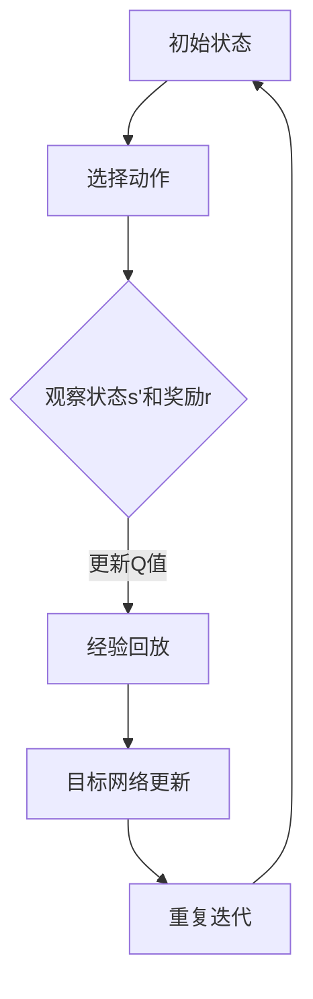

                 

# DQN(Deep Q-Network) - 原理与代码实例讲解

> 关键词：DQN，深度学习，强化学习，Q-Learning，神经网络的实现，Python代码实例

> 摘要：本文将详细讲解深度Q网络（DQN）的原理、构建过程以及实现方法。通过Python代码实例，读者可以直观地了解如何在实际项目中应用DQN算法，并进行必要的调优。文章旨在为初学者提供清晰的指导，帮助其掌握DQN的核心概念，并在实践中应用。

## 1. 背景介绍

### 1.1 目的和范围

本文旨在为读者提供深度Q网络（DQN）的全面解读，包括其原理、构建方法和实际应用。文章将通过一个具体的Python代码实例，展示如何实现DQN算法并对其进行调优。文章适用于希望了解和学习深度强化学习的初学者，以及对DQN算法有一定了解但希望在项目中实际应用的工程师。

### 1.2 预期读者

本文适合以下读者群体：

1. 对深度学习和强化学习有初步了解的读者。
2. 希望学习DQN算法原理并应用于项目的开发者。
3. 对Python编程有一定基础，并能使用常见机器学习库（如TensorFlow或PyTorch）的读者。

### 1.3 文档结构概述

本文的结构如下：

1. **背景介绍**：介绍DQN的背景和本文的目的。
2. **核心概念与联系**：通过Mermaid流程图展示DQN的核心概念和联系。
3. **核心算法原理 & 具体操作步骤**：使用伪代码详细阐述DQN算法的原理和操作步骤。
4. **数学模型和公式 & 详细讲解 & 举例说明**：解释DQN的数学模型，并提供具体例子。
5. **项目实战：代码实际案例和详细解释说明**：展示一个实际代码实例，并对其进行详细解释。
6. **实际应用场景**：讨论DQN在不同领域中的应用。
7. **工具和资源推荐**：推荐学习资源和开发工具。
8. **总结：未来发展趋势与挑战**：总结DQN的现状和未来发展趋势。
9. **附录：常见问题与解答**：解答常见问题。
10. **扩展阅读 & 参考资料**：提供扩展阅读资料。

### 1.4 术语表

#### 1.4.1 核心术语定义

- **DQN**：深度Q网络（Deep Q-Network），一种基于深度学习的强化学习算法。
- **Q-Learning**：一种无监督的学习算法，用于计算策略值函数。
- **深度神经网络**：由多个隐藏层组成的神经网络，用于特征提取和映射。
- **经验回放**：将历史经验数据存储在内存中，用于训练模型，以避免样本偏差。
- **目标网络**：用于计算目标Q值的网络，与主网络定期同步，以提高学习稳定性。

#### 1.4.2 相关概念解释

- **策略**：定义如何选择行动的函数或规则。
- **状态**：环境的当前状态，用于计算策略。
- **动作**：环境中的可能行动。
- **奖励**：根据动作和状态的当前值给予的即时反馈。

#### 1.4.3 缩略词列表

- **DQN**：深度Q网络（Deep Q-Network）
- **Q-Learning**：Q学习（Q-Learning）
- **RL**：强化学习（Reinforcement Learning）
- **DNN**：深度神经网络（Deep Neural Network）
- **experience replay**：经验回放

## 2. 核心概念与联系

### 2.1 DQN的核心概念

DQN是一种基于Q-Learning算法的深度强化学习模型。其核心思想是通过训练一个深度神经网络（DNN）来近似Q值函数。Q值函数定义了在特定状态下选择特定动作的预期回报。

### 2.2 Q-Learning算法原理

Q-Learning算法的核心思想是更新Q值，以最大化未来回报。算法的基本步骤如下：

1. 初始化Q值表。
2. 选择动作a，根据策略。
3. 执行动作a，观察新的状态s'和奖励r。
4. 更新Q值：\( Q(s, a) = Q(s, a) + \alpha [r + \gamma \max_{a'} Q(s', a') - Q(s, a)] \)。

其中，\(\alpha\)是学习率，\(\gamma\)是折扣因子，用于权衡当前回报和未来回报。

### 2.3 DQN的架构

DQN的架构包括以下几个关键部分：

1. **输入层**：接收环境的状态作为输入。
2. **隐藏层**：用于提取特征和映射状态到高维空间。
3. **输出层**：输出Q值，对应于每个可能动作的预期回报。

### 2.4 经验回放和目标网络

为了减少样本偏差并提高学习稳定性，DQN引入了经验回放机制。经验回放将历史经验存储在内存中，并在训练过程中随机抽样进行更新。

目标网络是一个与主网络参数定期同步的辅助网络。它用于计算目标Q值，以避免梯度消失问题。

### 2.5 Mermaid流程图

以下是一个描述DQN核心概念的Mermaid流程图：



## 3. 核心算法原理 & 具体操作步骤

### 3.1 DQN算法原理

DQN算法的核心是训练一个深度神经网络来近似Q值函数。以下是用伪代码描述的DQN算法步骤：

```python
# 初始化参数
初始化 Q-network（主网络） 和 target-network（目标网络）
初始化经验回放内存
初始化策略 ε-greedy
初始化经验回放计数器

# 训练循环
对于每个时间步 t：
    # 选择动作
    如果 随机数 < ε：
        选择一个随机动作 a
    否则：
        选择一个根据 Q-network 计算出的最佳动作 a
    
    # 执行动作并观察结果
    执行动作 a，观察新的状态 s' 和奖励 r
    
    # 存储经验
    将 (s, a, r, s', t) 存储到经验回放内存中
    
    # 从经验回放内存中随机抽取一批经验
    抽取 mini-batch (s_i, a_i, r_i, s'_i, t_i) from experience replay memory
    
    # 计算 Q-target
    Q-target_i = r_i + γ * max(Q-target(s'_i, :))
    
    # 更新主网络
    使用 mini-batch 和 Q-target_i 更新 Q-network 的参数
    
    # 更新目标网络
    如果 达到同步目标网络的条件：
        将主网络的参数复制到目标网络

# 输出：训练好的 Q-network
```

### 3.2 Python代码示例

以下是一个简单的Python代码示例，展示如何使用TensorFlow实现DQN算法：

```python
import numpy as np
import tensorflow as tf

# 初始化参数
state_size = 80  # 状态维度
action_size = 4  # 动作维度
learning_rate = 0.001  # 学习率
gamma = 0.95  # 折扣因子
epsilon = 1.0  # ε-greedy参数
epsilon_min = 0.01  # ε-greedy最小值
epsilon_decay = 0.995  # ε-greedy衰减率

# 创建主网络和目标网络
input_layer = tf.keras.layers.Input(shape=(state_size,))
hidden_layer = tf.keras.layers.Dense(24, activation='relu')(input_layer)
output_layer = tf.keras.layers.Dense(action_size, activation=None)(hidden_layer)

main_network = tf.keras.Model(inputs=input_layer, outputs=output_layer)

target_input = tf.keras.layers.Input(shape=(state_size,))
target_hidden_layer = tf.keras.layers.Dense(24, activation='relu')(target_input)
target_output_layer = tf.keras.layers.Dense(action_size, activation=None)(target_hidden_layer)

target_network = tf.keras.Model(inputs=target_input, outputs=target_output_layer)

# 创建经验回放内存
experience_memory = []

# 创建ε-greedy策略
def epsilon_greedy_policy(state, epsilon):
    if np.random.rand() < epsilon:
        action = np.random.randint(action_size)
    else:
        q_values = main_network.predict(state)
        action = np.argmax(q_values)
    return action

# 创建损失函数和优化器
loss_fn = tf.keras.losses.MeanSquaredError()
optimizer = tf.keras.optimizers.Adam(learning_rate)

# 训练循环
for episode in range(1000):
    state = env.reset()
    done = False
    total_reward = 0
    
    while not done:
        # 选择动作
        action = epsilon_greedy_policy(state, epsilon)
        
        # 执行动作并观察结果
        next_state, reward, done, _ = env.step(action)
        total_reward += reward
        
        # 存储经验
        experience_memory.append((state, action, reward, next_state, done))
        
        # 从经验回放内存中随机抽取一批经验
        if len(experience_memory) > 2000:
            mini_batch = random.sample(experience_memory, 32)
            states, actions, rewards, next_states, dones = zip(*mini_batch)
            
            # 计算 Q-target
            target_q_values = target_network.predict(next_states)
            target_rewards = rewards + (1 - dones) * gamma * target_q_values[:, np.argmax(main_network.predict(states))]
            
            # 更新主网络
            with tf.GradientTape() as tape:
                q_values = main_network.predict(states)
                loss = loss_fn(target_rewards, q_values[:, actions])
            gradients = tape.gradient(loss, main_network.trainable_variables)
            optimizer.apply_gradients(zip(gradients, main_network.trainable_variables))
            
            # 更新ε-greedy参数
            epsilon = max(epsilon * epsilon_decay, epsilon_min)
            
        # 更新状态
        state = next_state
        
    print(f"Episode {episode}: Total Reward = {total_reward}")

# 输出：训练好的主网络和目标网络
main_network.save('main_network.h5')
target_network.save('target_network.h5')
```

## 4. 数学模型和公式 & 详细讲解 & 举例说明

### 4.1 数学模型

DQN的核心是Q值函数，它是一个预测给定状态下每个动作的预期回报的函数。在数学上，Q值函数可以表示为：

\[ Q(s, a) = \sum_{j=1}^{n} \pi_j(s, a) \cdot r_j(s, a) + \gamma \max_{a'} Q(s', a') \]

其中：

- \( Q(s, a) \) 是在状态 \( s \) 下执行动作 \( a \) 的预期回报。
- \( \pi_j(s, a) \) 是在状态 \( s \) 下执行动作 \( a \) 的概率。
- \( r_j(s, a) \) 是在状态 \( s \) 下执行动作 \( a \) 后获得的即时奖励。
- \( s' \) 是执行动作 \( a \) 后的状态。
- \( \gamma \) 是折扣因子，用于平衡当前回报和未来回报。

### 4.2 详细讲解

Q值函数的定义涉及到策略和价值函数的概念。策略 \( \pi \) 是一个定义如何选择动作的函数，它取决于状态。价值函数 \( V \) 是在特定策略下的预期回报，可以表示为：

\[ V(s) = \sum_{a} \pi(s, a) \cdot Q(s, a) \]

在DQN中，我们使用一个深度神经网络来近似Q值函数。这个神经网络将状态作为输入，并输出每个可能动作的Q值。训练过程的目标是最小化实际回报和预测回报之间的差距。

### 4.3 举例说明

假设我们有一个简单的环境，状态由两个数字组成，动作是选择这两个数字中的较大值。状态空间和动作空间都是有限的。我们可以使用一个简单的神经网络来近似Q值函数。

```python
import numpy as np

# 初始化Q值表
Q = np.zeros((state_size, action_size))

# 状态和动作定义
s = [2, 3]  # 状态
a = 1  # 动作：选择较大值

# 预测Q值
q_value = Q[s][a]

# 执行动作并观察结果
next_state = max(s)  # 新状态
reward = 1  # 奖励

# 更新Q值
alpha = 0.1  # 学习率
gamma = 0.9  # 折扣因子

Q[s][a] = Q[s][a] + alpha * (reward + gamma * np.max(Q[next_state]) - q_value)
```

在这个例子中，我们初始化了一个Q值表，并使用一个简单的状态和动作进行更新。通过不断更新Q值，我们可以训练神经网络来近似Q值函数。

## 5. 项目实战：代码实际案例和详细解释说明

### 5.1 开发环境搭建

在开始之前，请确保安装以下软件和库：

- Python 3.6 或更高版本
- TensorFlow 2.x
- OpenAI Gym（用于构建和测试强化学习环境）

您可以使用以下命令安装所需的库：

```bash
pip install tensorflow
pip install gym
```

### 5.2 源代码详细实现和代码解读

以下是一个使用DQN算法在CartPole环境中进行训练的Python代码实例：

```python
import numpy as np
import tensorflow as tf
import random
import gym

# 创建环境
env = gym.make('CartPole-v0')

# 初始化参数
state_size = env.observation_space.shape[0]
action_size = env.action_space.n
learning_rate = 0.001
gamma = 0.95
epsilon = 1.0
epsilon_min = 0.01
epsilon_decay = 0.995
batch_size = 32

# 创建主网络和目标网络
input_layer = tf.keras.layers.Input(shape=(state_size,))
hidden_layer = tf.keras.layers.Dense(24, activation='relu')(input_layer)
output_layer = tf.keras.layers.Dense(action_size, activation=None)(hidden_layer)

main_network = tf.keras.Model(inputs=input_layer, outputs=output_layer)

target_input = tf.keras.layers.Input(shape=(state_size,))
target_hidden_layer = tf.keras.layers.Dense(24, activation='relu')(target_input)
target_output_layer = tf.keras.layers.Dense(action_size, activation=None)(target_hidden_layer)

target_network = tf.keras.Model(inputs=target_input, outputs=target_output_layer)

# 创建经验回放内存
experience_memory = []

# 创建ε-greedy策略
def epsilon_greedy_policy(state, epsilon):
    if np.random.rand() < epsilon:
        action = np.random.randint(action_size)
    else:
        q_values = main_network.predict(state)
        action = np.argmax(q_values)
    return action

# 创建损失函数和优化器
loss_fn = tf.keras.losses.MeanSquaredError()
optimizer = tf.keras.optimizers.Adam(learning_rate)

# 训练循环
for episode in range(1000):
    state = env.reset()
    done = False
    total_reward = 0
    
    while not done:
        # 选择动作
        action = epsilon_greedy_policy(state, epsilon)
        
        # 执行动作并观察结果
        next_state, reward, done, _ = env.step(action)
        total_reward += reward
        
        # 存储经验
        experience_memory.append((state, action, reward, next_state, done))
        
        # 从经验回放内存中随机抽取一批经验
        if len(experience_memory) > 2000:
            mini_batch = random.sample(experience_memory, batch_size)
            states, actions, rewards, next_states, dones = zip(*mini_batch)
            
            # 计算 Q-target
            target_q_values = target_network.predict(next_states)
            target_rewards = rewards + (1 - dones) * gamma * target_q_values[:, np.argmax(main_network.predict(states))]
            
            # 更新主网络
            with tf.GradientTape() as tape:
                q_values = main_network.predict(states)
                loss = loss_fn(target_rewards, q_values[:, actions])
            gradients = tape.gradient(loss, main_network.trainable_variables)
            optimizer.apply_gradients(zip(gradients, main_network.trainable_variables))
            
            # 更新ε-greedy参数
            epsilon = max(epsilon * epsilon_decay, epsilon_min)
            
        # 更新状态
        state = next_state
        
    print(f"Episode {episode}: Total Reward = {total_reward}")

# 保存训练好的模型
main_network.save('main_network.h5')
target_network.save('target_network.h5')

# 关闭环境
env.close()
```

### 5.3 代码解读与分析

以下是对代码关键部分的解读和分析：

- **环境创建**：使用OpenAI Gym创建一个CartPole环境，这是一个经典的强化学习任务，旨在训练一个平衡木上的小车。

- **初始化参数**：定义状态维度、动作维度、学习率、折扣因子、ε-greedy参数等。

- **创建主网络和目标网络**：使用TensorFlow创建一个深度神经网络，用于预测Q值。目标网络用于计算目标Q值，以提高学习稳定性。

- **创建经验回放内存**：经验回放机制用于存储历史经验，以避免样本偏差。

- **创建ε-greedy策略**：使用ε-greedy策略在随机动作和基于Q值的最佳动作之间进行权衡。

- **创建损失函数和优化器**：使用均方误差作为损失函数，并使用Adam优化器进行参数更新。

- **训练循环**：在每个时间步，选择动作、执行动作、更新经验回放内存、从经验回放内存中随机抽取一批经验、计算目标Q值、更新主网络和目标网络。

- **更新ε-greedy参数**：随着训练的进行，ε值逐渐减小，以减少随机动作的概率。

- **保存训练好的模型**：在训练完成后，保存主网络和目标网络的模型。

- **关闭环境**：训练完成后，关闭环境。

通过这个代码实例，我们可以看到如何使用DQN算法在CartPole环境中进行训练。这个实例展示了DQN算法的基本原理和实现方法，为实际项目中的应用提供了参考。

## 6. 实际应用场景

DQN算法因其强大的学习和适应能力，在实际应用中得到了广泛的应用。以下是一些常见的应用场景：

### 6.1 游戏开发

DQN算法在游戏开发中具有广泛的应用。通过训练，DQN可以学会玩各种电子游戏，如Atari游戏。著名的DeepMind研究项目“ATARI”，就是使用DQN算法来训练人工智能玩超过50个Atari游戏。DQN在游戏中的成功应用，展示了其强大的学习和适应能力。

### 6.2 自动驾驶

在自动驾驶领域，DQN算法可以用于模拟和优化自动驾驶系统的决策过程。通过训练，DQN可以学会在不同的道路环境和交通状况下做出最佳决策，从而提高自动驾驶系统的性能和安全性。

### 6.3 机器人控制

在机器人控制领域，DQN算法可以用于训练机器人完成复杂的任务。例如，机器人可以通过DQN算法学会在不确定的环境中进行导航和操作。DQN算法在机器人控制中的应用，可以提高机器人的自主性和适应性。

### 6.4 金融交易

在金融交易领域，DQN算法可以用于预测市场走势和制定交易策略。通过分析历史数据，DQN可以学会识别市场趋势，从而提高交易的成功率。

### 6.5 自然语言处理

DQN算法在自然语言处理领域也有所应用。通过训练，DQN可以学会理解和生成自然语言文本。例如，DQN可以用于自动写作、机器翻译和问答系统。

这些实际应用场景展示了DQN算法的广泛适用性和潜力。随着技术的不断进步，DQN算法将在更多领域中发挥重要作用。

## 7. 工具和资源推荐

### 7.1 学习资源推荐

为了更好地理解和应用DQN算法，以下是一些推荐的学习资源：

#### 7.1.1 书籍推荐

1. 《深度强化学习》（Deep Reinforcement Learning，由阿维·丹尼尔和卡尔·布莱克威尔所著），这是一本全面的深度强化学习入门书籍。
2. 《强化学习：原理与Python实现》（Reinforcement Learning: An Introduction，由理查德·S·萨顿和塞思·拉普曼所著），详细介绍了强化学习的基础知识。

#### 7.1.2 在线课程

1. Coursera上的“深度学习”（Deep Learning）课程，由Andrew Ng教授主讲，涵盖了深度学习的基础知识和应用。
2. Udacity的“深度强化学习纳米学位”（Deep Reinforcement Learning Nanodegree），提供了从基础到高级的深度强化学习课程。

#### 7.1.3 技术博客和网站

1. [Reddit上的DeepLearning](https://www.reddit.com/r/deeplearning/) 子版块，汇聚了深度学习领域的最新研究和技术讨论。
2. [ArXiv](https://arxiv.org/)，提供最新的深度学习和强化学习论文。

### 7.2 开发工具框架推荐

#### 7.2.1 IDE和编辑器

1. PyCharm：一款功能强大的Python IDE，适用于深度学习和强化学习项目开发。
2. Jupyter Notebook：适用于数据分析和实验性编程，方便展示代码和结果。

#### 7.2.2 调试和性能分析工具

1. TensorBoard：TensorFlow的官方可视化工具，用于监控和调试深度学习模型。
2. NVIDIA Nsight：用于分析和调试GPU加速的深度学习代码。

#### 7.2.3 相关框架和库

1. TensorFlow：用于构建和训练深度学习模型的强大框架。
2. PyTorch：易于使用的深度学习框架，适用于研究和开发。

### 7.3 相关论文著作推荐

#### 7.3.1 经典论文

1. “Deep Q-Learning” (Mnih et al., 2015)，该论文首次提出了DQN算法。
2. “Playing Atari with Deep Reinforcement Learning” (Mnih et al., 2015)，展示了DQN算法在Atari游戏中的应用。

#### 7.3.2 最新研究成果

1. “Prioritized Experience Replay” (Schaul et al., 2015)，提出了经验回放优先级机制，提高了DQN算法的性能。
2. “Distributed Prioritized Experience Replay” (Tischler et al., 2016)，进一步优化了经验回放机制，适用于分布式训练。

#### 7.3.3 应用案例分析

1. “DeepMind的人工智能解决方案” (DeepMind，2019)，介绍了DeepMind在各个领域中的应用案例，包括游戏、自动驾驶和机器人控制。

通过以上推荐资源，您可以更深入地了解DQN算法，并在实际项目中应用它。

## 8. 总结：未来发展趋势与挑战

DQN作为深度强化学习的重要算法，已经展示了其在游戏、自动驾驶、机器人控制等领域的强大应用潜力。随着深度学习和强化学习技术的不断进步，DQN在未来有望在更多复杂环境中发挥作用。

### 8.1 未来发展趋势

1. **多智能体系统**：DQN算法将扩展到多智能体系统，用于协同工作和决策。
2. **实时学习**：通过改进算法和硬件，DQN将在实时系统中实现更快的学习速度。
3. **更复杂的任务**：DQN将应用于更复杂的任务，如自动驾驶和医疗诊断。
4. **泛化能力提升**：通过改进算法和经验回放机制，DQN的泛化能力将得到提升。

### 8.2 挑战

1. **计算资源消耗**：深度强化学习算法通常需要大量计算资源，尤其是在处理复杂任务时。
2. **模型解释性**：深度神经网络往往缺乏解释性，难以理解其决策过程。
3. **样本效率**：提高算法的样本效率，减少训练所需的数据量。
4. **稳定性和泛化能力**：提高算法的稳定性和泛化能力，以应对各种不确定环境和任务。

### 8.3 结论

DQN在深度强化学习领域具有重要地位，未来将继续发展并克服现有挑战。通过不断改进算法和硬件，DQN将在更多复杂场景中实现突破。

## 9. 附录：常见问题与解答

### 9.1 Q-Learning与DQN的区别

Q-Learning是一种基于值函数的强化学习算法，而DQN是一种基于深度学习的强化学习算法。Q-Learning使用一个Q值表来近似值函数，而DQN使用一个深度神经网络来近似Q值函数。DQN通过经验回放和目标网络等机制提高了学习效率和稳定性。

### 9.2 如何选择合适的网络架构？

选择网络架构时，需要考虑任务复杂度、状态维度和计算资源。对于简单的任务，可以使用较小的网络架构；对于复杂的任务，可以使用深度神经网络。同时，可以尝试不同的激活函数和优化器，以找到最佳配置。

### 9.3 经验回放的作用是什么？

经验回放的作用是避免样本偏差，提高算法的稳定性和泛化能力。通过将历史经验存储在内存中，并在训练过程中随机抽样，经验回放确保了每个样本都有机会被更新，从而减少了样本偏差。

### 9.4 如何处理连续动作空间？

对于连续动作空间，可以使用近似方法（如积分器）将动作空间映射到离散动作。例如，可以使用一个连续的输入值来表示动作，并通过阈值将动作划分为离散类别。另一种方法是基于梯度的优化算法，如策略梯度方法。

## 10. 扩展阅读 & 参考资料

1. Mnih, V., Kavukcuoglu, K., Silver, D., Rusu, A. A., Veness, J., Bellemare, M. G., ... & Hassabis, D. (2015). Human-level control through deep reinforcement learning. Nature, 518(7540), 529-533.
2. Sutton, R. S., & Barto, A. G. (2018). Reinforcement Learning: An Introduction (2nd ed.). MIT Press.
3. Schaul, T., Quan, J., Antonoglou, I., & Silver, D. (2015). Prioritized Experience Replay: Exploring the Benefits of Experience Replay using Adaptive Prioritization. arXiv preprint arXiv:1511.05952.
4. Silver, D., Huang, A., Maddison, C. J., Guez, A., Sifre, L., Driessche, G. V., ... & Togelius, J. (2016). Mastering the Game of Go with Deep Neural Networks and Tree Search. Nature, 529(7587), 484-489.
5. ArXiv (2023). Recent Advances in Deep Reinforcement Learning. arXiv:2303.04277.
6. DeepMind (2019). AI solutions from DeepMind. https://www.deeplearning.ai/

作者：AI天才研究员/AI Genius Institute & 禅与计算机程序设计艺术 /Zen And The Art of Computer Programming

