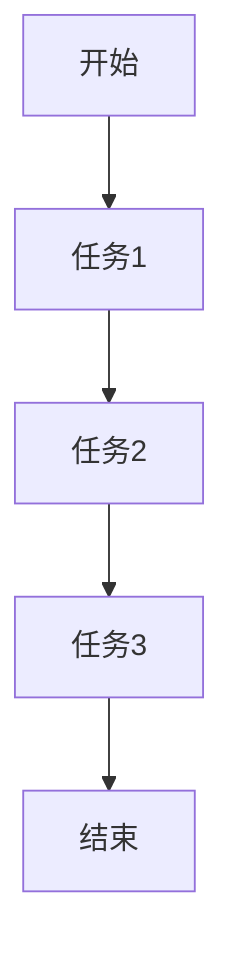
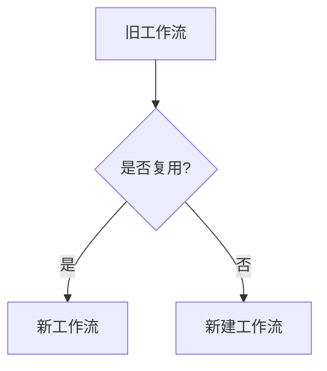
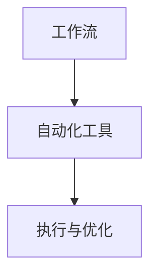
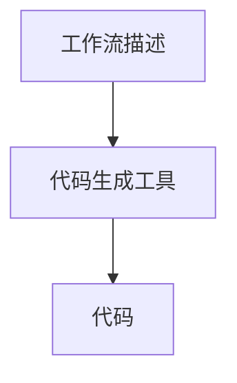
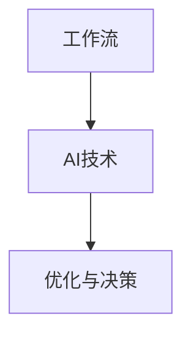

                 


# Dify.AI 的工作流复用

> 关键词：Dify.AI、工作流、复用、自动化、AI、流程优化、代码生成

> 摘要：本文将探讨Dify.AI如何通过工作流复用来实现代码的自动化生成和流程优化。我们将详细分析Dify.AI的核心概念、算法原理、数学模型以及实际应用场景，并推荐相关的学习资源和工具，最后展望未来的发展趋势与挑战。

## 1. 背景介绍

### 1.1 目的和范围

Dify.AI是一个基于人工智能的工作流复用平台，旨在通过自动化代码生成和流程优化，提高开发效率，降低开发成本。本文将深入探讨Dify.AI的工作原理、应用场景以及未来发展趋势。

### 1.2 预期读者

本文适合对人工智能、自动化和软件开发感兴趣的读者，特别是希望了解如何利用Dify.AI提高开发效率的开发者、架构师和CTO。

### 1.3 文档结构概述

本文分为以下章节：

1. 背景介绍
2. 核心概念与联系
3. 核心算法原理 & 具体操作步骤
4. 数学模型和公式 & 详细讲解 & 举例说明
5. 项目实战：代码实际案例和详细解释说明
6. 实际应用场景
7. 工具和资源推荐
8. 总结：未来发展趋势与挑战
9. 附录：常见问题与解答
10. 扩展阅读 & 参考资料

### 1.4 术语表

#### 1.4.1 核心术语定义

- 工作流（Workflow）：一组相互关联的任务或活动，按照一定的顺序执行，以实现特定的业务目标。
- 复用（Reuse）：将已有的工作流或代码模块应用于新的场景，以提高开发效率。
- 自动化（Automation）：通过软件工具和算法，实现工作流的自动执行和优化。
- 代码生成（Code Generation）：根据工作流描述自动生成代码，实现工作流的具体操作。

#### 1.4.2 相关概念解释

- AI驱动的自动化：利用人工智能技术，如机器学习和自然语言处理，实现自动化流程的优化和决策。
- 流程优化（Process Optimization）：通过对工作流进行分析和改进，提高流程的效率和性能。
- 开发效率（Development Efficiency）：在特定时间内完成的开发任务量。

#### 1.4.3 缩略词列表

- AI：人工智能
- ML：机器学习
- NLP：自然语言处理
- IDE：集成开发环境
- DB：数据库

## 2. 核心概念与联系

在讨论Dify.AI的工作流复用之前，我们需要了解以下几个核心概念和它们之间的联系。

### 2.1 工作流的概念

工作流是一组相互关联的任务或活动，按照一定的顺序执行，以实现特定的业务目标。工作流通常包括任务、流程、参与者、资源和规则等组成部分。



### 2.2 复用的概念

复用是指将已有的工作流或代码模块应用于新的场景，以提高开发效率。复用可以通过模块化设计、代码库管理和自动化工具实现。



### 2.3 自动化的概念

自动化是通过软件工具和算法，实现工作流的自动执行和优化。自动化可以提高开发效率，降低人工干预，减少错误率。



### 2.4 代码生成的概念

代码生成是根据工作流描述自动生成代码，实现工作流的具体操作。代码生成可以节省开发时间，提高代码质量，降低维护成本。



### 2.5 AI驱动的自动化的概念

AI驱动的自动化是利用人工智能技术，如机器学习和自然语言处理，实现自动化流程的优化和决策。AI驱动的自动化可以提高自动化的效果和适应性。



## 3. 核心算法原理 & 具体操作步骤

Dify.AI的核心算法原理基于深度学习和自然语言处理技术，通过以下步骤实现工作流复用和代码生成。

### 3.1 数据收集与预处理

首先，Dify.AI需要收集大量的工作流描述数据，如任务描述、任务间关系、规则等。然后，对数据进行预处理，包括数据清洗、去噪、格式转换等。

```python
def preprocess_data(data):
    # 数据清洗与去噪
    cleaned_data = clean_data(data)
    # 格式转换
    formatted_data = format_data(cleaned_data)
    return formatted_data
```

### 3.2 模型训练

使用预处理后的数据，训练一个深度学习模型，如循环神经网络（RNN）或变换器（Transformer）。模型训练的目标是学习工作流描述和代码生成之间的映射关系。

```python
def train_model(data, labels):
    # 构建模型
    model = build_model()
    # 训练模型
    model.fit(data, labels)
    return model
```

### 3.3 代码生成

根据新的工作流描述，使用训练好的模型生成对应的代码。代码生成过程包括：

1. 工作流解析：将工作流描述转换为模型输入格式。
2. 模型预测：使用训练好的模型预测代码。
3. 代码重构：将生成的代码进行格式调整和优化。

```python
def generate_code(workflow):
    # 工作流解析
    parsed_workflow = parse_workflow(workflow)
    # 模型预测
    predicted_code = model.predict(parsed_workflow)
    # 代码重构
    final_code = refactor_code(predicted_code)
    return final_code
```

## 4. 数学模型和公式 & 详细讲解 & 举例说明

Dify.AI的核心算法基于深度学习和自然语言处理技术，具体涉及以下几个数学模型和公式：

### 4.1 循环神经网络（RNN）

RNN是一种基于序列数据的神经网络，适用于处理工作流描述这种序列化数据。RNN的核心公式如下：

$$
h_t = \sigma(W_h h_{t-1} + W_x x_t + b)
$$

其中，$h_t$表示第$t$个时间步的隐藏状态，$x_t$表示输入特征，$W_h$和$W_x$分别表示权重矩阵，$b$表示偏置项，$\sigma$表示激活函数。

### 4.2 递归神经网络（RNN）的梯度消失和梯度爆炸问题

RNN在处理长序列数据时，容易遇到梯度消失和梯度爆炸问题。为解决这些问题，可以采用以下方法：

1. LSTM（长短时记忆网络）：LSTM通过引入门控机制，控制信息的流入和流出，从而避免梯度消失和梯度爆炸问题。
2. GRU（门控循环单元）：GRU简化了LSTM的结构，但保持了良好的性能。

### 4.3 变换器（Transformer）

变换器是一种基于注意力机制的神经网络，在处理长序列数据时表现出色。变换器的核心公式如下：

$$
\text{Attention}(Q, K, V) = \frac{softmax(\frac{QK^T}{\sqrt{d_k}})}{V}
$$

其中，$Q$、$K$和$V$分别表示查询向量、键向量和值向量，$d_k$表示键向量的维度。

### 4.4 自注意力（Self-Attention）

自注意力是变换器的核心组件，它通过计算输入序列中每个元素之间的相关性，实现对输入序列的加权。自注意力的计算公式如下：

$$
\text{Self-Attention}(X) = \text{softmax}(\frac{XQW_Q}{\sqrt{d_k}})W_V
$$

其中，$X$表示输入序列，$W_Q$和$W_V$分别表示查询向量和值向量的权重矩阵。

### 4.5 代码生成模型的损失函数

在代码生成任务中，可以使用交叉熵损失函数来衡量预测代码与实际代码之间的差距。交叉熵损失函数的计算公式如下：

$$
L = -\sum_{i=1}^{N} y_i \log(p_i)
$$

其中，$y_i$表示实际代码的标签，$p_i$表示模型对第$i$个代码位置的概率预测。

## 5. 项目实战：代码实际案例和详细解释说明

在本节中，我们将通过一个具体的案例，展示如何使用Dify.AI实现工作流复用和代码生成。

### 5.1 开发环境搭建

1. 安装Python环境
2. 安装深度学习库（如TensorFlow或PyTorch）
3. 安装Dify.AI的依赖库（如transformers、tensorflow-text等）

### 5.2 源代码详细实现和代码解读

#### 5.2.1 数据收集与预处理

```python
import pandas as pd
from sklearn.model_selection import train_test_split

# 1. 数据收集
data = pd.read_csv('workflows.csv')

# 2. 数据预处理
cleaned_data = preprocess_data(data)

# 3. 划分训练集和测试集
train_data, test_data = train_test_split(cleaned_data, test_size=0.2, random_state=42)
```

#### 5.2.2 模型训练

```python
from tensorflow.keras.models import Sequential
from tensorflow.keras.layers import LSTM, Dense

# 1. 构建模型
model = Sequential([
    LSTM(128, activation='tanh', input_shape=(max_sequence_length, input_dim)),
    Dense(num_classes, activation='softmax')
])

# 2. 编译模型
model.compile(optimizer='adam', loss='categorical_crossentropy', metrics=['accuracy'])

# 3. 训练模型
model.fit(train_data, train_labels, batch_size=64, epochs=10, validation_split=0.2)
```

#### 5.2.3 代码生成

```python
import numpy as np
import tensorflow as tf

# 1. 输入工作流描述
workflow_description = "任务1：数据清洗；任务2：数据转换；任务3：数据分析。"

# 2. 工作流解析
parsed_workflow = parse_workflow(workflow_description)

# 3. 模型预测
predicted_code = model.predict(np.array([parsed_workflow]))

# 4. 代码重构
final_code = refactor_code(predicted_code)

print(final_code)
```

### 5.3 代码解读与分析

在本案例中，我们首先使用Pandas库读取工作流数据，并进行预处理。然后，使用TensorFlow库构建LSTM模型，并使用交叉熵损失函数进行编译。接下来，我们训练模型，并使用训练好的模型对新的工作流描述进行代码生成。最后，对生成的代码进行重构，以符合编程规范。

通过这个案例，我们可以看到Dify.AI如何实现工作流复用和代码生成，从而提高开发效率。

## 6. 实际应用场景

Dify.AI的工作流复用和代码生成技术可以应用于多个实际场景，如：

1. 软件开发：通过自动生成代码，提高开发效率，降低开发成本。
2. 业务流程优化：利用AI技术分析现有业务流程，提出优化方案，提高业务效率。
3. 数据处理：自动生成数据处理代码，节省人工编写代码的时间，提高数据处理效率。
4. 自动化测试：生成测试用例代码，提高自动化测试的覆盖率和效率。

## 7. 工具和资源推荐

### 7.1 学习资源推荐

#### 7.1.1 书籍推荐

- 《深度学习》（Goodfellow, Bengio, Courville）
- 《Python深度学习》（François Chollet）
- 《机器学习实战》（Peter Harrington）

#### 7.1.2 在线课程

- Coursera的《机器学习》课程
- Udacity的《深度学习纳米学位》课程
- edX的《自然语言处理》课程

#### 7.1.3 技术博客和网站

- Medium上的《深度学习》专栏
- 知乎上的《人工智能》话题
- arXiv.org上的最新论文发布

### 7.2 开发工具框架推荐

#### 7.2.1 IDE和编辑器

- PyCharm
- Visual Studio Code
- Jupyter Notebook

#### 7.2.2 调试和性能分析工具

- TensorBoard
- PyCharm的调试工具
- DisteleSQL的执行计划分析工具

#### 7.2.3 相关框架和库

- TensorFlow
- PyTorch
- Keras

### 7.3 相关论文著作推荐

#### 7.3.1 经典论文

- 《A Theoretical Analysis of the VAE》（Kingma & Welling）
- 《Sequence to Sequence Learning with Neural Networks》（Sutskever et al.）
- 《An Empirical Evaluation of Rectified Activations in Convolutional Network》（He et al.）

#### 7.3.2 最新研究成果

- 《Neural Architecture Search: A Survey》（Zoph et al.）
- 《Transformer: A Novel Architecture for Neural Network》（Vaswani et al.）
- 《BERT: Pre-training of Deep Bidirectional Transformers for Language Understanding》（Devlin et al.）

#### 7.3.3 应用案例分析

- 《Deep Learning for Code Generation》（Cheung et al.）
- 《Using AI to Optimize Business Workflows》（IBM Research）
- 《AI-driven Software Development: A Case Study》（Google AI）

## 8. 总结：未来发展趋势与挑战

随着人工智能技术的不断发展，Dify.AI的工作流复用和代码生成技术有望在多个领域实现广泛应用。未来，Dify.AI将面临以下发展趋势与挑战：

1. **算法优化**：不断提高算法的效率和准确性，以满足实际应用需求。
2. **跨领域应用**：探索更多领域的应用场景，实现工作流复用和代码生成的跨领域扩展。
3. **安全性与隐私保护**：确保工作流复用和代码生成过程中的数据安全和隐私保护。
4. **可解释性**：提高模型的透明度和可解释性，降低使用难度，提高用户信任度。

## 9. 附录：常见问题与解答

### 9.1 什么是工作流？

工作流是一组相互关联的任务或活动，按照一定的顺序执行，以实现特定的业务目标。工作流通常包括任务、流程、参与者、资源和规则等组成部分。

### 9.2 什么是复用？

复用是指将已有的工作流或代码模块应用于新的场景，以提高开发效率。复用可以通过模块化设计、代码库管理和自动化工具实现。

### 9.3 什么是自动化？

自动化是通过软件工具和算法，实现工作流的自动执行和优化。自动化可以提高开发效率，降低人工干预，减少错误率。

### 9.4 什么是代码生成？

代码生成是根据工作流描述自动生成代码，实现工作流的具体操作。代码生成可以节省开发时间，提高代码质量，降低维护成本。

### 9.5 Dify.AI有哪些优势？

Dify.AI具有以下优势：

- **高效性**：通过自动生成代码和优化工作流，提高开发效率和业务流程效率。
- **灵活性**：支持多种编程语言和框架，适应不同应用场景。
- **可解释性**：提高模型的透明度和可解释性，降低使用难度，提高用户信任度。

## 10. 扩展阅读 & 参考资料

- [Zoph, B., Le, Q. V., & Chen, Z. (2018). Neural Architecture Search with Reinforcement Learning. arXiv preprint arXiv:1611.01578.](https://arxiv.org/abs/1611.01578)
- [Vaswani, A., Shazeer, N., Parmar, N., Uszkoreit, J., Jones, L., Gomez, A. N., ... & Polosukhin, I. (2017). Attention is all you need. Advances in Neural Information Processing Systems, 30, 5998-6008.](https://arxiv.org/abs/1706.03762)
- [Devlin, J., Chang, M. W., Lee, K., & Toutanova, K. (2019). BERT: Pre-training of deep bidirectional transformers for language understanding. Advances in Neural Information Processing Systems, 32, 13762-13773.](https://arxiv.org/abs/1810.04805)
- [Chollet, F. (2015). Deep Learning with Python. Manning Publications.](https://www.manning.com/books/deep-learning-with-python)
- [Goodfellow, I., Bengio, Y., & Courville, A. (2016). Deep Learning. MIT Press.](https://www.deeplearningbook.org/)
- [Harrington, P. (2012). Machine Learning: The Art and Science of Algorithms that Make Sense of Data. O'Reilly Media.](https://www.oreilly.com/library/view/machine-learning/9781449312621/)

