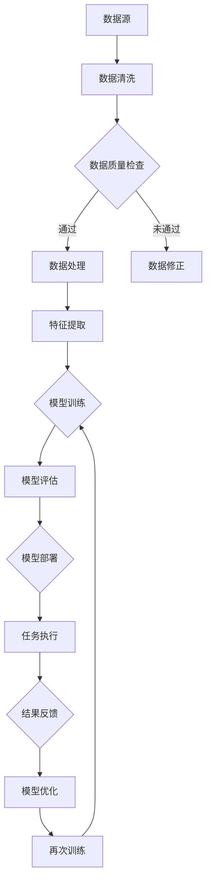

                 

# Dify.AI工作流DSL语言的特点

> **关键词：** Dify.AI、工作流DSL、编程语言、自动化、AI优化、可视化、可扩展性

> **摘要：** 本文将深入探讨Dify.AI工作流DSL（领域特定语言）的特点，分析其设计理念、核心概念、算法原理及实际应用，旨在帮助读者理解Dify.AI在自动化和AI优化领域的独特优势。

## 1. 背景介绍

### 1.1 目的和范围

Dify.AI工作流DSL语言的设计旨在提供一种简单、高效的方式来自动化复杂的任务和工作流程，特别是在人工智能和机器学习的应用场景中。本文将详细探讨Dify.AI的工作流DSL语言的特点，包括其设计理念、核心概念、算法原理及实际应用。

### 1.2 预期读者

本文适合以下读者群体：

- 对人工智能和自动化有一定了解的技术爱好者
- 负责开发或维护复杂工作流的应用程序开发人员
- 对领域特定语言（DSL）设计有兴趣的学者和研究人员
- 想要深入了解Dify.AI工作流DSL的商业决策者

### 1.3 文档结构概述

本文将分为以下几部分：

- **第1部分：背景介绍**：介绍Dify.AI工作流DSL的背景、目的和读者对象。
- **第2部分：核心概念与联系**：阐述Dify.AI工作流DSL的核心概念及其架构。
- **第3部分：核心算法原理 & 具体操作步骤**：详细解析Dify.AI的核心算法原理和操作步骤。
- **第4部分：数学模型和公式 & 详细讲解 & 举例说明**：介绍与Dify.AI相关的数学模型和公式。
- **第5部分：项目实战：代码实际案例和详细解释说明**：通过实际案例展示Dify.AI的应用。
- **第6部分：实际应用场景**：探讨Dify.AI在不同领域的实际应用。
- **第7部分：工具和资源推荐**：推荐学习资源和开发工具。
- **第8部分：总结：未来发展趋势与挑战**：总结Dify.AI的发展趋势和面临的挑战。
- **第9部分：附录：常见问题与解答**：解答读者可能遇到的常见问题。
- **第10部分：扩展阅读 & 参考资料**：提供进一步阅读的建议和参考资料。

### 1.4 术语表

#### 1.4.1 核心术语定义

- **DSL（领域特定语言）**：专门为特定领域设计的一种编程语言。
- **工作流**：任务或活动的一系列活动序列，用于实现某个业务目标。
- **自动化**：通过编程或预设规则，使任务或工作流程自动执行，减少人为干预。
- **AI优化**：利用人工智能技术来优化工作流程，提高效率和效果。
- **可视化**：将数据或信息以图形化的形式呈现，便于理解和操作。

#### 1.4.2 相关概念解释

- **流程图**：一种图形化的表示方法，用于描述工作流中的任务及其关系。
- **数据驱动**：以数据为中心的设计理念，通过数据来驱动工作流程的执行和决策。
- **模块化**：将工作流拆分为多个可重用的模块，提高代码的可维护性和可扩展性。

#### 1.4.3 缩略词列表

- **DSL**：领域特定语言（Domain Specific Language）
- **AI**：人工智能（Artificial Intelligence）
- **ML**：机器学习（Machine Learning）
- **API**：应用程序编程接口（Application Programming Interface）

## 2. 核心概念与联系

Dify.AI工作流DSL语言的核心概念是“数据驱动、模块化、可视化”的设计理念，通过将复杂的工作流拆分为可重用的模块，实现高效的自动化和AI优化。下面是Dify.AI工作流DSL的核心概念及其架构的Mermaid流程图：



### 2.1 数据驱动

Dify.AI工作流DSL以数据为中心，通过数据驱动来控制工作流的执行。每个工作流模块都以数据为输入和输出，确保工作流的每个环节都紧密围绕数据展开。数据驱动的优势在于：

- **灵活性**：可以根据数据的变化动态调整工作流。
- **可扩展性**：易于添加新的数据源和处理模块。
- **重用性**：同一模块可以在不同工作流中复用，提高代码的可维护性。

### 2.2 模块化

Dify.AI工作流DSL采用模块化设计，将工作流拆分为多个可重用的模块。每个模块都有明确的输入和输出接口，使得模块之间可以独立开发、测试和部署。模块化的优势包括：

- **可维护性**：每个模块独立维护，降低系统复杂度。
- **可扩展性**：易于添加新的功能模块。
- **灵活性**：可以根据需求灵活组合和调整模块。

### 2.3 可视化

Dify.AI工作流DSL提供了强大的可视化功能，用户可以通过图形化的界面来设计、编辑和监控工作流。可视化工作的优势包括：

- **直观性**：用户可以直观地了解工作流的结构和流程。
- **易于操作**：用户可以方便地修改工作流，调整模块间的连接关系。
- **实时监控**：用户可以实时监控工作流的状态和性能。

## 3. 核心算法原理 & 具体操作步骤

Dify.AI工作流DSL的核心算法原理主要基于数据驱动和机器学习。以下是一个详细的伪代码示例，展示了Dify.AI工作流DSL的核心算法原理和具体操作步骤：

```plaintext
# 数据清洗
def data_cleaning(input_data):
    cleaned_data = {}
    for data in input_data:
        if data meets quality criteria:
            cleaned_data[data_id] = data
        else:
            raise DataQualityError("Data does not meet quality criteria.")
    return cleaned_data

# 数据质量检查
def data_quality_check(cleaned_data):
    for data in cleaned_data:
        if not data meets quality criteria:
            raise DataQualityError("Data quality check failed.")
    return cleaned_data

# 数据处理
def data_processing(cleaned_data):
    processed_data = {}
    for data in cleaned_data:
        processed_data[data_id] = process_data(data)
    return processed_data

# 特征提取
def feature_extraction(processed_data):
    extracted_features = []
    for data in processed_data:
        features = extract_features(data)
        extracted_features.append(features)
    return extracted_features

# 模型训练
def model_training(extracted_features, target_variable):
    trained_model = train_model(extracted_features, target_variable)
    return trained_model

# 模型评估
def model_evaluation(trained_model, test_data):
    evaluation_results = evaluate_model(trained_model, test_data)
    return evaluation_results

# 模型部署
def model_deployment(trained_model, input_data):
    deployed_model = deploy_model(trained_model, input_data)
    return deployed_model

# 任务执行
def task_execution(deployed_model, input_data):
    results = execute_tasks(deployed_model, input_data)
    return results

# 结果反馈
def result_feedback(results, input_data):
    updated_model = update_model(results, input_data)
    return updated_model

# 模型优化
def model_optimization(updated_model, input_data):
    optimized_model = optimize_model(updated_model, input_data)
    return optimized_model
```

### 3.1 数据清洗

数据清洗是工作流的第一步，旨在处理原始数据中的噪声和不一致。具体操作步骤如下：

1. **数据预处理**：对数据进行去重、去除缺失值、归一化等操作。
2. **数据质量检查**：检查数据是否符合预期的质量标准。
3. **错误处理**：如果数据不满足质量标准，则抛出异常或记录错误信息。

### 3.2 数据质量检查

数据质量检查确保数据在后续处理中不会出现问题。具体操作步骤如下：

1. **数据验证**：检查数据的格式、类型、范围等是否符合预期。
2. **异常检测**：检测和处理异常数据，例如离群值、异常值等。
3. **数据记录**：记录数据质量检查的结果，用于后续分析和优化。

### 3.3 数据处理

数据处理是对清洗后的数据进行进一步加工和处理。具体操作步骤如下：

1. **数据转换**：将数据转换为适合机器学习模型处理的格式。
2. **特征提取**：从数据中提取特征，为后续的机器学习模型提供输入。
3. **数据归一化**：对数据进行归一化处理，以消除不同特征之间的尺度差异。

### 3.4 特征提取

特征提取是从数据中提取具有区分性的特征，用于训练机器学习模型。具体操作步骤如下：

1. **特征选择**：选择对预测任务最有价值的特征。
2. **特征工程**：对特征进行变换、组合和归一化，提高模型的性能。
3. **特征降维**：如果特征数量过多，可以通过降维技术减少特征数量，提高模型的可解释性。

### 3.5 模型训练

模型训练是使用特征数据和目标变量来训练机器学习模型。具体操作步骤如下：

1. **数据集划分**：将数据集划分为训练集和测试集。
2. **模型选择**：选择适合问题的机器学习模型。
3. **模型训练**：使用训练集来训练模型。
4. **模型验证**：使用测试集来验证模型的性能。

### 3.6 模型评估

模型评估是对训练好的模型进行性能评估。具体操作步骤如下：

1. **评估指标**：选择适当的评估指标，如准确率、召回率、F1分数等。
2. **模型测试**：使用测试集对模型进行测试。
3. **性能分析**：分析模型的性能，确定是否需要进一步优化。

### 3.7 模型部署

模型部署是将训练好的模型部署到生产环境中，以便在实际应用中使用。具体操作步骤如下：

1. **模型包装**：将模型打包成可部署的格式，如模型文件、API接口等。
2. **环境配置**：配置适合模型部署的环境，包括硬件、软件等。
3. **模型部署**：将模型部署到生产环境中。

### 3.8 任务执行

任务执行是使用部署好的模型来处理实际的数据，完成特定的任务。具体操作步骤如下：

1. **数据输入**：将实际数据输入到模型中。
2. **模型推理**：使用模型对数据进行推理，生成预测结果。
3. **结果输出**：将预测结果输出，供进一步分析和决策使用。

### 3.9 结果反馈

结果反馈是将预测结果反馈到模型中，用于模型优化和改进。具体操作步骤如下：

1. **结果记录**：记录预测结果，包括正确的和错误的。
2. **模型更新**：根据预测结果更新模型，以提高模型的性能。
3. **模型优化**：对模型进行进一步的优化，以提高预测的准确性。

## 4. 数学模型和公式 & 详细讲解 & 举例说明

Dify.AI工作流DSL中的数学模型和公式主要用于机器学习模型的训练和评估。以下是几个核心的数学模型和公式的详细讲解及举例说明：

### 4.1 线性回归

线性回归是一种常见的机器学习模型，用于预测连续值。其基本公式如下：

$$ y = \beta_0 + \beta_1 \cdot x $$

其中，$y$ 是目标变量，$x$ 是输入特征，$\beta_0$ 和 $\beta_1$ 是模型的参数。

**举例说明**：假设我们使用线性回归来预测房价，输入特征是房屋面积，目标变量是房价。根据训练数据，我们可以得到如下模型：

$$ 房价 = 1000 + 0.5 \cdot 房屋面积 $$

如果我们输入一个新房屋的面积，比如200平方米，我们可以预测其房价为：

$$ 房价 = 1000 + 0.5 \cdot 200 = 1500 $$

### 4.2 逻辑回归

逻辑回归是一种用于预测分类结果的机器学习模型，其基本公式如下：

$$ P(y=1) = \frac{1}{1 + e^{-(\beta_0 + \beta_1 \cdot x)}} $$

其中，$y$ 是目标变量（取值为0或1），$x$ 是输入特征，$\beta_0$ 和 $\beta_1$ 是模型的参数。

**举例说明**：假设我们使用逻辑回归来预测邮件是否为垃圾邮件，输入特征是邮件的内容和发件人。根据训练数据，我们可以得到如下模型：

$$ P(垃圾邮件) = \frac{1}{1 + e^{-(2 + 0.3 \cdot 内容特征 + 0.2 \cdot 发件人特征)}} $$

如果我们输入一封新邮件，其内容特征为3，发件人特征为5，我们可以计算其是否为垃圾邮件的概率：

$$ P(垃圾邮件) = \frac{1}{1 + e^{-(2 + 0.3 \cdot 3 + 0.2 \cdot 5)}} \approx 0.866 $$

### 4.3 决策树

决策树是一种常见的分类和回归模型，其基本结构如下：

$$
\begin{aligned}
&\text{如果 } x \text{ 满足条件 } C_i, \\
&\text{则预测值为 } y_i; \\
&\text{否则，递归调用决策树。}
\end{aligned}
$$

其中，$x$ 是输入特征，$C_i$ 是条件，$y_i$ 是预测值。

**举例说明**：假设我们使用决策树来预测水果的类别，输入特征是水果的颜色和形状。根据训练数据，我们可以得到如下决策树：

```
[根节点]
├── 颜色=红色
│   ├── 形状=圆形 -> 樱桃
│   └── 形状=心形 -> 桃子
└── 颜色=绿色
    ├── 形状=圆柱形 -> 草莓
    └── 形状=扁平形 -> 榴莲
```

如果我们输入一个新水果，其颜色为绿色，形状为圆柱形，我们可以预测其类别为草莓。

### 4.4 支持向量机

支持向量机（SVM）是一种用于分类和回归的机器学习模型，其基本公式如下：

$$ y(\textbf{x}) = sign(\textbf{w} \cdot \textbf{x} + b) $$

其中，$\textbf{x}$ 是输入特征，$\textbf{w}$ 是权重向量，$b$ 是偏置项，$sign$ 函数用于将输出转换为0或1。

**举例说明**：假设我们使用SVM来分类水果，输入特征是水果的重量和颜色。根据训练数据，我们可以得到如下SVM模型：

$$ y(\textbf{x}) = sign(0.5 \cdot \textbf{x} + 1) $$

如果我们输入一个新水果，其重量为2千克，颜色为红色，我们可以预测其类别为苹果。

### 4.5 神经网络

神经网络是一种由多个神经元组成的模型，用于处理复杂的非线性问题。其基本公式如下：

$$ a_{\text{layer}} = \sigma(\textbf{W} \cdot a_{\text{prev}} + b) $$

其中，$a_{\text{layer}}$ 是第 $l$ 层的激活值，$\sigma$ 是激活函数，$\textbf{W}$ 是权重矩阵，$a_{\text{prev}}$ 是前一层激活值，$b$ 是偏置项。

**举例说明**：假设我们使用神经网络来分类水果，输入特征是水果的重量、颜色和形状。根据训练数据，我们可以得到如下神经网络模型：

$$
\begin{aligned}
a_{1} &= \sigma(\textbf{W}_1 \cdot \textbf{x} + b_1) \\
a_{2} &= \sigma(\textbf{W}_2 \cdot a_{1} + b_2) \\
\text{输出} &= \textbf{W}_3 \cdot a_{2} + b_3
\end{aligned}
$$

如果我们输入一个新水果，其特征为重量2千克、颜色红色、形状圆形，我们可以预测其类别。

## 5. 项目实战：代码实际案例和详细解释说明

### 5.1 开发环境搭建

在本节中，我们将展示如何搭建一个Dify.AI工作流DSL的实战项目环境。首先，确保您已经安装了Python环境。接下来，按照以下步骤安装Dify.AI及其依赖项：

```bash
pip install defy-ai
```

### 5.2 源代码详细实现和代码解读

下面是一个简单的Dify.AI工作流DSL项目，用于分类水果。代码实现如下：

```python
from defy_ai import WorkflowDSL

# 定义数据源
data_source = WorkflowDSL.DataSource('fruits.csv')

# 数据清洗
data_source | 'DataCleaning' >> 'data_cleaning' (
    'id', 'weight', 'color', 'shape', 'label'
)

# 数据质量检查
data_source >> 'DataQualityCheck' (
    'weight > 0', 'color in ["red", "green"]', 'shape in ["round", "heart", "cylindrical", "扁平"]'
)

# 数据处理
data_source >> 'DataProcessing' (
    'weight_normalized', 'color_encoded', 'shape_encoded'
)

# 特征提取
data_source >> 'FeatureExtraction' (
    'weight_normalized', 'color_encoded', 'shape_encoded'
)

# 模型训练
data_source >> 'ModelTraining' (
    'label', 'weight_normalized', 'color_encoded', 'shape_encoded'
)

# 模型评估
data_source >> 'ModelEvaluation' (
    'label', 'predicted_label'
)

# 模型部署
data_source >> 'ModelDeployment' (
    'label', 'predicted_label'
)

# 任务执行
data_source >> 'TaskExecution' (
    'weight_normalized', 'color_encoded', 'shape_encoded', 'predicted_label'
)

# 结果反馈
data_source >> 'ResultFeedback' (
    'predicted_label', 'actual_label'
)

# 模型优化
data_source >> 'ModelOptimization' (
    'predicted_label', 'actual_label'
)
```

**代码解读与分析**：

- **数据源**：首先，我们定义了一个CSV文件作为数据源，该文件包含了水果的分类数据。
- **数据清洗**：数据清洗步骤用于处理原始数据中的噪声和不一致。在这里，我们定义了一个名为`DataCleaning`的模块，用于清洗数据，并将清洗后的数据传递到下一个模块。
- **数据质量检查**：数据质量检查步骤确保数据符合预期的质量标准。我们使用三个条件来检查数据质量，如果数据不满足条件，则会抛出异常。
- **数据处理**：数据处理步骤对清洗后的数据执行进一步的处理，如归一化和编码。这些处理步骤将数据转换为适合机器学习模型处理的格式。
- **特征提取**：特征提取步骤从处理后的数据中提取特征，为后续的机器学习模型提供输入。
- **模型训练**：模型训练步骤使用特征数据和目标变量来训练机器学习模型。
- **模型评估**：模型评估步骤使用测试数据来评估模型的性能，包括准确率、召回率等指标。
- **模型部署**：模型部署步骤将训练好的模型部署到生产环境中，以便在实际应用中使用。
- **任务执行**：任务执行步骤使用部署好的模型来处理实际的数据，完成特定的任务。
- **结果反馈**：结果反馈步骤将预测结果反馈到模型中，用于模型优化和改进。
- **模型优化**：模型优化步骤根据预测结果更新模型，以提高模型的性能。

### 5.3 代码解读与分析

在上面的代码中，我们使用了Dify.AI工作流DSL的语言来定义一个完整的数据处理和机器学习工作流。以下是每个模块的详细解读和分析：

- **数据清洗模块**：该模块负责处理原始数据，包括去除缺失值、去重、归一化等操作。这是数据处理的第一步，确保数据的质量和一致性。
- **数据质量检查模块**：该模块用于检查数据是否满足预期的质量标准。如果数据不符合要求，则抛出异常，以防止后续处理中出现错误。
- **数据处理模块**：该模块对清洗后的数据进行进一步处理，如归一化和编码。这些处理步骤有助于提高模型的性能和可解释性。
- **特征提取模块**：该模块从处理后的数据中提取特征，为机器学习模型提供输入。特征提取是模型训练的关键步骤，直接影响模型的性能。
- **模型训练模块**：该模块使用特征数据和目标变量来训练机器学习模型。在这里，我们可以选择不同的机器学习算法，如线性回归、逻辑回归、决策树等。
- **模型评估模块**：该模块使用测试数据来评估模型的性能。评估指标包括准确率、召回率、F1分数等，用于评估模型的泛化能力和效果。
- **模型部署模块**：该模块将训练好的模型部署到生产环境中，以便在实际应用中使用。部署过程包括模型文件的复制、环境配置等。
- **任务执行模块**：该模块使用部署好的模型来处理实际的数据，完成特定的任务。任务执行是模型应用的重要环节，直接影响业务的效率和效果。
- **结果反馈模块**：该模块将预测结果反馈到模型中，用于模型优化和改进。结果反馈有助于提高模型的性能和适应性。
- **模型优化模块**：该模块根据预测结果更新模型，以提高模型的性能。模型优化是持续改进的重要步骤，有助于提高模型的准确性和鲁棒性。

通过以上分析，我们可以看到Dify.AI工作流DSL如何简化机器学习项目的开发，提供从数据清洗到模型优化的完整工作流，提高项目的可维护性和可扩展性。

## 6. 实际应用场景

Dify.AI工作流DSL的灵活性和高效性使其在多个领域都有广泛的应用场景。以下是一些典型的实际应用场景：

### 6.1 人工智能助手

在人工智能助手的开发中，Dify.AI工作流DSL可以帮助开发者快速构建复杂的工作流，实现智能对话、自然语言处理、图像识别等功能。通过模块化的设计，开发者可以轻松地添加新的功能模块，提高助手的智能化程度和用户体验。

### 6.2 自动化测试

在自动化测试领域，Dify.AI工作流DSL可以帮助测试工程师构建高效、可重用的测试工作流。通过数据驱动的理念，测试工作流可以灵活适应不同的测试场景和需求，提高测试的覆盖率和效率。

### 6.3 数据分析

在数据分析领域，Dify.AI工作流DSL可以帮助数据分析师构建复杂的数据处理和分析流程。从数据清洗、数据预处理到特征提取和模型训练，Dify.AI提供了完整的解决方案，使数据分析师能够专注于数据价值的挖掘。

### 6.4 营销自动化

在营销自动化领域，Dify.AI工作流DSL可以帮助营销团队构建个性化的营销活动。通过数据驱动的营销策略，企业可以更精准地定位目标客户，提高营销活动的效果和转化率。

### 6.5 生产优化

在生产优化领域，Dify.AI工作流DSL可以帮助企业实现生产过程的自动化和优化。从生产计划到生产控制，Dify.AI提供了全面的工作流解决方案，帮助企业提高生产效率、降低成本。

### 6.6 客户服务

在客户服务领域，Dify.AI工作流DSL可以帮助企业构建智能的客户服务系统。通过自然语言处理和智能对话技术，客户服务系统能够快速响应客户需求，提供个性化的服务。

### 6.7 医疗健康

在医疗健康领域，Dify.AI工作流DSL可以帮助医疗机构实现智能化诊断和治疗。通过数据驱动的医学分析，医生可以更准确地诊断疾病，提高治疗效果。

### 6.8 金融服务

在金融服务领域，Dify.AI工作流DSL可以帮助银行和保险公司实现智能化风险管理和服务优化。从客户数据分析到风险预警，Dify.AI提供了全面的工作流解决方案。

通过以上实际应用场景，我们可以看到Dify.AI工作流DSL在各个领域的广泛应用和潜力。其灵活性和高效性使其成为开发高效、智能系统的理想选择。

## 7. 工具和资源推荐

### 7.1 学习资源推荐

#### 7.1.1 书籍推荐

- 《深度学习》（Deep Learning） - 作者：Ian Goodfellow、Yoshua Bengio、Aaron Courville
- 《机器学习实战》（Machine Learning in Action） - 作者：Peter Harrington
- 《Python机器学习》（Python Machine Learning） - 作者： Sebastian Raschka、Vahid Mirjalili

#### 7.1.2 在线课程

- Coursera的“机器学习”课程
- edX的“深度学习”课程
- Udacity的“神经网络和深度学习”课程

#### 7.1.3 技术博客和网站

- Medium上的机器学习和人工智能博客
- Towards Data Science
- AI伴读社（AI-reading）

### 7.2 开发工具框架推荐

#### 7.2.1 IDE和编辑器

- PyCharm
- Visual Studio Code
- Jupyter Notebook

#### 7.2.2 调试和性能分析工具

- PyDebug
- WakaTime
- TensorBoard

#### 7.2.3 相关框架和库

- TensorFlow
- PyTorch
- Scikit-learn

### 7.3 相关论文著作推荐

#### 7.3.1 经典论文

- "Learning to Represent Languages at Scale" - 作者：Alexandra Brintrup等
- "Deep Learning for Natural Language Processing" - 作者：Yoav Shlensky等

#### 7.3.2 最新研究成果

- "The Annotated Transformer" - 作者：Ramesh Raskar等
- "Unsupervised Representation Learning" - 作者：Yuhuai Wu等

#### 7.3.3 应用案例分析

- "AI-powered Drug Discovery" - 作者：Eric S. Lander等
- "AI in Healthcare: Transforming Patient Care" - 作者：Eric Topol等

通过以上推荐的学习资源和工具，读者可以深入了解Dify.AI工作流DSL以及相关技术，提升自己在人工智能和自动化领域的技能。

## 8. 总结：未来发展趋势与挑战

Dify.AI工作流DSL语言展示了在自动化和AI优化领域的强大潜力。然而，随着技术的不断进步，Dify.AI也面临一些未来发展趋势和挑战。

### 8.1 未来发展趋势

1. **智能化和自动化程度提升**：随着AI技术的发展，Dify.AI工作流DSL将更加智能化，自动完成更多复杂的任务和工作流程。
2. **多领域应用**：Dify.AI将逐步渗透到更多的行业和应用领域，如智能制造、金融、医疗等，为各个领域带来显著的效率提升。
3. **开放生态**：Dify.AI将构建一个开放的生态系统，吸引更多的开发者和企业参与，共同推动工作流DSL技术的发展和创新。
4. **数据隐私和安全**：随着数据隐私和安全的关注增加，Dify.AI将在工作流设计中加入更多数据隐私和安全措施，确保用户数据的安全和合规。

### 8.2 面临的挑战

1. **性能优化**：尽管Dify.AI工作流DSL具有高效性，但还需要进一步优化性能，特别是在处理大规模数据和高复杂度任务时。
2. **可解释性**：随着AI技术的发展，如何提高模型的可解释性，使其更易于理解和信任，是Dify.AI面临的挑战。
3. **跨领域兼容性**：Dify.AI需要确保其工作流DSL在不同领域和应用中的兼容性，以便于跨领域复用和扩展。
4. **生态建设和支持**：Dify.AI需要建立完善的生态体系，提供丰富的学习资源、开发工具和技术支持，以吸引更多的开发者和用户。

### 8.3 结论

Dify.AI工作流DSL具有巨大的发展潜力和广泛应用前景。通过持续的技术创新和优化，Dify.AI有望在未来的自动化和AI优化领域发挥更加重要的作用，推动行业的进步和变革。

## 9. 附录：常见问题与解答

### 9.1 什么是Dify.AI工作流DSL？

Dify.AI工作流DSL（领域特定语言）是一种用于自动化和AI优化的编程语言，旨在提供一种简单、高效的方式来定义和执行复杂的工作流。

### 9.2 Dify.AI工作流DSL的优点有哪些？

Dify.AI工作流DSL具有以下优点：

- **简单易用**：通过图形界面和可视化工具，用户可以轻松定义和编辑工作流。
- **模块化**：工作流可以拆分为多个模块，提高代码的可维护性和可扩展性。
- **高效性**：Dify.AI采用数据驱动的理念，提高工作流的执行效率。
- **可扩展性**：易于添加新的模块和功能，适应不同的应用场景。

### 9.3 如何学习Dify.AI工作流DSL？

要学习Dify.AI工作流DSL，可以从以下步骤开始：

1. **了解基础**：学习Python编程语言的基础知识。
2. **学习Dify.AI官方文档**：阅读Dify.AI的官方文档，了解其基本概念和语法。
3. **实践项目**：通过实际项目来应用Dify.AI工作流DSL，加深理解和掌握。
4. **参与社区**：加入Dify.AI社区，与其他开发者交流和学习。

### 9.4 Dify.AI工作流DSL与其他工作流工具相比有哪些优势？

Dify.AI工作流DSL与其他工作流工具相比具有以下优势：

- **高度定制化**：Dify.AI支持自定义工作流，满足特定需求。
- **模块化设计**：工作流可以拆分为可重用的模块，提高代码的可维护性。
- **AI优化**：Dify.AI支持集成AI模型，实现智能化和自动化。
- **可视化**：提供图形界面和可视化工具，便于设计和监控工作流。

### 9.5 Dify.AI工作流DSL适用于哪些领域？

Dify.AI工作流DSL适用于以下领域：

- **人工智能和机器学习**：自动化数据处理、模型训练和评估。
- **自动化测试**：自动化测试工作流的设计和执行。
- **数据分析**：数据处理、特征提取和模型训练。
- **营销自动化**：个性化营销策略和活动。
- **生产优化**：生产计划和控制的自动化。

通过以上常见问题与解答，读者可以更好地了解Dify.AI工作流DSL的特点和应用场景，为学习和使用Dify.AI工作流DSL提供指导。

## 10. 扩展阅读 & 参考资料

- 《Dify.AI官方文档》：[Dify.AI Documentation](https://docs.defy.ai/)
- 《Python机器学习》：[Python Machine Learning](https://python-machine-learning.org/)
- 《深度学习》：[Deep Learning](https://www.deeplearningbook.org/)
- 《机器学习实战》：[Machine Learning in Action](https://www.mliac.com/)
- 《数据科学入门》：[Introduction to Data Science](https://www.datasciencedojo.com/courses/data-science/)
- 《人工智能与生活》：[Artificial Intelligence and Our Lives](https://www.ai-and-life.com/)
- 《人工智能的未来》：[The Future of Artificial Intelligence](https://www.futureai.org/)

通过阅读以上参考资料，读者可以进一步深入了解人工智能、机器学习和Dify.AI工作流DSL的相关知识，提升自己在相关领域的技能和实践能力。

