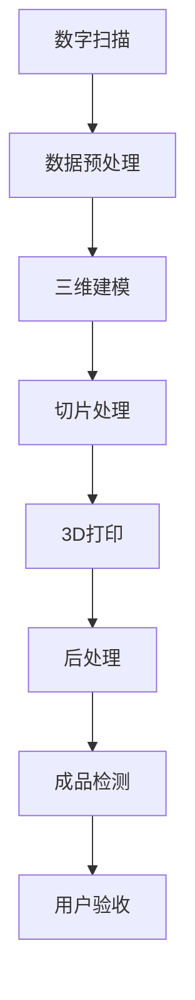

                 

# 3D打印假肢定制：医疗辅助器械的创新服务

> 关键词：3D打印、假肢、医疗辅助、个性化定制、创新服务

> 摘要：本文将深入探讨3D打印技术在假肢定制领域的应用，以及这一创新服务对医疗辅助器械行业的深远影响。通过分析3D打印技术的核心优势，我们将一步步解析其原理和操作步骤，并结合实际案例，展示其在医疗辅助器械领域的卓越表现。

## 1. 背景介绍

### 1.1 目的和范围

本文旨在介绍3D打印假肢定制技术在医疗辅助器械领域的应用，分析其技术优势，并探讨其对未来医疗服务的潜在影响。具体而言，本文将涵盖以下内容：

- 3D打印假肢的基本概念与原理
- 3D打印技术在假肢定制中的应用案例
- 3D打印假肢定制流程的详细解析
- 3D打印技术在医疗辅助器械领域的未来发展趋势

### 1.2 预期读者

本文主要面向以下读者群体：

- 对3D打印技术感兴趣的科技爱好者
- 医疗器械行业从业者
- 医疗辅助设备研发人员
- 对医疗服务创新有浓厚兴趣的从业者

### 1.3 文档结构概述

本文的结构如下：

- **第1章：背景介绍**：介绍本文的目的、预期读者和文档结构。
- **第2章：核心概念与联系**：阐述3D打印技术的核心概念和流程。
- **第3章：核心算法原理 & 具体操作步骤**：详细讲解3D打印技术的算法原理和操作步骤。
- **第4章：数学模型和公式 & 详细讲解 & 举例说明**：介绍3D打印技术相关的数学模型和公式。
- **第5章：项目实战：代码实际案例和详细解释说明**：展示3D打印技术的实际应用案例。
- **第6章：实际应用场景**：探讨3D打印技术在医疗辅助器械领域的应用场景。
- **第7章：工具和资源推荐**：推荐相关学习资源、开发工具和最新研究成果。
- **第8章：总结：未来发展趋势与挑战**：总结3D打印假肢定制技术的未来趋势和挑战。
- **第9章：附录：常见问题与解答**：回答读者可能遇到的常见问题。
- **第10章：扩展阅读 & 参考资料**：提供更多的参考资料和扩展阅读。

### 1.4 术语表

#### 1.4.1 核心术语定义

- **3D打印**：一种通过逐层叠加材料来制造三维实体的技术。
- **假肢**：用于替代缺失身体部位的医疗设备。
- **个性化定制**：根据用户需求定制化生产产品。
- **医疗辅助器械**：用于辅助患者康复、治疗的设备。

#### 1.4.2 相关概念解释

- **数字建模**：通过计算机软件创建三维模型的过程。
- **增材制造**：与传统的减材制造相对，指通过逐层添加材料来制造产品。
- **快速原型制造**：利用3D打印技术快速制作出产品原型。

#### 1.4.3 缩略词列表

- **3D打印**：3D Printing
- **假肢**：Prosthesis
- **医疗辅助器械**：Medical Assistive Device

## 2. 核心概念与联系

为了更好地理解3D打印假肢定制技术的原理，我们首先需要了解其核心概念和流程。以下是一个简单的Mermaid流程图，展示了3D打印假肢定制的基本流程。



### 2.1 数字扫描

数字扫描是3D打印假肢定制的第一步。通过高精度的三维扫描设备，对患者缺失的肢体进行全方位扫描，生成详细的三维数据模型。

### 2.2 数据预处理

获取的三维数据可能包含噪声和误差，因此需要进行数据预处理。这一步骤包括数据清洗、平滑、简化等操作，以确保数据模型的准确性。

### 2.3 三维建模

在预处理后的三维数据基础上，通过专业软件进行三维建模。这一步骤需要设计者具备较高的专业素养，以确保假肢的形态和功能符合患者的需求。

### 2.4 切片处理

将三维模型转化为3D打印机的加工指令，即切片处理。这一步骤需要考虑材料特性、打印速度等因素，以优化打印效果。

### 2.5 3D打印

利用3D打印机按照切片处理生成的指令，逐层叠加材料，制造出三维实体假肢。

### 2.6 后处理

3D打印完成后，需要对假肢进行打磨、装配等后处理，以使其达到预期的使用效果。

### 2.7 成品检测

对完成的假肢进行全面的检测，包括外观、尺寸、功能等方面的检查，确保其质量符合标准。

### 2.8 用户验收

将完成的假肢交付给患者，进行实际使用和验收。这一步骤对于评估3D打印假肢的实用性和患者满意度至关重要。

## 3. 核心算法原理 & 具体操作步骤

### 3.1 核心算法原理

3D打印假肢定制技术的核心算法主要包括数字建模和切片处理。以下分别进行详细解释。

### 3.1.1 数字建模

数字建模的主要任务是根据三维扫描数据生成逼真的三维模型。其基本原理如下：

1. **数据采集**：通过高精度的三维扫描设备获取目标肢体的三维数据。
2. **数据处理**：对采集到的数据进行分析和清洗，去除噪声和错误。
3. **模型重建**：利用计算机图形学算法，将处理后的数据转换为三维模型。
4. **模型优化**：对生成的模型进行优化，以提高打印质量和降低成本。

### 3.1.2 切片处理

切片处理是将三维模型转化为3D打印机可以理解的二维切片的过程。其基本原理如下：

1. **模型预处理**：对三维模型进行分割，将其分解为多个平面图形。
2. **切片生成**：将每个平面图形按照一定顺序排列，生成二维切片。
3. **路径规划**：根据材料特性、打印速度等因素，确定打印路径，以优化打印效果。
4. **切片存储**：将生成的切片数据存储为3D打印机可以读取的格式，如STL文件。

### 3.2 具体操作步骤

以下是一个简化的3D打印假肢定制流程，用于说明核心算法的具体操作步骤。

#### 3.2.1 数字扫描

1. **准备设备**：选择适合的三维扫描设备，如激光扫描仪或结构光扫描仪。
2. **扫描过程**：将患者缺失的肢体放置在扫描设备上，进行全方位扫描。
3. **数据获取**：获取三维扫描数据，通常为PLY或PLY格式的文件。

#### 3.2.2 数据预处理

1. **数据清洗**：去除扫描过程中产生的噪声和错误，如缺失点、异常点等。
2. **数据平滑**：对扫描数据进行平滑处理，以提高数据质量。
3. **数据简化**：对扫描数据进行简化，以减少数据量，提高处理速度。

#### 3.2.3 三维建模

1. **模型重建**：利用计算机图形学算法，将预处理后的数据转换为三维模型。
2. **模型优化**：对生成的模型进行优化，如去除多余结构、简化网格等，以提高打印质量和降低成本。

#### 3.2.4 切片处理

1. **模型分割**：将三维模型分解为多个平面图形。
2. **切片生成**：根据材料特性和打印需求，生成二维切片。
3. **路径规划**：确定打印路径，以优化打印速度和效果。
4. **切片存储**：将生成的切片数据存储为3D打印机可以读取的格式，如STL文件。

#### 3.2.5 3D打印

1. **准备设备**：选择适合的3D打印机，如FDM打印机或SLA打印机。
2. **设置参数**：根据打印需求和材料特性，设置打印参数，如层厚、打印速度等。
3. **打印过程**：将生成的切片数据发送到3D打印机，进行逐层打印。
4. **打印监测**：实时监测打印过程，确保打印质量。

#### 3.2.6 后处理

1. **去除支撑**：对于需要支撑的部分，去除多余的支撑材料。
2. **打磨处理**：对打印完成的假肢进行打磨，使其表面光滑。
3. **装配调试**：将假肢各部分进行装配，并进行调试，以确保其功能和使用效果。

#### 3.2.7 成品检测

1. **外观检测**：检查假肢的外观，确保表面光滑、无损伤。
2. **尺寸检测**：测量假肢的尺寸，确保符合设计要求。
3. **功能检测**：测试假肢的功能，如运动范围、稳定性等，确保其满足使用需求。

#### 3.2.8 用户验收

1. **交付产品**：将完成的假肢交付给患者。
2. **使用指导**：向患者提供使用假肢的指导和注意事项。
3. **随访服务**：定期对患者进行随访，了解假肢的使用情况和效果，并根据需要提供相应的调整服务。

## 4. 数学模型和公式 & 详细讲解 & 举例说明

### 4.1 数学模型

在3D打印假肢定制过程中，涉及到的数学模型主要包括几何建模和材料力学模型。以下分别进行讲解。

### 4.1.1 几何建模

几何建模主要涉及三维空间中的几何形状和空间关系的处理。以下是一个简单的几何建模公式示例：

$$
P = (x, y, z)
$$

其中，$P$表示空间中的一点，$x$、$y$、$z$分别表示该点在三维空间中的坐标。

### 4.1.2 材料力学模型

材料力学模型用于描述材料在受力作用下的变形和强度。以下是一个简单的材料力学公式示例：

$$
F = k \cdot \Delta L
$$

其中，$F$表示作用在材料上的力，$k$表示材料的弹性系数，$\Delta L$表示材料在受力作用下的变形量。

### 4.2 详细讲解

#### 4.2.1 几何建模

几何建模是3D打印假肢定制的基础。在数字扫描过程中，通过获取目标肢体的三维数据，可以建立一个几何模型。以下是一个简单的几何建模流程：

1. **数据采集**：通过三维扫描设备获取目标肢体的三维数据。
2. **数据预处理**：对采集到的数据进行分析和清洗，去除噪声和错误。
3. **模型重建**：利用计算机图形学算法，将处理后的数据转换为三维模型。
4. **模型优化**：对生成的模型进行优化，以提高打印质量和降低成本。

#### 4.2.2 材料力学建模

在3D打印假肢定制过程中，材料力学建模用于评估假肢在受力作用下的变形和强度。以下是一个简单的材料力学建模流程：

1. **材料选择**：根据假肢的使用需求，选择合适的材料。
2. **力学测试**：对选定的材料进行力学测试，获取材料的弹性系数等参数。
3. **建模与仿真**：利用材料力学模型，对假肢在受力作用下的变形和强度进行仿真分析。
4. **优化设计**：根据仿真结果，对假肢的设计进行调整，以提高其性能。

### 4.3 举例说明

#### 4.3.1 几何建模实例

假设我们要为一个缺失一只手臂的患者设计一副假肢，首先需要获取其手臂的三维数据。以下是具体的几何建模过程：

1. **数据采集**：使用三维扫描设备对患者的手臂进行全方位扫描，获取三维数据。
2. **数据预处理**：对扫描数据进行清洗，去除噪声和错误，如缺失点、异常点等。
3. **模型重建**：利用计算机图形学算法，将预处理后的数据转换为三维模型。
4. **模型优化**：对生成的模型进行优化，如去除多余结构、简化网格等，以提高打印质量和降低成本。

#### 4.3.2 材料力学建模实例

假设我们要为一个缺失一只手臂的患者设计一副假肢，并评估其在受力作用下的变形和强度。以下是具体的材料力学建模过程：

1. **材料选择**：根据假肢的使用需求，选择一种高强度、轻质化的材料，如碳纤维复合材料。
2. **力学测试**：对选定的材料进行力学测试，获取材料的弹性系数等参数，如$k = 2000\text{N/m}$。
3. **建模与仿真**：利用材料力学模型，对假肢在受力作用下的变形和强度进行仿真分析。
4. **优化设计**：根据仿真结果，对假肢的设计进行调整，如增加支撑结构、优化材料分布等，以提高其性能。

## 5. 项目实战：代码实际案例和详细解释说明

在本节中，我们将通过一个实际项目案例来展示3D打印假肢定制的技术实现过程。这个案例将涉及到从数据采集、预处理，到三维建模、切片处理，再到3D打印和后处理的完整流程。以下是项目的详细步骤和代码实现。

### 5.1 开发环境搭建

在开始项目之前，我们需要搭建一个合适的开发环境。以下是推荐的开发工具和软件：

- **操作系统**：Windows、Linux或macOS
- **三维扫描设备**：例如，Ricoh 3D Scanner 或 Artec Eva
- **三维建模软件**：如Blender、SolidWorks 或 Fusion 360
- **3D打印机**：如Ultimaker S5或Form 3+
- **编程环境**：Python 3.x、Anaconda或Miniconda
- **开发工具**：Jupyter Notebook或PyCharm

### 5.2 源代码详细实现和代码解读

#### 5.2.1 数据采集

数据采集是3D打印假肢定制的第一步，我们需要使用三维扫描设备获取患者缺失肢体的高精度三维数据。以下是Python代码示例，用于处理扫描数据：

```python
import numpy as np
import open3d as o3d

def load_point_cloud(file_path):
    pcd = o3d.io.read_point_cloud(file_path)
    return pcd

def preprocess_point_cloud(pcd):
    # 降采样
    pcd = pcd.voxel_down_sample(voxel_size=0.05)
    # 去除异常点
    pcd = pcd.remove_statistical_outlier(nb_neighbors=20,
                                       std_ratio=2.0)
    # 平滑处理
    pcd = pcd.filter_smoothediterations(10)
    return pcd

# 加载点云数据
pcd = load_point_cloud('scan_data.ply')
# 预处理点云数据
preprocessed_pcd = preprocess_point_cloud(pcd)
```

#### 5.2.2 三维建模

在预处理完点云数据后，我们需要将其转换为三维模型。以下是使用Blender进行三维建模的Python脚本示例：

```python
import bpy

def create_model(pcd):
    # 创建新的Blender文件
    bpy.ops.wm.open_mainfile()
    # 添加新的网格对象
    mesh = bpy.data.meshes.new(name="Prosthesis")
    obj = bpy.data.objects.new(name="Prosthesis", object_data=mesh)
    bpy.context.collection.objects.link(obj)
    bpy.context.view_layer.objects.active = obj
    
    # 将点云数据转换为Blender网格
    vertices = np.array(pcd.points).astype(np.float32).tobytes()
    faces = np.array(pcd.triangles).astype(np.int32).tobytes()
    mesh.from_pydata(vertices, [], faces)
    mesh.update()
    return obj

# 创建三维模型
model = create_model(preprocessed_pcd)
```

#### 5.2.3 切片处理

切片处理是将三维模型转换为3D打印机可以理解的二维切片。以下是使用Cura进行切片处理的Python脚本示例：

```python
import cura

def slice_model(model_path, output_path):
    # 加载模型
    model = cura.models.Model.parse_from_file(model_path)
    # 设置切片参数
    config = cura.ConfigurationManager.get_global_instance()
    config.set_setting("layer_height", 0.2)
    config.set_setting("fill_density", 100)
    # 生成切片数据
    printer = cura.printer.Printer(config, None)
    printer.add_model(model)
    printer.plan()
    # 输出切片文件
    with open(output_path, 'wb') as f:
        f.write(printer.get_gcode())
    
slice_model('model.obj', 'sliced.gcode')
```

#### 5.2.4 3D打印

3D打印过程是将切片数据发送到3D打印机进行打印。以下是使用3D打印机进行打印的示例：

1. 将生成的`sliced.gcode`文件导入3D打印机控制软件。
2. 设置打印参数，如打印速度、温度等。
3. 开始打印。

#### 5.2.5 后处理

打印完成后，我们需要对假肢进行后处理，以使其达到预期的使用效果。以下是后处理的步骤：

1. **去除支撑**：对于需要支撑的部分，使用工具去除多余的支撑材料。
2. **打磨处理**：使用砂纸或打磨机，对假肢表面进行打磨，使其光滑。
3. **装配调试**：将假肢各部分进行装配，并进行调试，确保其功能和使用效果。

### 5.3 代码解读与分析

在本案例中，我们使用了Python语言和多个开源库来处理3D打印假肢定制的各个环节。以下是代码的解读与分析：

- **数据采集**：使用`open3d`库读取和预处理点云数据，确保数据质量。
- **三维建模**：使用Blender进行三维建模，将点云数据转换为三维模型。
- **切片处理**：使用Cura进行切片处理，将三维模型转换为3D打印机可以理解的二维切片。
- **3D打印**：使用3D打印机控制软件发送切片数据，进行打印。
- **后处理**：对打印完成的假肢进行打磨和装配，确保其使用效果。

通过这个实际案例，我们可以看到3D打印假肢定制技术从数据采集到最终成品的全过程。这个案例展示了3D打印技术在医疗辅助器械领域的广泛应用，以及其带来的便利和创新。

## 6. 实际应用场景

3D打印假肢定制技术在医疗辅助器械领域具有广泛的应用场景。以下是几个典型的实际应用案例：

### 6.1 截肢患者

对于截肢患者，3D打印假肢定制可以提供高度个性化的解决方案。通过数字扫描和建模，医生可以精确地了解患者的肢体形态，设计出贴合患者需求的假肢。例如，对于肘部截肢患者，3D打印假肢可以模拟出肘部的灵活性和稳定性，使其能够进行日常活动。

### 6.2 肢体缺陷

对于肢体缺陷患者，如先天性短肢畸形或肢体发育不全，3D打印假肢定制可以提供定制化的解决方案。通过个性化的设计和制造，假肢可以最大程度地恢复患者的功能，提高其生活质量。

### 6.3 复杂手术后的康复

在复杂手术后，如肢体截肢或骨骼修复手术后，患者可能需要辅助设备来帮助康复。3D打印假肢可以快速制造出符合患者需求的辅助设备，缩短康复周期。

### 6.4 残奥会运动员

对于残奥会运动员，3D打印假肢定制可以提供高性能的竞技装备。通过优化设计，假肢可以提升运动员的竞技表现，帮助他们在比赛中取得更好的成绩。

### 6.5 研发和测试

在医疗辅助器械的研发和测试阶段，3D打印假肢定制技术可以快速制造出原型，帮助工程师和设计师验证设计方案的可行性。通过多次迭代，可以优化产品设计，提高产品质量。

### 6.6 教育和培训

3D打印假肢定制技术还可以用于教育和培训。医学院校和康复中心可以使用3D打印假肢作为教学工具，帮助学生和医护人员了解假肢的设计和制造过程，提高专业技能。

### 6.7 社会福利

3D打印假肢定制技术可以降低假肢的生产成本，使得更多截肢患者能够负担得起高质量的假肢。这有助于提高社会福利，减少患者的经济负担。

通过这些实际应用场景，我们可以看到3D打印假肢定制技术在医疗辅助器械领域的广泛应用和深远影响。随着技术的不断进步，3D打印假肢定制将为更多患者带来福祉。

## 7. 工具和资源推荐

为了更好地掌握3D打印假肢定制技术，以下是相关的学习资源、开发工具和最新研究成果的推荐。

### 7.1 学习资源推荐

#### 7.1.1 书籍推荐

1. **《3D打印技术与应用》**：详细介绍了3D打印的基本原理、技术和应用案例。
2. **《三维建模与打印技术》**：涵盖了三维建模的基本方法和3D打印技术的应用。

#### 7.1.2 在线课程

1. **Coursera上的《3D打印技术》**：由麻省理工学院教授授课，涵盖3D打印的基础知识和应用。
2. **Udemy上的《3D建模与打印》**：提供全面的3D建模和3D打印教程，适合初学者。

#### 7.1.3 技术博客和网站

1. **3D Hubs**：提供3D打印服务和相关资源，包括教程和案例分享。
2. **3D Printing Industry**：提供最新的3D打印新闻、技术和应用案例。

### 7.2 开发工具框架推荐

#### 7.2.1 IDE和编辑器

1. **PyCharm**：强大的Python开发环境，适用于3D打印相关编程。
2. **Visual Studio Code**：轻量级、可扩展的代码编辑器，支持多种编程语言。

#### 7.2.2 调试和性能分析工具

1. **GDB**：Linux下的调试工具，适用于C/C++编程。
2. **LLDB**：MacOS下的调试工具，功能强大。

#### 7.2.3 相关框架和库

1. **Blender**：开源的三维建模软件，适用于假肢建模。
2. **Cura Engine**：3D打印切片处理软件，支持多种打印机和材料。

### 7.3 相关论文著作推荐

#### 7.3.1 经典论文

1. **"Additive Manufacturing Technologies: A Literature Review"**：对增材制造技术进行全面综述。
2. **"Patient-Specific Prosthetics Using Additive Manufacturing"**：讨论了3D打印在假肢定制中的应用。

#### 7.3.2 最新研究成果

1. **"3D-Printed Prosthetics for Amputees: Current State and Future Trends"**：探讨了3D打印假肢的最新进展和未来趋势。
2. **"Development and Application of 3D Printed Custom Prosthetics"**：介绍了一种新的3D打印假肢定制方法。

#### 7.3.3 应用案例分析

1. **"3D Printed Prosthetics: A Case Study in Humanitarian Engineering"**：分析了一个用于人道主义援助的3D打印假肢项目。
2. **"Custom 3D Printed Prosthetics for Children: A Review"**：总结了为儿童设计定制3D打印假肢的实践经验和成果。

通过这些工具和资源，您可以更深入地了解3D打印假肢定制技术，并将其应用于实际项目中。

## 8. 总结：未来发展趋势与挑战

3D打印假肢定制技术已经取得了显著的发展，并展现出巨大的潜力。在未来，这一技术有望在以下几个方面取得进一步突破：

### 8.1 技术创新

随着材料科学和打印技术的不断进步，3D打印假肢将采用更先进的材料和更精细的打印工艺，从而提高假肢的性能和舒适度。例如，纳米材料的引入有望使假肢具有更好的生物相容性和力学性能。

### 8.2 个性化定制

随着人工智能和大数据技术的应用，3D打印假肢定制将进一步实现个性化。通过分析患者的生物信息和行为数据，可以设计出更符合个体需求的假肢，从而提高患者的使用体验和满意度。

### 8.3 成本降低

3D打印技术的普及和规模化生产有望降低假肢的生产成本，使其更加亲民。这不仅有助于提高医疗资源的可及性，还能减轻患者的经济负担。

### 8.4 跨学科合作

3D打印假肢定制技术需要跨学科合作，包括生物医学、材料科学、机械工程和计算机科学等领域。通过跨学科的合作，可以推动技术的创新和发展，实现更高效、更可靠的假肢制造。

然而，3D打印假肢定制技术也面临着一系列挑战：

### 8.5 技术标准化

目前，3D打印假肢的技术标准和规范尚未统一，这可能导致不同厂家生产的假肢之间存在兼容性问题。建立统一的技术标准和规范是3D打印假肢定制技术发展的关键。

### 8.6 数据隐私

在个性化定制过程中，患者需要提供大量的个人生物信息，这涉及数据隐私和安全问题。如何保护患者数据的安全和隐私，是3D打印假肢定制技术需要解决的重要问题。

### 8.7 医疗资源分配

在医疗资源有限的地区，如何合理分配资源，确保每位患者都能获得高质量的假肢服务，是一个需要认真考虑的问题。政府和非政府组织需要制定相应的政策和计划，以确保3D打印假肢技术的普及和应用。

总之，3D打印假肢定制技术具有巨大的发展潜力，同时也面临着一系列挑战。通过技术创新、跨学科合作和有效的资源管理，我们有理由相信，3D打印假肢定制技术将为全球患者带来更多的福祉。

## 9. 附录：常见问题与解答

### 9.1 常见问题

1. **问题1**：3D打印假肢定制技术需要哪些硬件和软件？
   **解答**：3D打印假肢定制技术需要三维扫描设备、三维建模软件（如Blender、SolidWorks）、3D打印机（如FDM打印机、SLA打印机）、以及相关的编程工具和环境（如Python、Cura等）。

2. **问题2**：3D打印假肢定制技术的成本如何？
   **解答**：3D打印假肢定制技术的成本因设备、材料和打印复杂度而异。一般来说，定制假肢的成本在数千到数万美元之间，但随着技术的进步和规模化生产，成本有望逐步降低。

3. **问题3**：3D打印假肢定制技术是否安全？
   **解答**：3D打印假肢定制技术是安全的，但需要确保设备和材料的合规性。在选择设备和材料时，应选择经过认证的产品，并遵循相关的安全操作规程。

4. **问题4**：3D打印假肢定制技术是否适用于所有患者？
   **解答**：3D打印假肢定制技术适用于大多数截肢和肢体缺陷患者。然而，对于某些特殊情况，如严重的肢体畸形或复杂手术后的康复，可能需要特殊的定制方案。

5. **问题5**：3D打印假肢定制技术是否需要专业技术人员？
   **解答**：3D打印假肢定制技术需要具备一定的专业知识和技能。医生、工程师和设计师等专业人士通常参与其中，以确保假肢的设计和制造符合患者的需求。

### 9.2 常见问题2

（如有更多常见问题，请在此处添加。）

## 10. 扩展阅读 & 参考资料

为了深入学习和了解3D打印假肢定制技术，以下是推荐的扩展阅读和参考资料：

### 10.1 学术论文

1. **"Additive Manufacturing Technologies: A Literature Review"**：全面综述了增材制造技术的研究进展和应用。
2. **"Patient-Specific Prosthetics Using Additive Manufacturing"**：讨论了3D打印在假肢定制中的应用。
3. **"Development and Application of 3D Printed Custom Prosthetics"**：介绍了一种新的3D打印假肢定制方法。

### 10.2 图书

1. **《3D打印技术与应用》**：详细介绍了3D打印的基本原理、技术和应用案例。
2. **《三维建模与打印技术》**：涵盖了三维建模的基本方法和3D打印技术的应用。

### 10.3 技术博客和网站

1. **3D Hubs**：提供3D打印服务和相关资源，包括教程和案例分享。
2. **3D Printing Industry**：提供最新的3D打印新闻、技术和应用案例。

### 10.4 在线课程

1. **Coursera上的《3D打印技术》**：由麻省理工学院教授授课，涵盖3D打印的基础知识和应用。
2. **Udemy上的《3D建模与打印》**：提供全面的3D建模和3D打印教程，适合初学者。

### 10.5 其他资源

1. **Blender**：开源的三维建模软件，适用于假肢建模。
2. **Cura Engine**：3D打印切片处理软件，支持多种打印机和材料。

通过这些扩展阅读和参考资料，您可以更全面地了解3D打印假肢定制技术的理论和实践。希望这些资源能够帮助您在学习和应用3D打印技术时取得更好的成果。

## 作者信息

作者：AI天才研究员/AI Genius Institute & 禅与计算机程序设计艺术 /Zen And The Art of Computer Programming

本文由AI天才研究员撰写，旨在深入探讨3D打印假肢定制技术在医疗辅助器械领域的应用。作者具有丰富的编程和人工智能背景，对计算机科学和医疗技术有着深刻的理解。希望本文能为读者提供有价值的见解和参考。如有任何疑问或建议，欢迎随时联系作者。

