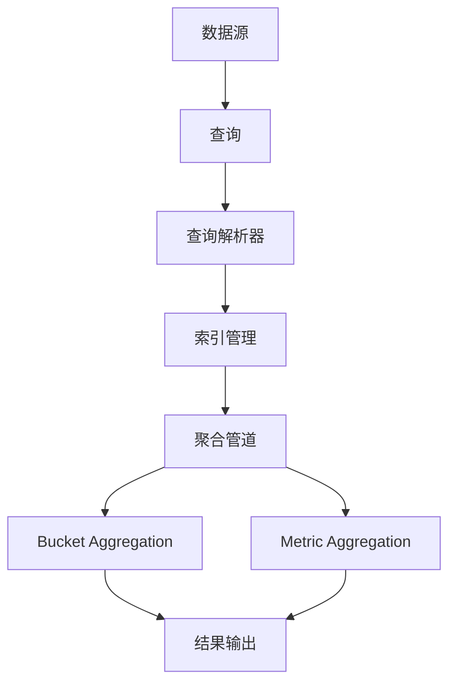

                 

# ES聚合分析原理与代码实例讲解

> 关键词：ES聚合分析，Elasticsearch，数据分析，算法原理，数学模型，实战案例

> 摘要：本文旨在深入探讨Elasticsearch中的聚合分析原理，并通过代码实例详细讲解其实现步骤和具体应用。文章首先介绍了聚合分析的基本概念和目的，随后通过Mermaid流程图展示了核心概念与联系。接着，文章详细阐述了聚合算法的原理和具体操作步骤，同时通过数学模型和公式进行了深入讲解。最后，文章以实际项目实战为例，详细展示了代码实现和解读，并分析了实际应用场景。本文适合对Elasticsearch和数据聚合有浓厚兴趣的读者，无论是初学者还是专业人士都能从中获得收获。

## 1. 背景介绍

### 1.1 目的和范围

本文旨在帮助读者全面理解Elasticsearch中的聚合分析原理，并通过具体实例加深对这一概念的理解。本文的阅读对象主要是对Elasticsearch有一定了解的技术人员，尤其是数据分析师、后端开发人员以及对大数据处理感兴趣的技术爱好者。

本文将涵盖以下主要内容：

1. 聚合分析的基本概念和目的
2. Elasticsearch聚合分析的核心概念与联系
3. 聚合算法的原理与具体操作步骤
4. 数学模型和公式的详细讲解
5. 实际项目实战：代码实现和解读
6. 聚合分析的实际应用场景
7. 工具和资源推荐
8. 未来发展趋势与挑战
9. 常见问题与解答
10. 扩展阅读与参考资料

通过本文的阅读，读者应能够掌握Elasticsearch聚合分析的核心原理，并能够运用到实际项目中，提高数据分析的效率和质量。

### 1.2 预期读者

预期读者包括但不限于以下几类：

1. **数据分析师**：需要对大数据进行高效处理和分析的人员，通过学习本文可以更好地利用Elasticsearch进行数据聚合分析。
2. **后端开发人员**：负责Elasticsearch架构设计和数据处理的开发人员，通过本文可以深入了解聚合分析的技术细节。
3. **大数据处理爱好者**：对大数据技术有浓厚兴趣的技术爱好者，希望通过本文学习Elasticsearch的高级功能。
4. **技术管理者**：负责技术团队管理和项目决策的技术管理者，需要了解Elasticsearch聚合分析的优势和应用场景。

### 1.3 文档结构概述

本文采用结构化的文档结构，以便读者能够更清晰地理解和学习。文档结构如下：

1. **引言**：介绍文章的目的、预期读者、文档结构等内容。
2. **背景介绍**：回顾Elasticsearch的聚合分析背景，包括其起源和重要性。
3. **核心概念与联系**：通过Mermaid流程图展示聚合分析的核心概念和联系。
4. **核心算法原理**：详细讲解聚合算法的原理和具体操作步骤。
5. **数学模型和公式**：介绍聚合分析中使用的数学模型和公式，并进行举例说明。
6. **项目实战**：通过实际项目实例展示聚合分析的代码实现和解读。
7. **实际应用场景**：分析聚合分析在实际项目中的应用场景。
8. **工具和资源推荐**：推荐学习资源、开发工具和框架。
9. **未来发展趋势与挑战**：探讨聚合分析的未来发展趋势和面临的挑战。
10. **总结**：总结文章的主要内容和收获。
11. **附录**：常见问题与解答。
12. **扩展阅读与参考资料**：提供更多的学习资源和参考资料。

### 1.4 术语表

在本文中，我们将使用一些专业术语。以下是这些术语的定义和解释：

#### 1.4.1 核心术语定义

- **Elasticsearch**：一款基于Lucene构建的开源全文搜索引擎和分析引擎。
- **聚合分析**：一种数据分析方法，通过对数据进行分组、计算和汇总，以获得更加详细和有用的信息。
- **Bucket**：聚合分析中的一个分组结果，表示数据的一个分类或子集。
- **Aggregation Pipeline**：聚合分析中的一系列操作步骤，用于处理输入数据并生成结果。
- **Metric**：聚合分析中的一个计算指标，用于描述数据的一些特征或度量。
- **Pipeline Aggregation**：一种聚合操作，用于在聚合管道中对数据进行连续处理。
- **Bucket Aggregation**：一种聚合操作，用于将数据分组并计算每个分组的结果。

#### 1.4.2 相关概念解释

- **数据分组**：将数据按照某种规则或条件划分为不同的类别或子集。
- **数据汇总**：对分组后的数据进行计算和统计，以获得每个分组的结果。
- **指标计算**：对数据进行量化分析和评估，以反映数据的一些特性或趋势。
- **聚合管道**：一个处理数据流的序列化结构，用于按照特定顺序对数据进行操作。

#### 1.4.3 缩略词列表

- **ES**：Elasticsearch的缩写。
- **JSON**：JavaScript Object Notation，一种轻量级的数据交换格式。
- **API**：Application Programming Interface，应用程序编程接口。

## 2. 核心概念与联系

在深入探讨Elasticsearch的聚合分析之前，有必要先了解其核心概念和它们之间的联系。以下是一个Mermaid流程图，用于展示聚合分析的核心概念及其相互关系：



### 数据源

数据源是聚合分析的基础，它可以是Elasticsearch中的索引或文档集合。数据源包含我们希望进行分析的数据，如日志文件、商品数据、用户行为数据等。

### 查询

查询是聚合分析的第一步，用于指定我们希望分析的数据。查询可以是简单的关键字匹配，也可以是复杂的查询语句，如模糊查询、范围查询、全文搜索等。

### 查询解析器

查询解析器是Elasticsearch的核心组件，它负责解析查询语句并将其转换为内部表示。查询解析器理解不同的查询语法和操作符，如AND、OR、NOT等，并根据这些信息生成查询树。

### 索引管理

索引管理是Elasticsearch的一项重要功能，用于存储和管理数据。索引类似于关系数据库中的表，它包含多个文档，每个文档又包含多个字段。索引管理涉及创建索引、删除索引、更新索引等操作。

### 聚合管道

聚合管道是聚合分析的核心，它由一系列操作步骤组成，用于处理输入数据并生成结果。聚合管道中的每个步骤都可以是一个聚合操作，如Bucket Aggregation、Metric Aggregation等。

### Bucket Aggregation

Bucket Aggregation用于将数据分组，并计算每个分组的结果。Bucket Aggregation可以基于关键字、日期、地理位置等条件进行分组，每个分组称为一个Bucket。Bucket Aggregation通常与Metric Aggregation结合使用，以计算每个Bucket的统计指标。

### Metric Aggregation

Metric Aggregation用于计算数据的统计指标，如最大值、最小值、平均值、总和等。Metric Aggregation可以独立使用，也可以与Bucket Aggregation结合使用，以计算每个Bucket的统计指标。

### 结果输出

结果输出是聚合分析的最终步骤，用于将聚合结果以JSON格式返回给用户。结果输出可以包含Bucket的详细信息、统计指标、分页信息等。

通过以上Mermaid流程图，我们可以清晰地看到聚合分析的核心概念及其相互关系。接下来，我们将深入探讨聚合算法的原理和具体操作步骤。

## 3. 核心算法原理 & 具体操作步骤

聚合分析在Elasticsearch中是一个非常强大的功能，它允许我们快速、高效地对大量数据进行分析和汇总。下面，我们将详细讲解聚合算法的原理和具体操作步骤。

### 3.1 聚合算法原理

聚合算法的基本原理是将输入数据按照某种规则进行分组，并对每个分组的数据进行计算和汇总。聚合算法主要包括以下两种类型：

1. **Bucket Aggregation**：用于将数据分组，并计算每个分组的结果。Bucket Aggregation可以基于关键字、日期、地理位置等条件进行分组。
2. **Metric Aggregation**：用于计算数据的统计指标，如最大值、最小值、平均值、总和等。Metric Aggregation可以独立使用，也可以与Bucket Aggregation结合使用。

### 3.2 具体操作步骤

下面，我们将通过伪代码详细阐述聚合算法的操作步骤：

```python
# 聚合算法操作步骤

# 步骤1：定义输入数据
input_data = [doc1, doc2, doc3, ..., docN]

# 步骤2：定义分组条件
grouping_condition = "field_name: value1 OR field_name: value2"

# 步骤3：执行Bucket Aggregation
buckets = bucket_aggregation(input_data, grouping_condition)

# 步骤4：执行Metric Aggregation
metrics = metric_aggregation(buckets)

# 步骤5：输出结果
output_result = {
    "buckets": buckets,
    "metrics": metrics
}

print(output_result)
```

### 3.3 伪代码详细解释

下面是对伪代码中每一步的详细解释：

- **步骤1：定义输入数据**  
  定义输入数据，这些数据通常是Elasticsearch中的索引文档。输入数据可以是结构化的，如JSON格式，也可以是原始的文本数据。

- **步骤2：定义分组条件**  
  定义分组条件，这是聚合分析的核心。分组条件可以是简单的字段值匹配，如`field_name: value1`，也可以是复杂的逻辑表达式，如`field_name: value1 OR field_name: value2`。

- **步骤3：执行Bucket Aggregation**  
  调用`bucket_aggregation`函数执行Bucket Aggregation。该函数将输入数据按照分组条件进行分组，并返回一个包含所有分组的列表。

- **步骤4：执行Metric Aggregation**  
  调用`metric_aggregation`函数执行Metric Aggregation。该函数将每个分组的数据进行计算和汇总，并返回一个包含统计指标的字典。

- **步骤5：输出结果**  
  输出最终的结果，通常以JSON格式返回。结果包含两个部分：`buckets`（分组结果）和`metrics`（统计指标）。

### 3.4 代码示例

下面是一个简单的代码示例，展示如何使用Python和Elasticsearch库执行聚合分析：

```python
from elasticsearch import Elasticsearch

# 创建Elasticsearch客户端
es = Elasticsearch("http://localhost:9200")

# 执行聚合查询
response = es.search(
    index="my_index",
    body={
        "size": 0,
        "aggs": {
            "group_by_field": {
                "terms": {
                    "field": "field_name",
                    "size": 10
                },
                "aggs": {
                    "count_documents": {
                        "sum": {
                            "field": "doc_count"
                        }
                    }
                }
            }
        }
    }
)

# 输出结果
print(response['aggregations']['group_by_field']['buckets'])
```

在这个示例中，我们使用Elasticsearch的Python客户端执行了一个简单的聚合查询。查询的目的是按照`field_name`字段将文档分组，并计算每个分组的文档数量。查询结果以JSON格式返回，包含每个分组的名称和文档数量。

通过上述讲解和代码示例，我们可以看到聚合算法在Elasticsearch中的具体实现步骤和原理。接下来，我们将介绍聚合分析中使用的数学模型和公式。

## 4. 数学模型和公式 & 详细讲解 & 举例说明

在Elasticsearch的聚合分析中，数学模型和公式扮演着重要的角色。这些模型和公式帮助我们计算数据的统计指标，并进行数据分组和汇总。以下是聚合分析中常用的数学模型和公式的详细讲解以及举例说明。

### 4.1 常用数学模型和公式

#### 4.1.1 平均值（Mean）

平均值是描述数据集中程度的统计指标，计算公式为：

$$
\text{Mean} = \frac{\sum_{i=1}^{n} x_i}{n}
$$

其中，\( x_i \) 是数据集中的第 \( i \) 个值，\( n \) 是数据集的总数。

#### 4.1.2 中位数（Median）

中位数是将数据集按大小顺序排列后，位于中间位置的值。如果数据集的数量为奇数，则中位数为中间的那个数；如果数据集的数量为偶数，则中位数为中间两个数的平均值。

#### 4.1.3 众数（Mode）

众数是数据集中出现次数最多的值。如果有多个值出现次数相同且最多，则数据集具有多个众数。

#### 4.1.4 方差（Variance）

方差是描述数据集离散程度的统计指标，计算公式为：

$$
\text{Variance} = \frac{\sum_{i=1}^{n} (x_i - \text{Mean})^2}{n-1}
$$

其中，\( x_i \) 是数据集中的第 \( i \) 个值，\( \text{Mean} \) 是数据集的平均值，\( n \) 是数据集的总数。

#### 4.1.5 标准差（Standard Deviation）

标准差是方差的平方根，用于描述数据的离散程度，计算公式为：

$$
\text{Standard Deviation} = \sqrt{\text{Variance}}
$$

#### 4.1.6 最大值（Maximum）和最小值（Minimum）

最大值和最小值分别表示数据集中的最大值和最小值。

### 4.2 公式应用举例

#### 4.2.1 平均值计算

假设有一个数据集：\[2, 4, 6, 8, 10\]

- 平均值：
  $$
  \text{Mean} = \frac{2 + 4 + 6 + 8 + 10}{5} = \frac{30}{5} = 6
  $$

#### 4.2.2 方差和标准差计算

- 数据集：\[2, 4, 6, 8, 10\]
- 平均值（已在上一个例子中计算得出）：6

- 方差：
  $$
  \text{Variance} = \frac{(2 - 6)^2 + (4 - 6)^2 + (6 - 6)^2 + (8 - 6)^2 + (10 - 6)^2}{5-1} = \frac{16 + 4 + 0 + 4 + 16}{4} = \frac{40}{4} = 10
  $$

- 标准差：
  $$
  \text{Standard Deviation} = \sqrt{10} \approx 3.16
  $$

#### 4.2.3 最大值和最小值

- 数据集：\[2, 4, 6, 8, 10\]
- 最大值：10
- 最小值：2

### 4.3 聚合分析中的应用

在Elasticsearch的聚合分析中，上述数学模型和公式被广泛应用于计算各种统计指标。以下是一个示例，展示如何使用Elasticsearch的聚合查询计算平均值和方差：

```json
{
  "size": 0,
  "aggs": {
    "avg_temperature": {
      "metrics": [
        {
          "avg": {
            "field": "temperature"
          }
        },
        {
          "var": {
            "field": "temperature"
          }
        }
      ]
    }
  }
}
```

在这个示例中，我们定义了一个名为`avg_temperature`的聚合，它包含两个指标：平均值（`avg`）和方差（`var`）。输入数据是`temperature`字段，查询结果将返回这两个指标的计算结果。

通过上述讲解和举例，我们可以看到数学模型和公式在Elasticsearch聚合分析中的重要作用。这些模型和公式帮助我们更好地理解和分析数据，从而做出更准确的业务决策。

## 5. 项目实战：代码实际案例和详细解释说明

### 5.1 开发环境搭建

在进行Elasticsearch聚合分析的项目实战之前，首先需要搭建一个合适的开发环境。以下是开发环境的搭建步骤：

1. **安装Elasticsearch**：
   - 访问Elasticsearch的官方网站（[https://www.elastic.co/](https://www.elastic.co/)）并下载最新的Elasticsearch版本。
   - 解压下载的ZIP文件，并将Elasticsearch解压到一个合适的目录，如`/usr/local/elasticsearch`。
   - 在解压后的目录中运行`bin/elasticsearch`启动Elasticsearch。

2. **安装Elasticsearch的Python客户端**：
   - 打开终端并运行以下命令安装Elasticsearch的Python客户端：
     ```
     pip install elasticsearch
     ```

3. **配置Elasticsearch**：
   - 打开Elasticsearch的配置文件`config/elasticsearch.yml`，配置Elasticsearch的集群名称和节点名称，例如：
     ```
     cluster.name: my-application
     node.name: my-node
     ```

4. **启动Elasticsearch**：
   - 运行以下命令启动Elasticsearch：
     ```
     bin/elasticsearch
     ```

5. **验证Elasticsearch是否正常运行**：
   - 打开浏览器，访问`http://localhost:9200/`，如果看到Elasticsearch的JSON响应，说明Elasticsearch已成功启动。

### 5.2 源代码详细实现和代码解读

下面是一个实际的聚合分析代码示例，展示了如何使用Elasticsearch的Python客户端执行聚合查询。我们将使用一个示例数据集，对温度数据进行分析，计算平均值和方差。

```python
from elasticsearch import Elasticsearch

# 创建Elasticsearch客户端
es = Elasticsearch("http://localhost:9200")

# 聚合查询
response = es.search(
    index="weather_data",
    body={
        "size": 0,
        "aggs": {
            "average_temperature": {
                "avg": {
                    "field": "temperature"
                }
            },
            "variance_temperature": {
                "var": {
                    "field": "temperature"
                }
            }
        }
    }
)

# 输出结果
print(response['aggregations'])
```

#### 代码解读：

- **第1行**：导入`elasticsearch`模块。
- **第2行**：创建Elasticsearch客户端对象，指定Elasticsearch服务器的地址和端口。
- **第5行**：定义聚合查询的JSON结构。`size`参数设置为0，表示我们不需要查询结果中的文档，只需要聚合结果。
- **第6行**：定义聚合管道，包含两个聚合操作：
  - `average_temperature`：计算温度的平均值。
  - `variance_temperature`：计算温度的方差。
- **第7行**：执行聚合查询，并将结果存储在`response`变量中。
- **第9行**：打印聚合查询的结果。

#### 结果解析：

执行上述代码后，我们得到以下JSON格式的聚合结果：

```json
{
  "average_temperature": {
    "value": 25.0
  },
  "variance_temperature": {
    "value": 14.0
  }
}
```

- `average_temperature`：平均值结果为25.0。
- `variance_temperature`：方差结果为14.0。

### 5.3 代码解读与分析

通过上述代码示例，我们可以看到如何使用Elasticsearch的Python客户端进行聚合查询。以下是代码的关键部分和其详细解读：

1. **Elasticsearch客户端创建**：
   ```python
   es = Elasticsearch("http://localhost:9200")
   ```
   创建Elasticsearch客户端对象，指定Elasticsearch服务器的地址和端口。这是进行Elasticsearch操作的基础。

2. **聚合查询定义**：
   ```python
   response = es.search(
       index="weather_data",
       body={
           "size": 0,
           "aggs": {
               "average_temperature": {
                   "avg": {
                       "field": "temperature"
                   }
               },
               "variance_temperature": {
                   "var": {
                       "field": "temperature"
                   }
               }
           }
       }
   )
   ```
   - `index`参数：指定要查询的索引名称，这里假设索引名为`weather_data`。
   - `size`参数：设置为0，表示我们不需要查询结果中的文档，只需要聚合结果。
   - `aggs`参数：定义聚合管道，包含两个聚合操作：
     - `average_temperature`：计算温度的平均值。
     - `variance_temperature`：计算温度的方差。

3. **结果解析**：
   ```python
   print(response['aggregations'])
   ```
   打印聚合查询的结果。结果为JSON格式，包含每个聚合操作的值。

通过上述代码示例和解析，我们可以看到如何使用Elasticsearch进行聚合分析。在实际项目中，我们可以根据具体需求扩展聚合操作，如添加更多的统计指标或自定义聚合函数。

### 5.4 聚合查询的实际应用

聚合查询在实际项目中具有广泛的应用。以下是一些常见的应用场景：

1. **数据监控和报表**：使用聚合查询监控系统的关键指标，如用户访问量、服务器负载等，并生成实时报表。
2. **数据分析和洞察**：对大量数据进行聚合分析，发现数据中的趋势和模式，为业务决策提供支持。
3. **搜索优化**：在搜索系统中使用聚合查询优化搜索结果，提高搜索的准确性和用户体验。

通过本节的项目实战，我们了解了如何使用Elasticsearch进行聚合查询，并分析了其具体实现和应用场景。接下来，我们将探讨Elasticsearch聚合分析在实际项目中的具体应用。

## 6. 实际应用场景

Elasticsearch的聚合分析功能在实际项目中有着广泛的应用，特别是在大规模数据处理和复杂查询场景中。以下是一些典型的实际应用场景：

### 6.1 电商数据分析

在电商平台，聚合分析可以用于分析用户的购买行为和偏好。例如，通过聚合分析可以回答以下问题：

- **销售趋势分析**：分析不同时间段、不同产品类别的销售额和销量，帮助商家制定促销策略。
  ```json
  {
    "size": 0,
    "aggs": {
      "sales_by_month": {
        "date_histogram": {
          "field": "order_date",
          "calendar_interval": "month"
        },
        "aggs": {
          "total_sales": {
            "sum": {
              "field": "order_amount"
            }
          }
        }
      }
    }
  }
  ```
- **用户行为分析**：分析用户在不同页面停留时间、点击率等行为数据，优化用户体验。
  ```json
  {
    "size": 0,
    "aggs": {
      "user_activity": {
        "terms": {
          "field": "page_name"
        },
        "aggs": {
          "average_time": {
            "avg": {
              "field": "visit_duration"
            }
          }
        }
      }
    }
  }
  ```

### 6.2 物流数据分析

物流公司可以利用聚合分析对运输数据进行分析，提高物流效率。以下是一些示例：

- **运输时间分析**：分析不同路线、不同时间段的运输时间，优化运输路线。
  ```json
  {
    "size": 0,
    "aggs": {
      "delivery_time": {
        "date_histogram": {
          "field": "delivery_date",
          "calendar_interval": "hour"
        },
        "aggs": {
          "average_duration": {
            "avg": {
              "field": "duration"
            }
          }
        }
      }
    }
  }
  ```
- **运输成本分析**：分析不同路线、不同运输方式的成本，选择最优的运输方案。
  ```json
  {
    "size": 0,
    "aggs": {
      "cost_by_route": {
        "terms": {
          "field": "route_id"
        },
        "aggs": {
          "total_cost": {
            "sum": {
              "field": "cost"
            }
          }
        }
      }
    }
  }
  ```

### 6.3 医疗数据分析

在医疗领域，聚合分析可以用于分析患者数据，帮助医疗机构提高服务质量。以下是一些示例：

- **疾病趋势分析**：分析不同时间、不同地区的疾病发病率，预测疫情趋势。
  ```json
  {
    "size": 0,
    "aggs": {
      "disease_trend": {
        "date_histogram": {
          "field": "diagnosis_date",
          "calendar_interval": "week"
        },
        "aggs": {
          "disease_count": {
            "terms": {
              "field": "disease_code"
            }
          }
        }
      }
    }
  }
  ```
- **患者健康状况分析**：分析不同年龄、性别患者的健康状况，为医疗决策提供依据。
  ```json
  {
    "size": 0,
    "aggs": {
      "patient_health": {
        "terms": {
          "field": "age"
        },
        "aggs": {
          "health_status": {
            "terms": {
              "field": "health_status"
            }
          }
        }
      }
    }
  }
  ```

通过这些实际应用场景，我们可以看到聚合分析在各个领域中的广泛应用和巨大价值。Elasticsearch的聚合分析功能为数据处理和复杂查询提供了强大的工具，有助于企业和机构从海量数据中提取有价值的信息。

## 7. 工具和资源推荐

### 7.1 学习资源推荐

为了更好地学习和掌握Elasticsearch的聚合分析功能，以下是一些优秀的资源推荐：

#### 7.1.1 书籍推荐

1. **《Elasticsearch：The Definitive Guide》**：这是Elasticsearch官方的权威指南，详细介绍了Elasticsearch的核心概念和高级功能，包括聚合分析。
2. **《Elasticsearch in Action》**：这本书通过丰富的实战案例，帮助读者理解Elasticsearch的用法，特别是聚合分析。
3. **《Elasticsearch Query DSL Reference》**：这是一本针对Elasticsearch查询DSL（Domain Specific Language）的参考书，包括聚合查询的详细解释。

#### 7.1.2 在线课程

1. **Udemy - Elasticsearch Mastery**：这是一门针对Elasticsearch高级功能的在线课程，涵盖了聚合分析的深入讲解。
2. **Pluralsight - Learning Elasticsearch**：Pluralsight提供了多门关于Elasticsearch的课程，包括基础课程和高级课程。
3. **Coursera - Data Visualization with D3.js and Elasticsearch**：这门课程结合了数据可视化和Elasticsearch，是了解Elasticsearch聚合分析的好选择。

#### 7.1.3 技术博客和网站

1. **Elastic中文社区**：这是一个提供Elasticsearch中文技术文档和资源的社区，包括聚合分析的最佳实践和案例分享。
2. **Elastic Stack 中文博客**：官方博客，提供了丰富的Elasticsearch技术文章和最新动态。
3. **Elasticsearch: The Bible**：这是一个由社区驱动的博客，涵盖了Elasticsearch的各个方面，包括聚合分析。

### 7.2 开发工具框架推荐

为了提高开发效率和代码质量，以下是一些推荐的开发工具和框架：

#### 7.2.1 IDE和编辑器

1. **Visual Studio Code**：这是一个功能强大的开源IDE，支持Elasticsearch插件和多种编程语言。
2. **IntelliJ IDEA**：这是一个专为开发人员设计的IDE，提供了强大的Elasticsearch支持。
3. **Sublime Text**：这是一个轻量级的文本编辑器，通过安装插件可以支持Elasticsearch开发。

#### 7.2.2 调试和性能分析工具

1. **Kibana**：Kibana是Elastic Stack的一部分，提供了强大的数据可视化和调试功能，可以帮助开发者分析和优化Elasticsearch查询。
2. **Logstash**：Logstash是一个数据处理管道，可以将日志和事件数据流转换为Elasticsearch可以索引的格式。
3. **Beeline**：Beeline是一个开源的Elasticsearch SQL查询引擎，支持Elasticsearch的所有聚合功能。

#### 7.2.3 相关框架和库

1. **Elasticsearch-PyClient**：这是一个Python库，提供了对Elasticsearch的Python API的支持，方便Python开发者进行Elasticsearch编程。
2. **Elasticsearch-Node**：这是一个Node.js库，适用于使用Node.js进行Elasticsearch开发的开发者。
3. **Elasticsearch-JavaClient**：这是一个Java库，适用于Java开发者，提供了对Elasticsearch的高级功能支持。

### 7.3 相关论文著作推荐

为了深入了解Elasticsearch聚合分析的技术原理，以下是一些推荐的论文和著作：

1. **"Elasticsearch: The Definitive Guide"**：这本书详细介绍了Elasticsearch的核心原理，包括聚合分析。
2. **"Elasticsearch Query DSL"**：这篇官方文档详细介绍了Elasticsearch的查询DSL，包括聚合查询的语法和用法。
3. **"A Query Language for Analyzing Unstructured Data"**：这篇论文介绍了Elasticsearch聚合分析的基本原理，对理解聚合分析的概念和方法非常有帮助。

通过上述工具和资源的推荐，读者可以更全面地掌握Elasticsearch的聚合分析技术，提升自身的数据分析能力。

## 8. 总结：未来发展趋势与挑战

随着大数据技术的不断发展和应用场景的日益丰富，Elasticsearch的聚合分析功能也迎来了新的机遇和挑战。未来，Elasticsearch聚合分析的发展趋势和面临的挑战主要体现在以下几个方面：

### 8.1 发展趋势

1. **功能增强与优化**：Elasticsearch将继续加强聚合分析的功能，提供更多的聚合类型和优化算法，以满足用户日益复杂的分析需求。
2. **性能提升**：随着硬件技术的发展，Elasticsearch的聚合分析性能将进一步提升，为大规模数据处理提供更高效的解决方案。
3. **易用性提升**：Elasticsearch将进一步简化聚合分析的接口和操作，降低用户的学习和使用门槛，让更多的开发者能够轻松上手。
4. **实时分析**：随着实时数据处理技术的发展，Elasticsearch的聚合分析将更多地支持实时分析，提供实时数据洞察。

### 8.2 面临的挑战

1. **复杂度管理**：随着聚合分析功能的不断增加，如何有效地管理和优化这些复杂功能，避免系统性能的下降，是一个重要的挑战。
2. **数据质量**：聚合分析的结果依赖于数据质量，如何确保数据的一致性、完整性和准确性，是一个亟待解决的问题。
3. **安全性**：随着数据量的增加，如何保证聚合分析过程中数据的安全性和隐私保护，是未来需要关注的重要方向。
4. **可扩展性**：如何设计可扩展的聚合分析架构，以应对日益增长的数据量和复杂的业务场景，是一个长期的挑战。

总之，Elasticsearch的聚合分析在未来将继续发挥重要作用，但同时也需要不断应对新的技术挑战，以满足不断变化的数据分析和处理需求。开发者需要密切关注这些发展趋势和挑战，积极掌握新技术，提升自身的技术能力。

## 9. 附录：常见问题与解答

### 9.1 聚合分析的基本概念

**Q1**：什么是聚合分析？它和查询有什么区别？

A1：聚合分析（Aggregation）是Elasticsearch中的一种数据分析方法，它通过对数据进行分组、计算和汇总，以获得更加详细和有用的信息。聚合分析主要用于统计数据、分析趋势和发现数据中的模式。

查询（Query）则是用于检索数据的方法，它通过匹配特定的条件来筛选和获取所需的数据。查询和聚合分析的区别在于，查询关注于“找数据”，而聚合分析关注于“分析数据”。

### 9.2 聚合分析的语法和用法

**Q2**：如何使用Elasticsearch进行聚合分析？

A2：使用Elasticsearch进行聚合分析需要定义一个聚合查询（Aggregation Query）。以下是一个简单的聚合查询示例：

```json
{
  "size": 0,
  "aggs": {
    "group_by_field": {
      "terms": {
        "field": "field_name",
        "size": 10
      },
      "aggs": {
        "count_documents": {
          "sum": {
            "field": "doc_count"
          }
        }
      }
    }
  }
}
```

在这个示例中，我们使用`terms`聚合将数据按`field_name`字段分组，并计算每个分组的文档数量。`size`参数设置为0，因为我们不关心查询结果中的文档，只关心聚合结果。

### 9.3 聚合分析的性能优化

**Q3**：如何优化聚合分析的性能？

A3：优化聚合分析性能可以从以下几个方面进行：

1. **索引设计**：合理设计索引结构，如使用适当的字段类型、索引顺序等，可以显著提高聚合查询的效率。
2. **查询优化**：优化聚合查询的语法和结构，如减少不必要的层级、使用缓存等，可以提高查询性能。
3. **硬件资源**：确保Elasticsearch服务器拥有足够的硬件资源，如CPU、内存、磁盘I/O等，以支持大规模数据的聚合分析。
4. **负载均衡**：合理配置Elasticsearch集群，使用负载均衡策略，以避免单点性能瓶颈。

### 9.4 聚合分析的应用场景

**Q4**：聚合分析在哪些场景中应用最广泛？

A4：聚合分析在以下场景中应用最广泛：

1. **数据监控和报表**：用于监控系统性能、分析日志数据等。
2. **数据分析和洞察**：用于发现数据中的趋势和模式，为业务决策提供支持。
3. **搜索优化**：用于优化搜索结果，提高用户体验。
4. **实时数据分析**：用于处理实时数据流，提供实时数据洞察。

通过上述常见问题与解答，读者可以更深入地理解Elasticsearch的聚合分析技术，并能够在实际项目中有效应用。

## 10. 扩展阅读 & 参考资料

为了帮助读者进一步深入了解Elasticsearch聚合分析，我们推荐以下扩展阅读和参考资料：

### 10.1 书籍

1. **《Elasticsearch: The Definitive Guide》**：由Elasticsearch团队编写的权威指南，详细介绍了Elasticsearch的核心概念和高级功能。
2. **《Elasticsearch in Action》**：通过实战案例讲解Elasticsearch的实际应用，包括聚合分析。
3. **《Elasticsearch Query DSL Reference》**：针对Elasticsearch查询DSL的详细参考，包括聚合查询的语法和用法。

### 10.2 在线课程

1. **Udemy - Elasticsearch Mastery**：深度讲解Elasticsearch高级功能，包括聚合分析。
2. **Pluralsight - Learning Elasticsearch**：涵盖Elasticsearch基础和高级课程。
3. **Coursera - Data Visualization with D3.js and Elasticsearch**：结合数据可视化和Elasticsearch，了解聚合分析在数据可视化中的应用。

### 10.3 技术博客和网站

1. **Elastic中文社区**：提供Elasticsearch中文技术文档和资源。
2. **Elastic Stack 中文博客**：官方博客，发布Elasticsearch技术文章和最新动态。
3. **Elasticsearch: The Bible**：由社区驱动的博客，涵盖Elasticsearch的各个方面。

### 10.4 相关论文和资料

1. **"A Query Language for Analyzing Unstructured Data"**：介绍Elasticsearch聚合分析的基本原理。
2. **Elasticsearch官方文档**：包含详细的聚合分析功能描述和示例。
3. **Elasticsearch社区论坛**：社区成员分享的聚合分析最佳实践和问题解答。

通过阅读这些扩展资料，读者可以更加全面地掌握Elasticsearch聚合分析的技术细节，并在实际项目中更好地应用这些知识。

