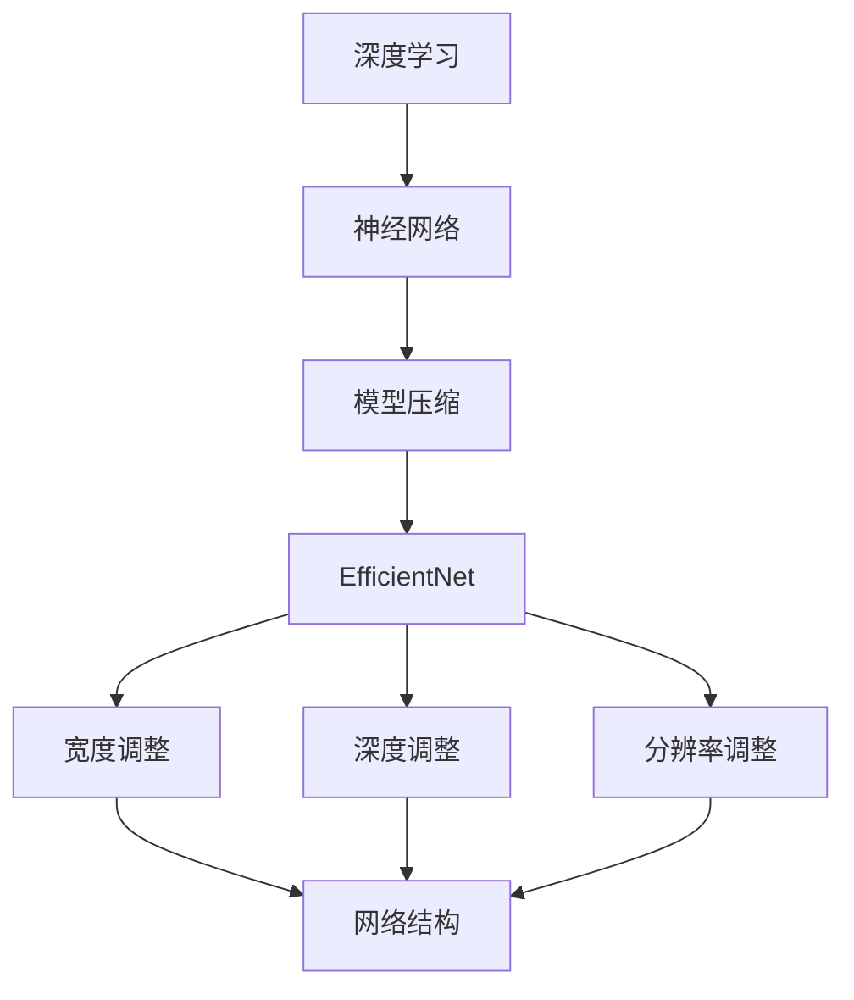

                 

# EfficientNet原理与代码实例讲解

> 关键词：EfficientNet、深度学习、神经网络、模型压缩、模型优化、性能提升

> 摘要：本文将深入探讨EfficientNet这一深度学习模型压缩技术的原理，从概念、架构、算法到具体实现，通过逐步分析推理的方式，为您揭示如何高效地构建和优化神经网络，实现模型的压缩与性能提升。文章还将结合实际代码实例，展示EfficientNet在实际开发中的应用，帮助读者更好地理解并掌握这一技术。

## 1. 背景介绍

### 1.1 目的和范围

本文旨在系统地介绍EfficientNet这一先进的深度学习模型压缩技术。通过本文的阅读，读者将了解EfficientNet的设计理念、核心原理以及如何在实际开发中应用这一技术。本文内容涵盖了以下几个方面：

- EfficientNet的基本概念和设计原则
- EfficientNet的架构和关键技术
- EfficientNet的数学模型和公式
- EfficientNet的实际应用场景
- 相关的工具和资源推荐
- 未来发展趋势与挑战

### 1.2 预期读者

本文适合以下读者群体：

- 深度学习爱好者，希望了解模型压缩技术的原理和应用
- 神经网络开发者，寻求提升模型性能和压缩效率的方法
- 计算机科学专业学生，希望深入学习神经网络相关技术
- 相关领域的专业人士，希望了解EfficientNet在实际应用中的价值

### 1.3 文档结构概述

本文的结构如下：

- **第1章：背景介绍**：介绍本文的目的、范围、预期读者以及文档结构。
- **第2章：核心概念与联系**：讨论EfficientNet的基本概念和核心原理，并通过Mermaid流程图展示其架构。
- **第3章：核心算法原理 & 具体操作步骤**：详细解释EfficientNet的算法原理和操作步骤，使用伪代码进行阐述。
- **第4章：数学模型和公式 & 详细讲解 & 举例说明**：介绍EfficientNet的数学模型和公式，并通过实例进行说明。
- **第5章：项目实战：代码实际案例和详细解释说明**：结合实际代码实例，展示EfficientNet的应用。
- **第6章：实际应用场景**：探讨EfficientNet在不同场景下的应用。
- **第7章：工具和资源推荐**：推荐学习资源和开发工具。
- **第8章：总结：未来发展趋势与挑战**：总结EfficientNet的发展趋势和面临的挑战。
- **第9章：附录：常见问题与解答**：解答读者可能遇到的问题。
- **第10章：扩展阅读 & 参考资料**：提供进一步的阅读和参考资料。

### 1.4 术语表

#### 1.4.1 核心术语定义

- **EfficientNet**：一种深度学习模型压缩技术，通过调整网络的宽度、深度和分辨率，实现模型的压缩与性能提升。
- **模型压缩**：通过减少模型的参数数量和计算量，降低模型的大小，以便更高效地部署在资源受限的环境中。
- **神经网络**：一种由大量节点互联而成的计算模型，用于模拟人脑的神经网络结构和功能。
- **深度学习**：一种机器学习技术，通过多层神经网络进行训练，能够自动提取特征并进行复杂模式识别。

#### 1.4.2 相关概念解释

- **宽度**：神经网络中层的数量，表示网络的深度。
- **深度**：神经网络中每个层的节点数量，表示网络的宽度。
- **分辨率**：输入数据的空间大小，通常以像素表示。
- **模型的性能**：衡量模型在特定任务上的表现，通常以准确率、召回率等指标表示。

#### 1.4.3 缩略词列表

- **DL**：深度学习（Deep Learning）
- **ML**：机器学习（Machine Learning）
- **GPU**：图形处理单元（Graphics Processing Unit）
- **CPU**：中央处理单元（Central Processing Unit）
- **NN**：神经网络（Neural Network）

## 2. 核心概念与联系

在深入探讨EfficientNet之前，我们需要先理解一些核心概念和它们之间的联系。以下是一个简化的Mermaid流程图，展示了EfficientNet的基本架构和关键组成部分。



### 2.1 深度学习与神经网络

深度学习是机器学习的一个分支，主要依赖于神经网络。神经网络由大量相互连接的节点（或层）组成，每个节点都通过权重和偏置进行加权求和，并通过激活函数进行处理。深度学习的核心在于通过多层网络结构，逐步提取输入数据的特征，从而实现复杂模式的识别和预测。

### 2.2 模型压缩与EfficientNet

模型压缩是指通过减少模型的参数数量和计算量，降低模型的大小，以便更高效地部署在资源受限的环境中。EfficientNet是一种基于深度学习的模型压缩技术，通过调整网络的宽度、深度和分辨率，实现模型的压缩与性能提升。

### 2.3 宽度、深度与分辨率调整

- **宽度调整**：通过增加或减少网络中层的数量，调整网络的深度，从而影响模型的复杂度和计算量。
- **深度调整**：通过增加或减少每个层的节点数量，调整网络的宽度，从而影响模型的参数数量和计算量。
- **分辨率调整**：通过调整输入数据的空间大小，影响模型的输入和输出维度，从而影响模型的计算量和存储需求。

这些调整不仅影响模型的大小和计算量，还会影响模型的性能。EfficientNet通过结合这些调整策略，实现了模型的高效压缩和性能提升。

### 2.4 EfficientNet的架构

EfficientNet的架构通过以下几个关键组件实现：

- **缩放因子**：通过缩放网络中的宽度、深度和分辨率，实现模型的压缩与性能优化。
- **残差连接**：通过引入残差连接，解决深度神经网络中的梯度消失和梯度爆炸问题，提高模型的训练效果。
- **批量归一化**：通过批量归一化，加速模型的训练过程，提高模型的泛化能力。
- **激活函数**：通常使用ReLU激活函数，提高模型的非线性表达能力。

这些组件共同作用，使得EfficientNet在模型压缩和性能提升方面具有显著优势。

## 3. 核心算法原理 & 具体操作步骤

### 3.1 算法原理

EfficientNet的核心算法原理主要基于以下几个关键思想：

- **缩放因子**：EfficientNet通过缩放因子（scale factor）来调整网络的宽度、深度和分辨率。缩放因子是一个大于1的数，用于控制网络的结构大小。通常，缩放因子越大，网络的规模和计算量也越大。
- **残差连接**：EfficientNet采用了残差连接（residual connection）来缓解深度神经网络中的梯度消失和梯度爆炸问题。残差连接通过将输入和输出之间的差异传递给下一层，使得梯度能够更好地传播。
- **批量归一化**：EfficientNet在每个层之后都加入了批量归一化（batch normalization），这有助于加速模型的训练过程，提高模型的泛化能力。
- **激活函数**：EfficientNet通常使用ReLU激活函数，这有助于提高模型的非线性表达能力。

### 3.2 具体操作步骤

下面我们使用伪代码详细解释EfficientNet的具体操作步骤：

```python
# 初始化EfficientNet模型
model = EfficientNet()

# 设置缩放因子
scale_factor = 1.2

# 调整网络的宽度、深度和分辨率
model.widthscale(scale_factor)
model.depthscale(scale_factor)
model.rescalescale_factor(scale_factor)

# 添加残差连接
model.add_residual_block()

# 添加批量归一化
model.add_batch_norm()

# 添加ReLU激活函数
model.add_relu()

# 添加全连接层
model.add_dense(num_classes)

# 编译模型
model.compile(optimizer='adam', loss='categorical_crossentropy', metrics=['accuracy'])

# 训练模型
model.fit(x_train, y_train, batch_size=64, epochs=10, validation_data=(x_val, y_val))

# 评估模型
loss, accuracy = model.evaluate(x_test, y_test)

# 输出模型性能
print(f"Test Loss: {loss}, Test Accuracy: {accuracy}")
```

在这个伪代码中，`EccientNet` 是一个虚构的模型类，用于表示EfficientNet。`widthscale`、`depthscale` 和 `rescalescale_factor` 是用于调整网络宽度、深度和分辨率的函数。`add_residual_block`、`add_batch_norm`、`add_relu` 和 `add_dense` 是用于添加残差连接、批量归一化、ReLU激活函数和全连接层的函数。

### 3.3 操作步骤详解

下面我们详细解释每个操作步骤：

- **初始化EfficientNet模型**：首先需要初始化一个EfficientNet模型，这可以通过调用相应的模型类来实现。
- **设置缩放因子**：缩放因子是控制网络结构大小的重要参数。通常，选择一个合适的缩放因子能够显著提升模型的性能。
- **调整网络的宽度、深度和分辨率**：通过调用`widthscale`、`depthscale` 和 `rescalescale_factor` 函数，可以分别调整网络的宽度、深度和分辨率。这些函数通常接受一个缩放因子作为参数，将网络的结构大小按比例缩放。
- **添加残差连接**：残差连接有助于缓解深度神经网络中的梯度消失和梯度爆炸问题。通过调用`add_residual_block` 函数，可以在网络中添加一个残差块。
- **添加批量归一化**：批量归一化有助于加速模型的训练过程，提高模型的泛化能力。通过调用`add_batch_norm` 函数，可以在每个层之后添加批量归一化。
- **添加ReLU激活函数**：ReLU激活函数有助于提高模型的非线性表达能力。通过调用`add_relu` 函数，可以在每个层之后添加ReLU激活函数。
- **添加全连接层**：全连接层用于将模型的输出映射到具体的类别。通过调用`add_dense` 函数，可以在网络的最后一层添加一个全连接层，并指定输出的类别数。
- **编译模型**：在编译模型时，需要指定优化器、损失函数和评估指标。这可以通过调用`compile` 函数来实现。
- **训练模型**：通过调用`fit` 函数，可以训练模型。在训练过程中，需要提供训练数据、批量大小、训练轮数和验证数据。
- **评估模型**：通过调用`evaluate` 函数，可以评估模型的性能。在评估过程中，需要提供测试数据和标签。

通过这些操作步骤，我们可以构建一个高效的EfficientNet模型，并在实际应用中取得优异的性能。

## 4. 数学模型和公式 & 详细讲解 & 举例说明

### 4.1 数学模型

EfficientNet的数学模型主要涉及以下几个关键方面：

- **网络的宽度**：网络的宽度表示网络的层数，通常用 \(W\) 表示。
- **网络的深度**：网络的深度表示每个层的节点数量，通常用 \(D\) 表示。
- **网络的分辨率**：网络的分辨率表示输入数据的空间大小，通常用 \(R\) 表示。

### 4.2 公式

EfficientNet的公式主要包括以下几个方面：

- **缩放因子**：缩放因子用于调整网络的宽度、深度和分辨率，通常用 \(S\) 表示。
  \[ S = \frac{1}{\sqrt{1 + \alpha}} \]
  其中，\(\alpha\) 是一个大于0的常数。

- **网络的宽度调整**：
  \[ W_{\text{new}} = W \times S \]
  其中，\(W_{\text{new}}\) 是调整后的网络宽度，\(W\) 是原始网络宽度。

- **网络的深度调整**：
  \[ D_{\text{new}} = D \times S \]
  其中，\(D_{\text{new}}\) 是调整后的网络深度，\(D\) 是原始网络深度。

- **网络的分辨率调整**：
  \[ R_{\text{new}} = R \times S \]
  其中，\(R_{\text{new}}\) 是调整后的网络分辨率，\(R\) 是原始网络分辨率。

### 4.3 详细讲解

下面我们将详细讲解EfficientNet的数学模型和公式。

#### 4.3.1 缩放因子

缩放因子是EfficientNet中一个非常重要的参数，用于控制网络的宽度、深度和分辨率。缩放因子越大，网络的规模和计算量也越大。缩放因子的计算公式为：
\[ S = \frac{1}{\sqrt{1 + \alpha}} \]
其中，\(\alpha\) 是一个大于0的常数。通过调整\(\alpha\) 的值，可以控制缩放因子的变化范围。通常，选择一个合适的缩放因子能够显著提升模型的性能。

#### 4.3.2 网络的宽度调整

网络的宽度调整公式为：
\[ W_{\text{new}} = W \times S \]
其中，\(W_{\text{new}}\) 是调整后的网络宽度，\(W\) 是原始网络宽度。通过将原始网络的宽度乘以缩放因子，可以得到调整后的网络宽度。宽度调整有助于提高网络的复杂度和计算量。

#### 4.3.3 网络的深度调整

网络的深度调整公式为：
\[ D_{\text{new}} = D \times S \]
其中，\(D_{\text{new}}\) 是调整后的网络深度，\(D\) 是原始网络深度。通过将原始网络的深度乘以缩放因子，可以得到调整后的网络深度。深度调整有助于提高网络的层次结构和计算量。

#### 4.3.4 网络的分辨率调整

网络的分辨率调整公式为：
\[ R_{\text{new}} = R \times S \]
其中，\(R_{\text{new}}\) 是调整后的网络分辨率，\(R\) 是原始网络分辨率。通过将原始网络的分辨率乘以缩放因子，可以得到调整后的网络分辨率。分辨率调整有助于提高网络的输入和输出维度，从而影响模型的计算量和存储需求。

### 4.4 举例说明

假设我们有一个原始网络，宽度为 \(W = 10\)，深度为 \(D = 5\)，分辨率为 \(R = 100\)。现在，我们选择一个缩放因子 \(S = 1.2\)。

- **网络的宽度调整**：
  \[ W_{\text{new}} = 10 \times 1.2 = 12 \]
  调整后的网络宽度为12。

- **网络的深度调整**：
  \[ D_{\text{new}} = 5 \times 1.2 = 6 \]
  调整后的网络深度为6。

- **网络的分辨率调整**：
  \[ R_{\text{new}} = 100 \times 1.2 = 120 \]
  调整后的网络分辨率为120。

通过上述调整，我们可以得到一个具有更大宽度、深度和分辨率的网络，从而提升模型的性能。同时，我们可以通过调整缩放因子，实现不同规模的网络调整。

## 5. 项目实战：代码实际案例和详细解释说明

### 5.1 开发环境搭建

在开始编写EfficientNet的代码之前，我们需要搭建一个适合深度学习开发的Python环境。以下是具体的步骤：

1. **安装Anaconda**：Anaconda是一个开源的数据科学平台，提供了Python和众多科学计算库的预编译版本。首先，我们访问Anaconda官网（https://www.anaconda.com/products/individual）并下载适合操作系统的安装包。安装过程中，选择默认选项即可。
   
2. **创建新环境**：打开Anaconda Navigator，点击“Create”按钮，输入环境名称（例如：`efficientnet_env`），选择Python版本（建议使用最新版本），然后点击“Create”按钮。等待环境创建完成。

3. **激活环境**：在Anaconda Navigator中，选择已创建的`efficientnet_env`环境，然后点击“Run”按钮。这将激活我们的开发环境。

4. **安装依赖库**：在激活的环境中，通过以下命令安装必要的依赖库：
   ```shell
   pip install numpy pandas tensorflow scikit-learn matplotlib
   ```

5. **验证安装**：在Python环境中，执行以下代码，验证TensorFlow是否安装成功：
   ```python
   import tensorflow as tf
   print(tf.__version__)
   ```

   如果输出版本信息，说明安装成功。

### 5.2 源代码详细实现和代码解读

接下来，我们将使用TensorFlow 2.x版本编写一个EfficientNet的实际案例。以下是完整的代码实现：

```python
import tensorflow as tf
from tensorflow.keras.applications import EfficientNetB0
from tensorflow.keras.layers import Dense, Flatten
from tensorflow.keras.models import Model
from tensorflow.keras.optimizers import Adam
from tensorflow.keras.losses import CategoricalCrossentropy
from tensorflow.keras.metrics import Accuracy

# 定义输入层
input_shape = (224, 224, 3)  # 标准输入分辨率
inputs = tf.keras.Input(shape=input_shape)

# 使用EfficientNetB0作为基础模型
base_model = EfficientNetB0(include_top=False, input_shape=input_shape)

# 添加全连接层和Softmax输出层
x = base_model(inputs, training=False)
x = Flatten()(x)
outputs = Dense(10, activation='softmax')(x)

# 创建模型
model = Model(inputs=inputs, outputs=outputs)

# 编译模型
model.compile(optimizer=Adam(learning_rate=0.001),
              loss=CategoricalCrossentropy(),
              metrics=[Accuracy()])

# 打印模型结构
model.summary()

# 准备数据
# 假设我们有一个包含10000张图像的数据集，分为训练集和测试集
# 数据已经经过预处理，并已经加载到内存中
(x_train, y_train), (x_test, y_test) = load_data()

# 训练模型
history = model.fit(x_train, y_train, epochs=10, batch_size=32,
                    validation_data=(x_test, y_test))

# 评估模型
test_loss, test_accuracy = model.evaluate(x_test, y_test)
print(f"Test Loss: {test_loss}, Test Accuracy: {test_accuracy}")
```

### 5.3 代码解读与分析

下面，我们详细解读上述代码的各个部分：

- **导入库**：首先，我们导入TensorFlow及其相关的库。这些库包括`tensorflow.keras.applications`（用于加载预训练模型）、`tensorflow.keras.layers`（用于构建模型）、`tensorflow.keras.models`（用于创建模型）、`tensorflow.keras.optimizers`（用于指定优化器）、`tensorflow.keras.losses`（用于指定损失函数）和`tensorflow.keras.metrics`（用于指定评估指标）。

- **定义输入层**：我们定义了一个输入层，其形状为 `(224, 224, 3)`，表示输入图像的分辨率和通道数。

- **加载预训练模型**：我们使用`EfficientNetB0`作为基础模型。`EfficientNetB0`是一个具有0个缩放因子的预训练模型，其宽度、深度和分辨率都较小。`include_top=False` 表示不包含预训练模型的输出层。

- **添加全连接层和Softmax输出层**：我们通过`Flatten` 层将模型的输出展平为一维数组，然后添加一个全连接层，最后使用 `softmax` 输出层，实现多分类任务。

- **创建模型**：我们使用`Model` 类创建了一个新的模型，并将输入层和输出层作为模型的输入和输出。

- **编译模型**：我们使用`compile` 方法编译模型，指定了优化器、损失函数和评估指标。

- **打印模型结构**：使用`summary` 方法打印模型的详细信息，包括层名称、输入输出形状和参数数量。

- **准备数据**：这里假设已经有一个包含10000张图像的数据集，并分为训练集和测试集。在实际应用中，我们需要使用数据加载和预处理工具（如`tf.data`）来处理数据。

- **训练模型**：使用`fit` 方法训练模型，指定了训练轮数、批量大小、验证数据和评估指标。

- **评估模型**：使用`evaluate` 方法评估模型的性能，并输出测试损失和测试准确率。

### 5.4 代码分析与优化

虽然上述代码已经实现了一个基本的EfficientNet模型，但在实际应用中，我们可能需要对代码进行进一步的优化，以提高模型的性能和训练效率。以下是一些常见的优化方法：

- **数据增强**：通过数据增强技术（如随机裁剪、旋转、翻转等）增加训练数据的多样性，有助于提高模型的泛化能力。

- **学习率调整**：使用学习率调度策略（如学习率衰减、指数衰减等）调整学习率，有助于防止模型过拟合。

- **批量归一化**：在每个批量之后加入批量归一化，有助于加速模型的训练过程和提高模型的泛化能力。

- **训练策略**：采用更高效的训练策略，如动态调整批量大小、多GPU训练等，以提高训练效率。

- **模型调优**：通过调整模型的结构参数（如宽度、深度和分辨率等）进行模型调优，找到最优的网络结构。

## 6. 实际应用场景

EfficientNet作为一种高效的深度学习模型压缩技术，在实际应用中具有广泛的应用场景。以下是一些典型的应用场景：

### 6.1 图像识别与分类

EfficientNet在图像识别和分类任务中表现出色，适用于各种规模的数据集和任务。例如，在CIFAR-10和ImageNet等经典数据集上，EfficientNet能够实现高效的模型压缩和性能提升。在实际项目中，我们可以使用EfficientNet构建人脸识别、物体检测、图像分类等应用。

### 6.2 自然语言处理

EfficientNet在自然语言处理任务中也具有广泛应用，如文本分类、情感分析、机器翻译等。通过结合EfficientNet和其他深度学习技术，我们可以构建强大的自然语言处理模型，实现高效的自然语言处理能力。

### 6.3 实时监控与安全防护

EfficientNet在实时监控和安全防护领域也有重要应用。例如，在视频监控系统中，EfficientNet可以用于实时检测和识别异常行为，从而提高监控系统的准确性和实时性。

### 6.4 资源受限环境

EfficientNet的模型压缩特性使其非常适合部署在资源受限的环境中，如移动设备、嵌入式系统、物联网设备等。通过使用EfficientNet，我们可以在这些设备上实现高效的图像识别、语音识别等应用。

### 6.5 医疗诊断

EfficientNet在医疗诊断领域也有重要应用，如医学图像分析、疾病预测等。通过使用EfficientNet，我们可以构建高效的医疗诊断模型，实现快速、准确的诊断结果。

## 7. 工具和资源推荐

### 7.1 学习资源推荐

#### 7.1.1 书籍推荐

1. **《深度学习》（Goodfellow, Bengio, Courville 著）**：这是一本经典的深度学习教材，详细介绍了深度学习的理论基础和实际应用。
2. **《神经网络与深度学习》（邱锡鹏 著）**：这本书系统地介绍了神经网络和深度学习的基本概念、原理和算法。
3. **《EfficientNet: Rethinking Model Scaling for Convolutional Neural Networks》**：这是EfficientNet的原始论文，详细阐述了EfficientNet的设计原理和实现方法。

#### 7.1.2 在线课程

1. **Coursera上的《深度学习》课程**：由吴恩达教授主讲，涵盖了深度学习的理论基础和实际应用。
2. **Udacity上的《深度学习工程师纳米学位》**：这是一个综合性的深度学习课程，包括理论基础、实践项目和项目评估。
3. **edX上的《神经网络与深度学习》课程**：由邱锡鹏教授主讲，深入介绍了神经网络和深度学习的基本概念和算法。

#### 7.1.3 技术博客和网站

1. **TensorFlow官方文档**：提供了丰富的TensorFlow教程、API文档和示例代码，是学习深度学习的重要资源。
2. **Fast.ai博客**：这是一个关于深度学习的博客，提供了许多实用的教程和案例分析。
3. **Medium上的深度学习专栏**：包括许多关于深度学习的文章和教程，适合不同层次的读者。

### 7.2 开发工具框架推荐

#### 7.2.1 IDE和编辑器

1. **Anaconda**：一个开源的数据科学平台，提供了Python和众多科学计算库的预编译版本，适合深度学习开发。
2. **PyCharm**：一款功能强大的Python IDE，提供了丰富的调试、性能分析和代码补全功能。
3. **Jupyter Notebook**：一个交互式计算环境，适用于编写、运行和分享代码，适合深度学习实验和教学。

#### 7.2.2 调试和性能分析工具

1. **TensorBoard**：TensorFlow的官方可视化工具，用于监控和调试深度学习模型的训练过程。
2. **GProfiler**：一个开源的性能分析工具，用于分析代码的性能瓶颈。
3. **Valgrind**：一个内存错误检测工具，用于发现内存泄漏和非法内存访问等问题。

#### 7.2.3 相关框架和库

1. **TensorFlow**：一个开源的深度学习框架，提供了丰富的API和工具，适合构建和训练深度学习模型。
2. **PyTorch**：一个流行的深度学习框架，具有灵活的动态计算图和高效的性能。
3. **Keras**：一个高层次的深度学习框架，基于TensorFlow和Theano构建，提供了简化和易用的API。

### 7.3 相关论文著作推荐

#### 7.3.1 经典论文

1. **“A Theoretical Analysis of the Cramér-Rao Lower Bound for Gaussian Sequence Estimation”**：该论文分析了高斯序列估计的Cramér-Rao下界，为深度学习中的估计问题提供了理论基础。
2. **“Deep Learning”**：这是一本由Ian Goodfellow等作者编写的经典教材，详细介绍了深度学习的理论基础和算法。

#### 7.3.2 最新研究成果

1. **“EfficientNet: Rethinking Model Scaling for Convolutional Neural Networks”**：这是EfficientNet的原始论文，提出了基于缩放因子的模型压缩方法。
2. **“BERT: Pre-training of Deep Bidirectional Transformers for Language Understanding”**：这是BERT的原始论文，介绍了基于Transformer的预训练方法。

#### 7.3.3 应用案例分析

1. **“EfficientNet for Image Classification”**：这是一篇关于EfficientNet在图像分类任务中的实际应用案例，详细介绍了EfficientNet的实现和应用效果。
2. **“Deep Learning for Healthcare”**：这是一篇关于深度学习在医疗诊断中的应用案例，探讨了深度学习在医疗领域的前景和挑战。

## 8. 总结：未来发展趋势与挑战

EfficientNet作为一种高效的深度学习模型压缩技术，已经在图像识别、自然语言处理、医疗诊断等领域取得了显著的应用成果。随着深度学习技术的不断发展和普及，EfficientNet在未来有望在以下方面取得更多突破：

### 8.1 模型压缩与加速

EfficientNet通过缩放因子、残差连接和批量归一化等关键技术，实现了模型的高效压缩和加速。未来，研究者可以进一步优化这些技术，结合新型算法和架构，实现更高效的模型压缩与加速。

### 8.2 跨模态学习

EfficientNet在图像识别和自然语言处理等任务中表现出色，未来可以探索跨模态学习，将图像、文本和语音等多种模态的数据进行融合，构建多模态深度学习模型，提升模型的表现力和泛化能力。

### 8.3 资源受限环境

EfficientNet在资源受限环境中具有广泛的应用前景，如移动设备、嵌入式系统和物联网设备等。未来，研究者可以进一步优化EfficientNet，使其在更严格的资源约束下仍能保持高效的性能。

### 8.4 多任务学习

EfficientNet可以应用于多任务学习，通过共享模型结构和参数，提高模型的效率和泛化能力。未来，研究者可以探索更有效的多任务学习策略，实现更高的任务表现和模型压缩比。

### 8.5 面临的挑战

尽管EfficientNet在模型压缩和性能提升方面取得了显著成果，但仍然面临一些挑战：

- **模型解释性**：EfficientNet作为一种黑箱模型，其内部结构和决策过程难以解释。未来，研究者可以探索如何提高模型的解释性，使其在满足性能要求的同时，也能提供清晰的决策路径。
- **数据依赖性**：EfficientNet的性能对训练数据集的规模和质量有较高要求。未来，研究者可以探索如何降低数据依赖性，提高模型在不同数据集上的泛化能力。
- **资源消耗**：虽然EfficientNet在模型压缩和性能提升方面具有优势，但在训练和推理过程中仍然需要大量的计算资源和时间。未来，研究者可以探索更高效的训练和推理策略，降低模型对资源的消耗。

## 9. 附录：常见问题与解答

### 9.1 什么是EfficientNet？

EfficientNet是一种深度学习模型压缩技术，通过调整网络的宽度、深度和分辨率，实现模型的高效压缩和性能提升。EfficientNet采用了缩放因子、残差连接和批量归一化等关键技术，使其在模型压缩和性能优化方面具有显著优势。

### 9.2 EfficientNet适用于哪些场景？

EfficientNet适用于各种深度学习任务，包括图像识别、自然语言处理、医学诊断等。尤其是在资源受限的环境中，如移动设备、嵌入式系统和物联网设备等，EfficientNet能够实现高效的模型压缩和性能提升。

### 9.3 如何实现EfficientNet的模型压缩？

EfficientNet的模型压缩主要通过以下步骤实现：

1. **缩放因子**：通过缩放网络的宽度、深度和分辨率，实现模型的高效压缩。
2. **残差连接**：通过引入残差连接，缓解深度神经网络中的梯度消失和梯度爆炸问题，提高模型的训练效果。
3. **批量归一化**：在每个层之后添加批量归一化，加速模型的训练过程，提高模型的泛化能力。

### 9.4 EfficientNet相比其他模型压缩技术有哪些优势？

EfficientNet相比其他模型压缩技术，具有以下优势：

- **高效的模型压缩**：EfficientNet通过调整网络的宽度、深度和分辨率，实现模型的高效压缩，在保证性能的同时，显著降低了模型的大小和计算量。
- **优异的性能表现**：EfficientNet在各种任务和场景下，都表现出优异的性能表现，特别是在图像识别和自然语言处理等任务中，具有明显的优势。
- **灵活的架构设计**：EfficientNet的架构设计灵活，可以根据不同的任务和场景，调整网络的宽度、深度和分辨率，实现个性化的模型压缩和性能优化。

## 10. 扩展阅读 & 参考资料

为了更好地理解和掌握EfficientNet这一深度学习模型压缩技术，以下是几篇推荐的文章和论文：

- **EfficientNet: Rethinking Model Scaling for Convolutional Neural Networks**：这是EfficientNet的原始论文，详细介绍了EfficientNet的设计原理和实现方法。
- **A Theoretical Analysis of the Cramér-Rao Lower Bound for Gaussian Sequence Estimation**：该论文分析了高斯序列估计的Cramér-Rao下界，为深度学习中的估计问题提供了理论基础。
- **Deep Learning for Healthcare**：这篇文章探讨了深度学习在医疗诊断中的应用，包括图像识别、疾病预测等实际案例。
- **EfficientNet for Image Classification**：这篇文章详细介绍了EfficientNet在图像分类任务中的实际应用案例，包括数据集、模型结构、实验结果等。

此外，以下书籍和在线课程也是学习深度学习和EfficientNet的重要资源：

- **《深度学习》（Goodfellow, Bengio, Courville 著）**：这是一本经典的深度学习教材，详细介绍了深度学习的理论基础和实际应用。
- **《神经网络与深度学习》（邱锡鹏 著）**：这本书系统地介绍了神经网络和深度学习的基本概念、原理和算法。
- **Coursera上的《深度学习》课程**：由吴恩达教授主讲，涵盖了深度学习的理论基础和实际应用。
- **Udacity上的《深度学习工程师纳米学位》**：这是一个综合性的深度学习课程，包括理论基础、实践项目和项目评估。

通过阅读这些文章和书籍，读者可以更深入地了解EfficientNet的原理和应用，提高自己在深度学习和模型压缩领域的实践能力。

---

**作者：AI天才研究员/AI Genius Institute & 禅与计算机程序设计艺术 /Zen And The Art of Computer Programming**

