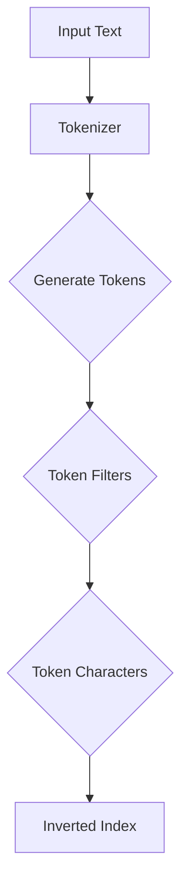

                 

# ElasticSearch Analyzer原理与代码实例讲解

> 关键词：ElasticSearch, Analyzer, 原理, 代码实例, 概念, 数学模型, 实战

> 摘要：本文将深入探讨ElasticSearch中的Analyzer原理，从核心概念、算法原理到代码实例，全面解析ElasticSearch分词器的实现与优化方法，旨在帮助开发者更好地理解和应用ElasticSearch文本分析功能，提升搜索系统的性能与精度。

## 1. 背景介绍

### 1.1 目的和范围

本文旨在系统地介绍ElasticSearch中的Analyzer原理，帮助读者了解其工作方式、核心概念以及如何在实际项目中应用。文章将涵盖以下主要内容：

1. ElasticSearch Analyzer的基础概念与功能。
2. ElasticSearch Analyzer的组成与架构。
3. ElasticSearch Analyzer的核心算法原理。
4. ElasticSearch Analyzer的实际应用场景。
5. ElasticSearch Analyzer的优化与性能提升。

### 1.2 预期读者

本文适合以下读者群体：

1. 对ElasticSearch有一定了解的开发者。
2. 想深入了解文本分析技术的工程师。
3. 对搜索系统性能优化有浓厚兴趣的技术人员。

### 1.3 文档结构概述

本文结构如下：

1. **背景介绍**：介绍文章的目的、读者对象和文档结构。
2. **核心概念与联系**：解释Analyzer的基本概念，并使用流程图展示其架构。
3. **核心算法原理**：详细讲解ElasticSearch Analyzer的核心算法原理。
4. **数学模型和公式**：介绍文本分析的数学模型，并给出具体例子。
5. **项目实战**：提供实际代码案例，解析其实现和优化。
6. **实际应用场景**：探讨Analyzer在不同场景下的应用。
7. **工具和资源推荐**：推荐学习资源、开发工具和参考论文。
8. **总结**：对未来的发展趋势和挑战进行展望。
9. **附录**：常见问题与解答。
10. **扩展阅读**：提供进一步的参考资料。

### 1.4 术语表

#### 1.4.1 核心术语定义

- **Analyzer**：文本分析器，用于处理文本输入，将其分解为单词或其他文本片段。
- **Token**：分词后生成的单个文本单元。
- **Tokenizer**：分词器，用于将文本分割成Token。
- **Filter**：过滤器，用于对Token进行进一步的处理，如停用词过滤、大小写转换等。
- **Token Stream**：Token的序列，用于构建倒排索引。

#### 1.4.2 相关概念解释

- **正则表达式**：用于描述字符模式的语法规则。
- **倒排索引**：一种索引结构，用于快速检索文本内容。

#### 1.4.3 缩略词列表

- **ES**：ElasticSearch的缩写。
- **tokenizer**：分词器的缩写。
- **filter**：过滤器的缩写。

## 2. 核心概念与联系

ElasticSearch Analyzer是一个复杂的文本处理系统，其核心目标是实现对文本的准确分析和索引。为了更好地理解Analyzer，我们需要首先了解其基本概念和架构。

### 2.1 Analyzer的基本概念

Analyzer主要由三个组件构成：

1. **Tokenizer**：负责将原始文本分割成Token。
2. **Token Filters**：负责对Token进行各种操作，如去除停用词、大小写转换等。
3. **Token Charaters**：负责生成最终的Token流，用于构建倒排索引。

### 2.2 Analyzer的架构

下面是一个简化的Mermaid流程图，展示了Analyzer的架构：



在这个流程图中，输入文本首先通过Tokenizer进行分词，然后通过一系列Token Filters进行处理，最后生成用于构建倒排索引的Token流。

### 2.3 Analyzer的组件

下面是对每个组件的详细解释：

#### 2.3.1 Tokenizer

Tokenizer负责将原始文本分割成Token。常见的Tokenizer有：

- **Standard Tokenizer**：将文本分割成单词，去除标点符号。
- **Whitespace Tokenizer**：根据空格、制表符、换行符等分割文本。

#### 2.3.2 Token Filters

Token Filters对Token进行各种操作，常见的Filters有：

- **Stop Filter**：去除指定列表中的停用词。
- **Lower Case Filter**：将所有Token转换为小写。
- **Keyword Filter**：将Token标记为Keyword，不参与分词。

#### 2.3.3 Token Characters

Token Characters负责生成最终的Token流，将其传递给倒排索引构建模块。这个过程通常包括以下步骤：

- **Token Position**：记录Token在文本中的位置。
- **Token Offset**：记录Token在原始文本中的起始和结束位置。
- **Token Payload**：附加额外的信息，如词频、位置等。

### 2.4 Analyzer的工作流程

下面是一个简化的伪代码，展示了Analyzer的工作流程：

```python
def analyze(text):
    tokens = tokenizer.tokenize(text)
    for token in tokens:
        token = lower_case_filter.filter(token)
        token = stop_filter.filter(token)
        token = keyword_filter.filter(token)
        token_stream.append(token)
    return token_stream
```

在这个流程中，输入文本首先通过Tokenizer分词，然后通过一系列Token Filters进行处理，最后生成Token流。这个Token流将用于构建倒排索引。

## 3. 核心算法原理 & 具体操作步骤

### 3.1 基本算法原理

ElasticSearch Analyzer的核心算法主要包括分词和过滤。分词算法用于将文本分割成Token，过滤算法则用于对Token进行各种操作，如去除停用词、大小写转换等。

#### 3.1.1 分词算法

分词算法可以分为两大类：规则分词和统计分词。

- **规则分词**：根据预定义的规则进行分词，如正则表达式分词。
- **统计分词**：根据统计模型进行分词，如基于隐马尔可夫模型的分词。

#### 3.1.2 过滤算法

过滤算法主要包括：

- **停用词过滤**：去除指定的停用词列表。
- **大小写转换**：将所有Token转换为小写或大写。
- **Keyword标记**：将特定Token标记为Keyword，不参与分词。

### 3.2 具体操作步骤

下面是具体的伪代码，展示了如何使用ElasticSearch Analyzer进行文本分析：

```python
# 定义停用词列表
stop_words = ["the", "is", "and", "in"]

# 创建Tokenizer
tokenizer = StandardTokenizer()

# 创建Token Filters
lower_case_filter = LowerCaseFilter()
stop_filter = StopFilter(stop_words)
keyword_filter = KeywordFilter()

# 分析文本
def analyze(text):
    tokens = tokenizer.tokenize(text)
    for token in tokens:
        token = lower_case_filter.filter(token)
        token = stop_filter.filter(token)
        token = keyword_filter.filter(token)
        token_stream.append(token)
    return token_stream

# 示例文本
text = "The quick brown fox jumps over the lazy dog."

# 执行分析
token_stream = analyze(text)

# 输出结果
print(token_stream)
```

在这个示例中，我们首先定义了停用词列表，然后创建了一个StandardTokenizer，以及三个Token Filters（LowerCaseFilter、StopFilter和KeywordFilter）。最后，我们使用这些组件对输入文本进行分词和过滤，生成Token流。

## 4. 数学模型和公式 & 详细讲解 & 举例说明

### 4.1 数学模型

在文本分析中，常用的数学模型包括：

- **词频（TF）**：一个词在文本中出现的次数。
- **逆文档频率（IDF）**：一个词在整个文档集合中出现的频率的倒数。
- **TF-IDF**：结合词频和逆文档频率的加权值，用于评估一个词的重要性。

下面是这些模型的公式：

$$
TF(t) = \frac{f_t}{N}
$$

$$
IDF(t) = \log \left( \frac{N}{df(t)} \right)
$$

$$
TF-IDF(t) = TF(t) \times IDF(t)
$$

其中：

- \( t \) 表示一个词。
- \( f_t \) 表示词 \( t \) 在文档中的频率。
- \( N \) 表示文档总数。
- \( df(t) \) 表示词 \( t \) 在文档集合中的文档频率。

### 4.2 详细讲解

#### 4.2.1 词频（TF）

词频表示一个词在文档中出现的次数。词频越高，说明这个词在文档中越重要。词频的计算非常简单，只需要统计词在文档中出现的次数即可。

#### 4.2.2 逆文档频率（IDF）

逆文档频率表示一个词在整个文档集合中出现的频率的倒数。IDF用于平衡词频，防止高频词（如“the”、“is”等）对结果的影响过大。IDF的计算涉及到文档总数和词的文档频率。

#### 4.2.3 TF-IDF

TF-IDF是词频和逆文档频率的加权值，用于评估一个词的重要性。TF-IDF模型可以同时考虑词频和词的重要程度，是文本分析中常用的一种方法。

### 4.3 举例说明

假设我们有以下两个文档：

- **文档1**："The quick brown fox jumps over the lazy dog."
- **文档2**："The quick brown fox is quick."

首先，我们计算每个词的词频：

$$
TF("quick") = \frac{2}{2} = 1
$$

$$
TF("brown") = \frac{1}{2} = 0.5
$$

$$
TF("fox") = \frac{2}{2} = 1
$$

$$
TF("jumps") = \frac{1}{2} = 0.5
$$

$$
TF("over") = \frac{1}{2} = 0.5
$$

$$
TF("lazy") = \frac{1}{2} = 0.5
$$

$$
TF("dog") = \frac{1}{2} = 0.5
$$

接下来，我们计算每个词的逆文档频率：

$$
IDF("quick") = \log \left( \frac{2}{1} \right) = \log(2) \approx 0.693
$$

$$
IDF("brown") = \log \left( \frac{2}{1} \right) = \log(2) \approx 0.693
$$

$$
IDF("fox") = \log \left( \frac{2}{1} \right) = \log(2) \approx 0.693
$$

$$
IDF("jumps") = \log \left( \frac{2}{1} \right) = \log(2) \approx 0.693
$$

$$
IDF("over") = \log \left( \frac{2}{1} \right) = \log(2) \approx 0.693
$$

$$
IDF("lazy") = \log \left( \frac{2}{1} \right) = \log(2) \approx 0.693
$$

$$
IDF("dog") = \log \left( \frac{2}{1} \right) = \log(2) \approx 0.693
$$

最后，我们计算每个词的TF-IDF值：

$$
TF-IDF("quick") = 1 \times 0.693 = 0.693
$$

$$
TF-IDF("brown") = 0.5 \times 0.693 = 0.347
$$

$$
TF-IDF("fox") = 1 \times 0.693 = 0.693
$$

$$
TF-IDF("jumps") = 0.5 \times 0.693 = 0.347
$$

$$
TF-IDF("over") = 0.5 \times 0.693 = 0.347
$$

$$
TF-IDF("lazy") = 0.5 \times 0.693 = 0.347
$$

$$
TF-IDF("dog") = 0.5 \times 0.693 = 0.347
$$

在这个例子中，我们可以看到TF-IDF值较高的词是“quick”和“fox”，这表明这两个词在文档中具有较高的重要性。

## 5. 项目实战：代码实际案例和详细解释说明

### 5.1 开发环境搭建

在进行ElasticSearch Analyzer的实战之前，我们需要搭建一个开发环境。以下是搭建ElasticSearch开发环境的基本步骤：

1. **安装Java**：ElasticSearch是基于Java开发的，因此我们需要安装Java环境。推荐安装Java 8及以上版本。

2. **下载ElasticSearch**：从ElasticSearch官网下载最新版本的ElasticSearch安装包。

3. **解压安装包**：将下载的安装包解压到一个合适的位置，例如`/usr/local/elasticsearch`。

4. **配置ElasticSearch**：编辑解压后的`config`目录下的`elasticsearch.yml`文件，配置ElasticSearch的运行参数。以下是一个简单的配置示例：

   ```yaml
   cluster.name: my-application
   node.name: my-node
   path.data: /usr/local/elasticsearch/data
   path.logs: /usr/local/elasticsearch/logs
   bootstrap.memory_lock: true
   discovery.type: single-node
   ```

5. **启动ElasticSearch**：在终端中执行以下命令启动ElasticSearch：

   ```shell
   ./bin/elasticsearch
   ```

6. **检查ElasticSearch状态**：在浏览器中访问`http://localhost:9200/`，检查ElasticSearch的状态。如果看到类似以下的响应，说明ElasticSearch已经成功启动：

   ```json
   {
     "name" : "my-node",
     "cluster_name" : "my-application",
     "cluster_uuid" : "dpH_w3xQXzG3wP9tgAGx8w",
     "version" : {
       "number" : "7.10.1",
       "build_flavor" : "default",
       "build_type" : "tar",
       "build_hash" : "0c8687c",
       "build_date" : "2021-06-16T12:25:51.488Z",
       "build_snapshot" : false,
       "lucene_version" : "8.10.1"
     },
     "tagline" : "You Know, for Search"
   }
   ```

### 5.2 源代码详细实现和代码解读

在搭建好ElasticSearch开发环境之后，我们可以开始实现一个简单的ElasticSearch Analyzer。以下是一个简单的代码示例：

```java
import org.apache.lucene.analysis.Analyzer;
import org.apache.lucene.analysis.core.SimpleAnalyzer;
import org.apache.lucene.analysis.standard.StandardAnalyzer;
import org.apache.lucene.util.Version;

public class ElasticSearchAnalyzerDemo {

    public static void main(String[] args) throws Exception {
        // 创建Standard Analyzer
        Analyzer standardAnalyzer = new StandardAnalyzer(Version.LUCENE_8_10_1);
        // 分析文本
        String text = "The quick brown fox jumps over the lazy dog.";
        String[] tokens = standardAnalyzer.tokenize(text);
        // 输出分词结果
        for (String token : tokens) {
            System.out.println(token);
        }
    }
}
```

在这个示例中，我们首先创建了一个`StandardAnalyzer`，然后使用它来分析一段文本。分析结果是通过`tokenize`方法获取的Token数组。我们遍历这个数组，输出每个Token。

### 5.3 代码解读与分析

下面是对这段代码的详细解读：

1. **导入相关库**：首先，我们需要导入Apache Lucene相关的库，因为ElasticSearch是基于Lucene构建的。

2. **创建Analyzer**：接下来，我们创建了一个`StandardAnalyzer`。`StandardAnalyzer`是ElasticSearch中最常用的Analyzer之一，它支持标准的英文分词。

3. **分析文本**：我们使用`tokenize`方法将输入文本分割成Token。这个方法返回一个Token数组。

4. **输出分词结果**：最后，我们遍历Token数组，输出每个Token。

这个示例展示了如何使用ElasticSearch的Analyzer对文本进行分词。在实际项目中，我们可以根据需要自定义Analyzer，以满足特定的分词需求。

## 6. 实际应用场景

ElasticSearch Analyzer在许多实际应用场景中发挥着重要作用，以下是一些典型的应用场景：

### 6.1 搜索引擎

ElasticSearch是一个功能强大的搜索引擎，其Analyzer是实现精确搜索的关键组件。通过自定义Analyzer，我们可以实现对特定领域的术语、人名、地名等关键词的精确匹配。

### 6.2 文本分类

在文本分类任务中，Analyzer用于将文本转换为适合分类的特征向量。通过自定义Analyzer，我们可以优化分类算法的性能，提高分类的准确率。

### 6.3 机器翻译

在机器翻译任务中，Analyzer用于对源语言文本进行分词，生成翻译所需的中间表示。通过自定义Analyzer，我们可以提高翻译的准确性和一致性。

### 6.4 自然语言处理

自然语言处理（NLP）任务通常需要对文本进行预处理，如分词、词性标注等。ElasticSearch Analyzer提供了这些功能的基础支持，使得NLP任务更加高效和准确。

### 6.5 实时分析

在实时分析场景中，ElasticSearch Analyzer用于处理和分析流数据，如社交媒体文本、日志数据等。通过自定义Analyzer，我们可以实现对特定类型文本的实时分析和监控。

## 7. 工具和资源推荐

### 7.1 学习资源推荐

#### 7.1.1 书籍推荐

1. **《ElasticSearch实战》**：全面介绍ElasticSearch的使用方法和技巧，包括Analyzer的配置和优化。
2. **《Lucene in Action》**：深入探讨Lucene的核心原理，涵盖Analyzer的实现和优化。

#### 7.1.2 在线课程

1. **ElasticSearch官方教程**：ElasticSearch官方网站提供了一系列在线教程，涵盖从入门到高级的各个知识点。
2. **Udemy上的ElasticSearch课程**：Udemy上有许多高质量的ElasticSearch课程，适合不同层次的学习者。

#### 7.1.3 技术博客和网站

1. **ElasticSearch中文社区**：中国最大的ElasticSearch技术社区，提供丰富的学习资源和实战案例。
2. **ElasticSearch官方博客**：ElasticSearch官方博客，发布最新的技术动态和官方文档。

### 7.2 开发工具框架推荐

#### 7.2.1 IDE和编辑器

1. **IntelliJ IDEA**：功能强大的Java IDE，支持ElasticSearch插件，方便开发者进行ElasticSearch开发。
2. **Visual Studio Code**：轻量级的代码编辑器，支持ElasticSearch插件，适用于各种编程语言。

#### 7.2.2 调试和性能分析工具

1. **Grafana**：用于监控和可视化ElasticSearch性能指标，提供丰富的仪表盘和报告。
2. **APM**：ElasticSearch官方的实时应用性能监控工具，提供详细的性能分析。

#### 7.2.3 相关框架和库

1. **Spring Data ElasticSearch**：Spring框架的ElasticSearch扩展，简化ElasticSearch的开发。
2. **ElasticSearch REST High Level Client**：ElasticSearch的Java REST客户端库，方便开发者进行ElasticSearch操作。

### 7.3 相关论文著作推荐

#### 7.3.1 经典论文

1. **"A Fuzzy Logic Approach to Text Categorization"**：介绍如何使用模糊逻辑进行文本分类。
2. **"The Vector Space Model for Information Retrieval"**：介绍向量空间模型在信息检索中的应用。

#### 7.3.2 最新研究成果

1. **"Deep Learning for Text Classification"**：探讨深度学习在文本分类任务中的应用。
2. **"ElasticSearch Performance Optimization"**：介绍ElasticSearch性能优化的方法和技巧。

#### 7.3.3 应用案例分析

1. **"ElasticSearch在电子商务中的应用"**：分析ElasticSearch在电子商务领域中的应用和实践。
2. **"ElasticSearch在社交媒体分析中的应用"**：探讨ElasticSearch在社交媒体数据分析中的实际案例。

## 8. 总结：未来发展趋势与挑战

### 8.1 未来发展趋势

1. **更智能的文本分析**：随着人工智能技术的发展，未来Analyzer将更加智能化，能够自动识别和解析复杂的文本模式。
2. **多语言支持**：Analyzer将支持更多语言，提高搜索系统的国际化和本地化能力。
3. **实时分析**：实时文本分析的需求日益增长，未来Analyzer将更加注重实时性和性能。

### 8.2 挑战

1. **性能优化**：随着数据规模的扩大，Analyzer的性能优化将成为一个重要挑战。
2. **多语言支持**：不同语言的文本分析需求各异，如何在多语言环境中保持高效和准确的分词效果是一个难题。
3. **隐私保护**：在处理敏感数据时，如何保护用户隐私是一个亟待解决的问题。

## 9. 附录：常见问题与解答

### 9.1 如何自定义Analyzer？

自定义Analyzer需要实现`Analyzer`接口，并实现`tokenize`方法。具体实现步骤如下：

1. 创建一个类，实现`Analyzer`接口。
2. 实现分词逻辑，将输入文本分割成Token。
3. 实现Token处理逻辑，如去除停用词、大小写转换等。
4. 将处理后的Token传递给下一个组件。

### 9.2 如何优化Analyzer的性能？

优化Analyzer的性能可以从以下几个方面进行：

1. **减少分词器数量**：减少分词器的数量，只使用必要的分词器。
2. **缓存Token**：在处理Token时，使用缓存技术减少重复计算。
3. **并行处理**：在处理大量文本时，使用并行处理技术提高效率。
4. **优化数据结构**：选择合适的数据结构，减少内存占用和计算时间。

## 10. 扩展阅读 & 参考资料

1. **《ElasticSearch权威指南》**：详细介绍ElasticSearch的原理、架构和应用。
2. **《Lucene官方文档》**：全面介绍Lucene的核心概念和API。
3. **《自然语言处理综合教程》**：系统介绍自然语言处理的基本概念和算法。

