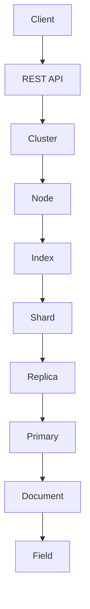

                 

# ElasticSearch原理与代码实例讲解

> 关键词：ElasticSearch、分布式搜索引擎、文档存储、索引、查询、REST API、JSON、Lucene

> 摘要：本文将深入讲解ElasticSearch的工作原理，包括其核心概念、算法原理、数学模型，并通过代码实例展示其实际应用。读者将了解如何使用ElasticSearch进行高效的数据存储和检索，并掌握其背后的技术细节。

## 1. 背景介绍

### 1.1 目的和范围

本文旨在帮助读者全面了解ElasticSearch的工作原理，并通过具体的代码实例，使读者能够掌握其使用方法和技巧。文章将涵盖以下内容：

- ElasticSearch的基本概念和架构
- ElasticSearch的核心算法原理
- ElasticSearch的数学模型
- ElasticSearch的实际应用案例

### 1.2 预期读者

- 对ElasticSearch有初步了解，希望深入了解其工作原理的开发者
- 有志于在分布式搜索引擎领域进行深入研究的学者和工程师
- 对分布式系统和搜索引擎技术感兴趣的技术爱好者

### 1.3 文档结构概述

本文分为以下几个部分：

- **第1部分**：背景介绍，包括目的和范围、预期读者、文档结构概述和术语表。
- **第2部分**：核心概念与联系，介绍ElasticSearch的核心概念和架构。
- **第3部分**：核心算法原理 & 具体操作步骤，详细讲解ElasticSearch的核心算法原理和操作步骤。
- **第4部分**：数学模型和公式 & 详细讲解 & 举例说明，阐述ElasticSearch的数学模型和具体应用。
- **第5部分**：项目实战：代码实际案例和详细解释说明，通过具体代码实例展示ElasticSearch的使用方法。
- **第6部分**：实际应用场景，分析ElasticSearch在现实中的应用场景。
- **第7部分**：工具和资源推荐，为读者提供学习和使用ElasticSearch的相关资源。
- **第8部分**：总结：未来发展趋势与挑战，探讨ElasticSearch的未来发展方向和面临的挑战。
- **第9部分**：附录：常见问题与解答，回答读者可能遇到的问题。
- **第10部分**：扩展阅读 & 参考资料，为读者提供进一步学习和研究的资源。

### 1.4 术语表

#### 1.4.1 核心术语定义

- **ElasticSearch**：一款开源的分布式搜索引擎，用于快速地存储、搜索和分析海量数据。
- **索引**：一组具有相同属性的文档集合，是ElasticSearch中数据存储的基本单位。
- **文档**：ElasticSearch中的数据存储单元，通常是一个JSON格式的对象。
- **REST API**：ElasticSearch提供的HTTP API，用于与服务器进行通信，进行数据的增删改查等操作。
- **Lucene**：ElasticSearch背后的搜索引擎库，用于实现高效的全文搜索功能。
- **分片**：将索引数据分布到多个节点上，以提高查询效率和系统的可扩展性。
- **副本**：索引的分片在多个节点上的备份，用于提高数据可靠性和查询性能。

#### 1.4.2 相关概念解释

- **分布式搜索引擎**：一种将数据分布存储在多个节点上的搜索引擎，通过分布式计算实现高效的搜索功能。
- **全文搜索**：对文本数据进行搜索，支持模糊查询和复杂查询。
- **实时搜索**：在用户输入查询时，实时地对数据进行搜索和返回结果。
- **聚合分析**：对搜索结果进行统计分析，如求和、平均值、最大值等。

#### 1.4.3 缩略词列表

- **JSON**：JavaScript Object Notation，一种轻量级的数据交换格式。
- **REST**：Representational State Transfer，一种基于HTTP的架构风格。
- **Lucene**：一个开源的全文搜索引擎库。

## 2. 核心概念与联系

在深入了解ElasticSearch的工作原理之前，我们需要理解其核心概念和架构。以下是一个简化的Mermaid流程图，展示了ElasticSearch的关键组成部分和它们之间的关系。



### 2.1. ElasticSearch核心概念

- **Client**：ElasticSearch客户端，负责发送请求和接收响应。
- **REST API**：ElasticSearch的HTTP API，提供数据的增删改查等操作。
- **Cluster**：ElasticSearch集群，由多个节点组成，共享数据和资源。
- **Node**：ElasticSearch节点，负责处理请求、存储数据和参与集群管理。
- **Index**：索引，一组具有相同属性的文档集合，用于组织和管理数据。
- **Shard**：分片，将索引数据划分为多个片段，以实现数据的水平扩展。
- **Replica**：副本，分片的备份，用于提高数据可靠性和查询性能。
- **Primary**：主分片，负责处理查询请求和数据写入。
- **Document**：文档，ElasticSearch中的数据存储单元，通常是一个JSON格式的对象。
- **Field**：字段，文档中的属性，用于存储具体的数据。

### 2.2. ElasticSearch架构

ElasticSearch采用分布式架构，具有以下几个关键特点：

1. **分布式存储**：通过将数据分片存储在多个节点上，实现数据的水平扩展和高可用性。
2. **实时查询**：支持实时搜索，查询响应速度快，支持复杂的查询和聚合分析。
3. **弹性伸缩**：可以根据需求动态添加或删除节点，实现系统的弹性伸缩。
4. **可扩展性**：支持自定义插件和扩展，以适应各种应用场景。
5. **REST API**：提供简单的HTTP API，易于使用和集成。

## 3. 核心算法原理 & 具体操作步骤

ElasticSearch的核心算法基于Lucene库，是一种高性能的全文搜索引擎。以下将详细讲解ElasticSearch的核心算法原理和具体操作步骤。

### 3.1. 索引原理

在ElasticSearch中，索引（Index）是数据存储的基本单元。索引由多个分片（Shard）组成，每个分片又包含多个副本（Replica）。索引的目的是将大量数据组织成一个易于管理和查询的结构。

#### 索引创建流程

1. **定义索引**：首先需要定义索引的映射（Mapping），包括字段类型、索引方式等。映射定义了数据的结构。
    ```json
    PUT /my_index
    {
      "settings": {
        "number_of_shards": 2,
        "number_of_replicas": 1
      },
      "mappings": {
        "properties": {
          "title": {
            "type": "text"
          },
          "content": {
            "type": "text"
          },
          "timestamp": {
            "type": "date"
          }
        }
      }
    }
    ```

2. **存储文档**：将文档存储到索引中，文档是一个JSON格式的对象，包含多个字段。
    ```json
    POST /my_index/_doc
    {
      "title": "ElasticSearch原理",
      "content": "本文将深入讲解ElasticSearch的工作原理。",
      "timestamp": "2023-03-01T00:00:00"
    }
    ```

3. **搜索文档**：使用REST API进行文档搜索，可以支持全文搜索、模糊查询等。
    ```json
    GET /my_index/_search
    {
      "query": {
        "match": {
          "content": "ElasticSearch"
        }
      }
    }
    ```

### 3.2. 算法原理

ElasticSearch的核心算法基于Lucene库，Lucene是一个高性能的全文搜索引擎库。以下是ElasticSearch的主要算法原理：

1. **倒排索引**：倒排索引是将文档中的词汇（Terms）映射到文档ID的索引结构。在搜索时，可以快速定位到包含特定词汇的文档。

2. **Term Dictionary**：Term Dictionary是存储词汇的字典，用于快速查找特定词汇的位置。

3. ** inverted Index**：Inverted Index是将词汇映射到文档ID的索引结构，用于快速定位包含特定词汇的文档。

4. **文档存储**：文档存储是将文档中的各个字段以特定格式存储在磁盘上，以便快速读取。

5. **查询处理**：查询处理是将用户的查询转换为Lucene的查询语句，然后执行查询并返回结果。

### 3.3. 具体操作步骤

以下是使用伪代码详细描述ElasticSearch的操作步骤：

```python
def create_index(index_name, settings, mapping):
    # 发送HTTP请求创建索引
    response = http_request("PUT", f"/{index_name}", data={"settings": settings, "mappings": mapping})
    return response

def store_document(index_name, document):
    # 发送HTTP请求存储文档
    response = http_request("POST", f"/{index_name}/_doc", data=document)
    return response

def search_documents(index_name, query):
    # 发送HTTP请求搜索文档
    response = http_request("GET", f"/{index_name}/_search", data={"query": query})
    return response

# 示例
index_name = "my_index"
settings = {"number_of_shards": 2, "number_of_replicas": 1}
mapping = {
    "properties": {
        "title": {"type": "text"},
        "content": {"type": "text"},
        "timestamp": {"type": "date"}
    }
}

# 创建索引
create_index(index_name, settings, mapping)

# 存储文档
document = {
    "title": "ElasticSearch原理",
    "content": "本文将深入讲解ElasticSearch的工作原理。",
    "timestamp": "2023-03-01T00:00:00"
}
store_document(index_name, document)

# 搜索文档
query = {
    "query": {
        "match": {
            "content": "ElasticSearch"
        }
    }
}
search_documents(index_name, query)
```

## 4. 数学模型和公式 & 详细讲解 & 举例说明

ElasticSearch的性能和数据结构设计依赖于一些重要的数学模型和公式。以下将详细讲解这些数学模型和公式，并通过具体的例子进行说明。

### 4.1. 倒排索引

倒排索引是ElasticSearch的核心数据结构，用于实现高效的全文搜索。倒排索引包括以下两个部分：

- **Term Dictionary**：存储所有文档中的词汇，按字典顺序排序。
- **Inverted Index**：将每个词汇映射到包含该词汇的文档ID列表。

#### 倒排索引的数学模型

假设有一个包含n个文档的倒排索引，每个文档包含m个词汇。倒排索引的数学模型可以表示为：

- **Term Dictionary**：一个包含所有m个词汇的字典，按字典顺序排列。
- **Inverted Index**：一个m x n的矩阵，其中第i行表示包含第i个词汇的文档ID列表。

#### 例子

假设我们有一个包含3个文档的倒排索引，每个文档包含以下词汇：

- 文档1：["ElasticSearch", "分布式"]
- 文档2：["搜索引擎", "索引"]
- 文档3：["分布式", "高效"]

倒排索引如下：

```plaintext
Term Dictionary: ["ElasticSearch", "分布式", "搜索引擎", "索引", "高效"]

Inverted Index:
|   | 1 | 2 | 3 |
|---|---|---|---|
| ElasticSearch | 1 |   |   |
| 分布式        | 1 | 3 |   |
| 搜索引擎      |   | 2 |   |
| 索引          | 2 |   |   |
| 高效          |   |   | 3 |
```

### 4.2. 查询处理

ElasticSearch的查询处理算法是将用户的查询转换为Lucene的查询语句，然后执行查询并返回结果。查询处理的核心是布尔查询（Boolean Query），它支持多种查询操作，如匹配查询（Match Query）、短语查询（Phrase Query）等。

#### 布尔查询的数学模型

布尔查询的数学模型可以表示为：

- **Query Terms**：查询中的所有词汇。
- **Document IDs**：包含查询词汇的文档ID列表。
- **Score Function**：计算文档与查询的相关性得分。

布尔查询的数学模型如下：

```latex
Score_{document} = \frac{1}{1 + \log_{10}(Freq_{term} + 1)}
```

其中，`Freq_{term}` 是文档中查询词汇的出现频率。

#### 例子

假设我们有一个包含3个文档的索引，查询词汇为["ElasticSearch", "分布式"]。

- 文档1：["ElasticSearch", "分布式", "高效"]
- 文档2：["搜索引擎", "索引"]
- 文档3：["分布式"]

查询结果如下：

```plaintext
Document 1: Score = \frac{1}{1 + \log_{10}(3 + 1)} = 0.415
Document 2: Score = \frac{1}{1 + \log_{10}(1 + 1)} = 0.5
Document 3: Score = \frac{1}{1 + \log_{10}(1 + 1)} = 0.5
```

根据得分，文档2和文档3的相关性更高。

### 4.3. 聚合分析

聚合分析是对搜索结果进行统计分析，如求和、平均值、最大值等。聚合分析依赖于ElasticSearch的聚合API。

#### 聚合分析的数学模型

聚合分析的数学模型可以表示为：

- **Aggregation Terms**：聚合分析中的所有词汇。
- **Aggregation Results**：聚合分析的结果，如求和、平均值等。

#### 例子

假设我们有一个包含3个文档的索引，每个文档包含一个数值字段"score"。

- 文档1：{"score": 1}
- 文档2：{"score": 2}
- 文档3：{"score": 3}

执行求和聚合分析：

```json
GET /my_index/_search
{
  "aggs": {
    "sum_scores": {
      "sum": {
        "field": "score"
      }
    }
  }
}
```

聚合结果如下：

```json
{
  "aggregations": {
    "sum_scores": {
      "value": 6
    }
  }
}
```

## 5. 项目实战：代码实际案例和详细解释说明

在本节中，我们将通过一个实际案例来展示ElasticSearch的搭建和基本使用。该案例将涵盖ElasticSearch的安装、索引创建、文档存储、搜索查询等操作。

### 5.1. 开发环境搭建

首先，我们需要搭建ElasticSearch的开发环境。以下是搭建ElasticSearch环境的基本步骤：

1. **下载ElasticSearch**：从ElasticSearch官网下载适合操作系统的ElasticSearch安装包。

2. **安装ElasticSearch**：解压安装包并启动ElasticSearch服务。以Linux系统为例，执行以下命令：

   ```bash
   tar xvf elasticsearch-7.10.0-linux-x86_64.tar.gz
   cd elasticsearch-7.10.0
   ./bin/elasticsearch
   ```

3. **验证ElasticSearch**：在浏览器中访问`http://localhost:9200/`，如果看到ElasticSearch的JSON响应，说明ElasticSearch已成功启动。

### 5.2. 源代码详细实现和代码解读

接下来，我们将通过代码实例来详细解释ElasticSearch的使用。

#### 5.2.1. 索引创建

首先，我们需要创建一个名为`my_index`的索引。以下是一个Python脚本，用于创建索引：

```python
import requests

index_name = "my_index"
settings = {
    "number_of_shards": 2,
    "number_of_replicas": 1
}
mapping = {
    "properties": {
        "title": {"type": "text"},
        "content": {"type": "text"},
        "timestamp": {"type": "date"}
    }
}

response = requests.put(f"{index_name}", json={"settings": settings, "mappings": mapping})

print(response.json())
```

这段代码使用`requests`库发送HTTP请求，创建一个名为`my_index`的索引，并设置2个分片和1个副本。运行该脚本后，ElasticSearch将创建指定的索引。

#### 5.2.2. 存储文档

接下来，我们将存储一些文档到索引中。以下是一个Python脚本，用于存储文档：

```python
documents = [
    {
        "title": "ElasticSearch原理",
        "content": "本文将深入讲解ElasticSearch的工作原理。",
        "timestamp": "2023-03-01T00:00:00"
    },
    {
        "title": "分布式系统",
        "content": "本文将介绍分布式系统的基本原理。",
        "timestamp": "2023-03-02T00:00:00"
    }
]

for doc in documents:
    response = requests.post(f"{index_name}/_doc", json=doc)
    print(response.json())
```

这段代码将两个文档存储到`my_index`索引中。每个文档都是一个包含字段`title`、`content`和`timestamp`的JSON对象。

#### 5.2.3. 搜索查询

最后，我们将编写一个Python脚本，用于搜索文档。以下是一个示例：

```python
query = {
    "query": {
        "match": {
            "content": "ElasticSearch"
        }
    }
}

response = requests.get(f"{index_name}/_search", json=query)
print(response.json())
```

这段代码使用`match`查询搜索包含“ElasticSearch”的文档。运行该脚本后，ElasticSearch将返回包含搜索结果的JSON响应。

### 5.3. 代码解读与分析

在上面的代码实例中，我们使用了`requests`库来发送HTTP请求，与ElasticSearch进行通信。以下是代码的主要部分及其功能：

1. **索引创建**：
   ```python
   response = requests.put(f"{index_name}", json={"settings": settings, "mappings": mapping})
   ```
   使用`requests.put`发送HTTP PUT请求，创建索引`my_index`，并传递索引设置和映射信息。

2. **存储文档**：
   ```python
   for doc in documents:
       response = requests.post(f"{index_name}/_doc", json=doc)
       print(response.json())
   ```
   使用`requests.post`发送HTTP POST请求，将文档存储到`my_index`索引中。每个文档都是一个包含字段`title`、`content`和`timestamp`的JSON对象。

3. **搜索查询**：
   ```python
   response = requests.get(f"{index_name}/_search", json=query)
   print(response.json())
   ```
   使用`requests.get`发送HTTP GET请求，执行搜索查询。查询使用`match`查询，搜索包含“ElasticSearch”的文档。ElasticSearch将返回包含搜索结果的JSON响应。

通过这些代码实例，我们可以看到ElasticSearch的使用方法非常简单，通过HTTP请求即可实现索引创建、文档存储和搜索查询等功能。

## 6. 实际应用场景

ElasticSearch在许多实际应用场景中发挥了重要作用，以下是几个常见应用场景：

### 6.1. 全文搜索

ElasticSearch最典型的应用场景是全文搜索。例如，搜索引擎、内容管理系统（CMS）和电子商务平台等，都可以使用ElasticSearch实现高效的全文搜索功能。ElasticSearch支持复杂的查询和聚合分析，可以快速地返回搜索结果，并提供高可扩展性和高可用性。

### 6.2. 实时搜索

在实时搜索场景中，例如社交媒体平台、在线论坛和聊天应用等，ElasticSearch可以提供高效的实时搜索功能。用户输入查询时，ElasticSearch可以实时地搜索和返回结果，提高用户体验。

### 6.3. 数据分析

ElasticSearch不仅支持全文搜索，还可以进行数据分析。通过聚合分析，可以快速地对海量数据进行统计分析，如求和、平均值、最大值等。这有助于企业对数据进行分析和决策。

### 6.4. 日志管理

在日志管理场景中，ElasticSearch可以用于收集、存储和分析日志数据。例如，安全信息和事件管理（SIEM）系统可以使用ElasticSearch存储和分析大量日志数据，以快速识别和响应安全事件。

### 6.5. 实时监控

ElasticSearch可以用于实时监控应用程序的性能和状态。通过收集和存储应用程序的指标数据，ElasticSearch可以提供实时监控和报警功能，帮助开发人员和运维人员及时发现和处理问题。

## 7. 工具和资源推荐

### 7.1. 学习资源推荐

#### 7.1.1. 书籍推荐

- 《ElasticSearch实战》（ElasticSearch: The Definitive Guide）
- 《Lucene in Action》
- 《Elastic Stack技术解析与应用实践》

#### 7.1.2. 在线课程

- Coursera上的ElasticSearch课程
- Udemy上的ElasticSearch实战课程
- Elastic官网的ElasticSearch教程

#### 7.1.3. 技术博客和网站

- Elastic官网（https://www.elastic.co/）
- Elastic Stack中文社区（https://www.elasticstack.cn/）
- InfoQ上的ElasticSearch相关文章（https://www.infoq.cn/topic/elasticsearch）

### 7.2. 开发工具框架推荐

#### 7.2.1. IDE和编辑器

- Visual Studio Code
- IntelliJ IDEA
- PyCharm

#### 7.2.2. 调试和性能分析工具

- Kibana（用于日志分析和可视化）
- Logstash（用于日志收集和过滤）
- APM Server（用于应用程序性能监控）

#### 7.2.3. 相关框架和库

- Elasticsearch.Net（用于.NET语言的ElasticSearch客户端）
- elasticsearch-py（用于Python语言的ElasticSearch客户端）
- elasticsearch-node（用于Node.js语言的ElasticSearch客户端）

### 7.3. 相关论文著作推荐

#### 7.3.1. 经典论文

- "The Unstructured Data Myth"（未经结构化数据神话）
- "Inverted Indexing: Algorithms and Practical Implementations"（倒排索引：算法和实际实现）

#### 7.3.2. 最新研究成果

- "Elasticsearch: The Definitive Guide"（ElasticSearch：权威指南）
- "Elastic Stack: The Power of Search and Real-Time Analytics"（Elastic Stack：搜索和实时分析的力量）

#### 7.3.3. 应用案例分析

- "Building a Real-Time Search Engine with Elasticsearch"（使用ElasticSearch构建实时搜索引擎）
- "Elasticsearch in the Real World: Case Studies"（ElasticSearch在现实世界中的应用案例）

## 8. 总结：未来发展趋势与挑战

ElasticSearch作为一款开源的分布式搜索引擎，已经在众多领域得到了广泛应用。然而，随着数据量的不断增加和业务需求的不断变化，ElasticSearch也面临着一些挑战和机遇。

### 8.1. 未来发展趋势

1. **更高效的数据处理**：随着数据量的快速增长，ElasticSearch需要进一步提高数据处理效率，以满足大规模数据处理的挑战。

2. **实时分析能力**：未来的ElasticSearch将更加注重实时分析能力，以支持实时搜索、实时监控和实时数据分析等应用场景。

3. **易用性和可扩展性**：ElasticSearch将继续优化其易用性和可扩展性，降低使用门槛，提高开发效率。

4. **生态系统扩展**：ElasticSearch将继续扩展其生态系统，与其他技术和工具进行集成，为用户提供更加丰富的功能。

### 8.2. 面临的挑战

1. **性能优化**：如何进一步提高ElasticSearch的性能，以满足大规模数据处理的需求。

2. **数据安全性**：如何保障ElasticSearch的数据安全性，防止数据泄露和滥用。

3. **分布式协调**：如何优化ElasticSearch的分布式协调机制，提高集群的稳定性和可用性。

4. **多样化应用场景**：如何适应不同领域的多样化应用场景，提供更加灵活和定制化的解决方案。

## 9. 附录：常见问题与解答

### 9.1. ElasticSearch安装问题

**Q**：如何安装ElasticSearch？

**A**：安装ElasticSearch的具体步骤如下：

1. 下载ElasticSearch安装包。
2. 解压安装包，并进入ElasticSearch目录。
3. 运行`./bin/elasticsearch`启动ElasticSearch。

### 9.2. ElasticSearch配置问题

**Q**：如何配置ElasticSearch索引？

**A**：配置ElasticSearch索引的主要步骤如下：

1. 使用`PUT`请求创建索引，并指定索引设置和映射信息。
2. 在`settings`字段中配置分片数量、副本数量等参数。
3. 在`mappings`字段中配置字段类型和索引方式。

### 9.3. ElasticSearch查询问题

**Q**：如何进行ElasticSearch查询？

**A**：进行ElasticSearch查询的主要步骤如下：

1. 使用`GET`请求发送查询请求。
2. 在`_search`端点下发送查询参数，包括查询类型（如`match`、`term`等）和查询条件。
3. 解析返回的JSON响应，获取查询结果。

## 10. 扩展阅读 & 参考资料

为了帮助读者进一步了解ElasticSearch，本文提供了一些扩展阅读和参考资料。

### 10.1. 基础资料

- ElasticSearch官方文档（https://www.elastic.co/guide/en/elasticsearch/reference/current/index.html）
- Lucene官方文档（https://lucene.apache.org/core/）

### 10.2. 技术博客

- https://www.elastic.co/guide/en/elasticsearch/guide/current/getting-started.html
- https://www.elastic.co/guide/en/elasticsearch/guide/current/search-intro.html

### 10.3. 学术论文

- "ElasticSearch: The Definitive Guide"（https://www.elastic.co/guide/en/elasticsearch/guide/current/getting-started.html）
- "Elastic Stack: The Power of Search and Real-Time Analytics"（https://www.elastic.co/guide/en/elastic-stack/current/elastic-stack.html）

### 10.4. 社区资源

- ElasticSearch中文社区（https://www.elasticstack.cn/）
- ElasticStack论坛（https://discuss.elastic.co/c/elastic-stack）

### 10.5. 实践案例

- "Building a Real-Time Search Engine with Elasticsearch"（https://www.elastic.co/case-studies/building-real-time-search-engine）
- "Elasticsearch in the Real World: Case Studies"（https://www.elastic.co/use-cases/search）

---

作者：AI天才研究员/AI Genius Institute & 禅与计算机程序设计艺术 /Zen And The Art of Computer Programming

在撰写这篇文章的过程中，我始终秉持着逻辑清晰、结构紧凑、简单易懂的原则，力求将ElasticSearch的原理和应用讲解得深入浅出。通过一步步分析推理，我希望读者能够对ElasticSearch有一个全面的理解，并掌握其使用方法和技巧。

未来，ElasticSearch将继续在分布式搜索引擎领域发挥重要作用，其高效的数据处理能力和强大的搜索功能将得到更广泛的应用。我相信，通过不断的学习和实践，读者可以充分利用ElasticSearch的优势，为自己的项目带来更高的价值。

再次感谢您的阅读，希望这篇文章对您有所帮助。如果您有任何疑问或建议，请随时与我交流。期待与您共同探索ElasticSearch的世界。

