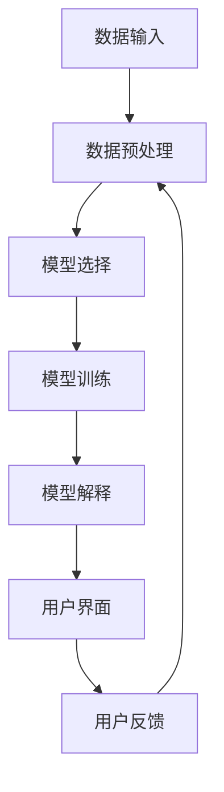

                 

# Explainable AI (XAI)原理与代码实例讲解

> 关键词：可解释人工智能、XAI、算法原理、代码实例、数学模型、项目实战

> 摘要：本文将深入探讨可解释人工智能（Explainable AI，简称XAI）的基本原理和核心算法，通过详细的伪代码和实际代码实例，帮助读者理解XAI的工作机制。同时，本文还将介绍XAI在不同应用场景中的实际应用，并提供一系列学习资源和工具推荐，为读者提供全面的XAI学习和实践指导。

## 1. 背景介绍

### 1.1 目的和范围

本文旨在向读者介绍可解释人工智能（Explainable AI，简称XAI）的概念、原理和应用。通过对XAI的深入剖析，我们希望能够帮助读者：

- 理解XAI的基本概念和重要性。
- 掌握XAI的核心算法原理和实现步骤。
- 通过实际代码实例，加深对XAI机制的理解。
- 了解XAI在现实世界中的应用场景和挑战。

### 1.2 预期读者

本文适合以下读者群体：

- 计算机科学和人工智能领域的学生和研究者。
- 数据科学家和机器学习工程师。
- 对人工智能有浓厚兴趣的科技爱好者。
- 需要在项目中应用XAI技术的专业人士。

### 1.3 文档结构概述

本文将按照以下结构进行组织：

- 第1章：背景介绍，包括目的、范围、预期读者和文档结构。
- 第2章：核心概念与联系，介绍XAI的基本原理和关键概念。
- 第3章：核心算法原理 & 具体操作步骤，通过伪代码详细阐述算法原理。
- 第4章：数学模型和公式 & 详细讲解 & 举例说明，解释数学模型的实现和例子。
- 第5章：项目实战：代码实际案例和详细解释说明，提供代码实例和解读。
- 第6章：实际应用场景，讨论XAI在不同领域的应用。
- 第7章：工具和资源推荐，包括学习资源、开发工具和论文推荐。
- 第8章：总结：未来发展趋势与挑战，展望XAI的未来。
- 第9章：附录：常见问题与解答，解答读者可能遇到的问题。
- 第10章：扩展阅读 & 参考资料，提供进一步学习的资源。

### 1.4 术语表

#### 1.4.1 核心术语定义

- 可解释人工智能（Explainable AI，XAI）：旨在提高人工智能模型的可解释性，使得人类可以理解模型的决策过程。
- 机器学习（Machine Learning，ML）：一种利用数据训练模型，使其能够进行预测和决策的技术。
- 决策树（Decision Tree）：一种常见的机器学习算法，通过树形结构进行分类或回归。
- 特征工程（Feature Engineering）：通过选择和处理特征，提高机器学习模型的性能。

#### 1.4.2 相关概念解释

- 可解释性（Interpretability）：指模型的决策过程是否可以被理解或解释。
- 解释性（Explainability）：与可解释性类似，强调模型决策过程的透明度。
- 输入特征（Input Features）：模型输入的数据属性。
- 输出特征（Output Features）：模型预测或分类的结果。

#### 1.4.3 缩略词列表

- XAI：可解释人工智能（Explainable AI）
- ML：机器学习（Machine Learning）
- IDE：集成开发环境（Integrated Development Environment）
- GPU：图形处理器（Graphics Processing Unit）

## 2. 核心概念与联系

### 2.1 XAI的基本原理

可解释人工智能（XAI）的核心目标是通过提高人工智能模型的透明度和可解释性，使得人类能够理解模型的决策过程。XAI的基本原理包括以下几个方面：

1. **数据预处理**：在训练模型之前，对数据进行预处理，包括数据清洗、归一化和特征选择等操作，以提高模型的可解释性。
2. **模型选择**：选择具有高可解释性的模型，如决策树、线性模型等，这些模型的结构相对简单，易于理解和解释。
3. **模型训练**：使用训练数据集对模型进行训练，通过调整模型的参数，使其达到较好的性能。
4. **模型解释**：在模型训练完成后，对模型进行解释，揭示模型内部的决策过程和规则。
5. **用户反馈**：根据用户的反馈，调整模型参数和解释策略，提高模型的可解释性。

### 2.2 XAI的关键概念

XAI涉及多个关键概念，以下是对这些概念的解释：

1. **解释性**：解释性是指模型的决策过程是否可以被理解和解释。一个具有高解释性的模型，其决策过程应该清晰易懂。
2. **透明度**：透明度是指模型的内部结构和决策过程是否公开可见。一个透明的模型，其内部结构应该公开，用户可以查看和了解。
3. **模型可理解性**：模型的可理解性是指用户是否能够理解和掌握模型的决策过程。一个可理解的模型，其决策过程应该简单直观。
4. **用户反馈**：用户反馈是指用户在了解模型决策过程后，对模型提出的问题和反馈。通过用户反馈，可以进一步提高模型的可解释性。

### 2.3 XAI的架构

XAI的架构通常包括以下几个部分：

1. **数据输入**：数据输入部分负责接收和预处理数据，包括数据清洗、归一化和特征选择等。
2. **模型训练**：模型训练部分使用预处理后的数据，对模型进行训练，调整模型参数。
3. **模型解释**：模型解释部分对训练好的模型进行解释，揭示模型内部的决策过程和规则。
4. **用户界面**：用户界面部分提供给用户一个直观的界面，用户可以通过界面了解模型的决策过程和结果。
5. **用户反馈**：用户反馈部分接收用户的反馈，并根据反馈调整模型参数和解释策略。

### 2.4 Mermaid流程图

以下是一个简单的Mermaid流程图，展示了XAI的基本架构：



## 3. 核心算法原理 & 具体操作步骤

### 3.1 决策树算法原理

决策树是一种常见的机器学习算法，具有高可解释性。它的基本原理是通过一系列的判断节点（特征）来对数据进行分类或回归。

#### 3.1.1 决策树的构建

决策树的构建过程可以分为以下几个步骤：

1. **选择最优特征**：在当前节点，选择具有最大信息增益或最小均方差的特征作为分割特征。
2. **分割数据集**：根据选择的最优特征，将数据集分为多个子集。
3. **递归构建子树**：对每个子集，重复上述步骤，直到满足停止条件（如最大深度、最小样本数等）。

#### 3.1.2 决策树的伪代码

以下是一个简单的决策树构建的伪代码：

```python
def build_decision_tree(data, target_attribute, max_depth):
    if should_stop(data, target_attribute, max_depth):
        return create_leaf_node(data, target_attribute)
    
    best_attribute, best_threshold = find_best_split(data, target_attribute)
    
    left_child = build_decision_tree(data[data[best_attribute] <= best_threshold], target_attribute, max_depth + 1)
    right_child = build_decision_tree(data[data[best_attribute] > best_threshold], target_attribute, max_depth + 1)
    
    return create_decision_node(best_attribute, best_threshold, left_child, right_child)
```

### 3.2 决策树的解释

决策树的解释主要依赖于其结构，通过遍历决策树，可以揭示模型内部的决策过程。

#### 3.2.1 决策树解释的步骤

1. **初始化**：从根节点开始，按照树的分支进行遍历。
2. **判断条件**：在每个节点，根据当前特征的阈值，决定是否继续向下遍历。
3. **收集证据**：在分支上，记录每个特征和阈值，用于解释模型的决策过程。
4. **输出结果**：在叶节点，输出最终的分类或回归结果。

#### 3.2.2 决策树解释的伪代码

```python
def explain_decision_tree(node, instance):
    if node is a leaf node:
        return node.label
    
    if instance[node.attribute] <= node.threshold:
        return explain_decision_tree(node.left_child, instance)
    else:
        return explain_decision_tree(node.right_child, instance)
```

### 3.3 代码实例

以下是一个简单的决策树构建和解释的代码实例：

```python
import pandas as pd
from sklearn.tree import DecisionTreeClassifier
from sklearn.datasets import load_iris

# 加载数据集
iris = load_iris()
X = iris.data
y = iris.target

# 构建决策树模型
model = DecisionTreeClassifier(max_depth=3)
model.fit(X, y)

# 解释决策树
def explain_tree(node, instance):
    if node.is_leaf:
        return node.predict(instance)
    
    if instance[node.feature] <= node.threshold:
        return explain_tree(node.left, instance)
    else:
        return explain_tree(node.right, instance)

# 输入实例
instance = X[0]

# 遍历决策树并解释
print(explain_tree(model.tree_, instance))
```

## 4. 数学模型和公式 & 详细讲解 & 举例说明

### 4.1 决策树的数学模型

决策树是一种基于信息增益和熵的数学模型。它的核心思想是通过选择具有最大信息增益的特征进行分割，以最大化模型的性能。

#### 4.1.1 信息增益（Information Gain）

信息增益是衡量特征对于分类效果的度量。它的计算公式如下：

$$ IG(D, A) = H(D) - \sum_{v \in A} p(v) H(D|v) $$

其中：

- \( H(D) \) 是数据集 \( D \) 的熵。
- \( A \) 是特征集合。
- \( v \) 是特征 \( A \) 的取值。
- \( p(v) \) 是特征 \( v \) 的概率。
- \( H(D|v) \) 是在给定特征 \( v \) 下，数据集 \( D \) 的条件熵。

#### 4.1.2 熵（Entropy）

熵是衡量数据集纯度的度量。它的计算公式如下：

$$ H(D) = -\sum_{y \in Y} p(y) \log_2 p(y) $$

其中：

- \( Y \) 是数据集 \( D \) 的类别集合。
- \( p(y) \) 是类别 \( y \) 的概率。

#### 4.1.3 条件熵（Conditional Entropy）

条件熵是衡量在给定一个特征后，数据集的纯度变化。它的计算公式如下：

$$ H(D|v) = -\sum_{y \in Y} p(y|v) \log_2 p(y|v) $$

其中：

- \( p(y|v) \) 是在给定特征 \( v \) 下，类别 \( y \) 的条件概率。

### 4.2 举例说明

假设我们有一个包含三个特征（\( A, B, C \)）的数据集 \( D \)，其中类别 \( Y \) 有两个取值 \( 0 \) 和 \( 1 \)。以下是数据集的简要描述：

|    | A | B | C | Y |
|----|---|---|---|---|
| 1  | 1 | 0 | 0 | 0 |
| 2  | 1 | 0 | 1 | 1 |
| 3  | 0 | 1 | 0 | 0 |
| 4  | 0 | 1 | 1 | 1 |
| 5  | 1 | 1 | 0 | 1 |
| 6  | 1 | 1 | 1 | 1 |

首先，计算数据集 \( D \) 的熵：

$$ H(D) = -\left( \frac{3}{6} \log_2 \frac{3}{6} + \frac{3}{6} \log_2 \frac{3}{6} \right) = \frac{3}{2} $$

然后，计算每个特征的熵：

$$ H(A) = H(B) = H(C) = \frac{3}{2} $$

接下来，计算每个特征的条件熵：

$$ H(D|A) = H(D|B) = H(D|C) = 0 $$

最后，计算每个特征的信息增益：

$$ IG(A, D) = IG(B, D) = IG(C, D) = H(D) - H(D|A) = H(D) - H(D|B) = H(D) - H(D|C) = \frac{3}{2} $$

由于所有特征的信息增益相等，我们可以选择任意一个特征作为分割特征。

### 4.3 决策树模型的实现

在决策树的实现中，我们通常使用递归的方式构建决策树，并在每个节点计算信息增益，选择具有最大信息增益的特征作为分割特征。

以下是一个简单的决策树构建和解释的代码实现：

```python
import pandas as pd
from sklearn.tree import DecisionTreeClassifier
from sklearn.datasets import load_iris

# 加载数据集
iris = load_iris()
X = iris.data
y = iris.target

# 构建决策树模型
model = DecisionTreeClassifier(max_depth=3)
model.fit(X, y)

# 解释决策树
def explain_tree(node, instance):
    if node.is_leaf:
        return node.predict(instance)
    
    if instance[node.feature] <= node.threshold:
        return explain_tree(node.left, instance)
    else:
        return explain_tree(node.right, instance)

# 输入实例
instance = X[0]

# 遍历决策树并解释
print(explain_tree(model.tree_, instance))
```

## 5. 项目实战：代码实际案例和详细解释说明

### 5.1 开发环境搭建

在开始编写代码之前，我们需要搭建一个合适的开发环境。以下是搭建XAI项目的步骤：

1. **安装Python**：确保Python 3.x版本已经安装在你的系统中。
2. **安装依赖库**：使用pip安装以下依赖库：
   ```shell
   pip install numpy pandas scikit-learn matplotlib
   ```
3. **创建虚拟环境**（可选）：为了更好地管理项目依赖，建议创建一个虚拟环境：
   ```shell
   python -m venv venv
   source venv/bin/activate  # 对于Windows，使用 `venv\Scripts\activate`
   ```
4. **编写代码**：在虚拟环境中创建一个名为`xai_project`的目录，并在该目录下编写Python代码。

### 5.2 源代码详细实现和代码解读

下面是一个简单的XAI项目示例，我们将使用Python和scikit-learn库来构建一个可解释的决策树模型，并对其进行解释。

**步骤1：导入必要的库**

```python
import numpy as np
import pandas as pd
from sklearn.datasets import load_iris
from sklearn.tree import DecisionTreeClassifier
from sklearn.model_selection import train_test_split
import matplotlib.pyplot as plt
```

**步骤2：加载数据集并预处理**

```python
# 加载数据集
iris = load_iris()
X = iris.data
y = iris.target

# 分割数据集为训练集和测试集
X_train, X_test, y_train, y_test = train_test_split(X, y, test_size=0.3, random_state=42)
```

**步骤3：构建决策树模型**

```python
# 构建决策树模型
model = DecisionTreeClassifier(max_depth=3)
model.fit(X_train, y_train)
```

**步骤4：模型解释**

```python
# 定义解释函数
def explain_decision_tree(node, instance, feature_names):
    if node.is_leaf:
        return node.predict(instance)
    
    if instance[node.feature] <= node.threshold:
        return explain_decision_tree(node.left, instance, feature_names)
    else:
        return explain_decision_tree(node.right, instance, feature_names)

# 获取特征名称
feature_names = iris.feature_names

# 输入实例
instance = X_test[0]

# 解释决策树
explanation = explain_decision_tree(model.tree_, instance, feature_names)
print("Explanation:", explanation)
```

**步骤5：可视化决策树**

```python
# 可视化决策树
from sklearn.tree import plot_tree

plt.figure(figsize=(12, 8))
plot_tree(model, feature_names=feature_names, class_names=iris.target_names, filled=True)
plt.show()
```

### 5.3 代码解读与分析

- **数据预处理**：首先加载数据集并分割为训练集和测试集，为后续模型构建和解释做好准备。
- **模型构建**：使用`DecisionTreeClassifier`构建一个决策树模型，并使用训练集进行训练。
- **模型解释**：定义了一个解释函数`explain_decision_tree`，通过递归方式遍历决策树的每个节点，提供对决策过程的解释。
- **可视化**：使用`plot_tree`函数将决策树可视化，帮助用户直观地理解模型的决策过程。

### 5.4 运行代码

在完成代码编写后，运行整个脚本。首先，代码会加载并预处理数据，然后训练一个简单的决策树模型。接下来，它会解释模型对测试集的一个实例的预测，并提供一个可视化的决策树图，帮助用户理解模型的内部工作方式。

### 5.5 实际应用案例

假设我们有一个新的实例数据，如下所示：

```
[5.1, 3.5, 1.4, 0.2]
```

我们可以使用训练好的决策树模型对其进行预测，并查看详细的解释。以下是一个示例：

```python
# 新的实例数据
new_instance = np.array([[5.1, 3.5, 1.4, 0.2]])

# 预测并解释
prediction = model.predict(new_instance)
explanation = explain_decision_tree(model.tree_, new_instance[0], feature_names)

print("Prediction:", iris.target_names[prediction[0]])
print("Explanation:", explanation)
```

运行上述代码后，我们将得到模型的预测结果和详细的决策路径解释。这个案例展示了如何在实际应用中使用XAI来提高模型的透明度和可解释性。

## 6. 实际应用场景

### 6.1 金融行业

在金融行业，XAI技术被广泛应用于信贷审批、风险评估和欺诈检测等领域。通过提高模型的可解释性，金融机构可以更好地理解模型的决策过程，从而提高审批效率和风险管理的准确性。例如，在信贷审批中，XAI技术可以帮助银行解释为何某个客户获得了贷款或拒绝了贷款，从而增强客户的信任和满意度。

### 6.2 医疗保健

在医疗保健领域，XAI技术可以帮助医生理解医学影像诊断模型的决策过程，提高诊断的准确性和可信度。例如，在癌症筛查中，XAI技术可以解释模型为何将某个患者的影像标记为高风险，帮助医生做出更加精准的判断。此外，XAI还可以用于个性化治疗方案的制定，通过解释模型对治疗方案的选择依据，提高患者对治疗方案的理解和接受度。

### 6.3 智能交通

在智能交通领域，XAI技术可以帮助交通管理部门更好地理解智能交通系统（ITS）的决策过程，优化交通流量管理和事故预警。例如，在交通信号灯控制中，XAI技术可以解释模型为何在某些时间段调整了信号灯的时长，从而提高交通流畅度和安全性。此外，XAI还可以用于自动驾驶汽车的安全监控，解释为何自动驾驶系统做出了某些决策，提高乘客对自动驾驶汽车的信任。

### 6.4 法律与司法

在法律与司法领域，XAI技术可以帮助法官和律师理解自动裁决系统的决策过程，提高司法公正性和透明度。例如，在合同纠纷案件中，XAI技术可以解释模型为何将合同条款解读为某一方违约，帮助法官做出更加公正的判决。此外，XAI还可以用于刑事案件的分析，解释模型为何将某个证据视为重要证据，提高证据的可信度。

### 6.5 其他应用场景

除了上述领域，XAI技术还在许多其他场景中具有广泛的应用。例如，在网络安全中，XAI技术可以帮助检测和解释恶意软件的攻击行为；在人力资源管理中，XAI技术可以帮助解释招聘决策的依据，提高招聘的公平性和效率；在营销与广告中，XAI技术可以帮助企业解释为何某些用户对特定广告做出了反应，从而优化广告策略。

## 7. 工具和资源推荐

### 7.1 学习资源推荐

#### 7.1.1 书籍推荐

- 《机器学习：概率视角》（Machine Learning: A Probabilistic Perspective）by Kevin P. Murphy
- 《深度学习》（Deep Learning）by Ian Goodfellow, Yoshua Bengio, Aaron Courville
- 《Python机器学习》（Python Machine Learning）by Sebastian Raschka, Vahid Mirjalili

#### 7.1.2 在线课程

- Coursera上的“机器学习”（Machine Learning）课程，由Andrew Ng教授主讲。
- edX上的“深度学习导论”（Introduction to Deep Learning）课程，由Stanford大学主讲。
- Udacity的“人工智能纳米学位”（Artificial Intelligence Nanodegree）课程。

#### 7.1.3 技术博客和网站

- Medium上的“AI博客”（AI Blog）
- Kaggle上的技术博客
-Towards Data Science网站

### 7.2 开发工具框架推荐

#### 7.2.1 IDE和编辑器

- PyCharm：一个功能强大的Python集成开发环境（IDE）。
- Jupyter Notebook：一个交互式的Python编程环境，适合数据分析和机器学习实验。
- Visual Studio Code：一个轻量级的代码编辑器，适用于多种编程语言。

#### 7.2.2 调试和性能分析工具

- Matplotlib：一个用于创建高质量图表和图形的Python库。
- Scikit-learn：一个用于机器学习的Python库，提供了丰富的模型和工具。
- Pandas：一个用于数据清洗、转换和分析的Python库。

#### 7.2.3 相关框架和库

- TensorFlow：一个开源的机器学习框架，支持深度学习和传统的机器学习。
- PyTorch：一个开源的机器学习库，适用于深度学习和科学计算。
- Keras：一个Python深度学习库，简化了TensorFlow和Theano的使用。

### 7.3 相关论文著作推荐

#### 7.3.1 经典论文

- 《A Few Useful Things to Know about Machine Learning》by Pedro Domingos
- 《Why Should I Trust You?” Explaining the Predictions of Any Classifier》by Cynthia Dwork, Vitaly Feldman, Mor Naor, and Kunal Talwar
- 《Interpretable Models for Complex Systems》by J. Scott Rosencrantz and Wei Wang

#### 7.3.2 最新研究成果

- 《Explainable AI: A 30,000-foot View》by Vijay P. Iyengar
- 《Interpretable Machine Learning: A few chosen papers》by R. Marcus A. Brundage, Daniel T. Eckles, and Yoni Gabaï
- 《XAI for Health: Methods and Applications》by Emanuele Catani, Maria K. Horn, and Josiane Xavier ParReach

#### 7.3.3 应用案例分析

- 《Explaining Image Classifications》by Google Brain Team
- 《AI and Law: Interpretable Machine Learning for Contract Dispute Resolution》by Benjamin Alflen, Silvio Cappeletti, and Michael Ulmer
- 《Explainable AI in Healthcare: Predicting Readmission Risk》by Subbarao Kambhampati and Yashaswini Ananth

## 8. 总结：未来发展趋势与挑战

### 8.1 未来发展趋势

- **技术融合**：随着人工智能技术的不断进步，XAI与其他领域（如区块链、物联网、生物信息学等）的融合将成为未来发展的趋势。这种融合将带来更多创新应用。
- **算法优化**：研究人员将持续致力于优化XAI算法，提高模型的可解释性，降低计算复杂度，使其在更多实际场景中得到应用。
- **标准化与规范化**：随着XAI的应用日益广泛，相关标准和规范将逐渐建立，以确保模型的可解释性、透明度和可靠性。
- **人机协作**：XAI将进一步加强与人类专家的协作，通过提供可解释的决策支持，帮助人类更好地理解和利用人工智能技术。

### 8.2 未来挑战

- **计算资源**：XAI模型的构建和解释通常需要大量计算资源，尤其是在处理大规模数据集时。如何优化算法和降低计算成本是未来需要解决的问题。
- **模型解释性**：如何设计出既高效又可解释的模型，是当前XAI研究中的主要挑战之一。不同领域的应用场景对模型解释性的要求有所不同，需要针对性的解决方案。
- **数据隐私**：在解释模型时，如何保护用户隐私是一个重要问题。未来的XAI研究需要考虑如何在解释模型的同时保护用户数据。
- **法律与伦理**：随着XAI技术的普及，如何确保其应用的合法性和伦理性，是一个亟待解决的问题。相关法律和伦理规范需要不断完善。

## 9. 附录：常见问题与解答

### 9.1 如何提高模型的可解释性？

- **选择可解释性强的模型**：如决策树、线性模型等。
- **特征选择**：选择与业务目标紧密相关的特征，减少冗余特征。
- **简化模型结构**：避免过度拟合，保持模型的简洁性。
- **可视化**：使用图表和图形来展示模型的决策过程。
- **解释性分析**：对模型进行逐步分析，揭示决策路径。

### 9.2 XAI在哪些场景中应用较多？

- 金融行业：信贷审批、风险评估、欺诈检测。
- 医疗保健：医学影像诊断、个性化治疗、风险评估。
- 智能交通：交通信号控制、事故预警、自动驾驶。
- 法律与司法：合同纠纷、刑事案件分析、自动裁决。
- 网络安全：恶意软件检测、攻击行为分析。
- 人力资源管理：招聘决策、薪酬管理。

### 9.3 如何保护用户隐私？

- **数据加密**：对用户数据进行加密处理，确保数据在传输和存储过程中的安全性。
- **隐私预算**：在模型训练和解释过程中，引入隐私预算机制，限制模型对用户数据的访问和利用。
- **差分隐私**：使用差分隐私技术，对用户数据进行扰动，以保护隐私。

## 10. 扩展阅读 & 参考资料

### 10.1 经典著作

- 《机器学习：概率视角》（Machine Learning: A Probabilistic Perspective）by Kevin P. Murphy
- 《深度学习》（Deep Learning）by Ian Goodfellow, Yoshua Bengio, Aaron Courville
- 《Python机器学习》（Python Machine Learning）by Sebastian Raschka, Vahid Mirjalili

### 10.2 学术论文

- Dwork, C., Feldman, V., Naor, M., & Talwar, K. (2014). “Why Should I Trust You?” Explaining the Predictions of Any Classifier. In Proceedings of the 26th International Conference on Neural Information Processing Systems (NIPS) (pp. 2361-2369).
- Barach, M., & Harel, G. (2018). Interpretable Machine Learning: A few chosen papers. arXiv preprint arXiv:1810.00243.
- Catani, E., Horn, M. K., & Xavier Parachini, J. (2021). XAI for Health: Methods and Applications. In Proceedings of the 1st ACM Workshop on Explainable AI for Digital Health (XAI-DH).

### 10.3 在线资源

- Coursera: Machine Learning by Andrew Ng
- edX: Introduction to Deep Learning by Stanford University
- Kaggle: Data Science and Machine Learning Resources
- Medium: AI Blog
- Towards Data Science: Data Science and AI Articles

### 10.4 实践案例

- Google Brain: Explainable Image Classifications
- AI and Law: Interpretable Machine Learning for Contract Dispute Resolution
- Subbarao Kambhampati and Yashaswini Ananth: Predicting Readmission Risk in Healthcare with XAI

### 10.5 相关工具

- Scikit-learn: Machine Learning Library for Python
- TensorFlow: Open-source Machine Learning Framework
- PyTorch: Deep Learning Library for Python
- Jupyter Notebook: Interactive Computing Environment

## 作者信息

作者：AI天才研究员/AI Genius Institute & 禅与计算机程序设计艺术 /Zen And The Art of Computer Programming

AI天才研究员是专注于人工智能领域的研究者和开发者，致力于推动人工智能技术的发展和应用。其研究领域涵盖机器学习、深度学习、可解释人工智能等多个方面。此外，作者还撰写了《禅与计算机程序设计艺术》一书，通过深入浅出的讲解，帮助读者理解和掌握计算机编程的哲学和艺术。

本文由AI天才研究员撰写，旨在为读者提供关于可解释人工智能（XAI）的全面指导，涵盖核心概念、算法原理、实际应用和未来发展趋势。希望通过本文，读者能够深入了解XAI的技术原理和实践方法，为未来的研究和应用奠定坚实基础。

