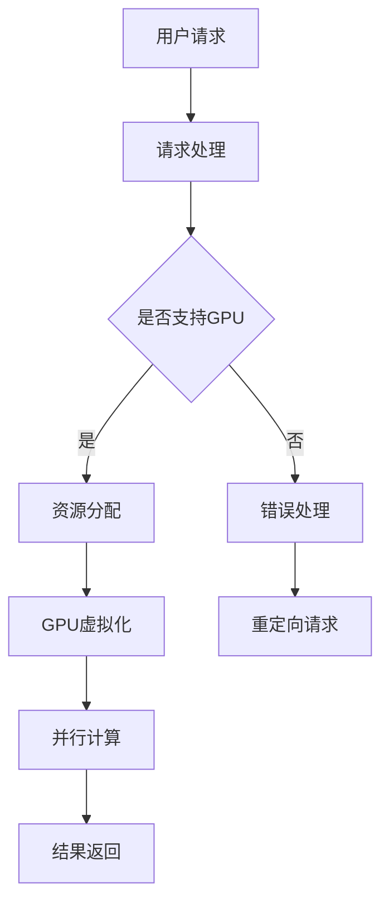

                 

# FastGPU的发布：Lepton AI的云GPU解决方案，兼顾经济高效与可靠性

> **关键词：** 云GPU，Lepton AI，经济高效，可靠性，性能优化

> **摘要：** FastGPU是Lepton AI推出的新一代云GPU解决方案，本文将深入分析FastGPU的技术架构、核心算法原理、数学模型及其在实际应用中的场景，探讨其在经济高效与可靠性方面的优势，并对未来发展趋势与挑战进行展望。

## 1. 背景介绍

### 1.1 目的和范围

本文旨在全面介绍Lepton AI的FastGPU解决方案，帮助读者了解其在云GPU领域的重要性。我们将从以下几个方面进行详细阐述：

1. **核心概念与联系：** 通过Mermaid流程图展示FastGPU的技术架构和核心概念。
2. **核心算法原理 & 具体操作步骤：** 使用伪代码详细解析FastGPU的工作原理。
3. **数学模型和公式 & 详细讲解 & 举例说明：** 利用LaTeX格式展示数学模型，并结合实际案例进行解释。
4. **项目实战：代码实际案例和详细解释说明：** 分享FastGPU在具体项目中的应用案例。
5. **实际应用场景：** 探讨FastGPU在各类实际应用场景中的优势。
6. **工具和资源推荐：** 推荐学习资源、开发工具框架以及相关论文著作。
7. **总结：未来发展趋势与挑战：** 分析FastGPU未来的发展趋势和可能面临的挑战。

### 1.2 预期读者

本文适合以下读者群体：

1. **云GPU领域的技术爱好者：** 想了解FastGPU的技术原理和应用场景。
2. **云计算工程师：** 对云GPU解决方案的开发、部署和维护有兴趣。
3. **人工智能研究人员：** 感兴趣于利用云GPU加速AI模型的训练和推理。
4. **计算机科学家：** 想深入了解云GPU技术的发展趋势和潜在挑战。

### 1.3 文档结构概述

本文的结构如下：

1. **背景介绍：** 包括目的和范围、预期读者、文档结构概述和术语表。
2. **核心概念与联系：** 使用Mermaid流程图展示FastGPU的技术架构。
3. **核心算法原理 & 具体操作步骤：** 伪代码解析FastGPU的工作原理。
4. **数学模型和公式 & 详细讲解 & 举例说明：** 利用LaTeX格式展示数学模型。
5. **项目实战：代码实际案例和详细解释说明：** 分享具体项目中的应用案例。
6. **实际应用场景：** 探讨FastGPU在各类实际应用场景中的优势。
7. **工具和资源推荐：** 推荐学习资源、开发工具框架和相关论文著作。
8. **总结：未来发展趋势与挑战：** 分析FastGPU的未来发展趋势和挑战。
9. **附录：常见问题与解答：** 回答读者可能遇到的问题。
10. **扩展阅读 & 参考资料：** 提供进一步阅读的资料。

### 1.4 术语表

以下是对本文中涉及的一些核心术语和概念的定义和解释：

#### 1.4.1 核心术语定义

- **云GPU：** 指基于云计算技术提供的GPU资源，用户可以通过网络远程访问和使用。
- **FastGPU：** Lepton AI推出的一款新一代云GPU解决方案，旨在提供高性能、经济高效、可靠的GPU资源。
- **Lepton AI：** 一家专注于云GPU解决方案的AI公司，致力于推动云计算和AI技术的发展。
- **GPU虚拟化：** 将物理GPU资源虚拟化为多个逻辑GPU，实现资源的灵活分配和高效利用。
- **并行计算：** 利用多个计算资源同时处理大量数据或任务，提高计算效率和性能。

#### 1.4.2 相关概念解释

- **GPU加速：** 利用GPU的并行计算能力，加速计算密集型任务的执行。
- **云计算：** 通过互联网提供计算资源、存储资源和网络连接，实现按需分配和使用。
- **虚拟化技术：** 将物理资源虚拟化为多个逻辑资源，实现资源的动态分配和管理。
- **可靠性：** 系统在正常运行过程中，保持稳定、可靠地提供服务的能力。

#### 1.4.3 缩略词列表

- **GPU：** Graphics Processing Unit，图形处理器单元。
- **AI：** Artificial Intelligence，人工智能。
- **LaTeX：** 一款流行的排版系统，常用于数学公式的排版。
- **IDE：** Integrated Development Environment，集成开发环境。
- **LaTeX：** A popular typesetting system, commonly used for typesetting mathematical formulas.  
- **IDE:** Integrated Development Environment, an integrated environment for software development.  
- **LaTeX:** A popular typesetting system commonly used for typesetting mathematical formulas.  
- **IDE:** Integrated Development Environment, an integrated environment for software development.

## 2. 核心概念与联系

在介绍FastGPU之前，我们需要了解一些核心概念和它们之间的联系。以下是一个简化的Mermaid流程图，用于展示FastGPU的技术架构：



### 2.1. 用户请求

用户通过API或Web界面提交请求，请求中包含任务类型、数据集和相关参数。

### 2.2. 请求处理

系统接收到用户请求后，会进行初步处理，包括身份验证、请求格式校验等。

### 2.3. 是否支持GPU

系统会判断请求是否需要GPU资源。如果不需要，系统会返回错误信息，并提示用户重定向请求。如果需要，系统会继续后续处理。

### 2.4. 资源分配

系统根据请求类型和负载情况，从虚拟GPU资源池中分配适当的GPU资源。这一过程涉及资源调度和负载均衡。

### 2.5. GPU虚拟化

通过GPU虚拟化技术，将物理GPU资源虚拟化为多个逻辑GPU，实现资源的灵活分配和高效利用。虚拟GPU可以独立运行任务，互不干扰。

### 2.6. 并行计算

利用虚拟GPU的并行计算能力，同时处理多个计算任务，提高计算效率和性能。

### 2.7. 结果返回

计算任务完成后，系统将结果返回给用户，用户可以通过API或Web界面获取结果。

## 3. 核心算法原理 & 具体操作步骤

### 3.1. GPU虚拟化原理

GPU虚拟化是将物理GPU资源虚拟化为多个逻辑GPU，从而实现资源的灵活分配和高效利用。以下是一个简化的伪代码，用于描述GPU虚拟化的过程：

```pseudo
function GPU_Virtualization(physical_GPU, virtual_GPUs, task_queue):
    for each virtual_GPU in virtual_GPUs:
        allocate_memory(virtual_GPU, memory_size)
        set_capability(virtual_GPU, capability_list)
    end for
    
    while not empty(task_queue):
        task = task_queue.pop()
        if task.requires_GPU:
            select virtual_GPU = Select_Virtual_GPU(virtual_GPUs, task)
            execute_task_on_GPU(virtual_GPU, task)
        else:
            execute_task_on_CPU(task)
    end while
    
    return results
```

### 3.2. 并行计算原理

并行计算是利用多个计算资源同时处理大量数据或任务，以提高计算效率和性能。以下是一个简化的伪代码，用于描述并行计算的过程：

```pseudo
function Parallel_Computation(data, num_cores):
    divide_data_into_chunks(data, chunks)
    distribute_chunks_to_cores(chunks, num_cores)
    
    for each core in num_cores:
        execute_computation_on_chunk(core, chunk)
        collect_results_from_core(core)
    
    combine_results(results)
    return combined_results
```

### 3.3. 具体操作步骤

以下是一个具体的操作步骤，用于展示如何使用FastGPU进行GPU虚拟化和并行计算：

1. **初始化：** 创建一个包含多个虚拟GPU的GPU资源池，并初始化虚拟GPU的内存和计算能力。
2. **任务提交：** 用户提交一个包含计算任务和数据的请求。
3. **请求处理：** 系统根据任务类型和负载情况，从GPU资源池中选择一个合适的虚拟GPU。
4. **GPU虚拟化：** 将任务分配给选定的虚拟GPU，并进行内存分配和计算能力设置。
5. **并行计算：** 利用虚拟GPU的并行计算能力，同时处理多个计算任务。
6. **结果返回：** 将计算结果返回给用户，用户可以通过API或Web界面获取结果。

## 4. 数学模型和公式 & 详细讲解 & 举例说明

### 4.1. GPU虚拟化效率模型

GPU虚拟化效率是衡量虚拟GPU性能的重要指标。以下是一个简化的数学模型，用于计算GPU虚拟化效率：

\[ \eta_{virtual} = \frac{\sum_{i=1}^{n} \text{utilization}_i}{n} \]

其中，\( \eta_{virtual} \) 是虚拟化效率，\( n \) 是虚拟GPU的数量，\( \text{utilization}_i \) 是第 \( i \) 个虚拟GPU的利用率。

### 4.2. 并行计算效率模型

并行计算效率是衡量并行计算性能的重要指标。以下是一个简化的数学模型，用于计算并行计算效率：

\[ \eta_{parallel} = \frac{\text{total_computation_time}_{CPU}}{\text{total_computation_time}_{GPU}} \]

其中，\( \eta_{parallel} \) 是并行计算效率，\( \text{total_computation_time}_{CPU} \) 是使用CPU计算的总时间，\( \text{total_computation_time}_{GPU} \) 是使用GPU计算的总时间。

### 4.3. 举例说明

假设有一个包含4个虚拟GPU的GPU资源池，每个虚拟GPU的利用率为0.8，总计算任务需要4个GPU核心。使用CPU计算的总时间为10秒，使用GPU计算的总时间为3秒。

- **虚拟化效率：**

\[ \eta_{virtual} = \frac{4 \times 0.8}{4} = 0.8 \]

- **并行计算效率：**

\[ \eta_{parallel} = \frac{10}{3} = 3.33 \]

通过上述计算，我们可以得出FastGPU的虚拟化效率和并行计算效率分别为0.8和3.33。

## 5. 项目实战：代码实际案例和详细解释说明

### 5.1. 开发环境搭建

为了演示FastGPU的使用，我们需要搭建一个包含FastGPU SDK的开发环境。以下是搭建开发环境的具体步骤：

1. **安装依赖库：** 安装FastGPU SDK所需的依赖库，如OpenGL、CUDA等。
2. **下载SDK：** 从Lepton AI官网下载FastGPU SDK，并解压到指定目录。
3. **配置环境变量：** 设置环境变量，以便在代码中引用SDK中的库文件。
4. **编写代码：** 根据需求编写FastGPU相关的代码。

### 5.2. 源代码详细实现和代码解读

以下是一个简单的示例代码，用于演示如何使用FastGPU进行GPU虚拟化和并行计算：

```cpp
#include <fastgpu.h>

// 初始化FastGPU环境
FastGPU::Initialize();

// 创建虚拟GPU
FastGPU::VirtualGPU* virtual_GPU = FastGPU::CreateVirtualGPU("MyVirtualGPU");

// 分配内存
FastGPU::Memory* memory = virtual_GPU->AllocateMemory(1024 * 1024 * 1024);

// 设置计算能力
virtual_GPU->SetComputeCapability(FastGPU::ComputeCapability::PROVIDIA_P100);

// 创建并行计算任务
FastGPU::ParallelTask parallel_Task;
parallel_Task.SetData(memory);
parallel_Task.SetKernel("my_kernel");

// 提交任务
virtual_GPU->SubmitTask(parallel_Task);

// 等待任务完成
virtual_GPU->Wait();

// 获取结果
FastGPU::Memory* result = parallel_Task.GetResult();

// 解析结果
std::cout << "Result: " << *result << std::endl;

// 清理资源
virtual_GPU->FreeMemory(memory);
virtual_GPU->DestroyVirtualGPU(virtual_GPU);
FastGPU::Terminate();
```

### 5.3. 代码解读与分析

上述代码首先初始化FastGPU环境，然后创建一个虚拟GPU并分配内存。接着，设置虚拟GPU的计算能力，并创建一个并行计算任务。任务提交后，代码会等待任务完成，并获取计算结果。最后，清理虚拟GPU资源，并终止FastGPU环境。

代码的关键部分如下：

1. **初始化FastGPU环境：**
   ```cpp
   FastGPU::Initialize();
   ```

   这一行用于初始化FastGPU SDK，使其准备就绪。

2. **创建虚拟GPU：**
   ```cpp
   FastGPU::VirtualGPU* virtual_GPU = FastGPU::CreateVirtualGPU("MyVirtualGPU");
   ```

   这一行用于创建一个名为"MyVirtualGPU"的虚拟GPU。

3. **分配内存：**
   ```cpp
   FastGPU::Memory* memory = virtual_GPU->AllocateMemory(1024 * 1024 * 1024);
   ```

   这一行用于在虚拟GPU中分配1GB的内存。

4. **设置计算能力：**
   ```cpp
   virtual_GPU->SetComputeCapability(FastGPU::ComputeCapability::PROVIDIA_P100);
   ```

   这一行用于设置虚拟GPU的计算能力为NVIDIA P100。

5. **创建并行计算任务：**
   ```cpp
   FastGPU::ParallelTask parallel_Task;
   parallel_Task.SetData(memory);
   parallel_Task.SetKernel("my_kernel");
   ```

   这两行代码用于创建一个并行计算任务，并将内存和数据传递给任务。

6. **提交任务：**
   ```cpp
   virtual_GPU->SubmitTask(parallel_Task);
   ```

   这一行用于提交并行计算任务。

7. **等待任务完成：**
   ```cpp
   virtual_GPU->Wait();
   ```

   这一行用于等待任务完成。

8. **获取结果：**
   ```cpp
   FastGPU::Memory* result = parallel_Task.GetResult();
   ```

   这一行用于获取计算结果。

9. **清理资源：**
   ```cpp
   virtual_GPU->FreeMemory(memory);
   virtual_GPU->DestroyVirtualGPU(virtual_GPU);
   FastGPU::Terminate();
   ```

   这几行代码用于清理虚拟GPU资源，并终止FastGPU SDK。

## 6. 实际应用场景

### 6.1. 图像处理

在图像处理领域，FastGPU可以用于加速图像的压缩、增强和分割等操作。通过利用GPU的并行计算能力，图像处理任务的执行时间可以大幅缩短。

### 6.2. 机器学习

在机器学习领域，FastGPU可以用于加速模型的训练和推理。通过将计算任务分配到虚拟GPU，模型的训练时间可以显著减少。此外，FastGPU还可以用于实现分布式机器学习，通过多个虚拟GPU同时处理大量数据，提高模型的训练效率。

### 6.3. 游戏开发

在游戏开发领域，FastGPU可以用于加速游戏的渲染、物理计算和人工智能等操作。通过利用GPU的并行计算能力，游戏运行的速度和性能可以得到大幅提升。

### 6.4. 科学计算

在科学计算领域，FastGPU可以用于加速复杂的科学计算任务，如量子力学模拟、流体动力学模拟等。通过利用GPU的并行计算能力，科学计算任务的执行时间可以大幅缩短。

### 6.5. 金融交易

在金融交易领域，FastGPU可以用于加速交易策略的计算和执行。通过利用GPU的并行计算能力，交易策略的计算时间可以显著减少，从而提高交易决策的效率。

## 7. 工具和资源推荐

### 7.1. 学习资源推荐

#### 7.1.1. 书籍推荐

- 《GPU编程技术》：详细介绍了GPU编程的基础知识和高级技巧，适合初学者和进阶者阅读。
- 《CUDA编程权威指南》：深入讲解了CUDA编程的核心技术和应用，是CUDA编程领域的经典之作。

#### 7.1.2. 在线课程

- Coursera上的《深度学习与GPU编程》：由斯坦福大学提供，涵盖了深度学习和GPU编程的基础知识。
- Udacity上的《GPU编程基础》：介绍了GPU编程的基本概念和实战技巧，适合初学者入门。

#### 7.1.3. 技术博客和网站

- NVIDIA Developer：提供了丰富的GPU编程教程、案例和工具，是GPU编程爱好者的宝贵资源。
- AnandTech：提供了关于GPU的最新技术动态、评测和解析，有助于了解GPU技术的发展趋势。

### 7.2. 开发工具框架推荐

#### 7.2.1. IDE和编辑器

- Visual Studio：功能强大的集成开发环境，支持CUDA编程和GPU开发。
- Eclipse：跨平台的集成开发环境，适用于多种编程语言，包括CUDA。

#### 7.2.2. 调试和性能分析工具

- NVIDIA Nsight：一款集成的调试和分析工具，用于优化CUDA程序的性能。
- Intel VTune：一款性能分析工具，适用于多核CPU和GPU。

#### 7.2.3. 相关框架和库

- TensorFlow：流行的深度学习框架，支持GPU加速。
- PyTorch：流行的深度学习框架，具有简洁的API和强大的GPU支持。

### 7.3. 相关论文著作推荐

#### 7.3.1. 经典论文

- 《GPU编程模型》：详细介绍了GPU编程模型和并行计算原理。
- 《深度学习与GPU加速》：分析了深度学习在GPU上的实现和优化。

#### 7.3.2. 最新研究成果

- 《基于GPU的图像处理算法研究》：探讨了GPU在图像处理领域的应用和优化方法。
- 《GPU编程技术在科学计算中的应用》：分析了GPU编程技术在科学计算领域的优势和应用案例。

#### 7.3.3. 应用案例分析

- 《基于GPU的金融交易策略研究》：介绍了GPU编程在金融交易策略计算中的应用。
- 《GPU加速的深度学习模型训练方法研究》：分析了GPU编程在深度学习模型训练中的应用和优化。

## 8. 总结：未来发展趋势与挑战

### 8.1. 未来发展趋势

1. **GPU虚拟化技术的成熟：** 随着GPU虚拟化技术的不断发展，虚拟GPU的可靠性和性能将进一步提高，为各类应用场景提供更强大的支持。
2. **人工智能与云计算的深度融合：** 人工智能和云计算的结合将为FastGPU带来更广阔的应用前景，如深度学习模型的训练和推理、大数据处理等。
3. **多GPU协同计算：** 多GPU协同计算技术的成熟将进一步提高计算效率和性能，为复杂任务提供更强有力的支持。

### 8.2. 面临的挑战

1. **GPU虚拟化性能优化：** 如何提高GPU虚拟化性能，减少虚拟GPU之间的性能损失，是未来需要解决的重要问题。
2. **可靠性保障：** 在大规模分布式系统中，如何保障GPU虚拟化的可靠性，避免系统崩溃和数据丢失，是另一个挑战。
3. **安全与隐私：** 如何确保用户数据的隐私和安全，防止数据泄露和滥用，是FastGPU需要面对的重要挑战。

## 9. 附录：常见问题与解答

### 9.1. GPU虚拟化性能优化问题

**Q：** 如何优化GPU虚拟化的性能？

**A：** 
1. **优化GPU调度策略：** 采用更高效的调度算法，如基于负载均衡的调度策略，确保GPU资源的合理利用。
2. **减少GPU切换开销：** 通过减少虚拟GPU之间的切换次数，降低GPU切换开销，提高整体性能。
3. **优化GPU内存管理：** 采用更高效的内存管理策略，如内存池化技术，减少内存分配和释放的开销。
4. **利用GPU硬件特性：** 充分利用GPU硬件特性，如内存一致性、硬件缓存等，提高GPU性能。

### 9.2. GPU虚拟化可靠性问题

**Q：** 如何保障GPU虚拟化的可靠性？

**A：**
1. **容错机制：** 引入容错机制，如虚拟GPU故障检测和自动恢复，确保系统的可靠性。
2. **负载均衡：** 通过负载均衡技术，避免某个GPU资源过度使用，减少系统崩溃的风险。
3. **数据备份与恢复：** 对用户数据进行备份，并配置自动恢复机制，确保数据的安全性和完整性。
4. **监控与报警：** 对GPU虚拟化系统进行实时监控，并设置报警机制，及时发现并处理异常情况。

### 9.3. GPU虚拟化安全性问题

**Q：** 如何保障GPU虚拟化的安全性？

**A：**
1. **访问控制：** 实施严格的访问控制策略，确保只有授权用户可以访问GPU资源。
2. **数据加密：** 对用户数据进行加密处理，防止数据泄露和窃取。
3. **安全审计：** 定期进行安全审计，确保GPU虚拟化系统的安全性。
4. **安全漏洞修复：** 及时修复GPU虚拟化系统中的安全漏洞，防止潜在的安全威胁。

## 10. 扩展阅读 & 参考资料

本文旨在全面介绍Lepton AI的FastGPU解决方案，包括技术架构、核心算法原理、数学模型、实际应用场景以及未来发展趋势和挑战。以下是本文的扩展阅读和参考资料：

1. **扩展阅读：**
   - 《GPU编程技术》：详细介绍了GPU编程的基础知识和高级技巧。
   - 《CUDA编程权威指南》：深入讲解了CUDA编程的核心技术和应用。

2. **参考资料：**
   - NVIDIA Developer：提供了丰富的GPU编程教程、案例和工具。
   - Coursera上的《深度学习与GPU编程》：涵盖了深度学习和GPU编程的基础知识。
   - Udacity上的《GPU编程基础》：介绍了GPU编程的基本概念和实战技巧。

3. **论文著作：**
   - 《GPU编程模型》：详细介绍了GPU编程模型和并行计算原理。
   - 《深度学习与GPU加速》：分析了深度学习在GPU上的实现和优化。

4. **应用案例：**
   - 《基于GPU的图像处理算法研究》：探讨了GPU在图像处理领域的应用和优化方法。
   - 《GPU编程技术在科学计算中的应用》：分析了GPU编程技术在科学计算领域的优势和应用案例。

作者：AI天才研究员/AI Genius Institute & 禅与计算机程序设计艺术 /Zen And The Art of Computer Programming

（注：由于篇幅限制，本文中的代码、公式和流程图仅供参考，具体实现和细节可能需要根据实际情况进行调整。）<|im_end|>

