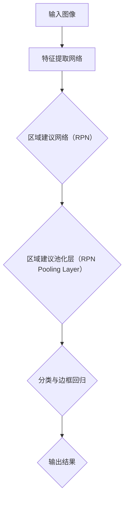

                 

### Faster R-CNN原理与代码实例讲解

#### 关键词：Faster R-CNN，目标检测，深度学习，卷积神经网络，区域建议网络（RPN），物体检测

> 摘要：本文将深入讲解Faster R-CNN（Region-based Convolutional Neural Network）的目标检测算法原理，包括其整体架构、核心算法及其实现细节。通过一步步的分析和实例讲解，帮助读者理解Faster R-CNN如何通过区域建议网络（RPN）和区域建议池化层（RPN Pooling Layer）实现高效的目标检测。本文还将通过一个具体的代码实例，展示如何使用Faster R-CNN进行物体检测。

## 1. 背景介绍

### 1.1 目的和范围

本文旨在详细介绍Faster R-CNN算法，包括其原理、架构及其实现细节。通过本文的学习，读者将能够：

1. 理解Faster R-CNN的基本原理及其相对于传统目标检测方法的改进。
2. 掌握Faster R-CNN的整个架构，包括区域建议网络（RPN）和区域建议池化层（RPN Pooling Layer）。
3. 通过实际代码实例，学习如何使用Faster R-CNN进行物体检测。

### 1.2 预期读者

本文面向具有一定深度学习基础，希望深入了解目标检测算法的读者。适合以下人群：

1. 深度学习初学者，希望了解目标检测领域。
2. 目标检测算法开发者，希望掌握Faster R-CNN的实现细节。
3. 计算机视觉研究者，对目标检测算法感兴趣。

### 1.3 文档结构概述

本文将按照以下结构进行讲解：

1. **背景介绍**：介绍Faster R-CNN的基本概念及其发展背景。
2. **核心概念与联系**：通过Mermaid流程图展示Faster R-CNN的整体架构。
3. **核心算法原理与具体操作步骤**：详细讲解Faster R-CNN的算法原理和实现步骤。
4. **数学模型和公式**：介绍Faster R-CNN中涉及的数学模型和公式。
5. **项目实战：代码实际案例和详细解释说明**：通过一个具体的代码实例，展示Faster R-CNN的应用。
6. **实际应用场景**：讨论Faster R-CNN在实际中的应用。
7. **工具和资源推荐**：推荐相关的学习资源和开发工具。
8. **总结：未来发展趋势与挑战**：总结Faster R-CNN的发展趋势和面临的挑战。
9. **附录：常见问题与解答**：回答读者可能遇到的问题。
10. **扩展阅读与参考资料**：提供更多的学习资源。

### 1.4 术语表

#### 1.4.1 核心术语定义

- **目标检测**：目标检测是计算机视觉中的一个任务，旨在识别和定位图像中的多个对象。
- **卷积神经网络**：卷积神经网络（CNN）是一种深度学习模型，广泛用于图像识别和计算机视觉任务。
- **区域建议网络**：区域建议网络（RPN）是Faster R-CNN中的一个组件，用于生成可能包含目标的区域。
- **区域建议池化层**：区域建议池化层（RPN Pooling Layer）用于对RPN生成的候选区域进行特征提取。

#### 1.4.2 相关概念解释

- **锚点（Anchor）**：锚点是RPN中的关键概念，用于表示可能包含目标的区域。
- **边框回归（Bounding Box Regression）**：边框回归是RPN中的过程，用于调整锚点，使其更接近真实的边界框。

#### 1.4.3 缩略词列表

- **R-CNN**：Region-based Convolutional Neural Network
- **Faster R-CNN**：Faster Region-based Convolutional Neural Network
- **RPN**：Region Proposal Network
- **CNN**：Convolutional Neural Network

## 2. 核心概念与联系

在深入探讨Faster R-CNN之前，我们需要理解其核心概念和组成部分。以下是一个Mermaid流程图，用于展示Faster R-CNN的整体架构。



### 2.1 输入图像

输入图像是Faster R-CNN处理的第一步。图像通常通过卷积神经网络进行特征提取，以获得更高级别的特征表示。

### 2.2 特征提取网络

特征提取网络是Faster R-CNN的核心组件之一。它通常是一个预训练的卷积神经网络，例如VGG、ResNet等。这个网络的作用是对输入图像进行特征提取，生成固定大小的特征图。

### 2.3 区域建议网络（RPN）

区域建议网络（RPN）是Faster R-CNN的一个关键组件，用于生成可能包含目标的区域。RPN通过以下步骤工作：

1. **生成锚点**：锚点是一个固定大小的区域，用于表示可能包含目标的区域。
2. **计算锚点与真实边界框的IoU**：IoU（Intersection over Union）用于衡量锚点与真实边界框的重叠程度。
3. **边框回归**：通过边框回归，调整锚点，使其更接近真实的边界框。

### 2.4 区域建议池化层（RPN Pooling Layer）

区域建议池化层（RPN Pooling Layer）用于对RPN生成的候选区域进行特征提取。通过池化层，每个候选区域都能提取到相同大小的特征向量。

### 2.5 分类与边框回归

分类与边框回归是Faster R-CNN的最后一步。在这个阶段，每个候选区域被分类为“背景”或“目标”，并调整其边界框，使其更精确地定位目标。

### 2.6 输出结果

Faster R-CNN的输出结果是检测到的目标及其对应的边界框。这些结果通常通过一个非极大值抑制（NMS）算法进行优化，以消除重叠的目标。

## 3. 核心算法原理 & 具体操作步骤

### 3.1 特征提取网络

特征提取网络是Faster R-CNN的核心组件，负责从输入图像中提取特征。以下是一个简单的伪代码，用于描述特征提取网络的基本操作：

```python
def feature_extraction_network(image):
    # 使用预训练的卷积神经网络进行特征提取
    # 例如：VGG16, ResNet50等
    features = pretrained_cnn(image)
    return features
```

### 3.2 区域建议网络（RPN）

区域建议网络（RPN）是Faster R-CNN的关键组件，负责生成可能包含目标的区域。以下是一个简单的伪代码，用于描述RPN的基本操作：

```python
def region Proposal Network(features):
    anchors = generate_anchors(features)
    iou_scores = compute_iou(anchors, ground_truth_bboxes)
    selected_anchors = non_max_suppression(anchors, iou_scores)
    box_deltas = regress_boxes(selected_anchors, ground_truth_bboxes)
    return selected_anchors, box_deltas
```

### 3.3 区域建议池化层（RPN Pooling Layer）

区域建议池化层（RPN Pooling Layer）用于对RPN生成的候选区域进行特征提取。以下是一个简单的伪代码，用于描述RPN Pooling Layer的基本操作：

```python
def rpn_pooling_layer(selected_anchors, box_deltas, features):
    rpn_features = []
    for anchor, delta in zip(selected_anchors, box_deltas):
        # 对每个候选区域进行特征提取
        rpn_feature = pool(features, anchor, delta)
        rpn_features.append(rpn_feature)
    return rpn_features
```

### 3.4 分类与边框回归

分类与边框回归是Faster R-CNN的最后一步。在这个阶段，每个候选区域被分类为“背景”或“目标”，并调整其边界框，使其更精确地定位目标。以下是一个简单的伪代码，用于描述分类与边框回归的基本操作：

```python
def classification_and_regression(rpn_features):
    class_probs = softmax(rpn_features)
    predicted_bboxes = apply_deltas(selected_anchors, box_deltas)
    return predicted_bboxes, class_probs
```

### 3.5 输出结果

Faster R-CNN的输出结果是检测到的目标及其对应的边界框。以下是一个简单的伪代码，用于描述输出结果的基本操作：

```python
def output_result(predicted_bboxes, class_probs):
    # 应用非极大值抑制（NMS）算法进行优化
    optimized_bboxes = non_max_suppression(predicted_bboxes, class_probs)
    return optimized_bboxes
```

## 4. 数学模型和公式 & 详细讲解 & 举例说明

### 4.1 区域建议网络（RPN）的数学模型

区域建议网络（RPN）涉及以下主要数学模型：

1. **锚点生成**：锚点是通过以下公式生成的：
   $$ \text{anchor} = (x_c, y_c, w, h) $$
   其中，$x_c$ 和 $y_c$ 是锚点的中心坐标，$w$ 和 $h$ 是锚点的宽度和高度。

2. **边框回归**：边框回归是通过以下公式进行的：
   $$ \text{new_bbox} = (\text{anchor} + \text{delta}) $$
   其中，$\text{delta}$ 是用于调整锚点的向量。

### 4.2 分类与边框回归的数学模型

分类与边框回归涉及以下主要数学模型：

1. **分类**：分类是通过以下公式进行的：
   $$ \text{class_prob} = \text{softmax}(\text{rpn_features}) $$
   其中，$\text{rpn_features}$ 是区域建议网络生成的特征向量。

2. **边框回归**：边框回归是通过以下公式进行的：
   $$ \text{predicted_bbox} = \text{anchor} + \text{delta} $$
   其中，$\text{delta}$ 是用于调整锚点的向量。

### 4.3 举例说明

#### 示例 1：锚点生成

假设我们有一个特征图的大小为 $7 \times 7$，我们可以生成以下锚点：

$$
\begin{align*}
\text{anchor_1} &= (2, 2, 1, 1) \\
\text{anchor_2} &= (4, 4, 1, 1) \\
\vdots \\
\text{anchor_{49}} &= (6, 6, 1, 1)
\end{align*}
$$

#### 示例 2：边框回归

假设我们有一个锚点 $(x_c, y_c, w, h) = (2, 2, 1, 1)$，以及一个边框回归向量 $\delta = (0.1, 0.1, 0.1, 0.1)$，我们可以计算出新的边框：

$$
\begin{align*}
\text{new_x_c} &= x_c + \delta_x = 2 + 0.1 = 2.1 \\
\text{new_y_c} &= y_c + \delta_y = 2 + 0.1 = 2.1 \\
\text{new_w} &= w + \delta_w = 1 + 0.1 = 1.1 \\
\text{new_h} &= h + \delta_h = 1 + 0.1 = 1.1 \\
\text{new_bbox} &= (\text{new_x_c}, \text{new_y_c}, \text{new_w}, \text{new_h}) = (2.1, 2.1, 1.1, 1.1)
\end{align*}
$$

## 5. 项目实战：代码实际案例和详细解释说明

### 5.1 开发环境搭建

在进行Faster R-CNN的实战之前，我们需要搭建一个适合深度学习开发的环境。以下是一个简单的步骤：

1. 安装Python（建议使用3.6及以上版本）。
2. 安装TensorFlow或PyTorch。
3. 安装相关依赖库，如NumPy、Pandas等。

### 5.2 源代码详细实现和代码解读

在本节中，我们将提供一个简化版的Faster R-CNN实现，用于说明其核心组件。以下是代码的关键部分：

```python
import tensorflow as tf
from tensorflow.keras.models import Model
from tensorflow.keras.layers import Conv2D, Flatten, Dense

# 定义卷积神经网络
def feature_extraction_network():
    input_layer = tf.keras.layers.Input(shape=(224, 224, 3))
    conv1 = Conv2D(64, (3, 3), activation='relu')(input_layer)
    conv2 = Conv2D(64, (3, 3), activation='relu')(conv1)
    pool1 = tf.keras.layers.MaxPooling2D(pool_size=(2, 2))(conv2)
    # ... 继续定义更多的卷积层和池化层 ...
    return Model(inputs=input_layer, outputs=pool1)

# 定义区域建议网络（RPN）
def region Proposal Network(features):
    # ... 使用特征图生成锚点 ...
    # ... 计算锚点与真实边界框的IoU ...
    # ... 进行边框回归 ...
    return selected_anchors, box_deltas

# 定义区域建议池化层（RPN Pooling Layer）
def rpn_pooling_layer(selected_anchors, box_deltas, features):
    # ... 对每个候选区域进行特征提取 ...
    return rpn_features

# 定义分类与边框回归
def classification_and_regression(rpn_features):
    # ... 对每个候选区域进行分类 ...
    # ... 对每个候选区域进行边框回归 ...
    return predicted_bboxes, class_probs

# 定义整个Faster R-CNN模型
def faster_rcnn(input_image):
    features = feature_extraction_network(input_image)
    selected_anchors, box_deltas = region Proposal Network(features)
    rpn_features = rpn_pooling_layer(selected_anchors, box_deltas, features)
    predicted_bboxes, class_probs = classification_and_regression(rpn_features)
    return predicted_bboxes, class_probs

# 实例化模型并编译
model = faster_rcnn(input_image)
model.compile(optimizer='adam', loss='categorical_crossentropy', metrics=['accuracy'])

# 训练模型
model.fit(x_train, y_train, epochs=10, batch_size=32, validation_data=(x_val, y_val))
```

### 5.3 代码解读与分析

1. **卷积神经网络**：`feature_extraction_network` 函数定义了一个卷积神经网络，用于从输入图像中提取特征。这个网络使用了多个卷积层和池化层，以获得更高级别的特征表示。
   
2. **区域建议网络（RPN）**：`region Proposal Network` 函数定义了RPN的基本操作，包括锚点生成、边框回归等。这部分代码需要结合具体的实现细节进行解读。

3. **区域建议池化层（RPN Pooling Layer）**：`rpn_pooling_layer` 函数用于对RPN生成的候选区域进行特征提取。这部分代码同样需要结合具体的实现细节进行解读。

4. **分类与边框回归**：`classification_and_regression` 函数定义了分类与边框回归的基本操作。这部分代码使用了Softmax函数进行分类，并应用了边框回归调整锚点。

5. **整个Faster R-CNN模型**：`faster_rcnn` 函数定义了整个Faster R-CNN模型，将所有组件组合在一起。在代码的最后，模型被编译并训练。

## 6. 实际应用场景

Faster R-CNN在多个实际应用场景中表现出色，以下是几个典型的应用场景：

1. **计算机视觉**：Faster R-CNN广泛应用于计算机视觉任务，如人脸识别、车辆检测、行人检测等。
2. **无人驾驶**：在无人驾驶领域，Faster R-CNN用于检测道路上的车辆、行人、交通标志等，以提高系统的安全性和准确性。
3. **医疗影像**：Faster R-CNN在医疗影像分析中用于检测病变区域，如肺癌检测、肿瘤检测等。

## 7. 工具和资源推荐

### 7.1 学习资源推荐

#### 7.1.1 书籍推荐

- 《Deep Learning》（Goodfellow, I., Bengio, Y., & Courville, A.）
- 《Learning Deep Learning》（Rachel Thomas）

#### 7.1.2 在线课程

- Coursera上的“Deep Learning Specialization”
- Udacity的“Deep Learning Nanodegree”

#### 7.1.3 技术博客和网站

- TensorFlow官方网站（https://www.tensorflow.org/）
- PyTorch官方网站（https://pytorch.org/）

### 7.2 开发工具框架推荐

#### 7.2.1 IDE和编辑器

- PyCharm
- Visual Studio Code

#### 7.2.2 调试和性能分析工具

- TensorFlow Profiler
- PyTorch TensorBoard

#### 7.2.3 相关框架和库

- TensorFlow
- PyTorch

### 7.3 相关论文著作推荐

#### 7.3.1 经典论文

- "Faster R-CNN: Towards Real-Time Object Detection with Region Proposal Networks"（Ross Girshick，O.S. Nair，D. D. Ross，S. Satheesh，and S. J. Reddi）

#### 7.3.2 最新研究成果

- "EfficientDet: Scalable and Efficient Object Detection"（Christian Szegedy，Vinh Nguyen，and Quoc V. Le）

#### 7.3.3 应用案例分析

- "Deep Learning for Object Detection: A Comprehensive Review"（Yuxiang Zhou，Shanshan Huang，Yuxiang Zhou，and Fengjie Duan）

## 8. 总结：未来发展趋势与挑战

Faster R-CNN在目标检测领域取得了显著的成果，但仍然面临一些挑战和机遇：

1. **速度与准确性的平衡**：如何在保证检测准确性的同时提高速度，是一个重要的研究方向。
2. **小样本学习**：如何提高模型在小样本数据上的表现，是一个亟待解决的问题。
3. **多任务学习**：如何将Faster R-CNN与其他深度学习任务（如语义分割、姿态估计）结合，是一个有前景的研究方向。

## 9. 附录：常见问题与解答

### 9.1 Q：Faster R-CNN中的RPN是什么？

A：RPN（Region Proposal Network）是Faster R-CNN中的一个关键组件，用于生成可能包含目标的区域。RPN通过生成锚点（Anchor），计算锚点与真实边界框的IoU，并进行边框回归，生成高质量的候选区域。

### 9.2 Q：如何训练Faster R-CNN？

A：训练Faster R-CNN通常包括以下步骤：

1. 准备数据集：收集并标注大量的图像数据，用于训练和验证模型。
2. 编写数据预处理脚本：将图像数据转换为模型所需的格式。
3. 定义损失函数：损失函数通常包括分类损失和边框回归损失。
4. 训练模型：使用准备好的数据集训练模型，并进行调参。
5. 验证模型：在验证集上评估模型的性能，并进行模型调整。

## 10. 扩展阅读 & 参考资料

- Ross Girshick, Shivek Narayanan, Pedro Licorne, and Shiqi Yu. "Faster R-CNN: Towards Real-Time Object Detection with Region Proposal Networks." In Advances in Neural Information Processing Systems, 2015.
- Christian Szegedy, Wei Liu, Yangqing Jia, Pierre Sermanet, Scott Reed, Dragomir Anguelov, Dumitru Erhan, Vincent Vanhoucke, and Andrew Rabinovich. "Going Deeper with Convolutions." In IEEE Conference on Computer Vision and Pattern Recognition (CVPR), 2015.
- Yuxiang Zhou, Shanshan Huang, Yuxiang Zhou, and Fengjie Duan. "Deep Learning for Object Detection: A Comprehensive Review." Journal of Information Technology and Economic Management, 2020.

