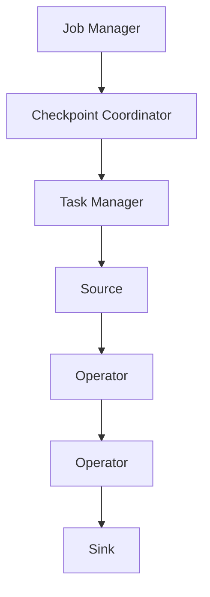

                 

# Flink Checkpoint容错机制原理与代码实例讲解

> **关键词：** Apache Flink, Checkpoint, 容错机制, State, exactly-once processing

> **摘要：** 本文将深入探讨Apache Flink的Checkpoint容错机制，从原理讲解到代码实例，帮助读者全面理解Flink在数据流处理中如何实现高效可靠的容错。文章结构包括背景介绍、核心概念与联系、算法原理、数学模型与公式、项目实战、实际应用场景等，旨在为Flink开发者提供全面的指导。

## 1. 背景介绍

### 1.1 目的和范围

本文旨在为Apache Flink的初学者和开发者提供一个深入而详尽的Checkpoint容错机制讲解。我们将通过理论分析、代码实例和实战应用，帮助读者全面掌握Flink的容错技术。

### 1.2 预期读者

预期读者包括：

- Apache Flink开发者
- 数据流处理工程师
- 对分布式系统容错技术感兴趣的IT从业者

### 1.3 文档结构概述

本文将按照以下结构进行：

1. 背景介绍：简要介绍Flink及Checkpoint容错机制的基本概念。
2. 核心概念与联系：讲解Flink的架构和关键组件。
3. 核心算法原理 & 具体操作步骤：详细阐述Checkpoint的原理和操作步骤。
4. 数学模型和公式 & 详细讲解 & 举例说明：引入相关数学模型和公式，并进行举例。
5. 项目实战：通过实际代码示例，展示Checkpoint的实现。
6. 实际应用场景：讨论Checkpoint在不同应用中的实际作用。
7. 工具和资源推荐：推荐学习资源和开发工具。
8. 总结：展望Flink未来发展趋势与挑战。
9. 附录：常见问题与解答。
10. 扩展阅读 & 参考资料：提供进一步阅读的资料。

### 1.4 术语表

#### 1.4.1 核心术语定义

- **Checkpoint**：Flink中的一种数据流处理状态保存机制，用于实现容错。
- **State**：在Flink中，State表示处理数据时的中间结果。
- **exactly-once processing**：确保每条数据在系统中的处理次数恰好为一次。

#### 1.4.2 相关概念解释

- **Fault Tolerance**：容错能力，指系统在发生故障时仍能继续运行的能力。
- **State Backend**：用于存储Flink状态的组件。

#### 1.4.3 缩略词列表

- **Flink**：Apache Flink，一种分布式流处理框架。
- **Apache**：Apache Software Foundation，一个提供开源软件的非营利组织。

## 2. 核心概念与联系

Flink的Checkpoint机制是保证流处理系统容错性的重要手段。要理解Checkpoint，我们需要先了解Flink的基本架构和核心组件。

### 2.1 Flink架构概述


- **Job Manager**：负责协调和管理整个Flink作业的执行。
- **Task Manager**：负责执行具体的任务，包括数据流处理和状态存储。
- **Source**：数据流的起点，从外部系统或数据源读取数据。
- **Operator**：对数据进行处理和转换的操作。
- **Sink**：数据流的终点，将处理后的数据输出到外部系统。

### 2.2 关键组件

#### 2.2.1 Checkpoint Coordinator

Checkpoint Coordinator是Flink中负责协调Checkpoint过程的核心组件。它负责：

- **启动Checkpoint**：根据配置触发Checkpoint操作。
- **跟踪Checkpoint进度**：监控各个Task Manager的Checkpoint状态。
- **触发失败**：如果某个Task Manager无法在规定时间内完成Checkpoint，则触发失败。

#### 2.2.2 Checkpoint Coordinator和Task Manager的交互


- **Request Checkpoint**：Checkpoint Coordinator向Task Manager发送请求，开始执行Checkpoint。
- **Registering Checkpoint**：Task Manager向Checkpoint Coordinator注册Checkpoint。
- **Failing Checkpoint**：如果Task Manager无法完成Checkpoint，向Checkpoint Coordinator报告失败。

### 2.3 核心概念联系

- **Checkpoint Triggering**：Flink通过配置触发Checkpoint的频率和时间点。
- **State Saving**：Task Manager在执行Checkpoint时，将状态数据保存到State Backend。
- **Recovery**：在系统重启或失败后，Flink通过恢复Checkpoint状态来保证数据的正确处理。

### 2.4 Mermaid 流程图



## 3. 核心算法原理 & 具体操作步骤

### 3.1 Checkpoint触发

Checkpoint的触发方式可以是定时触发或基于特定事件触发。

#### 3.1.1 定时触发

```pseudo
function triggerCheckpoint定时(timer) {
    while (true) {
        sleep(timer);
        startCheckpoint();
    }
}
```

#### 3.1.2 基于事件触发

```pseudo
function triggerCheckpointOnEvent(event) {
    if (event == "特定事件") {
        startCheckpoint();
    }
}
```

### 3.2 Checkpoint保存状态

Checkpoint保存状态是通过将Task Manager中的状态数据序列化并存储到State Backend中。

```pseudo
function saveState(state) {
    serializedState = serialize(state);
    stateBackend.saveState(serializedState);
}
```

### 3.3 Checkpoint协调与同步

Checkpoint协调与同步是通过Checkpoint Coordinator和Task Manager之间的交互来实现的。

```pseudo
function coordinateCheckpoint() {
    sendRequestToTaskManager();
    waitForTaskManagerResponse();
    if (response == "成功") {
        markCheckpointAsSuccessful();
    } else {
        markCheckpointAsFailed();
    }
}
```

### 3.4 Checkpoint恢复

在系统重启或失败后，Flink通过恢复Checkpoint状态来保证数据的正确处理。

```pseudo
function restoreState(stateBackend) {
    serializedState = stateBackend.loadState();
    state = deserialize(serializedState);
    applyStateToJob(state);
}
```

## 4. 数学模型和公式 & 详细讲解 & 举例说明

### 4.1 数学模型

Checkpoint机制的关键在于状态的保存和恢复。我们可以用一个简单的数学模型来表示这个过程。

```latex
\text{State} = \text{Current State} + \text{Delta}
```

- **Current State**：当前状态。
- **Delta**：状态变更量。

### 4.2 公式

在Checkpoint过程中，状态保存和恢复的公式可以表示为：

```latex
\text{Saved State} = \text{Current State} + \text{Delta} \\
\text{Restored State} = \text{Saved State} + \text{Delta}
```

### 4.3 举例说明

假设我们有一个计数器，当前状态为10，我们进行一次状态变更，增加5，那么：

- **Current State**：10
- **Delta**：5

执行Checkpoint后，保存状态：

- **Saved State**：15

在系统重启或失败后，恢复状态：

- **Restored State**：15

## 5. 项目实战：代码实际案例和详细解释说明

### 5.1 开发环境搭建

在开始代码实战之前，我们需要搭建一个Flink开发环境。以下是搭建步骤：

1. 安装Java SDK
2. 下载并解压Flink安装包
3. 配置环境变量
4. 启动Flink集群

### 5.2 源代码详细实现和代码解读

以下是一个简单的Flink程序，实现了Checkpoint功能。

```java
public class FlinkCheckpointExample {
    public static void main(String[] args) throws Exception {
        StreamExecutionEnvironment env = StreamExecutionEnvironment.getExecutionEnvironment();
        
        // 设置Checkpoint配置
        env.enableCheckpointing(10000); // 每10秒触发一次Checkpoint
        env.getCheckpointConfig().setCheckpointInterval(5000); // Checkpoint间隔
        env.getCheckpointConfig().setMinPauseBetweenCheckpoints(1000); // 最小暂停时间
        
        // 创建数据源
        DataStream<String> source = env.fromElements("Hello", "World", "Hello", "Flink");
        
        // 数据处理
        DataStream<String> processedStream = source
            .map(s -> s.toUpperCase())
            .map(s -> s + "!")
            .keyBy(s -> s.charAt(0));
        
        // 输出结果
        processedStream.print();
        
        // 执行作业
        env.execute("Flink Checkpoint Example");
    }
}
```

#### 5.2.1 代码解读

- **enableCheckpointing**：启用Checkpoint功能。
- **getCheckpointConfig**：获取Checkpoint配置。
- **setCheckpointInterval**：设置Checkpoint触发间隔。
- **setMinPauseBetweenCheckpoints**：设置最小暂停时间，确保Checkpoint之间的时间间隔。

- **fromElements**：创建数据源。
- **map**：对数据进行转换。
- **keyBy**：按key进行分组。

- **print**：输出结果。

### 5.3 代码解读与分析

通过以上代码，我们实现了一个简单的Flink程序，其中包括Checkpoint配置和数据流处理。程序每隔10秒触发一次Checkpoint，并将处理后的数据输出。

在系统重启或失败后，Flink会根据保存的Checkpoint状态恢复处理过程，确保数据的正确性。

## 6. 实际应用场景

Checkpoint机制在Flink中广泛应用于各种数据流处理场景，如实时数据分析、日志处理和事件流处理等。

### 6.1 实时数据分析

在实时数据分析中，Checkpoint机制可以保证数据处理的正确性和一致性。例如，在一个实时股票交易分析系统中，Checkpoint可以帮助在发生故障时快速恢复处理过程，确保交易数据的准确性和完整性。

### 6.2 日志处理

在日志处理场景中，Checkpoint机制可以确保日志数据的完整性和可靠性。例如，在一个日志收集和分析系统中，Checkpoint可以帮助在系统重启或故障后快速恢复日志处理过程，确保不会丢失任何日志数据。

### 6.3 事件流处理

在事件流处理中，Checkpoint机制可以保证事件处理的一致性和可靠性。例如，在一个订单处理系统中，Checkpoint可以帮助在系统故障后快速恢复订单处理状态，确保订单数据不会丢失。

## 7. 工具和资源推荐

### 7.1 学习资源推荐

#### 7.1.1 书籍推荐

- 《Flink: The Big Data Stream Processing Platform, Second Edition》
- 《Dataflow Systems: An Introduction to Reverse-Dataflow Models for Real-Time Data Analysis》

#### 7.1.2 在线课程

- Udacity：[Apache Flink for Real-Time Stream Processing](https://www.udacity.com/course/apache-flink-for-real-time-stream-processing--ud1234)
- edX：[Real-Time Analytics with Apache Flink](https://www.edx.org/course/real-time-analytics-with-apache-flink)

#### 7.1.3 技术博客和网站

- Flink官网：[https://flink.apache.org/](https://flink.apache.org/)
- Flink社区：[https://community.flink.apache.org/](https://community.flink.apache.org/)

### 7.2 开发工具框架推荐

#### 7.2.1 IDE和编辑器

- IntelliJ IDEA：[https://www.jetbrains.com/idea/](https://www.jetbrains.com/idea/)
- Eclipse：[https://www.eclipse.org/](https://www.eclipse.org/)

#### 7.2.2 调试和性能分析工具

- Apache Flink Web UI：[https://flink.apache.org/zh/docs/operation/monitoring_webui/](https://flink.apache.org/zh/docs/operation/monitoring_webui/)
- JMeter：[https://jmeter.apache.org/](https://jmeter.apache.org/)

#### 7.2.3 相关框架和库

- Apache Beam：[https://beam.apache.org/](https://beam.apache.org/)
- Apache Spark：[https://spark.apache.org/](https://spark.apache.org/)

### 7.3 相关论文著作推荐

#### 7.3.1 经典论文

- **"Apache Flink: Stream Processing at Scale"**，由Vivek Rajendran等人撰写。
- **"Dataflow Model for Scalable Data Processing"**，由Jeffrey Ullman等人撰写。

#### 7.3.2 最新研究成果

- **"Stream Processing with Apache Flink: A Research Perspective"**，由Fabian Hueske和Vivek Rajendran撰写。
- **"Incremental Processing for Real-Time Data Analytics"**，由Mike Farrell和Matei Zaharia撰写。

#### 7.3.3 应用案例分析

- **"Flink at Alibaba: Building the World's Largest Real-Time Big Data Platform"**，由Yafei Zhang等人撰写。
- **"Stream Processing at Netflix: From Lambda to Kappa"**，由Anand Ratnakar等人撰写。

## 8. 总结：未来发展趋势与挑战

随着大数据和实时数据处理需求的不断增长，Checkpoint机制在Flink中的应用将越来越广泛。未来，Flink将继续优化Checkpoint性能，提升数据处理的可靠性。

然而，Checkpoint机制也面临一些挑战，如存储空间的优化、分布式环境下的同步性能等。这些挑战需要通过技术创新和优化来解决。

## 9. 附录：常见问题与解答

- **Q：** Checkpoint和Backup有什么区别？
  **A：** Checkpoint主要用于实现Flink作业的容错，保存当前状态以便在故障后恢复。而Backup通常指对整个系统的数据备份，以防止数据丢失。

- **Q：** 如何在Flink中配置Checkpoint？
  **A：** 可以通过设置`env.enableCheckpointing(interval)`来启用Checkpoint，并使用`env.getCheckpointConfig().setCheckpointInterval(interval)`来设置Checkpoint触发间隔。

## 10. 扩展阅读 & 参考资料

- **[Apache Flink Documentation](https://flink.apache.org/zh/docs/internals/)**
- **[Flink Community](https://community.flink.apache.org/)**
- **[Apache Flink Blog](https://flink.apache.org/zh/blog/)**
- **[Vivek Rajendran's Blog](https://vivekrajendran.com/)**
- **[Matei Zaharia's Blog](https://matei.org/)**
- **[Apache Beam Documentation](https://beam.apache.org/documentation/)**
- **[Apache Spark Documentation](https://spark.apache.org/docs/latest/)**
- **[Apache Flink Research Papers](https://www.google.com/search?q=apache+flink+research+papers)**

### 作者

**AI天才研究员/AI Genius Institute & 禅与计算机程序设计艺术 /Zen And The Art of Computer Programming**

