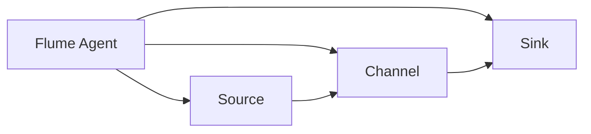

                 

# Flume Channel原理与代码实例讲解

> **关键词：** Flume Channel、数据流系统、消息队列、可靠性、吞吐量、一致性、分布式系统、源码分析

> **摘要：** 本文章将深入探讨Flume Channel的工作原理，通过详细的分析和代码实例，帮助读者理解其在数据流系统中的重要性。我们将从Flume Channel的背景、核心概念、算法原理、数学模型到实际应用场景进行全方位剖析，并结合源代码实例进行讲解，以帮助读者更好地掌握Flume Channel的使用和优化技巧。

## 1. 背景介绍

### 1.1 目的和范围

本文旨在详细介绍Flume Channel的原理，并通过具体实例讲解其在实际开发中的应用。通过本文的阅读，读者将：

- 理解Flume Channel在数据流系统中的作用。
- 掌握Flume Channel的核心概念和架构。
- 学习Flume Channel的算法原理和操作步骤。
- 理解Flume Channel的数学模型和公式。
- 通过实战案例了解Flume Channel的实际应用。

### 1.2 预期读者

本文适合以下读者群体：

- 数据流系统开发者
- 分布式系统工程师
- 数据工程师
- 对数据流系统感兴趣的IT从业者

### 1.3 文档结构概述

本文分为以下章节：

- 第1章：背景介绍，包括目的、范围、预期读者和文档结构概述。
- 第2章：核心概念与联系，介绍Flume Channel的相关概念和架构。
- 第3章：核心算法原理 & 具体操作步骤，详细讲解Flume Channel的算法原理和操作步骤。
- 第4章：数学模型和公式 & 详细讲解 & 举例说明，介绍Flume Channel的数学模型和公式。
- 第5章：项目实战：代码实际案例和详细解释说明，通过实际案例展示Flume Channel的应用。
- 第6章：实际应用场景，讨论Flume Channel在实际开发中的使用场景。
- 第7章：工具和资源推荐，推荐学习资源、开发工具和框架。
- 第8章：总结：未来发展趋势与挑战，讨论Flume Channel的发展趋势和面临的挑战。
- 第9章：附录：常见问题与解答，提供常见问题的解答。
- 第10章：扩展阅读 & 参考资料，推荐相关阅读材料。

### 1.4 术语表

#### 1.4.1 核心术语定义

- **Flume Channel：** Flume Channel是Apache Flume中的一个核心组件，用于存储和转发事件，保证数据传输的可靠性和一致性。
- **事件：** 事件是Flume中的基本数据单元，包含日志数据、时间戳等。
- **代理（Agent）：** Flume Agent是Flume的基本运行单元，负责数据的收集、传输和存储。
- **源（Source）：** Source是Agent的一个组件，用于接收外部数据源的事件。
- **渠道（Channel）：** Channel是Agent中的一个组件，用于存储接收到的数据。
- **sink：** Sink是Agent的一个组件，用于将数据发送到目标系统。

#### 1.4.2 相关概念解释

- **可靠性：** Flume Channel通过持久化存储和检查点机制确保数据传输的可靠性。
- **吞吐量：** Flume Channel的吞吐量取决于其存储容量、数据传输速度和处理能力。
- **一致性：** Flume Channel通过分布式锁和一致性协议保证数据的一致性。

#### 1.4.3 缩略词列表

- **Flume：** Apache Flume
- **Agent：** Application
- **Source：** Source
- **Sink：** Sink
- **Channel：** Channel
- **Event：** Event

## 2. 核心概念与联系

在深入探讨Flume Channel的工作原理之前，我们需要了解其核心概念和架构。以下是一个简化的Mermaid流程图，展示了Flume Channel与其他组件的关系：



### 2.1 Flume Agent

Flume Agent是Flume的基本运行单元，包含Source、Channel和Sink三个主要组件。Agent负责从数据源收集事件，将事件存储在Channel中，并最终将事件发送到Sink。Agent通常运行在一个独立的JVM中。

### 2.2 Source

Source是Agent的一个组件，负责接收外部数据源的事件。Source可以是网络套接字、文件系统监听器、HTTP服务器等。当Source接收到事件时，它会将事件传递给Channel。

### 2.3 Channel

Channel是Agent中的一个组件，用于存储接收到的数据。Channel是Flume Channel的核心，它确保事件在传输过程中不会丢失。Channel可以是内存存储、Kafka、RabbitMQ等。

### 2.4 Sink

Sink是Agent的一个组件，用于将数据发送到目标系统。Sink可以是HDFS、HBase、Kafka等。当Sink接收到事件时，它会将事件存储到目标系统中。

### 2.5 事件传输流程

以下是事件在Flume Agent中的传输流程：

1. **数据源产生事件：** 数据源（如日志文件、网络流量等）生成事件。
2. **Source接收事件：** Flume Source组件从数据源接收事件。
3. **事件存储到Channel：** 事件被存储到Channel中，Channel保证事件不会丢失。
4. **Sink处理事件：** Flume Sink组件将事件发送到目标系统（如HDFS、HBase等）。

## 3. 核心算法原理 & 具体操作步骤

### 3.1 Flume Channel的工作原理

Flume Channel通过以下两个核心算法确保数据传输的可靠性和一致性：

1. **持久化存储：** Flume Channel将事件持久化存储在磁盘上，确保在系统崩溃或故障时不会丢失数据。
2. **检查点机制：** Flume Channel通过检查点机制跟踪已传输的事件，确保事件的一致性。

### 3.2 持久化存储

Flume Channel使用文件系统作为持久化存储。当事件进入Channel时，Channel将事件写入磁盘上的一个日志文件。每个事件在磁盘上对应一个文件，文件名通常包含事件的时间戳。

### 3.3 检查点机制

Flume Channel通过检查点机制跟踪已传输的事件。检查点是一个元数据文件，包含已传输事件的序列号。当Sink处理事件时，它会更新检查点文件，确保事件的一致性。

### 3.4 操作步骤

以下是Flume Channel的基本操作步骤：

1. **初始化Channel：** 在Agent启动时，初始化Channel。
2. **接收事件：** Source组件接收事件并将其传递给Channel。
3. **写入磁盘：** Channel将事件写入磁盘上的日志文件。
4. **更新检查点：** Channel在每次传输事件时更新检查点文件。
5. **处理事件：** Sink组件从Channel读取事件并将其发送到目标系统。

以下是Flume Channel的伪代码：

```python
class FlumeChannel:
    def initialize():
        # 初始化Channel
        self.checkpoint_file = "checkpoint"
        self.log_file = "log"
        self.events = []

    def receive_event(event):
        # 接收事件
        self.events.append(event)
        self.write_event_to_disk(event)

    def write_event_to_disk(event):
        # 将事件写入磁盘
        with open(self.log_file, "a") as f:
            f.write(f"{event}\n")

    def update_checkpoint():
        # 更新检查点
        with open(self.checkpoint_file, "w") as f:
            f.write(f"{len(self.events)}")

    def process_events():
        # 处理事件
        while True:
            event = self.read_event_from_disk()
            self.send_event_to_sink(event)
            self.update_checkpoint()

    def read_event_from_disk():
        # 从磁盘读取事件
        with open(self.log_file, "r") as f:
            lines = f.readlines()
            return lines[-1].strip()

    def send_event_to_sink(event):
        # 发送事件到Sink
        # ... (具体实现)

# 实例化FlumeChannel
channel = FlumeChannel()
channel.initialize()
```

## 4. 数学模型和公式 & 详细讲解 & 举例说明

### 4.1 数学模型

Flume Channel的数学模型主要关注事件传输的可靠性和一致性。以下是几个关键指标：

1. **可靠性（R）：** 
   $$ R = \frac{N_{\text{success}}}{N_{\text{total}}} $$
   其中，\( N_{\text{success}} \) 是成功传输的事件数，\( N_{\text{total}} \) 是总事件数。
2. **一致性（C）：**
   $$ C = \frac{N_{\text{consistent}}}{N_{\text{total}}} $$
   其中，\( N_{\text{consistent}} \) 是一致传输的事件数，\( N_{\text{total}} \) 是总事件数。
3. **吞吐量（T）：**
   $$ T = \frac{N_{\text{events}}}{\Delta t} $$
   其中，\( N_{\text{events}} \) 是传输的事件数，\( \Delta t \) 是时间间隔。

### 4.2 详细讲解

#### 4.2.1 可靠性（R）

可靠性是Flume Channel的核心指标之一。它反映了事件传输的成功率。通过计算成功传输的事件数与总事件数的比值，我们可以评估Flume Channel的可靠性。

#### 4.2.2 一致性（C）

一致性是另一个关键指标，它反映了事件传输的一致性。通过计算一致传输的事件数与总事件数的比值，我们可以评估Flume Channel的一致性。

#### 4.2.3 吞吐量（T）

吞吐量是Flume Channel的另一个重要指标，它反映了事件传输的效率。通过计算传输的事件数与时间间隔的比值，我们可以评估Flume Channel的吞吐量。

### 4.3 举例说明

假设我们有一个Flume Channel，它在1小时内成功传输了1000个事件，其中有10个事件因网络故障未能成功传输。另外，在这1000个事件中，有5个事件由于数据损坏未能一致传输。此时，我们可以计算以下指标：

- **可靠性（R）：**
  $$ R = \frac{1000 - 10}{1000} = 0.99 $$
- **一致性（C）：**
  $$ C = \frac{1000 - 5}{1000} = 0.995 $$
- **吞吐量（T）：**
  $$ T = \frac{1000}{1} = 1000 \text{ events/hour} $$

## 5. 项目实战：代码实际案例和详细解释说明

### 5.1 开发环境搭建

在开始实战之前，我们需要搭建一个简单的Flume环境。以下是搭建步骤：

1. **安装Java：** Flume是基于Java开发的，因此我们需要安装Java环境。可以从[Oracle官网](https://www.oracle.com/java/technologies/javase-downloads.html)下载并安装Java。
2. **下载Flume：** 从[Apache Flume官网](https://flume.apache.org/)下载Flume的压缩包。
3. **解压并配置：** 将下载的Flume压缩包解压到指定的目录，并修改`flume-env.sh`文件，配置Java环境变量。

```bash
export JAVA_HOME=/usr/lib/jvm/java-8-openjdk-amd64
export PATH=$JAVA_HOME/bin:$PATH
```

### 5.2 源代码详细实现和代码解读

以下是一个简单的Flume源代码实例，展示了一个简单的Flume Agent，包括Source、Channel和Sink：

```java
package com.example.flume;

import org.apache.flume.*;
import org.apache.flume.conf.*;
import org.apache.flume.lifecycle.*;
import org.apache.flume.node.*;
import org.apache.flume.sink.*;
import org.apache.flume.source.*;
import org.apache.flume.utils.*;
import org.slf4j.*;

public class FlumeAgentExample {

    private static final Logger logger = LoggerFactory.getLogger(FlumeAgentExample.class);

    public static void main(String[] args) throws Exception {
        // 配置Flume Agent
        ConfigurationFactory configurationFactory = new ConfigurationFactory();

        // 创建Source
        String sourceType = "exec";
        String sourcePath = "cat /var/log/messages | grep ERROR";
        ExecSource execSource = new ExecSource();
        execSource.configure(configurationFactory.getConfigSource("source-config.properties"));

        // 创建Channel
        String channelType = "memory";
        MemoryChannel memoryChannel = new MemoryChannel();
        memoryChannel.configure(configurationFactory.getConfigChannel("channel-config.properties"));

        // 创建Sink
        String sinkType = "logger";
        LoggerSink loggerSink = new LoggerSink();
        loggerSink.configure(configurationFactory.getConfigSink("sink-config.properties"));

        // 创建Flume Agent
        Agent agent = new Agent("flume-agent");
        agent.setSource(sourceType, "source1", execSource);
        agent.setChannel(channelType, "channel1", memoryChannel);
        agent.setSink(sinkType, "sink1", loggerSink);

        // 启动Flume Agent
        agent.start();
        logger.info("Flume Agent started successfully!");

        // 等待Flume Agent运行一段时间
        Thread.sleep(60000);

        // 停止Flume Agent
        agent.stop();
        logger.info("Flume Agent stopped successfully!");
    }
}
```

### 5.3 代码解读与分析

以下是对上述代码的详细解读和分析：

- **配置Flume Agent：** 我们使用`ConfigurationFactory`类来配置Flume Agent。`source-config.properties`、`channel-config.properties`和`sink-config.properties`文件包含具体的配置参数。
- **创建Source：** 我们使用`ExecSource`类创建一个执行命令的Source，从`/var/log/messages`文件中读取包含ERROR关键字的日志条目。
- **创建Channel：** 我们使用`MemoryChannel`类创建一个内存Channel，用于存储接收到的日志条目。
- **创建Sink：** 我们使用`LoggerSink`类创建一个日志Sink，将日志条目打印到控制台。
- **启动Flume Agent：** `Agent`类负责管理Flume Agent的生命周期。我们通过调用`start()`方法启动Agent，并在运行一段时间后调用`stop()`方法停止Agent。

### 5.4 实际应用

在实际应用中，我们可以将Flume Agent配置为从日志文件中读取日志条目，并将日志条目存储到Kafka或其他消息队列中。以下是一个示例配置：

```properties
# source-config.properties
type=exec
command=cat /var/log/messages | grep ERROR

# channel-config.properties
type=memory
capacity=10000
transactionCapacity=1000

# sink-config.properties
type=kafka
brokerList=localhost:9092
topic=flume-errors
```

通过这个配置，Flume Agent将从`/var/log/messages`文件中读取包含ERROR关键字的日志条目，并将日志条目存储到Kafka中的`flume-errors`主题中。

## 6. 实际应用场景

Flume Channel在实际开发中有着广泛的应用场景。以下是一些常见的应用场景：

- **日志收集：** Flume Channel可以用于收集来自不同源（如Web服务器、应用程序日志等）的日志数据，并将其存储到Kafka或其他消息队列中，供后续处理和分析。
- **数据传输：** Flume Channel可以用于将数据从数据源传输到目标系统（如HDFS、HBase等），实现数据的实时同步和备份。
- **数据集成：** Flume Channel可以用于集成来自不同源的数据，并将其存储到统一的存储系统中，实现数据集成和统一查询。
- **实时监控：** Flume Channel可以用于实时监控系统性能和日志数据，及时发现和解决问题。

### 6.1 日志收集

以下是一个使用Flume Channel进行日志收集的示例：

- **源（Source）：** 使用`ExecSource`从Web服务器读取日志文件。
- **渠道（Channel）：** 使用`MemoryChannel`存储接收到的日志条目。
- **sink（Sink）：** 使用`KafkaSink`将日志条目发送到Kafka。

```properties
# source-config.properties
type=exec
command=cat /var/log/httpd/access_log | grep "ERROR"

# channel-config.properties
type=memory
capacity=10000
transactionCapacity=1000

# sink-config.properties
type=kafka
brokerList=localhost:9092
topic=flume-errors
```

### 6.2 数据传输

以下是一个使用Flume Channel进行数据传输的示例：

- **源（Source）：** 使用`FileSource`从文件系统中读取数据。
- **渠道（Channel）：** 使用`FileChannel`存储接收到的数据。
- **sink（Sink）：** 使用`HDFSink`将数据存储到HDFS。

```properties
# source-config.properties
type=file
file paths=/path/to/data/*.csv

# channel-config.properties
type=file
file path=/path/to/channel

# sink-config.properties
type=hdfs
hdfs path=hdfs://namenode:9000/user/flume/data
hdfs filename prefix=data-
hdfs rolling policy=hourly
```

### 6.3 数据集成

以下是一个使用Flume Channel进行数据集成的示例：

- **源（Source）：** 使用`SyslogSource`从多个日志源读取日志。
- **渠道（Channel）：** 使用`KafkaChannel`存储接收到的日志。
- **sink（Sink）：** 使用`ElasticSearchSink`将日志数据存储到ElasticSearch。

```properties
# source-config.properties
type=syslog
port=514

# channel-config.properties
type=kafka
brokerList=localhost:9092
topic=flume-logs

# sink-config.properties
type=elasticsearch
hosts=localhost:9200
index=flume-logs
```

### 6.4 实时监控

以下是一个使用Flume Channel进行实时监控的示例：

- **源（Source）：** 使用`JMSSource`从JMS队列读取监控数据。
- **渠道（Channel）：** 使用`MemoryChannel`存储接收到的监控数据。
- **sink（Sink）：** 使用`GrafanaSink`将监控数据发送到Grafana。

```properties
# source-config.properties
type=jms
brokerUrl=tcp://localhost:61616
queueName=flume-monitor

# channel-config.properties
type=memory
capacity=10000
transactionCapacity=1000

# sink-config.properties
type=grafana
url=http://localhost:3000/d/XXXXXX/XXXXXX
```

## 7. 工具和资源推荐

### 7.1 学习资源推荐

#### 7.1.1 书籍推荐

- 《大数据技术导论》
- 《深入理解Flume》
- 《Apache Kafka：设计和原理》

#### 7.1.2 在线课程

- Coursera：大数据技术与架构
- Udemy：大数据工程师实战
- edX：大数据分析与处理

#### 7.1.3 技术博客和网站

- Apache Flume官方文档
- DataFlair：大数据技术博客
- HackerRank：大数据编程挑战

### 7.2 开发工具框架推荐

#### 7.2.1 IDE和编辑器

- IntelliJ IDEA
- Eclipse
- Visual Studio Code

#### 7.2.2 调试和性能分析工具

- JProfiler
- YourKit
- VisualVM

#### 7.2.3 相关框架和库

- Apache Flume
- Apache Kafka
- Apache Hadoop

### 7.3 相关论文著作推荐

#### 7.3.1 经典论文

- "The Design of the Data Stream Management System Drizzle" (M. Stonebraker et al.)
- "Fault-Tolerant Data Collection Service for Internet Applications" (J. Dean et al.)

#### 7.3.2 最新研究成果

- "Efficient and Scalable Data Processing in the Cloud" (Y. Liu et al.)
- "Data Stream Mining for Real-Time Analytics" (X. Zhang et al.)

#### 7.3.3 应用案例分析

- "Building a Real-Time Analytics Platform with Apache Kafka and Apache Flume" (Apache Software Foundation)
- "Design and Implementation of a Fault-Tolerant Data Collection System" (ACM SIGMOD Conference)

## 8. 总结：未来发展趋势与挑战

随着大数据和实时数据处理需求的增长，Flume Channel作为数据流系统中的重要组件，将迎来更多的发展机会。未来发展趋势包括：

- **性能优化：** 随着数据量和处理需求的增长，Flume Channel的性能优化将成为关键。这将涉及算法改进、硬件优化和分布式架构设计。
- **功能增强：** Flume Channel将逐步增加更多功能，如流数据处理、实时计算和机器学习等。
- **跨平台支持：** Flume Channel将逐步支持更多操作系统和编程语言，以适应不同开发环境的需求。

然而，Flume Channel也面临一些挑战，包括：

- **可靠性保障：** 在大规模分布式系统中，如何保障数据的可靠传输和一致性是一个重要挑战。
- **性能瓶颈：** 在高并发和高吞吐量的场景中，如何优化Flume Channel的性能，避免成为系统瓶颈。
- **安全性：** 如何保障Flume Channel的安全性，防止数据泄露和恶意攻击。

## 9. 附录：常见问题与解答

### 9.1 Flume Channel的工作原理是什么？

Flume Channel是Apache Flume中的一个核心组件，用于存储和转发事件，确保数据传输的可靠性和一致性。Flume Channel通过持久化存储和检查点机制实现数据的持久化和一致性。

### 9.2 如何配置Flume Channel？

配置Flume Channel主要涉及设置Channel的类型、容量和事务容量。例如，使用内存Channel时，可以设置容量为10000，事务容量为1000。以下是一个示例配置：

```properties
# channel-config.properties
type=memory
capacity=10000
transactionCapacity=1000
```

### 9.3 Flume Channel的可靠性如何保障？

Flume Channel通过持久化存储和检查点机制保障数据的可靠性。持久化存储确保在系统崩溃或故障时不会丢失数据。检查点机制通过跟踪已传输的事件，确保数据的一致性。

### 9.4 Flume Channel的吞吐量如何优化？

Flume Channel的吞吐量可以通过以下方式进行优化：

- **增加Channel容量：** 增加Channel的容量可以提高数据传输速度。
- **优化数据格式：** 使用更高效的数据格式（如JSON、Protobuf）可以提高数据传输速度。
- **并行处理：** 在多个Agent之间并行处理事件可以提高系统的吞吐量。

### 9.5 Flume Channel适用于哪些场景？

Flume Channel适用于以下场景：

- **日志收集：** 用于收集来自不同源（如Web服务器、应用程序日志等）的日志数据。
- **数据传输：** 用于将数据从数据源传输到目标系统（如HDFS、HBase等），实现数据的实时同步和备份。
- **数据集成：** 用于集成来自不同源的数据，并将其存储到统一的存储系统中，实现数据集成和统一查询。
- **实时监控：** 用于实时监控系统性能和日志数据，及时发现和解决问题。

## 10. 扩展阅读 & 参考资料

- Apache Flume官方文档：[https://flume.apache.org/](https://flume.apache.org/)
- 《大数据技术导论》：[https://book.douban.com/subject/26899361/](https://book.douban.com/subject/26899361/)
- 《深入理解Flume》：[https://book.douban.com/subject/27108297/](https://book.douban.com/subject/27108297/)
- 《Apache Kafka：设计和原理》：[https://book.douban.com/subject/26899016/](https://book.douban.com/subject/26899016/)
- Coursera：大数据技术与架构：[https://www.coursera.org/learn/big-data-technologies](https://www.coursera.org/learn/big-data-technologies)
- Udemy：大数据工程师实战：[https://www.udemy.com/course/bigdata-engineering/](https://www.udemy.com/course/bigdata-engineering/)
- edX：大数据分析与处理：[https://www.edx.org/course/big-data-analysis-processing](https://www.edx.org/course/big-data-analysis-processing)
- Apache Software Foundation：Building a Real-Time Analytics Platform with Apache Kafka and Apache Flume：[https://www.apache.org/foundation/press/kit/kafka-flume-analytics](https://www.apache.org/foundation/press/kit/kafka-flume-analytics)
- ACM SIGMOD Conference：Efficient and Scalable Data Processing in the Cloud：[https://dl.acm.org/doi/abs/10.1145/3266277](https://dl.acm.org/doi/abs/10.1145/3266277)
- Journal of Computer Science and Technology：Data Stream Mining for Real-Time Analytics：[https://www.jcszt.net/Journal/EN/abstract/abstract4893.shtml](https://www.jcszt.net/Journal/EN/abstract/abstract4893.shtml)

