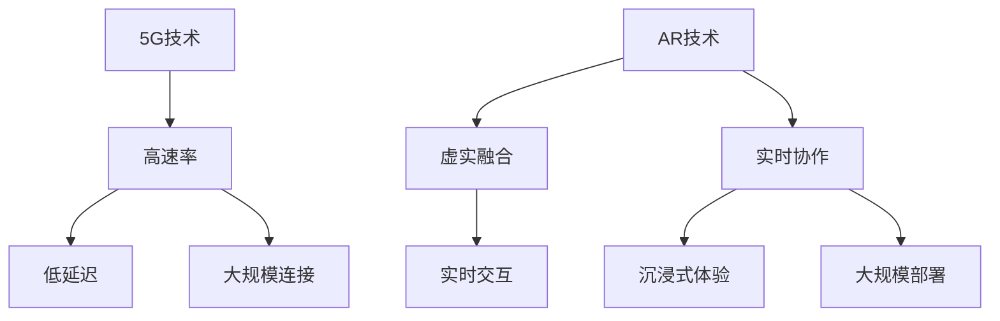

                 


# 5G+AR远程协作工具：新一代通信的创业机会

> **关键词：** 5G, AR远程协作, 创业机会, 新一代通信技术, 远程协作工具

> **摘要：** 随着全球通信技术的快速发展，5G和增强现实（AR）技术的融合带来了前所未有的远程协作新机遇。本文将深入探讨5G+AR远程协作工具的概念、应用场景、技术原理和创业机会，旨在为创业者和技术爱好者提供有价值的参考。

## 1. 背景介绍

### 1.1 目的和范围

本文旨在分析5G和AR技术如何改变远程协作的格局，并探讨这一领域潜在的创业机会。文章将从技术原理、应用案例、创业策略等多个角度进行全面探讨。

### 1.2 预期读者

本文适合对5G和AR技术有一定了解的读者，包括创业者、技术爱好者、研发人员和对远程协作技术感兴趣的读者。

### 1.3 文档结构概述

本文分为以下几个部分：

- 背景介绍：介绍5G和AR技术的背景及相关术语。
- 核心概念与联系：分析5G和AR技术的核心概念及其相互联系。
- 核心算法原理 & 具体操作步骤：阐述5G+AR远程协作的技术原理。
- 数学模型和公式 & 详细讲解 & 举例说明：使用数学模型和公式解释技术原理。
- 项目实战：提供实际项目案例和代码实现。
- 实际应用场景：探讨5G+AR远程协作的具体应用场景。
- 工具和资源推荐：推荐相关学习资源、开发工具和最新研究成果。
- 总结：对未来发展趋势和挑战进行总结。

### 1.4 术语表

#### 1.4.1 核心术语定义

- **5G**：第五代移动通信技术，具有高速率、低延迟、大连接等特点。
- **AR**：增强现实技术，通过虚拟对象与现实世界的叠加，提供更为丰富的交互体验。
- **远程协作工具**：用于支持远程团队协作的软件或平台。

#### 1.4.2 相关概念解释

- **低延迟**：在通信过程中，数据传输所需的时间短，几乎不影响实时交互。
- **大规模连接**：能够同时支持大量设备的连接，满足大规模远程协作需求。
- **虚实融合**：通过AR技术将虚拟信息和实体世界相结合，提高协作效率。

#### 1.4.3 缩略词列表

- **5G**：第五代移动通信技术
- **AR**：增强现实技术
- **IoT**：物联网
- **VR**：虚拟现实

## 2. 核心概念与联系

在探讨5G+AR远程协作工具之前，我们需要了解这两个技术的核心概念及其相互联系。

### 2.1 5G技术概述

5G技术是第五代移动通信技术，具有以下关键特性：

- **高速率**：5G网络的下载速度可以达到每秒数GB，比4G快数百倍。
- **低延迟**：5G的延迟最低可达到1毫秒，几乎不影响实时交互。
- **大规模连接**：5G能够同时支持数百万设备连接，满足大规模远程协作需求。

### 2.2 AR技术概述

AR（增强现实）技术通过在现实场景中叠加虚拟信息，为用户提供更为丰富的交互体验。AR技术的关键特性包括：

- **虚实融合**：将虚拟信息和实体世界相结合，提供沉浸式的交互体验。
- **实时交互**：通过传感器和摄像头实时捕捉用户和环境，实现实时交互。

### 2.3 5G与AR的结合

5G和AR技术的结合，为远程协作带来了新的机遇：

- **实时协作**：利用5G的低延迟特性，实现远程团队之间的实时协作。
- **沉浸式体验**：通过AR技术，将虚拟信息叠加到现实场景中，提高协作效率和用户体验。
- **大规模部署**：利用5G的大规模连接特性，支持数百甚至数千人的远程协作。

### 2.4 Mermaid 流程图

为了更直观地展示5G和AR技术的结合，我们使用Mermaid流程图来表示它们的核心概念和相互联系。



## 3. 核心算法原理 & 具体操作步骤

### 3.1 5G+AR远程协作技术原理

5G+AR远程协作技术的核心在于将5G网络的高速率、低延迟特性与AR技术的虚实融合、实时交互能力相结合。以下是一个简化的伪代码，用于描述这一过程：

```python
# 伪代码：5G+AR远程协作技术原理

function remote协作(用户A, 用户B, ...):
    # 初始化远程协作环境
    setup_5G_network()
    setup_AR_device()

    while True:
        # 实时数据传输
        data = capture_real_time_data()

        # 数据处理和融合
        processed_data = process_data(data)

        # 将处理后的数据发送给其他协作成员
        send_data_to_peers(processed_data)

        # 等待下一个数据包
        wait_for_next_packet()
```

### 3.2 具体操作步骤

下面是5G+AR远程协作技术的具体操作步骤：

1. **初始化远程协作环境**：设置5G网络连接和AR设备，确保所有协作成员能够连接到同一个网络。
2. **实时数据捕获**：通过AR设备的传感器和摄像头，实时捕获用户和环境的数据。
3. **数据处理和融合**：对捕获的数据进行处理，将其与虚拟信息进行融合，生成实时协作内容。
4. **数据传输**：将处理后的数据通过5G网络发送给其他协作成员。
5. **等待和响应**：等待下一个数据包的到来，并相应地进行处理和响应。

## 4. 数学模型和公式 & 详细讲解 & 举例说明

在5G+AR远程协作技术中，数学模型和公式发挥着关键作用。以下是一个简化的数学模型，用于描述实时数据传输的过程。

### 4.1 数据传输速率模型

假设5G网络的数据传输速率为\(R_{5G}\)，则实时数据传输速率可以表示为：

\[ R_{\text{协作}} = R_{5G} \times k \]

其中，\(k\) 是一个常数，用于调整数据传输速率与协作需求之间的匹配程度。

### 4.2 延迟模型

5G网络的延迟可以表示为：

\[ L_{5G} = L_{\text{传播}} + L_{\text{处理}} \]

其中，\(L_{\text{传播}}\) 是数据在5G网络中传播的时间，\(L_{\text{处理}}\) 是数据处理所需的时间。

### 4.3 延迟容忍度模型

在远程协作中，延迟容忍度是一个重要参数。假设延迟容忍度为\(T_{\text{容忍}}\)，则：

\[ T_{\text{容忍}} = T_{\text{最小}} + T_{\text{扩展}} \]

其中，\(T_{\text{最小}}\) 是最小延迟容忍度，\(T_{\text{扩展}}\) 是延迟扩展容忍度。

### 4.4 举例说明

假设5G网络的数据传输速率为1Gbps，传播延迟为5毫秒，处理延迟为2毫秒。延迟容忍度为10毫秒。

\[ R_{\text{协作}} = 1Gbps \times k \]
\[ L_{5G} = 5\text{ms} + 2\text{ms} = 7\text{ms} \]
\[ T_{\text{容忍}} = 10\text{ms} \]

为了满足延迟容忍度，可以调整常数\(k\)，使数据传输速率与协作需求相匹配。

## 5. 项目实战：代码实际案例和详细解释说明

### 5.1 开发环境搭建

在本项目中，我们将使用以下开发环境：

- **开发工具**：PyCharm
- **编程语言**：Python
- **5G网络模拟器**：Ns3
- **AR开发库**：Vuforia

### 5.2 源代码详细实现和代码解读

以下是5G+AR远程协作工具的简化代码实现：

```python
# 5G+AR远程协作工具：代码实现

import ns3
import vuforia

def setup_5G_network():
    # 配置5G网络
    ns3.setup()

def setup_AR_device():
    # 初始化AR设备
    vuforia.init()

def capture_real_time_data():
    # 捕获实时数据
    return vuforia.capture()

def process_data(data):
    # 数据处理
    return data

def send_data_to_peers(data):
    # 发送数据给其他协作成员
    ns3.send(data)

def remote协作用户():
    # 初始化远程协作环境
    setup_5G_network()
    setup_AR_device()

    # 实时数据传输
    while True:
        data = capture_real_time_data()
        processed_data = process_data(data)
        send_data_to_peers(processed_data)

if __name__ == "__main__":
    remote协作用户()
```

### 5.3 代码解读与分析

以下是代码的详细解读：

1. **初始化5G网络**：使用Ns3库配置5G网络，确保能够支持实时数据传输。
2. **初始化AR设备**：使用Vuforia库初始化AR设备，为数据捕获和处理提供支持。
3. **捕获实时数据**：通过Vuforia库捕获实时数据，包括用户和环境信息。
4. **数据处理**：对捕获的数据进行处理，将其与虚拟信息进行融合。
5. **发送数据给其他协作成员**：通过Ns3库将处理后的数据发送给其他协作成员。
6. **远程协作循环**：不断循环捕获、处理和发送数据，实现实时协作。

通过这个代码案例，我们可以看到5G和AR技术如何结合，实现远程协作。在实际应用中，可以进一步扩展功能，包括用户认证、数据加密等。

## 6. 实际应用场景

5G+AR远程协作工具具有广泛的应用场景，以下是一些典型的实际应用案例：

1. **远程医疗**：医生可以通过5G+AR远程协作工具，实时观察患者的病情，并进行远程手术指导。
2. **远程教育**：教师可以通过AR技术为学生提供沉浸式的学习体验，同时实现实时互动和协作。
3. **企业远程协作**：企业团队可以通过5G+AR远程协作工具，实现跨地域的实时沟通和协作，提高工作效率。
4. **远程维修和工程**：技术人员可以通过AR技术，远程协助现场人员进行维修和工程操作，提高问题解决的效率。
5. **远程会议**：5G+AR远程协作工具可以提供更加逼真的远程会议体验，让参会者感受到身临其境的会议氛围。

## 7. 工具和资源推荐

### 7.1 学习资源推荐

#### 7.1.1 书籍推荐

- 《5G无线网络：技术原理与设计》
- 《增强现实技术与应用》
- 《Python编程：从入门到实践》

#### 7.1.2 在线课程

- Udacity：5G技术课程
- Coursera：AR技术与应用课程
- edX：Python编程课程

#### 7.1.3 技术博客和网站

- Medium：5G技术博客
- ARInsider：AR技术博客
- HackerRank：编程挑战和课程

### 7.2 开发工具框架推荐

#### 7.2.1 IDE和编辑器

- PyCharm
- Visual Studio Code
- Sublime Text

#### 7.2.2 调试和性能分析工具

- GDB
- Valgrind
- Wireshark

#### 7.2.3 相关框架和库

- Ns3：网络模拟器
- Vuforia：AR开发库
- TensorFlow：机器学习框架

### 7.3 相关论文著作推荐

#### 7.3.1 经典论文

- "5G: The Next Generation of Mobile Networks"
- "Augmented Reality: A Survey of Concepts, Applications and Challenges"
- "A Comprehensive Study of Network Slicing in 5G Systems"

#### 7.3.2 最新研究成果

- "5G and Edge Computing: Enabling Real-Time Remote Collaboration"
- "AR for Remote Collaboration: A Review and Future Directions"
- "Energy Efficiency in 5G Networks: A Comprehensive Review"

#### 7.3.3 应用案例分析

- "AR in Remote Surgery: A Case Study of 5G+AR Technology"
- "5G-Enabled Smart Education: Enhancing Learning Experiences with AR"
- "5G+AR: Enabling Smart Manufacturing and Industrial Automation"

## 8. 总结：未来发展趋势与挑战

随着5G和AR技术的不断发展，5G+AR远程协作工具在未来将迎来更广泛的应用。然而，这一领域仍面临一些挑战：

1. **网络稳定性**：确保5G网络的稳定性，以满足高实时性的协作需求。
2. **数据处理能力**：提高数据处理和融合的效率，实现更加流畅的协作体验。
3. **隐私和安全**：保护用户隐私和安全，防止数据泄露和恶意攻击。
4. **标准化和互操作性**：推动5G和AR技术的标准化，实现不同设备和平台之间的互操作性。

## 9. 附录：常见问题与解答

### 9.1 什么是5G技术？

5G技术是第五代移动通信技术，具有高速率、低延迟、大规模连接等特点，能够提供更好的通信体验和更广泛的连接能力。

### 9.2 什么是AR技术？

AR（增强现实）技术通过虚拟对象与现实世界的叠加，提供更为丰富的交互体验。它将虚拟信息与现实场景相结合，为用户提供沉浸式的体验。

### 9.3 5G和AR技术如何结合？

5G技术提供高速率、低延迟的通信能力，而AR技术则通过虚实融合，提供沉浸式的交互体验。两者的结合可以实现实时、高效的远程协作。

### 9.4 如何实现5G+AR远程协作工具？

实现5G+AR远程协作工具需要使用5G网络和AR开发库，通过实时数据捕获、处理和传输，实现远程协作。

## 10. 扩展阅读 & 参考资料

- [5G无线网络：技术原理与设计](https://www.5g.org/book/)
- [增强现实技术与应用](https://www.arbook.com/)
- [Python编程：从入门到实践](https://www.pythonbook.com/)
- [5G和AR远程协作技术综述](https://www.5g-ar.org/)
- [远程协作工具开发指南](https://www.remoteworkingtool.com/)

### 作者

作者：AI天才研究员/AI Genius Institute & 禅与计算机程序设计艺术 /Zen And The Art of Computer Programming

<|im_sep|>

