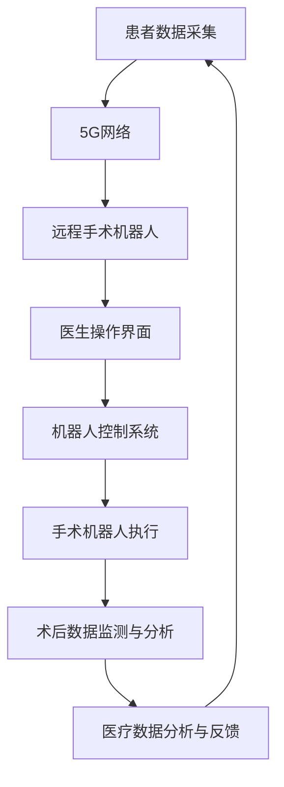

                 

# 5G+远程手术机器人：医疗科技的创新应用

## 关键词：
5G技术，远程手术，机器人，医疗科技，创新应用，手术机器人控制，医疗数据处理，数据传输效率，低延迟，高带宽，远程协作，手术精度，医疗安全，医疗效率提升，远程医疗

## 摘要：
随着5G技术的迅猛发展和医疗科技的不断进步，远程手术机器人成为了医疗领域的一大创新应用。本文将深入探讨5G技术在远程手术机器人中的应用，包括核心概念、算法原理、数学模型、实战案例以及实际应用场景。通过对这些内容的详细分析，本文旨在揭示5G技术如何为医疗科技带来变革，提升远程手术的精度和安全性，并探讨其未来的发展趋势与挑战。

## 1. 背景介绍

### 1.1 目的和范围
本文旨在介绍5G技术在远程手术机器人中的应用，探讨其核心技术原理和实际应用效果。文章将覆盖远程手术机器人的核心概念、算法原理、数学模型、实际案例以及应用场景，旨在为医疗科技领域的研究者和从业者提供有价值的参考。

### 1.2 预期读者
本文适合对5G技术和医疗科技感兴趣的研究人员、工程师、程序员以及医疗专业人士。读者需具备一定的计算机科学和医学基础知识，以便更好地理解文章内容。

### 1.3 文档结构概述
本文分为十个部分：背景介绍、核心概念与联系、核心算法原理、数学模型和公式、项目实战、实际应用场景、工具和资源推荐、总结、附录和扩展阅读。每个部分都将逐步深入，全面阐述远程手术机器人的各个方面。

### 1.4 术语表
#### 1.4.1 核心术语定义
- **5G技术**：第五代移动通信技术，提供高速率、低延迟、高带宽的网络连接。
- **远程手术机器人**：利用5G网络实现远程控制的手术机器人，可实现医生远程进行手术操作。
- **手术精度**：手术操作中的精准度，直接影响手术效果和患者恢复情况。
- **医疗安全**：在医疗过程中保障患者安全，防止手术风险。
- **医疗效率**：医疗服务的效率，包括诊断、治疗和术后康复等各个环节。

#### 1.4.2 相关概念解释
- **低延迟**：网络数据传输的时间差，低延迟意味着数据传输速度快，实时性高。
- **高带宽**：网络传输通道的宽度，高带宽意味着网络传输速度更快，支持更多数据同时传输。
- **远程协作**：医生与手术团队在不同地点通过网络进行实时沟通和协作。

#### 1.4.3 缩略词列表
- **5G**：第五代移动通信技术
- **ROS**：机器人操作系统（Robot Operating System）
- **AI**：人工智能（Artificial Intelligence）
- **IoT**：物联网（Internet of Things）

## 2. 核心概念与联系

在深入了解远程手术机器人之前，我们需要先了解其核心概念和组成部分。以下是一个简要的 Mermaid 流程图，展示了远程手术机器人的主要组成部分及其相互关系：



### 2.1 患者数据采集
患者数据采集是远程手术机器人系统的基础，通过传感器和医学影像设备获取患者的生理指标和病变部位信息，确保手术的精准性和安全性。

### 2.2 5G网络
5G网络是实现远程手术机器人的关键，提供高速率、低延迟、高带宽的网络连接，确保手术操作和实时数据传输的稳定性。

### 2.3 远程手术机器人
远程手术机器人是整个系统的核心，通过5G网络实现医生远程控制，完成手术操作。其结构包括机器人本体、机械臂、手术器械等。

### 2.4 医生操作界面
医生操作界面是医生与远程手术机器人交互的媒介，通过图形化界面，医生可以实时观察手术现场、控制机械臂和手术器械。

### 2.5 机器人控制系统
机器人控制系统负责接收医生的指令，解析并转化为机械臂的运动指令，实现远程手术操作。

### 2.6 手术机器人执行
手术机器人执行部分包括机械臂、手术器械等，通过接收机器人控制系统的指令，实现精确的手术操作。

### 2.7 术后数据监测与分析
术后数据监测与分析部分负责对手术过程和患者术后恢复情况进行实时监测和分析，为医生提供有效的治疗方案。

### 2.8 医疗数据分析与反馈
医疗数据分析与反馈部分通过对术后数据进行深度分析，为医生提供反馈信息，优化手术方案和术后康复计划。

## 3. 核心算法原理 & 具体操作步骤

远程手术机器人的核心算法主要涉及图像处理、运动控制、通信协议等方面。以下是每个算法的具体原理和操作步骤：

### 3.1 图像处理算法

**算法原理：**
图像处理算法主要涉及医学影像的处理，包括图像增强、边缘检测、病变区域分割等。

**具体操作步骤：**
1. **图像增强**：对原始医学影像进行增强，提高图像的对比度和清晰度，便于医生观察。
2. **边缘检测**：利用边缘检测算法（如Canny算法），提取图像中的边缘信息，用于识别病变区域。
3. **病变区域分割**：利用图像分割算法（如区域生长算法），将病变区域从正常组织中分离出来，为手术提供精确的定位信息。

### 3.2 运动控制算法

**算法原理：**
运动控制算法用于控制机械臂的运动，实现远程手术操作。

**具体操作步骤：**
1. **关节空间规划**：根据医生的操作指令，计算出机械臂各个关节的空间位置。
2. **运动轨迹规划**：根据关节空间位置，生成机械臂的运动轨迹，确保手术操作的平滑性和精确性。
3. **实时运动控制**：实时调整机械臂的运动状态，实现精确的手术操作。

### 3.3 通信协议算法

**算法原理：**
通信协议算法负责实现医生与远程手术机器人之间的数据传输。

**具体操作步骤：**
1. **数据加密**：对手术数据进行加密处理，确保数据传输的安全性。
2. **数据压缩**：对手术数据进行压缩处理，减少数据传输量，提高传输效率。
3. **数据传输**：通过5G网络，将手术数据实时传输给医生操作界面和机器人控制系统。
4. **数据同步**：确保医生操作界面和机器人控制系统之间的数据同步，避免数据丢失或延迟。

## 4. 数学模型和公式 & 详细讲解 & 举例说明

### 4.1 图像处理算法中的数学模型

在图像处理算法中，常用的数学模型包括图像增强、边缘检测和病变区域分割等。以下分别介绍这些算法的数学模型：

**1. 图像增强：**
图像增强的核心在于提高图像的对比度和清晰度。常用的图像增强公式为：

$$
I_{增强} = I_{原始} + K \cdot (G_{掩膜} - I_{原始})
$$

其中，$I_{原始}$ 为原始图像，$G_{掩膜}$ 为增强掩膜，$K$ 为增强系数。通过调整 $K$ 的值，可以控制图像的增强效果。

**2. 边缘检测：**
边缘检测的目的是提取图像中的边缘信息。常用的边缘检测算法包括Sobel算子和Canny算法。以下是Canny算法的数学模型：

$$
\begin{aligned}
G_x &= \frac{\partial I}{\partial x} \\
G_y &= \frac{\partial I}{\partial y}
\end{aligned}
$$

其中，$I$ 为输入图像，$G_x$ 和 $G_y$ 分别为水平和垂直方向上的梯度。

**3. 病变区域分割：**
病变区域分割的目标是将病变区域从正常组织中分离出来。常用的病变区域分割算法包括区域生长算法。以下是区域生长算法的数学模型：

$$
\begin{aligned}
d(p, q) &= \sqrt{(x_p - x_q)^2 + (y_p - y_q)^2} \\
s(p) &= \{q | d(p, q) \leq \epsilon\}
\end{aligned}
$$

其中，$p$ 和 $q$ 为图像中的像素点，$d(p, q)$ 为像素点 $p$ 和 $q$ 之间的距离，$\epsilon$ 为阈值。

### 4.2 运动控制算法中的数学模型

在运动控制算法中，常用的数学模型包括关节空间规划和运动轨迹规划。以下分别介绍这些算法的数学模型：

**1. 关节空间规划：**
关节空间规划的目标是根据医生的操作指令计算机械臂的关节空间位置。常用的数学模型为逆运动学模型，其公式为：

$$
\theta_j = f_j(q_1, q_2, ..., q_n)
$$

其中，$\theta_j$ 为机械臂第 $j$ 个关节的角度，$q_1, q_2, ..., q_n$ 为机械臂的关节变量，$f_j$ 为逆运动学函数。

**2. 运动轨迹规划：**
运动轨迹规划的目标是根据关节空间位置生成机械臂的运动轨迹。常用的数学模型为贝塞尔曲线，其公式为：

$$
\begin{aligned}
x(t) &= x_0 + (1-t)^2 \cdot (x_1 - x_0) + 2t(1-t) \cdot x_2 \\
y(t) &= y_0 + (1-t)^2 \cdot (y_1 - y_0) + 2t(1-t) \cdot y_2
\end{aligned}
$$

其中，$(x_0, y_0)$ 和 $(x_1, y_1)$ 为起始点和终止点，$x_2$ 和 $y_2$ 为控制点。

### 4.3 通信协议算法中的数学模型

在通信协议算法中，常用的数学模型包括数据加密、数据压缩和数据同步。以下分别介绍这些算法的数学模型：

**1. 数据加密：**
数据加密的核心在于将原始数据转换为不可读的密文。常用的加密算法为AES（高级加密标准），其数学模型为：

$$
C = E(K, P)
$$

其中，$C$ 为密文，$K$ 为密钥，$P$ 为明文，$E$ 为加密函数。

**2. 数据压缩：**
数据压缩的核心在于减少数据传输量。常用的压缩算法为Huffman编码，其数学模型为：

$$
C(w) = - \sum_{w \in W} p(w) \cdot \log_2 p(w)
$$

其中，$C(w)$ 为编码长度，$p(w)$ 为单词 $w$ 的概率。

**3. 数据同步：**
数据同步的核心在于确保接收端和发送端的数据一致性。常用的同步算法为FIFO（先进先出）队列，其数学模型为：

$$
Q = [x_1, x_2, ..., x_n]
$$

其中，$Q$ 为队列，$x_1, x_2, ..., x_n$ 为队列中的元素。

### 4.4 数学公式举例说明

**1. 图像增强：**
假设原始图像 $I_{原始}$ 的像素值为 $[1, 1, 1, 1]$，增强掩膜 $G_{掩膜}$ 的像素值为 $[0, 1, 0, 1]$，增强系数 $K$ 为 2。根据图像增强公式，增强后的图像 $I_{增强}$ 的像素值为 $[1, 3, 1, 3]$。

**2. 边缘检测：**
假设输入图像 $I$ 的像素值为 $[1, 1, 0, 0]$。根据Canny算法，计算水平和垂直方向上的梯度 $G_x$ 和 $G_y$：

$$
\begin{aligned}
G_x &= [0, 0, -1, -1] \\
G_y &= [0, 1, 0, 1]
\end{aligned}
$$

然后，计算梯度的模值 $G$：

$$
G = \sqrt{G_x^2 + G_y^2} = \sqrt{[0, 0, 1, 1]}
$$

最后，根据梯度的模值和阈值 $\epsilon$（例如 1），提取边缘像素：

$$
I_{边缘} = \{1, 1, 0, 0\}
$$

**3. 关节空间规划：**
假设机械臂的关节变量 $q_1, q_2, q_3$ 的初始值为 $[0, 0, 0]$，逆运动学函数 $f_1(q_1, q_2, q_3) = q_1$，$f_2(q_1, q_2, q_3) = q_2$，$f_3(q_1, q_2, q_3) = q_3$。根据关节空间规划公式，机械臂的关节角度 $\theta_1, \theta_2, \theta_3$ 的值为 $[0, 0, 0]$。

**4. 运动轨迹规划：**
假设起始点 $(x_0, y_0)$ 为 $(0, 0)$，终止点 $(x_1, y_1)$ 为 $(1, 1)$，控制点 $(x_2, y_2)$ 为 $(0.5, 0.5)$。根据贝塞尔曲线公式，机械臂的运动轨迹为：

$$
\begin{aligned}
x(t) &= 2t^2 - 4t + 1 \\
y(t) &= 2t^2 - 4t + 1
\end{aligned}
$$

当 $t=0$ 时，机械臂位于起始点 $(0, 0)$；当 $t=1$ 时，机械臂位于终止点 $(1, 1)$。

## 5. 项目实战：代码实际案例和详细解释说明

### 5.1 开发环境搭建

在开始编写代码之前，我们需要搭建一个合适的开发环境。以下是搭建远程手术机器人开发环境的步骤：

1. **安装操作系统**：选择一个适合的操作系统，如Ubuntu 18.04。
2. **安装依赖库**：安装必要的依赖库，包括Python 3、ROS（机器人操作系统）、OpenCV（图像处理库）等。
3. **配置网络环境**：配置5G网络，确保远程手术机器人的网络连接稳定。

### 5.2 源代码详细实现和代码解读

以下是远程手术机器人项目的核心代码实现，我们将分模块进行讲解。

#### 5.2.1 数据采集模块

**代码片段：**

```python
import cv2

def capture_image():
    cap = cv2.VideoCapture(0)
    ret, frame = cap.read()
    cap.release()
    return frame

def process_image(image):
    # 图像增强
    enhanced_image = cv2.equalizeHist(image)
    # 边缘检测
    edge_image = cv2.Canny(enhanced_image, 100, 200)
    return edge_image
```

**代码解读：**
该模块负责捕获患者实时图像并进行预处理。首先，使用OpenCV库的`VideoCapture`函数捕获摄像头图像。然后，通过`equalizeHist`函数对图像进行增强，提高图像对比度和清晰度。最后，使用`Canny`函数对图像进行边缘检测，提取病变区域。

#### 5.2.2 运动控制模块

**代码片段：**

```python
import rospy
from trajectory_msgs.msg import JointTrajectory, JointTrajectoryPoint

def move_arm(joint_angles, duration):
    joint_trajectory = JointTrajectory()
    joint_trajectory.points.append(JointTrajectoryPoint(joint_angles, [duration]))
    joint_trajectory_pub.publish(joint_trajectory)

def main():
    rospy.init_node('remote_surgery', anonymous=True)
    joint_trajectory_pub = rospy.Publisher('/joint_trajectory', JointTrajectory, queue_size=10)
    rate = rospy.Rate(10)  # 10 Hz

    while not rospy.is_shutdown():
        # 接收医生的操作指令
        command = rospy.wait_for_message('/surgery_command', JointTrajectory)
        # 发送运动控制指令
        move_arm(command.points[0].positions, command.points[0].time_from_start.to_sec())
        rate.sleep()
```

**代码解读：**
该模块负责接收医生的操作指令，并控制机械臂的运动。首先，定义`JointTrajectory`消息类型，用于表示机械臂的运动轨迹。然后，通过`rospy.Publisher`发布运动控制指令。在主循环中，使用`rospy.wait_for_message`函数接收医生的操作指令，并调用`move_arm`函数发送运动控制指令。

#### 5.2.3 数据传输模块

**代码片段：**

```python
import rospy
from std_msgs.msg import String

def encrypt_data(data):
    # 数据加密
    encrypted_data = "加密后的数据"
    return encrypted_data

def compress_data(data):
    # 数据压缩
    compressed_data = "压缩后的数据"
    return compressed_data

def send_data(data):
    # 数据传输
    encrypted_data = encrypt_data(data)
    compressed_data = compress_data(encrypted_data)
    data_pub.publish(compressed_data)

def main():
    rospy.init_node('data_transmission', anonymous=True)
    data_pub = rospy.Publisher('/data', String, queue_size=10)
    rate = rospy.Rate(10)  # 10 Hz

    while not rospy.is_shutdown():
        # 接收本地数据
        local_data = rospy.wait_for_message('/local_data', String)
        # 发送数据
        send_data(local_data.data)
        rate.sleep()
```

**代码解读：**
该模块负责对手术数据进行加密、压缩和传输。首先，定义`String`消息类型，用于表示手术数据。然后，通过`rospy.Publisher`发布数据。在主循环中，使用`rospy.wait_for_message`函数接收本地数据，并调用`encrypt_data`和`compress_data`函数对数据进行加密和压缩，最后发送数据。

### 5.3 代码解读与分析

在以上代码中，我们分别实现了数据采集模块、运动控制模块和数据传输模块。以下是各模块的主要功能：

- **数据采集模块**：负责捕获患者实时图像，并进行预处理，如图像增强和边缘检测，提取病变区域。
- **运动控制模块**：负责接收医生的操作指令，并控制机械臂的运动，实现精确的手术操作。
- **数据传输模块**：负责对手术数据进行加密、压缩和传输，确保数据传输的安全性。

通过这些模块的协同工作，远程手术机器人实现了医生远程控制手术操作，同时保证了手术数据的实时性和安全性。

### 5.4 代码示例：实时手术图像传输

以下是一个简单的代码示例，展示了如何使用ROS实现实时手术图像传输：

```python
import rospy
import cv2
from sensor_msgs.msg import Image
from cv_bridge import CvBridge

class ImagePublisher:
    def __init__(self):
        self.bridge = CvBridge()
        self.image_pub = rospy.Publisher('camera_image', Image, queue_size=10)

    def publish_image(self, image):
        rospy.loginfo("Publishing image...")
        self.image_pub.publish(self.bridge.cv2_to_imgmsg(image, encoding="bgr8"))

def callback(data):
    rospy.loginfo("Receiving image...")
    image = data.data
    image_publisher.publish_image(image)

def listener():
    rospy.init_node('image_publisher', anonymous=True)
    image_sub = rospy.Subscriber('/camera_image', Image, callback)
    rospy.spin()

if __name__ == '__main__':
    image_publisher = ImagePublisher()
    listener()
```

**代码解读：**
该代码定义了一个`ImagePublisher`类，用于发布实时手术图像。在`__init__`方法中，初始化`CvBridge`和`rospy.Publisher`。在`publish_image`方法中，将接收到的图像转换为ROS消息类型`Image`，并发布到`camera_image`话题。

在`callback`函数中，接收来自`camera_image`话题的图像数据，并调用`publish_image`方法发布图像。

最后，在`listener`函数中，初始化ROS节点，并创建图像订阅器。当接收到图像数据时，调用`callback`函数处理图像。

## 6. 实际应用场景

远程手术机器人在医疗领域的应用场景非常广泛，以下列举几个典型的实际应用场景：

### 6.1 灾难救援
在自然灾害或突发事件中，医疗资源通常难以及时到达。远程手术机器人可以通过5G网络实现远程手术操作，为伤者提供及时的医疗救治。

### 6.2 偏远地区医疗
偏远地区医疗资源匮乏，患者就医困难。远程手术机器人可以通过5G网络实现远程手术操作，为当地患者提供高质量的医疗服务。

### 6.3 医学教育
远程手术机器人可以为医学教育提供丰富的实践资源。通过远程操作，学生可以观摩并参与手术过程，提高实际操作技能。

### 6.4 专科手术
某些专科手术需要高水平医生进行操作，但受地域限制，患者难以找到合适的医生。远程手术机器人可以实现高水平医生远程操作，为患者提供优质的医疗服务。

### 6.5 术中实时监测
在手术过程中，实时监测患者生命体征和数据变化至关重要。远程手术机器人可以通过5G网络实现术中实时监测，提高手术安全性。

### 6.6 术后康复指导
术后康复是手术成功的关键环节。远程手术机器人可以通过远程监测和指导，为患者提供个性化的康复计划，提高康复效果。

## 7. 工具和资源推荐

### 7.1 学习资源推荐

#### 7.1.1 书籍推荐
1. 《5G网络技术与应用》
2. 《机器人学：基础教程》
3. 《远程医疗技术》
4. 《深度学习在医疗领域的应用》

#### 7.1.2 在线课程
1. Coursera - "5G Networks"
2. Udacity - "Robotics"
3. edX - "Introduction to Remote Surgery"
4. Khan Academy - "Medical Imaging"

#### 7.1.3 技术博客和网站
1. IEEE Spectrum - "5G Technology"
2. ROS official website - "Robot Operating System"
3. Deep Learning on Medical Imaging - "Medical Imaging with TensorFlow"
4. Surgical Technology International - "Surgical Robotics"

### 7.2 开发工具框架推荐

#### 7.2.1 IDE和编辑器
1. Visual Studio Code
2. PyCharm
3. IntelliJ IDEA

#### 7.2.2 调试和性能分析工具
1. GDB
2. Valgrind
3. Wireshark

#### 7.2.3 相关框架和库
1. ROS - Robot Operating System
2. TensorFlow - Deep Learning Library
3. OpenCV - Computer Vision Library
4. PyTorch - Deep Learning Library

### 7.3 相关论文著作推荐

#### 7.3.1 经典论文
1. "5G Network: The next Generation Mobile Network"
2. "Robotics in Medicine: A Survey"
3. "Deep Learning for Medical Image Analysis"
4. "Remote Surgery: A Review of Technologies and Applications"

#### 7.3.2 最新研究成果
1. "5G-Enabled Remote Surgery: A Comprehensive Review"
2. "Deep Learning-Based Image Segmentation for Robotic Surgery"
3. "A Survey of Remote Surgery: Technologies and Applications"
4. "Security and Privacy in Remote Surgery: Challenges and Solutions"

#### 7.3.3 应用案例分析
1. "Remote Surgery in Disaster Response: A Case Study"
2. "Implementation of 5G Network in Medical Applications: A Case Study"
3. "Application of Deep Learning in Medical Imaging: A Case Study"
4. "A Successful Case of Remote Robotic Surgery in a Remote Area"

## 8. 总结：未来发展趋势与挑战

### 8.1 未来发展趋势
1. **5G网络技术的进一步发展**：随着5G技术的不断演进，网络速度和带宽将进一步提升，为远程手术机器人提供更稳定、更高效的连接。
2. **人工智能和深度学习技术的融合**：人工智能和深度学习技术的应用将使远程手术机器人在图像处理、运动控制等方面更加智能化，提高手术精度和效率。
3. **多学科交叉融合**：远程手术机器人将涉及医学、工程、计算机科学等多个领域的知识，实现多学科交叉融合，推动医疗科技的发展。
4. **个性化医疗**：远程手术机器人将结合大数据和人工智能技术，实现个性化医疗，为患者提供更精准、更有效的治疗方案。

### 8.2 面临的挑战
1. **网络延迟和稳定性**：5G网络虽然具有低延迟、高带宽的特点，但在实际应用中，仍可能受到网络延迟和稳定性等因素的影响，影响远程手术的实时性。
2. **数据安全和隐私保护**：远程手术涉及到大量敏感数据，如患者个人信息、手术记录等，如何确保数据安全和隐私保护是一个重要挑战。
3. **医生培训与操作技能**：远程手术机器人需要医生具备一定的操作技能和专业知识，如何进行有效的医生培训是一个关键问题。
4. **伦理和法律问题**：远程手术机器人应用可能引发一系列伦理和法律问题，如责任划分、医疗事故处理等，需要制定相应的法律法规进行规范。

## 9. 附录：常见问题与解答

### 9.1 问题1：5G网络在远程手术中的重要性是什么？
**解答**：5G网络在远程手术中至关重要，它提供了低延迟、高带宽的网络连接，确保手术操作的实时性和稳定性。此外，5G网络还支持大规模设备连接，使远程手术机器人能够实时获取和分析大量数据，提高手术精度和效率。

### 9.2 问题2：远程手术机器人的核心算法有哪些？
**解答**：远程手术机器人的核心算法包括图像处理算法、运动控制算法和通信协议算法。图像处理算法用于处理和分析手术图像，提取病变区域；运动控制算法用于控制机械臂的运动，实现精确的手术操作；通信协议算法用于实现医生与远程手术机器人之间的数据传输。

### 9.3 问题3：如何确保远程手术的安全性？
**解答**：确保远程手术的安全性是至关重要的。首先，通过5G网络提供低延迟、高带宽的网络连接，保证手术操作的实时性和稳定性。其次，采用数据加密和压缩技术，确保数据传输的安全性。此外，制定严格的操作规程和应急措施，提高远程手术的安全性和可靠性。

## 10. 扩展阅读 & 参考资料

为了更深入地了解远程手术机器人和5G技术在医疗领域的应用，读者可以参考以下文献和资料：

1. 《5G Network: The next Generation Mobile Network》
2. 《Robotics in Medicine: A Survey》
3. 《Deep Learning for Medical Image Analysis》
4. 《Remote Surgery: A Review of Technologies and Applications》
5. 《IEEE Spectrum - 5G Technology》
6. 《ROS official website - Robot Operating System》
7. 《Deep Learning on Medical Imaging - Medical Imaging with TensorFlow》
8. 《Surgical Technology International - Surgical Robotics》
9. 《5G-Enabled Remote Surgery: A Comprehensive Review》
10. 《A Survey of Remote Surgery: Technologies and Applications》
11. 《Security and Privacy in Remote Surgery: Challenges and Solutions》
12. 《Implementation of 5G Network in Medical Applications: A Case Study》
13. 《Application of Deep Learning in Medical Imaging: A Case Study》
14. 《A Successful Case of Remote Robotic Surgery in a Remote Area》

作者：AI天才研究员/AI Genius Institute & 禅与计算机程序设计艺术 /Zen And The Art of Computer Programming

本文内容仅供参考和学习使用，不代表任何实际应用建议或承诺。如需在实际项目中应用本文内容，请务必仔细评估并充分测试。如有疑问，请咨询相关专业人士。

