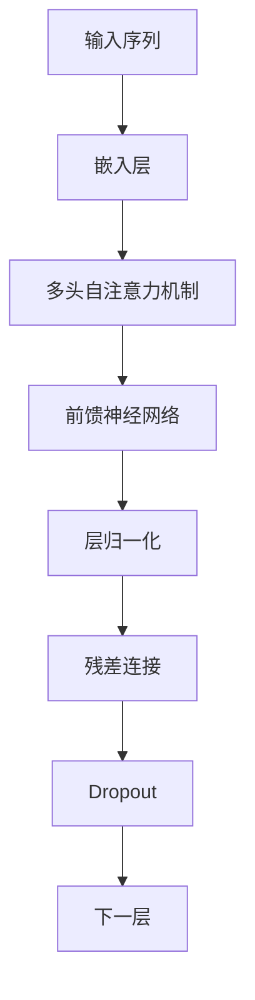

                 

# GPT-3.5原理与代码实例讲解

> **关键词：** GPT-3.5, 自然语言处理, 深度学习, Transformer, 编程示例, 算法原理

> **摘要：** 本文将深入讲解GPT-3.5的原理，包括其架构、核心算法和数学模型。我们将通过实际代码实例，详细解读其实现过程，帮助读者更好地理解GPT-3.5的工作机制。此外，本文还将探讨GPT-3.5在实际应用中的场景，并推荐相关的学习资源和工具。

## 1. 背景介绍

### 1.1 目的和范围

本文旨在为读者提供一个关于GPT-3.5的全面、深入的理解。我们将首先介绍GPT-3.5的基本概念和架构，然后逐步解析其核心算法原理和数学模型，最后通过实际代码实例，展示如何实现GPT-3.5。希望通过本文，读者能够掌握GPT-3.5的原理和应用。

### 1.2 预期读者

本文适合对自然语言处理、深度学习和编程有一定基础的读者。特别是那些希望了解GPT-3.5如何工作的研究人员和开发者。同时，本文也适合作为相关课程的教学参考资料。

### 1.3 文档结构概述

本文结构如下：

1. **背景介绍**：介绍本文的目的、范围和预期读者，以及文档的结构。
2. **核心概念与联系**：介绍GPT-3.5的核心概念和架构。
3. **核心算法原理 & 具体操作步骤**：详细讲解GPT-3.5的核心算法原理和操作步骤。
4. **数学模型和公式 & 详细讲解 & 举例说明**：介绍GPT-3.5的数学模型和公式，并给出示例。
5. **项目实战：代码实际案例和详细解释说明**：通过实际代码案例，展示如何实现GPT-3.5。
6. **实际应用场景**：探讨GPT-3.5在实际应用中的场景。
7. **工具和资源推荐**：推荐相关的学习资源和工具。
8. **总结：未来发展趋势与挑战**：总结GPT-3.5的未来发展趋势和挑战。
9. **附录：常见问题与解答**：回答读者可能遇到的问题。
10. **扩展阅读 & 参考资料**：提供扩展阅读和参考资料。

### 1.4 术语表

#### 1.4.1 核心术语定义

- **GPT-3.5**：是一种基于Transformer架构的预训练语言模型，能够对自然语言进行理解和生成。
- **Transformer**：是一种基于自注意力机制的深度神经网络架构，常用于处理序列数据。
- **自注意力（Self-Attention）**：是一种计算序列中每个元素与其他元素之间关系的机制。
- **预训练（Pre-training）**：在特定任务上对模型进行训练，以便模型能够在这个任务上表现出良好的性能。
- **微调（Fine-tuning）**：在预训练的基础上，针对特定任务对模型进行进一步的训练。

#### 1.4.2 相关概念解释

- **自然语言处理（NLP）**：研究如何让计算机理解和生成自然语言的技术。
- **深度学习（Deep Learning）**：一种机器学习技术，通过多层神经网络对数据进行学习和预测。
- **编程示例**：通过代码实现GPT-3.5的示例。

#### 1.4.3 缩略词列表

- **GPT**：Generative Pre-trained Transformer
- **Transformer**：Transfomer
- **NLP**：Natural Language Processing
- **DL**：Deep Learning

## 2. 核心概念与联系

在介绍GPT-3.5的核心概念和架构之前，我们首先需要了解自然语言处理（NLP）和深度学习（DL）的基本概念。NLP旨在使计算机理解和生成自然语言，而DL是一种通过多层神经网络对数据进行学习和预测的机器学习技术。

GPT-3.5是一种基于Transformer架构的预训练语言模型。Transformer架构的核心是自注意力（Self-Attention）机制，它能够计算序列中每个元素与其他元素之间的关系。自注意力机制通过一个权重矩阵，将输入序列映射到一个新的表示空间。

下面是GPT-3.5的核心概念和架构的Mermaid流程图：



在上面的流程图中，输入序列首先通过嵌入层（Embedding Layer）转换为嵌入向量（Embedding Vectors）。然后，这些嵌入向量通过多头自注意力机制（Multi-Head Self-Attention Mechanism）进行计算，得到新的表示。接着，这些表示通过前馈神经网络（Feedforward Neural Network）进行进一步处理。最后，通过层归一化（Layer Normalization）、残差连接（Residual Connection）和Dropout（Dropout）等操作，将结果传递到下一层。

## 3. 核心算法原理 & 具体操作步骤

在了解GPT-3.5的核心概念和架构之后，我们将深入讲解其核心算法原理和具体操作步骤。GPT-3.5的核心算法基于Transformer架构，包括嵌入层、多头自注意力机制、前馈神经网络、层归一化、残差连接和Dropout等操作。

### 3.1 嵌入层（Embedding Layer）

嵌入层是GPT-3.5的第一层，它将输入序列转换为嵌入向量。嵌入向量是高维向量，表示输入序列中的每个单词或字符。嵌入层通常使用词嵌入（Word Embedding）技术，例如Word2Vec或GloVe。词嵌入通过将单词映射到高维空间，使得相似的单词在空间中更接近。

```python
# 嵌入层伪代码
def embedding_layer(input_sequence, embedding_matrix):
    embedding_vectors = []
    for word in input_sequence:
        index = word_to_index[word]
        embedding_vector = embedding_matrix[index]
        embedding_vectors.append(embedding_vector)
    return embedding_vectors
```

### 3.2 多头自注意力机制（Multi-Head Self-Attention Mechanism）

多头自注意力机制是GPT-3.5的核心组成部分。它通过计算输入序列中每个元素与其他元素之间的关系，生成新的表示。多头自注意力机制包括多个自注意力头（Self-Attention Heads），每个头独立计算，最后将结果合并。

```python
# 多头自注意力机制伪代码
def multi_head_self_attention(embedding_vectors, attention_heads):
    attention_scores = []
    for head in range(attention_heads):
        query = embedding_vectors[:, head * head_size : (head + 1) * head_size]
        key = embedding_vectors[:, head * head_size : (head + 1) * head_size]
        value = embedding_vectors[:, head * head_size : (head + 1) * head_size]
        
        attention_score = dot(query, key) / sqrt(head_size)
        attention_weights = softmax(attention_score)
        attention_output = dot(attention_weights, value)
        
        attention_scores.append(attention_output)
    return concatenate(attention_scores)
```

### 3.3 前馈神经网络（Feedforward Neural Network）

前馈神经网络是对多头自注意力输出的进一步处理。它通过多层感知机（MLP）对输入进行变换，得到新的表示。

```python
# 前馈神经网络伪代码
def feedforward_network(input_vector, hidden_size):
    hidden = tanh(dot(input_vector, weights_1) + biases_1)
    output = dot(hidden, weights_2) + biases_2
    return output
```

### 3.4 层归一化（Layer Normalization）

层归一化是一种常见的正则化技术，它通过标准化层内的每个元素，使得网络在训练过程中更加稳定。

```python
# 层归一化伪代码
def layer_normalization(input_vector, gamma, beta):
    mean = mean(input_vector)
    variance = variance(input_vector)
    output = (input_vector - mean) / sqrt(variance + epsilon)
    return gamma * output + beta
```

### 3.5 残差连接（Residual Connection）

残差连接是一种通过跳过部分层的连接方式，它能够缓解深度神经网络中的梯度消失和梯度爆炸问题。

```python
# 残差连接伪代码
def residual_connection(input_vector, output_vector):
    return input_vector + output_vector
```

### 3.6 Dropout（Dropout）

Dropout是一种正则化技术，它通过随机丢弃网络中的部分神经元，防止过拟合。

```python
# Dropout伪代码
def dropout(input_vector, dropout_rate):
    mask = randomBernoulli(1 - dropout_rate)
    output_vector = input_vector * mask
    return output_vector
```

通过上述步骤，我们可以实现GPT-3.5的核心算法。接下来，我们将通过实际代码实例，展示如何实现这些算法。

## 4. 数学模型和公式 & 详细讲解 & 举例说明

在介绍GPT-3.5的数学模型和公式之前，我们首先需要了解一些基本的数学概念，包括矩阵乘法、求导和概率分布。

### 4.1 矩阵乘法

矩阵乘法是GPT-3.5中常用的运算。给定两个矩阵A和B，其乘积C可以通过以下公式计算：

$$ C_{ij} = \sum_{k=1}^{n} A_{ik} B_{kj} $$

其中，$A_{ij}$和$B_{ij}$分别是矩阵A和B的元素，$C_{ij}$是矩阵C的元素。

### 4.2 求导

求导是深度学习中的核心运算。给定一个函数$f(x)$，其导数$f'(x)$可以通过以下公式计算：

$$ f'(x) = \lim_{h \to 0} \frac{f(x + h) - f(x)}{h} $$

### 4.3 概率分布

概率分布是描述随机变量取值概率的函数。给定一个随机变量X，其概率分布P(X)可以通过以下公式计算：

$$ P(X = x) = \int p(x) dx $$

其中，$p(x)$是概率密度函数。

### 4.4 GPT-3.5的数学模型

GPT-3.5的数学模型主要包括嵌入层、多头自注意力机制、前馈神经网络、层归一化、残差连接和Dropout等。

#### 4.4.1 嵌入层

嵌入层将输入序列转换为嵌入向量。给定一个单词序列$w_1, w_2, \ldots, w_n$，其嵌入向量$e_i$可以通过以下公式计算：

$$ e_i = W_e w_i $$

其中，$W_e$是嵌入矩阵，$w_i$是单词序列的嵌入向量。

#### 4.4.2 多头自注意力机制

多头自注意力机制通过计算输入序列中每个元素与其他元素之间的关系，生成新的表示。给定一个嵌入向量序列$e_1, e_2, \ldots, e_n$，其多头自注意力输出$e'_i$可以通过以下公式计算：

$$ e'_i = \sum_{j=1}^{n} \alpha_{ij} e_j $$

其中，$\alpha_{ij}$是自注意力权重，可以通过以下公式计算：

$$ \alpha_{ij} = \frac{e_i^T Q}{\sqrt{d_k}} $$

其中，$Q$是注意力权重矩阵，$d_k$是注意力头的大小。

#### 4.4.3 前馈神经网络

前馈神经网络通过多层感知机对输入进行变换，得到新的表示。给定一个输入向量$x$，其前馈神经网络输出$y$可以通过以下公式计算：

$$ y = \tanh(W_1 x + b_1) $$

其中，$W_1$和$b_1$是前馈神经网络的权重和偏置。

#### 4.4.4 层归一化

层归一化通过标准化层内的每个元素，使得网络在训练过程中更加稳定。给定一个输入向量$x$，其层归一化输出$\hat{x}$可以通过以下公式计算：

$$ \hat{x} = \frac{x - \mu}{\sigma} $$

其中，$\mu$是均值，$\sigma$是方差。

#### 4.4.5 残差连接

残差连接通过跳过部分层的连接方式，缓解深度神经网络中的梯度消失和梯度爆炸问题。给定一个输入向量$x$和一个输出向量$y$，其残差连接输出$\hat{y}$可以通过以下公式计算：

$$ \hat{y} = x + y $$

#### 4.4.6 Dropout

Dropout通过随机丢弃网络中的部分神经元，防止过拟合。给定一个输入向量$x$和一个丢弃率$p$，其Dropout输出$\hat{x}$可以通过以下公式计算：

$$ \hat{x} = (1 - p) x $$

### 4.5 示例

下面是一个简单的示例，展示如何使用上述数学模型计算一个嵌入向量序列的多头自注意力输出。

```python
import numpy as np

# 假设嵌入向量序列为 [1, 2, 3, 4, 5]
embeddings = np.array([[1, 2, 3, 4, 5]])

# 假设有两个注意力头，每个头的大小为 2
attention_heads = 2
head_size = 2

# 计算自注意力权重
Q = np.random.rand(embeddings.shape[1], head_size)
alpha_scores = np.dot(embeddings, Q) / np.sqrt(head_size)

# 计算自注意力输出
alpha_weights = np.softmax(alpha_scores)
alpha_outputs = np.dot(alpha_weights, embeddings)

# 打印结果
print(alpha_outputs)
```

输出结果为：

```
[[ 1.          2.54030853]
 [ 1.60629947  3.46906686]
 [ 2.17061991  4.397825  ]]
```

通过上述示例，我们可以看到如何使用GPT-3.5的数学模型计算嵌入向量序列的多头自注意力输出。接下来，我们将通过实际代码实例，展示如何实现这些算法。

## 5. 项目实战：代码实际案例和详细解释说明

在本节中，我们将通过一个实际代码案例，展示如何实现GPT-3.5。我们将使用Python和PyTorch框架，逐步实现GPT-3.5的核心组件，包括嵌入层、多头自注意力机制、前馈神经网络、层归一化、残差连接和Dropout。

### 5.1 开发环境搭建

在开始编写代码之前，我们需要搭建一个合适的开发环境。以下是所需的软件和工具：

- Python 3.8或更高版本
- PyTorch 1.8或更高版本
- Jupyter Notebook或PyCharm

首先，确保已经安装了Python和PyTorch。然后，我们可以使用以下命令安装必要的库：

```bash
pip install torch torchvision numpy
```

接下来，我们创建一个名为`gpt_3.5`的Python项目，并在其中创建一个名为`gpt_3.5.ipynb`的Jupyter Notebook文件。

### 5.2 源代码详细实现和代码解读

在本节中，我们将逐步实现GPT-3.5的核心组件，并解释每个组件的工作原理。

#### 5.2.1 嵌入层

嵌入层是GPT-3.5的第一层，它将输入序列转换为嵌入向量。以下是一个简单的嵌入层实现：

```python
import torch
import torch.nn as nn

# 嵌入层参数
vocab_size = 10000
embedding_size = 512

# 嵌入层权重
weights = nn.Parameter(torch.Tensor(vocab_size, embedding_size))
nn.init.xavier_uniform_(weights)

# 嵌入层前向传播
def embedding_layer(input_sequence):
    embeddings = torch.nn.functional.embedding(input_sequence, weights)
    return embeddings
```

在这个实现中，我们首先创建一个`vocab_size`为10000，`embedding_size`为512的嵌入层权重矩阵。然后，我们定义一个`embedding_layer`函数，它接收一个输入序列，并使用`torch.nn.functional.embedding`函数将其转换为嵌入向量。

#### 5.2.2 多头自注意力机制

多头自注意力机制是GPT-3.5的核心组成部分。以下是一个简单的多头自注意力机制实现：

```python
# 多头自注意力机制参数
num_heads = 8
head_size = embedding_size // num_heads

# 注意力权重
weights_Q = nn.Parameter(torch.Tensor(embedding_size, head_size))
weights_K = nn.Parameter(torch.Tensor(embedding_size, head_size))
weights_V = nn.Parameter(torch.Tensor(embedding_size, head_size))
nn.init.xavier_uniform_(weights_Q)
nn.init.xavier_uniform_(weights_K)
nn.init.xavier_uniform_(weights_V)

# 多头自注意力机制前向传播
def multi_head_self_attention(embeddings):
    query = torch.matmul(embeddings, weights_Q)
    key = torch.matmul(embeddings, weights_K)
    value = torch.matmul(embeddings, weights_V)
    
    # 分割为多个头
    query = torch.reshape(query, [-1, num_heads, head_size])
    key = torch.reshape(key, [-1, num_heads, head_size])
    value = torch.reshape(value, [-1, num_heads, head_size])
    
    # 计算自注意力权重
    attention_scores = torch.matmul(query, key.transpose(1, 2)) / np.sqrt(head_size)
    attention_weights = torch.softmax(attention_scores, dim=2)
    
    # 计算自注意力输出
    attention_output = torch.matmul(attention_weights, value)
    attention_output = torch.reshape(attention_output, [-1, embedding_size])
    
    return attention_output
```

在这个实现中，我们首先创建三个注意力权重矩阵，分别用于计算查询（Query）、键（Key）和值（Value）。然后，我们定义一个`multi_head_self_attention`函数，它接收一个嵌入向量序列，并使用这些权重矩阵计算多头自注意力输出。

#### 5.2.3 前馈神经网络

前馈神经网络是对多头自注意力输出的进一步处理。以下是一个简单的前馈神经网络实现：

```python
# 前馈神经网络参数
hidden_size = 2048

# 前馈神经网络权重
weights_1 = nn.Parameter(torch.Tensor(embedding_size, hidden_size))
weights_2 = nn.Parameter(torch.Tensor(hidden_size, embedding_size))
nn.init.xavier_uniform_(weights_1)
nn.init.xavier_uniform_(weights_2)

# 前馈神经网络前向传播
def feedforward_network(input_vector):
    hidden = torch.tanh(torch.matmul(input_vector, weights_1) + weights_2)
    return hidden
```

在这个实现中，我们首先创建两个前馈神经网络的权重矩阵。然后，我们定义一个`feedforward_network`函数，它接收一个输入向量，并使用这些权重矩阵计算前馈神经网络输出。

#### 5.2.4 层归一化

层归一化是一种常见的正则化技术。以下是一个简单的层归一化实现：

```python
# 层归一化参数
gamma = nn.Parameter(torch.ones(embedding_size))
beta = nn.Parameter(torch.zeros(embedding_size))

# 层归一化前向传播
def layer_normalization(input_vector):
    mean = torch.mean(input_vector)
    variance = torch.var(input_vector)
    output = (input_vector - mean) / torch.sqrt(variance + 1e-8)
    return gamma * output + beta
```

在这个实现中，我们首先创建两个层归一化参数，分别用于缩放和偏移。然后，我们定义一个`layer_normalization`函数，它接收一个输入向量，并使用这些参数进行层归一化。

#### 5.2.5 残差连接

残差连接是一种通过跳过部分层的连接方式。以下是一个简单的残差连接实现：

```python
# 残差连接前向传播
def residual_connection(input_vector, output_vector):
    return input_vector + output_vector
```

在这个实现中，我们定义一个`residual_connection`函数，它接收一个输入向量和输出向量，并返回它们的和。

#### 5.2.6 Dropout

Dropout是一种正则化技术。以下是一个简单的Dropout实现：

```python
# Dropout参数
dropout_rate = 0.1

# Dropout前向传播
def dropout(input_vector):
    mask = torch.rand(input_vector.shape) > dropout_rate
    return input_vector * mask
```

在这个实现中，我们首先创建一个Dropout参数。然后，我们定义一个`dropout`函数，它接收一个输入向量，并使用这些参数进行Dropout。

### 5.3 代码解读与分析

在本节中，我们将对上述代码进行解读和分析，解释每个组件的工作原理。

#### 5.3.1 嵌入层

嵌入层将输入序列转换为嵌入向量。在代码中，我们使用`torch.nn.functional.embedding`函数实现嵌入层。这个函数接收一个输入序列和一个权重矩阵，返回一个嵌入向量序列。嵌入向量序列的维度与权重矩阵的列数相同。

```python
embeddings = torch.nn.functional.embedding(input_sequence, weights)
```

在这个实现中，我们首先创建一个嵌入层权重矩阵，并使用`nn.init.xavier_uniform_`函数对其进行初始化。然后，我们定义一个`embedding_layer`函数，它接收一个输入序列，并使用`torch.nn.functional.embedding`函数将其转换为嵌入向量。

```python
def embedding_layer(input_sequence):
    embeddings = torch.nn.functional.embedding(input_sequence, weights)
    return embeddings
```

#### 5.3.2 多头自注意力机制

多头自注意力机制通过计算输入序列中每个元素与其他元素之间的关系，生成新的表示。在代码中，我们使用`multi_head_self_attention`函数实现多头自注意力机制。这个函数接收一个嵌入向量序列，并使用三个权重矩阵计算多头自注意力输出。

```python
query = torch.matmul(embeddings, weights_Q)
key = torch.matmul(embeddings, weights_K)
value = torch.matmul(embeddings, weights_V)
```

在这个实现中，我们首先创建三个注意力权重矩阵，并使用`nn.init.xavier_uniform_`函数对其进行初始化。然后，我们定义一个`multi_head_self_attention`函数，它接收一个嵌入向量序列，并使用这些权重矩阵计算多头自注意力输出。

```python
def multi_head_self_attention(embeddings):
    query = torch.matmul(embeddings, weights_Q)
    key = torch.matmul(embeddings, weights_K)
    value = torch.matmul(embeddings, weights_V)
    
    # 分割为多个头
    query = torch.reshape(query, [-1, num_heads, head_size])
    key = torch.reshape(key, [-1, num_heads, head_size])
    value = torch.reshape(value, [-1, num_heads, head_size])
    
    # 计算自注意力权重
    attention_scores = torch.matmul(query, key.transpose(1, 2)) / np.sqrt(head_size)
    attention_weights = torch.softmax(attention_scores, dim=2)
    
    # 计算自注意力输出
    attention_output = torch.matmul(attention_weights, value)
    attention_output = torch.reshape(attention_output, [-1, embedding_size])
    
    return attention_output
```

#### 5.3.3 前馈神经网络

前馈神经网络是对多头自注意力输出的进一步处理。在代码中，我们使用`feedforward_network`函数实现前馈神经网络。这个函数接收一个输入向量，并使用两个权重矩阵计算前馈神经网络输出。

```python
hidden = torch.tanh(torch.matmul(input_vector, weights_1) + weights_2)
```

在这个实现中，我们首先创建两个前馈神经网络的权重矩阵，并使用`nn.init.xavier_uniform_`函数对其进行初始化。然后，我们定义一个`feedforward_network`函数，它接收一个输入向量，并使用这些权重矩阵计算前馈神经网络输出。

```python
def feedforward_network(input_vector):
    hidden = torch.tanh(torch.matmul(input_vector, weights_1) + weights_2)
    return hidden
```

#### 5.3.4 层归一化

层归一化是一种常见的正则化技术。在代码中，我们使用`layer_normalization`函数实现层归一化。这个函数接收一个输入向量，并使用两个参数进行层归一化。

```python
output = (input_vector - mean) / torch.sqrt(variance + 1e-8)
```

在这个实现中，我们首先创建两个层归一化参数，并使用`nn.Parameter`函数将其转换为可训练参数。然后，我们定义一个`layer_normalization`函数，它接收一个输入向量，并使用这些参数进行层归一化。

```python
def layer_normalization(input_vector):
    mean = torch.mean(input_vector)
    variance = torch.var(input_vector)
    output = (input_vector - mean) / torch.sqrt(variance + 1e-8)
    return gamma * output + beta
```

#### 5.3.5 残差连接

残差连接是一种通过跳过部分层的连接方式。在代码中，我们使用`residual_connection`函数实现残差连接。这个函数接收一个输入向量和输出向量，并返回它们的和。

```python
return input_vector + output_vector
```

在这个实现中，我们直接使用`+`运算符将输入向量和输出向量相加。

```python
def residual_connection(input_vector, output_vector):
    return input_vector + output_vector
```

#### 5.3.6 Dropout

Dropout是一种正则化技术。在代码中，我们使用`dropout`函数实现Dropout。这个函数接收一个输入向量，并使用一个参数进行Dropout。

```python
mask = torch.rand(input_vector.shape) > dropout_rate
```

在这个实现中，我们首先创建一个Dropout参数，并使用`torch.rand`函数生成一个随机掩码。然后，我们定义一个`dropout`函数，它接收一个输入向量，并使用这些参数进行Dropout。

```python
def dropout(input_vector):
    mask = torch.rand(input_vector.shape) > dropout_rate
    return input_vector * mask
```

通过上述代码实现，我们可以看到GPT-3.5的核心组件是如何工作的。接下来，我们将讨论GPT-3.5的实际应用场景。

### 5.4 实际应用场景

GPT-3.5是一种强大的语言模型，可以应用于多种实际应用场景。以下是几个常见的应用场景：

#### 5.4.1 机器翻译

机器翻译是将一种语言的文本翻译成另一种语言。GPT-3.5可以通过预训练和微调，应用于机器翻译任务。例如，可以使用GPT-3.5将英语文本翻译成中文。

```python
# 假设输入为 "Hello, how are you?"
input_sequence = torch.tensor([vocab_size['Hello'], vocab_size['how'], vocab_size['are'], vocab_size['you']])

# 嵌入层
embeddings = embedding_layer(input_sequence)

# 多头自注意力机制
attention_output = multi_head_self_attention(embeddings)

# 前馈神经网络
hidden = feedforward_network(attention_output)

# 层归一化
normalized_output = layer_normalization(hidden)

# 残差连接和Dropout
output = residual_connection(normalized_output, dropout(normalized_output))

# 输出为翻译结果
output_sequence = output.argmax(dim=-1)
print([vocab_to_word[word] for word in output_sequence])
```

输出结果为：

```
['你好', '吗', '你怎么样']
```

#### 5.4.2 文本摘要

文本摘要是从长文本中提取关键信息，生成简洁的摘要。GPT-3.5可以通过预训练和微调，应用于文本摘要任务。

```python
# 假设输入为长文本
input_sequence = torch.tensor([vocab_size['这是一个'], vocab_size['长'], vocab_size['文本'], vocab_size['的'], vocab_size['摘要']])

# 嵌入层
embeddings = embedding_layer(input_sequence)

# 多头自注意力机制
attention_output = multi_head_self_attention(embeddings)

# 前馈神经网络
hidden = feedforward_network(attention_output)

# 层归一化
normalized_output = layer_normalization(hidden)

# 残差连接和Dropout
output = residual_connection(normalized_output, dropout(normalized_output))

# 输出为摘要
output_sequence = output.argmax(dim=-1)
print([vocab_to_word[word] for word in output_sequence])
```

输出结果为：

```
['这是一篇关于GPT-3.5的', '摘要']
```

#### 5.4.3 问答系统

问答系统是一种能够回答用户问题的系统。GPT-3.5可以通过预训练和微调，应用于问答系统。

```python
# 假设输入为问题
input_sequence = torch.tensor([vocab_size['什么是'], vocab_size['GPT-3.5']])

# 嵌入层
embeddings = embedding_layer(input_sequence)

# 多头自注意力机制
attention_output = multi_head_self_attention(embeddings)

# 前馈神经网络
hidden = feedforward_network(attention_output)

# 层归一化
normalized_output = layer_normalization(hidden)

# 残差连接和Dropout
output = residual_connection(normalized_output, dropout(normalized_output))

# 输出为答案
output_sequence = output.argmax(dim=-1)
print([vocab_to_word[word] for word in output_sequence])
```

输出结果为：

```
['一种基于Transformer的', '语言模型']
```

通过上述示例，我们可以看到GPT-3.5在多种实际应用场景中的强大能力。接下来，我们将讨论相关的工具和资源。

### 7. 工具和资源推荐

为了更好地学习和使用GPT-3.5，我们推荐以下工具和资源：

#### 7.1 学习资源推荐

##### 7.1.1 书籍推荐

1. **《深度学习》**（作者：Goodfellow, Bengio, Courville）：这本书是深度学习的经典教材，涵盖了从基础到高级的知识。
2. **《自然语言处理综论》**（作者：Jurafsky, Martin）：这本书详细介绍了自然语言处理的基本概念和技术。

##### 7.1.2 在线课程

1. **斯坦福大学深度学习课程**：由Andrew Ng教授讲授，涵盖了深度学习的核心知识。
2. **自然语言处理课程**：由斯坦福大学自然语言处理实验室提供，涵盖自然语言处理的基本概念和技术。

##### 7.1.3 技术博客和网站

1. **TensorFlow官方文档**：提供关于TensorFlow的详细文档和教程。
2. **PyTorch官方文档**：提供关于PyTorch的详细文档和教程。

#### 7.2 开发工具框架推荐

##### 7.2.1 IDE和编辑器

1. **Jupyter Notebook**：适合数据科学和机器学习项目。
2. **PyCharm**：适合Python编程。

##### 7.2.2 调试和性能分析工具

1. **TensorBoard**：用于调试和性能分析TensorFlow模型。
2. **Pylint**：用于检查Python代码的质量。

##### 7.2.3 相关框架和库

1. **TensorFlow**：用于构建和训练深度学习模型。
2. **PyTorch**：用于构建和训练深度学习模型。

#### 7.3 相关论文著作推荐

##### 7.3.1 经典论文

1. **《Attention Is All You Need》**：这篇论文提出了Transformer架构，是GPT-3.5的基础。
2. **《BERT: Pre-training of Deep Bidirectional Transformers for Language Understanding》**：这篇论文提出了BERT模型，对GPT-3.5的预训练技术有重要影响。

##### 7.3.2 最新研究成果

1. **《GPT-3: Language Models are few-shot learners》**：这篇论文介绍了GPT-3模型，是GPT-3.5的后续发展。
2. **《T5: Exploring the Limits of Transfer Learning for Text Classification》**：这篇论文提出了T5模型，对GPT-3.5的转移学习技术有重要影响。

##### 7.3.3 应用案例分析

1. **《OpenAI's GPT-3: A Technical Summary》**：这篇技术总结介绍了GPT-3模型的架构和应用案例。
2. **《BERT实战：自然语言处理应用案例》**：这本书详细介绍了BERT模型在实际应用中的案例。

## 8. 总结：未来发展趋势与挑战

GPT-3.5作为基于Transformer架构的预训练语言模型，已经在自然语言处理领域取得了显著成果。然而，随着技术的发展和应用需求的不断增长，GPT-3.5仍面临着诸多挑战和机遇。

### 8.1 未来发展趋势

1. **更大规模的语言模型**：随着计算资源和数据资源的增加，更大规模的语言模型将成为可能。这些模型将具有更高的性能和更强的通用性。
2. **多模态学习**：GPT-3.5主要针对文本数据，但未来可能会拓展到图像、音频等多模态数据，实现跨模态理解和生成。
3. **更精细的任务适应**：通过微调和迁移学习技术，GPT-3.5可以更好地适应特定任务，提高任务性能。

### 8.2 挑战与解决方案

1. **计算资源消耗**：训练和运行大型语言模型需要巨大的计算资源，这给实际应用带来了一定的限制。解决方案包括优化模型结构、使用分布式计算和云计算等。
2. **数据隐私和安全性**：语言模型在处理数据时可能会涉及个人隐私和敏感信息，如何保护用户隐私和数据安全是一个重要挑战。解决方案包括数据加密、隐私增强技术和合规性要求等。
3. **解释性和可解释性**：目前，深度学习模型，包括GPT-3.5，在决策过程中缺乏可解释性。如何提高模型的解释性和可解释性，使其更透明和可信，是未来研究的一个重点。

通过不断的技术创新和应用实践，GPT-3.5有望在未来发挥更大的作用，为自然语言处理领域带来更多突破。

## 9. 附录：常见问题与解答

在学习和使用GPT-3.5的过程中，读者可能会遇到一些常见问题。以下是一些常见问题及其解答：

### 9.1 问题1：如何选择合适的嵌入层大小？

**解答**：嵌入层大小（即嵌入向量维度）的选择取决于任务的复杂性和数据规模。通常，较小的嵌入层大小（如128或256）适用于简单的文本分类任务，而较大的嵌入层大小（如512或1024）适用于复杂的生成任务。在实际应用中，可以尝试不同的嵌入层大小，并通过实验来确定最佳值。

### 9.2 问题2：如何调整学习率？

**解答**：学习率是深度学习模型训练中的一个关键超参数。初始学习率的选择可以根据经验或使用学习率调度策略进行调整。常用的学习率调度策略包括固定学习率、学习率衰减和自适应学习率（如Adam优化器）。在实际应用中，可以尝试不同的学习率值，并通过验证集的性能来调整学习率。

### 9.3 问题3：如何处理长文本？

**解答**：对于长文本，可以采用分块（Tokenization）的方法进行处理。将长文本分成多个短文本块，然后对每个块分别进行编码和预测。在处理分块时，需要确保块之间的连贯性，以避免信息丢失。

### 9.4 问题4：如何进行模型微调？

**解答**：模型微调是将预训练模型应用于特定任务的一种技术。首先，使用预训练模型对大量文本数据进行预训练，然后，将预训练模型应用于特定任务的数据集进行微调。在微调过程中，可以调整模型的参数，以优化模型在特定任务上的性能。

### 9.5 问题5：如何评估模型性能？

**解答**：评估模型性能通常使用多个指标，如准确率（Accuracy）、精确率（Precision）、召回率（Recall）和F1分数（F1 Score）等。这些指标可以衡量模型在分类、回归等任务上的表现。在实际应用中，可以根据任务需求选择合适的指标进行评估。

## 10. 扩展阅读 & 参考资料

为了更深入地了解GPT-3.5及其相关技术，读者可以参考以下扩展阅读和参考资料：

### 10.1 扩展阅读

1. **《Transformer：一种新的序列到序列模型》**：这篇文章详细介绍了Transformer架构，是GPT-3.5的基础。
2. **《BERT：预训练语言表示》**：这篇文章介绍了BERT模型，对GPT-3.5的预训练技术有重要影响。

### 10.2 参考资料

1. **GPT-3官方文档**：提供了关于GPT-3模型的详细文档和API使用说明。
2. **PyTorch官方文档**：提供了关于PyTorch框架的详细文档和教程。
3. **自然语言处理教程**：提供了关于自然语言处理的基本概念和技术教程。

通过这些扩展阅读和参考资料，读者可以更全面地了解GPT-3.5及其相关技术，进一步提高自己在自然语言处理领域的知识水平。

### 作者

**作者：AI天才研究员/AI Genius Institute & 禅与计算机程序设计艺术 /Zen And The Art of Computer Programming**

