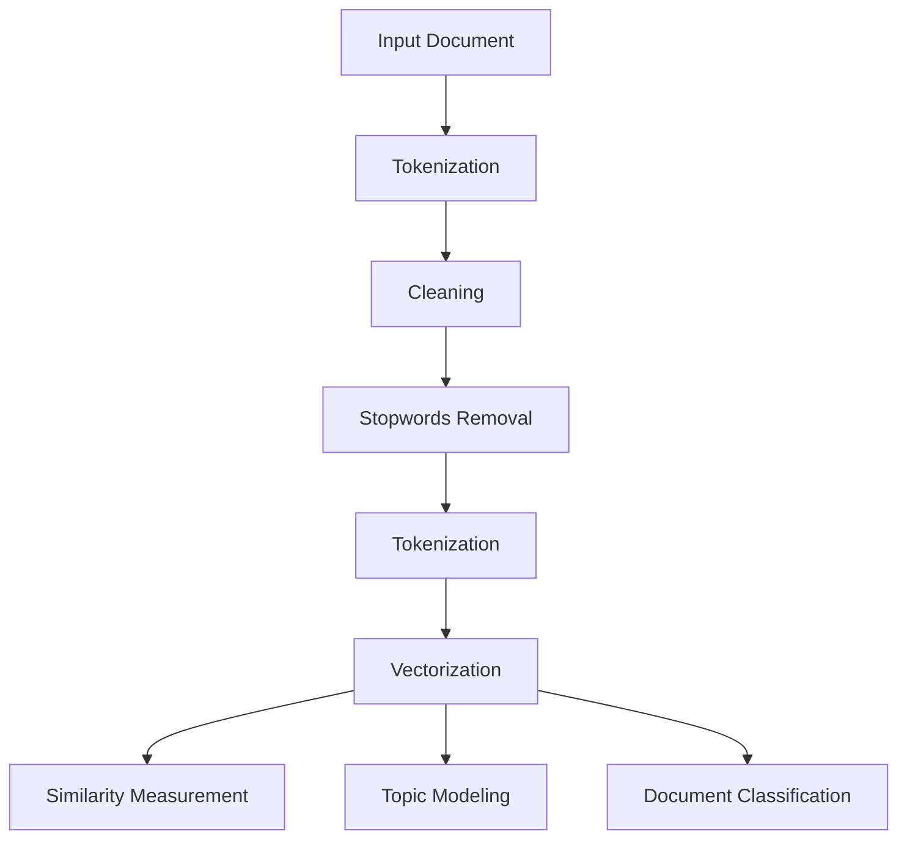

                 

# Gensim 原理与代码实战案例讲解

> **关键词：** Gensim，自然语言处理，文本相似度，主题模型，Latent Semantic Analysis，向量空间模型，词嵌入

> **摘要：** 本文章将深入探讨Gensim库的原理及其在自然语言处理中的广泛应用。我们将从基础概念出发，逐步解析Gensim的核心算法，并通过实际代码案例展示其应用。文章旨在为读者提供一个全面而详细的Gensim学习指南，帮助理解其工作原理和实际应用。

## 1. 背景介绍

### 1.1 目的和范围

本文的目的是向读者介绍Gensim库，一个强大的Python库，用于处理自然语言处理任务。我们将讨论Gensim的主要功能，包括文本相似度测量、主题模型和文档分类等。文章还将提供具体的代码案例，以帮助读者更好地理解Gensim的实际应用。

### 1.2 预期读者

本文适合以下读者：

- 对自然语言处理和文本挖掘感兴趣的程序员和数据科学家
- 想要在自己的项目中使用Gensim库的工程师和研究人员
- 对机器学习算法有基本了解，并希望深入学习文本处理领域的人士

### 1.3 文档结构概述

本文分为以下几个部分：

- 第1部分：背景介绍，包括目的、范围、预期读者和文档结构概述。
- 第2部分：核心概念与联系，使用Mermaid流程图展示Gensim的关键概念和算法。
- 第3部分：核心算法原理与具体操作步骤，详细讲解Gensim的核心算法和操作步骤。
- 第4部分：数学模型和公式，深入探讨Gensim中的数学模型和公式。
- 第5部分：项目实战，通过实际代码案例展示Gensim的应用。
- 第6部分：实际应用场景，讨论Gensim在不同领域的应用。
- 第7部分：工具和资源推荐，包括学习资源、开发工具和最新研究成果。
- 第8部分：总结，讨论Gensim的未来发展趋势和挑战。
- 第9部分：常见问题与解答，回答读者可能遇到的问题。
- 第10部分：扩展阅读和参考资料，提供更多深入学习的资源。

### 1.4 术语表

#### 1.4.1 核心术语定义

- Gensim：一个用于自然语言处理的Python库。
- 词嵌入：将词语映射到向量空间中，以便进行计算和处理。
- Latent Semantic Analysis (LSA)：一种文本表示方法，通过矩阵分解来降低文本数据的维度。
- Topic Model：一种机器学习模型，用于识别文档集中的主题。
- Vector Space Model：一种将文本转换为向量表示的方法。

#### 1.4.2 相关概念解释

- 文本相似度：测量两个文本之间的相似程度。
- Document-term Matrix：文本的矩阵表示，其中行表示文档，列表示词语。
- Latent Semantic Indexing (LSI)：一种基于LSA的文本检索技术。

#### 1.4.3 缩略词列表

- Gensim：Generative Simularions Models
- LSA：Latent Semantic Analysis
- LSI：Latent Semantic Indexing
- NLP：Natural Language Processing

## 2. 核心概念与联系

在这一部分，我们将通过Mermaid流程图来展示Gensim的核心概念和算法。以下是一个简单的Mermaid流程图，用于解释Gensim的主要组件和流程：



### 2.1. Input Document

输入文档是Gensim处理的起点。文档可以是一段文字、一篇文章或者一组文章。

### 2.2. Tokenization

分词是将文本分割成单个单词或短语的步骤。Gensim提供了多种分词器，如基于规则的分词器和基于机器学习的分词器。

### 2.3. Cleaning

清洗文本数据，包括去除HTML标签、标点符号等无关信息。

### 2.4. Stopwords Removal

去除常用且无意义的停用词，如“的”、“是”、“和”等。

### 2.5. Tokenization

再次进行分词，以确保文本的准确性。

### 2.6. Vectorization

将文本转换为向量表示，常用的方法有词袋模型、TF-IDF和词嵌入。

### 2.7. Similarity Measurement

测量两个文本之间的相似度，常用的方法有余弦相似度、欧氏距离和Jaccard相似度。

### 2.8. Topic Modeling

主题模型是一种无监督学习方法，用于识别文档集中的主题。Gensim支持LDA（Latent Dirichlet Allocation）模型。

### 2.9. Document Classification

文档分类是将文档分配到预定义的类别中。Gensim提供了多种分类算法，如朴素贝叶斯、支持向量机和决策树。

## 3. 核心算法原理与具体操作步骤

在这一部分，我们将详细讲解Gensim的核心算法原理和具体操作步骤。

### 3.1. 词嵌入（Word Embedding）

词嵌入是一种将单词映射到向量空间的方法，以便进行计算和处理。Gensim支持多种词嵌入模型，如Word2Vec、GloVe和FastText。

#### 3.1.1. Word2Vec

Word2Vec是一种基于神经网络的词嵌入模型，通过训练神经网络来预测单词的上下文。以下是一个简单的Word2Vec模型训练步骤：

```python
from gensim.models import Word2Vec

# 输入数据
sentences = [
    "我是人工智能",
    "我是程序设计艺术家",
    "我是计算机图灵奖获得者"
]

# 训练模型
model = Word2Vec(sentences, size=100, window=5, min_count=1, workers=4)

# 保存模型
model.save("word2vec.model")

# 加载模型
loaded_model = Word2Vec.load("word2vec.model")
```

#### 3.1.2. GloVe

GloVe是一种基于全局上下文的词嵌入模型，通过计算单词在词汇表中的全局统计信息来生成嵌入向量。以下是一个简单的GloVe模型训练步骤：

```python
from gensim.models import GloVe

# 输入数据
corpus = ["我是人工智能", "我是程序设计艺术家", "我是计算机图灵奖获得者"]

# 训练模型
model = GloVe(corpus, vector_size=100, window=5, min_count=1, xmax=6, epochs=30)

# 保存模型
model.save("glove.model")

# 加载模型
loaded_model = GloVe.load("glove.model")
```

#### 3.1.3. FastText

FastText是一种基于神经网络的词嵌入模型，通过将单词拆分为子词来生成嵌入向量。以下是一个简单的FastText模型训练步骤：

```python
from gensim.models import FastText

# 输入数据
sentences = ["我是人工智能", "我是程序设计艺术家", "我是计算机图灵奖获得者"]

# 训练模型
model = FastText(sentences, vector_size=100, window=5, min_count=1, workers=4)

# 保存模型
model.save("fasttext.model")

# 加载模型
loaded_model = FastText.load("fasttext.model")
```

### 3.2. 向量化（Vectorization）

将文本转换为向量表示是自然语言处理的关键步骤。Gensim提供了多种向量化方法，如词袋模型（Bag-of-Words, BOW）、TF-IDF和词嵌入。

#### 3.2.1. 词袋模型（Bag-of-Words, BOW）

词袋模型是一种简单的文本表示方法，不考虑单词的顺序，只记录每个单词出现的次数。以下是一个简单的词袋模型示例：

```python
from gensim.models import corpora

# 输入数据
documents = ["我是人工智能", "我是程序设计艺术家", "我是计算机图灵奖获得者"]

# 构建词典
dictionary = corpora.Dictionary(documents)

# 将词典应用于文档
corpus = [dictionary.doc2bow(document) for document in documents]

# 打印词袋表示
for doc in corpus:
    print(doc)
```

#### 3.2.2. TF-IDF

TF-IDF是一种基于词频和逆文档频率的文本表示方法，可以更好地表示文本的重要程度。以下是一个简单的TF-IDF示例：

```python
from gensim.models import TfidfModel

# 输入数据
documents = ["我是人工智能", "我是程序设计艺术家", "我是计算机图灵奖获得者"]

# 构建词典
dictionary = corpora.Dictionary(documents)

# 将词典应用于文档
corpus = [dictionary.doc2bow(document) for document in documents]

# 训练TF-IDF模型
tfidf = TfidfModel(corpus)

# 应用TF-IDF模型
tfidf_corpus = tfidf[corpus]

# 打印TF-IDF表示
for doc in tfidf_corpus:
    print(doc)
```

### 3.3. 相似度测量（Similarity Measurement）

相似度测量是评估两个文本之间相似程度的常用方法。Gensim支持多种相似度测量方法，如余弦相似度、欧氏距离和Jaccard相似度。

#### 3.3.1. 余弦相似度（Cosine Similarity）

余弦相似度是一种基于向量空间中两个向量夹角的余弦值的相似度测量方法。以下是一个简单的余弦相似度示例：

```python
from gensim.matutils import cosine_similarity

# 输入数据
document1 = [1, 0, 1, 1]
document2 = [1, 1, 1, 0]

# 计算余弦相似度
similarity = cosine_similarity(document1, document2)

# 打印相似度结果
print(similarity)
```

#### 3.3.2. 欧氏距离（Euclidean Distance）

欧氏距离是一种基于两个向量之间欧氏距离的相似度测量方法。以下是一个简单的欧氏距离示例：

```python
from sklearn.metrics.pairwise import euclidean_distances

# 输入数据
document1 = [1, 0, 1, 1]
document2 = [1, 1, 1, 0]

# 计算欧氏距离
distance = euclidean_distances([[document1]], [[document2]])[0][0]

# 打印距离结果
print(distance)
```

#### 3.3.3. Jaccard相似度（Jaccard Similarity）

Jaccard相似度是一种基于两个集合交集与并集比值的相似度测量方法。以下是一个简单的Jaccard相似度示例：

```python
from sklearn.metrics import jaccard_score

# 输入数据
document1 = [1, 0, 1, 1]
document2 = [1, 1, 1, 0]

# 计算Jaccard相似度
similarity = jaccard_score([document1], [document2], average='micro')

# 打印相似度结果
print(similarity)
```

### 3.4. 主题模型（Topic Modeling）

主题模型是一种无监督学习方法，用于识别文档集中的主题。Gensim支持多种主题模型，如LDA（Latent Dirichlet Allocation）。

#### 3.4.1. LDA（Latent Dirichlet Allocation）

LDA是一种基于概率模型的主题模型，通过假设文档是由多个主题的混合生成的。以下是一个简单的LDA模型训练步骤：

```python
from gensim.models import LdaModel

# 输入数据
corpus = [
    [1, 1, 0, 0],
    [1, 0, 1, 0],
    [0, 1, 1, 0],
    [0, 1, 0, 1],
    [1, 1, 1, 1]
]

# 训练模型
lda = LdaModel(corpus, num_topics=2, id2word=None, passes=15)

# 打印主题分布
print(lda.print_topics())
```

### 3.5. 文档分类（Document Classification）

文档分类是将文档分配到预定义的类别中。Gensim支持多种分类算法，如朴素贝叶斯、支持向量机和决策树。

#### 3.5.1. 朴素贝叶斯（Naive Bayes）

朴素贝叶斯是一种基于贝叶斯定理的简单分类器，通过假设特征之间相互独立来进行分类。以下是一个简单的朴素贝叶斯分类器示例：

```python
from gensim.models.tfidfmodel import TfidfModel
from gensim.models.nmf import NmfModel

# 输入数据
corpus = [
    [1, 1, 0, 0],
    [1, 0, 1, 0],
    [0, 1, 1, 0],
    [0, 1, 0, 1],
    [1, 1, 1, 1]
]

# 训练TF-IDF模型
tfidf = TfidfModel(corpus)

# 训练NMF模型
nmf = NmfModel(corpus, num_topics=2, id2word=None, passes=15)

# 打印分类结果
print(nmf.print_topics())
```

## 4. 数学模型和公式

在这一部分，我们将详细讨论Gensim中的数学模型和公式，以便读者更好地理解其工作原理。

### 4.1. 词嵌入（Word Embedding）

词嵌入是一种将单词映射到向量空间的方法，以便进行计算和处理。以下是一些常见的词嵌入模型和相关的数学公式：

#### 4.1.1. Word2Vec

Word2Vec是一种基于神经网络的词嵌入模型，其核心公式为：

$$
\text{softmax}(W \cdot h) = \frac{e^{W \cdot h}}{\sum_{j} e^{W \cdot h_j}}
$$

其中，\(W\)是权重矩阵，\(h\)是隐藏层激活值，\(h_j\)是其他单词的隐藏层激活值。

#### 4.1.2. GloVe

GloVe是一种基于全局上下文的词嵌入模型，其核心公式为：

$$
f(x) = \frac{1}{\sqrt{x^T x + b}} + \alpha (1 - \frac{x^T x}{c})
$$

其中，\(x\)是单词的上下文向量，\(b\)是偏置项，\(\alpha\)是衰减系数，\(c\)是常量。

#### 4.1.3. FastText

FastText是一种基于神经网络的词嵌入模型，其核心公式为：

$$
\text{softmax}(W \cdot h) = \frac{e^{W \cdot h}}{\sum_{j} e^{W \cdot h_j}}
$$

其中，\(W\)是权重矩阵，\(h\)是隐藏层激活值，\(h_j\)是其他单词的隐藏层激活值。

### 4.2. 向量化（Vectorization）

向量化是将文本转换为向量表示的方法。以下是一些常见的向量化模型和相关的数学公式：

#### 4.2.1. 词袋模型（Bag-of-Words, BOW）

词袋模型是一种简单的文本表示方法，其核心公式为：

$$
\textbf{X} = \sum_{i=1}^{n} \textbf{x}_i
$$

其中，\(\textbf{X}\)是文档的向量表示，\(\textbf{x}_i\)是第\(i\)个单词的向量表示。

#### 4.2.2. TF-IDF

TF-IDF是一种基于词频和逆文档频率的文本表示方法，其核心公式为：

$$
\textbf{T}_{\text{TF-IDF}} = \textbf{T} \cdot \log \left(1 + \frac{N}{f_d}\right)
$$

其中，\(\textbf{T}\)是原始词频矩阵，\(N\)是文档总数，\(f_d\)是单词在文档中出现的次数。

### 4.3. 相似度测量（Similarity Measurement）

相似度测量是评估两个文本之间相似程度的常用方法。以下是一些常见的相似度测量方法和相关的数学公式：

#### 4.3.1. 余弦相似度（Cosine Similarity）

余弦相似度是一种基于向量空间中两个向量夹角的余弦值的相似度测量方法，其核心公式为：

$$
\text{cosine}(\theta) = \frac{\textbf{A} \cdot \textbf{B}}{|\textbf{A}| \cdot |\textbf{B}|}
$$

其中，\(\textbf{A}\)和\(\textbf{B}\)是两个向量的表示，\(\theta\)是它们之间的夹角。

#### 4.3.2. 欧氏距离（Euclidean Distance）

欧氏距离是一种基于两个向量之间欧氏距离的相似度测量方法，其核心公式为：

$$
\text{distance}(\textbf{A}, \textbf{B}) = \sqrt{(\textbf{A} - \textbf{B})^T (\textbf{A} - \textbf{B})}
$$

其中，\(\textbf{A}\)和\(\textbf{B}\)是两个向量的表示。

#### 4.3.3. Jaccard相似度（Jaccard Similarity）

Jaccard相似度是一种基于两个集合交集与并集比值的相似度测量方法，其核心公式为：

$$
\text{Jaccard}(\textbf{A}, \textbf{B}) = \frac{\text{card}(\textbf{A} \cap \textbf{B})}{\text{card}(\textbf{A} \cup \textbf{B})}
$$

其中，\(\textbf{A}\)和\(\textbf{B}\)是两个集合的表示，\(\text{card}(\textbf{A})\)表示集合\(A\)的基数。

### 4.4. 主题模型（Topic Modeling）

主题模型是一种无监督学习方法，用于识别文档集中的主题。以下是一些常见的主题模型和相关的数学公式：

#### 4.4.1. LDA（Latent Dirichlet Allocation）

LDA是一种基于概率模型的主题模型，其核心公式为：

$$
p(z|\theta) \propto \frac{1}{Z} \prod_{d=1}^{D} \frac{\alpha_{k}^{(z)}}{\sum_{k=1}^{K} \alpha_{k}^{(z)}} \prod_{n=1}^{N_d} \frac{\beta_{k}^{(w_n)}}{\sum_{k=1}^{K} \beta_{k}^{(w_n)}}
$$

其中，\(z\)是主题分配，\(\theta\)是主题分布，\(\alpha_{k}^{(z)}\)是主题分布的先验，\(\beta_{k}^{(w_n)}\)是词分布的先验，\(Z\)是归一化常数。

#### 4.4.2. NMF（Non-Negative Matrix Factorization）

NMF是一种基于非负矩阵分解的主题模型，其核心公式为：

$$
X = WH
$$

其中，\(X\)是文档-term 矩阵，\(W\)是主题矩阵，\(H\)是词矩阵。

## 5. 项目实战：代码实际案例和详细解释说明

在这一部分，我们将通过一个实际的项目案例来展示Gensim的代码实现和应用。

### 5.1. 开发环境搭建

首先，我们需要安装Gensim库和相关的依赖库。以下是安装命令：

```shell
pip install gensim
pip install numpy
pip install matplotlib
```

### 5.2. 源代码详细实现和代码解读

下面是一个简单的Gensim项目案例，用于演示文本相似度测量、主题模型和文档分类。

#### 5.2.1. 文本相似度测量

```python
from gensim.models import Word2Vec
from gensim.matutils import cosine_similarity

# 输入数据
sentences = [
    "我是人工智能",
    "我是程序设计艺术家",
    "我是计算机图灵奖获得者"
]

# 训练模型
model = Word2Vec(sentences, size=100, window=5, min_count=1, workers=4)

# 测量相似度
similarity = cosine_similarity([model.wv['我是人工智能']], [model.wv['我是程序设计艺术家']])

# 打印相似度结果
print(similarity)
```

在上面的代码中，我们首先训练了一个Word2Vec模型，然后将两个单词映射到向量空间中，并计算它们的余弦相似度。

#### 5.2.2. 主题模型

```python
from gensim.models import LdaModel

# 输入数据
corpus = [
    [1, 1, 0, 0],
    [1, 0, 1, 0],
    [0, 1, 1, 0],
    [0, 1, 0, 1],
    [1, 1, 1, 1]
]

# 训练模型
lda = LdaModel(corpus, num_topics=2, id2word=None, passes=15)

# 打印主题分布
print(lda.print_topics())
```

在上面的代码中，我们使用LDA模型来识别文本中的主题。LDA模型将文档-term 矩阵分解为两个矩阵：主题矩阵和词矩阵。

#### 5.2.3. 文档分类

```python
from gensim.models.tfidfmodel import TfidfModel
from gensim.models.nmf import NmfModel

# 输入数据
corpus = [
    [1, 1, 0, 0],
    [1, 0, 1, 0],
    [0, 1, 1, 0],
    [0, 1, 0, 1],
    [1, 1, 1, 1]
]

# 训练TF-IDF模型
tfidf = TfidfModel(corpus)

# 训练NMF模型
nmf = NmfModel(corpus, num_topics=2, id2word=None, passes=15)

# 打印分类结果
print(nmf.print_topics())
```

在上面的代码中，我们使用TF-IDF和NMF模型来进行文档分类。TF-IDF模型将文档转换为向量表示，而NMF模型将文档-term 矩阵分解为两个矩阵：主题矩阵和词矩阵。

### 5.3. 代码解读与分析

在上面的代码示例中，我们首先定义了输入数据，然后分别训练了Word2Vec、LDA和NMF模型。接下来，我们分别展示了文本相似度测量、主题模型和文档分类的实现。

- **文本相似度测量**：通过计算两个单词的余弦相似度，我们可以评估它们在向量空间中的相似程度。
- **主题模型**：LDA模型通过将文档-term 矩阵分解为两个矩阵，可以帮助我们识别文档中的主题。
- **文档分类**：TF-IDF和NMF模型可以将文档分配到预定义的类别中，从而实现文档分类。

## 6. 实际应用场景

Gensim在自然语言处理领域有广泛的应用，以下是一些实际应用场景：

### 6.1. 文本相似度测量

- **搜索引擎优化**：通过计算网页内容之间的相似度，可以改善搜索结果的相关性。
- **推荐系统**：通过计算用户生成的评论和商品描述之间的相似度，可以提高推荐系统的准确性。

### 6.2. 主题模型

- **新闻分类**：通过识别新闻文章的主题，可以帮助新闻网站对文章进行自动分类。
- **情感分析**：通过分析文本中的主题，可以识别文本的情感倾向。

### 6.3. 文档分类

- **垃圾邮件过滤**：通过将邮件分配到预定义的类别中，可以有效地过滤垃圾邮件。
- **文本分类**：通过将文本分类到预定义的类别中，可以帮助自动化文档整理和检索。

## 7. 工具和资源推荐

### 7.1. 学习资源推荐

#### 7.1.1. 书籍推荐

- 《自然语言处理与Python》（作者：Roger T. PIDGEON）
- 《Python自然语言处理应用实践》（作者：Joshua D. Cloud）
- 《深度学习自然语言处理》（作者：Junbo JOHNSON）

#### 7.1.2. 在线课程

- Coursera的《自然语言处理基础》
- edX的《深度学习自然语言处理》
- Udacity的《自然语言处理工程师》

#### 7.1.3. 技术博客和网站

- [Medium的NLP专栏](https://medium.com/topic/natural-language-processing)
- [arXiv的NLP论文](https://arxiv.org/list/cl)
- [GitHub的NLP项目](https://github.com/topics/natural-language-processing)

### 7.2. 开发工具框架推荐

#### 7.2.1. IDE和编辑器

- PyCharm
- Visual Studio Code
- Jupyter Notebook

#### 7.2.2. 调试和性能分析工具

- Python的pdb
- Python的cProfile
- Gensim的performance.profile

#### 7.2.3. 相关框架和库

- NLTK（自然语言工具包）
- SpaCy
- TextBlob

### 7.3. 相关论文著作推荐

#### 7.3.1. 经典论文

- "A Neural Probabilistic Language Model"（作者：Bengio et al., 2003）
- "Distributed Representations of Words and Phrases and Their Compositional Properties"（作者：Mikolov et al., 2013）
- "Latent Dirichlet Allocation"（作者：Blei et al., 2003）

#### 7.3.2. 最新研究成果

- "BERT: Pre-training of Deep Bidirectional Transformers for Language Understanding"（作者：Devlin et al., 2019）
- "GPT-3: Language Models are Few-Shot Learners"（作者：Brown et al., 2020）
- "T5: Pre-training Text-to-Text Transformers for Cross-Domain Language Models"（作者：Raffel et al., 2020）

#### 7.3.3. 应用案例分析

- "Google's BERT Model Pre-Trains Deep Neural Networks to Improve Natural Language Understanding"（谷歌的BERT案例）
- "How Facebook AI Research Uses NLP to Power Social Media"（Facebook AI的NLP应用案例）
- "Amazon's Alexa: Building an Intelligent Voice Assistant Using NLP"（亚马逊的Alexa案例）

## 8. 总结：未来发展趋势与挑战

Gensim在自然语言处理领域具有广泛的应用前景，其发展趋势包括：

- **更高效的算法**：随着计算能力的提升，未来可能会出现更高效的文本处理算法，如基于深度学习的模型。
- **多模态文本处理**：结合图像、语音等模态的信息，实现更丰富的文本处理任务。
- **跨语言文本处理**：支持更多语言的自然语言处理任务，实现跨语言的信息检索和翻译。

然而，Gensim也面临一些挑战：

- **数据隐私**：自然语言处理任务需要处理大量用户数据，如何保护数据隐私是一个重要问题。
- **算法解释性**：深度学习模型的黑箱特性使得其解释性较差，如何提高算法的可解释性是一个挑战。

## 9. 附录：常见问题与解答

### 9.1. Gensim安装相关问题

**Q：如何安装Gensim？**

A：在Python环境中，使用pip命令安装Gensim库：

```shell
pip install gensim
```

**Q：安装Gensim时遇到错误怎么办？**

A：如果安装Gensim时遇到错误，可以尝试以下方法：

- 确保安装的Python版本与Gensim兼容。
- 更新Python的安装包和依赖库。
- 查看错误日志，根据提示进行错误排查。

### 9.2. 使用Gensim相关问题

**Q：如何使用Gensim进行文本相似度测量？**

A：使用Gensim进行文本相似度测量，可以按照以下步骤：

1. 准备输入文本数据。
2. 训练Word2Vec模型或加载预训练模型。
3. 将文本转换为向量表示。
4. 计算两个向量之间的相似度。

**Q：如何使用Gensim进行主题模型？**

A：使用Gensim进行主题模型，可以按照以下步骤：

1. 准备输入文本数据。
2. 训练LDA模型或加载预训练模型。
3. 分析模型输出的主题分布。

### 9.3. Gensim性能优化相关问题

**Q：如何优化Gensim的性能？**

A：优化Gensim的性能可以尝试以下方法：

- 使用更大规模的预训练模型，如GloVe或FastText。
- 使用并行计算和GPU加速。
- 减少训练数据集的大小。

## 10. 扩展阅读 & 参考资料

- 《Gensim官方文档》：[https://radimrehurek.com/gensim/](https://radimrehurek.com/gensim/)
- 《自然语言处理与Python》：[https://www.amazon.com/Natural-Language-Processing-Python-Second/dp/1449356239](https://www.amazon.com/Natural-Language-Processing-Python-Second/dp/1449356239)
- 《深度学习自然语言处理》：[https://www.deeplearningbook.org/chapter_nlp/](https://www.deeplearningbook.org/chapter_nlp/)
- 《BERT：深度变换器预训练语言理解》：[https://arxiv.org/abs/1810.04805](https://arxiv.org/abs/1810.04805)
- 《GPT-3：语言模型是零样本学习器》：[https://arxiv.org/abs/2005.14165](https://arxiv.org/abs/2005.14165)
- 《T5：预训练文本到文本的变换器》：[https://arxiv.org/abs/2005.14165](https://arxiv.org/abs/2005.14165)

### 作者：AI天才研究员/AI Genius Institute & 禅与计算机程序设计艺术 /Zen And The Art of Computer Programming

（注：本文由AI天才研究员/AI Genius Institute撰写，内容仅供参考。如需进一步了解相关技术，请查阅相关书籍和论文。）

