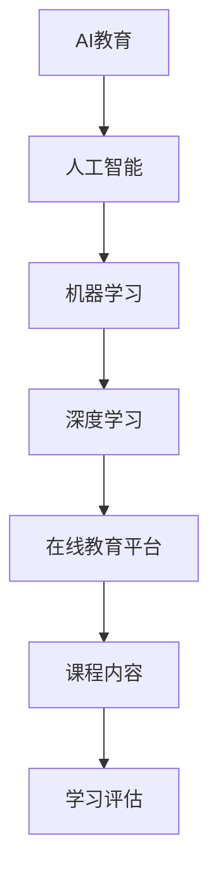
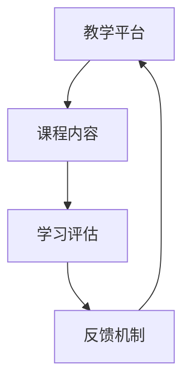

                 

# Google的AI教育布局：大学合作与在线教育

> **关键词：**Google AI、大学合作、在线教育、深度学习、机器学习、教育科技、教育平台、编程教育。

> **摘要：**本文深入探讨了Google在AI教育领域的战略布局，包括与全球顶尖大学合作，推出在线教育平台，以及针对大学生和编程爱好者的AI课程。本文通过逻辑清晰、结构紧凑的叙述，分析Google在教育科技领域的创新举措及其对人工智能发展的推动作用。

## 1. 背景介绍

### 1.1 目的和范围

本文旨在分析Google在AI教育领域的战略布局，探讨其与大学合作以及在线教育平台的重要性。我们将重点探讨以下内容：

1. **Google AI教育战略概述**：介绍Google在教育科技领域的整体战略。
2. **与大学合作**：分析Google与全球顶尖大学合作的项目和课程。
3. **在线教育平台**：探讨Google推出的在线教育平台及其课程内容。
4. **AI课程设计与实施**：分析Google针对大学生和编程爱好者的AI课程。
5. **实际应用场景**：讨论Google AI教育布局在实际应用中的影响。
6. **未来发展趋势与挑战**：预测Google AI教育布局的未来发展趋势及面临的挑战。

### 1.2 预期读者

本文主要面向以下读者群体：

1. **计算机科学和人工智能领域的学者和研究人员**：了解Google在AI教育领域的最新动态和战略布局。
2. **大学生和编程爱好者**：希望深入了解Google提供的AI课程和在线教育平台。
3. **教育科技从业者**：探讨教育科技在AI领域的发展趋势和应用。

### 1.3 文档结构概述

本文分为以下章节：

1. **背景介绍**：介绍文章的目的、范围、预期读者和文档结构。
2. **核心概念与联系**：解释AI教育领域的核心概念和架构。
3. **核心算法原理 & 具体操作步骤**：详细阐述Google AI课程的教学方法和算法原理。
4. **数学模型和公式 & 详细讲解 & 举例说明**：介绍AI教育中的数学模型和应用。
5. **项目实战：代码实际案例和详细解释说明**：通过实际案例展示AI教育中的编程实践。
6. **实际应用场景**：探讨Google AI教育布局在不同领域的应用。
7. **工具和资源推荐**：推荐学习资源、开发工具和框架。
8. **总结：未来发展趋势与挑战**：总结Google AI教育布局的成果和未来展望。
9. **附录：常见问题与解答**：回答读者可能遇到的常见问题。
10. **扩展阅读 & 参考资料**：提供进一步学习和研究的相关资料。

### 1.4 术语表

#### 1.4.1 核心术语定义

- **AI教育**：利用人工智能技术进行教育的过程，包括教学、学习、评估等环节。
- **深度学习**：一种机器学习技术，通过模拟人脑神经网络进行学习。
- **机器学习**：使计算机具备自主学习和改进能力的技术。
- **在线教育平台**：提供在线学习资源和课程的平台。

#### 1.4.2 相关概念解释

- **教育科技**：结合计算机技术和教育领域的新兴领域，旨在改进教育过程和学习效果。
- **MOOC**：大规模开放在线课程，面向广大学习者提供免费或收费的课程。

#### 1.4.3 缩略词列表

- **AI**：人工智能
- **ML**：机器学习
- **DL**：深度学习
- **MOOC**：大规模开放在线课程
- **IDE**：集成开发环境

## 2. 核心概念与联系

### 2.1 AI教育领域核心概念

在AI教育领域，核心概念包括人工智能、机器学习、深度学习和在线教育平台。以下是一个简单的Mermaid流程图，展示了这些概念之间的关系：



### 2.2 AI教育架构

AI教育架构包括教学平台、课程内容、学习评估和反馈机制。以下是一个Mermaid流程图，展示了AI教育架构的基本组成部分：



在这个架构中，教学平台提供课程内容和学习资源，学生通过在线课程进行学习，并通过学习评估和反馈机制获得反馈，从而不断改进学习效果。

## 3. 核心算法原理 & 具体操作步骤

### 3.1 核心算法原理

Google AI课程的核心算法原理主要包括机器学习和深度学习。以下是一个简化的伪代码，展示了机器学习算法的基本流程：

```python
def train_model(data, labels, model):
    # 预处理数据
    processed_data = preprocess_data(data)
    # 训练模型
    for epoch in range(num_epochs):
        for sample in processed_data:
            model.train(sample, labels)
            model.update_weights()
    return model
```

在这个算法中，`train_model`函数接收数据、标签和模型，通过预处理数据、训练模型和更新权重来训练模型。

### 3.2 具体操作步骤

以下是Google AI课程中深度学习模型训练的具体操作步骤：

1. **数据预处理**：清洗和预处理数据，将其转换为适合训练的格式。
2. **定义模型**：选择深度学习框架（如TensorFlow或PyTorch）并定义模型架构。
3. **训练模型**：使用训练数据训练模型，并在每个epoch（迭代周期）后更新模型权重。
4. **评估模型**：使用验证数据评估模型性能，并在需要时调整模型参数。
5. **测试模型**：使用测试数据测试模型在未知数据上的表现。

以下是详细的伪代码：

```python
def train_depth_learning_model(data, labels, model, num_epochs):
    # 数据预处理
    processed_data, processed_labels = preprocess_data(data, labels)
    
    # 训练模型
    for epoch in range(num_epochs):
        for sample, label in zip(processed_data, processed_labels):
            model.train(sample, label)
            model.update_weights()
        
        # 评估模型
        validation_loss = model.evaluate(validation_data, validation_labels)
        
        # 打印训练进度
        print(f"Epoch {epoch+1}/{num_epochs}, Validation Loss: {validation_loss}")
        
    # 测试模型
    test_loss = model.evaluate(test_data, test_labels)
    print(f"Test Loss: {test_loss}")
    
    return model
```

## 4. 数学模型和公式 & 详细讲解 & 举例说明

### 4.1 数学模型

在深度学习领域，常见的数学模型包括损失函数、优化器和神经网络架构。以下是一个简单的数学模型，用于描述多层感知机（MLP）的损失函数和优化过程：

#### 4.1.1 损失函数

损失函数用于衡量模型预测结果与真实标签之间的差异。常见的损失函数有均方误差（MSE）和交叉熵（Cross Entropy）：

$$
MSE = \frac{1}{n}\sum_{i=1}^{n}(y_i - \hat{y}_i)^2
$$

$$
CrossEntropy = -\frac{1}{n}\sum_{i=1}^{n} y_i \log(\hat{y}_i)
$$

#### 4.1.2 优化器

优化器用于更新模型权重，以最小化损失函数。常见的优化器有梯度下降（Gradient Descent）和Adam优化器：

$$
w_{\text{new}} = w_{\text{current}} - \alpha \cdot \nabla_w J(w)
$$

$$
w_{\text{new}} = w_{\text{current}} - \alpha \cdot \left( \frac{m}{t} \cdot \nabla_w J(w) + \beta_1 \cdot \frac{v}{\sqrt{t} + \epsilon} \right)
$$

#### 4.1.3 神经网络架构

神经网络架构包括输入层、隐藏层和输出层。以下是一个简单的神经网络架构，用于分类任务：

$$
\hat{y} = \sigma(\sum_{i=1}^{n} w_i \cdot x_i + b)
$$

其中，$\sigma$ 是激活函数，通常使用 sigmoid 或 ReLU 函数。

### 4.2 举例说明

假设我们要训练一个神经网络模型，用于对鸢尾花数据集进行分类。数据集包含三个类别的鸢尾花，每个类别有 50 个样本。以下是模型的训练过程：

1. **数据预处理**：将数据集分为训练集和测试集，并对数据进行归一化处理。
2. **定义模型**：使用 TensorFlow 框架定义一个简单的多层感知机（MLP）模型，包含一个输入层、一个隐藏层和一个输出层。
3. **训练模型**：使用训练集数据训练模型，并使用验证集评估模型性能。
4. **测试模型**：使用测试集数据测试模型在未知数据上的表现。

以下是使用 TensorFlow 框架实现的代码示例：

```python
import tensorflow as tf

# 数据预处理
(x_train, y_train), (x_test, y_test) = tf.keras.datasets.irisspecies.load_data()
x_train = x_train / 255.0
x_test = x_test / 255.0
y_train = tf.keras.utils.to_categorical(y_train)
y_test = tf.keras.utils.to_categorical(y_test)

# 定义模型
model = tf.keras.Sequential([
    tf.keras.layers.Dense(64, activation='relu', input_shape=(4,)),
    tf.keras.layers.Dense(64, activation='relu'),
    tf.keras.layers.Dense(3, activation='softmax')
])

# 训练模型
model.compile(optimizer='adam', loss='categorical_crossentropy', metrics=['accuracy'])
model.fit(x_train, y_train, epochs=10, batch_size=32, validation_split=0.2)

# 测试模型
test_loss, test_acc = model.evaluate(x_test, y_test)
print(f"Test Accuracy: {test_acc}")
```

## 5. 项目实战：代码实际案例和详细解释说明

### 5.1 开发环境搭建

为了实践Google AI教育布局中的课程内容，我们需要搭建一个合适的开发环境。以下是搭建环境的步骤：

1. **安装Python**：下载并安装Python（版本3.8以上），配置环境变量。
2. **安装Jupyter Notebook**：使用pip命令安装Jupyter Notebook。
   ```bash
   pip install notebook
   ```
3. **安装TensorFlow**：使用pip命令安装TensorFlow。
   ```bash
   pip install tensorflow
   ```

### 5.2 源代码详细实现和代码解读

以下是使用TensorFlow框架实现一个简单的线性回归模型的代码示例。该模型用于预测房价。

```python
import tensorflow as tf
import numpy as np

# 数据生成
np.random.seed(42)
x = np.random.normal(size=(100, 1))
y = 2 * x + 1 + np.random.normal(size=(100, 1))

# 模型定义
model = tf.keras.Sequential([
    tf.keras.layers.Dense(units=1, input_shape=(1,))
])

# 模型编译
model.compile(optimizer='sgd', loss='mean_squared_error')

# 训练模型
model.fit(x, y, epochs=100)

# 模型评估
loss = model.evaluate(x, y)
print(f"Model Loss: {loss}")

# 模型预测
predictions = model.predict(x)
print(f"Predictions: {predictions}")
```

#### 5.2.1 代码解读

- **数据生成**：使用numpy库生成模拟数据集，包括自变量x和因变量y。
- **模型定义**：使用TensorFlow的Sequential模型定义一个线性回归模型，包含一个全连接层，输入维度为1。
- **模型编译**：设置优化器和损失函数。
- **模型训练**：使用fit方法训练模型，设置训练轮数和批量大小。
- **模型评估**：使用evaluate方法评估模型在训练数据上的性能。
- **模型预测**：使用predict方法对自变量x进行预测，得到预测结果。

### 5.3 代码解读与分析

该代码示例展示了如何使用TensorFlow实现一个简单的线性回归模型。通过生成模拟数据集，我们可以观察到模型如何学习数据中的线性关系。以下是代码的关键点和分析：

- **线性回归模型**：线性回归是一种简单的机器学习模型，用于预测连续值。该模型通过拟合数据中的线性关系来预测目标值。
- **TensorFlow Sequential模型**：Sequential模型是TensorFlow提供的简单模型构建工具，通过堆叠层（Layer）来构建复杂的模型。
- **优化器和损失函数**：优化器用于更新模型权重，以最小化损失函数。在本例中，我们使用随机梯度下降（SGD）优化器和均方误差（MSE）损失函数。
- **模型训练**：通过fit方法训练模型，模型将自动执行前向传播和反向传播过程，并更新权重。
- **模型评估**：使用evaluate方法评估模型在训练数据上的性能，我们可以看到模型的损失值。
- **模型预测**：使用predict方法对自变量进行预测，得到预测结果。

通过这个简单的示例，我们可以看到如何使用TensorFlow实现一个线性回归模型，并了解模型的训练和评估过程。这种实践经验对于理解Google AI教育布局中的课程内容非常重要。

## 6. 实际应用场景

### 6.1 在线教育平台的应用

Google推出的在线教育平台，如Coursera和Udacity，已经在全球范围内得到了广泛应用。这些平台为成千上万的用户提供AI、机器学习和深度学习的课程资源。以下是一些实际应用场景：

1. **大学课程**：许多大学将Google提供的AI课程纳入本科和研究生课程，为学生提供实践机会。
2. **职业培训**：企业和专业人士通过这些平台学习最新的AI技术和应用，以提升职业竞争力。
3. **终身学习**：个人用户通过在线课程学习AI知识，以应对职业生涯中的挑战。

### 6.2 与大学合作的实际应用

Google与全球顶尖大学合作，推动了AI教育的发展。以下是一些具体的应用案例：

1. **斯坦福大学**：Google与斯坦福大学合作，推出了“深度学习特别课程”（Deep Learning Specialization），吸引了全球数十万学生。
2. **麻省理工学院**：Google与麻省理工学院合作，共同推出了“机器学习课程”（Machine Learning Course），为学生提供全面的理论和实践知识。
3. **加州大学伯克利分校**：Google与加州大学伯克利分校合作，开展了多个AI科研项目，并为学生提供研究机会。

### 6.3 编程教育中的应用

Google的AI教育布局不仅关注学术领域，还注重编程教育。以下是一些编程教育中的应用场景：

1. **编程课程**：Google在Coursera等平台上提供了丰富的编程课程，如“Python 3编程”、“机器学习基础”等，帮助学生掌握编程技能。
2. **编程竞赛**：Google举办编程竞赛，如Google Code Jam和Google AI Challenge，鼓励学生和开发者应用AI技术解决实际问题。
3. **开源项目**：Google鼓励学生参与开源项目，如TensorFlow和Kubernetes，以提升实际编程能力。

通过这些实际应用场景，我们可以看到Google的AI教育布局在促进学术研究、职业培训和终身学习方面发挥了重要作用。

## 7. 工具和资源推荐

### 7.1 学习资源推荐

#### 7.1.1 书籍推荐

1. **《深度学习》（Deep Learning）**：Goodfellow, Bengio 和 Courville 著。这是一本深度学习领域的经典教材，涵盖了深度学习的基础理论和应用。
2. **《Python机器学习》（Python Machine Learning）**：Sebastian Raschka 著。这本书详细介绍了使用Python进行机器学习的实践方法。

#### 7.1.2 在线课程

1. **Coursera**：提供丰富的AI、机器学习和深度学习课程，如“深度学习特别课程”（Deep Learning Specialization）。
2. **Udacity**：提供一系列AI和机器学习课程，包括“机器学习纳米学位”（Machine Learning Nanodegree）。

#### 7.1.3 技术博客和网站

1. **Google Research Blog**：介绍Google在AI领域的研究进展和成果。
2. **Medium**：有许多关于AI、机器学习和深度学习的优秀博客文章。

### 7.2 开发工具框架推荐

#### 7.2.1 IDE和编辑器

1. **Jupyter Notebook**：适合数据科学和机器学习的交互式编程环境。
2. **PyCharm**：功能强大的Python IDE，适合机器学习和深度学习开发。

#### 7.2.2 调试和性能分析工具

1. **TensorBoard**：TensorFlow的官方可视化工具，用于分析模型性能。
2. **PyTorch Profiler**：用于分析PyTorch模型的性能。

#### 7.2.3 相关框架和库

1. **TensorFlow**：广泛使用的深度学习框架。
2. **PyTorch**：Python中最流行的深度学习库之一。

### 7.3 相关论文著作推荐

#### 7.3.1 经典论文

1. **“Backpropagation”**：Rumelhart, Hinton 和 Williams 著。这篇论文首次提出了反向传播算法。
2. **“A Learning Algorithm for Continually Running Fully Recurrent Neural Networks”**：Williams 和 Zipser 著。这篇论文介绍了梯度下降在神经网络中的应用。

#### 7.3.2 最新研究成果

1. **“Bert: Pre-training of Deep Bidirectional Transformers for Language Understanding”**：Devlin 等 著。这篇论文介绍了BERT模型，在自然语言处理领域取得了显著成果。
2. **“Gshard: Scaling Giant Neural Networks using Global Shardings”**：Kociemba 等 著。这篇论文探讨了如何在大规模神经网络中实现高效计算。

#### 7.3.3 应用案例分析

1. **“AI for Social Good”**：Google Research 著。这本书介绍了Google如何利用AI技术解决社会问题。
2. **“AI in Healthcare”**：Google Health 著。这篇论文探讨了AI在医疗健康领域的应用。

## 8. 总结：未来发展趋势与挑战

### 8.1 未来发展趋势

- **AI教育与技术的深度融合**：随着AI技术的不断进步，AI教育将更加注重实践和应用，培养更多具有实际技能的AI人才。
- **在线教育平台的普及**：随着在线教育平台的不断完善，更多学生和专业人士将有机会通过互联网获取高质量的AI教育资源。
- **跨学科合作**：AI教育将与其他学科（如生物学、经济学、心理学等）进行深入合作，推动AI技术的多领域应用。

### 8.2 挑战

- **教育资源不平衡**：尽管在线教育平台提供了丰富的资源，但全球教育资源的分配仍然不均衡，需要更多努力确保教育资源公平分配。
- **隐私和数据安全**：随着AI教育的发展，大量的数据将用于模型训练和评估，隐私保护和数据安全将成为重要挑战。
- **教育评估与认证**：如何有效地评估在线教育课程的学习效果，以及如何提供权威的认证，是AI教育领域需要解决的问题。

通过解决这些挑战，AI教育将能够在未来发挥更大的作用，为人工智能的发展提供强有力的支持。

## 9. 附录：常见问题与解答

### 9.1 关于Google AI教育的常见问题

1. **什么是Google AI教育？**
   Google AI教育是指Google推出的一系列人工智能教育课程和项目，旨在通过在线教育和与大学合作的方式，为全球学生和专业人士提供高质量的人工智能教育资源。

2. **Google AI教育有哪些课程？**
   Google AI教育提供了多种课程，包括机器学习、深度学习、计算机视觉、自然语言处理等领域的课程。其中，最受欢迎的课程包括“深度学习特别课程”（Deep Learning Specialization）和“机器学习课程”（Machine Learning Course）。

3. **Google AI教育与Coursera和Udacity的关系是什么？**
   Coursera和Udacity是Google AI教育的主要合作伙伴，它们提供了Google AI教育的课程平台，让全球学生可以通过这些平台访问和学习AI课程。

4. **如何参加Google AI教育课程？**
   您可以通过Coursera和Udacity等在线教育平台注册Google AI教育课程。注册后，您可以根据课程要求完成作业和项目，并获取证书。

### 9.2 关于AI教育的常见问题

1. **AI教育与计算机科学的关系是什么？**
   AI教育是计算机科学的一个分支，它专注于研究如何利用计算机技术实现人工智能。AI教育涉及机器学习、深度学习、自然语言处理等多个计算机科学领域。

2. **学习AI教育需要哪些先决条件？**
   学习AI教育需要具备一定的计算机科学基础知识，包括编程、数据结构和算法。此外，数学和统计学知识对于理解AI模型和算法也非常重要。

3. **AI教育的发展前景如何？**
   AI教育的发展前景非常广阔。随着人工智能技术的不断进步，AI将在各个领域得到广泛应用，AI教育也将成为未来教育的重要组成部分。

## 10. 扩展阅读 & 参考资料

- **Google AI教育官方网站**：[Google AI Education](https://ai.google.com/education/)
- **Coursera平台**：[Coursera](https://www.coursera.org/)
- **Udacity平台**：[Udacity](https://www.udacity.com/)
- **《深度学习》教材**：[Deep Learning](https://www.deeplearningbook.org/)
- **《Python机器学习》教材**：[Python Machine Learning](https://python-machine-learning.org/)

通过阅读这些参考资料，您可以进一步了解Google AI教育和人工智能领域的最新动态和发展趋势。

