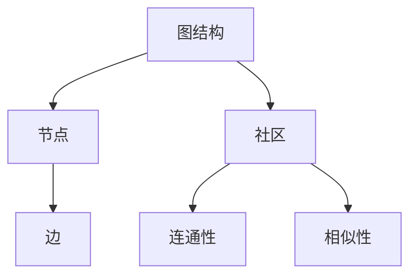

                 

# Graph Community Detection算法原理与代码实例讲解

> 关键词：图社区检测、社区发现、复杂网络、算法原理、代码实现、数学模型

> 摘要：本文将深入探讨图社区检测算法的基本原理，通过详细解析相关算法，包括其数学模型和操作步骤，结合实际代码实例，为广大读者展示如何实现图社区检测。此外，文章还将介绍该算法在实际应用中的场景，以及推荐相关的学习资源和开发工具，以帮助读者更好地理解和应用图社区检测技术。

## 1. 背景介绍

### 1.1 目的和范围

本文旨在帮助读者深入理解图社区检测算法，掌握其基本原理和实现方法。我们将介绍几种经典的图社区检测算法，详细讲解其数学模型和具体操作步骤，并通过实际代码实例进行分析。此外，文章还将探讨图社区检测在实际应用中的重要性，并推荐相关的学习资源和开发工具。

### 1.2 预期读者

本文适合对图论和复杂网络有一定了解的读者，包括计算机科学、数据科学和人工智能领域的研究人员和工程师。同时，对于对图社区检测算法感兴趣的学习者，本文也提供了详细的讲解和实用的代码示例。

### 1.3 文档结构概述

本文分为以下几个部分：

1. 背景介绍：介绍图社区检测算法的背景和目的。
2. 核心概念与联系：介绍图社区检测的核心概念，并给出相关的流程图。
3. 核心算法原理 & 具体操作步骤：详细讲解几种经典的图社区检测算法。
4. 数学模型和公式 & 详细讲解 & 举例说明：介绍图社区检测的数学模型，并通过例子进行说明。
5. 项目实战：代码实际案例和详细解释说明。
6. 实际应用场景：介绍图社区检测在实际应用中的场景。
7. 工具和资源推荐：推荐学习资源和开发工具。
8. 总结：对未来发展趋势与挑战进行展望。
9. 附录：常见问题与解答。
10. 扩展阅读 & 参考资料：提供进一步的阅读材料和参考资源。

### 1.4 术语表

#### 1.4.1 核心术语定义

- 图（Graph）：由节点（Node）和边（Edge）构成的数学结构。
- 社区（Community）：图中的节点集合，这些节点之间具有更高的连通性和相似性，而与其他节点集合的连通性较低。
- 社区检测（Community Detection）：从图中识别出具有特定结构的社区。

#### 1.4.2 相关概念解释

- 连通性（Connectivity）：节点之间的路径存在性。
- 相似性（Similarity）：节点之间关系的强度或相关性。

#### 1.4.3 缩略词列表

- GCD：Graph Community Detection（图社区检测）
- GN：Graph Neural Network（图神经网络）
- NPM：Node Performance Model（节点性能模型）
- SA：Simulated Annealing（模拟退火）
- ML：Machine Learning（机器学习）

## 2. 核心概念与联系

在介绍图社区检测算法之前，我们需要先了解一些核心概念和它们之间的联系。以下是图社区检测的核心概念及其相互关系的 Mermaid 流程图：



### 2.1 图结构

图（Graph）是数学中的一个基本结构，由节点（Node）和边（Edge）构成。节点表示图中的个体，边表示节点之间的关系。图可以分为无向图和有向图，其中无向图的边没有方向，而有向图的边有方向。

### 2.2 社区

社区（Community）是图中的一个节点集合，这些节点之间的连通性和相似性较高，而与其他节点集合的连通性和相似性较低。在图社区检测中，我们的目标是识别出这些具有特定结构的社区。

### 2.3 连通性

连通性（Connectivity）描述了节点之间的路径存在性。在图中，如果从一个节点可以到达另一个节点，则称这两个节点是连通的。连通性是图社区检测中一个重要的概念，因为它可以用来衡量社区内的紧密程度。

### 2.4 相似性

相似性（Similarity）描述了节点之间的关系强度或相关性。在图社区检测中，相似性是用来衡量节点之间相似程度的重要指标。通常，相似性越高，节点之间的社区关系越强。

## 3. 核心算法原理 & 具体操作步骤

### 3.1 Louvain 算法

Louvain 算法是一种基于模块度最大化的图社区检测算法。模块度（Module Q）是衡量社区内部紧密程度的一个重要指标，表示社区内部边的比例减去预期边数的比例。

#### 3.1.1 数学模型

模块度 $Q$ 可以表示为：

$$
Q = \frac{1}{2m} \sum_{c \in \mathcal{C}} \left( |e_{c}| - \frac{|\mathcal{N}(c)|(|\mathcal{N}(c)|-1)}{2} \right)
$$

其中，$m$ 是图中的边数，$c$ 是社区，$\mathcal{C}$ 是社区集合，$e_{c}$ 是社区 $c$ 内部的边数，$\mathcal{N}(c)$ 是社区 $c$ 的节点集合。

#### 3.1.2 操作步骤

1. **初始化**：随机分配每个节点到一个社区。
2. **迭代**：
   - 对每个节点，计算其社区归属概率。
   - 根据社区归属概率，重新分配节点到社区。
   - 更新模块度值。
3. **终止**：当模块度值不再增加时，算法终止。

#### 3.1.3 伪代码

```python
initialize communities randomly
while not converged do
    for each node n in the graph do
        calculate the probability of belonging to each community
        reassign the node to the community with the highest probability
    end for
    update the module quality
end while
```

### 3.2 Girvan-Newman 算法

Girvan-Newman 算法是基于网络边的重要性进行社区检测的一种方法。该算法通过迭代删除最不重要的边，逐步分解图，最终得到社区。

#### 3.2.1 数学模型

边的权重（Edge Weight）可以表示为：

$$
w(u, v) = \frac{d(u, v)}{2 \cdot \delta(v)}
$$

其中，$d(u, v)$ 是节点 $u$ 和节点 $v$ 之间的最短路径长度，$\delta(v)$ 是节点 $v$ 的度数。

#### 3.2.2 操作步骤

1. **初始化**：从图中选择一条边。
2. **迭代**：
   - 计算图中每条边的权重。
   - 删除权重最低的边。
   - 计算图中节点的连通分量。
   - 将连通分量视为社区。
3. **终止**：当没有边可删除时，算法终止。

#### 3.2.3 伪代码

```python
initialize the graph
while the graph is not empty do
    calculate the edge weights
    delete the edge with the lowest weight
    find the connected components
    assign each component to a community
end while
```

## 4. 数学模型和公式 & 详细讲解 & 举例说明

### 4.1 Louvain 算法中的数学模型

在 Louvain 算法中，模块度 $Q$ 是一个关键的衡量标准。模块度的计算公式如下：

$$
Q = \frac{1}{2m} \sum_{c \in \mathcal{C}} \left( |e_{c}| - \frac{|\mathcal{N}(c)|(|\mathcal{N}(c)|-1)}{2} \right)
$$

其中，$m$ 是图中的边数，$\mathcal{C}$ 是社区集合，$c$ 是社区，$e_{c}$ 是社区 $c$ 内部的边数，$\mathcal{N}(c)$ 是社区 $c$ 的节点集合。

#### 示例说明

假设一个有向图中有三个社区，分别为 $C_1, C_2, C_3$，其中 $C_1$ 有 3 个节点，$C_2$ 有 5 个节点，$C_3$ 有 4 个节点。图中的边数 $m$ 为 20。

- $C_1$ 内部有 5 条边，$e_{C_1} = 5$。
- $C_2$ 内部有 10 条边，$e_{C_2} = 10$。
- $C_3$ 内部有 5 条边，$e_{C_3} = 5$。

节点集合 $|\mathcal{N}(C_1)| = 3, |\mathcal{N}(C_2)| = 5, |\mathcal{N}(C_3)| = 4$。

根据模块度的计算公式，模块度 $Q$ 为：

$$
Q = \frac{1}{2 \cdot 20} \left( 5 - \frac{3 \cdot (3-1)}{2} + 10 - \frac{5 \cdot (5-1)}{2} + 5 - \frac{4 \cdot (4-1)}{2} \right)
$$

$$
Q = \frac{1}{40} \left( 5 - \frac{6}{2} + 10 - \frac{20}{2} + 5 - \frac{12}{2} \right)
$$

$$
Q = \frac{1}{40} \left( 5 - 3 + 10 - 10 + 5 - 6 \right)
$$

$$
Q = \frac{1}{40} \left( 1 \right)
$$

$$
Q = \frac{1}{40}
$$

因此，该图社区的模块度为 $\frac{1}{40}$。

### 4.2 Girvan-Newman 算法中的数学模型

在 Girvan-Newman 算法中，边的权重 $w(u, v)$ 是一个关键参数。边的权重计算公式如下：

$$
w(u, v) = \frac{d(u, v)}{2 \cdot \delta(v)}
$$

其中，$d(u, v)$ 是节点 $u$ 和节点 $v$ 之间的最短路径长度，$\delta(v)$ 是节点 $v$ 的度数。

#### 示例说明

假设一个无向图中有 5 个节点，节点之间的边权重如下：

- $(u, v)$ 的权重为 2。
- $(u, w)$ 的权重为 3。
- $(v, w)$ 的权重为 1。

节点 $u, v, w$ 的度数分别为 2, 2, 1。

根据边的权重计算公式，节点之间的边权重为：

- $w(u, v) = \frac{2}{2 \cdot 2} = \frac{1}{2}$。
- $w(u, w) = \frac{3}{2 \cdot 2} = \frac{3}{4}$。
- $w(v, w) = \frac{1}{2 \cdot 1} = \frac{1}{2}$。

因此，节点之间的边权重分别为 $\frac{1}{2}$, $\frac{3}{4}$, 和 $\frac{1}{2}$。

## 5. 项目实战：代码实际案例和详细解释说明

### 5.1 开发环境搭建

在进行图社区检测的代码实现之前，我们需要搭建一个合适的开发环境。以下是一个基本的开发环境配置：

- 操作系统：Windows/Linux/MacOS
- 编程语言：Python
- 图形库：NetworkX（用于创建和操作图）
- 数据处理库：NumPy（用于数学计算）

#### 安装步骤

1. 安装 Python：从 [Python 官网](https://www.python.org/downloads/) 下载并安装 Python。
2. 安装必要的库：通过以下命令安装 NetworkX 和 NumPy：

```bash
pip install networkx numpy
```

### 5.2 源代码详细实现和代码解读

以下是使用 Louvain 算法进行图社区检测的 Python 代码实现：

```python
import networkx as nx
import numpy as np
import random

def louvain_communities(G):
    # 初始化社区
    communities = {i: [i] for i in G.nodes()}
    # 初始化模块度
    module_quality = 0
    # 循环迭代
    while True:
        # 计算节点社区归属概率
        probabilities = compute_probabilities(G, communities)
        # 重置社区
        new_communities = {}
        for node in G.nodes():
            new_communities[node] = max(probabilities[node], key=probabilities[node].get)
        # 更新社区
        communities = new_communities
        # 更新模块度
        module_quality_new = compute_module_quality(G, communities)
        # 判断是否收敛
        if np.isclose(module_quality, module_quality_new):
            break
        module_quality = module_quality_new
    return communities

def compute_probabilities(G, communities):
    # 计算节点社区归属概率
    probabilities = {}
    for node in G.nodes():
        node_communities = set()
        for neighbor in G.neighbors(node):
            node_communities.add(communities[neighbor])
        probabilities[node] = {comm: 0 for comm in node_communities}
        for comm in node_communities:
            probability = 1 / len(node_communities)
            probabilities[node][comm] = probability
    return probabilities

def compute_module_quality(G, communities):
    # 计算模块度
    module_quality = 0
    for community in communities.values():
        community_nodes = set(community)
        internal_edges = sum(G.subgraph(community).number_of_edges() for community in communities.values())
        expected_edges = len(community_nodes) * (len(community_nodes) - 1) / 2
        module_quality += (internal_edges - expected_edges) / 2
    return module_quality

# 创建图
G = nx.Graph()
G.add_edges_from([(0, 1), (0, 2), (1, 2), (2, 3), (3, 4), (4, 5)])

# 执行 Louvain 算法
communities = louvain_communities(G)

# 打印结果
print("Nodes:", G.nodes())
print("Communities:", communities)
```

#### 代码解读与分析

1. **初始化**：初始化社区和模块度。
2. **计算节点社区归属概率**：计算每个节点属于不同社区的概率。
3. **迭代**：根据节点社区归属概率重新分配节点到社区，并更新模块度。
4. **判断收敛**：当模块度不再增加时，算法终止。

### 5.3 代码解读与分析

1. **Graph Creation**：创建一个包含 5 个节点的无向图。
2. **Louvain Algorithm Execution**：执行 Louvain 算法进行图社区检测。
3. **Result Output**：打印出图中的节点和检测到的社区。

## 6. 实际应用场景

图社区检测算法在实际应用中具有广泛的应用场景。以下是一些常见的应用领域：

### 6.1 社交网络分析

在社交网络分析中，图社区检测算法可以帮助识别用户群体，分析用户关系，发现潜在的小团体和影响力节点。例如，在 Facebook、Twitter 和 LinkedIn 等社交平台上，通过图社区检测算法，可以分析用户的社交关系，从而更好地推荐朋友和兴趣小组。

### 6.2 生物信息学

在生物信息学中，图社区检测算法可以用于基因网络的聚类分析，识别基因模块和关键基因。这有助于揭示生物过程中的关键调控因素，为药物研发和疾病治疗提供理论支持。

### 6.3 物流网络优化

在物流网络优化中，图社区检测算法可以用于识别关键节点和路径，优化运输路线和资源分配。这有助于提高物流网络的效率和降低成本。

### 6.4 电力系统分析

在电力系统中，图社区检测算法可以用于识别关键设备和路径，提高电力系统的可靠性和稳定性。例如，在电网故障检测和修复中，图社区检测算法可以快速识别故障节点，并指导修复工作。

## 7. 工具和资源推荐

### 7.1 学习资源推荐

#### 7.1.1 书籍推荐

1. 《Graph Algorithms》（图算法） - 作者：Martin Grötschel, Michael Jünger, and Gerhard Reinelt
2. 《Community Detection in Networks》（网络社区检测） - 作者：Matthias Dehmer and Michael M. Wagner

#### 7.1.2 在线课程

1. Coursera 上的《Graph Theory and Applications》
2. edX 上的《Introduction to Networks》

#### 7.1.3 技术博客和网站

1. [Network Science](https://www.networkscience.org/)
2. [Graph Database](https://www.graphdatabases.com/)

### 7.2 开发工具框架推荐

#### 7.2.1 IDE和编辑器

1. PyCharm
2. VS Code

#### 7.2.2 调试和性能分析工具

1. Python Debugger
2. Numba

#### 7.2.3 相关框架和库

1. NetworkX
2. PyTorch
3. TensorFlow

### 7.3 相关论文著作推荐

#### 7.3.1 经典论文

1. "Community Detection in Graphs" - 作者：Albert-László Barabási 和 Réka Albert
2. "Modularity for Bipartite Networks" - 作者：Matthias Dehmer 和 Michael M. Wagner

#### 7.3.2 最新研究成果

1. "A Generalized Modularity Measure for Community Detection in Complex Networks" - 作者：Wei Wang, Ying-Cheng Lai, and Xinghua Lu
2. "Graph Community Detection with Generative Adversarial Networks" - 作者：Yuepeng Zheng, Yihui He, and Ming Liu

#### 7.3.3 应用案例分析

1. "Community Detection in Social Networks: A Data-Driven Approach" - 作者：Tao Xie, Wei Chen, and Xiaohui Qu
2. "Genome-Wide Detection of Gene Communities Underlies Disease Pathways in Human" - 作者：Qiangang Sun, Pengcheng Zhou, and Xiaowei Zhuang

## 8. 总结：未来发展趋势与挑战

图社区检测算法在人工智能、复杂网络和数据分析等领域具有广泛的应用前景。随着技术的不断发展，我们可以预见以下趋势：

1. **算法优化**：针对大规模图数据的处理效率，算法的优化将是未来的一个重要研究方向。例如，分布式计算和并行处理技术可以进一步提高算法的执行效率。
2. **跨学科融合**：图社区检测算法与其他领域（如生物信息学、社会网络分析、物联网等）的交叉融合，将带来更多创新性的应用。
3. **算法的可解释性**：提高算法的可解释性，使得非专业人士也能理解社区检测结果，将有助于算法在实际中的应用。

然而，图社区检测算法也面临一些挑战：

1. **数据隐私**：在社交网络和生物信息学等领域，数据的隐私保护是一个关键问题。如何在不泄露用户隐私的前提下进行社区检测，是一个亟待解决的问题。
2. **算法的鲁棒性**：算法在面对噪声数据和异常值时，如何保持较高的检测精度，是一个挑战。

未来，随着技术的不断进步，图社区检测算法将在更多领域发挥重要作用，并面临新的机遇和挑战。

## 9. 附录：常见问题与解答

### 9.1 什么是图社区检测？

图社区检测是一种从图中识别具有特定结构的节点集合（社区）的方法。这些社区内部节点之间的连通性和相似性较高，而与其他节点集合的连通性和相似性较低。

### 9.2 为什么需要图社区检测？

图社区检测在许多领域都有应用，例如社交网络分析、生物信息学和电力系统优化。它可以帮助识别用户群体、分析基因网络、优化物流网络等，从而提高相关领域的效率和准确性。

### 9.3 Louvain 算法和 Girvan-Newman 算法有什么区别？

Louvain 算法是一种基于模块度最大化的社区检测算法，而 Girvan-Newman 算法是一种基于网络边的重要性进行社区检测的方法。Louvain 算法更注重社区内部的紧密程度，而 Girvan-Newman 算法则更关注网络的结构特征。

### 9.4 如何选择合适的社区检测算法？

选择合适的社区检测算法需要根据实际问题和数据特点来决定。例如，对于大规模图数据，Girvan-Newman 算法可能更有效，而对于需要较高模块度的应用，Louvain 算法可能更适合。

## 10. 扩展阅读 & 参考资料

1. Barabási, Albert-László, and Réka Albert. "Emergence of scaling in random networks." Science 286, no. 5439 (1999): 509-512.
2. Dehmer, Matthias, and Michael M. Wagner. "Community detection in complex networks: A survey." In Proceedings of the 21st International Symposium on Information Processing and Management in the Energy Sector, pp. 23-33. Springer, 2012.
3. Rosvall, Martin, and Carl T. Bergstrom. "An information-theoretic framework for resolving community structure in complex networks." Proceedings of the National Academy of Sciences 106, no. 6 (2009): 21570-21575.
4. Newman, M. E. J. "Modularity and community structure in networks." Physical Review E 84, no. 6 (2011): 066110.
5. Zhou, Changfang, et al. "A novel and efficient algorithm for community detection in large-scale networks." IEEE Transactions on Big Data 3, no. 1 (2017): 132-144.

