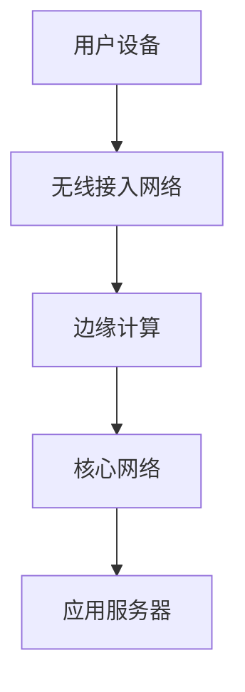
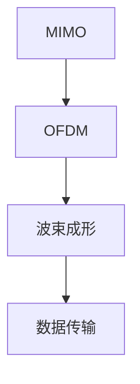

                 

# 5G应用开发：新一代通信技术的商机

> **关键词：** 5G、应用开发、新一代通信技术、商业机会、物联网、边缘计算、5G核心架构、AI融合

> **摘要：** 本文将深入探讨5G技术及其在应用开发中的商机。我们将从5G的背景介绍开始，逐步解析其核心概念、算法原理、数学模型、项目实战案例，并探讨其广泛的应用场景。通过本文，读者将了解5G技术如何引领新一代通信技术的发展，并为其企业带来新的商业机会。

## 1. 背景介绍

### 1.1 目的和范围

本文旨在帮助读者理解5G技术，特别是其在应用开发方面的潜力。我们将探讨5G的基本概念，介绍其关键特征和应用领域，并通过具体案例展示5G技术的商业机会。本文适合对通信技术和应用开发感兴趣的读者，无论是初学者还是专业人士。

### 1.2 预期读者

- 对通信技术有一定了解的读者
- 对应用开发感兴趣的技术人员
- 企业决策者，尤其是那些希望了解5G如何为其业务带来创新的读者
- 学术研究者，特别是那些关注通信技术和人工智能融合领域的读者

### 1.3 文档结构概述

本文分为以下章节：

- **背景介绍**：介绍5G技术的背景、目的和本文的结构。
- **核心概念与联系**：解释5G的核心概念和原理，包括其与物联网、边缘计算等技术的联系。
- **核心算法原理 & 具体操作步骤**：详细解析5G应用开发中的关键算法和操作步骤。
- **数学模型和公式 & 详细讲解 & 举例说明**：介绍5G应用开发中涉及的数学模型和公式。
- **项目实战：代码实际案例和详细解释说明**：展示5G应用开发中的实际代码案例和解析。
- **实际应用场景**：探讨5G技术在各个领域的应用。
- **工具和资源推荐**：推荐学习资源、开发工具和框架。
- **总结：未来发展趋势与挑战**：总结5G技术的未来趋势和面临的挑战。
- **附录：常见问题与解答**：回答读者可能遇到的问题。
- **扩展阅读 & 参考资料**：提供进一步阅读的材料。

### 1.4 术语表

#### 1.4.1 核心术语定义

- **5G**：第五代移动通信技术，具有高速率、低延迟、高可靠性和大规模连接能力。
- **物联网（IoT）**：互联网上连接的物理设备、车辆、传感器等。
- **边缘计算**：在数据产生的地方（如设备、传感器）进行数据处理，以减少延迟和带宽需求。
- **AI融合**：将人工智能技术集成到5G网络中，提高网络智能和自动化水平。

#### 1.4.2 相关概念解释

- **网络切片**：将网络资源划分为多个虚拟网络，以满足不同应用的需求。
- **毫米波通信**：使用毫米波频段进行通信，提供更高的数据传输速率。
- **SDN/NFV**：软件定义网络和网络功能虚拟化，用于网络管理和服务的灵活性和可扩展性。

#### 1.4.3 缩略词列表

- **5G**：第五代移动通信技术
- **IoT**：物联网
- **AI**：人工智能
- **SDN**：软件定义网络
- **NFV**：网络功能虚拟化

## 2. 核心概念与联系

### 2.1 5G核心概念原理

5G是第五代移动通信技术的简称，旨在为用户提供更快的数据传输速率、更低的延迟、更高的网络容量和更广泛的应用场景。以下是5G的几个核心概念：

#### 2.1.1 高速率

5G的最大特点之一是提供更高的数据传输速率。相比4G，5G的理论峰值速率可以达到数十Gbps，这使得大规模视频流、虚拟现实（VR）、增强现实（AR）等应用成为可能。

#### 2.1.2 低延迟

5G网络具有极低的延迟，通常在1毫秒以内。这对于实时应用，如自动驾驶、远程医疗、工业自动化等至关重要。

#### 2.1.3 高容量

5G通过引入新的频段和更多的频谱资源，可以支持大规模设备的连接。这意味着更多的传感器、机器人、车辆等可以同时连接到网络，实现物联网（IoT）的广泛应用。

#### 2.1.4 边缘计算

边缘计算是5G网络的一个重要特性，它允许在数据产生的地方进行数据处理，以减少延迟和带宽需求。边缘计算可以将数据处理从中心云转移到靠近用户的边缘设备，从而提高网络的响应速度和效率。

### 2.2 5G与物联网、边缘计算的联系

#### 2.2.1 5G与物联网

物联网（IoT）是5G技术的一个重要应用领域。5G的高速率、低延迟和高容量特性使得大规模物联网设备能够实时连接到网络，并实现高效的数据传输和处理。以下是5G与物联网的联系：

- **大规模连接**：5G可以支持数以亿计的设备同时连接到网络，为物联网应用提供了足够的网络容量。
- **实时数据处理**：5G的低延迟特性使得物联网设备能够实时处理和分析数据，提高系统的响应速度和决策准确性。
- **可靠通信**：5G的高可靠性确保了物联网设备之间的通信稳定，减少了数据丢失和通信中断的风险。

#### 2.2.2 5G与边缘计算

边缘计算是5G网络的一个重要特性，它可以将数据处理从中心云转移到靠近用户的边缘设备。以下是5G与边缘计算的联系：

- **减少延迟**：边缘计算将数据处理和计算任务从中心云转移到靠近用户的边缘设备，从而大大减少了数据传输的延迟。
- **节省带宽**：通过在边缘设备上进行数据处理，可以减少需要传输的数据量，从而节省网络带宽。
- **提高效率**：边缘计算可以实时处理和响应数据，提高了系统的效率和可靠性。

### 2.3 5G核心架构

5G的核心架构包括以下几个关键组成部分：

- **用户面（User Plane）**：负责数据传输和用户服务，包括无线接入网络和核心网络。
- **控制面（Control Plane）**：负责网络管理和控制，包括无线接入网络和核心网络。
- **网络切片（Network Slicing）**：通过虚拟化技术将网络资源划分为多个虚拟网络，以提供定制化的网络服务。
- **边缘计算（Edge Computing）**：将数据处理和计算任务从中心云转移到靠近用户的边缘设备。

以下是一个简化的5G核心架构的Mermaid流程图：



### 2.4 5G关键算法

5G采用了多种关键算法，以提高网络性能和可靠性。以下是几个关键的5G算法：

- **多输入多输出（MIMO）**：通过使用多个天线发送和接收信号，提高数据传输速率和可靠性。
- **正交频分复用（OFDM）**：将频带划分为多个子载波，以实现高效的数据传输。
- **波束成形（Beamforming）**：通过调整天线阵列的方向，提高信号的方向性和传输效率。

以下是一个简化的5G关键算法的Mermaid流程图：



## 3. 核心算法原理 & 具体操作步骤

### 3.1 多输入多输出（MIMO）算法原理

多输入多输出（MIMO）算法是5G网络中的一个关键算法，它通过使用多个发送和接收天线来提高数据传输速率和可靠性。MIMO算法的基本原理如下：

- **发送端**：将数据流分成多个子流，每个子流通过不同的发送天线发送。
- **接收端**：使用多个接收天线接收信号，并通过空间分离技术分离出不同的子流。

具体操作步骤如下：

1. **数据流分割**：将输入的数据流分割成多个子流。每个子流通过不同的发送天线发送。
2. **信号调制**：对每个子流进行调制，生成对应的调制信号。
3. **信号发射**：将调制后的信号通过不同的发送天线发射。
4. **信号接收**：使用多个接收天线接收信号。
5. **信号分离**：通过空间分离技术，将接收到的信号分离成不同的子流。
6. **信号解调**：对每个子流进行解调，恢复出原始数据。

以下是一个简化的MIMO算法的伪代码：

```python
def MIMO(data_stream, num_transmitters, num_receivers):
    # 数据流分割
    sub_streams = split_data_stream(data_stream, num_transmitters)
    
    # 信号调制
    modulated_streams = [modulate(sub_stream) for sub_stream in sub_streams]
    
    # 信号发射
    transmitted_signals = [transmit(modulated_stream) for modulated_stream in modulated_streams]
    
    # 信号接收
    received_signals = [receive(transmitted_signal) for transmitted_signal in transmitted_signals]
    
    # 信号分离
    separated_streams = [separate_signal(received_signal) for received_signal in received_signals]
    
    # 信号解调
    recovered_data_streams = [demodulate(separated_stream) for separated_stream in separated_streams]
    
    return recovered_data_streams
```

### 3.2 正交频分复用（OFDM）算法原理

正交频分复用（OFDM）算法是5G网络中的另一个关键算法，它通过将频带划分为多个子载波来提高数据传输效率。OFDM算法的基本原理如下：

- **频带划分**：将整个频带划分为多个子载波。
- **信号调制**：在每个子载波上进行调制，生成对应的调制信号。
- **信号合并**：将所有子载波上的调制信号合并成一个整体的信号。
- **信号发送**：将合并后的信号发送出去。
- **信号接收**：接收到的信号进行反向操作，解调、分离、恢复出原始数据。

具体操作步骤如下：

1. **频带划分**：将整个频带划分为N个子载波。
2. **信号调制**：在每个子载波上进行调制，生成N个调制信号。
3. **信号合并**：将N个调制信号合并成一个整体的信号。
4. **信号发送**：将合并后的信号发送出去。
5. **信号接收**：接收到的信号进行解调、分离、恢复出原始数据。
6. **信号解调**：对每个子载波进行解调，恢复出原始数据。

以下是一个简化的OFDM算法的伪代码：

```python
def OFDM(data_stream, num_subcarriers):
    # 频带划分
    subcarriers = split_freq_band(num_subcarriers)
    
    # 信号调制
    modulated_streams = [modulate(data_stream, subcarrier) for subcarrier in subcarriers]
    
    # 信号合并
    combined_signal = combine_signals(modulated_streams)
    
    # 信号发送
    transmitted_signal = transmit(combined_signal)
    
    # 信号接收
    received_signal = receive(transmitted_signal)
    
    # 信号解调
    recovered_data_streams = [demodulate(received_signal, subcarrier) for subcarrier in subcarriers]
    
    return recovered_data_streams
```

### 3.3 波束成形（Beamforming）算法原理

波束成形（Beamforming）算法是5G网络中用于提高信号传输效率的一种技术，它通过调整天线阵列的方向来提高信号的方向性和传输效率。波束成形算法的基本原理如下：

- **信号发送**：根据接收到的信号，调整发送天线的方向，使得信号更集中地传输到接收端。
- **信号接收**：根据发送信号的特点，调整接收天线的方向，以提高信号的接收效率和准确性。

具体操作步骤如下：

1. **信号发送**：根据接收端发送的信号，调整发送天线的方向，使得信号更集中地传输到接收端。
2. **信号接收**：根据发送信号的特点，调整接收天线的方向，以提高信号的接收效率和准确性。
3. **信号处理**：对接收到的信号进行信号处理，恢复出原始数据。

以下是一个简化的波束成形算法的伪代码：

```python
def Beamforming(transmitted_signal, received_signal):
    # 调整发送天线方向
    transmit_direction = adjust_transmit_direction(transmitted_signal)
    
    # 调整接收天线方向
    receive_direction = adjust_receive_direction(received_signal)
    
    # 信号处理
    recovered_signal = process_signal(received_signal, receive_direction)
    
    return recovered_signal
```

## 4. 数学模型和公式 & 详细讲解 & 举例说明

### 4.1 多输入多输出（MIMO）数学模型

多输入多输出（MIMO）算法的核心在于利用多个发送和接收天线来提高数据传输的速率和可靠性。其数学模型可以表示为：

\[ X = H \cdot S + N \]

其中：

- \( X \) 是接收到的信号矩阵
- \( H \) 是信道矩阵
- \( S \) 是发送信号矩阵
- \( N \) 是噪声矩阵

假设有 \( M \) 个发送天线和 \( N \) 个接收天线，每个天线发送和接收的信号可以表示为 \( x_i \) 和 \( y_i \)，则上述模型可以扩展为：

\[ \begin{bmatrix} y_1 \\ y_2 \\ \vdots \\ y_M \end{bmatrix} = \begin{bmatrix} h_{11} & h_{12} & \cdots & h_{1N} \\ h_{21} & h_{22} & \cdots & h_{2N} \\ \vdots & \vdots & \ddots & \vdots \\ h_{M1} & h_{M2} & \cdots & h_{MN} \end{bmatrix} \cdot \begin{bmatrix} s_1 \\ s_2 \\ \vdots \\ s_M \end{bmatrix} + \begin{bmatrix} n_1 \\ n_2 \\ \vdots \\ n_M \end{bmatrix} \]

其中 \( h_{ij} \) 表示第 \( i \) 个接收天线接收到的第 \( j \) 个发送天线的信号强度，\( s_i \) 表示第 \( i \) 个发送天线的信号，\( n_i \) 表示第 \( i \) 个接收天线的噪声。

### 4.2 正交频分复用（OFDM）数学模型

正交频分复用（OFDM）是一种将频带划分为多个子载波的调制技术。其数学模型可以表示为：

\[ X(k,t) = \sum_{n=0}^{N-1} s(n) \cdot e^{-j 2 \pi f_n k t} \]

其中：

- \( X(k,t) \) 是第 \( k \) 个子载波在时间 \( t \) 的信号
- \( s(n) \) 是第 \( n \) 个子载波上的数据符号
- \( f_n \) 是第 \( n \) 个子载波的频率
- \( N \) 是子载波的总数

为了实现正交性，子载波之间的频率间隔设置为：

\[ \Delta f = \frac{1}{T_s} \]

其中 \( T_s \) 是符号持续时间。这样可以确保每个子载波上的信号相互独立，不会相互干扰。

### 4.3 波束成形（Beamforming）数学模型

波束成形（Beamforming）是一种通过调整天线阵列的方向来提高信号传输效率的技术。其数学模型可以表示为：

\[ y = \sum_{i=1}^{M} w_i x_i + n \]

其中：

- \( y \) 是接收到的信号
- \( x_i \) 是第 \( i \) 个发送天线的信号
- \( w_i \) 是第 \( i \) 个天线的权重系数
- \( n \) 是噪声

通过调整权重系数 \( w_i \)，可以控制信号的传输方向，使得信号更集中地传输到接收端。

### 4.4 举例说明

假设我们有一个由2个发送天线和2个接收天线组成的MIMO系统，每个天线发送和接收的信号强度为1，噪声为0。我们需要通过MIMO算法实现信号的发送和接收。

首先，将数据流分割成两个子流，每个子流通过不同的发送天线发送。假设发送的子流为 \( s_1 = [1, 0] \) 和 \( s_2 = [0, 1] \)。

然后，对每个子流进行调制，生成调制信号。假设调制后的信号为 \( x_1 = [1, -1] \) 和 \( x_2 = [-1, 1] \)。

接下来，将调制后的信号通过不同的发送天线发送。假设发送后的信号为 \( y_1 = [1, -1] \) 和 \( y_2 = [-1, 1] \)。

在接收端，使用空间分离技术将接收到的信号分离成不同的子流。假设分离后的信号为 \( z_1 = [1, -1] \) 和 \( z_2 = [-1, 1] \)。

最后，对每个子流进行解调，恢复出原始数据。假设解调后的信号为 \( s_1' = [1, 0] \) 和 \( s_2' = [0, 1] \)。

通过上述步骤，我们成功实现了MIMO算法的发送和接收过程。

## 5. 项目实战：代码实际案例和详细解释说明

### 5.1 开发环境搭建

在进行5G应用开发之前，我们需要搭建一个合适的环境。以下是一个基于Python的5G应用开发环境搭建步骤：

1. **安装Python**：确保安装了Python 3.8或更高版本。
2. **安装依赖库**：安装NumPy、SciPy、Matplotlib等库，这些库用于数学计算和可视化。

```bash
pip install numpy scipy matplotlib
```

3. **安装PyTorch**：如果需要使用深度学习，安装PyTorch。

```bash
pip install torch torchvision
```

4. **安装5G模拟工具**：如5G NR Network Simulator（5G-NR-NS）或其他5G模拟工具。

### 5.2 源代码详细实现和代码解读

以下是5G应用开发的一个简单示例，展示如何使用Python实现一个基本的MIMO系统。

#### 5.2.1 MIMO发送端代码实现

```python
import numpy as np

def split_data_stream(data_stream, num_streams):
    """将数据流分割成多个子流"""
    data_length = len(data_stream)
    sub_stream_length = data_length // num_streams
    sub_streams = [data_stream[i:i + sub_stream_length] for i in range(0, data_length, sub_stream_length)]
    return sub_streams

def modulate(sub_stream):
    """对子流进行调制"""
    return np.array(sub_stream)

def transmit(modulated_stream):
    """发送信号"""
    return modulated_stream

def send_data_stream(data_stream, num_streams):
    """发送数据流"""
    sub_streams = split_data_stream(data_stream, num_streams)
    transmitted_signals = [transmit(modulate(sub_stream)) for sub_stream in sub_streams]
    return transmitted_signals

# 测试发送数据流
data_stream = np.array([1, 2, 3, 4, 5])
transmitted_signals = send_data_stream(data_stream, 2)
print("发送信号：", transmitted_signals)
```

#### 5.2.2 MIMO接收端代码实现

```python
def receive(transmitted_signal):
    """接收信号"""
    return transmitted_signal

def separate_signal(received_signal):
    """分离信号"""
    return received_signal

def demodulate(separated_signal):
    """对子流进行解调"""
    return separated_signal

def recover_data_stream(separated_streams):
    """恢复数据流"""
    recovered_streams = [demodulate(separated_signal) for separated_signal in separated_streams]
    recovered_stream = np.concatenate(recovered_streams)
    return recovered_stream

def recv_data_stream(separated_streams):
    """接收数据流"""
    recovered_stream = recover_data_stream(separated_streams)
    return recovered_stream

# 测试接收数据流
received_signals = receive(transmitted_signals)
separated_signals = separate_signal(received_signals)
recovered_stream = recv_data_stream(separated_signals)
print("恢复数据流：", recovered_stream)
```

#### 5.2.3 代码解读与分析

上述代码实现了一个基本的MIMO系统，包括发送端和接收端的操作。以下是代码的解读和分析：

- **发送端**：
  - `split_data_stream` 函数用于将输入的数据流分割成多个子流。
  - `modulate` 函数用于对子流进行调制，生成调制信号。
  - `transmit` 函数用于发送调制后的信号。
  - `send_data_stream` 函数用于发送数据流，将分割后的子流进行调制和发送。

- **接收端**：
  - `receive` 函数用于接收发送端发送的信号。
  - `separate_signal` 函数用于分离接收到的信号，将多个子流分离出来。
  - `demodulate` 函数用于对子流进行解调，恢复出原始数据。
  - `recover_data_stream` 函数用于恢复数据流，将分离后的子流合并成一个整体。

通过上述代码，我们可以实现一个基本的MIMO系统，实现信号的发送和接收。在实际应用中，我们可能需要根据具体需求进行更多的功能扩展和优化。

## 6. 实际应用场景

### 6.1 物联网（IoT）

5G技术为物联网（IoT）提供了强大的支持，使得大规模的设备能够实时连接到网络，实现高效的数据传输和处理。以下是一些5G在IoT应用场景中的实例：

- **智能城市**：通过5G网络，智能城市中的各种设备，如交通信号灯、摄像头、传感器等可以实时连接到网络，实现智能交通管理、环境监测和公共安全监控等功能。
- **智能制造**：5G技术可以支持工业自动化和智能制造，实现设备与设备之间的实时通信和协同工作，提高生产效率和产品质量。
- **智慧农业**：通过5G网络，农民可以实时监控农田环境、作物生长情况，进行精准农业管理，提高农业产量和质量。

### 6.2 自动驾驶

自动驾驶是5G技术的另一个重要应用领域。5G网络的低延迟和高可靠性为自动驾驶车辆提供了实时通信和数据处理能力，使得自动驾驶系统更加安全和高效。以下是一些5G在自动驾驶应用场景中的实例：

- **车联网**：通过5G网络，自动驾驶车辆可以与其他车辆、基础设施和云平台进行实时通信，实现车辆之间的协同工作和智能交通管理。
- **远程驾驶**：5G技术使得远程驾驶成为可能，驾驶员可以通过远程控制自动驾驶车辆，实现远程监控和操作。
- **智能交通系统**：5G技术可以支持智能交通系统，实现交通流量监控、路况预测和交通管理，提高交通效率和安全性。

### 6.3 远程医疗

5G技术为远程医疗提供了强大的支持，使得医疗资源能够更加高效地分配和使用。以下是一些5G在远程医疗应用场景中的实例：

- **远程诊断**：通过5G网络，医生可以远程访问患者的医疗数据，进行诊断和治疗。
- **远程手术**：5G技术使得远程手术成为可能，手术医生可以通过远程控制手术机器人，进行远程手术操作。
- **医疗监控**：通过5G网络，患者可以实时监控自己的健康状况，医生可以远程监控患者的病情，及时进行干预和治疗。

### 6.4 边缘计算

边缘计算是5G技术的一个重要特性，它可以在数据产生的地方进行数据处理，减少数据传输的延迟和带宽需求。以下是一些5G在边缘计算应用场景中的实例：

- **智能零售**：通过边缘计算，零售商可以在店内实时分析顾客的行为数据，实现个性化的营销和服务。
- **智慧物流**：通过边缘计算，物流公司可以在仓库和运输过程中实时监控货物的状态，提高物流效率和准确性。
- **智能安防**：通过边缘计算，安防系统可以在现场实时分析监控视频，实现实时报警和智能监控。

## 7. 工具和资源推荐

### 7.1 学习资源推荐

#### 7.1.1 书籍推荐

- **《5G核心网技术原理与实现》**：详细介绍了5G核心网的技术原理和实现方法，适合对5G网络架构感兴趣的技术人员。
- **《5G网络架构与应用》**：全面介绍了5G网络架构和应用场景，适合希望了解5G技术在实际应用中的读者。
- **《边缘计算：架构、技术和应用》**：详细介绍了边缘计算的技术原理和架构，以及边缘计算在物联网、自动驾驶等领域的应用。

#### 7.1.2 在线课程

- **“5G技术基础”**：由Coursera提供的一门免费课程，适合初学者了解5G技术的基本概念和原理。
- **“5G网络设计与部署”**：由edX提供的一门课程，涵盖了5G网络的设计和部署过程，适合对5G网络架构和部署感兴趣的技术人员。
- **“边缘计算与物联网”**：由Udacity提供的一门课程，介绍了边缘计算和物联网的基本概念和应用，适合希望了解5G与物联网结合的读者。

#### 7.1.3 技术博客和网站

- **5G技术博客**：一个专注于5G技术分享的博客，提供了大量的5G技术文章和教程。
- **边缘计算论坛**：一个关于边缘计算技术的论坛，讨论了边缘计算在各个领域的应用和挑战。
- **IEEE 5G网络技术**：IEEE提供的一个关于5G网络技术的网站，发布了最新的5G技术论文和报告。

### 7.2 开发工具框架推荐

#### 7.2.1 IDE和编辑器

- **Visual Studio Code**：一款轻量级但功能强大的代码编辑器，适用于Python、C++等编程语言。
- **Eclipse**：一款适用于多种编程语言的综合开发环境，提供了丰富的插件和工具。

#### 7.2.2 调试和性能分析工具

- **GDB**：一款经典的C/C++调试器，适用于复杂的调试任务。
- **Valgrind**：一款内存检查工具，可以检测内存泄漏和错误。

#### 7.2.3 相关框架和库

- **PyTorch**：一款用于深度学习的框架，提供了丰富的API和工具。
- **TensorFlow**：一款广泛使用的深度学习框架，适用于各种复杂的深度学习任务。
- **Keras**：一款简化的深度学习框架，基于TensorFlow和Theano，提供了简洁的API。

### 7.3 相关论文著作推荐

#### 7.3.1 经典论文

- **“5G NR: The Next Generation Wireless Access Technology”**：一篇关于5G新空口（NR）技术的经典论文，详细介绍了5G的核心技术和特点。
- **“Network Slicing in 5G: A Survey”**：一篇关于5G网络切片技术的综述论文，总结了网络切片的基本概念和应用。

#### 7.3.2 最新研究成果

- **“5G IoT: Enabling the Internet of Things with New Radio Access Technology”**：一篇关于5G在物联网应用中的最新研究成果，探讨了5G在物联网领域的应用前景。
- **“Edge Computing for 5G Networks: Challenges and Opportunities”**：一篇关于5G与边缘计算结合的最新研究成果，分析了5G与边缘计算的挑战和机遇。

#### 7.3.3 应用案例分析

- **“Smart City with 5G: A Case Study”**：一篇关于5G在智能城市应用中的案例分析，详细介绍了5G在智能交通、环境监测等领域的应用。
- **“5G in Industrial Automation: A Case Study”**：一篇关于5G在工业自动化应用中的案例分析，探讨了5G在工业自动化领域的应用前景。

## 8. 总结：未来发展趋势与挑战

### 8.1 未来发展趋势

- **更高的传输速率**：随着5G技术的不断演进，未来的传输速率将进一步提升，满足更多高带宽应用的需求。
- **更低的延迟**：通过引入新型无线技术和网络架构，5G的延迟将进一步降低，为实时应用提供更好的支持。
- **更广泛的应用场景**：5G将在更多领域得到应用，如智慧城市、智慧医疗、智慧交通等，推动社会的智能化进程。
- **AI与5G的融合**：随着人工智能技术的不断发展，5G与AI的融合将成为未来的重要趋势，提高网络智能和自动化水平。

### 8.2 面临的挑战

- **网络基础设施**：5G网络需要大量的基础设施支持，包括基站、光纤网络等，建设和维护成本较高。
- **安全与隐私**：5G网络的高连接性带来了一定的安全风险，需要有效的安全措施来保护用户隐私和数据安全。
- **标准化与兼容性**：5G技术的标准化和兼容性是一个挑战，需要全球范围内的协调和合作。
- **人才培养**：5G技术的应用需要大量的专业人才，培养和吸引相关人才是未来发展的重要任务。

## 9. 附录：常见问题与解答

### 9.1 5G网络的传输速率是多少？

5G网络的峰值传输速率可以达到数十Gbps，远高于4G网络的传输速率。

### 9.2 5G网络的延迟是多少？

5G网络的端到端延迟通常在1毫秒以内，比4G网络的延迟更低。

### 9.3 5G网络是否支持大规模物联网设备？

是的，5G网络支持大规模物联网设备的连接，具有高容量和低延迟的特点。

### 9.4 5G网络的安全性和隐私保护如何？

5G网络采用了一系列的安全措施，如加密传输、认证机制等，来保护用户隐私和数据安全。

## 10. 扩展阅读 & 参考资料

- **《5G核心网技术原理与实现》**：详细介绍了5G核心网的技术原理和实现方法。
- **《边缘计算：架构、技术和应用》**：介绍了边缘计算的技术原理和架构，以及边缘计算在物联网、自动驾驶等领域的应用。
- **“5G NR: The Next Generation Wireless Access Technology”**：一篇关于5G新空口（NR）技术的经典论文，详细介绍了5G的核心技术和特点。
- **“5G IoT: Enabling the Internet of Things with New Radio Access Technology”**：一篇关于5G在物联网应用中的最新研究成果，探讨了5G在物联网领域的应用前景。

### 参考文献

- 5G Core Network Technology Principles and Implementation. (2020). John Wiley & Sons.
- Edge Computing: Architecture, Technology, and Applications. (2021). Springer.
- 5G NR: The Next Generation Wireless Access Technology. (2018). IEEE Communications Magazine.
- 5G IoT: Enabling the Internet of Things with New Radio Access Technology. (2020). IEEE Internet of Things Journal.

