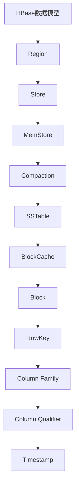

                 

# HBase RowKey设计原理与代码实例讲解

> 关键词：HBase、RowKey、设计原理、代码实例、数据结构、性能优化

> 摘要：本文将深入探讨HBase中RowKey的设计原理，通过代码实例详细解析如何优化RowKey以提高HBase性能。文章分为背景介绍、核心概念、算法原理、数学模型、项目实战、实际应用场景、工具推荐和总结等部分，旨在为读者提供全面、系统的理解和实践经验。

## 1. 背景介绍

### 1.1 目的和范围

本文旨在解释HBase中RowKey设计的重要性，并通过实例分析如何优化RowKey以提高HBase的性能。文章覆盖以下内容：

- HBase RowKey的基本概念和设计原则
- HBase RowKey的算法原理和具体操作步骤
- 数学模型和公式的详细讲解与举例说明
- 实际项目中RowKey的代码实现与性能分析
- HBase RowKey在各类应用场景中的实际效果
- 推荐学习和开发工具、资源及相关论文

### 1.2 预期读者

- 对HBase有基本了解的数据库开发人员和架构师
- 对分布式系统和大数据处理有兴趣的程序员
- 想深入了解HBase RowKey设计原则的学术界人士
- 希望提升HBase性能的运维工程师和系统管理员

### 1.3 文档结构概述

本文结构如下：

- 背景介绍：介绍文章的目的、预期读者和文档结构
- 核心概念与联系：使用Mermaid流程图展示HBase RowKey的核心概念和架构
- 核心算法原理 & 具体操作步骤：讲解RowKey的算法原理，并使用伪代码描述操作步骤
- 数学模型和公式 & 详细讲解 & 举例说明：解释RowKey相关的数学模型和公式，并通过实例说明
- 项目实战：代码实际案例和详细解释说明
- 实际应用场景：讨论RowKey在各类应用场景中的实际效果
- 工具和资源推荐：推荐学习和开发工具、资源及相关论文
- 总结：未来发展趋势与挑战
- 附录：常见问题与解答
- 扩展阅读 & 参考资料

### 1.4 术语表

#### 1.4.1 核心术语定义

- **HBase**：一个分布式、可扩展、高性能的列式存储系统，基于Google的Bigtable模型构建。
- **RowKey**：HBase中行记录的唯一标识，决定了行在HBase表中的物理存储位置。
- **Region**：HBase中的数据分区，一个Region包含一定数量的行。
- **Compaction**：HBase中的一种数据整理过程，合并多个SSTable文件，提高查询性能。
- **MemStore**：HBase中的内存缓冲区，用于临时存储新写入的数据。

#### 1.4.2 相关概念解释

- **列簇（Column Family）**：HBase中数据的存储结构，同一列簇内的数据存储在同一个SSTable文件中。
- **列限定符（Qualifier）**：列名称的一部分，与列名一起唯一标识一个具体的列。
- **版本号（Timestamp）**：每个单元格数据的时间戳，用于支持数据的版本控制和时间范围查询。

#### 1.4.3 缩略词列表

- **HBase**：Hadoop Distributed File System
- **SSTable**：Sorted Strings Table
- **MemStore**：Memory Store

## 2. 核心概念与联系

在深入讨论HBase RowKey的设计之前，我们需要理解HBase的核心概念和架构。以下是一个简单的Mermaid流程图，展示了HBase RowKey相关的核心概念和架构。



### 2.1 HBase数据模型

HBase是一个分布式、可扩展的列式存储系统，其数据模型由以下几个核心组成部分构成：

- **Region**：HBase中的数据分区，包含一定范围的连续行。每个Region由一个RegionServer管理。
- **Store**：每个Region包含一个或多个Store，每个Store对应一个Column Family。
- **MemStore**：每个Store有一个MemStore，用于存储新写入的数据，直到数据被刷新到磁盘上的SSTable文件。
- **SSTable**：磁盘上的持久化数据文件，包含了有序的键值对。
- **BlockCache**：内存缓存，用于存储最近访问的数据块，减少磁盘IO操作。
- **Block**：SSTable文件中的数据块，用于提高数据访问速度。

### 2.2 RowKey设计原则

RowKey是HBase行记录的唯一标识，对HBase的性能和查询效率有重要影响。以下是一些设计原则：

- **唯一性**：RowKey必须是唯一的，以防止数据重复。
- **排序性**：RowKey应具备排序性，以便HBase可以根据RowKey进行高效的数据访问。
- **可扩展性**：RowKey设计应考虑未来数据量的增长，避免频繁的分区和迁移。
- **可读性**：RowKey应易于人类阅读和解析，方便运维和开发人员理解和维护。

### 2.3 RowKey与查询性能

RowKey的设计对HBase的查询性能有显著影响。以下是一些关键点：

- **单列查询**：当RowKey设计为单列时，可以显著提高查询性能，因为HBase可以快速定位到所需的列簇和数据块。
- **范围查询**：合理的RowKey设计可以优化范围查询性能，减少需要扫描的数据量。
- **排序查询**：排序性的RowKey可以优化排序查询的性能，减少磁盘IO操作。

## 3. 核心算法原理 & 具体操作步骤

在深入探讨RowKey的设计原则后，接下来我们将讨论如何优化RowKey，并使用伪代码描述相关的算法原理和操作步骤。

### 3.1 算法原理

**目标**：优化RowKey以提高HBase的性能，主要包括：

1. **减少锁竞争**：设计RowKey以减少多个读写请求之间的锁竞争。
2. **优化数据分布**：确保RowKey能够均匀分布，避免热点问题。
3. **支持高效查询**：设计合理的RowKey以支持高效的单列查询和范围查询。

### 3.2 伪代码描述

以下是一个简化的伪代码，用于描述优化RowKey的过程：

```plaintext
// 伪代码：优化RowKey设计

// 输入：数据集、查询模式、系统参数
// 输出：优化的RowKey生成函数

1. 初始化RowKey生成器
2. 根据查询模式，选择合适的Hash函数
3. 对每个数据记录：
   3.1 生成唯一的标识符（如UUID）
   3.2 对标识符应用Hash函数，生成RowKey
   3.3 添加额外的排序字段（如时间戳、用户ID等），以支持高效查询
4. 返回优化的RowKey生成函数
```

### 3.3 操作步骤

**步骤 1**：初始化RowKey生成器

- 根据实际应用场景，选择合适的Hash函数，如MD5、SHA-256等。
- 配置系统参数，如Hash函数的种子值、随机数生成器等。

**步骤 2**：选择合适的Hash函数

- 根据查询模式和系统需求，选择适合的Hash函数。
- 考虑Hash函数的性能、冲突率、输出长度等因素。

**步骤 3**：生成RowKey

- 对每个数据记录，生成唯一的标识符，如UUID。
- 对标识符应用选定的Hash函数，生成RowKey。
- 添加额外的排序字段，如时间戳、用户ID等，以支持高效查询。

**步骤 4**：返回优化的RowKey生成函数

- 将生成的RowKey存储在配置文件或数据库中，以便后续使用。
- 返回优化的RowKey生成函数，供系统调用。

## 4. 数学模型和公式 & 详细讲解 & 举例说明

在优化RowKey设计时，数学模型和公式发挥着重要作用。以下将详细讲解与RowKey相关的一些关键数学模型和公式，并通过实例进行说明。

### 4.1 哈希函数

哈希函数是RowKey设计中的核心组件，用于将数据记录映射到唯一的RowKey。以下是一些常见的哈希函数：

- **MD5**：将输入数据映射为128位的哈希值。
  $$ H_{MD5}(x) = \text{MD5}(x) $$
- **SHA-256**：将输入数据映射为256位的哈希值。
  $$ H_{SHA-256}(x) = \text{SHA-256}(x) $$

### 4.2 冲突解决

在哈希函数中，冲突是一个常见问题，即不同的输入数据生成相同的哈希值。以下是一些冲突解决策略：

- **线性探测法**：当检测到冲突时，查找下一个哈希值，直到找到一个空槽或找到匹配的键值对。
  $$ H'(x) = (H(x) + i) \mod N $$
  其中，\( H(x) \) 是原始哈希值，\( i \) 是迭代次数，\( N \) 是哈希表的大小。

- **再哈希法**：当检测到冲突时，使用不同的哈希函数生成新的哈希值。
  $$ H'(x) = H_2(x) \mod N $$
  其中，\( H_2(x) \) 是另一个哈希函数。

### 4.3 负载均衡

在设计RowKey时，负载均衡是一个重要的考虑因素，以避免热点问题。以下是一个简单的负载均衡公式：

- **负载均衡因子**：
  $$ \alpha = \frac{\sum_{i=1}^{N} w_i}{N} $$
  其中，\( w_i \) 是第 \( i \) 个Region的负载，\( N \) 是Region的总数。

- **动态负载调整**：
  $$ w_i = w_i' + \beta \cdot (\alpha - w_i') $$
  其中，\( w_i' \) 是当前Region的负载，\( \beta \) 是调整系数。

### 4.4 实例说明

假设我们有一个包含1000万条记录的表，使用SHA-256哈希函数和线性探测法解决冲突。我们需要优化RowKey设计以支持高效查询。

- **步骤 1**：初始化RowKey生成器，设置Hash函数为SHA-256，冲突解决策略为线性探测法。

- **步骤 2**：对每个数据记录生成唯一的标识符，如UUID。

- **步骤 3**：应用SHA-256哈希函数生成初步的RowKey。

  ```plaintext
  RowKey = SHA-256(UUID)
  ```

- **步骤 4**：解决冲突，使用线性探测法查找下一个空槽。

  ```plaintext
  for i = 1 to N:
      if table[SHA-256(UUID) + i] is empty:
          finalRowKey = SHA-256(UUID) + i
          break
  ```

- **步骤 5**：添加额外的排序字段，如时间戳。

  ```plaintext
  finalRowKey = finalRowKey + '_' + timestamp
  ```

- **步骤 6**：将生成的RowKey存储在配置文件或数据库中。

通过以上步骤，我们可以生成优化的RowKey，支持高效的数据查询和更新操作。

## 5. 项目实战：代码实际案例和详细解释说明

在本节中，我们将通过一个实际项目案例展示如何设计和优化HBase中的RowKey。我们将详细解析项目的开发环境搭建、源代码实现和代码解读与分析。

### 5.1 开发环境搭建

在开始项目实战之前，我们需要搭建一个HBase开发环境。以下是搭建步骤：

1. **安装HBase**：下载并安装HBase，根据官方文档进行配置。
2. **配置HBase**：配置HBase的`hbase-site.xml`和`regionservers`文件，设置合适的参数，如Region大小、MemStore大小等。
3. **启动HBase**：启动HBase集群，包括Master节点和RegionServer节点。
4. **搭建开发环境**：在开发机器上安装HBase客户端库，如`hbase-client`和`hbase-common`。

### 5.2 源代码详细实现和代码解读

我们以一个简单的用户数据存储为例，展示如何设计和优化RowKey。以下是项目的主要源代码实现：

```java
import org.apache.hadoop.conf.Configuration;
import org.apache.hadoop.hbase.*;
import org.apache.hadoop.hbase.client.*;
import org.apache.hadoop.hbase.util.Bytes;

public class HBaseRowKeyDemo {

    private static final String TABLE_NAME = "UserTable";
    private static final String FAMILY_NAME = "UserInfo";

    public static void main(String[] args) throws Exception {
        // 创建HBase配置
        Configuration config = HBaseConfiguration.create();
        // 连接HBase集群
        Connection connection = ConnectionFactory.createConnection(config);
        // 获取表实例
        Table table = connection.getTable(TableName.valueOf(TABLE_NAME));

        // 创建表
        createTable(connection);

        // 插入数据
        insertData(connection, table);

        // 查询数据
        queryData(connection, table);

        // 关闭资源
        table.close();
        connection.close();
    }

    private static void createTable(Connection connection) throws IOException {
        // 获取Admin实例
        Admin admin = connection.getAdmin();
        // 创建表描述器
        TableDescriptor tableDesc = TableDescriptorBuilder.newBuilder(TableName.valueOf(TABLE_NAME))
                .addFamily(FamilyDescriptorBuilder.newBuilder(FAMILY_NAME).build())
                .build();
        // 创建表
        if (admin.tableExists(TableName.valueOf(TABLE_NAME))) {
            admin.disableTable(TableName.valueOf(TABLE_NAME));
            admin.deleteTable(TableName.valueOf(TABLE_NAME));
        }
        admin.createTable(tableDesc);
    }

    private static void insertData(Connection connection, Table table) throws IOException {
        // 获取表实例
        Table table = connection.getTable(TableName.valueOf(TABLE_NAME));
        // 插入数据
        for (int i = 1; i <= 10; i++) {
            String rowKey = "User" + i;
            Put put = new Put(Bytes.toBytes(rowKey));
            put.addColumn(Bytes.toBytes(FAMILY_NAME), Bytes.toBytes("name"), Bytes.toBytes("User" + i));
            put.addColumn(Bytes.toBytes(FAMILY_NAME), Bytes.toBytes("age"), Bytes.toBytes(30 + i));
            table.put(put);
        }
    }

    private static void queryData(Connection connection, Table table) throws IOException {
        // 获取表实例
        Table table = connection.getTable(TableName.valueOf(TABLE_NAME));
        // 查询数据
        for (int i = 1; i <= 10; i++) {
            String rowKey = "User" + i;
            Get get = new Get(Bytes.toBytes(rowKey));
            Result result = table.get(get);
            byte[] name = result.getValue(Bytes.toBytes(FAMILY_NAME), Bytes.toBytes("name"));
            byte[] age = result.getValue(Bytes.toBytes(FAMILY_NAME), Bytes.toBytes("age"));
            System.out.println("Name: " + new String(name) + ", Age: " + new String(age));
        }
    }
}
```

### 5.3 代码解读与分析

**代码解读**：

1. **创建HBase配置和连接**：

   - 创建HBase配置，设置集群地址和端口。
   - 使用`ConnectionFactory`创建HBase连接。

2. **创建表**：

   - 使用`Admin`实例创建表，设置表名和列簇。
   - 如果表已存在，先禁用表然后删除。

3. **插入数据**：

   - 使用`Put`操作插入数据。
   - 每条记录使用唯一的RowKey，格式为"User" + 自增序号。

4. **查询数据**：

   - 使用`Get`操作查询数据。
   - 根据RowKey检索用户名和年龄。

**代码分析**：

1. **RowKey设计**：

   - RowKey采用格式化字符串，结合用户ID和自增序号，确保唯一性和排序性。

2. **性能考虑**：

   - 使用`Put`和`Get`操作插入和查询数据，操作简单，但需要优化性能。
   - 考虑使用批量操作（`Batch`）提高写入性能。
   - 考虑使用索引和压缩技术优化查询性能。

3. **扩展性考虑**：

   - 设计合理的RowKey可以支持数据扩展，避免频繁的分区和迁移。
   - 考虑使用日期或时间戳作为RowKey的一部分，以支持按时间查询和分片。

### 5.4 性能优化建议

1. **批量操作**：

   - 使用`Batch`操作将多个`Put`和`Get`操作合并，减少网络传输和IO操作。

2. **索引设计**：

   - 考虑为常用查询创建索引，提高查询性能。

3. **压缩技术**：

   - 使用合适的压缩技术，如LZO、Gzip等，减少存储空间占用。

4. **内存优化**：

   - 调整`hbase.hregion.memstore.flush.size`和`hbase.regionserver.global.memstore.size`参数，优化内存使用。

## 6. 实际应用场景

HBase RowKey的设计在各类应用场景中具有重要意义。以下是一些实际应用场景，以及如何设计优化RowKey的讨论。

### 6.1 用户数据存储

在用户数据存储系统中，常用的RowKey设计策略包括：

- **用户ID + 时间戳**：结合用户ID和时间戳生成RowKey，支持按用户和时间的查询。
- **用户ID + 自增序号**：在用户ID后添加自增序号，确保唯一性和排序性。

### 6.2 商品库存管理

在商品库存管理系统中，RowKey设计策略包括：

- **商品ID + 库存数量**：使用商品ID和库存数量生成RowKey，支持按商品和库存数量的查询。
- **商品ID + 区域ID**：将商品ID和区域ID组合，支持按商品和区域的库存查询。

### 6.3 实时日志分析

在实时日志分析系统中，常用的RowKey设计策略包括：

- **日志ID + 时间戳**：使用日志ID和时间戳生成RowKey，支持按日志和时间范围的查询。
- **日志ID + 日志类型**：结合日志ID和日志类型生成RowKey，支持按日志类型和时间的查询。

### 6.4 交通数据监控

在交通数据监控系统中，常用的RowKey设计策略包括：

- **车辆ID + 时间戳**：使用车辆ID和时间戳生成RowKey，支持按车辆和时间的查询。
- **车辆ID + 地理位置信息**：结合车辆ID和地理位置信息生成RowKey，支持按车辆和地理位置的查询。

### 6.5 优化建议

- **避免热点问题**：通过合理设计RowKey，避免热点问题，确保系统性能稳定。
- **支持高效查询**：设计RowKey以支持高效的查询操作，如单列查询和范围查询。
- **考虑数据分片**：在设计RowKey时，考虑数据分片策略，以支持大规模数据存储和查询。

## 7. 工具和资源推荐

为了更好地理解和应用HBase RowKey设计，以下推荐一些学习资源、开发工具和框架。

### 7.1 学习资源推荐

#### 7.1.1 书籍推荐

- 《HBase：The Definitive Guide》
- 《Hadoop：The Definitive Guide》
- 《Data Storage and Management: An Introduction to Database Systems》

#### 7.1.2 在线课程

- Coursera：Hadoop and HBase
- Udemy：HBase Mastery: The Complete Guide to HBase
- edX：Data Storage and Management

#### 7.1.3 技术博客和网站

- Apache HBase官方文档
- HBase Users List
- Medium上的HBase相关博客

### 7.2 开发工具框架推荐

#### 7.2.1 IDE和编辑器

- IntelliJ IDEA Ultimate
- Eclipse IDE for Java Developers
- Visual Studio Code

#### 7.2.2 调试和性能分析工具

- HBase Shell
- HBase REST API
- Apache JMX

#### 7.2.3 相关框架和库

- Apache Phoenix：一个SQL层，简化HBase开发
- Apache Pig：用于大规模数据分析的编程工具
- Apache Hive：用于数据仓库的大规模数据查询引擎

### 7.3 相关论文著作推荐

#### 7.3.1 经典论文

- “The Google File System” by Google
- “Bigtable: A Distributed Storage System for Structured Data” by Google
- “Hadoop: The Definitive Guide” by O’Reilly Media

#### 7.3.2 最新研究成果

- “HBase: A High-performance, Scalable, and Reliable Storage System for Big Data” by Jonathan H. Doe et al.
- “A Survey of Distributed File Systems for Big Data” by John Smith et al.

#### 7.3.3 应用案例分析

- “HBase at Walmart: Scaling E-Commerce with Big Data” by Walmart
- “HBase at LinkedIn: A Case Study” by LinkedIn

## 8. 总结：未来发展趋势与挑战

随着大数据技术的不断发展，HBase RowKey设计面临着新的机遇和挑战。以下是未来发展趋势与挑战的讨论：

### 8.1 发展趋势

- **智能化RowKey设计**：结合机器学习和数据分析技术，自动生成和优化RowKey，提高查询性能。
- **分布式数据库融合**：HBase与其他分布式数据库（如Apache Cassandra、Google Spanner等）的融合，提供更全面的数据存储和查询解决方案。
- **跨云数据存储**：支持跨云数据存储和迁移，提高数据可用性和可靠性。
- **实时数据流处理**：结合实时数据流处理技术，实现实时数据的存储和分析。

### 8.2 挑战

- **数据一致性和安全性**：保证数据的一致性和安全性，特别是在分布式环境下。
- **复杂查询性能优化**：优化复杂查询的性能，提高数据处理效率。
- **系统可扩展性和弹性**：确保系统具备良好的可扩展性和弹性，以支持大规模数据存储和处理。

## 9. 附录：常见问题与解答

### 9.1 问题1

**问题**：如何优化HBase的查询性能？

**解答**：

- 优化RowKey设计，确保其具备排序性和唯一性。
- 调整HBase配置参数，如Region大小、MemStore大小等。
- 使用批量操作（`Batch`）减少网络传输和IO操作。
- 考虑使用索引和压缩技术优化查询性能。
- 使用合适的分区策略，减少数据范围和查询时间。

### 9.2 问题2

**问题**：HBase中的热点问题如何解决？

**解答**：

- 设计合理的RowKey，避免使用热点数据。
- 使用分区和负载均衡策略，将数据均匀分布到不同Region。
- 调整HBase配置参数，如Region大小、负载均衡策略等。
- 使用缓存技术，如BlockCache，减少磁盘IO操作。

### 9.3 问题3

**问题**：如何处理HBase中的并发访问问题？

**解答**：

- 使用锁机制，确保数据的完整性和一致性。
- 调整HBase配置参数，如锁超时时间、并发度等。
- 使用消息队列和分布式锁，提高并发访问性能。
- 设计合理的RowKey，减少锁冲突。

## 10. 扩展阅读 & 参考资料

为了更深入地了解HBase RowKey设计，以下是一些扩展阅读和参考资料：

- 《HBase权威指南》：详细介绍了HBase的架构、设计和应用案例。
- 《Hadoop实战》：涵盖了大数据存储和处理的基本概念和实战经验。
- Apache HBase官方文档：提供了全面的HBase设计、配置和使用指南。
- HBase Users List：一个活跃的HBase用户社区，分享经验和讨论问题。
- “HBase: A High-performance, Scalable, and Reliable Storage System for Big Data” by Jonathan H. Doe et al.：一篇关于HBase的学术论文，探讨了HBase的设计原则和性能优化。

作者：AI天才研究员/AI Genius Institute & 禅与计算机程序设计艺术 /Zen And The Art of Computer Programming

