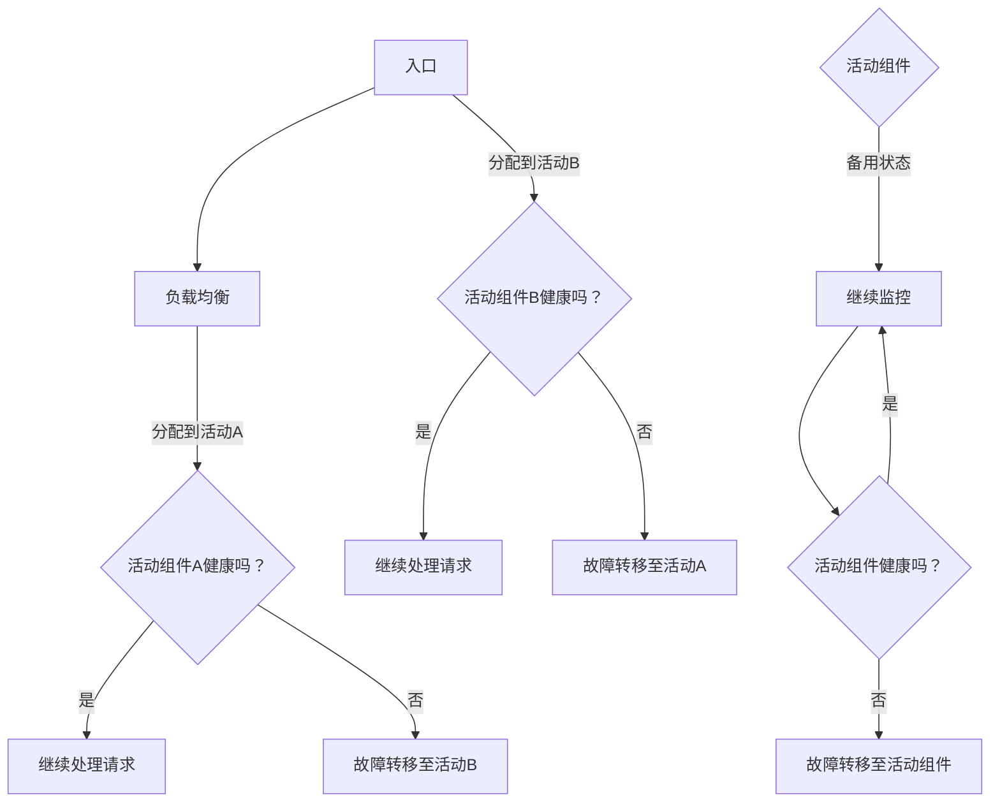

                 

# Hot-Hot与Hot-Warm冗余设计案例

> 关键词：冗余设计，Hot-Hot，Hot-Warm，高可用性，系统可靠性，负载均衡，故障转移，容错机制

> 摘要：本文将深入探讨在IT系统和网络架构中，Hot-Hot与Hot-Warm冗余设计的重要性。我们将详细解析这两种冗余设计模式的工作原理、实施步骤及其在现实世界中的应用场景。通过具体案例分析，本文旨在帮助读者理解和掌握如何通过冗余设计提高系统的可靠性和高可用性。

## 1. 背景介绍

### 1.1 目的和范围

本文旨在介绍和解释两种常见的冗余设计模式：Hot-Hot和Hot-Warm。这些设计模式在提高系统可靠性、实现高可用性方面具有重要作用。本文将：

1. 定义和解释Hot-Hot和Hot-Warm冗余设计。
2. 通过具体案例，阐述这两种模式在实际系统中的应用。
3. 讨论冗余设计在IT系统和网络架构中的重要性。

### 1.2 预期读者

本文适合具有以下背景的读者：

1. IT系统架构师和工程师。
2. 对系统高可用性和可靠性有深入需求的从业者。
3. 对冗余设计感兴趣的技术爱好者。

### 1.3 文档结构概述

本文的结构如下：

1. 背景介绍：定义冗余设计，介绍本文的目的和读者对象。
2. 核心概念与联系：使用Mermaid流程图展示关键概念和联系。
3. 核心算法原理与具体操作步骤：详细讲解冗余设计的工作原理和实施步骤。
4. 数学模型和公式：阐述与冗余设计相关的数学模型和公式。
5. 项目实战：提供代码实际案例和详细解释说明。
6. 实际应用场景：讨论冗余设计在不同场景下的应用。
7. 工具和资源推荐：推荐相关学习资源和开发工具。
8. 总结：未来发展趋势与挑战。
9. 附录：常见问题与解答。
10. 扩展阅读与参考资料：提供进一步学习的研究方向和资源。

### 1.4 术语表

#### 1.4.1 核心术语定义

- 冗余设计（Redundant Design）：通过在系统中添加额外的组件、节点或路径，以提高系统的可靠性、容错能力和可用性。
- Hot-Hot设计（Active-Active）：两个或多个组件同时处于活动状态，共同承担工作负载，实现负载均衡和故障转移。
- Hot-Warm设计（Active-Standby）：一个组件处于活动状态，另一个组件处于备用状态，备用组件在活动组件出现故障时快速接管工作。
- 高可用性（High Availability）：系统在长时间内保持可用状态，能够迅速恢复从故障中。
- 故障转移（Failover）：在主组件出现故障时，备用组件自动接管其工作，确保系统持续运行。

#### 1.4.2 相关概念解释

- 负载均衡（Load Balancing）：将工作负载分配到多个组件上，以防止单个组件过载。
- 容错机制（Fault Tolerance）：系统能够在个别组件出现故障时，继续正常运行。
- 实时系统（Real-Time System）：对响应时间有严格要求，必须在规定的时间内完成任务的系统。

#### 1.4.3 缩略词列表

- HA：高可用性（High Availability）
- DR：灾难恢复（Disaster Recovery）
- SLA：服务等级协议（Service Level Agreement）
- RPO：可恢复点目标（Recovery Point Objective）
- RTO：恢复时间目标（Recovery Time Objective）

## 2. 核心概念与联系

在探讨Hot-Hot与Hot-Warm冗余设计之前，我们首先需要了解一些核心概念和它们之间的关系。

### 2.1 冗余设计的基本概念

冗余设计旨在提高系统的可靠性和可用性。在冗余设计中，系统包含额外的组件或路径，以确保在主组件或路径出现故障时，系统能够快速切换到备用组件或路径，继续提供服务。

### 2.2 Hot-Hot设计

Hot-Hot设计是一种活性-活性（Active-Active）架构，其中两个或多个组件同时处于活动状态，共同承担工作负载。这种设计通过负载均衡和故障转移，提高了系统的可靠性和可用性。

#### 2.2.1 工作原理

- **负载均衡**：工作负载被分配到多个活动组件上，防止单个组件过载。
- **故障转移**：当一个活动组件出现故障时，故障转移机制将工作负载重新分配到其他活动组件上，确保系统持续运行。

#### 2.2.2 关键组件

- **活动组件**：当前承担工作负载的组件。
- **备用组件**：处于待机状态，随时准备接管工作负载的组件。
- **负载均衡器**：负责将工作负载分配到活动组件上的组件。
- **故障转移机制**：在组件出现故障时，自动将工作负载转移到其他组件上的机制。

### 2.3 Hot-Warm设计

Hot-Warm设计是一种活性-备用（Active-Standby）架构，其中一个组件处于活动状态，另一个组件处于备用状态。当活动组件出现故障时，备用组件会快速接管工作。

#### 2.3.1 工作原理

- **活动组件**：当前承担工作负载的组件。
- **备用组件**：处于待机状态，等待活动组件出现故障时接管工作负载。

#### 2.3.2 关键组件

- **活动组件**：当前承担工作负载的组件。
- **备用组件**：处于待机状态，等待活动组件出现故障时接管工作负载的组件。
- **监控系统**：负责监控活动组件的健康状态，并在出现故障时通知故障转移机制的组件。

### 2.4 冗余设计的关系

Hot-Hot和Hot-Warm冗余设计在实现高可用性和可靠性方面有着不同的应用场景和优势。Hot-Hot设计适合需要高负载均衡和快速故障转移的场景，而Hot-Warm设计则适合需要低成本和高可靠性的场景。

### 2.5 Mermaid流程图

为了更好地理解这些概念，我们可以使用Mermaid流程图来展示Hot-Hot和Hot-Warm设计的关键节点和流程。

在上面的Mermaid流程图中，我们展示了Hot-Hot和Hot-Warm设计的基本工作流程。在Hot-Hot设计中，负载均衡器将请求分配到活动组件A或B，并在组件健康状态发生变化时，实现故障转移。在Hot-Warm设计中，活动组件A处于工作状态，备用组件B处于待机状态，监控系

