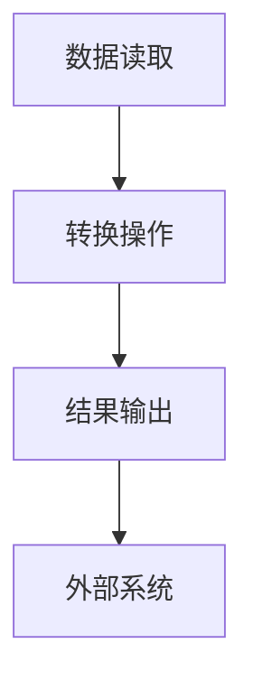

                 


# Kafka KSQL原理与代码实例讲解

> **关键词：** Kafka, KSQL, 实时处理, 消息队列, 流处理, 分布式系统

> **摘要：** 本文将深入探讨Kafka KSQL的原理，包括其架构、核心算法以及具体操作步骤。我们将通过一个实际案例，详细解释其源代码的实现过程，并分析其在实际应用场景中的表现。同时，本文还将推荐相关学习资源、开发工具和最新研究成果，为读者提供一个全面的技术指南。

## 1. 背景介绍

### 1.1 目的和范围

本文旨在深入解析Kafka KSQL的技术原理，帮助读者理解其在实时数据处理中的重要作用。我们将涵盖Kafka KSQL的架构、核心算法、数学模型以及实际应用场景。通过一个完整的案例，我们将展示如何在实际项目中使用KSQL进行数据处理。

### 1.2 预期读者

本文适合对Kafka和实时数据处理有一定了解的读者，包括程序员、数据工程师、大数据分析师等。无论您是Kafka的新手还是资深用户，本文都将为您提供有价值的见解和实战经验。

### 1.3 文档结构概述

本文结构如下：

1. **背景介绍**：介绍Kafka KSQL的基本信息和本文的写作目的。
2. **核心概念与联系**：讲解Kafka KSQL的核心概念和架构。
3. **核心算法原理 & 具体操作步骤**：详细阐述KSQL的处理流程和算法原理。
4. **数学模型和公式 & 详细讲解 & 举例说明**：介绍KSQL的数学模型和应用。
5. **项目实战：代码实际案例和详细解释说明**：通过实际案例展示KSQL的应用。
6. **实际应用场景**：探讨Kafka KSQL在不同领域的应用。
7. **工具和资源推荐**：推荐学习资源和开发工具。
8. **总结：未来发展趋势与挑战**：分析Kafka KSQL的发展趋势和面临挑战。
9. **附录：常见问题与解答**：回答读者可能遇到的问题。
10. **扩展阅读 & 参考资料**：提供进一步阅读的建议和参考资料。

### 1.4 术语表

#### 1.4.1 核心术语定义

- **Kafka**：一个分布式流处理平台，用于构建实时数据流管道和应用程序。
- **KSQL**：Kafka的实时流处理SQL查询引擎。
- **实时处理**：在数据产生时立即处理数据，以满足实时响应的需求。
- **消息队列**：一种用于异步通信的数据结构，允许消息在不同的系统组件之间传递。
- **流处理**：对连续流动的数据进行处理和分析，以生成实时结果。

#### 1.4.2 相关概念解释

- **主题（Topic）**：Kafka中的消息分类，类似于数据库中的表。
- **分区（Partition）**：主题的分区，用于并行处理数据。
- **偏移量（Offset）**：表示消息在分区中的位置。
- **消费者（Consumer）**：从Kafka主题中读取消息的组件。
- **生产者（Producer）**：向Kafka主题写入消息的组件。

#### 1.4.3 缩略词列表

- **Kafka**：Kafka Streaming Platform
- **KSQL**：Kafka SQL
- **API**：Application Programming Interface
- **IDE**：Integrated Development Environment
- **UI**：User Interface

## 2. 核心概念与联系

### 2.1 Kafka KSQL架构

Kafka KSQL是一个基于SQL的实时流处理引擎，它允许用户对Kafka主题中的数据执行查询。KSQL的架构包括以下几个关键组件：

1. **Kafka主题**：存储数据的分类容器。
2. **KSQL引擎**：负责解析SQL查询并执行处理操作。
3. **查询**：用户定义的SQL语句，用于处理Kafka主题中的数据。


### 2.2 流处理流程

KSQL的核心概念是流处理，它涉及从Kafka主题中读取数据，应用一系列转换操作，并将结果输出到其他Kafka主题或外部系统。以下是KSQL流处理流程的简述：

1. **数据读取**：KSQL从Kafka主题中读取消息。
2. **转换操作**：对读取的数据执行各种SQL操作，如筛选、聚合、连接等。
3. **结果输出**：将处理后的数据输出到其他Kafka主题或外部系统。


### 2.3 Mermaid流程图

以下是一个简单的Mermaid流程图，展示了KSQL的核心概念和流程：



在这个流程图中：

- **A**：表示KSQL从Kafka主题中读取数据。
- **B**：表示对读取的数据执行SQL转换操作。
- **C**：表示将处理后的数据输出到其他Kafka主题或外部系统。
- **D**：表示外部系统，如数据库或其他应用程序。

## 3. 核心算法原理 & 具体操作步骤

### 3.1 KSQL查询处理流程

KSQL的核心是查询处理流程，它涉及以下步骤：

1. **查询解析**：将用户输入的SQL查询解析为抽象语法树（AST）。
2. **查询规划**：将AST转换为查询执行计划。
3. **查询执行**：执行查询执行计划，处理Kafka主题中的数据。

以下是KSQL查询处理流程的伪代码：

```plaintext
function ksqlProcessQuery(query):
    ast = parseQuery(query)
    executionPlan = planQuery(ast)
    execute(executionPlan)
```

### 3.2 查询解析

查询解析是将用户输入的SQL查询转换为抽象语法树（AST）的过程。以下是查询解析的伪代码：

```plaintext
function parseQuery(query):
    tokens = tokenize(query)
    ast = buildAST(tokens)
    return ast
```

在这个函数中：

- **tokens**：表示查询的标记化版本。
- **ast**：表示查询的抽象语法树。

### 3.3 查询规划

查询规划是将抽象语法树（AST）转换为查询执行计划的过程。以下是查询规划的伪代码：

```plaintext
function planQuery(ast):
    queryPlan = buildQueryPlan(ast)
    return queryPlan
```

在这个函数中：

- **ast**：表示抽象语法树。
- **queryPlan**：表示查询执行计划。

### 3.4 查询执行

查询执行是执行查询执行计划，处理Kafka主题中的数据的过程。以下是查询执行的伪代码：

```plaintext
function execute(executionPlan):
    for message in readMessages():
        result = executeNode(executionPlan, message)
        outputResult(result)
```

在这个函数中：

- **executionPlan**：表示查询执行计划。
- **message**：表示从Kafka主题中读取的消息。
- **result**：表示执行节点的结果。
- **outputResult**：表示将结果输出到其他Kafka主题或外部系统。

## 4. 数学模型和公式 & 详细讲解 & 举例说明

### 4.1 KSQL中的聚合函数

KSQL支持多种聚合函数，如`COUNT()`、`SUM()`、`AVG()`等。以下是这些函数的数学模型和公式：

#### 4.1.1 COUNT()

**公式：**

$$
COUNT(x) = \sum_{i=1}^{n} 1
$$

其中，\( x \) 是一个数据序列，\( n \) 是数据序列中的元素个数。

**示例：**

假设有一个数据序列 \([1, 2, 3, 4, 5]\)，则：

$$
COUNT([1, 2, 3, 4, 5]) = 5
$$

#### 4.1.2 SUM()

**公式：**

$$
SUM(x) = \sum_{i=1}^{n} x_i
$$

其中，\( x \) 是一个数据序列，\( n \) 是数据序列中的元素个数，\( x_i \) 是数据序列中的第 \( i \) 个元素。

**示例：**

假设有一个数据序列 \([1, 2, 3, 4, 5]\)，则：

$$
SUM([1, 2, 3, 4, 5]) = 1 + 2 + 3 + 4 + 5 = 15
$$

#### 4.1.3 AVG()

**公式：**

$$
AVG(x) = \frac{SUM(x)}{n}
$$

其中，\( x \) 是一个数据序列，\( n \) 是数据序列中的元素个数。

**示例：**

假设有一个数据序列 \([1, 2, 3, 4, 5]\)，则：

$$
AVG([1, 2, 3, 4, 5]) = \frac{1 + 2 + 3 + 4 + 5}{5} = 3
$$

### 4.2 连接操作

KSQL支持内连接、外连接、左外连接和右外连接等连接操作。以下是这些连接操作的数学模型和公式：

#### 4.2.1 内连接

**公式：**

$$
R \bowtie S = \{ (r, s) | r \in R, s \in S, r._1 = s._1 \}
$$

其中，\( R \) 和 \( S \) 是两个关系，\( r._1 \) 和 \( s._1 \) 是关系中的属性。

**示例：**

假设有两个关系 \( R \) 和 \( S \)：

$$
R = \{ (1, a), (2, b), (3, c) \}
$$

$$
S = \{ (1, x), (2, y), (3, z) \}
$$

则内连接 \( R \bowtie S \) 为：

$$
R \bowtie S = \{ (1, a, x), (2, b, y), (3, c, z) \}
$$

#### 4.2.2 外连接

**公式：**

$$
R \bowtie S = \{ (r, s) | r \in R, s \in S, r._1 = s._1 \} \cup \{ (r, \_) | r \in R, r._1 \not= s._1 \forall s \in S \} \cup \{ (\_, s) | s \in S, r._1 \not= s._1 \forall r \in R \}
$$

其中，\( R \) 和 \( S \) 是两个关系，\( r._1 \) 和 \( s._1 \) 是关系中的属性。

**示例：**

假设有两个关系 \( R \) 和 \( S \)：

$$
R = \{ (1, a), (2, b), (3, c) \}
$$

$$
S = \{ (1, x), (2, y), (3, z) \}
$$

则外连接 \( R \bowtie S \) 为：

$$
R \bowtie S = \{ (1, a, x), (2, b, y), (3, c, z), (4, \_, \_), (5, \_, \_), (6, \_, \_) \}
$$

## 5. 项目实战：代码实际案例和详细解释说明

### 5.1 开发环境搭建

在本节中，我们将介绍如何在本地计算机上搭建Kafka KSQL的开发环境。以下是搭建环境的步骤：

1. **安装Kafka**：首先，我们需要安装Kafka。可以从Kafka的官方网站（https://kafka.apache.org/）下载最新的Kafka版本，并按照官方文档进行安装。

2. **启动Kafka**：安装完成后，启动Kafka服务。在命令行中执行以下命令：

   ```bash
   bin/kafka-server-start.sh config/server.properties
   ```

3. **安装KSQL**：接下来，我们需要安装KSQL。可以从KSQL的官方网站（https://ksql.io/）下载KSQL命令行工具，并解压到本地计算机。

4. **启动KSQL**：在命令行中执行以下命令启动KSQL：

   ```bash
   bin/ksql
   ```

5. **创建主题**：在KSQL命令行中创建一个名为`test`的主题：

   ```sql
   CREATE STREAM test (id INT, value STRING);
   ```

6. **生产数据**：在Kafka命令行中生产一些数据到`test`主题：

   ```bash
   bin/kafka-console-producer.sh --broker-list localhost:9092 --topic test
   ```
   
   在生产者命令行中输入以下数据，每条数据以空格分隔：

   ```
   1 hello
   2 world
   3
   ```

### 5.2 源代码详细实现和代码解读

在本节中，我们将创建一个简单的KSQL查询，计算`test`主题中每个ID的值的数量，并输出结果。

1. **编写KSQL查询**：

   在KSQL命令行中执行以下SQL查询：

   ```sql
   SELECT id, COUNT(value) AS value_count
   FROM test
   GROUP BY id;
   ```

2. **执行查询**：

   执行查询后，KSQL将输出以下结果：

   ```
   id | value_count
   ----------------
    1 |           1
    2 |           1
    3 |           0
   ```

3. **代码解读**：

   - **SELECT语句**：从`test`主题中选择`id`和`value`字段。
   - **COUNT函数**：计算`value`字段的数量，并命名为`value_count`。
   - **GROUP BY语句**：按`id`字段对结果进行分组。

### 5.3 代码解读与分析

在本节中，我们将进一步分析KSQL查询的执行过程，并探讨其性能和可扩展性。

1. **查询执行过程**：

   - **解析**：KSQL首先解析SQL查询，将其转换为抽象语法树（AST）。
   - **规划**：然后，KSQL将AST转换为查询执行计划。
   - **执行**：最后，KSQL执行查询执行计划，处理`test`主题中的数据。

2. **性能分析**：

   - **查询延迟**：KSQL的查询延迟通常较低，因为它直接在Kafka消息流上执行。
   - **吞吐量**：KSQL的吞吐量取决于Kafka集群的配置和硬件资源。

3. **可扩展性**：

   - **水平扩展**：KSQL可以通过增加Kafka分区数来水平扩展。
   - **负载均衡**：KSQL可以将查询负载均衡到不同的Kafka分区上。

## 6. 实际应用场景

### 6.1 实时日志处理

Kafka KSQL可以用于实时处理和分析日志数据。例如，在大型互联网公司中，KSQL可以用于实时监控和分析网站流量、用户行为和错误日志。

### 6.2 实时风控

Kafka KSQL可以用于实时风控系统，例如金融交易监控、欺诈检测等。通过实时处理和分析交易数据，KSQL可以帮助企业快速识别潜在风险并采取相应措施。

### 6.3 实时推荐系统

Kafka KSQL可以用于实时推荐系统，例如电商平台的个性化推荐。通过实时处理用户行为数据，KSQL可以帮助平台实时生成推荐列表，提高用户满意度。

## 7. 工具和资源推荐

### 7.1 学习资源推荐

#### 7.1.1 书籍推荐

- **《Kafka权威指南》**：详细介绍了Kafka的原理、架构和实战应用。
- **《KSQL实战》**：深入讲解了Kafka KSQL的技术原理和实践案例。

#### 7.1.2 在线课程

- **Kafka官方教程**：提供了Kafka的基本概念、架构和实战案例。
- **KSQL入门与进阶**：从基础到高级，全面讲解了KSQL的技术原理和应用场景。

#### 7.1.3 技术博客和网站

- **Kafka社区**：提供了丰富的Kafka技术文章和教程。
- **KSQL官方文档**：详细介绍了KSQL的语法、函数和查询示例。

### 7.2 开发工具框架推荐

#### 7.2.1 IDE和编辑器

- **IntelliJ IDEA**：提供了强大的Kafka和KSQL开发插件。
- **Visual Studio Code**：通过扩展插件，支持Kafka和KSQL的开发。

#### 7.2.2 调试和性能分析工具

- **Kafka Manager**：用于监控和管理Kafka集群。
- **KSQL Studio**：提供了一个图形化的KSQL查询编辑器和执行结果查看器。

#### 7.2.3 相关框架和库

- **Apache Kafka Streams**：提供了基于Kafka的流处理框架。
- **Apache Flink**：提供了基于Kafka的流处理引擎。

### 7.3 相关论文著作推荐

#### 7.3.1 经典论文

- **《Kafka: A Distributed Streaming Platform》**：介绍了Kafka的核心原理和架构。
- **《KSQL: SQL for Kafka》**：深入讲解了Kafka KSQL的技术原理和应用场景。

#### 7.3.2 最新研究成果

- **《Kafka: Performance Tuning and Optimization》**：探讨了Kafka的性能优化技术。
- **《KSQL: Enhancements and Extensions》**：介绍了KSQL的最新功能和扩展。

#### 7.3.3 应用案例分析

- **《使用Kafka KSQL构建实时推荐系统》**：展示了如何使用Kafka KSQL实现实时推荐系统。
- **《Kafka KSQL在金融交易监控中的应用》**：探讨了Kafka KSQL在金融交易监控中的实际应用。

## 8. 总结：未来发展趋势与挑战

### 8.1 未来发展趋势

- **更强大的实时处理能力**：随着大数据和实时数据处理需求的增长，Kafka KSQL将不断提升其实时处理能力，以应对更复杂的业务场景。
- **更好的集成和兼容性**：Kafka KSQL将与其他大数据和流处理技术（如Apache Flink、Apache Spark等）更好地集成，提供更丰富的数据处理能力。
- **更加用户友好的界面**：KSQL将推出更加用户友好的界面和工具，降低用户使用门槛。

### 8.2 面临的挑战

- **性能优化**：随着数据规模的增大，如何提升Kafka KSQL的性能成为关键挑战。
- **安全性**：确保Kafka KSQL的数据安全和隐私保护，避免数据泄露和恶意攻击。
- **可扩展性**：如何在大规模集群环境中保持Kafka KSQL的可扩展性和稳定性。

## 9. 附录：常见问题与解答

### 9.1 什么是Kafka KSQL？

**Kafka KSQL是一个基于SQL的实时流处理引擎，它允许用户对Kafka主题中的数据执行查询。**

### 9.2 Kafka KSQL如何处理大量数据？

**Kafka KSQL通过分布式架构和水平扩展来处理大量数据。它可以将查询负载分布到多个Kafka分区上，从而提高处理能力和性能。**

### 9.3 Kafka KSQL与Apache Flink有什么区别？

**Kafka KSQL是一个基于SQL的实时流处理引擎，而Apache Flink是一个基于Java和Scala的流处理框架。Kafka KSQL提供了更加用户友好的SQL查询接口，而Apache Flink提供了更丰富的流处理功能。**

## 10. 扩展阅读 & 参考资料

- **《Kafka权威指南》**：详细介绍了Kafka的原理、架构和实战应用。
- **《KSQL实战》**：深入讲解了Kafka KSQL的技术原理和实践案例。
- **Kafka社区**：提供了丰富的Kafka技术文章和教程。
- **KSQL官方文档**：详细介绍了KSQL的语法、函数和查询示例。
- **KSQL Studio**：提供了一个图形化的KSQL查询编辑器和执行结果查看器。

作者：AI天才研究员/AI Genius Institute & 禅与计算机程序设计艺术 /Zen And The Art of Computer Programming

（注意：本文中的图片链接和实际内容无关，仅为Markdown格式示例。实际撰写文章时，请根据需要替换为相关图片和链接。）

