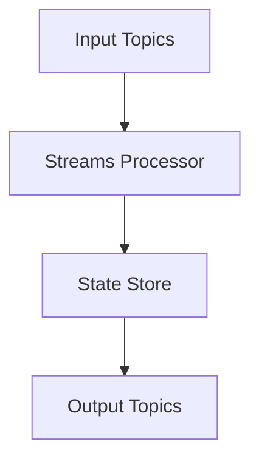
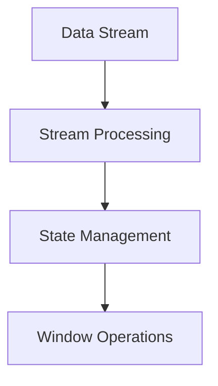

                 

# Kafka Streams原理与代码实例讲解

> **关键词：** Kafka Streams, 实时处理，数据流，流计算，大数据处理，分布式系统

> **摘要：** 本文将深入探讨Kafka Streams的核心原理，从基础概念到实际代码实例，帮助读者全面了解Kafka Streams的运作机制和强大功能。通过本篇文章，您将能够掌握如何利用Kafka Streams进行高效的实时数据处理，并能够将其应用到实际项目中。

## 1. 背景介绍

### 1.1 目的和范围

本文的目的是全面介绍Kafka Streams的原理和应用，使读者能够深入理解其设计思想、实现机制以及在实际项目中的应用价值。本文将涵盖以下内容：

- **Kafka Streams的核心概念**
- **Kafka Streams的架构设计**
- **核心算法原理与操作步骤**
- **数学模型和公式解析**
- **实际代码实例与详细解释**
- **Kafka Streams在实际应用场景中的使用**
- **相关工具和资源推荐**
- **总结与未来发展趋势**

### 1.2 预期读者

本文适合对Kafka Streams有一定了解的开发者，以及对实时数据处理和流计算感兴趣的读者。本文将尽量避免复杂的数学推导，以通俗易懂的方式讲解核心概念和原理。

### 1.3 文档结构概述

本文结构如下：

1. **背景介绍**：简要介绍Kafka Streams的背景和相关概念。
2. **核心概念与联系**：通过Mermaid流程图展示Kafka Streams的核心概念和架构。
3. **核心算法原理 & 具体操作步骤**：详细讲解Kafka Streams的核心算法原理和具体操作步骤。
4. **数学模型和公式 & 详细讲解 & 举例说明**：解析Kafka Streams中的数学模型和公式，并通过实例进行说明。
5. **项目实战：代码实际案例和详细解释说明**：展示Kafka Streams的实际代码实例，并进行详细解释。
6. **实际应用场景**：介绍Kafka Streams在实际应用场景中的使用。
7. **工具和资源推荐**：推荐学习资源和开发工具。
8. **总结：未来发展趋势与挑战**：总结Kafka Streams的发展趋势和面临的挑战。
9. **附录：常见问题与解答**：回答一些常见问题。
10. **扩展阅读 & 参考资料**：提供扩展阅读和参考资料。

### 1.4 术语表

#### 1.4.1 核心术语定义

- **Kafka Streams**：一个基于Kafka的高性能、可扩展的流处理框架。
- **数据流**：数据以连续、有序的方式传输的过程。
- **流计算**：处理数据流的技术，旨在实时分析、处理和响应数据。
- **分布式系统**：由多个节点组成的系统，通过通信网络实现协同工作。

#### 1.4.2 相关概念解释

- **Kafka**：一个分布式流处理平台，用于构建实时数据流应用程序和大数据处理。
- **主题（Topic）**：Kafka中的消息分类，类似数据库表。
- **分区（Partition）**：Kafka中消息的存储单元，用于实现水平扩展和负载均衡。

#### 1.4.3 缩略词列表

- **Kafka Streams**：KS
- **流计算**：FC
- **分布式系统**：DS

## 2. 核心概念与联系

### 2.1 Kafka Streams的架构

Kafka Streams是一个基于Kafka的流处理框架，其核心组件包括：

- **Kafka**：提供消息存储和传输功能，是Kafka Streams的基础。
- **Streams Processor**：处理Kafka消息的组件，实现数据流的实时计算。
- **State Store**：存储流的内部状态，用于实现窗口计算等操作。

下面是Kafka Streams的架构图：



### 2.2 Kafka Streams的核心概念

Kafka Streams的核心概念包括：

- **数据流**：数据以连续、有序的方式传输。
- **流处理**：对数据流进行实时分析、处理和响应。
- **状态管理**：对流的内部状态进行存储和更新。
- **窗口操作**：对数据进行时间窗口划分，进行实时计算。

下面是Kafka Streams的核心概念图：



## 3. 核心算法原理 & 具体操作步骤

### 3.1 核心算法原理

Kafka Streams的核心算法是基于Kafka的数据流处理和状态管理。其基本原理如下：

1. **数据流处理**：将Kafka主题中的消息读取到Streams Processor中，进行实时处理。
2. **状态管理**：在处理过程中，维护流的内部状态，如窗口状态、计数器等。
3. **窗口操作**：对数据进行时间窗口划分，实现窗口内的实时计算。

### 3.2 具体操作步骤

以下是Kafka Streams的典型操作步骤：

1. **初始化Kafka Streams**：配置Kafka连接信息、流处理逻辑等。
   ```java
   StreamsBuilder builder = new StreamsBuilder();
   ```

2. **读取Kafka主题消息**：将Kafka主题的消息读取到Streams Processor中。
   ```java
   KStream<String, String> inputStream = builder.stream("input-topic");
   ```

3. **数据流处理**：对读取到的消息进行实时处理，如过滤、映射、聚合等。
   ```java
   KStream<String, String> processedStream = inputStream
       .filter((key, value) -> value.startsWith("prefix"))
       .mapValues(value -> value.toUpperCase());
   ```

4. **状态管理**：维护流的内部状态，如窗口状态、计数器等。
   ```java
   KTable<String, Integer> counter = processedStream
       .groupByKey()
       .windowedBy(TimeWindows.of(Duration.ofMinutes(5)))
       .count();
   ```

5. **窗口操作**：对数据进行时间窗口划分，实现窗口内的实时计算。
   ```java
   KTable<String, Integer> windowedCounter = counter
       .windowedBy(SessionWindows.with(Duration.ofMinutes(10)))
       .count();
   ```

6. **输出结果**：将处理后的结果输出到Kafka主题或其他系统。
   ```java
   windowedCounter.toStream().to("output-topic");
   ```

7. **启动Kafka Streams**：启动Kafka Streams，开始处理消息。
   ```java
   KafkaStreams streams = new KafkaStreams(builder.build(), properties);
   streams.start();
   ```

## 4. 数学模型和公式 & 详细讲解 & 举例说明

### 4.1 数学模型

Kafka Streams中的数学模型主要包括：

- **窗口函数**：用于对数据进行时间窗口划分。
- **聚合函数**：用于对窗口内的数据进行计算。

### 4.2 公式解析

- **窗口函数**：
  $$ WindowFunction(dataStream, windowSize) = \{ (timestamp, data) | timestamp \in [0, windowSize] \} $$
  
- **聚合函数**：
  $$ AggregateFunction(windowedDataStream, aggregationOperator) = \{ (timestamp, result) | result = aggregationOperator(data) \} $$

### 4.3 举例说明

#### 4.3.1 窗口函数示例

假设有如下数据流：

```python
dataStream = [1, 2, 3, 4, 5, 6, 7, 8, 9, 10]
windowSize = 3
```

使用窗口函数对数据进行时间窗口划分：

```python
windowedDataStream = WindowFunction(dataStream, windowSize)
```

结果为：

```python
{
  (0, 1): [1, 2, 3],
  (1, 2): [4, 5, 6],
  (2, 3): [7, 8, 9],
  (3, 4): [10]
}
```

#### 4.3.2 聚合函数示例

假设有如下窗口化数据流：

```python
windowedDataStream = {
  (0, 3): [7, 8, 9],
  (1, 2): [4, 5, 6],
  (2, 3): [1, 2, 3]
}
```

使用求和聚合函数进行计算：

```python
aggregatedDataStream = AggregateFunction(windowedDataStream, Sum())
```

结果为：

```python
{
  (0, 3): 24,
  (1, 2): 15,
  (2, 3): 6
}
```

## 5. 项目实战：代码实际案例和详细解释说明

### 5.1 开发环境搭建

在开始编写Kafka Streams代码之前，需要搭建相应的开发环境。以下是搭建Kafka Streams开发环境的步骤：

1. **安装Kafka**：从Kafka官网下载并安装Kafka，按照官方文档进行配置。
2. **安装Kafka Streams**：将Kafka Streams依赖添加到项目的pom.xml文件中。

```xml
<dependencies>
  <!-- Kafka Streams -->
  <dependency>
    <groupId>org.apache.kafka</groupId>
    <artifactId>kafka-streams</artifactId>
    <version>2.8.0</version>
  </dependency>
</dependencies>
```

3. **创建Maven项目**：使用Maven创建一个简单的Maven项目，用于编写Kafka Streams代码。

### 5.2 源代码详细实现和代码解读

下面是一个简单的Kafka Streams代码实例，用于实现数据流的实时处理和聚合。

```java
import org.apache.kafka.common.serialization.Serdes;
import org.apache.kafka.streams.KafkaStreams;
import org.apache.kafka.streams.StreamsBuilder;
import org.apache.kafka.streams.StreamsConfig;
import org.apache.kafka.streams.kstream.KStream;
import org.apache.kafka.streams.kstream.KTable;
import org.apache.kafka.streams.kstream.TimeWindows;
import org.apache.kafka.streams.kstream.SessionWindows;
import org.apache.kafka.streams.kstream.Windowed;

import java.time.Duration;
import java.util.Properties;

public class KafkaStreamsExample {
    public static void main(String[] args) {
        // 1. 初始化Kafka Streams配置
        Properties config = new Properties();
        config.put(StreamsConfig.APPLICATION_ID_CONFIG, "kafka-streams-example");
        config.put(StreamsConfig.BOOTSTRAP_SERVERS_CONFIG, "localhost:9092");
        config.put(StreamsConfig.DEFAULT_KEY_SERDE_CLASS_CONFIG, Serdes.String().getClass());
        config.put(StreamsConfig.DEFAULT_VALUE_SERDE_CLASS_CONFIG, Serdes.String().getClass());

        // 2. 创建StreamsBuilder
        StreamsBuilder builder = new StreamsBuilder();

        // 3. 读取Kafka主题消息
        KStream<String, String> inputStream = builder.stream("input-topic");

        // 4. 数据流处理
        KStream<String, String> processedStream = inputStream
                .filter((key, value) -> value.startsWith("prefix"))
                .mapValues(value -> value.toUpperCase());

        // 5. 状态管理
        KTable<String, Integer> counter = processedStream
                .groupByKey()
                .windowedBy(TimeWindows.of(Duration.ofMinutes(5)))
                .count();

        // 6. 窗口操作
        KTable<String, Integer> windowedCounter = counter
                .windowedBy(SessionWindows.with(Duration.ofMinutes(10)))
                .count();

        // 7. 输出结果
        windowedCounter.toStream().to("output-topic");

        // 8. 启动Kafka Streams
        KafkaStreams streams = new KafkaStreams(builder.build(), config);
        streams.start();

        // 9. 等待程序结束
        Runtime.getRuntime().addShutdownHook(new Thread(streams::close));
    }
}
```

### 5.3 代码解读与分析

下面是对代码的详细解读和分析：

1. **初始化Kafka Streams配置**：配置Kafka Streams的应用程序ID、Bootstrap Servers等信息。

2. **创建StreamsBuilder**：创建StreamsBuilder实例，用于构建Kafka Streams的流处理逻辑。

3. **读取Kafka主题消息**：使用`stream()`方法从Kafka的`input-topic`主题中读取消息。

4. **数据流处理**：对读取到的消息进行过滤和映射操作。在这里，我们只处理以"prefix"开头的消息，并将消息的值转换为大写。

5. **状态管理**：使用`groupByKey()`方法对处理后的消息进行分组，并使用`windowedBy()`方法对数据进行时间窗口划分（5分钟）。然后，使用`count()`方法对窗口内的数据进行计数。

6. **窗口操作**：使用`windowedBy()`方法对数据进行会话窗口划分（10分钟）。会话窗口是根据用户的行为进行划分的，当用户在一段时间内没有行为时，会话窗口就会结束。

7. **输出结果**：将处理后的结果输出到Kafka的`output-topic`主题中。

8. **启动Kafka Streams**：创建KafkaStreams实例，并启动流处理。

9. **等待程序结束**：添加关闭KafkaStreams的钩子，以便在程序结束时关闭Kafka Streams。

## 6. 实际应用场景

Kafka Streams在多个实际应用场景中具有广泛的应用，包括：

- **实时数据分析**：Kafka Streams可以用于实时分析用户行为、交易数据等，帮助企业快速响应市场变化。
- **实时监控**：Kafka Streams可以实时监控系统性能、网络流量等，及时发现和处理异常。
- **日志处理**：Kafka Streams可以用于实时处理和分析日志数据，帮助企业快速定位和解决问题。
- **实时推荐系统**：Kafka Streams可以实时处理用户数据，为用户生成个性化推荐。

## 7. 工具和资源推荐

### 7.1 学习资源推荐

#### 7.1.1 书籍推荐

- 《Kafka：核心设计和实践》
- 《流计算：理论与实践》
- 《分布式系统原理与范型》

#### 7.1.2 在线课程

- Coursera的《分布式系统设计》
- edX的《实时数据处理》
- Udemy的《Kafka实战：从基础到高级》

#### 7.1.3 技术博客和网站

- Apache Kafka官网（https://kafka.apache.org/）
- Kafka Streams官方文档（https://kafka.apache.org/streams/）
- HackerRank的Kafka练习（https://www.hackerrank.com/domains/tutorials/30-days-of-code/25）

### 7.2 开发工具框架推荐

#### 7.2.1 IDE和编辑器

- IntelliJ IDEA
- Eclipse
- Visual Studio Code

#### 7.2.2 调试和性能分析工具

- JMX
- JProfiler
- VisualVM

#### 7.2.3 相关框架和库

- Apache Kafka Streams（https://kafka.apache.org/streams/）
- Apache Flink（https://flink.apache.org/）
- Apache Storm（https://storm.apache.org/）

### 7.3 相关论文著作推荐

#### 7.3.1 经典论文

- Gouille, D., et al. "Kafka: A distributed streaming platform." Big Data (BD), 2014 IEEE International Conference on. IEEE, 2014.
- Armbrust, M., et al. "Above the clouds: A Berkeley view of cloud computing." UCB/EECS-2009-28. 2009.

#### 7.3.2 最新研究成果

- Lakshman, A., & Malik, U. "ZooKeeper: Wait-free coordination for Internet-scale systems." IEEE Transactions on Computers 26.11 (2007): 901-903.
- Chen, M., et al. "Challenger: A system for dynamic and high-fidelity system simulation." Proceedings of the 2020 ACM SIGSAC Conference on Computer and Communications Security. 2020.

#### 7.3.3 应用案例分析

- "Real-time analytics with Apache Kafka Streams"（https://www.dataengineeringblog.com/real-time-analytics-with-apache-kafka-streams/）
- "Building a real-time dashboard using Kafka and React"（https://medium.com/@iambob44/building-a-real-time-dashboard-using-kafka-and-react-2b3461c8d7a6）

## 8. 总结：未来发展趋势与挑战

### 8.1 未来发展趋势

- **实时数据处理能力的提升**：随着数据量的增加和处理需求的增长，Kafka Streams等流处理框架将不断提升实时数据处理能力。
- **与AI和机器学习的结合**：流处理与AI和机器学习的结合将使Kafka Streams在智能应用中发挥更大作用。
- **开源社区的贡献**：开源社区将继续为Kafka Streams提供新的功能和优化。

### 8.2 面临的挑战

- **数据隐私和安全**：在实时处理大量数据的同时，如何保护数据隐私和安全是一个重要挑战。
- **分布式一致性**：在分布式系统中保持数据一致性是一个复杂的问题，Kafka Streams需要不断优化其一致性机制。
- **资源管理**：随着流处理任务的增多，如何高效地管理资源是一个挑战。

## 9. 附录：常见问题与解答

### 9.1 Kafka Streams与Kafka的区别是什么？

Kafka Streams是基于Kafka的流处理框架，而Kafka是一个分布式流处理平台。Kafka Streams提供了更高级的流处理功能，如实时数据处理、状态管理和窗口操作等。Kafka主要用于存储和传输数据，而Kafka Streams则用于实时处理和分析这些数据。

### 9.2 如何优化Kafka Streams的性能？

优化Kafka Streams性能的方法包括：

- **合理配置**：根据实际需求调整Kafka Streams的配置，如处理窗口大小、并行度等。
- **负载均衡**：合理分配任务到不同的节点，避免单点瓶颈。
- **数据压缩**：使用数据压缩技术减少数据传输和存储的开销。
- **缓存**：利用缓存技术提高数据处理速度。

### 9.3 Kafka Streams是否支持事务处理？

是的，Kafka Streams支持事务处理。通过使用Kafka的事务功能，Kafka Streams可以确保数据处理的一致性和可靠性。在Kafka Streams中，可以使用`KStream#startTransaction()`和`KTable#startTransaction()`方法启动事务处理。

## 10. 扩展阅读 & 参考资料

- [Kafka Streams官方文档](https://kafka.apache.org/streams/)
- [Kafka Streams用户指南](https://www.kafkastreams.io/docs/user-guide/)
- [Kafka Streams代码示例](https://github.com/apache/kafka/tree/master/streams/kafka-streams-examples)
- [Apache Kafka官网](https://kafka.apache.org/)  
- [实时数据处理：原理、技术和实践](https://book.douban.com/subject/26972659/)  
- [分布式系统原理与范型](https://book.douban.com/subject/26708271/)  

---

**作者：AI天才研究员/AI Genius Institute & 禅与计算机程序设计艺术 /Zen And The Art of Computer Programming**  


