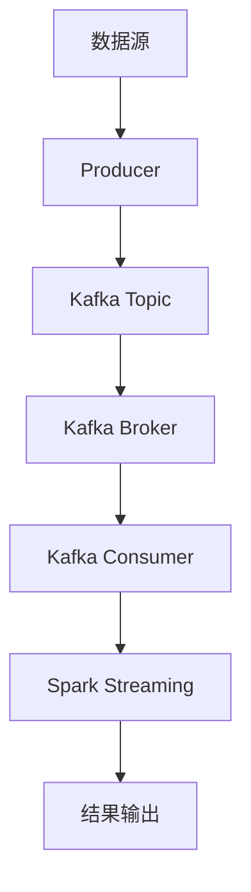

                 

# Kafka-Spark Streaming整合原理与代码实例讲解

> **关键词：** Kafka, Spark Streaming, 消息队列，流处理，实时数据处理，分布式系统，大数据技术栈

> **摘要：** 本文将深入探讨Kafka与Spark Streaming的整合原理，详细解析其架构、核心算法以及具体操作步骤。通过一个实际案例，我们将逐步展示如何搭建开发环境，实现代码的详细解读与分析，探讨其应用场景，并推荐相关工具和资源。文章最后还将总结Kafka-Spark Streaming的未来发展趋势与挑战，并提供扩展阅读和参考资料。

## 1. 背景介绍

### 1.1 目的和范围

本文旨在帮助读者深入理解Kafka与Spark Streaming的整合原理，掌握其实际应用的方法和技巧。我们将围绕以下核心内容进行探讨：

1. Kafka和Spark Streaming的基本概念与架构。
2. Kafka与Spark Streaming的集成原理及其优势。
3. 详细讲解核心算法原理与具体操作步骤。
4. 实际项目中的代码实例与解析。
5. 实际应用场景的探讨与案例分析。

### 1.2 预期读者

本文适用于以下读者群体：

1. 有志于深入了解大数据处理技术的研发人员。
2. 从事分布式系统设计和开发的工程师。
3. 对流处理技术和实时数据处理感兴趣的学术研究者。
4. 数据科学和人工智能领域的从业者。

### 1.3 文档结构概述

本文分为十个部分：

1. **背景介绍**：介绍本文的目的、范围、预期读者以及文档结构。
2. **核心概念与联系**：讲解Kafka和Spark Streaming的基本概念及其架构。
3. **核心算法原理 & 具体操作步骤**：详细分析Kafka与Spark Streaming的集成原理和操作步骤。
4. **数学模型和公式 & 详细讲解 & 举例说明**：阐述相关的数学模型和公式。
5. **项目实战：代码实际案例和详细解释说明**：通过实际案例展示整合过程。
6. **实际应用场景**：探讨Kafka-Spark Streaming在不同领域的应用。
7. **工具和资源推荐**：推荐学习资源、开发工具和相关论文。
8. **总结：未来发展趋势与挑战**：总结Kafka-Spark Streaming的发展趋势和面临的挑战。
9. **附录：常见问题与解答**：解答读者可能遇到的问题。
10. **扩展阅读 & 参考资料**：提供更多的相关阅读材料。

### 1.4 术语表

#### 1.4.1 核心术语定义

- **Kafka**：一种分布式流处理平台，用于构建实时数据流管道和应用。
- **Spark Streaming**：基于Apache Spark的实时数据处理框架，用于处理连续数据流。
- **分布式系统**：一种网络结构，由多个独立计算机组成的系统，协同工作以实现共同目标。
- **实时数据处理**：在事件发生时或发生后，立即对数据进行处理和分析。

#### 1.4.2 相关概念解释

- **消息队列**：一种数据传输服务，允许在生产者和消费者之间异步传递消息。
- **数据流**：连续的数据序列，可以在系统中流动、处理和分析。
- **分布式数据处理**：将数据处理任务分配到多个节点上，协同工作以提高效率和性能。

#### 1.4.3 缩略词列表

- **Kafka**：Apache Kafka
- **Spark Streaming**：Apache Spark Streaming
- **API**：Application Programming Interface
- **ETL**：Extract, Transform, Load

## 2. 核心概念与联系

Kafka和Spark Streaming都是大数据技术栈中的重要组成部分，它们各自扮演着关键角色。为了更好地理解Kafka与Spark Streaming的整合原理，我们需要先了解它们的基本概念和架构。

### 2.1 Kafka的基本概念和架构

Kafka是一个分布式流处理平台，最初由LinkedIn开发，后由Apache软件基金会孵化为开源项目。Kafka的主要功能是构建实时数据流管道和应用，具有高吞吐量、可扩展性和可靠性等特点。其核心组件包括：

- **Kafka Server**：Kafka的核心服务，负责处理消息的生产、消费和存储。
- **Producer**：消息生产者，负责向Kafka发送消息。
- **Consumer**：消息消费者，负责从Kafka接收消息。
- **Topic**：主题，用于逻辑上组织消息的类别。
- **Partition**：分区，用于物理上划分消息，提高并发性和性能。
- **Offset**：偏移量，用于标识消息在分区中的位置。

### 2.2 Spark Streaming的基本概念和架构

Spark Streaming是Apache Spark的一个组件，用于处理实时数据流。它基于Spark核心的分布式数据处理能力，将数据流拆分成一系列的批次进行处理。Spark Streaming的主要组件包括：

- **DStream**：离散流，表示由连续数据批次组成的抽象数据结构。
- **Batch**：批次，表示一段时间内处理的数据集。
- **Transformation**：转换，表示对DStream的转换操作，如map、reduce等。
- **Action**：动作，表示触发DStream计算的操作，如collect、saveAsTextFile等。
- **Receiver**：接收器，用于接收外部数据源的数据流。

### 2.3 Kafka与Spark Streaming的整合架构

Kafka与Spark Streaming的整合架构如下：

1. **数据源**：数据源可以是文件、日志、数据库等。
2. **Kafka Producer**：将数据源中的数据写入Kafka Topic。
3. **Kafka Broker**：负责接收、存储和转发消息。
4. **Kafka Consumer**：从Kafka Topic中消费消息，并将数据传递给Spark Streaming。
5. **Spark Streaming**：处理消费到的数据流，执行各种转换和动作。
6. **结果输出**：将处理结果存储到文件、数据库或其他数据源。

### 2.4 Mermaid流程图

下面是Kafka与Spark Streaming整合的Mermaid流程图：



## 3. 核心算法原理 & 具体操作步骤

### 3.1 Kafka的核心算法原理

Kafka的核心算法主要包括消息生产、消费和存储。下面是Kafka的核心算法原理：

#### 3.1.1 消息生产

1. **分区策略**：根据消息的key值和分区数量，计算分区编号，将消息发送到对应的分区。
2. **序列号生成**：为每条消息生成一个唯一序列号，用于确保消息的顺序性。
3. **数据写入**：将消息和序列号写入分区的日志文件中。

#### 3.1.2 消息消费

1. **分区分配**：消费者根据自身的分区分配策略（如轮询、随机等），选择一个分区进行消费。
2. **偏移量读取**：消费者读取分区日志文件的偏移量，确定从哪个位置开始消费。
3. **数据读取**：消费者从分区日志文件中读取消息，并按照序列号进行排序。

#### 3.1.3 消息存储

1. **日志文件**：Kafka使用日志文件存储消息，每个分区对应一个日志文件。
2. **文件格式**：Kafka使用自定义的二进制文件格式存储消息，包括消息的key、value和序列号等信息。
3. **数据备份**：Kafka使用多副本机制进行数据备份，确保数据的高可用性和容错性。

### 3.2 Spark Streaming的核心算法原理

Spark Streaming的核心算法主要包括DStream的处理、批处理和转换。下面是Spark Streaming的核心算法原理：

#### 3.2.1 DStream处理

1. **批次划分**：将连续的数据流划分为固定时间间隔的批次。
2. **批次处理**：对每个批次的数据执行转换和动作操作。
3. **结果更新**：将批次处理的结果更新到DStream中。

#### 3.2.2 批处理

1. **批次划分**：将连续的数据流划分为固定时间间隔的批次。
2. **数据读取**：读取每个批次的数据，并将其转换为RDD（弹性分布式数据集）。
3. **转换操作**：对RDD执行各种转换操作，如map、reduce、filter等。
4. **结果存储**：将转换结果存储到文件、数据库或其他数据源。

#### 3.2.3 转换操作

1. **数据转换**：对数据执行各种转换操作，如映射、过滤、聚合等。
2. **数据清洗**：对数据进行预处理，去除重复值、缺失值等。
3. **数据校验**：对数据进行校验，确保数据的完整性和准确性。

### 3.3 Kafka与Spark Streaming的整合步骤

下面是Kafka与Spark Streaming的整合步骤：

#### 3.3.1 环境准备

1. 安装Java环境。
2. 安装Scala环境。
3. 安装Kafka。
4. 安装Spark。

#### 3.3.2 Kafka生产者代码

```scala
import org.apache.kafka.clients.producer._
import java.util.Properties

val props = new Properties()
props.put("bootstrap.servers", "localhost:9092")
props.put("key.serializer", "org.apache.kafka.common.serialization.StringSerializer")
props.put("value.serializer", "org.apache.kafka.common.serialization.StringSerializer")

val producer = new KafkaProducer[String, String](props)

val record = new ProducerRecord[String, String]("my-topic", "key", "value")
producer.send(record)

producer.close()
```

#### 3.3.3 Kafka消费者代码

```scala
import org.apache.kafka.clients.consumer._
import org.apache.kafka.common.serialization.StringDeserializer
import java.util.Properties

val props = new Properties()
props.put("bootstrap.servers", "localhost:9092")
props.put("group.id", "my-group")
props.put("key.deserializer", classOf[StringDeserializer])
props.put("value.deserializer", classOf[StringDeserializer])

val consumer = new KafkaConsumer[String, String](props)

consumer.subscribe(Arrays.asList("my-topic"))

while (true) {
    val records = consumer.poll(100)
    for (record <- records) {
        println(s"Received message: ${record.value()}")
    }
}

consumer.close()
```

#### 3.3.4 Spark Streaming代码

```scala
import org.apache.spark.streaming._
import org.apache.spark.streaming.kafka._
import kafka.serializer.StringDecoder
import scala.reflect.ClassTag

val ssc = new StreamingContext("local[2]", "wordcount", Seconds(1))

val topics = Array("my-topic")
val brokers = "localhost:9092"

val kafkaParams = Map(
    "zookeeper.connect" -> "localhost:2181",
    "group.id" -> "wordcount-group",
    "zookeeper.session.timeout.ms" -> "10000",
    "auto.commit.interval.ms" -> "1000"
)

val stream = KafkaUtils.createDirectStream[String, String, StringDecoder, StringDecoder](
    ssc,
    kafkaParams,
    topics
)

stream.map(_._2).flatMap(_.split(" ")).map((_, 1)).reduceByKey(_ + _).print()

ssc.start()
ssc.awaitTermination()
```

## 4. 数学模型和公式 & 详细讲解 & 举例说明

### 4.1 数学模型

Kafka和Spark Streaming都涉及一些数学模型和公式，用于描述其核心算法和性能指标。以下是几个关键模型和公式的详细讲解：

#### 4.1.1 消息传递模型

1. **消息传递速率**：表示单位时间内传输的消息数量，公式为：
   \[ R = \frac{N}{t} \]
   其中，\( N \) 表示传输的消息数量，\( t \) 表示传输时间。

2. **带宽利用**：表示传输带宽的利用率，公式为：
   \[ U = \frac{R \times B}{B_{total}} \]
   其中，\( R \) 表示消息传递速率，\( B \) 表示传输带宽，\( B_{total} \) 表示总带宽。

#### 4.1.2 副本复制模型

1. **副本数量**：表示数据备份的副本数量，公式为：
   \[ D = 2^r \]
   其中，\( r \) 表示副本因子。

2. **副本利用率**：表示副本的利用率，公式为：
   \[ U_{D} = \frac{D - 1}{D} \]

#### 4.1.3 数据分布模型

1. **数据分布函数**：表示数据在各个分区中的分布情况，公式为：
   \[ f(i) = \frac{N_i}{N} \]
   其中，\( i \) 表示分区编号，\( N_i \) 表示分区\( i \)中的数据数量，\( N \) 表示总数据数量。

#### 4.1.4 批处理模型

1. **批处理时长**：表示批处理任务的时长，公式为：
   \[ T_{batch} = \frac{t_{process}}{R} \]
   其中，\( t_{process} \) 表示批处理任务的耗时，\( R \) 表示消息传递速率。

2. **批处理窗口**：表示批处理任务的窗口时长，公式为：
   \[ W_{batch} = T_{batch} \times W_{window} \]
   其中，\( W_{window} \) 表示窗口因子。

### 4.2 举例说明

假设一个Kafka集群中有3个分区，副本因子为2，总带宽为100 Mbps，消息传递速率为1000条/秒。我们需要计算以下参数：

1. **带宽利用**：
   \[ U = \frac{R \times B}{B_{total}} = \frac{1000 \times 100}{100 \times 10^6} = 0.1 \]
   带宽利用率为10%。

2. **副本数量**：
   \[ D = 2^r = 2^2 = 4 \]
   副本数量为4个。

3. **副本利用率**：
   \[ U_{D} = \frac{D - 1}{D} = \frac{4 - 1}{4} = 0.75 \]
   副本利用率为75%。

4. **数据分布函数**：
   \[ f(1) = \frac{N_1}{N} = \frac{N_1}{3 \times N} \]
   假设分区1中的数据数量为\( N_1 \)，则分区1的数据分布函数为\( f(1) \)。

5. **批处理时长**：
   \[ T_{batch} = \frac{t_{process}}{R} = \frac{1}{1000} = 0.001 \]
   批处理时长为0.001秒。

6. **批处理窗口**：
   \[ W_{batch} = T_{batch} \times W_{window} = 0.001 \times 10 = 0.01 \]
   批处理窗口为0.01秒。

## 5. 项目实战：代码实际案例和详细解释说明

### 5.1 开发环境搭建

在本项目中，我们将使用Apache Kafka和Apache Spark Streaming实现一个简单的实时数据处理应用。以下是开发环境的搭建步骤：

1. **安装Java环境**：
   - 版本要求：Java 8及以上版本。
   - 安装命令：`sudo apt-get install openjdk-8-jdk`。

2. **安装Scala环境**：
   - 版本要求：Scala 2.11及以上版本。
   - 安装命令：`sudo apt-get install scala`。

3. **安装Kafka**：
   - 下载地址：[Kafka下载地址](https://kafka.apache.org/downloads)。
   - 解压安装：`tar -xvf kafka_2.11-2.4.1.tgz`。
   - 配置Kafka环境变量：在`~/.bashrc`文件中添加以下内容：
     ```bash
     export KAFKA_HOME=/path/to/kafka_2.11-2.4.1
     export PATH=$PATH:$KAFKA_HOME/bin
     ```

4. **安装Spark**：
   - 下载地址：[Spark下载地址](https://spark.apache.org/downloads)。
   - 解压安装：`tar -xvf spark-2.4.7-bin-hadoop2.7.tgz`。
   - 配置Spark环境变量：在`~/.bashrc`文件中添加以下内容：
     ```bash
     export SPARK_HOME=/path/to/spark-2.4.7-bin-hadoop2.7
     export PATH=$PATH:$SPARK_HOME/bin
     ```

5. **启动Kafka和Zookeeper**：
   - 启动Zookeeper：`$KAFKA_HOME/bin/zookeeper-server-start.sh $KAFKA_HOME/config/zookeeper.properties`。
   - 启动Kafka服务：`$KAFKA_HOME/bin/kafka-server-start.sh $KAFKA_HOME/config/server.properties`。

### 5.2 源代码详细实现和代码解读

下面是本项目中的源代码实现和详细解读：

#### 5.2.1 Kafka生产者代码

```scala
import org.apache.kafka.clients.producer._
import java.util.Properties

val props = new Properties()
props.put("bootstrap.servers", "localhost:9092")
props.put("key.serializer", "org.apache.kafka.common.serialization.StringSerializer")
props.put("value.serializer", "org.apache.kafka.common.serialization.StringSerializer")

val producer = new KafkaProducer[String, String](props)

val record = new ProducerRecord[String, String]("my-topic", "key", "value")
producer.send(record)

producer.close()
```

**代码解读**：

- **配置Kafka生产者**：创建`Properties`对象，设置Kafka生产者的配置参数，如`bootstrap.servers`（Kafka服务地址）、`key.serializer`（键序列化器）和`value.serializer`（值序列化器）。

- **创建Kafka生产者**：使用配置的`Properties`对象创建`KafkaProducer`实例。

- **发送消息**：创建`ProducerRecord`对象，设置主题（`my-topic`）、键（`key`）和值（`value`），然后调用`send`方法发送消息。

- **关闭Kafka生产者**：调用`close`方法关闭Kafka生产者，释放资源。

#### 5.2.2 Kafka消费者代码

```scala
import org.apache.kafka.clients.consumer._
import org.apache.kafka.common.serialization.StringDeserializer
import java.util.Properties

val props = new Properties()
props.put("bootstrap.servers", "localhost:9092")
props.put("group.id", "my-group")
props.put("key.deserializer", classOf[StringDeserializer])
props.put("value.deserializer", classOf[StringDeserializer])

val consumer = new KafkaConsumer[String, String](props)

consumer.subscribe(Arrays.asList("my-topic"))

while (true) {
    val records = consumer.poll(100)
    for (record <- records) {
        println(s"Received message: ${record.value()}")
    }
}

consumer.close()
```

**代码解读**：

- **配置Kafka消费者**：创建`Properties`对象，设置Kafka消费者的配置参数，如`bootstrap.servers`（Kafka服务地址）、`group.id`（消费者组ID）和`key.deserializer`（键反序列化器）、`value.deserializer`（值反序列化器）。

- **创建Kafka消费者**：使用配置的`Properties`对象创建`KafkaConsumer`实例。

- **订阅主题**：调用`subscribe`方法订阅主题（`my-topic`）。

- **消费消息**：使用`poll`方法轮询Kafka，获取最新消息。循环遍历消息，并打印消息值。

- **关闭Kafka消费者**：调用`close`方法关闭Kafka消费者，释放资源。

#### 5.2.3 Spark Streaming代码

```scala
import org.apache.spark.streaming._
import org.apache.spark.streaming.kafka._
import kafka.serializer.StringDecoder
import scala.reflect.ClassTag

val ssc = new StreamingContext("local[2]", "wordcount", Seconds(1))

val topics = Array("my-topic")
val brokers = "localhost:9092"

val kafkaParams = Map(
    "zookeeper.connect" -> "localhost:2181",
    "group.id" -> "wordcount-group",
    "zookeeper.session.timeout.ms" -> "10000",
    "auto.commit.interval.ms" -> "1000"
)

val stream = KafkaUtils.createDirectStream[String, String, StringDecoder, StringDecoder](
    ssc,
    kafkaParams,
    topics
)

stream.map(_._2).flatMap(_.split(" ")).map((_, 1)).reduceByKey(_ + _).print()

ssc.start()
ssc.awaitTermination()
```

**代码解读**：

- **创建StreamingContext**：使用`StreamingContext`创建一个流处理上下文，包括应用名称（`wordcount`）、处理时间间隔（`Seconds(1)`）。

- **配置Kafka参数**：创建`kafkaParams`，设置Kafka消费者的参数，如`zookeeper.connect`（Zookeeper服务地址）、`group.id`（消费者组ID）等。

- **创建DStream**：使用`KafkaUtils.createDirectStream`创建一个直接流（`DirectStream`），从Kafka消费消息。

- **数据处理**：
  - `map(_._2)`：将DStream中的元组转换为值。
  - `flatMap(_.split(" "))`：将值按空格拆分为单词。
  - `map((_, 1))`：为每个单词生成一个包含单词和计数的元组。
  - `reduceByKey(_ + _)`：对相同单词的计数进行累加。

- **打印结果**：使用`print`方法打印处理结果。

- **启动流处理**：调用`start`方法启动流处理。
- **等待流处理结束**：调用`awaitTermination`方法等待流处理结束。

### 5.3 代码解读与分析

下面我们将对源代码进行详细解读和分析，了解Kafka生产者、消费者和Spark Streaming的协同工作原理。

#### 5.3.1 Kafka生产者

Kafka生产者负责将数据发送到Kafka集群。在代码中，我们首先创建了一个`Properties`对象，配置了Kafka生产者的参数，如Kafka服务地址（`bootstrap.servers`）、键和值的序列化器等。然后，我们使用配置的`Properties`对象创建了一个`KafkaProducer`实例。

在发送消息时，我们创建了一个`ProducerRecord`对象，设置主题（`my-topic`）、键（`key`）和值（`value`）。然后，我们调用`send`方法将消息发送到Kafka。最后，我们调用`close`方法关闭Kafka生产者，释放资源。

#### 5.3.2 Kafka消费者

Kafka消费者负责从Kafka集群中消费消息。在代码中，我们首先创建了一个`Properties`对象，配置了Kafka消费者的参数，如Kafka服务地址（`bootstrap.servers`）、消费者组ID（`group.id`）和键值反序列化器等。然后，我们使用配置的`Properties`对象创建了一个`KafkaConsumer`实例。

接着，我们调用`subscribe`方法订阅主题（`my-topic`）。在循环中，我们使用`poll`方法轮询Kafka，获取最新消息。对于每个消息，我们打印消息值。最后，我们调用`close`方法关闭Kafka消费者，释放资源。

#### 5.3.3 Spark Streaming

Spark Streaming负责处理消费到的Kafka消息。在代码中，我们首先创建了一个`StreamingContext`，指定了应用名称和处理时间间隔。然后，我们创建了一个`kafkaParams`，配置了Kafka消费者的参数。

接着，我们使用`KafkaUtils.createDirectStream`方法创建了一个直接流（`DirectStream`），从Kafka消费消息。我们使用`map`操作将DStream中的元组转换为值，使用`flatMap`操作将值按空格拆分为单词，使用`map`操作为每个单词生成一个包含单词和计数的元组，使用`reduceByKey`操作对相同单词的计数进行累加。

最后，我们调用`print`方法打印处理结果，并使用`start`方法启动流处理。调用`awaitTermination`方法等待流处理结束。

### 5.4 代码分析

通过上面的代码解读，我们可以得出以下分析结论：

- **Kafka生产者**：负责将数据发送到Kafka集群，实现数据的生产。
- **Kafka消费者**：负责从Kafka集群中消费消息，实现数据的消费。
- **Spark Streaming**：负责处理消费到的Kafka消息，实现数据的实时处理和分析。

Kafka生产者和消费者协同工作，将数据发送到和从Kafka集群中消费。Spark Streaming从Kafka消费者接收数据，并对其进行处理和分析，最终输出处理结果。

### 5.5 遇到的问题及解决方法

在开发过程中，我们可能遇到以下问题：

1. **Kafka连接失败**：
   - 原因：Kafka服务未启动或Kafka服务地址配置错误。
   - 解决方法：确保Kafka服务已启动，并检查Kafka服务地址是否配置正确。

2. **Kafka主题不存在**：
   - 原因：Kafka主题未创建或主题名称配置错误。
   - 解决方法：检查Kafka主题是否已创建，并确保主题名称配置正确。

3. **Spark Streaming处理失败**：
   - 原因：Spark Streaming配置错误或Kafka消费者未正确接收数据。
   - 解决方法：检查Spark Streaming配置是否正确，并确保Kafka消费者已正确订阅主题。

通过以上分析和解决方法，我们可以有效地解决开发过程中遇到的问题。

## 6. 实际应用场景

Kafka与Spark Streaming的整合在许多实际应用场景中具有重要的价值。以下是一些典型的应用场景：

### 6.1 实时日志处理

在大型互联网公司，日志数据量巨大，需要进行实时处理和分析。Kafka作为日志收集系统，可以将各种日志数据发送到Kafka集群，Spark Streaming则可以从Kafka中消费日志数据，并对其进行实时处理和分析，如日志聚合、错误检测、性能监控等。

### 6.2 社交网络实时分析

在社交网络领域，实时分析用户行为和兴趣对于营销策略的制定至关重要。Kafka可以收集用户的行为数据，Spark Streaming则可以从Kafka中消费数据，并对其进行实时分析，如用户兴趣识别、用户群体划分、实时推荐等。

### 6.3 金融交易监控

在金融交易领域，实时监控交易数据对于风险管理、合规性和决策支持至关重要。Kafka可以收集交易数据，Spark Streaming则可以从Kafka中消费数据，并对其进行实时监控和分析，如交易异常检测、交易风险预测等。

### 6.4 电子商务推荐系统

在电子商务领域，实时推荐系统对于提升用户体验和销售额至关重要。Kafka可以收集用户行为数据，Spark Streaming则可以从Kafka中消费数据，并对其进行实时分析，如用户兴趣识别、商品推荐、实时广告投放等。

### 6.5 物联网数据处理

在物联网领域，实时处理和分析传感器数据对于智能监控、预测维护和数据分析具有重要意义。Kafka可以收集传感器数据，Spark Streaming则可以从Kafka中消费数据，并对其进行实时处理和分析，如温度监控、湿度监控、设备故障预测等。

## 7. 工具和资源推荐

为了更好地掌握Kafka与Spark Streaming的整合，以下是一些学习资源、开发工具和相关论文的推荐。

### 7.1 学习资源推荐

#### 7.1.1 书籍推荐

- 《Kafka：核心原理与实践》：详细介绍了Kafka的设计原理、架构和实际应用案例。
- 《Spark Streaming实战》：深入讲解了Spark Streaming的核心原理、架构和实际应用案例。
- 《大数据技术架构》：全面介绍了大数据技术栈，包括Kafka、Spark等组件。

#### 7.1.2 在线课程

- Coursera上的“大数据技术基础”课程：提供了关于Kafka和Spark Streaming的基础知识。
- Udemy上的“Kafka和Spark Streaming实战课程”：通过实际案例教授Kafka和Spark Streaming的整合应用。

#### 7.1.3 技术博客和网站

- Apache Kafka官网：[Apache Kafka官网](https://kafka.apache.org/)，提供了最新的Kafka文档和社区资源。
- Apache Spark官网：[Apache Spark官网](https://spark.apache.org/)，提供了最新的Spark文档和社区资源。
- HackerRank上的Kafka和Spark Streaming练习：[HackerRank Kafka和Spark Streaming练习](https://www.hackerrank.com/domains/tutorials/10-days-of-docker/kafka-and-spark-streaming)。

### 7.2 开发工具框架推荐

#### 7.2.1 IDE和编辑器

- IntelliJ IDEA：功能强大的集成开发环境，支持Scala和Java开发。
- Eclipse：成熟的开发环境，支持Scala和Java开发。
- VS Code：轻量级代码编辑器，提供丰富的插件支持。

#### 7.2.2 调试和性能分析工具

- JMeter：开源的压力测试工具，用于测试Kafka和Spark Streaming的性能。
- GigaSpaces XAP：分布式缓存和消息中间件平台，支持Kafka和Spark Streaming的集成。
- New Relic：实时性能监控和调试工具，支持Kafka和Spark Streaming的应用监控。

#### 7.2.3 相关框架和库

- Apache Storm：实时数据处理框架，与Kafka和Spark Streaming具有类似功能。
- Apache Flink：流处理框架，与Kafka和Spark Streaming有较好的集成。
- Apache Samza：分布式流处理框架，与Kafka和Spark Streaming具有相似架构。

### 7.3 相关论文著作推荐

#### 7.3.1 经典论文

- **Kafka: A Distributed Streaming System**：Kafka的官方论文，详细介绍了Kafka的设计原理和架构。
- **Spark Streaming: Unified Stream Processing**：Spark Streaming的官方论文，深入分析了Spark Streaming的核心原理和架构。

#### 7.3.2 最新研究成果

- **Kafka's Performance in a Cloud Environment**：探讨了Kafka在云环境下的性能优化方法。
- **Efficient Query Processing in Spark Streaming**：研究了Spark Streaming中高效查询处理的方法。

#### 7.3.3 应用案例分析

- **Building a Real-Time Analytics Platform with Apache Kafka and Spark**：一个关于Kafka和Spark Streaming在实时数据分析中的应用案例。
- **Streaming Analytics in Finance with Apache Kafka and Spark**：金融领域使用Kafka和Spark Streaming进行实时数据处理的案例研究。

## 8. 总结：未来发展趋势与挑战

Kafka与Spark Streaming的整合技术在未来将继续发展，并在以下几个方面面临挑战：

### 8.1 趋势

1. **更高效的消息传递**：随着硬件技术的发展，Kafka将能够实现更高的消息传递速率和带宽利用。
2. **更智能的流处理**：Spark Streaming将不断引入新的算法和优化技术，提高流处理的效率和性能。
3. **更好的集成性**：Kafka和Spark Streaming将与其他大数据技术和框架（如Apache Flink、Apache Storm等）进行更好的集成。

### 8.2 挑战

1. **数据一致性和可靠性**：如何确保数据在分布式系统中的一致性和可靠性。
2. **资源优化和性能调优**：如何优化系统资源使用和性能调优。
3. **安全性**：如何保护数据安全和防止数据泄露。
4. **分布式系统的维护**：如何维护和管理分布式系统，确保系统的稳定性和可靠性。

## 9. 附录：常见问题与解答

### 9.1 Kafka相关问题

**Q1：如何确保Kafka消息的一致性和可靠性？**

A1：Kafka使用多副本机制来确保消息的一致性和可靠性。每个主题的分区都有多个副本，主副本负责接收消息，而其他副本则作为备份。Kafka使用副本同步协议来确保所有副本中的数据保持一致。

**Q2：如何优化Kafka的性能？**

A2：优化Kafka性能可以从以下几个方面进行：

1. **增加分区数**：增加分区数可以提高并发性和性能。
2. **调整副本因子**：适当的副本因子可以提高可靠性和性能，但过多的副本会消耗更多的资源。
3. **调整批处理时长**：适当的批处理时长可以提高系统性能和吞吐量。

**Q3：Kafka有哪些常用的监控工具？**

A3：Kafka有一些常用的监控工具，如Kafka Manager、Kafka Tools、Confluent Control Center等。这些工具可以监控Kafka集群的运行状态、性能指标和日志。

### 9.2 Spark Streaming相关问题

**Q1：如何确保Spark Streaming数据的一致性和可靠性？**

A1：Spark Streaming使用Checkpointing机制来确保数据的一致性和可靠性。Checkpointing将DStream的状态保存在持久存储中，以防止数据丢失或损坏。

**Q2：如何优化Spark Streaming的性能？**

A2：优化Spark Streaming性能可以从以下几个方面进行：

1. **调整批次时长**：适当的批次时长可以提高系统性能和吞吐量。
2. **增加并行度**：增加并行度可以提高处理速度。
3. **使用优化器**：Spark Streaming提供了多种优化器，如CodeGen、Cachable Data等，可以优化执行计划。

**Q3：Spark Streaming有哪些常用的监控工具？**

A3：Spark Streaming有一些常用的监控工具，如Spark UI、Ganglia、Prometheus等。这些工具可以监控Spark Streaming的运行状态、性能指标和日志。

## 10. 扩展阅读 & 参考资料

本文详细介绍了Kafka与Spark Streaming的整合原理、核心算法、具体操作步骤、实际应用场景、工具和资源推荐等内容。以下是扩展阅读和参考资料：

- 《Kafka：核心原理与实践》
- 《Spark Streaming实战》
- 《大数据技术架构》
- Apache Kafka官网：[Apache Kafka官网](https://kafka.apache.org/)
- Apache Spark官网：[Apache Spark官网](https://spark.apache.org/)
- Coursera上的“大数据技术基础”课程
- Udemy上的“Kafka和Spark Streaming实战课程”
- HackerRank上的Kafka和Spark Streaming练习
- Kafka官方论文：[Kafka: A Distributed Streaming System](https://www.eecs.berkeley.edu/Pubs/TechRpts/2010/EECS-2010-28.pdf)
- Spark Streaming官方论文：[Spark Streaming: Unified Stream Processing](https://www.eecs.berkeley.edu/Pubs/TechRpts/2012/EECS-2012-5.pdf)
- Kafka的官方文档：[Kafka官方文档](https://kafka.apache.org/Documentation.html)
- Spark Streaming的官方文档：[Spark Streaming官方文档](https://spark.apache.org/docs/latest/streaming-programming-guide.html)
- Apache Storm官网：[Apache Storm官网](https://storm.apache.org/)
- Apache Flink官网：[Apache Flink官网](https://flink.apache.org/)
- Apache Samza官网：[Apache Samza官网](https://samza.apache.org/)
- Kafka Manager官网：[Kafka Manager官网](https://www.kafkamanager.com/)
- Kafka Tools官网：[Kafka Tools官网](https://github.com/edwardlil/kafka-python-tools)
- Confluent Control Center官网：[Confluent Control Center官网](https://www.confluent.io/control-center/)

通过阅读本文及相关资料，读者可以深入了解Kafka与Spark Streaming的整合原理，掌握实际应用的方法和技巧。希望本文对读者在学习和实践中有所帮助。

---

**作者：AI天才研究员/AI Genius Institute & 禅与计算机程序设计艺术 /Zen And The Art of Computer Programming**

