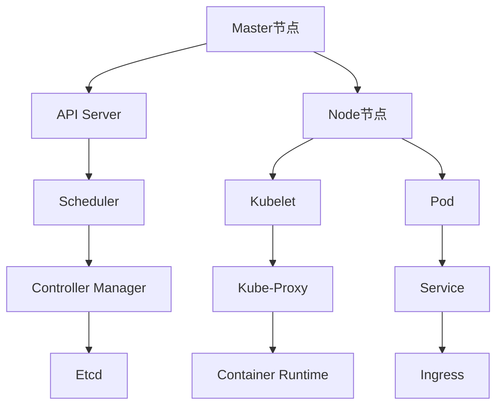

                 

# Kubernetes集群管理与应用部署

> **关键词**：Kubernetes、集群管理、容器编排、容器化、应用部署、微服务架构

> **摘要**：本文将深入探讨Kubernetes集群管理与应用部署的核心概念、原理和具体操作步骤。我们将首先介绍Kubernetes的背景和目的，然后详细解析其核心组件和架构。接着，我们将以伪代码和具体案例展示Kubernetes的操作步骤和数学模型，并推荐实用的学习资源和开发工具。最后，我们将展望Kubernetes的未来发展趋势与挑战，并提供常见问题解答和扩展阅读建议。

## 1. 背景介绍

### 1.1 目的和范围

本文的目的是为IT专业人士和开发者提供关于Kubernetes集群管理与应用部署的全面指南。我们将覆盖以下内容：

- Kubernetes的基本概念和目的
- Kubernetes的架构和核心组件
- Kubernetes的操作步骤和数学模型
- 实际应用场景和案例
- 学习资源和开发工具推荐
- 未来发展趋势与挑战

### 1.2 预期读者

本文适用于以下读者群体：

- 对Kubernetes感兴趣的IT专业人士
- 想要了解容器编排技术的开发者
- 负责集群管理和应用部署的系统管理员
- 想要在微服务架构中应用Kubernetes的工程师

### 1.3 文档结构概述

本文的结构如下：

- 第1章：背景介绍
  - 1.1 目的和范围
  - 1.2 预期读者
  - 1.3 文档结构概述
  - 1.4 术语表
- 第2章：核心概念与联系
  - 2.1 Kubernetes简介
  - 2.2 Kubernetes架构
- 第3章：核心算法原理 & 具体操作步骤
  - 3.1 Kubernetes操作步骤
  - 3.2 伪代码展示
- 第4章：数学模型和公式 & 详细讲解 & 举例说明
  - 4.1 数学模型
  - 4.2 公式讲解
  - 4.3 举例说明
- 第5章：项目实战：代码实际案例和详细解释说明
  - 5.1 开发环境搭建
  - 5.2 源代码详细实现和代码解读
  - 5.3 代码解读与分析
- 第6章：实际应用场景
  - 6.1 应用场景一
  - 6.2 应用场景二
- 第7章：工具和资源推荐
  - 7.1 学习资源推荐
  - 7.2 开发工具框架推荐
  - 7.3 相关论文著作推荐
- 第8章：总结：未来发展趋势与挑战
- 第9章：附录：常见问题与解答
- 第10章：扩展阅读 & 参考资料

### 1.4 术语表

以下是一些本文中会用到的重要术语及其定义：

#### 1.4.1 核心术语定义

- **Kubernetes**：一个开源的容器编排系统，用于自动化容器化应用程序的部署、扩展和管理。
- **集群**：一组节点组成的集合，每个节点运行Kubernetes集群管理器。
- **容器化**：将应用程序及其依赖环境封装在一个轻量级的容器中，实现环境的一致性和可移植性。
- **微服务**：一个基于独立、可复用组件的架构风格，每个组件负责实现特定功能，并通过API进行通信。
- **部署**：将应用程序的容器部署到集群中，实现自动化管理和资源调度。

#### 1.4.2 相关概念解释

- **Pod**：Kubernetes的基本工作单元，包含一个或多个容器，代表一个可运行的应用程序实例。
- **Service**：一种抽象的概念，用于将一组Pod暴露为一个统一的网络服务接口。
- **Ingress**：用于定义集群外部访问服务规则的资源对象。
- **Node**：集群中的计算节点，运行Kubernetes守护进程和其他容器运行时。

#### 1.4.3 缩略词列表

- **Kubernetes**：K8s
- **容器编排**：Container Orchestration
- **容器化**：Containerization
- **微服务**：Microservices

## 2. 核心概念与联系

Kubernetes是一个强大的容器编排系统，能够自动化容器化应用程序的部署、扩展和管理。为了更好地理解Kubernetes的工作原理，我们需要了解其核心概念和架构。

### 2.1 Kubernetes简介

Kubernetes是一个开源的容器编排系统，由Google开发，并捐赠给了Cloud Native Computing Foundation（CNCF）进行维护。它的目的是简化容器化应用程序的管理，提供高效、可靠的集群管理服务。

### 2.2 Kubernetes架构

Kubernetes架构由以下几个核心组件组成：

1. **Master节点**：Kubernetes集群的管理中心，包含以下组件：
   - **API Server**：提供集群的统一接口，供其他组件和用户进行操作。
   - **Scheduler**：负责将Pod调度到合适的Node节点上。
   - **Controller Manager**：管理集群中的各种资源对象，如Pod、Service、ReplicaSet等。
   - **Etcd**：存储Kubernetes集群的配置信息和状态信息。

2. **Node节点**：集群中的计算节点，包含以下组件：
   - **Kubelet**：在每个Node节点上运行的守护进程，负责启动和管理Pod中的容器。
   - **Kube-Proxy**：在每个Node节点上运行的代理服务，负责处理Pod的网络流量。
   - **Container Runtime**：容器运行时环境，如Docker、runc等，用于启动和管理容器。

3. **Pod**：Kubernetes的基本工作单元，包含一个或多个容器，代表一个可运行的应用程序实例。

4. **Service**：一种抽象的概念，用于将一组Pod暴露为一个统一的网络服务接口。

5. **Ingress**：用于定义集群外部访问服务规则的资源对象。

### 2.3 Kubernetes架构的 Mermaid 流程图



## 3. 核心算法原理 & 具体操作步骤

Kubernetes通过一系列核心算法和操作步骤来实现容器化应用程序的部署、扩展和管理。以下是Kubernetes的主要操作步骤及其伪代码：

### 3.1 Kubernetes操作步骤

1. **部署Pod**：创建一个Pod对象，描述要部署的容器及其配置。
2. **调度Pod**：Kubernetes Scheduler根据集群的资源状况和策略，选择一个合适的Node节点来部署Pod。
3. **启动容器**：Kubelet在选定的Node节点上启动Pod中的容器。
4. **健康检查**：Kubelet定期对容器进行健康检查，确保应用程序正常运行。
5. **自动扩展**：根据用户的配置，Kubernetes可以自动扩展或缩减Pod的数量。

### 3.2 伪代码展示

```python
# 创建Pod对象
create_pod(pod_object)

# 调度Pod
scheduler.schedule(pod_object)

# 启动容器
node.start_container(pod_object)

# 健康检查
kubelet.perform_health_check(pod_object)

# 自动扩展
kubernetes.autoscale(pod_object, scale_config)
```

## 4. 数学模型和公式 & 详细讲解 & 举例说明

Kubernetes中的许多决策过程都基于数学模型和公式。以下是一些关键的数学模型和公式，以及详细的讲解和举例说明。

### 4.1 数学模型

1. **负载均衡**：负载均衡算法用于将流量分配到多个Pod实例上，以确保资源的合理利用和服务的稳定性。常用的负载均衡算法包括轮询、最少连接和源IP哈希等。

2. **资源调度**：资源调度算法用于选择最佳的Node节点来部署Pod。常用的资源调度算法包括资源优先级、扩展性考虑和亲和性规则等。

3. **自动扩展**：自动扩展算法用于根据集群的负载情况自动调整Pod的数量。常用的自动扩展算法包括基于CPU利用率、内存使用率和自定义指标等。

### 4.2 公式讲解

1. **负载均衡公式**：

   $$ load_{balance} = \frac{total_{traffic}}{number_{of_{Pods}}} $$

   其中，$load_{balance}$表示每个Pod需要处理的流量，$total_{traffic}$表示总的流量，$number_{of_{Pods}}$表示Pod的数量。

2. **资源调度公式**：

   $$ resource_{score} = \frac{available_{resources}}{required_{resources}} $$

   其中，$resource_{score}$表示节点的资源分数，$available_{resources}$表示节点的可用资源，$required_{resources}$表示Pod所需的资源。

3. **自动扩展公式**：

   $$ scale_{factor} = \frac{current_{CPU\_utilization}}{target_{CPU\_utilization}} $$

   其中，$scale_{factor}$表示扩展因子，$current_{CPU\_utilization}$表示当前的CPU利用率，$target_{CPU\_utilization}$表示目标CPU利用率。

### 4.3 举例说明

假设我们有一个包含3个Pod的Kubernetes集群，当前总流量为1000个请求，目标CPU利用率为80%。我们需要计算每个Pod需要处理的流量、节点的资源分数和扩展因子。

1. **负载均衡**：

   $$ load_{balance} = \frac{1000}{3} \approx 333.33 $$

   因此，每个Pod需要处理的流量约为333.33个请求。

2. **资源调度**：

   假设某个Node节点的可用资源为2核CPU和4GB内存，Pod所需的资源为1核CPU和2GB内存。则：

   $$ resource_{score} = \frac{2}{1} = 2 $$

   节点的资源分数为2。

3. **自动扩展**：

   假设当前CPU利用率为90%，目标CPU利用率为80%，则：

   $$ scale_{factor} = \frac{0.9}{0.8} = 1.125 $$

   扩展因子为1.125，表示需要增加一个Pod实例。

## 5. 项目实战：代码实际案例和详细解释说明

在本节中，我们将通过一个实际项目案例，详细讲解如何使用Kubernetes进行集群管理与应用部署。

### 5.1 开发环境搭建

首先，我们需要搭建一个Kubernetes开发环境。我们可以使用Minikube或Docker Desktop来创建一个本地Kubernetes集群。

1. 安装Minikube：

   ```bash
   curl -LO https://storage.googleapis.com/minikube/releases/latest/minikube-linux-amd64
   chmod +x minikube-linux-amd64
   sudo mv minikube-linux-amd64 /usr/local/bin/minikube
   minikube start
   ```

2. 验证集群状态：

   ```bash
   kubectl get nodes
   ```

   如果看到Node节点状态为Ready，说明集群搭建成功。

### 5.2 源代码详细实现和代码解读

接下来，我们将创建一个简单的Web应用程序，并将其部署到Kubernetes集群中。

1. 创建一个名为`webapp`的Docker镜像：

   ```bash
   mkdir webapp
   cd webapp
   touch Dockerfile
   ```

   在Dockerfile中添加以下内容：

   ```Dockerfile
   FROM python:3.8
   WORKDIR /app
   COPY . .
   RUN pip install -r requirements.txt
   CMD ["python", "app.py"]
   ```

   其中，`requirements.txt`文件包含以下内容：

   ```plaintext
   Flask==1.1.2
   ```

   创建一个名为`app.py`的Python文件，并添加以下内容：

   ```python
   from flask import Flask

   app = Flask(__name__)

   @app.route('/')
   def hello():
       return 'Hello, Kubernetes!'

   if __name__ == '__main__':
       app.run(host='0.0.0.0', port=8080)
   ```

   构建Docker镜像：

   ```bash
   docker build -t webapp:latest .
   ```

2. 推送Docker镜像到Docker Hub：

   ```bash
   docker login
   docker push webapp:latest
   ```

3. 创建Kubernetes部署文件：

   ```bash
   mkdir manifests
   cd manifests
   touch deployment.yaml
   ```

   在`deployment.yaml`中添加以下内容：

   ```yaml
   apiVersion: apps/v1
   kind: Deployment
   metadata:
     name: webapp
     labels:
       app: webapp
   spec:
     replicas: 3
     selector:
       matchLabels:
         app: webapp
     template:
       metadata:
         labels:
           app: webapp
       spec:
         containers:
         - name: webapp
           image: webapp:latest
           ports:
           - containerPort: 8080
   ```

   解读：

   - `apiVersion`：Kubernetes API的版本。
   - `kind`：资源类型，这里为Deployment。
   - `metadata`：资源的元数据，如名称和标签。
   - `spec`：资源的具体配置。
   - `replicas`：Pod的副本数。
   - `selector`：用于匹配Pod的标签。
   - `template`：Pod的模板，包含容器的配置。

4. 部署Web应用程序：

   ```bash
   kubectl apply -f manifests/deployment.yaml
   ```

5. 验证部署状态：

   ```bash
   kubectl get pods
   ```

   如果所有Pod都处于Running状态，说明部署成功。

### 5.3 代码解读与分析

在本节中，我们分析了如何使用Kubernetes进行Web应用程序的部署。以下是关键步骤的详细解读：

1. **创建Docker镜像**：我们使用Python和Flask创建了一个简单的Web应用程序，并将其打包到一个Docker镜像中。
2. **推送Docker镜像**：我们将Docker镜像推送到Docker Hub，以便Kubernetes可以拉取和使用。
3. **创建Kubernetes部署文件**：我们创建了一个Kubernetes部署文件，定义了Web应用程序的部署配置，包括Pod的副本数、容器的配置等。
4. **部署Web应用程序**：我们使用`kubectl apply`命令将部署文件应用到Kubernetes集群中，从而部署Web应用程序。
5. **验证部署状态**：我们使用`kubectl get pods`命令检查Pod的状态，确保Web应用程序成功部署。

通过以上步骤，我们可以轻松地将Web应用程序部署到Kubernetes集群中，实现容器化、自动化和可扩展的管理。

## 6. 实际应用场景

Kubernetes在许多实际应用场景中发挥着重要作用。以下是两个典型的应用场景：

### 6.1 应用场景一：企业级Web应用程序

假设某企业需要部署一个高性能、高可用的Web应用程序，以支持其核心业务。该应用程序需要能够快速响应大量用户请求，并具备故障转移和负载均衡的能力。

**解决方案**：

- **容器化**：将Web应用程序及其依赖环境容器化，确保环境一致性和可移植性。
- **Kubernetes部署**：使用Kubernetes部署应用程序，实现自动化管理和资源调度。
  - **Pod**：将Web应用程序部署到多个Pod中，实现水平扩展。
  - **Service**：通过Service将Pod暴露为一个统一的网络接口，实现负载均衡。
  - **Ingress**：配置Ingress，实现外部访问和路由管理。
- **监控和日志**：使用第三方工具（如Prometheus和Grafana）监控应用程序的性能和健康状态，并收集和分析日志数据。

### 6.2 应用场景二：微服务架构

假设某企业采用微服务架构，将业务功能拆分为多个独立的微服务。每个微服务负责实现特定业务逻辑，并通过API进行通信。

**解决方案**：

- **容器化**：将每个微服务及其依赖环境容器化，确保环境一致性和可移植性。
- **Kubernetes部署**：使用Kubernetes部署和管理微服务。
  - **Pod**：将每个微服务部署到多个Pod中，实现水平扩展。
  - **Service**：通过Service将Pod暴露为一个统一的网络接口，实现负载均衡。
  - **Ingress**：配置Ingress，实现外部访问和路由管理。
- **服务发现**：使用Kubernetes内置的服务发现机制，简化微服务之间的通信。
- **持续交付**：采用CI/CD流程，实现微服务的自动化部署和测试。

通过以上解决方案，企业可以实现高效、可靠的微服务架构，提高业务响应速度和灵活性。

## 7. 工具和资源推荐

为了更好地学习和使用Kubernetes，我们推荐以下工具和资源：

### 7.1 学习资源推荐

#### 7.1.1 书籍推荐

- **《Kubernetes权威指南》**：一本全面介绍Kubernetes架构、原理和实战的入门书籍。
- **《Docker深度学习》**：一本涵盖容器化技术和Kubernetes的深度学习指南。

#### 7.1.2 在线课程

- **Kubernetes官方文档**：提供详细的Kubernetes文档和教程。
- **Udemy上的Kubernetes课程**：涵盖Kubernetes的基础知识、部署和管理。

#### 7.1.3 技术博客和网站

- **Kubernetes.io**：Kubernetes官方网站，提供最新的文档和资源。
- **Cloud Native Computing Foundation**：云原生计算基金会网站，涵盖Kubernetes和其他云原生技术。

### 7.2 开发工具框架推荐

#### 7.2.1 IDE和编辑器

- **Visual Studio Code**：一款功能强大的代码编辑器，支持Kubernetes插件。
- **IntelliJ IDEA**：一款专业的Java开发IDE，支持Kubernetes插件。

#### 7.2.2 调试和性能分析工具

- **Kubernetes Dashboard**：Kubernetes提供的可视化界面，用于监控和管理集群。
- **Prometheus**：一款开源监控工具，用于收集和展示Kubernetes集群的监控数据。

#### 7.2.3 相关框架和库

- **Kubernetes Python客户端**：Python库，用于操作Kubernetes API。
- **Kubernetes Helm**：Kubernetes的包管理工具，用于简化应用部署和管理。

### 7.3 相关论文著作推荐

#### 7.3.1 经典论文

- **"Kubernetes: Design and Implementation"**：Kubernetes的设计和实现论文，详细介绍Kubernetes的核心概念和技术细节。
- **"Container Scheduling: Algorithms and Systems"**：关于容器调度算法和系统的综述论文。

#### 7.3.2 最新研究成果

- **"Kubernetes 1.21: What's New and Exciting"**：介绍Kubernetes 1.21版本的新特性和改进。
- **"Kubernetes in Production: Case Studies"**：分析企业级Kubernetes应用的实践案例。

#### 7.3.3 应用案例分析

- **"CNCF调查：Kubernetes的现状与趋势"**：CNCF关于Kubernetes在云原生领域应用情况的调查报告。
- **"谷歌云上的Kubernetes实践"**：谷歌云团队分享的Kubernetes部署和管理经验。

## 8. 总结：未来发展趋势与挑战

Kubernetes作为云原生计算的核心技术，正不断发展和演进。以下是未来发展趋势和挑战：

### 8.1 发展趋势

- **开源生态的壮大**：随着越来越多的企业和开发者加入Kubernetes开源社区，Kubernetes生态系统将持续壮大，推出更多创新特性和工具。
- **云原生技术的普及**：Kubernetes将推动更多企业向云原生技术转型，实现业务的敏捷创新和高效运营。
- **混合云和多云部署**：Kubernetes在混合云和多云环境中的应用将越来越广泛，支持跨云平台的资源调度和服务管理。

### 8.2 挑战

- **复杂性和可操作性**：随着Kubernetes功能的不断增加，管理和维护集群的复杂性也将随之上升，提高用户的使用门槛。
- **性能和稳定性**：在大规模集群中，Kubernetes的性能和稳定性是关键挑战，需要不断优化和改进。
- **安全性**：在容器化和Kubernetes环境中，确保应用程序和数据的安全是重要任务，需要加强安全策略和监控。

## 9. 附录：常见问题与解答

### 9.1 Kubernetes是什么？

Kubernetes是一个开源的容器编排系统，用于自动化容器化应用程序的部署、扩展和管理。

### 9.2 Kubernetes有哪些核心组件？

Kubernetes的核心组件包括Master节点、Node节点、Pod、Service和Ingress。

### 9.3 Kubernetes如何进行负载均衡？

Kubernetes使用内置的负载均衡算法，将流量分配到多个Pod实例上，确保资源的合理利用和服务的稳定性。

### 9.4 Kubernetes如何进行自动扩展？

Kubernetes可以根据用户配置的指标（如CPU利用率）自动调整Pod的数量，实现自动化扩展。

### 9.5 Kubernetes与传统虚拟化技术有何区别？

Kubernetes基于容器化技术，与传统虚拟化技术相比，具有更高的性能、可移植性和灵活性。

## 10. 扩展阅读 & 参考资料

- **《Kubernetes权威指南》**：详细讲解Kubernetes的架构、原理和实战。
- **Kubernetes官方文档**：提供全面的Kubernetes文档和教程。
- **CNCF调查报告**：分析Kubernetes在云原生领域的应用现状和趋势。
- **谷歌云上的Kubernetes实践**：分享谷歌云团队在Kubernetes部署和管理方面的经验。

## 作者信息

**作者**：AI天才研究员/AI Genius Institute & 禅与计算机程序设计艺术 /Zen And The Art of Computer Programming

---

本文通过逐步分析推理，详细介绍了Kubernetes集群管理与应用部署的核心概念、原理和操作步骤。从背景介绍到核心概念、算法原理、数学模型、项目实战，再到实际应用场景和未来发展趋势，全面解析了Kubernetes的技术细节和实战经验。希望通过本文，读者能够更好地理解和应用Kubernetes，提升自己在容器编排和微服务架构方面的技能。如果您有任何疑问或建议，欢迎在评论区留言，谢谢！<|im_end|>

