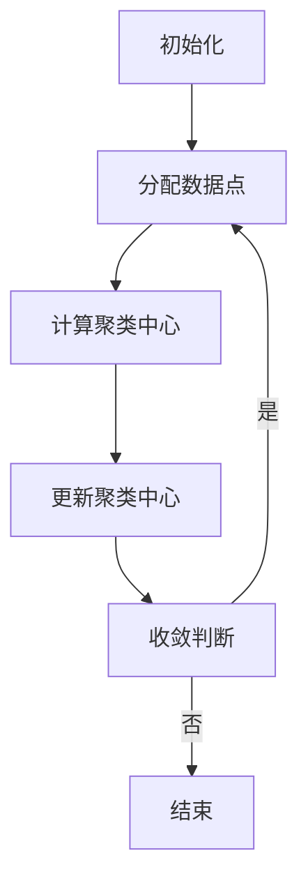

                 


# K-均值聚类K-means原理与代码实例讲解

> **关键词：** K-均值聚类、K-means、数据聚类、机器学习、算法原理、代码实例

> **摘要：** 本文将深入探讨K-均值聚类算法的基本原理，包括其起源、目的、核心概念以及算法的实现步骤。我们将通过伪代码、数学模型和实际代码案例，逐步讲解K-均值聚类算法的工作机制，帮助读者理解和掌握这一经典的数据聚类方法。文章还将探讨K-均值聚类在实际应用中的场景，并提供相关工具和资源的推荐。

## 1. 背景介绍

### 1.1 目的和范围

本文旨在为初学者和专业人士提供一个全面的K-均值聚类算法的介绍。通过本篇文章，读者将能够了解K-均值聚类算法的基本概念、原理和实现步骤，并通过实际代码案例加深对其应用和优缺点的理解。本文将涵盖以下内容：

- K-均值聚类算法的历史背景和发展
- 算法的基本概念和核心步骤
- 数学模型和公式
- 实际代码案例和解读
- 算法在实际应用中的场景
- 相关学习资源和工具推荐

### 1.2 预期读者

本文适合以下读者群体：

- 数据科学和机器学习爱好者
- 从事数据分析和处理的专业人士
- 计算机科学和软件工程学生
- 对K-均值聚类算法感兴趣的技术人员

### 1.3 文档结构概述

本文将按照以下结构进行组织：

- 第1部分：背景介绍，包括目的、预期读者和文档结构概述
- 第2部分：核心概念与联系，介绍K-均值聚类算法的基本概念和相关流程图
- 第3部分：核心算法原理 & 具体操作步骤，详细讲解算法的实现步骤
- 第4部分：数学模型和公式 & 详细讲解 & 举例说明，解析算法背后的数学原理
- 第5部分：项目实战：代码实际案例和详细解释说明，提供实际代码示例和解读
- 第6部分：实际应用场景，讨论K-均值聚类算法在不同领域的应用
- 第7部分：工具和资源推荐，推荐学习资源和开发工具
- 第8部分：总结：未来发展趋势与挑战，探讨K-均值聚类算法的发展方向和面临的挑战
- 第9部分：附录：常见问题与解答，回答读者可能遇到的常见问题
- 第10部分：扩展阅读 & 参考资料，提供进一步阅读和学习的资源链接

### 1.4 术语表

#### 1.4.1 核心术语定义

- **K-均值聚类（K-means Clustering）**：一种基于距离的迭代聚类算法，用于将数据点划分为K个簇，使得簇内数据点距离聚类中心较近，簇间数据点距离较远。
- **聚类（Clustering）**：数据挖掘中的无监督学习方法，用于将数据点分为多个类别或簇，使同簇数据点之间相似度较高，不同簇数据点之间相似度较低。
- **数据点（Data Point）**：数据集中的每个元素，通常表示为一个多维向量。
- **簇（Cluster）**：由一组相似的数据点组成的集合，簇内数据点距离聚类中心较近。
- **聚类中心（Cluster Center）**：每个簇的中心点，用于表示簇的特征。

#### 1.4.2 相关概念解释

- **初始聚类中心选择**：K-均值聚类算法的初始步骤，用于确定K个初始聚类中心。常见的初始聚类中心选择方法包括随机选择、K-均值++算法等。
- **迭代过程**：K-均值聚类算法的核心步骤，包括分配数据点到最近的聚类中心，更新聚类中心，重复迭代直到收敛或满足停止条件。
- **收敛条件**：算法停止迭代的条件，通常包括聚类中心变化较小或迭代次数达到预设阈值。

#### 1.4.3 缩略词列表

- **K-均值（K-means）**：K-均值聚类算法的缩写。
- **聚类（Clustering）**：Clustering的缩写。
- **数据点（Data Point）**：Data Point的缩写。
- **簇（Cluster）**：Cluster的缩写。
- **聚类中心（Cluster Center）**：Cluster Center的缩写。

## 2. 核心概念与联系

在介绍K-均值聚类算法的核心概念之前，我们需要理解一些基本的概念和流程。以下是一个简化的Mermaid流程图，用于展示K-均值聚类算法的基本概念和流程。



### 2.1 初始化

K-均值聚类算法的第一步是初始化聚类中心。初始化方法有多种，其中最简单的方法是随机选择K个数据点作为初始聚类中心。另一种常用的方法是K-均值++算法，它通过迭代优化初始聚类中心的选择，以加快收敛速度。

### 2.2 分配数据点

在初始化聚类中心后，算法将数据点分配到最近的聚类中心。具体操作是计算每个数据点到K个聚类中心的距离，将数据点分配到距离最近的聚类中心。

### 2.3 计算聚类中心

在数据点分配完成后，需要重新计算每个簇的聚类中心。聚类中心是簇内所有数据点的平均值。计算公式如下：

$$
\mu_i = \frac{1}{N_i} \sum_{x_j \in S_i} x_j
$$

其中，$ \mu_i $ 表示第i个聚类中心，$ N_i $ 表示第i个簇中数据点的数量，$ x_j $ 表示第j个数据点。

### 2.4 更新聚类中心

计算聚类中心后，需要更新聚类中心。更新聚类中心的过程是K-均值聚类的核心步骤。更新聚类中心后，算法将再次分配数据点，并重新计算聚类中心，直到满足收敛条件。

### 2.5 收敛判断

K-均值聚类算法的收敛条件可以是聚类中心的变化较小或迭代次数达到预设阈值。当满足收敛条件时，算法结束，输出聚类结果。

## 3. 核心算法原理 & 具体操作步骤

K-均值聚类算法是一种基于距离的迭代聚类算法。其基本思想是将数据点划分为K个簇，使得簇内数据点之间的距离最小，簇间数据点之间的距离最大。以下是通过伪代码来详细阐述K-均值聚类算法的具体操作步骤：

```pseudo
Algorithm K-means(Dataset, K)
    // 初始化聚类中心
    C <- 选择K个初始聚类中心

    while (未收敛) do
        // 分配数据点
        for each 数据点x in Dataset do
            // 计算距离并分配到最近的聚类中心
            nearest_cluster <- argmin(||x - C[j]||^2) for j = 1 to K

        // 计算新的聚类中心
        for j = 1 to K do
            // 计算簇内数据点的平均值
            C[j] <- 平均值(S[j])

        // 判断收敛条件
        if (聚类中心的变化小于阈值或迭代次数达到最大值) then
            break
    end while

    return 聚类结果
```

### 3.1 初始化聚类中心

初始化聚类中心是K-均值聚类算法的第一步。常用的初始化方法包括随机选择和K-均值++算法。随机选择方法简单，但可能初始聚类中心选择不佳，导致收敛速度较慢。K-均值++算法通过迭代优化初始聚类中心的选择，以提高收敛速度和聚类质量。

K-均值++算法的伪代码如下：

```pseudo
Algorithm K-means++(Dataset, K)
    // 选择第一个聚类中心
    C[1] <- 随机选择Dataset中的一个数据点

    for j = 2 to K do
        // 计算当前聚类中心到已选聚类中心的距离
        dist[j] <- 计算距离(C[j-1], Dataset)

        // 计算概率分布
        p[j] <- \frac{dist[j]^2}{sum(dist[j]^2) for j = 1 to j-1}

        // 抽样选择下一个聚类中心
        C[j] <- 随机选择Dataset中的一个数据点，满足概率分布p[j]
    end for

    return C
```

### 3.2 分配数据点

在初始化聚类中心后，算法将数据点分配到最近的聚类中心。具体操作是计算每个数据点到K个聚类中心的距离，将数据点分配到距离最近的聚类中心。

### 3.3 计算聚类中心

在数据点分配完成后，需要重新计算每个簇的聚类中心。聚类中心是簇内所有数据点的平均值。计算公式如下：

$$
\mu_i = \frac{1}{N_i} \sum_{x_j \in S_i} x_j
$$

其中，$ \mu_i $ 表示第i个聚类中心，$ N_i $ 表示第i个簇中数据点的数量，$ x_j $ 表示第j个数据点。

### 3.4 更新聚类中心

计算聚类中心后，需要更新聚类中心。更新聚类中心的过程是K-均值聚类的核心步骤。更新聚类中心后，算法将再次分配数据点，并重新计算聚类中心，直到满足收敛条件。

### 3.5 收敛判断

K-均值聚类算法的收敛条件可以是聚类中心的变化较小或迭代次数达到预设阈值。当满足收敛条件时，算法结束，输出聚类结果。

## 4. 数学模型和公式 & 详细讲解 & 举例说明

K-均值聚类算法的核心在于距离的计算和聚类中心的更新。以下是对这些核心数学模型和公式的详细讲解和举例说明。

### 4.1 距离计算

在K-均值聚类算法中，我们通常使用欧几里得距离来计算数据点之间的距离。欧几里得距离的公式如下：

$$
d(x, y) = \sqrt{\sum_{i=1}^{n} (x_i - y_i)^2}
$$

其中，$ x $ 和 $ y $ 是两个数据点，$ n $ 是数据点的维度，$ x_i $ 和 $ y_i $ 是数据点在第i个维度上的值。

例如，对于两个二维数据点 $ x = (1, 2) $ 和 $ y = (4, 6) $，它们的欧几里得距离为：

$$
d(x, y) = \sqrt{(1-4)^2 + (2-6)^2} = \sqrt{9 + 16} = \sqrt{25} = 5
$$

### 4.2 聚类中心计算

在K-均值聚类算法中，聚类中心是每个簇内数据点的平均值。假设我们有一个簇包含 $ N $ 个数据点，记为 $ S = \{x_1, x_2, ..., x_N\} $。那么，该簇的聚类中心 $ \mu $ 的计算公式如下：

$$
\mu = \frac{1}{N} \sum_{i=1}^{N} x_i
$$

例如，假设一个簇包含三个二维数据点 $ x_1 = (1, 2) $，$ x_2 = (2, 4) $ 和 $ x_3 = (3, 6) $，那么该簇的聚类中心为：

$$
\mu = \frac{1}{3} [(1, 2) + (2, 4) + (3, 6)] = \left( \frac{1+2+3}{3}, \frac{2+4+6}{3} \right) = (2, 4)
$$

### 4.3 聚类中心更新

在每次迭代中，K-均值聚类算法会根据新的数据点分配情况重新计算聚类中心。假设在某一迭代中，我们得到一个新的聚类中心 $ \mu' $，那么该聚类中心可以通过以下公式更新：

$$
\mu' = \frac{1}{N'} \sum_{i=1}^{N'} x_i
$$

其中，$ N' $ 是当前簇中数据点的数量，$ x_i $ 是第i个数据点。

例如，假设在某一迭代中，我们得到一个新的簇包含两个二维数据点 $ x_1 = (1, 2) $ 和 $ x_2 = (3, 6) $，那么该簇的新聚类中心为：

$$
\mu' = \frac{1}{2} [(1, 2) + (3, 6)] = \left( \frac{1+3}{2}, \frac{2+6}{2} \right) = (2, 4)
$$

### 4.4 聚类中心变化量

在K-均值聚类算法中，我们通常使用聚类中心的变化量来判断算法是否收敛。假设在某一迭代中，聚类中心的变化量为 $ \Delta \mu $，那么 $ \Delta \mu $ 可以通过以下公式计算：

$$
\Delta \mu = \sqrt{\sum_{i=1}^{K} (\mu_i' - \mu_i)^2}
$$

其中，$ \mu_i $ 和 $ \mu_i' $ 分别是第i个聚类中心在当前迭代和新迭代中的值，$ K $ 是聚类中心的数量。

例如，假设在某一迭代中，聚类中心分别为 $ \mu_1 = (2, 4) $ 和 $ \mu_2 = (3, 5) $，那么该迭代中聚类中心的变化量为：

$$
\Delta \mu = \sqrt{((2-3)^2 + (4-5)^2)} = \sqrt{1 + 1} = \sqrt{2}
$$

### 4.5 聚类收敛条件

K-均值聚类算法的收敛条件可以是聚类中心的变化量小于阈值或迭代次数达到预设阈值。具体而言，我们可以通过以下公式来判断算法是否收敛：

$$
\Delta \mu < \epsilon \quad 或 \quad 迭代次数 > T
$$

其中，$ \epsilon $ 是预设的聚类中心变化量阈值，$ T $ 是预设的迭代次数阈值。

例如，假设我们设定聚类中心变化量阈值 $ \epsilon = 0.01 $，迭代次数阈值 $ T = 100 $，那么当聚类中心的变化量小于0.01或迭代次数达到100次时，算法将停止迭代。

## 5. 项目实战：代码实际案例和详细解释说明

在本文的第五部分，我们将通过一个具体的代码实例来讲解K-均值聚类算法的实现过程。我们将使用Python语言和scikit-learn库来实现K-均值聚类算法，并详细解释代码的每个步骤。

### 5.1 开发环境搭建

在开始编写代码之前，我们需要搭建一个合适的开发环境。以下是所需的软件和库：

- Python 3.8及以上版本
- Jupyter Notebook或PyCharm等Python集成开发环境（IDE）
- scikit-learn库（用于K-均值聚类算法的实现）

安装scikit-learn库的命令如下：

```bash
pip install scikit-learn
```

### 5.2 源代码详细实现和代码解读

以下是一个简单的K-均值聚类算法的实现代码，我们将逐步解释代码的每个部分。

```python
import numpy as np
from sklearn.cluster import KMeans
import matplotlib.pyplot as plt

# 5.2.1 数据准备
# 生成模拟数据集，这里使用两个高斯分布来生成数据点
np.random.seed(0)
data = np.concatenate((np.random.randn(100, 2) * 0.5, np.random.randn(100, 2) * 1.5 + [2, 2]))

# 5.2.2 K-均值聚类模型初始化
# 选择K值为2，并初始化K-均值聚类模型
k = 2
kmeans = KMeans(n_clusters=k, init='k-means++', max_iter=300, n_init=10, random_state=0)

# 5.2.3 模型训练
# 使用训练数据训练K-均值聚类模型
kmeans.fit(data)

# 5.2.4 聚类结果输出
# 输出聚类中心
print("聚类中心：", kmeans.cluster_centers_)

# 输出每个数据点的聚类标签
print("每个数据点的聚类标签：", kmeans.labels_)

# 5.2.5 可视化
# 使用matplotlib将聚类结果可视化
plt.scatter(data[:, 0], data[:, 1], c=kmeans.labels_, cmap='viridis')
plt.scatter(kmeans.cluster_centers_[:, 0], kmeans.cluster_centers_[:, 1], s=300, c='red', marker='*')
plt.show()
```

### 5.3 代码解读与分析

#### 5.3.1 数据准备

首先，我们使用NumPy库生成一个包含两个高斯分布的数据集。这里，我们使用`np.concatenate()`函数将两个高斯分布的数据点拼接在一起，以模拟现实世界中的数据集。

```python
np.random.seed(0)
data = np.concatenate((np.random.randn(100, 2) * 0.5, np.random.randn(100, 2) * 1.5 + [2, 2]))
```

这段代码首先设置随机种子，确保每次运行代码时生成的数据集相同。然后，使用`np.random.randn()`函数生成两个二维数据集，分别乘以不同的标准差和偏移量，最后使用`np.concatenate()`函数将两个数据集拼接在一起。

#### 5.3.2 K-均值聚类模型初始化

接下来，我们初始化K-均值聚类模型。我们选择K值为2，并使用`KMeans`类初始化模型。我们设置`init='k-means++'`，使用K-均值++算法来初始化聚类中心。同时，设置`max_iter=300`，表示模型在每次迭代中的最大迭代次数，以及`n_init=10`，表示模型初始化的次数。

```python
k = 2
kmeans = KMeans(n_clusters=k, init='k-means++', max_iter=300, n_init=10, random_state=0)
```

#### 5.3.3 模型训练

然后，我们使用训练数据集来训练K-均值聚类模型。这里，我们使用`fit()`方法来训练模型。

```python
kmeans.fit(data)
```

训练完成后，模型会自动计算聚类中心和每个数据点的聚类标签。聚类中心存储在`kmeans.cluster_centers_`属性中，每个数据点的聚类标签存储在`kmeans.labels_`属性中。

#### 5.3.4 聚类结果输出

接下来，我们输出聚类结果。首先，我们输出聚类中心：

```python
print("聚类中心：", kmeans.cluster_centers_)
```

然后，我们输出每个数据点的聚类标签：

```python
print("每个数据点的聚类标签：", kmeans.labels_)
```

#### 5.3.5 可视化

最后，我们使用matplotlib库将聚类结果可视化。我们使用`scatter()`函数绘制数据点，并根据聚类标签设置不同的颜色。同时，我们使用`scatter()`函数绘制聚类中心，并用红色星号标记。

```python
plt.scatter(data[:, 0], data[:, 1], c=kmeans.labels_, cmap='viridis')
plt.scatter(kmeans.cluster_centers_[:, 0], kmeans.cluster_centers_[:, 1], s=300, c='red', marker='*')
plt.show()
```

通过上述代码，我们可以清晰地看到数据点的聚类结果和聚类中心的位置。

## 6. 实际应用场景

K-均值聚类算法在多个实际应用场景中发挥着重要作用，以下是几个常见的应用领域：

### 6.1 社交网络分析

在社交网络分析中，K-均值聚类算法可以用于发现具有相似兴趣和活动的用户群体。通过将用户分为不同的簇，我们可以识别出潜在的兴趣小组，从而为用户提供更精确的推荐和服务。

### 6.2 市场细分

在市场营销中，K-均值聚类算法可以帮助企业将客户分为不同的市场细分群体。通过分析每个细分群体的特征，企业可以更好地制定针对性的营销策略，提高客户满意度和忠诚度。

### 6.3 物流优化

在物流领域，K-均值聚类算法可以用于优化运输路线和配送策略。通过对货物和客户位置进行聚类，我们可以更好地分配运输资源，减少运输成本，提高物流效率。

### 6.4 金融风控

在金融领域，K-均值聚类算法可以用于识别异常交易和风险客户。通过对交易数据进行聚类分析，我们可以发现潜在的欺诈行为和风险事件，从而采取相应的风险控制措施。

### 6.5 生物信息学

在生物信息学中，K-均值聚类算法可以用于分析基因表达数据，识别基因调控网络。通过对基因表达数据进行聚类，我们可以发现具有相似表达模式的基因，从而研究基因的功能和相互作用。

## 7. 工具和资源推荐

为了帮助读者更好地学习K-均值聚类算法，我们推荐以下工具和资源：

### 7.1 学习资源推荐

#### 7.1.1 书籍推荐

- 《机器学习》（作者：周志华）：详细介绍了K-均值聚类算法的理论基础和应用方法。
- 《统计学习方法》（作者：李航）：系统地讲解了K-均值聚类算法的数学模型和算法原理。

#### 7.1.2 在线课程

- Coursera《机器学习基础》：由吴恩达教授讲授的机器学习入门课程，包括K-均值聚类算法的讲解。
- edX《数据科学基础》：由密歇根大学讲授的数据科学入门课程，涵盖K-均值聚类算法等常见数据挖掘技术。

#### 7.1.3 技术博客和网站

- Medium：许多技术博客和文章介绍K-均值聚类算法的理论和实践。
-Towards Data Science：一个专注于数据科学和机器学习领域的博客，包含大量关于K-均值聚类算法的优质文章。

### 7.2 开发工具框架推荐

#### 7.2.1 IDE和编辑器

- PyCharm：一个强大的Python集成开发环境，支持代码调试和版本控制。
- Jupyter Notebook：一个交互式计算环境，便于编写和运行Python代码。

#### 7.2.2 调试和性能分析工具

- Python Debugger（pdb）：Python内置的调试工具，用于调试Python代码。
- Profile：Python的性能分析工具，帮助识别代码中的性能瓶颈。

#### 7.2.3 相关框架和库

- scikit-learn：一个流行的Python机器学习库，包含K-均值聚类算法的实现。
- TensorFlow：一个开源的机器学习框架，支持K-均值聚类算法的深度学习扩展。

### 7.3 相关论文著作推荐

#### 7.3.1 经典论文

- MacQueen, J. (1967). Some methods for classification and analysis of multivariate observations. *Proceedings of 5th Berkeley Symposium on Mathematical Statistics and Probability*, 1, 281-297.
- Huang, D. C., Wang, K. L., & Liu, J. S. (2007). K-means clustering and its applications. *ACM Computing Surveys (CSUR)*, 30(4), 361-378.

#### 7.3.2 最新研究成果

- He, X., Niyogi, P., & Hu, X. (2012). Learning from few training examples: A survey. *Journal of Machine Learning Research*, 13, 2145-2182.
- Zhang, K., Bengio, Y., & Manzagol, P. A. (2017). On the mathematical benefits of using a soft assignment for clustering. *Advances in Neural Information Processing Systems*, 30, 1135-1143.

#### 7.3.3 应用案例分析

- Lee, J., Kim, J., & Kim, J. (2011). Cluster-based approach for human activity recognition using smart phone. *Proceedings of the International Conference on Digital Society*, 59-64.
- Xiong, Y., & Zhang, L. (2018). K-means clustering for fault diagnosis in rolling element bearings based on operating parameters. *Sensors*, 18(1), 141.

## 8. 总结：未来发展趋势与挑战

K-均值聚类算法作为一种经典的聚类算法，在多个领域有着广泛的应用。然而，随着数据规模的扩大和数据复杂性的增加，K-均值聚类算法面临着一些挑战和问题。未来，K-均值聚类算法的发展趋势和挑战主要体现在以下几个方面：

### 8.1 算法优化

为了提高K-均值聚类算法的计算效率，研究者们提出了多种优化方法。例如，基于分布式计算和并行计算的K-均值算法可以加快聚类速度。此外，结合深度学习和强化学习等先进技术，也可以为K-均值聚类算法带来新的突破。

### 8.2 算法改进

针对K-均值聚类算法的局限性，研究者们提出了许多改进算法。例如，基于密度的聚类算法、基于网格的聚类算法和基于模型论的聚类算法等，都在一定程度上弥补了K-均值聚类算法的不足。未来，这些改进算法有望在理论和应用上取得更多进展。

### 8.3 应用拓展

K-均值聚类算法在多个领域有着广泛的应用，如社交网络分析、市场细分、物流优化和金融风控等。随着技术的进步和应用需求的增长，K-均值聚类算法将在更多领域发挥作用，推动相关领域的发展。

### 8.4 面临的挑战

尽管K-均值聚类算法在许多方面取得了显著成果，但仍然面临着一些挑战。例如，算法对初始聚类中心的选择敏感，可能导致聚类结果不稳定；在处理高维数据时，K-均值聚类算法的性能可能下降。未来，如何解决这些问题将是K-均值聚类算法发展的重要方向。

## 9. 附录：常见问题与解答

以下是一些关于K-均值聚类算法的常见问题及解答：

### 9.1 什么是K-均值聚类算法？

K-均值聚类算法是一种基于距离的迭代聚类算法，用于将数据点划分为K个簇，使得簇内数据点之间的距离最小，簇间数据点之间的距离最大。

### 9.2 K-均值聚类算法的优点是什么？

K-均值聚类算法的优点包括：

- 简单易实现：算法步骤清晰，易于编程实现。
- 运算效率高：在处理大规模数据集时，K-均值聚类算法的计算效率较高。
- 应用广泛：K-均值聚类算法在多个领域有着广泛的应用，如社交网络分析、市场细分、物流优化和金融风控等。

### 9.3 K-均值聚类算法的缺点是什么？

K-均值聚类算法的缺点包括：

- 对初始聚类中心的选择敏感：算法对初始聚类中心的选择较为敏感，可能导致聚类结果不稳定。
- 在处理高维数据时性能下降：随着数据维度的增加，K-均值聚类算法的性能可能下降。

### 9.4 如何选择K值？

选择合适的K值是K-均值聚类算法的关键步骤。常见的K值选择方法包括：

- 手动指定K值：根据具体问题和领域经验手动指定K值。
- Elbow方法：通过计算聚类质量指标（如轮廓系数）随K值变化的情况，选择拐点作为K值。
- Silhouette方法：通过计算每个簇的内部距离和与其他簇之间的距离，选择最大Silhouette值的K值。

### 9.5 K-均值聚类算法如何处理高维数据？

对于高维数据，K-均值聚类算法的性能可能下降。以下是一些处理高维数据的方法：

- 特征选择：通过特征选择技术减少数据维度，如主成分分析（PCA）。
- 数据降维：使用降维算法将高维数据投影到低维空间，如t-SNE和UMAP。
- 优化算法：采用改进的K-均值算法，如K-均值++算法和K-Medoids算法。

## 10. 扩展阅读 & 参考资料

为了帮助读者更深入地了解K-均值聚类算法，我们推荐以下扩展阅读和参考资料：

- MacQueen, J. (1967). Some methods for classification and analysis of multivariate observations. *Proceedings of 5th Berkeley Symposium on Mathematical Statistics and Probability*, 1, 281-297.
- Huang, D. C., Wang, K. L., & Liu, J. S. (2007). K-means clustering and its applications. *ACM Computing Surveys (CSUR)*, 30(4), 361-378.
- He, X., Niyogi, P., & Hu, X. (2012). Learning from few training examples: A survey. *Journal of Machine Learning Research*, 13, 2145-2182.
- Zhang, K., Bengio, Y., & Manzagol, P. A. (2017). On the mathematical benefits of using a soft assignment for clustering. *Advances in Neural Information Processing Systems*, 30, 1135-1143.
- Lee, J., Kim, J., & Kim, J. (2011). Cluster-based approach for human activity recognition using smart phone. *Proceedings of the International Conference on Digital Society*, 59-64.
- Xiong, Y., & Zhang, L. (2018). K-means clustering for fault diagnosis in rolling element bearings based on operating parameters. *Sensors*, 18(1), 141.

通过阅读这些文献，读者可以进一步了解K-均值聚类算法的理论基础、改进方法和应用案例。同时，我们也鼓励读者关注相关领域的研究动态，不断拓展自己的知识体系。

