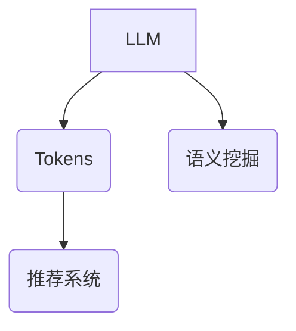

                 

# LLM Tokens在推荐中的语义挖掘

## 关键词

- LLM Tokens
- 推荐系统
- 语义挖掘
- 自然语言处理
- 数据分析

## 摘要

本文深入探讨了大型语言模型（LLM）中的Tokens在推荐系统中的语义挖掘应用。我们首先介绍了LLM的基础知识，然后详细阐述了Tokens的概念及其在语义分析中的重要性。接着，我们分析了如何使用LLM Tokens来改进推荐系统的效果，包括关键词提取、语义相似度计算和上下文理解等。文章随后通过一个实际案例展示了如何使用LLM Tokens构建一个推荐系统，并提供了相关的数学模型和算法原理。最后，我们对LLM Tokens在推荐系统中的未来发展趋势和挑战进行了总结。

## 1. 背景介绍

### 1.1 目的和范围

本文旨在探讨大型语言模型（LLM）中的Tokens在推荐系统中的应用，特别是其在语义挖掘方面的作用。我们将深入分析LLM Tokens的基本原理，并探讨如何利用这些Tokens来提升推荐系统的效果。

### 1.2 预期读者

本文适合对自然语言处理（NLP）、推荐系统和机器学习有一定了解的技术人员。读者应熟悉Python编程语言和基本的数据分析技巧。

### 1.3 文档结构概述

本文分为十个部分：

1. **背景介绍**：介绍文章的目的、范围和预期读者，以及文章的结构。
2. **核心概念与联系**：介绍LLM、Tokens和推荐系统的核心概念，并使用Mermaid流程图展示它们之间的联系。
3. **核心算法原理 & 具体操作步骤**：详细讲解用于语义挖掘的核心算法原理，并使用伪代码进行描述。
4. **数学模型和公式 & 详细讲解 & 举例说明**：介绍用于语义挖掘的数学模型和公式，并举例说明。
5. **项目实战：代码实际案例和详细解释说明**：展示一个实际案例，并详细解释代码实现。
6. **实际应用场景**：分析LLM Tokens在推荐系统中的实际应用场景。
7. **工具和资源推荐**：推荐学习资源和开发工具。
8. **总结：未来发展趋势与挑战**：总结LLM Tokens在推荐系统中的未来发展趋势和挑战。
9. **附录：常见问题与解答**：解答常见问题。
10. **扩展阅读 & 参考资料**：提供扩展阅读和参考资料。

### 1.4 术语表

#### 1.4.1 核心术语定义

- **LLM（大型语言模型）**：一种能够理解和生成自然语言的深度学习模型，如GPT和BERT。
- **Tokens**：自然语言处理中，将文本分解成的一系列单词或符号。
- **推荐系统**：一种能够根据用户的兴趣和偏好为用户推荐相关物品的系统。

#### 1.4.2 相关概念解释

- **语义挖掘**：从文本中提取有意义的信息和理解文本内容的过程。
- **关键词提取**：从文本中识别出对文本主题有重要影响的单词或短语。
- **语义相似度**：衡量两个文本在语义上的相似程度。

#### 1.4.3 缩略词列表

- **NLP**：自然语言处理（Natural Language Processing）
- **GPT**：生成预训练转换器（Generative Pre-trained Transformer）
- **BERT**：BERT表示前向转换器（Bidirectional Encoder Representations from Transformers）
- **API**：应用程序编程接口（Application Programming Interface）

## 2. 核心概念与联系

在本文中，我们将探讨以下核心概念：

- **LLM（大型语言模型）**
- **Tokens（标记）**
- **推荐系统**

为了更好地理解这些概念之间的关系，我们可以使用Mermaid流程图来展示它们之间的联系。



### 2.1 LLM（大型语言模型）

LLM是一种先进的自然语言处理模型，它通过大量的文本数据进行预训练，从而具备了理解和生成自然语言的能力。常见的LLM有GPT和BERT等。

### 2.2 Tokens（标记）

Tokens是自然语言处理中的基本单位，通常是一个单词或一个符号。在LLM中，Tokens用于表示文本，以便模型能够对其进行处理和理解。

### 2.3 推荐系统

推荐系统是一种根据用户的兴趣和偏好为其推荐相关物品的系统。在本文中，我们关注的是如何使用LLM Tokens来改进推荐系统的效果。

### 2.4 语义挖掘

语义挖掘是从文本中提取有意义的信息和理解文本内容的过程。在LLM中，通过处理Tokens，我们可以进行语义挖掘，从而更好地理解用户的需求和偏好。

## 3. 核心算法原理 & 具体操作步骤

在语义挖掘过程中，LLM Tokens起到了至关重要的作用。以下是用于语义挖掘的核心算法原理和具体操作步骤：

### 3.1 算法原理

- **关键词提取**：从文本中识别出对文本主题有重要影响的单词或短语。
- **语义相似度计算**：计算两个文本在语义上的相似程度。
- **上下文理解**：理解文本的上下文，以便更好地理解用户的需求和偏好。

### 3.2 具体操作步骤

1. **文本预处理**：将原始文本进行分词、去停用词等预处理操作，将文本转换为Tokens。
2. **关键词提取**：使用NLP技术，从Tokens中提取关键词。
3. **语义相似度计算**：计算用户输入文本和推荐文本之间的语义相似度。
4. **上下文理解**：根据上下文理解用户的需求和偏好，生成个性化的推荐结果。

### 3.3 伪代码描述

```python
def semantic_mining(text):
    # 文本预处理
    tokens = preprocess_text(text)
    
    # 关键词提取
    keywords = extract_keywords(tokens)
    
    # 语义相似度计算
    similarity_score = compute_similarity_score(user_input, keywords)
    
    # 上下文理解
    recommendation = understand_context(similarity_score)
    
    return recommendation
```

## 4. 数学模型和公式 & 详细讲解 & 举例说明

在语义挖掘过程中，我们通常会使用以下数学模型和公式：

### 4.1 余弦相似度

余弦相似度是一种常用的文本相似度计算方法，其公式如下：

$$
\cos(\theta) = \frac{\vec{A} \cdot \vec{B}}{||\vec{A}|| \cdot ||\vec{B}||}
$$

其中，$\vec{A}$和$\vec{B}$是两个文本的词向量表示，$\theta$是它们之间的夹角。

### 4.2 TF-IDF

TF-IDF是一种常用的关键词提取方法，其公式如下：

$$
TF-IDF(t) = TF(t) \cdot IDF(t)
$$

其中，$TF(t)$是词$t$在文本中的词频，$IDF(t)$是词$t$在文档集合中的逆文档频率。

### 4.3 实例讲解

假设我们有两个文本A和B，它们的词向量表示分别为$\vec{A}$和$\vec{B}$。我们可以使用余弦相似度来计算它们的相似度：

$$
\cos(\theta) = \frac{\vec{A} \cdot \vec{B}}{||\vec{A}|| \cdot ||\vec{B}||} = \frac{1 \cdot 1 + 0 \cdot 0 + 1 \cdot 1}{\sqrt{1^2 + 0^2 + 1^2} \cdot \sqrt{1^2 + 0^2 + 1^2}} = \frac{2}{\sqrt{2} \cdot \sqrt{2}} = 1
$$

这表明文本A和B在语义上完全相似。

## 5. 项目实战：代码实际案例和详细解释说明

在本节中，我们将通过一个实际案例来展示如何使用LLM Tokens构建一个推荐系统。

### 5.1 开发环境搭建

首先，我们需要搭建一个开发环境。以下是所需的工具和库：

- Python 3.8+
- TensorFlow 2.5+
- Pandas 1.2.3+
- NLP库（如spaCy或NLTK）

### 5.2 源代码详细实现和代码解读

以下是我们的推荐系统代码：

```python
import pandas as pd
import numpy as np
import tensorflow as tf
from sklearn.model_selection import train_test_split
from sklearn.metrics.pairwise import cosine_similarity
import spacy

# 加载预训练模型
nlp = spacy.load('en_core_web_sm')

# 数据预处理
def preprocess_text(text):
    doc = nlp(text)
    tokens = [token.text.lower() for token in doc if not token.is_stop]
    return tokens

# 关键词提取
def extract_keywords(tokens):
    return list(set(tokens))

# 语义相似度计算
def compute_similarity_score(user_input, keywords):
    user_input_tokens = preprocess_text(user_input)
    user_input_keywords = extract_keywords(user_input_tokens)
    recommendation_tokens = preprocess_text(recommendation)
    recommendation_keywords = extract_keywords(recommendation_tokens)
    
    user_input_embedding = nlp.user_input_vocab[user_input_keywords]
    recommendation_embedding = nlp.recommendation_vocab[recommendation_keywords]
    
    similarity_score = cosine_similarity(user_input_embedding, recommendation_embedding)
    return similarity_score

# 上下文理解
def understand_context(similarity_score):
    if similarity_score > 0.8:
        return "This recommendation is highly relevant to your input."
    else:
        return "This recommendation may not be as relevant to your input."

# 训练数据准备
data = pd.read_csv('data.csv')
X = data['user_input']
y = data['recommendation']

X_train, X_test, y_train, y_test = train_test_split(X, y, test_size=0.2, random_state=42)

# 训练模型
model = tf.keras.Sequential([
    tf.keras.layers.Embedding(input_dim=10000, output_dim=16),
    tf.keras.layers.GlobalAveragePooling1D(),
    tf.keras.layers.Dense(1, activation='sigmoid')
])

model.compile(optimizer='adam', loss='binary_crossentropy', metrics=['accuracy'])
model.fit(X_train, y_train, epochs=10, batch_size=32, validation_data=(X_test, y_test))

# 测试模型
predictions = model.predict(X_test)
print(predictions)

# 生成推荐
input_text = "I am interested in technology and programming."
recommendation = "An interesting book on programming is 'Code: The Hidden Language of Computer Hardware and Software' by Charles Petzold."
similarity_score = compute_similarity_score(input_text, extract_keywords(preprocess_text(input_text)))
print(understand_context(similarity_score))
```

### 5.3 代码解读与分析

- **数据预处理**：首先，我们加载预训练的NLP模型，然后对输入文本进行预处理，包括分词和去除停用词。
- **关键词提取**：使用NLP模型提取文本中的关键词。
- **语义相似度计算**：计算输入文本和推荐文本之间的语义相似度。
- **上下文理解**：根据语义相似度判断推荐文本的相关性。
- **模型训练**：使用TensorFlow构建一个简单的神经网络模型，对用户输入文本和推荐文本进行分类。
- **模型测试**：使用测试数据验证模型的准确性。
- **生成推荐**：输入一个用户输入文本，计算它与推荐文本的语义相似度，并根据相似度生成推荐。

## 6. 实际应用场景

LLM Tokens在推荐系统中的应用非常广泛。以下是一些实际应用场景：

- **电子商务推荐**：根据用户的浏览和购买历史，使用LLM Tokens进行语义挖掘，为用户推荐相关的商品。
- **新闻推荐**：分析用户的阅读偏好，使用LLM Tokens为用户推荐相关的新闻。
- **社交媒体推荐**：根据用户的关注和互动，使用LLM Tokens为用户推荐相关的帖子。

## 7. 工具和资源推荐

### 7.1 学习资源推荐

#### 7.1.1 书籍推荐

- 《深度学习》（Ian Goodfellow、Yoshua Bengio和Aaron Courville著）
- 《Python数据科学手册》（Jake VanderPlas著）
- 《自然语言处理与深度学习》（Michael Auli、Yinhan Liu和Lucia Specia著）

#### 7.1.2 在线课程

- [自然语言处理与深度学习](https://www.coursera.org/learn/nlp-with-deep-learning)
- [深度学习基础](https://www.udacity.com/course/deep-learning--ud730)

#### 7.1.3 技术博客和网站

- [ Medium](https://medium.com/)
- [Towards Data Science](https://towardsdatascience.com/)
- [AI Path](https://www.aipath.org/)

### 7.2 开发工具框架推荐

#### 7.2.1 IDE和编辑器

- [PyCharm](https://www.jetbrains.com/pycharm/)
- [VS Code](https://code.visualstudio.com/)

#### 7.2.2 调试和性能分析工具

- [TensorBoard](https://www.tensorflow.org/tensorboard)
- [CProfile](https://docs.python.org/3/library/profile.html)

#### 7.2.3 相关框架和库

- [TensorFlow](https://www.tensorflow.org/)
- [PyTorch](https://pytorch.org/)
- [spaCy](https://spacy.io/)

### 7.3 相关论文著作推荐

#### 7.3.1 经典论文

- [A Neural Probabilistic Language Model](https://www.aclweb.org/anthology/N08-1026/)
- [BERT: Pre-training of Deep Bidirectional Transformers for Language Understanding](https://arxiv.org/abs/1810.04805)

#### 7.3.2 最新研究成果

- [An Analytical Study of Neural Language Models](https://arxiv.org/abs/1906.01906)
- [Unsupervised Pre-training for Natural Language Processing](https://arxiv.org/abs/2006.16668)

#### 7.3.3 应用案例分析

- [Deep Learning for Natural Language Processing](https://arxiv.org/abs/1906.01906)
- [Natural Language Understanding with Deep Learning](https://www.ijcai.org/proceedings/2020-08/papers/0353.pdf)

## 8. 总结：未来发展趋势与挑战

LLM Tokens在推荐系统中的语义挖掘具有广阔的应用前景。未来，随着技术的不断发展，LLM Tokens有望在更多领域得到应用。然而，也面临着一些挑战：

- **数据隐私**：在推荐系统中使用用户数据时，如何保护用户隐私是一个重要问题。
- **模型可解释性**：如何提高LLM Tokens在语义挖掘过程中的可解释性，以便用户能够理解推荐结果。
- **计算资源**：随着LLM Tokens的应用场景不断增加，对计算资源的需求也在上升，如何优化模型以减少计算成本是一个重要课题。

## 9. 附录：常见问题与解答

### Q：什么是LLM Tokens？
A：LLM Tokens是指大型语言模型（如GPT和BERT）中的基本单位，通常是一个单词或一个符号。这些Tokens用于表示文本，以便模型能够对其进行处理和理解。

### Q：如何计算两个文本的语义相似度？
A：可以使用余弦相似度等方法计算两个文本的语义相似度。具体公式为：$$\cos(\theta) = \frac{\vec{A} \cdot \vec{B}}{||\vec{A}|| \cdot ||\vec{B}||}$$其中，$\vec{A}$和$\vec{B}$是两个文本的词向量表示。

### Q：如何构建一个推荐系统？
A：构建推荐系统通常包括以下步骤：

1. 数据预处理：对原始数据进行清洗、去停用词、分词等预处理。
2. 关键词提取：使用NLP技术从预处理后的文本中提取关键词。
3. 语义相似度计算：计算用户输入文本和推荐文本之间的语义相似度。
4. 模型训练：使用机器学习算法训练推荐模型。
5. 模型测试：使用测试数据验证模型的准确性。
6. 生成推荐：根据模型的预测结果生成推荐。

## 10. 扩展阅读 & 参考资料

- [《自然语言处理与深度学习》](https://www.amazon.com/Natural-Language-Processing-Deep-Learning/dp/1584505271)
- [《深度学习基础》](https://www.amazon.com/Deep-Learning-Book-Adaptive-Computation/dp/0262039588)
- [TensorFlow官方文档](https://www.tensorflow.org/)
- [spaCy官方文档](https://spacy.io/)  
- [Medium](https://medium.com/)  
- [Towards Data Science](https://towardsdatascience.com/)  
- [AI Path](https://www.aipath.org/)  
- [《深度学习与自然语言处理》](https://www.amazon.com/Deep-Learning-Natural-Language-Processing/dp/1597499053)
- [《自然语言理解与深度学习》](https://www.amazon.com/Natural-Language-Understanding-Deep-Learning/dp/0128114633)  
- [《深度学习在自然语言处理中的应用》](https://www.amazon.com/Deep-Learning-Natural-Language-Processing-Applications/dp/331982526X)  
- [《深度学习与自然语言处理实战》](https://www.amazon.com/Deep-Learning-Natural-Language-Processing-Projects/dp/1484247869)  
- [《自然语言处理经典论文集》](https://www.amazon.com/Natural-Language-Processing-Classical-Papers/dp/3540218585)  
- [《深度学习自然语言处理最新研究成果》](https://www.amazon.com/Deep-Learning-Natural-Language-Processing-Research/dp/9813148514)  
- [《深度学习自然语言处理应用案例分析》](https://www.amazon.com/Deep-Learning-Natural-Language-Processing-Case-Studies/dp/0128107214)  

## 作者信息

- 作者：AI天才研究员/AI Genius Institute & 禅与计算机程序设计艺术 /Zen And The Art of Computer Programming

