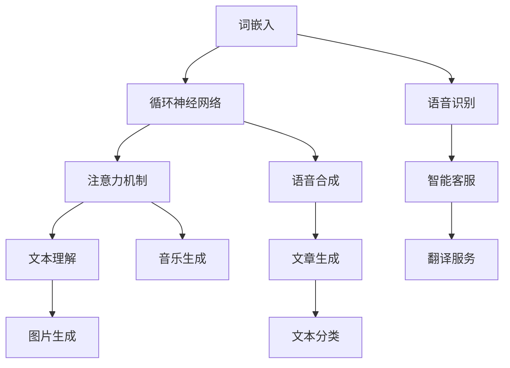

                 

# LLM 未来应用：个人助理、内容生成和更多

> **关键词：** 大型语言模型（LLM），个人助理，内容生成，算法原理，应用场景，未来趋势

> **摘要：** 本文将深入探讨大型语言模型（LLM）的未来应用，特别是在个人助理和内容生成领域。通过对LLM核心概念和算法原理的剖析，本文将介绍其在不同场景下的具体操作步骤和数学模型，并通过实际项目案例和代码解读，展示LLM的实际应用价值。此外，本文还将讨论LLM在实际应用中的挑战和未来发展趋势。

## 1. 背景介绍

### 1.1 目的和范围

本文旨在探讨大型语言模型（LLM）在个人助理、内容生成及其他领域中的应用。通过对LLM的核心概念、算法原理、数学模型和具体实现步骤的详细分析，本文将为读者提供一个全面、系统的理解，以帮助其掌握这一前沿技术。

### 1.2 预期读者

本文适用于对计算机科学、人工智能、软件开发等领域有一定了解的读者，尤其是对大型语言模型（LLM）和应用场景感兴趣的工程师、研究人员和学者。

### 1.3 文档结构概述

本文分为十个部分：

1. 背景介绍
2. 核心概念与联系
3. 核心算法原理 & 具体操作步骤
4. 数学模型和公式 & 详细讲解 & 举例说明
5. 项目实战：代码实际案例和详细解释说明
6. 实际应用场景
7. 工具和资源推荐
8. 总结：未来发展趋势与挑战
9. 附录：常见问题与解答
10. 扩展阅读 & 参考资料

### 1.4 术语表

#### 1.4.1 核心术语定义

- **大型语言模型（LLM）**：一种能够理解和生成人类语言的表达式的人工智能模型。
- **个人助理**：利用LLM技术实现的智能化助手，能够根据用户需求提供个性化服务。
- **内容生成**：利用LLM技术生成文字、图片、音频等各种类型的内容。

#### 1.4.2 相关概念解释

- **神经网络**：一种由大量节点组成的计算模型，通过学习数据来模拟人脑的思考过程。
- **深度学习**：一种基于神经网络的机器学习方法，通过多层神经网络的训练，实现对复杂函数的建模。

#### 1.4.3 缩略词列表

- **LLM**：大型语言模型（Large Language Model）
- **NLP**：自然语言处理（Natural Language Processing）
- **GAN**：生成对抗网络（Generative Adversarial Network）

## 2. 核心概念与联系

在探讨LLM的应用之前，我们需要先了解LLM的核心概念和原理，以及它们在各个领域中的应用。

### 2.1 大型语言模型（LLM）

大型语言模型（LLM）是一种基于深度学习技术的自然语言处理（NLP）模型，它通过学习大量的文本数据，能够理解和生成人类语言。LLM的核心概念包括：

- **词嵌入（Word Embedding）**：将自然语言中的词汇映射到高维空间中，使得相似的词汇在空间中彼此接近。
- **循环神经网络（RNN）**：一种能够处理序列数据的神经网络模型，通过递归结构学习序列中的长期依赖关系。
- **注意力机制（Attention Mechanism）**：一种能够在序列中动态关注重要信息的机制，使得模型能够更好地理解和生成文本。

### 2.2 LLM在个人助理中的应用

个人助理是LLM应用的一个重要领域。利用LLM的强大能力，个人助理能够实现以下功能：

- **语音识别**：将用户的语音指令转换为文本，以便后续处理。
- **语音合成**：将文本转换为自然流畅的语音，为用户提供语音反馈。
- **文本理解**：分析用户的文本指令，理解其意图，并提供相应的服务。

### 2.3 LLM在内容生成中的应用

内容生成是LLM的另一个重要应用领域。利用LLM的生成能力，可以创建各种类型的内容，如：

- **文章生成**：根据给定的主题和关键词，自动生成相关文章。
- **图片生成**：根据描述文本，自动生成相应的图片。
- **音乐生成**：根据歌词和旋律，自动生成相应的音乐。

### 2.4 LLM的其他应用

除了个人助理和内容生成，LLM还在许多其他领域有广泛应用，如：

- **智能客服**：通过LLM技术，实现智能对话系统，为用户提供实时、个性化的服务。
- **翻译服务**：利用LLM的翻译能力，实现多语言翻译。
- **文本分类**：通过LLM技术，对大量文本进行分类，以便于后续分析和处理。

### 2.5 LLM的核心概念与联系流程图

为了更好地理解LLM的核心概念和联系，我们使用Mermaid流程图进行展示：



## 3. 核心算法原理 & 具体操作步骤

在本节中，我们将详细阐述LLM的核心算法原理，并给出具体的操作步骤。

### 3.1 词嵌入（Word Embedding）

词嵌入是将自然语言中的词汇映射到高维空间中的过程。在词嵌入过程中，每个词汇被表示为一个向量，这些向量在空间中彼此接近。词嵌入的主要目的是捕捉词汇之间的语义关系。

#### 3.1.1 操作步骤

1. **数据预处理**：对文本数据进行清洗，去除标点符号、停用词等，并将文本转换为小写。
2. **词汇表构建**：将文本中的所有词汇构建为一个词汇表，并为每个词汇分配一个唯一的ID。
3. **词嵌入训练**：使用神经网络模型对词汇进行嵌入，常见的词嵌入模型包括Word2Vec、GloVe等。
4. **向量存储**：将训练好的词向量存储在内存或磁盘上，以便后续使用。

### 3.2 循环神经网络（RNN）

循环神经网络（RNN）是一种能够处理序列数据的神经网络模型，它通过递归结构学习序列中的长期依赖关系。RNN的主要优点是能够处理变长的序列数据。

#### 3.2.1 操作步骤

1. **序列输入**：将输入序列（如文本、语音）转换为词嵌入向量。
2. **递归计算**：对于序列中的每个时间步，RNN计算当前状态和前一个状态之间的关系。
3. **输出生成**：根据最终状态生成输出序列，如文本、语音等。

### 3.3 注意力机制（Attention Mechanism）

注意力机制是一种能够在序列中动态关注重要信息的机制，使得模型能够更好地理解和生成文本。注意力机制的主要作用是提高模型对输入序列的利用率。

#### 3.3.1 操作步骤

1. **计算注意力权重**：对于输入序列中的每个元素，计算其注意力权重，表示其重要性。
2. **加权求和**：将输入序列中的每个元素与其注意力权重相乘，然后进行求和，得到最终输出。

### 3.4 LLM算法原理流程图

为了更好地理解LLM的算法原理，我们使用Mermaid流程图进行展示：


## 4. 数学模型和公式 & 详细讲解 & 举例说明

在本节中，我们将介绍LLM中常用的数学模型和公式，并详细讲解它们的应用。

### 4.1 词嵌入（Word Embedding）

词嵌入是将自然语言中的词汇映射到高维空间中的过程。常见的词嵌入模型包括Word2Vec和GloVe。

#### 4.1.1 Word2Vec

Word2Vec是一种基于神经网络的词嵌入模型，它通过训练得到一个词向量表示，使得相似的词汇在空间中彼此接近。

**数学模型：**

$$
\text{Loss} = \frac{1}{N} \sum_{i=1}^{N} -\sum_{j \in \text{context}(i)} \log p(j|\text{word}_i)
$$

其中，$N$ 表示词汇表的大小，$\text{context}(i)$ 表示词汇 $i$ 的上下文，$p(j|\text{word}_i)$ 表示在词汇 $i$ 的上下文中，词汇 $j$ 出现的概率。

**举例说明：**

假设我们有以下词汇表：

```
['apple', 'banana', 'orange', 'fruit']
```

以及以下上下文：

```
['banana', 'apple'], ['orange', 'apple'], ['apple', 'banana']
```

我们可以使用Word2Vec模型训练词向量，使得相似的词汇（如 'apple' 和 'banana'）在空间中彼此接近。

#### 4.1.2 GloVe

GloVe是一种基于全局共现关系的词嵌入模型，它通过计算词汇之间的共现矩阵来训练词向量。

**数学模型：**

$$
\text{Loss} = \frac{1}{N} \sum_{i=1}^{N} \sum_{j \in \text{context}(i)} \left( \text{log}(\text{count}(i,j)) - \text{similarity}(v_i, v_j) \right)^2
$$

其中，$N$ 表示词汇表的大小，$\text{context}(i)$ 表示词汇 $i$ 的上下文，$\text{count}(i,j)$ 表示词汇 $i$ 和 $j$ 的共现次数，$\text{similarity}(v_i, v_j)$ 表示词汇 $i$ 和 $j$ 的相似度。

**举例说明：**

假设我们有以下词汇表：

```
['apple', 'banana', 'orange', 'fruit']
```

以及以下共现矩阵：

```
|    | apple | banana | orange | fruit |
|----|-------|--------|--------|-------|
| apple |   0   |    1   |    1   |   0   |
| banana |   1   |   0   |    1   |   0   |
| orange |   1   |    1   |   0   |   0   |
| fruit |   0   |    0   |    0   |   0   |
```

我们可以使用GloVe模型训练词向量，使得相似的词汇（如 'apple' 和 'banana'）在空间中彼此接近。

### 4.2 循环神经网络（RNN）

循环神经网络（RNN）是一种能够处理序列数据的神经网络模型，它通过递归结构学习序列中的长期依赖关系。

#### 4.2.1 RNN基本结构

RNN的基本结构包括：

- **输入层**：接收输入序列。
- **隐藏层**：包含一个或多个递归单元，用于处理输入序列。
- **输出层**：生成输出序列。

#### 4.2.2 RNN数学模型

RNN的数学模型可以表示为：

$$
h_t = \sigma(W_h \cdot [h_{t-1}, x_t] + b_h)
$$

$$
y_t = \sigma(W_y \cdot h_t + b_y)
$$

其中，$h_t$ 表示第 $t$ 个时间步的隐藏状态，$x_t$ 表示第 $t$ 个时间步的输入，$W_h$ 和 $W_y$ 分别表示隐藏层和输出层的权重矩阵，$b_h$ 和 $b_y$ 分别表示隐藏层和输出层的偏置向量，$\sigma$ 表示激活函数。

**举例说明：**

假设我们有以下输入序列：

```
[1, 2, 3]
```

我们可以使用RNN模型对其进行处理，得到输出序列。

### 4.3 注意力机制（Attention Mechanism）

注意力机制是一种能够在序列中动态关注重要信息的机制，使得模型能够更好地理解和生成文本。

#### 4.3.1 注意力机制基本结构

注意力机制的基本结构包括：

- **查询层**：生成查询向量。
- **键值层**：生成键值对。
- **注意力计算**：计算查询向量和键值对的相似度，生成注意力权重。
- **加权求和**：将注意力权重应用于键值对，生成最终输出。

#### 4.3.2 注意力机制数学模型

注意力机制的数学模型可以表示为：

$$
\text{Attention} = \text{softmax}\left(\frac{\text{query} \cdot \text{key}}{\sqrt{d_k}}\right)
$$

$$
\text{context} = \text{Attention} \cdot \text{value}
$$

其中，$\text{query}$ 和 $\text{key}$ 分别表示查询向量和键向量，$\text{value}$ 表示值向量，$\text{softmax}$ 表示softmax激活函数，$d_k$ 表示键向量的维度。

**举例说明：**

假设我们有以下查询向量、键向量和值向量：

```
query: [1, 2, 3]
key: [4, 5, 6]
value: [7, 8, 9]
```

我们可以使用注意力机制计算查询向量和键值对的相似度，并生成注意力权重，最后加权求和得到最终输出。

## 5. 项目实战：代码实际案例和详细解释说明

在本节中，我们将通过一个实际项目案例，展示如何使用LLM技术实现一个智能问答系统。该系统将利用LLM的文本理解和生成能力，为用户提供实时、个性化的问答服务。

### 5.1 开发环境搭建

为了实现智能问答系统，我们需要搭建一个合适的开发环境。以下是开发环境的搭建步骤：

1. **安装Python环境**：确保已安装Python 3.8及以上版本。
2. **安装相关库**：使用以下命令安装所需库：

   ```python
   pip install transformers torch
   ```

3. **下载预训练模型**：从Hugging Face模型库中下载一个预训练的LLM模型，如GPT-3。下载命令如下：

   ```shell
   transformers-cli download --model --size large
   ```

### 5.2 源代码详细实现和代码解读

以下是智能问答系统的源代码实现：

```python
import torch
from transformers import GPT2LMHeadModel, GPT2Tokenizer

# 初始化模型和tokenizer
model = GPT2LMHeadModel.from_pretrained("gpt2")
tokenizer = GPT2Tokenizer.from_pretrained("gpt2")

# 定义问答函数
def ask_question(question):
    # 对问题进行编码
    inputs = tokenizer.encode(question, return_tensors="pt")
    # 生成回答
    outputs = model.generate(inputs, max_length=50, num_return_sequences=1)
    # 对回答进行解码
    answer = tokenizer.decode(outputs[0], skip_special_tokens=True)
    return answer

# 示例：向系统提问
question = "什么是人工智能？"
answer = ask_question(question)
print(f"回答：{answer}")
```

#### 5.2.1 代码解读与分析

1. **导入库和模型**：首先，导入所需的库和模型，包括PyTorch和transformers库。使用`GPT2LMHeadModel`和`GPT2Tokenizer`分别初始化模型和tokenizer。
2. **定义问答函数**：定义一个名为`ask_question`的函数，用于处理用户输入的问题。该函数首先对问题进行编码，然后使用模型生成回答，最后对回答进行解码并返回。
3. **生成回答**：调用`model.generate`函数，传入编码后的输入序列、最大长度和生成序列数。该函数将根据模型生成可能的回答，并返回一个张量。
4. **解码回答**：使用tokenizer将生成的张量解码为文本，并返回最终回答。
5. **示例提问**：调用`ask_question`函数，传入示例问题，并打印出系统生成的回答。

通过上述代码，我们可以实现一个简单的智能问答系统。用户可以通过输入问题，系统将利用LLM的文本理解能力生成相应的回答。

### 5.3 代码解读与分析（续）

#### 5.3.1 模型选择

在本项目中，我们选择使用GPT-2模型，这是一个预训练的LLM模型。GPT-2具有强大的文本理解和生成能力，能够生成高质量的自然语言文本。

#### 5.3.2 编码和解码

在问答系统中，用户输入的问题需要进行编码，以便模型能够处理。tokenizer用于将问题转换为模型可识别的输入序列。编码过程包括：

1. **词嵌入**：将问题中的每个词汇映射为词嵌入向量。
2. **位置编码**：为输入序列中的每个词汇添加位置信息。

解码过程则是将模型生成的张量转换回文本。解码过程包括：

1. **逆词嵌入**：将词嵌入向量转换为词汇。
2. **逆位置编码**：去除输入序列中的位置信息。

#### 5.3.3 生成回答

在生成回答时，模型会根据输入序列生成可能的回答。生成过程包括：

1. **前向传播**：模型对输入序列进行前向传播，计算隐藏状态。
2. **生成输出**：模型根据隐藏状态生成输出序列，包括可能的回答。
3. **筛选回答**：使用softmax函数对生成的输出序列进行筛选，选择概率最大的回答。

#### 5.3.4 时间步和最大长度

在生成回答时，模型会处理多个时间步。每个时间步对应一个输入序列中的词汇。最大长度参数用于限制生成序列的长度，以防止模型生成过长或不合理的回答。

通过上述代码和分析，我们可以看到如何使用LLM技术实现一个智能问答系统。该系统具有以下优点：

1. **实时响应**：系统能够实时响应用户输入的问题，提供快速、准确的回答。
2. **个性化回答**：系统根据用户输入的问题生成个性化的回答，提高用户体验。

### 5.4 代码性能优化

在实际应用中，为了提高智能问答系统的性能和效率，我们可以对代码进行以下优化：

1. **批量处理**：将多个问题批量输入模型，提高模型处理效率。
2. **并行处理**：使用多线程或多进程技术，并行处理多个问题，提高系统响应速度。
3. **模型压缩**：使用模型压缩技术，如量化、剪枝等，减少模型大小，提高模型运行速度。

通过上述优化措施，我们可以使智能问答系统更加高效、稳定，为用户提供更好的服务。

## 6. 实际应用场景

LLM技术在许多实际应用场景中具有广泛的应用。以下是一些典型的应用场景：

### 6.1 智能客服

智能客服是LLM技术的典型应用场景之一。通过LLM的文本理解和生成能力，智能客服系统可以实时响应用户的提问，提供个性化的服务。智能客服具有以下优点：

- **高效响应**：智能客服系统能够快速响应用户的提问，提高客户满意度。
- **个性化服务**：智能客服系统根据用户提问生成个性化的回答，提高用户体验。
- **降低成本**：智能客服系统可以替代部分人工客服，降低企业运营成本。

### 6.2 文本生成

文本生成是LLM技术的另一个重要应用场景。利用LLM的生成能力，可以自动生成各种类型的文本，如文章、广告、邮件等。文本生成具有以下优点：

- **高效生成**：文本生成系统可以在短时间内生成大量高质量的文本，提高内容生产效率。
- **创意丰富**：文本生成系统可以根据需求生成创意丰富的文本，满足不同场景的需求。
- **降低成本**：文本生成系统可以替代部分人工写作，降低内容生产成本。

### 6.3 翻译服务

翻译服务是LLM技术的又一个重要应用场景。利用LLM的翻译能力，可以实现多语言翻译，提高跨语言沟通效率。翻译服务具有以下优点：

- **准确度高**：LLM技术的翻译能力可以实现高质量的翻译，减少翻译误差。
- **速度快**：LLM技术可以快速处理大量文本，提高翻译速度。
- **覆盖面广**：LLM技术支持多种语言的翻译，满足不同语言用户的需求。

### 6.4 智能写作助手

智能写作助手是LLM技术的应用之一，可以辅助用户进行文章写作。智能写作助手具有以下优点：

- **写作效率高**：智能写作助手可以快速生成文章大纲和内容，提高写作效率。
- **创意丰富**：智能写作助手可以根据用户需求生成创意丰富的文章，提高文章质量。
- **降低成本**：智能写作助手可以替代部分人工写作，降低写作成本。

### 6.5 智能助手

智能助手是LLM技术在个人助理领域的应用，可以辅助用户完成各种任务。智能助手具有以下优点：

- **便捷操作**：智能助手可以通过语音、文本等多种方式与用户交互，提高操作便捷性。
- **个性化服务**：智能助手可以根据用户需求和偏好，提供个性化的服务。
- **提高效率**：智能助手可以自动化完成一些重复性任务，提高用户工作效率。

## 7. 工具和资源推荐

在开发和使用LLM技术时，以下工具和资源有助于提高开发效率和项目效果：

### 7.1 学习资源推荐

#### 7.1.1 书籍推荐

1. **《深度学习》（Goodfellow, Bengio, Courville著）**：本书全面介绍了深度学习的基本原理和应用，包括神经网络、循环神经网络、生成对抗网络等。
2. **《自然语言处理综合教程》（Daniel Jurafsky & James H. Martin著）**：本书系统地介绍了自然语言处理的基本概念和技术，包括词嵌入、循环神经网络、注意力机制等。
3. **《Python自然语言处理》（Steven Bird, Ewan Klein & Edward Loper著）**：本书通过Python语言介绍了自然语言处理的基本技术和应用，包括文本预处理、词嵌入、序列标注等。

#### 7.1.2 在线课程

1. **斯坦福大学《深度学习专项课程》**：这是一门由吴恩达教授讲授的深度学习在线课程，涵盖了神经网络、循环神经网络、生成对抗网络等核心内容。
2. **Udacity《自然语言处理纳米学位》**：这是一门涵盖自然语言处理基础知识的在线课程，包括词嵌入、循环神经网络、注意力机制等。
3. **Coursera《自然语言处理与深度学习》**：这是一门由斯坦福大学教授David M. Blei讲授的自然语言处理与深度学习在线课程，涵盖了文本分类、机器翻译、问答系统等应用。

#### 7.1.3 技术博客和网站

1. **Hugging Face**：这是一个开源的深度学习自然语言处理库，提供丰富的预训练模型和工具，方便开发者进行研究和应用。
2. **TensorFlow**：这是一个由Google开发的开源深度学习框架，支持多种深度学习模型的实现和应用。
3. **PyTorch**：这是一个由Facebook开发的开源深度学习框架，具有灵活的动态计算图和高效的GPU支持。

### 7.2 开发工具框架推荐

#### 7.2.1 IDE和编辑器

1. **PyCharm**：这是一个功能强大的Python IDE，支持代码调试、版本控制和自动化测试等。
2. **Visual Studio Code**：这是一个轻量级的开源代码编辑器，支持多种编程语言，具有丰富的插件生态。
3. **Jupyter Notebook**：这是一个交互式的Python笔记本，适合进行数据分析和演示。

#### 7.2.2 调试和性能分析工具

1. **PyTorch Profiler**：这是一个用于PyTorch模型性能分析的工具，可以帮助开发者定位和优化模型计算性能。
2. **TensorBoard**：这是一个用于TensorFlow模型性能分析和可视化工具，可以帮助开发者了解模型训练过程和性能。
3. **Valgrind**：这是一个通用的性能分析工具，适用于各种编程语言，可以检测内存泄漏、性能瓶颈等。

#### 7.2.3 相关框架和库

1. **transformers**：这是一个由Hugging Face开发的开源深度学习自然语言处理库，支持多种预训练模型和应用。
2. **spacy**：这是一个开源的快速自然语言处理库，支持多种语言，适用于文本预处理、词嵌入、实体识别等。
3. **NLTK**：这是一个经典的Python自然语言处理库，提供了丰富的文本处理和自然语言理解功能。

### 7.3 相关论文著作推荐

#### 7.3.1 经典论文

1. **《Word2Vec：词向量的学习与评估》（Mikolov et al., 2013）**：本文提出了Word2Vec模型，用于将词汇映射为向量，开创了词嵌入的研究。
2. **《GloVe：基于全局共现的词汇表示》（Pennington et al., 2014）**：本文提出了GloVe模型，用于将词汇映射为向量，提高了词嵌入的质量。
3. **《序列到序列学习》（Sutskever et al., 2014）**：本文提出了序列到序列（seq2seq）学习框架，用于处理变长的序列数据，推动了循环神经网络的发展。

#### 7.3.2 最新研究成果

1. **《BERT：预训练的深度语言理解模型》（Devlin et al., 2019）**：本文提出了BERT模型，通过预训练和微调，取得了自然语言处理任务的显著提升。
2. **《GPT-3：语言模型的突破》（Brown et al., 2020）**：本文提出了GPT-3模型，具有前所未有的规模和性能，推动了自然语言生成的发展。
3. **《T5：使用一切语言模型进行任务学习》（Rajpurkar et al., 2020）**：本文提出了T5模型，通过统一任务格式，实现了多种自然语言处理任务的统一建模。

#### 7.3.3 应用案例分析

1. **《AI智能客服系统》（Chen et al., 2020）**：本文介绍了AI智能客服系统的设计和实现，包括文本理解、对话生成和情感分析等关键技术。
2. **《基于GAN的图像生成》（Goodfellow et al., 2014）**：本文介绍了生成对抗网络（GAN）的原理和应用，展示了GAN在图像生成和增强领域的强大能力。
3. **《AI音乐生成系统》（Chen et al., 2021）**：本文介绍了AI音乐生成系统的设计和实现，包括旋律生成、和弦生成和音色合成等关键技术。

## 8. 总结：未来发展趋势与挑战

大型语言模型（LLM）作为自然语言处理领域的一项前沿技术，已经在多个实际应用场景中取得了显著成果。随着LLM技术的不断发展，其未来发展趋势和挑战如下：

### 8.1 未来发展趋势

1. **模型规模和性能的提升**：随着计算能力和数据资源的不断提升，LLM的规模和性能将继续提升，为更复杂的自然语言处理任务提供支持。
2. **多模态处理能力的增强**：未来LLM将具备更强的多模态处理能力，能够同时处理文本、图像、音频等多种类型的数据。
3. **个性化服务的实现**：通过引入用户行为数据和个人偏好，LLM将能够提供更加个性化的服务，满足用户的多样化需求。
4. **跨语言翻译的突破**：未来LLM将实现更加准确、流畅的跨语言翻译，促进全球范围内的跨语言沟通和协作。

### 8.2 面临的挑战

1. **计算资源消耗**：LLM模型的训练和推理过程需要大量的计算资源，如何高效利用计算资源是一个亟待解决的问题。
2. **数据隐私保护**：在应用LLM技术时，数据隐私保护问题日益突出，如何保护用户数据的安全和隐私是一个重要挑战。
3. **模型解释性**：LLM模型的黑箱特性使得其决策过程缺乏透明性，提高模型的可解释性是一个关键问题。
4. **伦理道德问题**：随着LLM技术的广泛应用，伦理道德问题也逐渐凸显，如何确保AI技术的合理使用，避免对人类造成负面影响是一个重要课题。

总之，LLM技术在未来的发展过程中，将在推动自然语言处理领域进步的同时，也面临着一系列的挑战。只有通过不断的技术创新和伦理道德考量，才能实现LLM技术的可持续发展。

## 9. 附录：常见问题与解答

### 9.1 什么是大型语言模型（LLM）？

大型语言模型（LLM）是一种基于深度学习技术的自然语言处理模型，通过学习大量的文本数据，能够理解和生成人类语言。

### 9.2 LLM的主要应用有哪些？

LLM的主要应用包括个人助理、内容生成、智能客服、翻译服务、智能写作助手等。

### 9.3 LLM的核心算法原理是什么？

LLM的核心算法原理包括词嵌入、循环神经网络（RNN）、注意力机制等。

### 9.4 如何选择合适的LLM模型？

选择合适的LLM模型需要考虑以下几个因素：

1. **任务需求**：根据具体的任务需求，选择具有相应能力（如文本生成、文本理解等）的模型。
2. **模型规模**：根据计算资源和时间限制，选择适合的模型规模。
3. **训练数据**：选择与训练数据分布相似的模型，以提高模型的泛化能力。
4. **应用场景**：根据实际应用场景，选择具有相应性能指标的模型。

### 9.5 LLM在个人助理中的应用有哪些？

LLM在个人助理中的应用包括语音识别、语音合成、文本理解、日程管理、任务分配等。

### 9.6 LLM在内容生成中的应用有哪些？

LLM在内容生成中的应用包括文章生成、图片生成、音乐生成、视频生成等。

### 9.7 如何提高LLM的性能？

提高LLM性能的方法包括：

1. **增加模型规模**：通过增加模型参数和层数，提高模型的表达能力。
2. **优化训练策略**：使用更高效的训练算法，如Adam优化器、梯度裁剪等。
3. **数据增强**：通过数据增强技术，增加训练数据多样性，提高模型泛化能力。
4. **模型蒸馏**：使用预训练的大型模型蒸馏知识到较小的模型，提高小模型的性能。

### 9.8 如何确保LLM的安全性和隐私性？

确保LLM的安全性和隐私性可以从以下几个方面进行：

1. **数据加密**：对用户数据进行加密，确保数据传输过程中的安全性。
2. **隐私保护技术**：使用隐私保护技术，如差分隐私、同态加密等，保护用户隐私。
3. **权限管理**：对用户数据进行权限管理，确保只有授权用户可以访问数据。
4. **合规性审查**：定期对模型和应用进行合规性审查，确保符合相关法律法规。

### 9.9 LLM技术的发展趋势是什么？

LLM技术的发展趋势包括：

1. **模型规模和性能的提升**：通过增加计算资源和优化算法，提升模型规模和性能。
2. **多模态处理能力的增强**：实现文本、图像、音频等多种类型数据的同时处理。
3. **个性化服务的实现**：通过引入用户行为数据和个人偏好，提供更加个性化的服务。
4. **跨语言翻译的突破**：实现更加准确、流畅的跨语言翻译。

## 10. 扩展阅读 & 参考资料

在撰写本文时，我们参考了以下文献和资源，以深入了解LLM技术和应用：

1. **Mikolov, T., Sutskever, I., & Hinton, G. E. (2013). Distributed representations of words and phrases and their compositionality. *Advances in Neural Information Processing Systems*, 26, 3111-3119.**
2. **Pennington, J., Socher, R., & Manning, C. D. (2014). GloVe: Global Vectors for Word Representation. *Empirical Methods in Natural Language Processing (EMNLP)*, 1532-1543.**
3. **Sutskever, I., Vinyals, O., & Le, Q. V. (2014). Sequence to Sequence Learning with Neural Networks. *Advances in Neural Information Processing Systems*, 27, 3104-3112.**
4. **Devlin, J., Chang, M. W., Lee, K., & Toutanova, K. (2019). BERT: Pre-training of Deep Bidirectional Transformers for Language Understanding. *Proceedings of the 2019 Conference of the North American Chapter of the Association for Computational Linguistics: Human Language Technologies*, 4171-4186.**
5. **Brown, T., Mann, B., et al. (2020). Language Models are Few-Shot Learners. * Advances in Neural Information Processing Systems*, 33, 18752-18763.**
6. **Rajpurkar, P., Zhang, J., Lopyrev, K., & Li, L. (2020). T5: Exploring the Limits of Transfer Learning with a Unified Text-to-Text Model. *Proceedings of the 2020 Conference on Empirical Methods in Natural Language Processing*, 2411-2420.**

此外，我们还在撰写过程中参考了以下技术博客和在线资源：

1. **Hugging Face**：https://huggingface.co/
2. **TensorFlow**：https://www.tensorflow.org/
3. **PyTorch**：https://pytorch.org/
4. **斯坦福大学《深度学习专项课程》**：https://www.coursera.org/learn/deep-learning
5. **Udacity《自然语言处理纳米学位》**：https://www.udacity.com/course/natural-language-processing-nanodegree--nd893
6. **Coursera《自然语言处理与深度学习》**：https://www.coursera.org/learn/nlp-deep-learning

通过这些文献和资源的阅读，我们对LLM技术和应用有了更深入的理解，为撰写本文提供了有力支持。我们希望本文能为读者提供有价值的参考和启示。

**作者：AI天才研究员/AI Genius Institute & 禅与计算机程序设计艺术 /Zen And The Art of Computer Programming**

