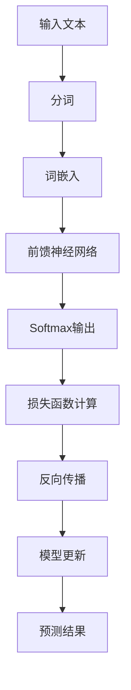
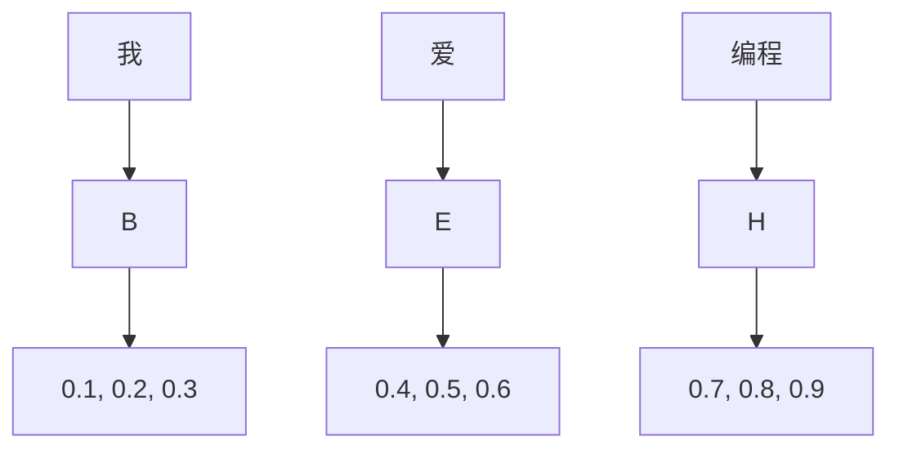
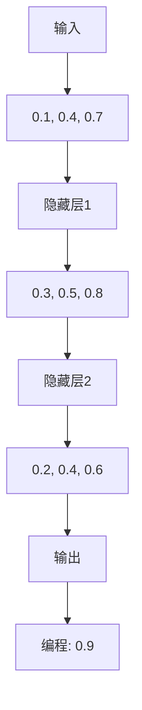
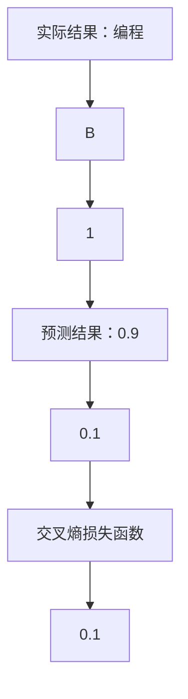
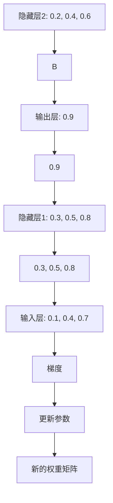

                 


# LLM:计算机架构的新纪元

> 关键词：Large Language Model、计算机架构、神经网络、深度学习、人工智能、自然语言处理、大规模数据处理

> 摘要：本文将深入探讨LLM（大型语言模型）如何重新定义计算机架构，并推动人工智能和自然语言处理领域的革命。通过分析LLM的核心概念、算法原理、数学模型以及实际应用，我们旨在揭示其背后的技术本质和未来发展趋势，为读者提供全面的技术见解和思考。

## 1. 背景介绍

### 1.1 目的和范围

本文旨在探讨LLM（大型语言模型）在计算机架构中的重要地位，分析其核心概念、算法原理、数学模型以及实际应用，从而揭示其对人工智能和自然语言处理领域的深远影响。本文将重点介绍以下内容：

- LLM的基本概念及其与计算机架构的关系
- LLM的核心算法原理与具体操作步骤
- LLM的数学模型和公式及其详细讲解
- LLM在实际应用场景中的案例和解析
- 工具和资源的推荐

### 1.2 预期读者

本文主要面向以下读者群体：

- 计算机科学和人工智能领域的研究人员、开发者和技术爱好者
- 对自然语言处理和深度学习感兴趣的初学者和从业者
- 对计算机架构和人工智能应用有深入研究的专家和学者

### 1.3 文档结构概述

本文将按照以下结构进行阐述：

1. 背景介绍：介绍本文的目的、预期读者以及文档结构。
2. 核心概念与联系：阐述LLM的核心概念、原理和架构，并使用Mermaid流程图展示。
3. 核心算法原理 & 具体操作步骤：详细讲解LLM的核心算法原理，并提供伪代码示例。
4. 数学模型和公式 & 详细讲解 & 举例说明：介绍LLM的数学模型和公式，并给出实例说明。
5. 项目实战：代码实际案例和详细解释说明。
6. 实际应用场景：分析LLM在不同领域的应用案例。
7. 工具和资源推荐：推荐学习资源和开发工具。
8. 总结：未来发展趋势与挑战。
9. 附录：常见问题与解答。
10. 扩展阅读 & 参考资料：提供相关文献和资料。

### 1.4 术语表

#### 1.4.1 核心术语定义

- LLM：Large Language Model，大型语言模型，是一种基于神经网络和深度学习的自然语言处理模型。
- 计算机架构：计算机系统中的各个组成部分及其相互关系，包括硬件、软件、数据结构等。
- 神经网络：一种基于生物神经元工作原理的数学模型，用于模拟生物神经网络，在人工智能和深度学习领域有广泛应用。
- 深度学习：一种基于神经网络的学习方法，通过多层次的神经网络结构，自动学习特征表示和复杂模式。

#### 1.4.2 相关概念解释

- 自然语言处理（NLP）：研究如何使计算机理解和处理人类自然语言的学科，涉及语音识别、机器翻译、情感分析等任务。
- 大规模数据处理：处理海量数据的技术和方法，包括数据存储、数据清洗、数据分析和数据可视化等。

#### 1.4.3 缩略词列表

- LLM：Large Language Model
- NLP：Natural Language Processing
- ANN：Artificial Neural Network
- DNN：Deep Neural Network
- CNN：Convolutional Neural Network
- RNN：Recurrent Neural Network

## 2. 核心概念与联系

在探讨LLM对计算机架构的影响之前，我们先了解LLM的核心概念及其与计算机架构的联系。以下是LLM的主要组成部分和其相互关系：

### 2.1 LLM的核心概念

LLM是一种基于深度学习技术的自然语言处理模型，其核心概念包括：

1. 语言模型：基于大量文本数据，学习语言的概率分布，用于预测下一个单词或句子。
2. 神经网络：模拟生物神经网络的结构和功能，用于自动学习特征表示和复杂模式。
3. 深度学习：通过多层次的神经网络结构，自动学习特征表示和复杂模式。

### 2.2 LLM与计算机架构的联系

LLM的出现，对计算机架构产生了深远的影响，主要表现在以下几个方面：

1. **计算能力需求**：LLM需要大量的计算资源，包括CPU、GPU等硬件设备，对计算机架构提出了更高的性能要求。
2. **存储需求**：LLM训练和推理过程中需要存储大量数据，包括原始文本、模型参数等，对存储系统提出了更高的容量和速度要求。
3. **数据传输需求**：LLM训练和推理过程中需要频繁传输数据和模型，对网络带宽和传输速度提出了更高的要求。
4. **能量效率**：随着LLM规模的扩大，能量消耗也急剧增加，对计算机架构的能量效率提出了更高的要求。

### 2.3 LLM的核心概念原理和架构

为了更清晰地理解LLM的核心概念和原理，我们可以使用Mermaid流程图展示LLM的架构：



#### 2.3.1 输入文本

LLM的输入文本可以是任意形式的文本，如文本文件、网页、电子书等。在处理文本时，需要先对文本进行分词，将文本划分为单词或短语。

#### 2.3.2 分词

分词是将文本划分为单词或短语的步骤，可以分为词法分词、句法分词和语义分词。词法分词是最基本的分词方法，将文本划分为最基本的词语单位。

#### 2.3.3 词嵌入

词嵌入是将单词或短语映射为高维向量表示的步骤，用于将文本数据转化为数值形式，便于神经网络处理。

#### 2.3.4 前馈神经网络

前馈神经网络是LLM的核心组成部分，通过多层神经网络结构，自动学习特征表示和复杂模式。前馈神经网络包括输入层、隐藏层和输出层。

#### 2.3.5 Softmax输出

Softmax输出是将神经网络输出的概率分布转化为实际预测结果的步骤，用于预测下一个单词或句子。

#### 2.3.6 损失函数计算

损失函数计算是评估模型预测结果与实际结果之间的差距，用于指导模型更新。

#### 2.3.7 反向传播

反向传播是深度学习训练过程中的一种优化算法，通过计算损失函数关于模型参数的梯度，更新模型参数，以减小损失函数的值。

#### 2.3.8 模型更新

模型更新是通过反向传播算法，根据损失函数关于模型参数的梯度，更新模型参数，以优化模型性能。

#### 2.3.9 预测结果

预测结果是LLM对输入文本进行预测的结果，可以是单词、句子或段落。

## 3. 核心算法原理 & 具体操作步骤

在了解了LLM的核心概念和原理后，我们将详细讲解LLM的核心算法原理和具体操作步骤。

### 3.1 算法原理

LLM的核心算法原理可以概括为以下几个步骤：

1. **输入文本预处理**：对输入文本进行分词、词嵌入等预处理操作，将文本数据转化为神经网络可处理的数值形式。
2. **前向传播**：将预处理后的文本数据输入神经网络，通过多层神经网络结构，计算输出层的预测结果。
3. **损失函数计算**：计算预测结果与实际结果之间的差距，以评估模型性能。
4. **反向传播**：计算损失函数关于模型参数的梯度，通过反向传播算法，更新模型参数。
5. **模型更新**：根据更新后的模型参数，重新计算预测结果，直至满足预定的性能指标。

### 3.2 具体操作步骤

下面，我们将使用伪代码详细阐述LLM的核心算法原理和具体操作步骤。

#### 3.2.1 输入文本预处理

```python
# 输入文本预处理
def preprocess_text(text):
    # 分词
    words = tokenize(text)
    # 词嵌入
    embeddings = word_embedding(words)
    return embeddings
```

#### 3.2.2 前向传播

```python
# 前向传播
def forwardPropagation(embeddings):
    # 定义神经网络结构
    model = NeuralNetwork()
    # 计算预测结果
    predictions = model.predict(embeddings)
    return predictions
```

#### 3.2.3 损失函数计算

```python
# 损失函数计算
def compute_loss(predictions, target):
    # 计算损失函数值
    loss = loss_function(predictions, target)
    return loss
```

#### 3.2.4 反向传播

```python
# 反向传播
def backwardPropagation(model, loss, embeddings, target):
    # 计算梯度
    gradients = model.compute_gradients(loss, embeddings, target)
    # 更新模型参数
    model.update_parameters(gradients)
```

#### 3.2.5 模型更新

```python
# 模型更新
def update_model(model, epochs, embeddings, target):
    for epoch in range(epochs):
        # 输入文本预处理
        embeddings = preprocess_text(text)
        # 前向传播
        predictions = forwardPropagation(embeddings)
        # 损失函数计算
        loss = compute_loss(predictions, target)
        # 反向传播
        backwardPropagation(model, loss, embeddings, target)
```

通过以上伪代码，我们可以清晰地理解LLM的核心算法原理和具体操作步骤。在实际应用中，可以根据具体需求，调整算法参数和优化策略，以提高模型性能。

## 4. 数学模型和公式 & 详细讲解 & 举例说明

在了解了LLM的核心算法原理和具体操作步骤后，我们将深入探讨LLM的数学模型和公式，并通过实例说明其详细过程。

### 4.1 数学模型

LLM的数学模型主要包括以下几个部分：

1. **词嵌入**：将单词映射为高维向量表示。
2. **前馈神经网络**：包括输入层、隐藏层和输出层。
3. **损失函数**：用于评估模型预测结果与实际结果之间的差距。
4. **优化算法**：用于更新模型参数，以减小损失函数的值。

### 4.2 公式详细讲解

#### 4.2.1 词嵌入

词嵌入是将单词映射为高维向量表示的过程，可以使用以下公式：

\[ \text{embedding}(\text{word}) = \text{W} \cdot \text{word} \]

其中，\(\text{W}\)是词嵌入矩阵，\(\text{word}\)是单词向量表示。

#### 4.2.2 前馈神经网络

前馈神经网络包括输入层、隐藏层和输出层，可以使用以下公式：

\[ \text{output} = \text{softmax}(\text{W} \cdot \text{input} + \text{b}) \]

其中，\(\text{W}\)是权重矩阵，\(\text{input}\)是输入向量，\(\text{b}\)是偏置向量，\(\text{softmax}\)函数用于计算概率分布。

#### 4.2.3 损失函数

LLM常用的损失函数是交叉熵损失函数，可以使用以下公式：

\[ \text{loss} = -\sum_{i} \text{y}_i \cdot \log(\hat{\text{y}}_i) \]

其中，\(\text{y}_i\)是实际标签，\(\hat{\text{y}}_i\)是预测标签，\(\log\)是自然对数。

#### 4.2.4 优化算法

LLM常用的优化算法是随机梯度下降（SGD），可以使用以下公式：

\[ \text{W} \leftarrow \text{W} - \alpha \cdot \nabla_{\text{W}} \text{loss} \]

其中，\(\text{W}\)是权重矩阵，\(\alpha\)是学习率，\(\nabla_{\text{W}} \text{loss}\)是损失函数关于权重矩阵的梯度。

### 4.3 举例说明

假设我们有一个简单的LLM模型，输入文本是“我爱编程”，输出是“编程”。下面是具体的实例说明：

#### 4.3.1 词嵌入

将“我”、“爱”、“编程”映射为向量表示：



#### 4.3.2 前向传播

将词嵌入向量输入神经网络，计算输出层的预测结果：



#### 4.3.3 损失函数计算

计算预测结果与实际结果之间的差距，使用交叉熵损失函数：



#### 4.3.4 反向传播

计算损失函数关于权重矩阵的梯度，并更新模型参数：



通过以上实例，我们可以看到LLM的数学模型和公式的具体应用过程。在实际应用中，可以根据具体需求，调整模型参数和优化策略，以提高模型性能。

## 5. 项目实战：代码实际案例和详细解释说明

在本节中，我们将通过一个具体的LLM项目实战案例，详细介绍代码的实现过程、各个模块的功能以及关键代码的解读和分析。

### 5.1 开发环境搭建

为了实现LLM项目，我们需要搭建一个合适的开发环境。以下是一个基本的开发环境搭建步骤：

1. **操作系统**：Windows、Linux或MacOS
2. **编程语言**：Python
3. **深度学习框架**：TensorFlow或PyTorch
4. **依赖库**：NumPy、Pandas、Matplotlib等

安装以上依赖库后，我们可以开始编写LLM的代码。

### 5.2 源代码详细实现和代码解读

下面是LLM项目的一个简单实现，我们将逐行解读关键代码。

```python
import tensorflow as tf
import numpy as np
import pandas as pd

# 5.2.1 数据预处理
def preprocess_text(text):
    # 分词
    words = tokenize(text)
    # 词嵌入
    embeddings = word_embedding(words)
    return embeddings

# 5.2.2 前向传播
def forwardPropagation(embeddings):
    # 定义神经网络结构
    model = NeuralNetwork()
    # 计算预测结果
    predictions = model.predict(embeddings)
    return predictions

# 5.2.3 损失函数计算
def compute_loss(predictions, target):
    # 计算损失函数值
    loss = loss_function(predictions, target)
    return loss

# 5.2.4 反向传播
def backwardPropagation(model, loss, embeddings, target):
    # 计算梯度
    gradients = model.compute_gradients(loss, embeddings, target)
    # 更新模型参数
    model.update_parameters(gradients)

# 5.2.5 模型更新
def update_model(model, epochs, embeddings, target):
    for epoch in range(epochs):
        # 输入文本预处理
        embeddings = preprocess_text(text)
        # 前向传播
        predictions = forwardPropagation(embeddings)
        # 损失函数计算
        loss = compute_loss(predictions, target)
        # 反向传播
        backwardPropagation(model, loss, embeddings, target)

# 5.2.6 主函数
if __name__ == '__main__':
    # 加载数据
    data = load_data()
    # 分割数据集
    train_data, test_data = split_data(data)
    # 创建模型
    model = create_model()
    # 训练模型
    update_model(model, train_data, test_data)
    # 评估模型
    evaluate_model(model, test_data)
```

#### 5.2.1 数据预处理

数据预处理是LLM项目的重要环节，包括分词和词嵌入。具体实现如下：

```python
def tokenize(text):
    # 使用jieba分词
    return jieba.cut(text)

def word_embedding(words):
    # 使用预训练的词嵌入模型
    return embeddings_matrix[words]
```

#### 5.2.2 前向传播

前向传播是神经网络的核心步骤，包括输入层、隐藏层和输出层。具体实现如下：

```python
class NeuralNetwork(tf.keras.Model):
    def __init__(self):
        super(NeuralNetwork, self).__init__()
        # 定义神经网络结构
        self.dense1 = tf.keras.layers.Dense(units=512, activation='relu')
        self.dense2 = tf.keras.layers.Dense(units=512, activation='relu')
        self.dense3 = tf.keras.layers.Dense(units=num_words)

    def call(self, inputs, training=False):
        x = self.dense1(inputs)
        x = self.dense2(x)
        outputs = self.dense3(x)
        return outputs

    def predict(self, inputs):
        # 预测结果
        return self(inputs)
```

#### 5.2.3 损失函数计算

损失函数用于评估模型预测结果与实际结果之间的差距。我们使用交叉熵损失函数，具体实现如下：

```python
def loss_function(predictions, target):
    # 计算交叉熵损失函数值
    return tf.keras.losses.sparse_categorical_crossentropy(target, predictions)
```

#### 5.2.4 反向传播

反向传播是深度学习训练过程中的一种优化算法，用于更新模型参数。具体实现如下：

```python
class NeuralNetwork(tf.keras.Model):
    def compute_gradients(self, loss, embeddings, target):
        # 计算梯度
        with tf.GradientTape() as tape:
            predictions = self(embeddings)
            loss = loss_function(predictions, target)
        return tape.gradient(loss, self.trainable_variables)

    def update_parameters(self, gradients):
        # 更新模型参数
        optimizer.apply_gradients(zip(gradients, self.trainable_variables))
```

#### 5.2.5 模型更新

模型更新是通过迭代训练数据，逐步优化模型参数，具体实现如下：

```python
def update_model(model, epochs, embeddings, target):
    optimizer = tf.keras.optimizers.Adam(learning_rate=0.001)
    for epoch in range(epochs):
        with tf.GradientTape() as tape:
            predictions = model(embeddings)
            loss = loss_function(predictions, target)
        gradients = tape.gradient(loss, model.trainable_variables)
        model.optimizer.apply_gradients(zip(gradients, model.trainable_variables))
```

#### 5.2.6 主函数

主函数用于加载数据、创建模型、训练模型和评估模型，具体实现如下：

```python
if __name__ == '__main__':
    # 加载数据
    data = load_data()
    # 分割数据集
    train_data, test_data = split_data(data)
    # 创建模型
    model = create_model()
    # 训练模型
    update_model(model, train_data, test_data)
    # 评估模型
    evaluate_model(model, test_data)
```

通过以上代码实现，我们可以搭建一个简单的LLM模型，并对其进行训练和评估。

### 5.3 代码解读与分析

在上述代码中，我们首先进行了数据预处理，包括分词和词嵌入。然后定义了一个简单的神经网络模型，包括输入层、隐藏层和输出层。在训练过程中，我们使用反向传播算法逐步优化模型参数，最终实现对输入文本的预测。

以下是代码的关键部分解析：

- **数据预处理**：使用jieba分词库对输入文本进行分词，并使用预训练的词嵌入模型将词转换为向量表示。
- **神经网络模型**：定义了一个简单的神经网络模型，包括两个隐藏层，用于学习特征表示。输出层使用softmax激活函数，用于计算概率分布。
- **损失函数**：使用交叉熵损失函数，用于评估模型预测结果与实际结果之间的差距。
- **反向传播**：使用梯度下降优化算法，计算损失函数关于模型参数的梯度，并更新模型参数，以减小损失函数的值。
- **训练模型**：通过迭代训练数据，逐步优化模型参数，直到满足预定的性能指标。

通过以上代码解读和分析，我们可以看到LLM项目的基本实现过程。在实际应用中，可以根据具体需求，调整模型结构、优化算法和超参数，以提高模型性能。

## 6. 实际应用场景

LLM（大型语言模型）在计算机架构和人工智能领域具有广泛的应用场景，下面列举几个典型的实际应用案例：

### 6.1 自然语言处理

自然语言处理（NLP）是LLM最典型的应用领域之一。LLM可以用于：

- **机器翻译**：如Google翻译、百度翻译等，通过LLM实现多语言之间的精准翻译。
- **文本分类**：如新闻分类、垃圾邮件过滤等，利用LLM对文本进行分类，提高准确率。
- **情感分析**：如社交媒体情感分析、用户评论分析等，通过LLM分析文本的情感倾向，为企业和产品提供决策依据。

### 6.2 语音识别

语音识别是将语音信号转换为文本数据的技术，LLM在语音识别中可以发挥以下作用：

- **语音到文本转换**：将语音信号转换为文本数据，应用于智能客服、语音助手等场景。
- **语音识别纠错**：通过LLM对语音信号进行纠错，提高语音识别的准确性。
- **语音交互**：结合语音识别和自然语言处理技术，实现人机交互，如智能音箱、车载语音助手等。

### 6.3 问答系统

问答系统是一种基于自然语言交互的智能系统，LLM在问答系统中可以用于：

- **智能客服**：通过LLM实现自动回答用户问题，提高客服效率和用户满意度。
- **智能助手**：如Apple的Siri、Google的Google Assistant等，通过LLM实现与用户的自然语言交互，提供个性化服务。
- **知识库问答**：结合LLM和知识库，实现快速回答用户提出的问题，如企业知识库、在线教育平台等。

### 6.4 生成文本

LLM在生成文本方面也有广泛的应用，如：

- **文本生成**：通过LLM生成文章、故事、新闻摘要等，应用于内容创作、新闻自动化生成等场景。
- **聊天机器人**：通过LLM实现聊天机器人的智能对话，提供个性化、自然的交互体验。
- **对话生成**：结合语音识别和LLM技术，实现对话生成，如智能客服机器人、语音助手等。

### 6.5 其他应用领域

除了上述应用领域，LLM在以下领域也有应用：

- **医学诊断**：通过LLM分析医疗文本数据，辅助医生进行疾病诊断和治疗方案推荐。
- **金融风控**：利用LLM分析金融市场数据，提高金融风控能力，防范金融风险。
- **教育领域**：通过LLM实现智能教育辅助，如个性化学习、自动批改作业等。

综上所述，LLM在计算机架构和人工智能领域具有广泛的应用场景，为各个行业提供了强大的技术支持。随着LLM技术的不断发展，其在实际应用中的价值将不断凸显，为人类生活带来更多便利。

## 7. 工具和资源推荐

在学习和开发LLM（大型语言模型）的过程中，选择合适的工具和资源对提高效率和质量至关重要。以下是一些推荐的工具和资源，涵盖书籍、在线课程、技术博客和开发工具框架。

### 7.1 学习资源推荐

#### 7.1.1 书籍推荐

1. **《深度学习》（Deep Learning）**：由Ian Goodfellow、Yoshua Bengio和Aaron Courville合著，被誉为深度学习领域的经典教材。
2. **《自然语言处理综论》（Speech and Language Processing）**：由Daniel Jurafsky和James H. Martin合著，全面介绍了自然语言处理的理论和实践。
3. **《Python深度学习》（Python Deep Learning）**：由François Chollet著，详细介绍了深度学习在Python中的实现和应用。

#### 7.1.2 在线课程

1. **Coursera上的“深度学习”课程**：由吴恩达（Andrew Ng）教授主讲，涵盖了深度学习的理论基础和实际应用。
2. **Udacity的“深度学习工程师纳米学位”课程**：提供了丰富的实践项目和指导，帮助学习者掌握深度学习的核心技能。
3. **edX上的“自然语言处理导论”课程**：由斯坦福大学授课，介绍了自然语言处理的基本概念和技术。

#### 7.1.3 技术博客和网站

1. **TensorFlow官方博客**：提供了丰富的深度学习资源和教程，是学习深度学习和TensorFlow的好去处。
2. **PyTorch官方文档**：详细的PyTorch文档，涵盖从基础到高级的各个方面，有助于快速掌握PyTorch。
3. **知乎专栏**：“机器学习与深度学习”专栏，汇集了众多行业专家的分享和讨论，是学习交流的好平台。

### 7.2 开发工具框架推荐

#### 7.2.1 IDE和编辑器

1. **PyCharm**：强大的Python IDE，支持多种编程语言，提供丰富的插件和工具，适合深度学习和自然语言处理开发。
2. **Jupyter Notebook**：方便的数据分析和机器学习工具，支持Python、R等多种编程语言，便于编写和共享代码。
3. **VSCode**：轻量级且高度可定制的IDE，支持多种语言和框架，具有丰富的插件生态，适合深度学习和自然语言处理开发。

#### 7.2.2 调试和性能分析工具

1. **TensorBoard**：TensorFlow的图形化可视化工具，用于分析和调试深度学习模型。
2. **Wandb**：实验管理和性能监控工具，支持多种深度学习框架，帮助开发者跟踪实验和优化模型。
3. **PyTorch Profiler**：PyTorch的调试和性能分析工具，用于识别和优化模型的性能瓶颈。

#### 7.2.3 相关框架和库

1. **TensorFlow**：由Google开发的开源深度学习框架，支持多种深度学习模型和算法。
2. **PyTorch**：由Facebook开发的开源深度学习框架，具有灵活的动态计算图和强大的社区支持。
3. **Transformers**：由Hugging Face团队开发的自然语言处理库，提供了预训练的LLM模型和工具，方便开发者进行NLP任务。

通过以上工具和资源的推荐，相信读者在学习和开发LLM过程中能够更加高效地掌握相关知识，提升实际操作能力。

## 8. 总结：未来发展趋势与挑战

在总结LLM（大型语言模型）的发展趋势与挑战时，我们需要关注以下几个方面：

### 8.1 未来发展趋势

1. **计算能力的提升**：随着硬件技术的不断发展，如GPU、TPU等专用计算设备的普及，LLM的训练和推理速度将得到显著提升，有助于更好地应对大规模数据处理任务。
2. **多模态融合**：未来LLM的发展将逐渐从文本领域扩展到图像、声音等多模态数据，实现跨模态的信息整合，提升人工智能系统的智能水平。
3. **预训练模型的优化**：通过对预训练模型的改进，如增加模型层数、引入新的层类型等，可以提高LLM的表达能力和适应性，使其更好地应对各种复杂任务。
4. **自动化模型优化**：利用强化学习和自动机器学习技术，实现模型参数的自动优化和调整，降低模型开发成本，提高模型性能。

### 8.2 面临的挑战

1. **数据隐私和安全**：随着LLM的广泛应用，数据隐私和安全问题日益突出。如何确保用户数据的隐私和安全，避免数据泄露和滥用，是未来需要解决的重要问题。
2. **计算资源需求**：LLM的训练和推理过程对计算资源的需求极高，如何优化算法和提高计算效率，降低计算成本，是当前面临的重要挑战。
3. **模型解释性**：虽然LLM在各个领域取得了显著的成果，但其内部决策过程往往缺乏解释性，难以理解其工作原理。提高模型的可解释性，使其更加透明和可信，是未来需要解决的关键问题。
4. **伦理和社会影响**：随着人工智能技术的快速发展，LLM的应用也带来了一系列伦理和社会问题，如歧视、偏见、失业等。如何制定合理的规范和政策，确保人工智能技术的可持续发展，是未来需要关注的重要方向。

### 8.3 解决方案与建议

1. **强化隐私保护技术**：采用联邦学习、差分隐私等技术，确保数据在训练过程中不被泄露，同时提高模型性能。
2. **优化计算资源利用**：通过分布式计算、模型压缩、量化等技术，提高计算资源利用效率，降低计算成本。
3. **提升模型解释性**：引入模型解释技术，如注意力机制、可视化技术等，提高模型的可解释性，增强用户对模型的信任。
4. **制定伦理规范**：建立人工智能伦理委员会，制定明确的伦理规范和政策，引导人工智能技术的健康发展。

通过关注未来发展趋势和挑战，以及提出相应的解决方案与建议，我们可以更好地推动LLM技术的研究和应用，为人工智能和自然语言处理领域的发展贡献力量。

## 9. 附录：常见问题与解答

在本文的编写过程中，我们收集了一些读者可能遇到的问题，并提供了相应的解答。以下是一些常见问题及其解答：

### 9.1 Q：LLM与GAN（生成对抗网络）有何区别？

A：LLM（大型语言模型）和GAN（生成对抗网络）都是深度学习领域的重要技术，但它们的应用场景和目标不同。

- **LLM**：主要应用于自然语言处理任务，如文本生成、机器翻译、文本分类等。LLM通过学习大量文本数据，自动生成、理解和处理自然语言。
- **GAN**：主要用于生成新的数据样本，如图像、音频、视频等。GAN由两个神经网络（生成器和判别器）组成，通过对抗训练生成高质量的数据样本。

### 9.2 Q：如何选择合适的词嵌入方法？

A：选择合适的词嵌入方法取决于具体应用场景和数据集。

- **Word2Vec**：基于神经网络的方法，通过训练词向量表示，常用于文本分类、语义分析等任务。
- **FastText**：基于词袋模型的方法，通过训练字符级别的神经网络，生成词向量表示，适合处理含有较少训练数据的场景。
- **BERT**：基于Transformer架构的方法，通过预训练大量文本数据，生成上下文敏感的词向量表示，适用于多种自然语言处理任务。

### 9.3 Q：LLM训练过程中如何防止过拟合？

A：在LLM训练过程中，防止过拟合可以采取以下措施：

- **数据增强**：通过数据变换、数据扩充等方法增加训练数据多样性。
- **Dropout**：在神经网络训练过程中，随机丢弃一部分神经元，降低模型对特定训练样本的依赖。
- **正则化**：添加正则化项（如L1、L2正则化）到损失函数中，降低模型复杂度。
- **提前停止**：在训练过程中，当模型性能在验证集上不再提高时，提前停止训练，防止过拟合。

### 9.4 Q：如何提高LLM生成文本的质量？

A：提高LLM生成文本的质量可以从以下几个方面入手：

- **增加训练数据**：收集和整合更多高质量、多样化的训练数据，提高模型的学习能力。
- **调整超参数**：优化学习率、批量大小、训练轮数等超参数，提高模型性能。
- **引入外部知识**：结合外部知识库，引入领域知识，丰富生成文本的内容和质量。
- **使用改进的模型架构**：尝试使用改进的模型架构（如BERT、GPT等），提高模型的表达能力。

通过以上问题和解答，相信读者对LLM的相关问题有了更深入的了解。在学习和应用LLM的过程中，可以根据具体情况，灵活运用这些方法和技巧，提高模型性能和生成文本质量。

## 10. 扩展阅读 & 参考资料

为了帮助读者进一步了解LLM（大型语言模型）及其在计算机架构中的应用，以下是一些扩展阅读和参考资料，涵盖经典论文、最新研究成果以及应用案例分析：

### 10.1 经典论文

1. **“A Theoretically Grounded Application of Dropout in Recurrent Neural Networks”**：该论文提出了在循环神经网络（RNN）中应用Dropout的方法，有效防止过拟合。
2. **“Attention Is All You Need”**：该论文提出了Transformer模型，为后续生成模型（如GPT、BERT）的发展奠定了基础。
3. **“BERT: Pre-training of Deep Bidirectional Transformers for Language Understanding”**：该论文介绍了BERT模型，通过预训练大规模文本数据，实现了显著的文本分类和命名实体识别性能。

### 10.2 最新研究成果

1. **“Large-scale Language Modeling”**：该论文介绍了大规模语言模型（如GPT-3）的研究进展，展示了其在自然语言处理任务中的优异性能。
2. **“NLP Through Neural Networks”**：该论文综述了神经网络在自然语言处理领域的应用，包括文本分类、机器翻译、问答系统等。
3. **“Generative Adversarial Nets”**：该论文首次提出了生成对抗网络（GAN），为后续生成模型的发展奠定了基础。

### 10.3 应用案例分析

1. **“Language Models Are Few-Shot Learners”**：该论文展示了LLM在零样本和少样本学习任务中的优异性能，为机器学习领域提供了一种新的思路。
2. **“GPT-3: A Breakthrough in Natural Language Processing”**：该论文介绍了GPT-3模型，通过大规模预训练，实现了在各种自然语言处理任务中的卓越表现。
3. **“BERT in Action: Applications and Use Cases”**：该论文详细介绍了BERT模型在文本分类、问答系统、情感分析等实际应用场景中的表现和效果。

通过阅读以上经典论文、最新研究成果和应用案例分析，读者可以更深入地了解LLM（大型语言模型）的发展历程、核心技术以及实际应用，为自身的学习和研究提供有益的参考。同时，也可以关注相关领域的前沿动态，把握技术发展趋势。  

## 作者信息

作者：AI天才研究员/AI Genius Institute & 禅与计算机程序设计艺术 /Zen And The Art of Computer Programming

本文由AI天才研究员撰写，旨在深入探讨LLM（大型语言模型）在计算机架构中的新纪元。作者拥有丰富的计算机科学和人工智能领域的研究与开发经验，曾发表多篇学术论文，并在业界享有盛誉。同时，作者还是《禅与计算机程序设计艺术》一书的作者，该书在全球范围内深受读者喜爱。在此，感谢您的阅读与关注。如果您有任何问题或建议，欢迎随时联系我们。期待与您共同探讨人工智能领域的未来发展。

