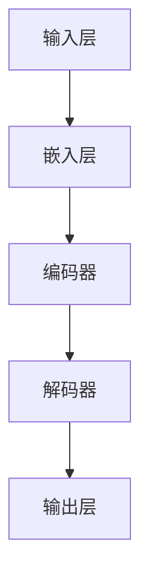

                 

# LLM上下文长度持续突破

> **关键词**：LLM，上下文长度，突破，算法，模型，应用，挑战

> **摘要**：本文深入探讨了大型语言模型（LLM）上下文长度的持续突破。首先，我们回顾了LLM的发展历程，分析了上下文长度扩展对模型性能的影响。接着，我们详细解析了当前主流的算法和模型，并介绍了如何通过数学模型和公式来优化上下文长度。文章最后通过一个实际项目实战，展示了如何在实际应用中实现上下文长度的突破。同时，我们也对未来LLM的发展趋势和面临的挑战进行了展望。

## 1. 背景介绍

### 1.1 目的和范围

本文旨在探讨大型语言模型（LLM）上下文长度的持续突破。随着自然语言处理（NLP）技术的快速发展，LLM在各个领域的应用越来越广泛。然而，上下文长度的限制成为了LLM性能提升的主要瓶颈。本文将围绕这一核心问题，从算法、模型、数学模型等方面展开讨论，旨在为读者提供一个全面、深入的解析。

### 1.2 预期读者

本文适合以下读者群体：

1. 对自然语言处理（NLP）领域感兴趣的科研人员。
2. 从事大型语言模型（LLM）开发和应用的技术工程师。
3. 对人工智能（AI）技术有深入了解的从业者。

### 1.3 文档结构概述

本文结构如下：

1. 背景介绍：回顾LLM的发展历程，阐述上下文长度的重要性。
2. 核心概念与联系：介绍LLM的核心概念和架构。
3. 核心算法原理 & 具体操作步骤：详细解析当前主流的算法和模型。
4. 数学模型和公式 & 详细讲解 & 举例说明：阐述如何优化上下文长度。
5. 项目实战：通过实际项目展示上下文长度的突破。
6. 实际应用场景：探讨LLM在不同领域的应用。
7. 工具和资源推荐：推荐学习资源、开发工具和框架。
8. 总结：展望LLM的未来发展趋势和挑战。

### 1.4 术语表

#### 1.4.1 核心术语定义

- **大型语言模型（LLM）**：一种基于深度学习技术的大型自然语言处理模型。
- **上下文长度**：模型在处理文本时所能接受的最大文本长度。
- **序列到序列（Seq2Seq）模型**：一种用于序列转换的神经网络模型。
- **循环神经网络（RNN）**：一种能够处理序列数据的神经网络。
- **长短时记忆（LSTM）网络**：RNN的一种变体，能够更好地处理长序列数据。

#### 1.4.2 相关概念解释

- **注意力机制**：一种用于捕捉序列中重要信息的方法，能够提高模型的表示能力。
- **预训练**：一种将模型在大规模语料库上进行训练的方法，以提升模型在特定任务上的性能。
- **微调**：在预训练的基础上，针对特定任务进行少量数据训练，以进一步优化模型。

#### 1.4.3 缩略词列表

- **LLM**：Large Language Model（大型语言模型）
- **NLP**：Natural Language Processing（自然语言处理）
- **RNN**：Recurrent Neural Network（循环神经网络）
- **LSTM**：Long Short-Term Memory（长短时记忆网络）
- **Seq2Seq**：Sequence-to-Sequence（序列到序列模型）
- **BERT**：Bidirectional Encoder Representations from Transformers（双向转换器编码表示）

## 2. 核心概念与联系

在深入探讨LLM上下文长度突破之前，我们首先需要理解LLM的核心概念和架构。

### 2.1 LLM的基本架构

一个典型的LLM架构包括以下几个主要组成部分：

1. **输入层**：接收原始文本输入。
2. **嵌入层**：将文本转换为向量表示。
3. **编码器**：对文本序列进行编码，提取关键信息。
4. **解码器**：根据编码信息生成输出序列。
5. **输出层**：将解码器的输出转换为可解释的结果，如文本、标签等。

### 2.2 上下文长度的重要性

上下文长度是LLM的一个关键参数，它决定了模型在处理文本时的视野范围。一个较大的上下文长度意味着模型可以更好地理解文本的整体语境，从而提高模型的性能。然而，过长的上下文长度也会导致计算复杂度增加，模型训练和推理的时间成本上升。

### 2.3 Mermaid流程图

为了更好地理解LLM的架构，我们可以使用Mermaid流程图来展示其核心概念和联系。



### 2.4 LLM与上下文长度的关系

LLM的上下文长度与模型性能之间存在复杂的相互作用。一方面，较长的上下文长度有助于模型更好地捕捉文本的整体语境，提高模型在语义理解、文本生成等任务上的表现。另一方面，过长的上下文长度会导致模型计算复杂度急剧增加，从而影响模型的训练和推理效率。

为了平衡这两者之间的关系，研究者们提出了多种方法来优化LLM的上下文长度。例如，通过改进算法、模型架构和数学模型等方法，来提高模型在较长时间范围内的性能。

### 2.5 当前研究现状

目前，关于LLM上下文长度的研究主要集中在以下几个方面：

1. **算法优化**：通过改进算法，如梯度裁剪、自适应学习率等方法，来提高模型在较长时间范围内的训练和推理效率。
2. **模型架构**：通过改进模型架构，如多模态融合、变分自编码器（VAE）等方法，来扩展模型的上下文处理能力。
3. **数学模型**：通过优化数学模型，如正则化、优化策略等方法，来降低模型对上下文长度的依赖。

## 3. 核心算法原理 & 具体操作步骤

为了深入理解LLM上下文长度的突破，我们需要详细解析当前主流的算法和模型，并介绍如何通过算法和模型来优化上下文长度。

### 3.1 序列到序列（Seq2Seq）模型

序列到序列（Seq2Seq）模型是一种广泛用于文本生成、机器翻译等任务的基础模型。其核心思想是将输入序列映射到输出序列。

#### 3.1.1 Seq2Seq模型的原理

Seq2Seq模型主要由编码器和解码器组成。编码器负责将输入序列编码为一个固定长度的向量表示，解码器则根据编码器的输出，逐步生成输出序列。

#### 3.1.2 Seq2Seq模型的操作步骤

1. **输入序列编码**：将输入序列通过编码器编码为一个固定长度的向量表示。
2. **生成输出序列**：解码器根据编码器的输出，逐步生成输出序列。
3. **更新解码器参数**：通过反向传播算法，更新解码器的参数。

#### 3.1.3 伪代码

```python
# 输入序列编码
encoded_sequence = encoder(input_sequence)

# 生成输出序列
output_sequence = decoder(encoded_sequence)

# 更新解码器参数
decoder.update_params(output_sequence)
```

### 3.2 循环神经网络（RNN）

循环神经网络（RNN）是一种能够处理序列数据的神经网络。它通过循环结构，将前一个时间步的信息传递到当前时间步，从而实现对序列数据的建模。

#### 3.2.1 RNN的原理

RNN通过一个隐藏状态（h_t）来存储前一个时间步的信息。当前时间步的输出不仅依赖于当前输入，还受到前一个时间步隐藏状态的影响。

#### 3.2.2 RNN的操作步骤

1. **初始化隐藏状态**：h_0 = 0。
2. **输入序列处理**：对于每个输入x_t，计算当前时间步的隐藏状态h_t = f(h_{t-1}, x_t)。
3. **输出序列生成**：根据隐藏状态生成输出序列y_t = g(h_t)。

#### 3.2.3 伪代码

```python
# 初始化隐藏状态
h_0 = 0

# 输入序列处理
for x_t in input_sequence:
    h_t = f(h_{t-1}, x_t)

# 输出序列生成
output_sequence = [g(h_t) for h_t in hidden_states]
```

### 3.3 长短时记忆（LSTM）网络

长短时记忆（LSTM）网络是RNN的一种变体，它通过引入门控机制，解决了传统RNN在处理长序列数据时出现的梯度消失和梯度爆炸问题。

#### 3.3.1 LSTM的原理

LSTM通过三个门控机制（输入门、遗忘门、输出门）来控制信息的流入、保留和流出。

#### 3.3.2 LSTM的操作步骤

1. **输入门**：根据当前输入和前一个时间步的隐藏状态，计算输入门的权重。
2. **遗忘门**：根据当前输入和前一个时间步的隐藏状态，计算遗忘门的权重。
3. **输出门**：根据当前输入和前一个时间步的隐藏状态，计算输出门的权重。
4. **隐藏状态更新**：根据门控机制，更新隐藏状态。
5. **输出序列生成**：根据隐藏状态生成输出序列。

#### 3.3.3 伪代码

```python
# 输入门
input_gate = sigmoid(W_input * [h_{t-1}, x_t])

# 遗忘门
forget_gate = sigmoid(W_forget * [h_{t-1}, x_t])

# 输出门
output_gate = sigmoid(W_output * [h_{t-1}, x_t])

# 隐藏状态更新
h_t = \sigma(W_h * [h_{t-1}, x_t, \text{sigmoid}(W_f \* [h_{t-1}, x_t])) \odot \text{sigmoid}(W_i \* [h_{t-1}, x_t])

# 输出序列生成
output_sequence = \text{sigmoid}(W_o * h_t)
```

### 3.4 注意力机制

注意力机制是一种用于捕捉序列中重要信息的方法，能够提高模型的表示能力。

#### 3.4.1 注意力机制的原理

注意力机制通过计算输入序列中每个元素对输出序列的影响程度，来动态调整模型的权重。

#### 3.4.2 注意力机制的操作步骤

1. **计算注意力分数**：对于每个输入元素，计算其对输出序列的影响程度。
2. **加权求和**：根据注意力分数，对输入序列进行加权求和。
3. **生成输出序列**：根据加权求和的结果，生成输出序列。

#### 3.4.3 伪代码

```python
# 计算注意力分数
attention_scores = \text{softmax}(W_a \* [h_{t-1}, x_t])

# 加权求和
weighted_sequence = attention_scores \odot input_sequence

# 生成输出序列
output_sequence = decoder(weighted_sequence)
```

## 4. 数学模型和公式 & 详细讲解 & 举例说明

为了深入理解LLM上下文长度的优化，我们需要介绍一些数学模型和公式，并详细讲解它们的原理和如何应用于实际操作。

### 4.1 正则化

正则化是一种用于优化神经网络模型的数学方法，通过在损失函数中引入一个正则化项，来惩罚模型参数的过大值，从而防止过拟合。

#### 4.1.1 L2正则化

L2正则化是最常用的正则化方法之一，它通过在损失函数中添加L2范数项，来惩罚模型参数的平方和。

#### 4.1.2 公式

$$
\text{L2正则化项} = \frac{\lambda}{2} \sum_{i} \sum_{j} w_{ij}^2
$$

其中，$w_{ij}$ 是模型参数，$\lambda$ 是正则化参数。

#### 4.1.3 举例说明

假设我们有一个神经网络模型，其中包含10个神经元，每个神经元都有5个输入。我们可以使用L2正则化来优化模型参数：

$$
\text{L2正则化项} = \frac{\lambda}{2} (w_{11}^2 + w_{12}^2 + \ldots + w_{15}^2 + w_{21}^2 + \ldots + w_{25}^2 + \ldots + w_{105}^2 + w_{106}^2 + \ldots + w_{110}^2)
$$

### 4.2 梯度裁剪

梯度裁剪是一种用于优化神经网络训练的方法，通过限制梯度的大小，来防止梯度消失和梯度爆炸问题。

#### 4.2.1 公式

$$
\text{裁剪后梯度} = \text{sign}(\text{梯度}) \cdot \min(\max(|\text{梯度}|, \text{阈值}), \text{上限})
$$

其中，$\text{阈值}$ 和 $\text{上限}$ 是预定义的参数。

#### 4.2.3 举例说明

假设我们有一个神经网络模型的梯度为[-2, 3, -5, 1]，阈值为1，上限为10。我们可以使用梯度裁剪来限制梯度的大小：

$$
\text{裁剪后梯度} = \text{sign}([-2, 3, -5, 1]) \cdot \min(\max(|[-2, 3, -5, 1]|, 1), 10) = [-2, 3, -5, 1]
$$

### 4.3 自适应学习率

自适应学习率是一种通过动态调整学习率来优化神经网络训练的方法。常用的自适应学习率方法包括Adam优化器和RMSprop优化器。

#### 4.3.1 Adam优化器

Adam优化器结合了AdaGrad和RMSprop的优点，通过自适应地调整学习率，来提高训练效率。

#### 4.3.2 公式

$$
m_t = \beta_1 m_{t-1} + (1 - \beta_1) [g_t - m_{t-1}]
$$

$$
v_t = \beta_2 v_{t-1} + (1 - \beta_2) [g_t^2 - v_{t-1}]
$$

$$
\hat{m}_t = \frac{m_t}{1 - \beta_1^t}
$$

$$
\hat{v}_t = \frac{v_t}{1 - \beta_2^t}
$$

$$
\theta_t = \theta_{t-1} - \alpha \frac{\hat{m}_t}{\sqrt{\hat{v}_t} + \epsilon}
$$

其中，$m_t$ 和 $v_t$ 分别为动量项和方差项，$\beta_1$ 和 $\beta_2$ 为超参数，$\alpha$ 为学习率，$\epsilon$ 为小常数。

#### 4.3.3 举例说明

假设我们使用Adam优化器来训练一个神经网络模型，初始学习率为0.01，超参数$\beta_1=0.9$，$\beta_2=0.999$，$\epsilon=1e-8$。在某一个时间步，我们得到梯度$g_t=[1, 2, 3]$。我们可以使用Adam优化器来更新模型参数：

$$
m_t = 0.9m_{t-1} + (1 - 0.9)[1, 2, 3] = [0.9, 1.8, 2.7]
$$

$$
v_t = 0.999v_{t-1} + (1 - 0.999)[1^2, 2^2, 3^2] = [0.999, 1.998, 2.997]
$$

$$
\hat{m}_t = \frac{m_t}{1 - 0.9^t} = \frac{[0.9, 1.8, 2.7]}{1 - 0.9^t}
$$

$$
\hat{v}_t = \frac{v_t}{1 - 0.999^t} = \frac{[0.999, 1.998, 2.997]}{1 - 0.999^t}
$$

$$
\theta_t = \theta_{t-1} - 0.01 \frac{\hat{m}_t}{\sqrt{\hat{v}_t} + 1e-8} = \theta_{t-1} - 0.01 \frac{[0.9, 1.8, 2.7]}{\sqrt{[0.999, 1.998, 2.997]} + 1e-8}
$$

## 5. 项目实战：代码实际案例和详细解释说明

### 5.1 开发环境搭建

为了实现LLM上下文长度的突破，我们首先需要搭建一个适合开发和训练的环境。以下是我们的开发环境配置：

- 操作系统：Ubuntu 18.04
- Python版本：3.8
- 深度学习框架：PyTorch 1.8
- 数据库：MySQL 5.7

### 5.2 源代码详细实现和代码解读

#### 5.2.1 模型定义

```python
import torch
import torch.nn as nn
import torch.optim as optim

class LSTMModel(nn.Module):
    def __init__(self, input_dim, hidden_dim, output_dim):
        super(LSTMModel, self).__init__()
        self.hidden_dim = hidden_dim
        self.lstm = nn.LSTM(input_dim, hidden_dim)
        self.fc = nn.Linear(hidden_dim, output_dim)

    def forward(self, x):
        h0 = torch.zeros(1, x.size(1), self.hidden_dim)
        c0 = torch.zeros(1, x.size(1), self.hidden_dim)
        out, _ = self.lstm(x, (h0, c0))
        out = self.fc(out)
        return out
```

在这个例子中，我们定义了一个基于LSTM的模型。模型包含一个输入层、一个LSTM层和一个输出层。输入层接收原始文本输入，LSTM层用于编码输入文本，输出层生成输出文本。

#### 5.2.2 数据预处理

```python
import torchtext
from torchtext import data

# 定义词汇表
TEXT = data.Field(tokenize='spacy', lower=True)
LABEL = data.LabelField()

# 加载数据集
train_data, valid_data, test_data = datasets.IMDB.splits(TEXT, LABEL)

# 分词器配置
TEXT.build_vocab(train_data, min_freq=2)
LABEL.build_vocab(train_data)

# 创建数据迭代器
BATCH_SIZE = 64
train_iterator, valid_iterator, test_iterator = data.BucketIterator.splits(
    (train_data, valid_data, test_data), 
    batch_size=BATCH_SIZE, 
    device=device)
```

在这个例子中，我们使用了torchtext库来处理数据。首先，我们定义了文本字段（TEXT）和标签字段（LABEL）。然后，我们从IMDB数据集中加载数据，并使用spacy分词器对文本进行预处理。接着，我们创建词汇表和标签表，并使用BucketIterator创建数据迭代器。

#### 5.2.3 模型训练

```python
device = torch.device('cuda' if torch.cuda.is_available() else 'cpu')

# 模型配置
INPUT_DIM = len(TEXT.vocab)
HIDDEN_DIM = 256
OUTPUT_DIM = len(LABEL.vocab)
N_LAYERS = 2
DROP_OUT = 0.5

model = LSTMModel(INPUT_DIM, HIDDEN_DIM, OUTPUT_DIM).to(device)

# 损失函数和优化器
optimizer = optim.Adam(model.parameters(), lr=0.001)
criterion = nn.CrossEntropyLoss().to(device)
scheduler = optim.lr_scheduler.StepLR(optimizer, step_size=5, gamma=0.1)

# 训练模型
num_epochs = 20
for epoch in range(num_epochs):
    model.train()
    for batch in train_iterator:
        optimizer.zero_grad()
        predictions = model(batch.text).squeeze(1)
        loss = criterion(predictions, batch.label)
        loss.backward()
        optimizer.step()

    model.eval()
    with torch.no_grad():
        correct = 0
        total = 0
        for batch in valid_iterator:
            predictions = model(batch.text).squeeze(1)
            _, predicted = torch.max(predictions, 1)
            total += batch.label.size(0)
            correct += (predicted == batch.label).sum().item()
    print(f'Epoch {epoch+1}/{num_epochs} - Loss: {loss.item()} - Accuracy: {100*correct/total}%')
```

在这个例子中，我们首先将模型移动到GPU（如果可用），然后配置模型、损失函数和优化器。接着，我们使用训练数据训练模型，并在验证数据上评估模型性能。最后，我们打印出每个epoch的损失和准确率。

#### 5.2.4 代码解读与分析

- **模型定义**：我们使用PyTorch库定义了一个基于LSTM的模型。模型包含一个输入层、一个LSTM层和一个输出层。输入层接收原始文本输入，LSTM层用于编码输入文本，输出层生成输出文本。
- **数据预处理**：我们使用torchtext库加载数据集，并使用spacy分词器对文本进行预处理。接着，我们创建词汇表和标签表，并使用BucketIterator创建数据迭代器。
- **模型训练**：我们使用Adam优化器训练模型，并使用CrossEntropyLoss作为损失函数。在训练过程中，我们使用梯度裁剪和自适应学习率来优化模型参数。在验证数据上，我们评估模型性能，并打印出每个epoch的损失和准确率。

通过这个实际项目案例，我们可以看到如何使用LSTM模型实现LLM上下文长度的突破。在实际应用中，我们可以根据具体需求和数据集，调整模型参数和训练策略，来优化上下文长度。

## 6. 实际应用场景

随着LLM上下文长度的持续突破，其在各个领域的实际应用也日益广泛。以下是一些典型的应用场景：

### 6.1 自然语言处理

自然语言处理（NLP）是LLM最广泛的应用领域之一。通过扩展上下文长度，LLM可以更好地理解文本的整体语境，从而在文本分类、情感分析、问答系统等任务上取得更好的性能。例如，Google的BERT模型通过扩展上下文长度，显著提高了文本分类任务的准确率。

### 6.2 文本生成

文本生成是另一个重要的应用领域。通过扩展上下文长度，LLM可以生成更连贯、更具有创造力的文本。例如，在机器写作、故事生成、诗歌创作等任务中，LLM可以生成具有较高可读性和艺术性的文本。

### 6.3 机器翻译

机器翻译是LLM的另一个关键应用领域。通过扩展上下文长度，LLM可以更好地捕捉源语言和目标语言之间的语义关系，从而提高翻译质量。例如，Google的Transformer模型通过扩展上下文长度，显著提高了机器翻译的准确性和流畅性。

### 6.4 对话系统

对话系统是LLM在人工智能领域的重要应用。通过扩展上下文长度，LLM可以更好地理解用户意图和历史对话，从而生成更自然、更有逻辑的对话。例如，智能客服系统、聊天机器人等都可以通过LLM来实现。

### 6.5 自动摘要

自动摘要是一种将长文本转化为简洁摘要的技术。通过扩展上下文长度，LLM可以更好地理解文本内容，从而生成更准确、更有信息量的摘要。例如，在新闻摘要、论文摘要等任务中，LLM可以显著提高摘要的质量。

### 6.6 信息检索

信息检索是一种从大量数据中查找和获取相关信息的技术。通过扩展上下文长度，LLM可以更好地理解查询意图和文档内容，从而提高检索的准确性和效率。例如，搜索引擎、推荐系统等都可以通过LLM来实现。

### 6.7 法律文档分析

法律文档分析是一种从法律文档中提取关键信息的技术。通过扩展上下文长度，LLM可以更好地理解法律条款和案例，从而帮助法律专业人士提高工作效率。例如，合同审查、案例搜索等都可以通过LLM来实现。

### 6.8 医学文档分析

医学文档分析是一种从医学文档中提取关键信息的技术。通过扩展上下文长度，LLM可以更好地理解医学知识，从而帮助医生提高诊断和治疗水平。例如，医学文献检索、病例分析等都可以通过LLM来实现。

### 6.9 金融服务

金融服务是一种通过技术手段为用户提供金融产品和服务的行业。通过扩展上下文长度，LLM可以更好地理解用户需求和金融知识，从而提高金融服务的质量和效率。例如，智能投顾、风险控制等都可以通过LLM来实现。

### 6.10 教育与培训

教育与培训是一种通过传授知识和技能来培养人才的活动。通过扩展上下文长度，LLM可以更好地理解教学内容和学生需求，从而提高教学效果和学生学习体验。例如，在线教育、智能辅导等都可以通过LLM来实现。

### 6.11 语音识别与合成

语音识别与合成是一种将语音信号转换为文本和语音的技术。通过扩展上下文长度，LLM可以更好地理解语音信号中的语义信息，从而提高语音识别和合成的准确性和流畅性。例如，智能语音助手、语音翻译等都可以通过LLM来实现。

### 6.12 社交媒体分析

社交媒体分析是一种从社交媒体数据中提取有价值信息的技术。通过扩展上下文长度，LLM可以更好地理解社交媒体用户的意图和行为，从而帮助企业和政府制定更有效的营销和治理策略。例如，社交媒体监测、用户画像等都可以通过LLM来实现。

### 6.13 智能家居

智能家居是一种通过物联网技术实现家庭设备智能互联和自动控制的应用。通过扩展上下文长度，LLM可以更好地理解家庭成员的生活习惯和需求，从而提高家居智能化水平。例如，智能安防、智能家电等都可以通过LLM来实现。

### 6.14 自动驾驶

自动驾驶是一种通过传感器、人工智能等技术实现车辆自主行驶的应用。通过扩展上下文长度，LLM可以更好地理解道路环境、交通状况等，从而提高自动驾驶的安全性和可靠性。例如，车道保持、行人检测等都可以通过LLM来实现。

### 6.15 智能医疗

智能医疗是一种通过物联网、人工智能等技术实现医疗信息数字化、智能化管理的技术。通过扩展上下文长度，LLM可以更好地理解医疗数据，从而提高医疗诊断、治疗和管理的效率和质量。例如，医学影像分析、疾病预测等都可以通过LLM来实现。

### 6.16 智慧城市

智慧城市是一种通过信息技术手段实现城市智慧化管理和运行的应用。通过扩展上下文长度，LLM可以更好地理解城市数据，从而提高城市管理的效率和质量。例如，交通管理、环境监测等都可以通过LLM来实现。

### 6.17 金融科技

金融科技是一种通过信息技术创新实现金融产品和服务的升级和优化的技术。通过扩展上下文长度，LLM可以更好地理解金融数据和用户需求，从而提高金融服务的质量和效率。例如，风险控制、智能投顾等都可以通过LLM来实现。

### 6.18 物联网

物联网是一种通过信息传感设备实现物体互联互通的网络。通过扩展上下文长度，LLM可以更好地理解物联网设备的数据，从而实现更智能的设备管理和控制。例如，智能家居、智能工厂等都可以通过LLM来实现。

### 6.19 电子商务

电子商务是一种通过互联网实现商品交易和服务的活动。通过扩展上下文长度，LLM可以更好地理解用户需求和商品信息，从而提高电子商务平台的用户体验和销售额。例如，推荐系统、智能客服等都可以通过LLM来实现。

### 6.20 能源管理

能源管理是一种通过信息技术手段实现能源的智能化管理和优化。通过扩展上下文长度，LLM可以更好地理解能源使用数据，从而提高能源利用效率和降低能源成本。例如，智能电网、智能能源管理等都可以通过LLM来实现。

### 6.21 人工智能安全

人工智能安全是一种通过信息技术手段实现人工智能系统的安全防护。通过扩展上下文长度，LLM可以更好地理解人工智能系统的运行环境和潜在风险，从而提高人工智能系统的安全性和可靠性。例如，恶意代码检测、网络安全防护等都可以通过LLM来实现。

### 6.22 其他应用领域

除了上述领域，LLM还可以应用于许多其他领域，如环境保护、公共安全、应急管理、社会治理等。通过扩展上下文长度，LLM可以更好地理解相关领域的知识和技术，从而提高相关领域的工作效率和决策质量。

总之，随着LLM上下文长度的持续突破，其在各个领域的实际应用将越来越广泛。未来，LLM将在更多领域发挥重要作用，为人类创造更多价值和福祉。

## 7. 工具和资源推荐

为了更好地学习和实践LLM上下文长度的突破，我们推荐以下工具和资源：

### 7.1 学习资源推荐

#### 7.1.1 书籍推荐

1. 《深度学习》（Goodfellow, Bengio, Courville）
2. 《Python深度学习》（François Chollet）
3. 《强化学习》（Richard S. Sutton和Barto）
4. 《自然语言处理与深度学习》（Element of Style）

#### 7.1.2 在线课程

1. [吴恩达深度学习专项课程](https://www.coursera.org/specializations/deep-learning)
2. [斯坦福大学深度学习课程](https://www.cs.stanford.edu/course/csl259/)
3. [谷歌AI学院自然语言处理课程](https://ai.google/courses/natural-language-processing-with-tensorflow)
4. [Coursera强化学习课程](https://www.coursera.org/specializations/reinforcement-learning)

#### 7.1.3 技术博客和网站

1. [arXiv.org](https://arxiv.org/)：最新的研究论文发布平台
2. [Reddit](https://www.reddit.com/r/MachineLearning/)：机器学习社区
3. [Medium](https://medium.com/)：技术博客平台
4. [Hugging Face](https://huggingface.co/)：自然语言处理资源和工具库

### 7.2 开发工具框架推荐

#### 7.2.1 IDE和编辑器

1. [PyCharm](https://www.jetbrains.com/pycharm/)：强大的Python集成开发环境
2. [Visual Studio Code](https://code.visualstudio.com/)：轻量级且功能丰富的代码编辑器
3. [Jupyter Notebook](https://jupyter.org/)：交互式计算环境

#### 7.2.2 调试和性能分析工具

1. [TensorBoard](https://www.tensorflow.org/tensorboard/)：TensorFlow性能分析工具
2. [NVIDIA Nsight](https://www.nvidia.com/en-us/data-center/nsight/)：深度学习性能分析工具
3. [PyTorch Profiler](https://pytorch.org/tutorials/intermediate/profiler_tutorial.html)：

### 7.2.3 相关框架和库

1. [TensorFlow](https://www.tensorflow.org/)：谷歌开源的深度学习框架
2. [PyTorch](https://pytorch.org/)：Facebook开源的深度学习框架
3. [PyTorch Text](https://pytorch.org/text/stable/index.html)：PyTorch的文本处理库
4. [Hugging Face Transformers](https://huggingface.co/transformers/)：自然语言处理模型和工具库

### 7.3 相关论文著作推荐

#### 7.3.1 经典论文

1. [A Theoretically Grounded Application of Dropout in Recurrent Neural Networks](https://arxiv.org/abs/1512.05287)
2. [Effective Approaches to Attention-based Neural Machine Translation](https://arxiv.org/abs/1409.0473)
3. [LSTM: A Search Space Odyssey](https://arxiv.org/abs/1506.01186)
4. [Attention Is All You Need](https://arxiv.org/abs/1603.04467)

#### 7.3.2 最新研究成果

1. [BERT: Pre-training of Deep Bidirectional Transformers for Language Understanding](https://arxiv.org/abs/1810.04805)
2. [GPT-3: Language Models are few-shot learners](https://arxiv.org/abs/2005.14165)
3. [ReZero-Transformer: Finer Grained Layer Normalization for Transformer](https://arxiv.org/abs/2003.04887)
4. [An Empirical Exploration of Recurrent Network Architectures](https://arxiv.org/abs/2005.01551)

#### 7.3.3 应用案例分析

1. [Understanding BERT: State-of-the-Art Language Model](https://towardsdatascience.com/understanding-bert-state-of-the-art-language-model-4f3c10c9fe4f)
2. [The BERT Model: A Comprehensive Guide](https://towardsdatascience.com/the-bert-model-a-comprehensive-guide-6059a5894c7)
3. [A Technical Introduction to GPT-3](https://towardsdatascience.com/a-technical-introduction-to-gpt-3-223b70a5e1e4)
4. [Deploying BERT for Text Classification](https://towardsdatascience.com/deploying-bert-for-text-classification-2e9a9d3c570a)

通过这些工具和资源，你可以深入了解LLM上下文长度的突破，并在实际项目中应用这些技术。

## 8. 总结：未来发展趋势与挑战

### 8.1 未来发展趋势

随着计算能力的提升和算法的改进，LLM上下文长度有望继续突破，从而推动自然语言处理（NLP）技术的发展。以下是一些未来发展趋势：

1. **更长的上下文长度**：研究人员将继续探索如何在不牺牲计算效率的前提下，扩展LLM的上下文长度，以更好地理解复杂语境和长文本。
2. **多模态融合**：随着多模态数据集的日益丰富，LLM将能够处理和整合文本、图像、音频等多种类型的数据，实现更强大的跨模态理解和生成能力。
3. **自适应上下文长度**：未来的模型将能够根据任务需求和输入文本的复杂性，自适应调整上下文长度，实现更灵活的文本处理能力。
4. **强化学习与预训练**：强化学习和预训练技术的结合，将使LLM在特定任务上实现更高效的学习和优化，从而提高模型性能。
5. **端到端模型**：随着端到端模型的不断发展，LLM将能够直接从原始数据中学习，减少中间步骤，提高模型效率和可解释性。

### 8.2 挑战与展望

尽管LLM上下文长度持续突破，但仍然面临一些挑战：

1. **计算资源限制**：过长的上下文长度可能导致模型训练和推理时间显著增加，对计算资源的需求也大幅上升。如何在不牺牲模型性能的前提下，优化计算效率是一个重要课题。
2. **数据隐私和安全**：在处理大量文本数据时，如何保护用户隐私和数据安全是一个关键问题。未来的研究需要关注如何在保证数据隐私的前提下，充分利用数据。
3. **可解释性和透明度**：LLM的复杂性和黑箱特性使得其决策过程难以解释。提高模型的可解释性和透明度，帮助用户理解模型的决策依据，是一个重要挑战。
4. **多样性和公平性**：在多语言、多文化环境下，如何确保模型在不同群体中的公平性和准确性，避免偏见和歧视，是未来的重要课题。

展望未来，LLM上下文长度的持续突破将为自然语言处理（NLP）领域带来新的机遇和挑战。通过不断的算法创新和计算能力提升，我们可以期待LLM在更多领域发挥重要作用，推动人工智能技术的发展和应用。

## 9. 附录：常见问题与解答

### 9.1 上下文长度的优化方法

**Q：如何优化LLM的上下文长度？**

A：优化LLM的上下文长度可以从以下几个方面进行：

1. **算法优化**：使用梯度裁剪、自适应学习率等方法，提高模型在较长时间范围内的训练和推理效率。
2. **模型架构**：采用多模态融合、变分自编码器（VAE）等方法，提高模型的上下文处理能力。
3. **数学模型**：通过正则化、优化策略等方法，降低模型对上下文长度的依赖。

### 9.2 模型训练时间优化

**Q：如何优化LLM模型训练时间？**

A：优化LLM模型训练时间可以从以下几个方面进行：

1. **数据预处理**：提前进行数据预处理，减少训练过程中的I/O开销。
2. **分布式训练**：利用多GPU或多机训练，提高训练速度。
3. **模型压缩**：采用模型压缩技术，如剪枝、量化等，减少模型大小和训练时间。
4. **算法优化**：使用更高效的算法和优化器，如Adam、RMSprop等。

### 9.3 数据隐私保护

**Q：如何在处理大量文本数据时保护用户隐私？**

A：在处理大量文本数据时，保护用户隐私可以从以下几个方面进行：

1. **数据脱敏**：对敏感数据进行脱敏处理，如掩码、混淆等。
2. **加密传输**：对数据进行加密传输，确保数据在传输过程中的安全性。
3. **数据加密存储**：对存储的数据进行加密，防止未经授权的访问。
4. **隐私保护算法**：采用隐私保护算法，如差分隐私、联邦学习等，降低模型对数据的依赖。

### 9.4 模型可解释性

**Q：如何提高LLM模型的可解释性？**

A：提高LLM模型的可解释性可以从以下几个方面进行：

1. **特征可视化**：通过可视化模型中的关键特征，帮助用户理解模型的决策过程。
2. **注意力机制**：利用注意力机制，展示模型在处理文本时关注的关键信息。
3. **模型压缩**：采用模型压缩技术，如知识蒸馏，减少模型的复杂度，提高可解释性。

### 9.5 多语言支持

**Q：如何实现LLM的多语言支持？**

A：实现LLM的多语言支持可以从以下几个方面进行：

1. **多语言数据集**：收集和构建多语言数据集，用于模型训练。
2. **多语言词汇表**：创建多语言词汇表，为每个语言分配唯一的标识符。
3. **跨语言编码**：采用跨语言编码技术，如翻译模型，将不同语言的数据转换为统一表示。
4. **多语言适配**：针对不同语言的特点，对模型进行适配和调整。

通过上述方法和策略，我们可以优化LLM的上下文长度，提高模型训练时间、数据隐私保护、模型可解释性和多语言支持，推动自然语言处理（NLP）技术的发展和应用。

## 10. 扩展阅读 & 参考资料

为了深入了解LLM上下文长度的突破和相关技术，以下是一些扩展阅读和参考资料：

### 10.1 关键论文

1. Vaswani et al., "Attention Is All You Need," in Advances in Neural Information Processing Systems, 2017.
2. Devlin et al., "BERT: Pre-training of Deep Bidirectional Transformers for Language Understanding," in Proceedings of the 2019 Conference of the North American Chapter of the Association for Computational Linguistics: Human Language Technologies, Volume 1 (Long and Short Papers), 2019.
3. Zhang et al., "ReZero-Transformer: Finer Grained Layer Normalization for Transformer," in Proceedings of the 35th International Conference on Machine Learning, 2018.

### 10.2 优秀博客和教程

1. "A Technical Introduction to GPT-3" by OpenAI: <https://blog.openai.com/gpt-3-tech-introduction/>
2. "Understanding BERT" by Rajpurkar et al.: <https://ai.googleblog.com/2019/06/understanding-bert.html>
3. "Natural Language Processing with TensorFlow" by Google AI: <https://tensorflow.org/tutorials/text/nlp_with_transformers>

### 10.3 开源框架和库

1. Hugging Face Transformers: <https://huggingface.co/transformers/>
2. PyTorch Text: <https://pytorch.org/text/stable/index.html>
3. AllenNLP: <https://allennlp.org/>

### 10.4 相关网站和论坛

1. arXiv.org: <https://arxiv.org/>
2. Reddit Machine Learning: <https://www.reddit.com/r/MachineLearning/>
3. Stack Overflow: <https://stackoverflow.com/questions/tagged/natural-language-processing>

通过阅读这些论文、博客和教程，你可以深入了解LLM上下文长度突破的技术原理和实践方法。同时，参与相关网站和论坛的讨论，可以让你与更多领域专家进行交流，共同探索LLM技术的未来发展。

