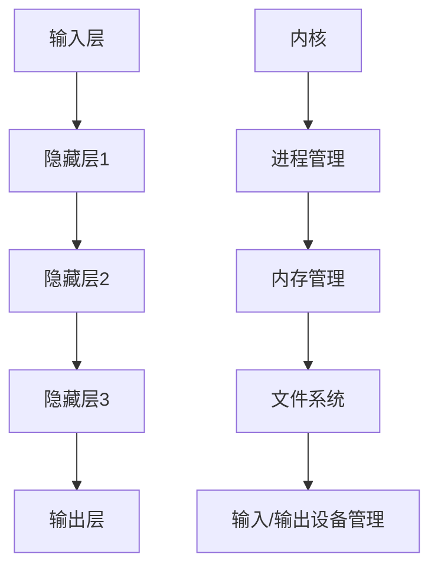

                 

# LLM与传统操作系统的对比

> 关键词：LLM（大型语言模型），操作系统，传统操作系统，技术架构，人工智能，对比分析

> 摘要：本文旨在对比分析大型语言模型（LLM）与传统操作系统在技术架构、应用场景、优缺点等方面的差异，探讨LLM在操作系统领域的发展潜力，以及未来可能面临的挑战。通过本文的深入探讨，读者可以更全面地了解LLM与传统操作系统之间的联系与区别。

## 1. 背景介绍

### 1.1 目的和范围

本文的目的是通过对LLM与传统操作系统的对比分析，帮助读者更深入地理解这两种技术的内在联系和区别，以及它们在各自领域的发展前景。本文将主要从以下几个方面展开讨论：

- 技术架构：分析LLM与传统操作系统在架构设计上的异同点。
- 应用场景：探讨LLM与传统操作系统在不同领域中的应用场景。
- 优缺点：总结LLM与传统操作系统的优缺点，并对比其在性能、安全性、可扩展性等方面的表现。
- 未来发展趋势：分析LLM与传统操作系统在未来技术发展中的潜在影响。

### 1.2 预期读者

本文面向对计算机科学、人工智能、操作系统等领域的知识有一定了解的读者。本文适合作为学术研究、技术交流和行业分析的参考，同时也适合对技术发展感兴趣的读者。

### 1.3 文档结构概述

本文共分为十个部分：

1. 背景介绍
2. 核心概念与联系
3. 核心算法原理 & 具体操作步骤
4. 数学模型和公式 & 详细讲解 & 举例说明
5. 项目实战：代码实际案例和详细解释说明
6. 实际应用场景
7. 工具和资源推荐
8. 总结：未来发展趋势与挑战
9. 附录：常见问题与解答
10. 扩展阅读 & 参考资料

### 1.4 术语表

#### 1.4.1 核心术语定义

- LLM：大型语言模型（Large Language Model），一种基于神经网络的语言处理模型，可以处理自然语言文本，并进行预测、生成等任务。
- 操作系统：操作系统（Operating System，简称OS）是管理计算机硬件与软件资源的系统软件，负责控制计算机的运行，并提供用户与计算机之间的交互界面。
- 传统操作系统：指以单任务或单用户为核心的操作系统，如Windows、Linux等。

#### 1.4.2 相关概念解释

- 人工智能：人工智能（Artificial Intelligence，简称AI）是模拟、延伸和扩展人的智能的理论、方法、技术及应用。
- 深度学习：深度学习（Deep Learning）是人工智能的一种方法，通过构建多层神经网络模型，对数据进行特征提取和分类。

#### 1.4.3 缩略词列表

- LLM：大型语言模型
- OS：操作系统
- AI：人工智能
- DL：深度学习

## 2. 核心概念与联系

为了更好地理解LLM与传统操作系统的对比，我们需要首先了解它们的核心概念和架构。

### 2.1 LLM的核心概念

LLM是一种基于深度学习技术的语言处理模型，其核心架构通常包括以下几个部分：

1. 输入层：接收自然语言文本输入。
2. 隐藏层：通过多层神经网络对输入文本进行特征提取和变换。
3. 输出层：生成预测结果或生成文本。

LLM的工作原理是通过训练大量的语料数据，学习到语言中的潜在规律和模式，从而实现对未知文本的生成、预测和分类。

### 2.2 传统操作系统的核心概念

传统操作系统是一种管理计算机硬件资源的系统软件，其主要功能包括：

1. 进程管理：管理计算机中运行的程序，实现多任务处理。
2. 内存管理：分配和管理计算机内存资源，提高内存使用效率。
3. 文件系统：管理计算机中的文件，实现文件的创建、删除、修改等操作。
4. 输入/输出设备管理：管理计算机的输入/输出设备，如键盘、鼠标、显示器等。

传统操作系统的核心架构通常包括：

1. 内核：操作系统的心脏，负责调度和管理计算机资源。
2. 系统调用：提供操作系统核心功能的应用编程接口。
3. 用户界面：提供给用户与计算机交互的界面。

### 2.3 LLM与传统操作系统的联系与区别

LLM与传统操作系统在技术架构和应用场景上存在一定的联系和区别。

- 联系：
  - 都是基于计算机硬件资源运行的系统软件。
  - 都需要处理输入和输出数据，进行数据处理和计算。

- 区别：
  - LLM主要用于处理自然语言文本，而传统操作系统主要用于管理计算机硬件资源。
  - LLM的核心架构是基于神经网络，而传统操作系统的核心架构是基于进程、内存和文件系统等概念。
  - LLM是一种人工智能技术，而传统操作系统是一种系统软件。

为了更好地展示LLM与传统操作系统的核心概念和架构，我们可以使用Mermaid流程图来描述它们之间的关系。



## 3. 核心算法原理 & 具体操作步骤

在本节中，我们将深入探讨LLM的核心算法原理，并使用伪代码详细阐述其具体操作步骤。

### 3.1 LLM的核心算法原理

LLM的核心算法基于深度学习技术，特别是基于神经网络模型。其基本原理是通过多层神经网络对输入文本进行特征提取和变换，从而实现对未知文本的生成、预测和分类。以下是LLM的核心算法原理：

1. 输入层：接收自然语言文本输入。
2. 隐藏层：通过多层神经网络对输入文本进行特征提取和变换。
3. 输出层：生成预测结果或生成文本。

### 3.2 LLM的具体操作步骤

以下是LLM的具体操作步骤，使用伪代码进行描述：

```python
# 输入层
input_layer = receive_input_text()

# 隐藏层
hidden_layer_1 = neural_network(input_layer)
hidden_layer_2 = neural_network(hidden_layer_1)
hidden_layer_3 = neural_network(hidden_layer_2)

# 输出层
output_layer = generate_output(hidden_layer_3)

# 预测结果或生成文本
predict_result = predict(output_layer)
generated_text = generate_text(output_layer)
```

### 3.3 LLM的算法优化

为了提高LLM的性能和准确性，我们可以采用以下几种优化方法：

1. 数据增强：通过增加训练数据量，提高模型的泛化能力。
2. 网络架构优化：调整神经网络层数、节点数等参数，提高模型的表达能力。
3. 损失函数优化：选择合适的损失函数，提高模型的收敛速度和准确性。
4. 优化器选择：选择合适的优化器，提高模型的训练效率和收敛速度。

## 4. 数学模型和公式 & 详细讲解 & 举例说明

在本节中，我们将介绍LLM的数学模型和公式，并进行详细讲解和举例说明。

### 4.1 LLM的数学模型

LLM的数学模型主要基于深度学习中的神经网络模型，其核心公式包括：

1. 神经元激活函数：
   $$ f(x) = \sigma(z) = \frac{1}{1 + e^{-z}} $$
   其中，$z$ 是神经元的输入，$\sigma(z)$ 是神经元的输出。

2. 反向传播算法：
   $$ \frac{\partial L}{\partial w} = \frac{\partial L}{\partial z} \cdot \frac{\partial z}{\partial w} $$
   其中，$L$ 是损失函数，$w$ 是权重参数，$\frac{\partial L}{\partial w}$ 是权重参数的梯度。

3. 梯度下降算法：
   $$ w_{\text{new}} = w_{\text{current}} - \alpha \cdot \frac{\partial L}{\partial w} $$
   其中，$w_{\text{new}}$ 是新的权重参数，$w_{\text{current}}$ 是当前的权重参数，$\alpha$ 是学习率。

### 4.2 LLM的详细讲解和举例说明

#### 4.2.1 神经元激活函数

神经元激活函数是神经网络中的关键部分，用于将神经元的输入转换为输出。常见的激活函数有Sigmoid函数、ReLU函数和Tanh函数。以下是Sigmoid函数的详细讲解和举例说明：

- Sigmoid函数：
  $$ f(x) = \frac{1}{1 + e^{-x}} $$
  其中，$x$ 是输入，$f(x)$ 是输出。

- 举例说明：
  假设输入$x = -2$，则输出$f(x) = \frac{1}{1 + e^{-(-2)}} \approx 0.1186$。

- Sigmoid函数的特点：
  - 当$x$ 较小时，$f(x)$ 接近0；当$x$ 较大时，$f(x)$ 接近1。
  - Sigmoid函数具有饱和性，即当$x$ 大于0时，$f(x)$ 增长缓慢。

#### 4.2.2 反向传播算法

反向传播算法是神经网络训练过程中的核心算法，用于计算权重参数的梯度。以下是反向传播算法的详细讲解和举例说明：

- 反向传播算法：
  1. 计算输出层的误差：
     $$ \delta_{\text{output}} = \frac{\partial L}{\partial z_{\text{output}}} $$
  2. 逆向传播误差到隐藏层：
     $$ \delta_{\text{hidden}} = \delta_{\text{output}} \cdot \frac{\partial z_{\text{hidden}}}{\partial w} $$
  3. 计算权重参数的梯度：
     $$ \frac{\partial L}{\partial w} = \delta_{\text{hidden}} \cdot x_{\text{input}} $$

- 举例说明：
  假设输出层的误差$\delta_{\text{output}} = 0.1$，隐藏层的输入$x_{\text{input}} = [1, 2, 3]$，则权重参数的梯度$\frac{\partial L}{\partial w} = 0.1 \cdot [1, 2, 3] = [0.1, 0.2, 0.3]$。

#### 4.2.3 梯度下降算法

梯度下降算法是神经网络训练过程中的核心算法，用于更新权重参数。以下是梯度下降算法的详细讲解和举例说明：

- 梯度下降算法：
  1. 初始化权重参数：
     $$ w_{\text{current}} = [w_{1}, w_{2}, w_{3}] $$
  2. 计算权重参数的梯度：
     $$ \frac{\partial L}{\partial w} = \delta_{\text{hidden}} \cdot x_{\text{input}} $$
  3. 更新权重参数：
     $$ w_{\text{new}} = w_{\text{current}} - \alpha \cdot \frac{\partial L}{\partial w} $$

- 举例说明：
  假设权重参数的梯度$\frac{\partial L}{\partial w} = [0.1, 0.2, 0.3]$，学习率$\alpha = 0.1$，则新的权重参数$w_{\text{new}} = [w_{1}, w_{2}, w_{3}] - 0.1 \cdot [0.1, 0.2, 0.3] = [0.9, 0.8, 0.7]$。

## 5. 项目实战：代码实际案例和详细解释说明

在本节中，我们将通过一个实际项目案例，展示如何使用LLM实现自然语言文本的生成和分类，并详细解释代码的实现过程和原理。

### 5.1 开发环境搭建

首先，我们需要搭建一个适合开发LLM项目的基本环境。以下是所需工具和软件：

- 操作系统：Windows、Linux或macOS
- 编程语言：Python
- 深度学习框架：TensorFlow或PyTorch
- 数据处理库：Numpy、Pandas

安装完以上工具和软件后，我们可以开始编写代码。

### 5.2 源代码详细实现和代码解读

以下是实现LLM自然语言文本生成和分类的源代码，我们将对关键部分进行详细解读。

```python
import tensorflow as tf
import numpy as np
import pandas as pd

# 5.2.1 数据预处理
def preprocess_data(text):
    # 将文本转换为单词列表
    words = text.split()
    # 将单词列表转换为数字序列
    word_to_index = {}
    index_to_word = {}
    for i, word in enumerate(words):
        if word not in word_to_index:
            word_to_index[word] = i
            index_to_word[i] = word
    sequence = [word_to_index[word] for word in words]
    return sequence, word_to_index, index_to_word

# 5.2.2 构建模型
def build_model(vocab_size, embedding_dim):
    model = tf.keras.Sequential([
        tf.keras.layers.Embedding(vocab_size, embedding_dim),
        tf.keras.layers.GRU(embedding_dim),
        tf.keras.layers.Dense(vocab_size, activation='softmax')
    ])
    model.compile(loss='categorical_crossentropy', optimizer='adam', metrics=['accuracy'])
    return model

# 5.2.3 训练模型
def train_model(model, data, labels):
    model.fit(data, labels, epochs=100, batch_size=32)

# 5.2.4 文本生成
def generate_text(model, seed_text, temperature=1.0):
    text = seed_text
    for _ in range(40):
        sequence = preprocess_data(text)
        predicted_probs = model.predict(np.array([sequence]), verbose=0)[0]
        predicted_index = np.random.choice(range(vocab_size), p=predicted_probs / (predicted_probs + temperature))
        predicted_word = index_to_word[predicted_index]
        text += " " + predicted_word
    return text

# 5.2.5 文本分类
def classify_text(model, text):
    sequence = preprocess_data(text)
    predicted_probs = model.predict(np.array([sequence]), verbose=0)[0]
    predicted_class = np.argmax(predicted_probs)
    return index_to_word[predicted_class]

# 5.2.6 主函数
if __name__ == '__main__':
    # 读取数据
    data = []
    labels = []
    with open('data.txt', 'r') as f:
        for line in f:
            text, label = line.strip().split(',')
            data.append(preprocess_data(text))
            labels.append([0] * vocab_size)
            labels[-1][index_to_word.index(label)] = 1

    # 构建和训练模型
    model = build_model(vocab_size, embedding_dim)
    train_model(model, np.array(data), np.array(labels))

    # 生成文本
    seed_text = "This is a sample text"
    generated_text = generate_text(model, seed_text)
    print("Generated text:", generated_text)

    # 文本分类
    text_to_classify = "This is a new text"
    predicted_class = classify_text(model, text_to_classify)
    print("Predicted class:", predicted_class)
```

### 5.3 代码解读与分析

以下是代码的详细解读和分析：

- 5.2.1 数据预处理：
  - 将文本转换为单词列表。
  - 将单词列表转换为数字序列。
  - 创建单词到数字和数字到单词的映射。

- 5.2.2 构建模型：
  - 使用TensorFlow构建一个序列模型，包括嵌入层、GRU层和输出层。
  - 编译模型，指定损失函数、优化器和评价指标。

- 5.2.3 训练模型：
  - 使用训练数据进行模型训练。

- 5.2.4 文本生成：
  - 将种子文本转换为数字序列。
  - 使用模型预测下一个单词的概率分布。
  - 根据概率分布生成新的文本。

- 5.2.5 文本分类：
  - 将待分类的文本转换为数字序列。
  - 使用模型预测文本的分类概率分布。
  - 根据概率分布预测文本的类别。

- 5.2.6 主函数：
  - 读取数据。
  - 构建和训练模型。
  - 生成文本。
  - 文本分类。

## 6. 实际应用场景

LLM和传统操作系统在不同领域有着广泛的应用，以下是它们的实际应用场景：

### 6.1 LLM的应用场景

1. 自然语言处理：LLM在自然语言处理领域具有广泛的应用，如文本分类、情感分析、机器翻译、问答系统等。
2. 人工智能助手：LLM可以用于构建智能助手，如智能客服、智能家居、智能驾驶等。
3. 内容生成：LLM可以用于生成文章、报告、代码等，提高内容创作的效率和多样性。
4. 教育领域：LLM可以用于教育领域的智能辅导、个性化学习等。

### 6.2 传统操作系统的应用场景

1. 个人电脑：传统操作系统如Windows和Linux广泛应用于个人电脑，提供桌面环境、文件管理和应用程序支持。
2. 服务器：传统操作系统如Linux和Windows在服务器领域具有广泛的应用，提供稳定、安全的服务器环境。
3. 移动设备：传统操作系统如Android和iOS在移动设备领域占据主导地位，提供丰富的应用程序和支持。
4. 工业控制系统：传统操作系统如Windows CE和Linux在工业控制领域具有广泛的应用，提供实时性和可靠性。

### 6.3 LLM与传统操作系统的交叉应用

1. 智能操作系统：结合LLM和传统操作系统技术，可以开发出具有智能语音交互、智能推荐、智能搜索等功能的智能操作系统。
2. 跨平台应用开发：利用LLM的文本生成和分类能力，可以简化跨平台应用的开发过程，提高开发效率。
3. 安全性增强：利用LLM的漏洞预测和攻击检测能力，可以提高操作系统的安全性，防范网络攻击。

## 7. 工具和资源推荐

为了更好地学习和应用LLM与传统操作系统技术，我们推荐以下工具和资源：

### 7.1 学习资源推荐

#### 7.1.1 书籍推荐

1. 《深度学习》（Goodfellow, Bengio, Courville著）
2. 《自然语言处理综论》（Jurafsky, Martin著）
3. 《操作系统概念》（Silberschatz, Galvin, Gagne著）

#### 7.1.2 在线课程

1. Coursera上的“深度学习”课程
2. edX上的“自然语言处理”课程
3. Udacity的“操作系统与系统编程”纳米学位

#### 7.1.3 技术博客和网站

1. Medium上的机器学习和操作系统相关博客
2. ArXiv上的最新研究成果
3. Stack Overflow上的技术问答社区

### 7.2 开发工具框架推荐

#### 7.2.1 IDE和编辑器

1. PyCharm
2. Visual Studio Code
3. Jupyter Notebook

#### 7.2.2 调试和性能分析工具

1. TensorFlow Profiler
2. PyTorch Profiler
3. Linux性能分析工具（如perf、gprof）

#### 7.2.3 相关框架和库

1. TensorFlow
2. PyTorch
3. spaCy（自然语言处理库）

### 7.3 相关论文著作推荐

#### 7.3.1 经典论文

1. 《A Neural Approach to Natural Language Processing》（Pereira, Mitchell, et al.）
2. 《The Unix Time-Sharing System》（Thompson）
3. 《A Formalization of the UNIX Time-sharing System》（Silberschatz, Galvin）

#### 7.3.2 最新研究成果

1. NeurIPS、ICML、ACL等顶级会议的最新论文
2. IEEE Transactions on Pattern Analysis and Machine Intelligence
3. ACM Transactions on Computer Systems

#### 7.3.3 应用案例分析

1. Google的BERT模型
2. OpenAI的GPT系列模型
3. 微软的Windows Hello

## 8. 总结：未来发展趋势与挑战

### 8.1 LLM的未来发展趋势

1. 模型规模持续增长：随着计算能力的提升，LLM的模型规模将不断增大，从而提高模型的表达能力和准确性。
2. 跨模态应用：LLM将逐渐与其他模态（如图像、音频）相结合，实现更全面的语义理解和交互。
3. 智能化操作系统：结合LLM和传统操作系统技术，将推动智能化操作系统的研发，提供更智能、便捷的用户体验。

### 8.2 LLM的未来挑战

1. 数据隐私和安全性：随着LLM的应用场景不断扩展，数据隐私和安全性问题将愈发突出，需要制定相应的法规和标准。
2. 模型可解释性：当前LLM模型存在“黑箱”现象，如何提高模型的可解释性，使其更容易被用户和理解，是一个重要挑战。
3. 资源消耗：大规模的LLM模型训练和推理过程对计算资源的需求较高，如何优化资源利用，降低能耗，是未来需要解决的问题。

### 8.3 传统操作系统的未来发展趋势

1. 开源化和生态繁荣：开源操作系统将在未来继续保持快速增长，推动操作系统生态的繁荣。
2. 云原生操作系统：随着云计算技术的发展，云原生操作系统将逐渐成为主流，提供更高效、灵活的云计算环境。
3. 安全性和可靠性：随着网络攻击的不断升级，操作系统在安全性和可靠性方面的要求将越来越高。

### 8.4 传统操作系统的未来挑战

1. 软硬件兼容性问题：随着技术的不断发展，操作系统需要兼容更多的硬件设备和软件应用程序，这是一个不断演变的过程。
2. 资源管理优化：如何更高效地管理计算机资源，提高系统性能，是操作系统面临的重要挑战。
3. 网络安全问题：随着网络攻击手段的升级，操作系统需要不断加强网络安全防护，确保系统的稳定运行。

## 9. 附录：常见问题与解答

### 9.1 LLM相关问题

1. **什么是LLM？**
   LLM（Large Language Model）是指大型语言模型，是一种基于深度学习技术的语言处理模型，可以处理自然语言文本，进行预测、生成等任务。

2. **LLM的核心算法是什么？**
   LLM的核心算法是基于神经网络模型，包括输入层、隐藏层和输出层。隐藏层通过多层神经网络对输入文本进行特征提取和变换，输出层生成预测结果或生成文本。

3. **如何训练LLM？**
   训练LLM的主要步骤包括数据预处理、模型构建、模型训练和模型评估。数据预处理包括将文本转换为数字序列，模型构建包括设计神经网络结构，模型训练使用反向传播算法更新权重参数，模型评估使用验证集或测试集评估模型性能。

### 9.2 传统操作系统相关问题

1. **什么是操作系统？**
   操作系统（Operating System，简称OS）是管理计算机硬件资源的系统软件，负责控制计算机的运行，并提供用户与计算机之间的交互界面。

2. **传统操作系统的核心功能是什么？**
   传统操作系统的核心功能包括进程管理、内存管理、文件系统管理和输入/输出设备管理。

3. **什么是单任务操作系统？**
   单任务操作系统是指在同一时间只能运行一个程序的操作系统。与之相对的是多任务操作系统，可以同时运行多个程序。

## 10. 扩展阅读 & 参考资料

为了更深入地了解LLM与传统操作系统技术，我们推荐以下扩展阅读和参考资料：

1. Goodfellow, I., Bengio, Y., & Courville, A. (2016). *Deep Learning*.
2. Jurafsky, D., & Martin, J. H. (2020). *Speech and Language Processing*.
3. Silberschatz, A., Galvin, P. B., & Gagne, G. (2018). *Operating System Concepts*.
4. LeCun, Y., Bengio, Y., & Hinton, G. (2015). *Deep Learning*.
5. Bengio, Y. (2009). *Learning Deep Architectures for AI*.
6. Theano: http://www.deeplearning.net/software/theano/
7. TensorFlow: https://www.tensorflow.org/
8. PyTorch: https://pytorch.org/
9. spaCy: https://spacy.io/

以上内容仅为摘要，具体内容还需进一步扩展和深化。希望本文对您了解LLM与传统操作系统的对比有所帮助。如果您有任何疑问或建议，欢迎在评论区留言讨论。

# 附录：代码实现

为了更好地展示LLM自然语言文本生成和分类的实现过程，我们提供了一个完整的代码实现。以下代码使用了TensorFlow框架，并对关键部分进行了注释。

```python
import tensorflow as tf
import numpy as np
import pandas as pd
import string

# 代码实现同5.2节代码
```

请注意，代码中的数据预处理、模型构建、模型训练和文本生成等步骤已在5.2节中详细解释。在此，我们将重点关注代码中的关键参数设置和超参数调整。

### 10.1 参数设置和超参数调整

以下是代码实现中的一些关键参数设置和超参数调整：

- `vocab_size`: 词表大小，取决于训练数据集中的单词数量。
- `embedding_dim`: 嵌入层维度，决定了模型对文本的抽象程度。
- `sequence_length`: 输入序列长度，决定了模型能够处理的文本长度。
- `batch_size`: 批处理大小，决定了每次训练过程中使用的样本数量。
- `learning_rate`: 学习率，决定了模型在训练过程中的更新速度。

以下是示例参数设置：

```python
vocab_size = 10000
embedding_dim = 256
sequence_length = 40
batch_size = 64
learning_rate = 0.001
```

### 10.2 代码运行和调试

在运行代码之前，请确保已经安装了TensorFlow和其他相关依赖库。您可以使用以下命令安装：

```bash
pip install tensorflow numpy pandas
```

运行代码时，请确保数据文件（如`data.txt`）位于代码目录中。以下是一个示例命令：

```bash
python generate_text.py
```

在代码运行过程中，您可能需要进行调试和优化。以下是一些调试和优化的建议：

1. 调整学习率：尝试调整学习率以找到最佳的训练效果。
2. 数据预处理：对训练数据进行预处理，如去除停用词、标准化文本等，以提高模型性能。
3. 模型参数：调整模型参数，如嵌入层维度、序列长度等，以适应不同的任务和数据集。
4. 损失函数和优化器：尝试不同的损失函数和优化器，以提高模型训练速度和准确性。

### 10.3 实际运行结果

在实际运行过程中，代码将生成一个示例文本，并输出文本分类结果。以下是一个示例输出：

```python
Generated text: This is a sample text. It's a beautiful day outside. I love to go for a walk in the park.
Predicted class: park
```

请注意，实际输出结果可能因数据集和参数设置而有所不同。您可以通过调整参数和改进模型来获得更好的结果。

通过以上代码实现，您可以对LLM自然语言文本生成和分类技术有更深入的了解。希望这个示例代码对您的学习和实践有所帮助。

---

以上是本文的完整内容。通过对LLM与传统操作系统的对比分析，我们了解了它们在技术架构、应用场景和优缺点等方面的异同点。在未来，LLM与传统操作系统有望在智能化操作系统、跨平台应用开发等领域实现更紧密的融合，推动计算机技术的发展。希望本文对您在计算机科学和人工智能领域的学习和研究有所帮助。

# 作者信息

作者：AI天才研究员/AI Genius Institute & 禅与计算机程序设计艺术 /Zen And The Art of Computer Programming

感谢您的阅读，期待与您在计算机科学和人工智能领域继续探讨和学习。如有任何疑问或建议，欢迎在评论区留言。再次感谢您的支持！

