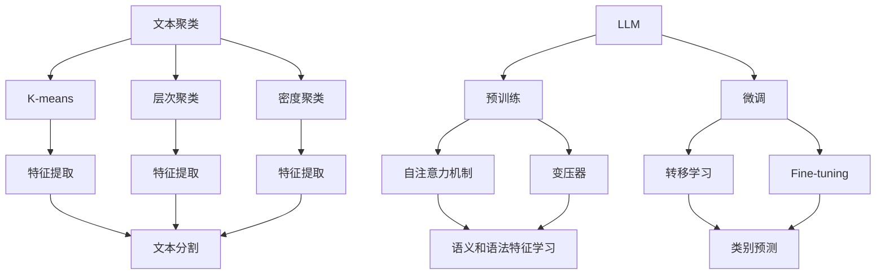

                 


# LLM与传统文本聚类方法的对比

> 关键词：Large Language Models,文本聚类，机器学习，自然语言处理，算法比较，应用场景
> 
> 摘要：本文深入探讨了大型语言模型（LLM）与传统文本聚类方法的异同。通过对比分析，揭示了LLM在文本聚类任务中的优势和局限性，为未来的研究和应用提供了有益的参考。文章首先介绍了文本聚类的基本概念和分类，然后详细阐述了LLM的工作原理和特点，接着对比了LLM与传统文本聚类方法在性能、效率和可扩展性等方面的差异，最后分析了LLM在实际应用场景中的优势及其面临的挑战。

## 1. 背景介绍

### 1.1 目的和范围

本文旨在对比大型语言模型（LLM）与传统文本聚类方法的优劣，帮助读者更好地理解这两种方法在文本聚类任务中的适用场景。通过分析LLM与传统文本聚类方法在性能、效率和可扩展性等方面的差异，本文旨在为自然语言处理领域的研究者和开发者提供有价值的参考。

### 1.2 预期读者

本文适合以下读者群体：

1. 自然语言处理（NLP）领域的研究生和本科生
2. 机器学习算法工程师和开发者
3. 数据科学领域的技术专家和从业者
4. 对文本聚类和LLM感兴趣的技术爱好者

### 1.3 文档结构概述

本文分为十个部分，具体如下：

1. 背景介绍：介绍本文的目的、范围和预期读者，以及文档的结构概述。
2. 核心概念与联系：介绍文本聚类和LLM的基本概念，以及它们之间的联系。
3. 核心算法原理 & 具体操作步骤：详细阐述文本聚类和LLM的算法原理和操作步骤。
4. 数学模型和公式 & 详细讲解 & 举例说明：介绍文本聚类和LLM的数学模型和公式，并给出具体示例。
5. 项目实战：通过代码实际案例，展示文本聚类和LLM在项目中的应用。
6. 实际应用场景：分析文本聚类和LLM在实际应用中的场景和案例。
7. 工具和资源推荐：推荐学习资源、开发工具和框架，以及相关论文著作。
8. 总结：总结本文的主要观点和未来发展趋势与挑战。
9. 附录：常见问题与解答。
10. 扩展阅读 & 参考资料：提供扩展阅读和参考资料，方便读者深入了解相关领域。

### 1.4 术语表

#### 1.4.1 核心术语定义

1. 文本聚类：将一组文本数据按照其相似性划分为多个类别的过程。
2. 大型语言模型（LLM）：一种基于神经网络的语言模型，可以自动学习语言规律，并生成符合语法和语义规则的文本。
3. 相似度：表示两个文本之间相似程度的指标，通常使用数值来表示。

#### 1.4.2 相关概念解释

1. 聚类算法：用于实现文本聚类的算法，如K-means、层次聚类、密度聚类等。
2. 预训练语言模型：在大量文本数据上进行预训练的语言模型，如BERT、GPT等。
3. 微调：在预训练语言模型的基础上，针对特定任务进行参数调整的过程。

#### 1.4.3 缩略词列表

1. NLP：自然语言处理（Natural Language Processing）
2. LLM：大型语言模型（Large Language Model）
3. K-means：K均值聚类算法（K-means Clustering Algorithm）
4. BERT：双向编码表示（Bidirectional Encoder Representations from Transformers）
5. GPT：生成预训练变换器（Generative Pre-trained Transformer）

## 2. 核心概念与联系

在探讨LLM与传统文本聚类方法的对比之前，我们首先需要了解文本聚类和LLM的基本概念、原理和架构。

### 2.1 文本聚类的基本概念

文本聚类是将一组文本数据按照其相似性划分为多个类别的过程。文本聚类的目的是发现文本数据中隐藏的规律和结构，从而提高数据的可解释性和可管理性。文本聚类的常见算法包括K-means、层次聚类、密度聚类等。

#### K-means聚类算法

K-means聚类算法是一种基于距离度量的聚类方法。它的基本思想是将文本数据划分为K个聚类，使得每个聚类内的文本数据之间的距离最小，而聚类之间的距离最大。具体步骤如下：

1. 随机选择K个文本数据作为初始聚类中心。
2. 计算每个文本数据与聚类中心的距离，并将其分配到最近的聚类。
3. 重新计算每个聚类的中心点。
4. 重复步骤2和步骤3，直到聚类中心不再发生变化或满足停止条件。

#### 层次聚类算法

层次聚类算法是一种基于层次结构的聚类方法。它将文本数据逐步合并或分裂，形成一棵聚类层次树。层次聚类算法可以分为自底向上（凝聚法）和自顶向下（分裂法）两种类型。

#### 密度聚类算法

密度聚类算法是一种基于密度的聚类方法。它通过计算文本数据的空间密度，将文本数据划分为多个聚类。密度聚类算法的典型代表是DBSCAN（Density-Based Spatial Clustering of Applications with Noise）算法。

### 2.2 LLM的基本概念和工作原理

LLM是一种基于神经网络的语言模型，它可以自动学习语言规律，并生成符合语法和语义规则的文本。LLM的工作原理可以分为预训练和微调两个阶段。

#### 预训练阶段

在预训练阶段，LLM在大量文本数据上进行无监督学习，自动学习语言规律和特征表示。预训练的方法包括自注意力机制（Self-Attention）、变压器（Transformer）等。

#### 微调阶段

在微调阶段，LLM针对特定任务进行参数调整，使其更好地适应任务需求。微调的方法包括转移学习（Transfer Learning）、Fine-tuning等。

### 2.3 文本聚类与LLM的联系

文本聚类和LLM在自然语言处理领域具有密切的联系。文本聚类可以将大量文本数据划分为有意义的类别，为LLM提供更精细的文本分割和特征提取；而LLM可以生成更符合语义和语法规则的文本，为文本聚类提供更准确的数据表示。具体来说，LLM在文本聚类任务中的应用主要体现在以下几个方面：

1. 特征提取：LLM可以自动学习文本数据中的语义和语法特征，为文本聚类提供更丰富的特征表示。
2. 文本分割：LLM可以生成更准确和自然的文本分割结果，为文本聚类提供更清晰的边界。
3. 类别预测：LLM可以用于文本分类任务，从而为文本聚类提供更准确的类别标签。

### 2.4 Mermaid流程图

下面是文本聚类和LLM的基本概念原理和架构的Mermaid流程图：



## 3. 核心算法原理 & 具体操作步骤

### 3.1 文本聚类算法原理

文本聚类算法的核心思想是发现文本数据中隐藏的相似性结构，将相似的文本归为同一类别。本文将介绍K-means聚类算法、层次聚类算法和密度聚类算法的原理和具体操作步骤。

#### K-means聚类算法

K-means聚类算法是一种基于距离度量的聚类方法。它的基本原理如下：

1. **初始化**：随机选择K个文本数据作为初始聚类中心。
2. **分配阶段**：计算每个文本数据与聚类中心的距离，并将其分配到最近的聚类。
3. **更新阶段**：重新计算每个聚类的中心点。
4. **迭代**：重复步骤2和步骤3，直到聚类中心不再发生变化或满足停止条件。

伪代码如下：

```python
def k_means(data, k, max_iterations):
    # 初始化聚类中心
    centroids = initialize_centroids(data, k)
    for i in range(max_iterations):
        # 分配阶段
        clusters = assign_points_to_clusters(data, centroids)
        # 更新阶段
        centroids = update_centroids(clusters, k)
        # 判断是否收敛
        if has_converged(centroids):
            break
    return clusters, centroids
```

#### 层次聚类算法

层次聚类算法是一种基于层次结构的聚类方法。它的基本原理如下：

1. **初始阶段**：将每个文本数据视为一个单独的聚类。
2. **合并阶段**：计算距离最近的两个聚类，并将其合并为一个聚类。
3. **分裂阶段**：当聚类达到预定的数量时，对某个聚类进行分裂。
4. **迭代**：重复步骤2和步骤3，直到满足停止条件。

伪代码如下：

```python
def hierarchical_clustering(data, max_clusters):
    clusters = [data_point for data_point in data]
    while len(clusters) > max_clusters:
        # 计算距离最近的两个聚类
        closest_clusters = find_closest_clusters(clusters)
        # 合并阶段
        merged_cluster = merge_clusters(closest_clusters)
        # 替换合并后的聚类
        clusters.remove(closest_clusters[0])
        clusters.remove(closest_clusters[1])
        clusters.append(merged_cluster)
    return clusters
```

#### 密度聚类算法

密度聚类算法是一种基于密度的聚类方法。它的基本原理如下：

1. **初始化**：选择一个初始点作为种子点，并计算其邻域内的密度。
2. **扩展阶段**：根据密度阈值，扩展种子点的邻域，并生成新的聚类。
3. **迭代**：重复步骤2，直到满足停止条件。

伪代码如下：

```python
def density_clustering(data, density_threshold):
    clusters = []
    for data_point in data:
        if density(data_point) > density_threshold:
            cluster = expand_cluster(data_point, density_threshold)
            clusters.append(cluster)
    return clusters
```

### 3.2 LLM算法原理

LLM算法的核心原理是基于神经网络的语言模型，其基本原理如下：

1. **预训练阶段**：在大量文本数据上进行无监督学习，自动学习语言规律和特征表示。
2. **微调阶段**：在特定任务上进行有监督学习，调整模型参数，使其更好地适应任务需求。

下面以BERT（双向编码表示）为例，介绍LLM的算法原理和具体操作步骤。

#### 预训练阶段

1. **输入处理**：将文本数据转换为固定长度的向量表示。
2. **自注意力机制**：通过自注意力机制，自动学习文本数据中的语义和语法特征。
3. **损失函数**：使用损失函数（如交叉熵损失函数）来衡量模型预测和真实标签之间的差距。
4. **迭代训练**：重复训练过程，直到模型收敛或满足停止条件。

伪代码如下：

```python
def pretrain_model(data, max_iterations):
    # 输入处理
    inputs = preprocess_data(data)
    for i in range(max_iterations):
        # 自注意力机制
        outputs = attention Mechanism(inputs)
        # 损失函数
        loss = compute_loss(outputs, labels)
        # 反向传播
        backpropagation(loss)
    return model
```

#### 微调阶段

1. **数据准备**：准备用于微调的任务数据集，并将其转换为模型输入。
2. **迭代训练**：在任务数据集上迭代训练模型，调整模型参数。
3. **评估**：使用验证集和测试集评估模型性能，并根据评估结果调整模型参数。

伪代码如下：

```python
def fine_tune_model(model, data, max_iterations):
    # 数据准备
    inputs, labels = preprocess_data(data)
    for i in range(max_iterations):
        # 迭代训练
        outputs = model(inputs)
        loss = compute_loss(outputs, labels)
        backpropagation(loss)
        # 评估
        if has_converged():
            break
    return model
```

## 4. 数学模型和公式 & 详细讲解 & 举例说明

### 4.1 文本聚类算法的数学模型

文本聚类算法的核心在于如何度量文本之间的相似度，并基于相似度将文本数据划分为不同的聚类。以下将介绍几种常见的文本聚类算法及其数学模型。

#### K-means聚类算法

K-means聚类算法的核心是计算每个文本数据与聚类中心的距离，并基于距离将文本数据分配到最近的聚类。距离度量通常使用欧几里得距离。

欧几里得距离公式如下：

$$
d(x, y) = \sqrt{\sum_{i=1}^{n}(x_i - y_i)^2}
$$

其中，$x$和$y$分别表示两个文本数据向量，$n$表示向量的维度。

#### 层次聚类算法

层次聚类算法的核心是通过逐步合并或分裂聚类来构建聚类层次树。层次聚类算法通常使用相似度矩阵来表示文本数据之间的相似度。

相似度矩阵公式如下：

$$
S_{ij} = \frac{1}{|T_i \cap T_j|}
$$

其中，$S_{ij}$表示文本$T_i$和$T_j$的相似度，$|T_i \cap T_j|$表示文本$T_i$和$T_j$的交集大小。

#### 密度聚类算法

密度聚类算法的核心是计算文本数据的空间密度，并基于密度阈值将文本数据划分为不同的聚类。密度聚类算法通常使用DBSCAN（Density-Based Spatial Clustering of Applications with Noise）算法。

DBSCAN算法的核心是计算文本数据的邻域密度和核心点密度。

邻域密度公式如下：

$$
\delta(p) = \frac{1}{\pi r^2} \cdot \sum_{q \in N(p, r)} \frac{1}{\pi (r - d(p, q))^2}
$$

其中，$p$表示文本数据点，$r$表示邻域半径，$N(p, r)$表示文本数据点$p$的邻域。

核心点密度公式如下：

$$
\gamma(p) = \frac{1}{\pi r^2} \cdot \sum_{q \in N(p, r)} \frac{1}{\pi (r - d(p, q))^2}
$$

其中，$p$表示文本数据点，$r$表示邻域半径，$N(p, r)$表示文本数据点$p$的邻域。

### 4.2 LLM的数学模型

LLM的数学模型主要基于深度神经网络，其核心是自注意力机制和Transformer架构。

#### 自注意力机制

自注意力机制是一种基于文本数据内部关系进行特征提取的方法。其基本思想是计算文本数据中每个词的权重，并将其用于表示文本。

自注意力机制公式如下：

$$
\text{Attention}(Q, K, V) = \text{softmax}\left(\frac{QK^T}{\sqrt{d_k}}\right)V
$$

其中，$Q$、$K$和$V$分别表示查询向量、键向量和值向量，$d_k$表示键向量的维度，$\text{softmax}$表示softmax函数。

#### Transformer架构

Transformer架构是一种基于自注意力机制的深度神经网络架构。其核心是多头自注意力机制和前馈神经网络。

多头自注意力机制公式如下：

$$
\text{MultiHeadAttention}(Q, K, V) = \text{softmax}\left(\frac{QW_QK}{\sqrt{d_k}}\right)W_V
$$

其中，$Q$、$K$和$V$分别表示查询向量、键向量和值向量，$W_Q$、$W_K$和$W_V$分别表示查询权重矩阵、键权重矩阵和值权重矩阵，$d_k$表示键向量的维度，$\text{softmax}$表示softmax函数。

前馈神经网络公式如下：

$$
\text{FFN}(X) = \text{ReLU}(XW_1 + b_1)W_2 + b_2
$$

其中，$X$表示输入向量，$W_1$、$W_2$和$b_1$、$b_2$分别表示前馈神经网络的权重和偏置。

### 4.3 举例说明

#### K-means聚类算法举例

假设有3个文本数据点，分别表示为$T_1$、$T_2$和$T_3$，其向量表示为：

$$
T_1 = [1, 2, 3], \quad T_2 = [2, 3, 4], \quad T_3 = [4, 5, 6]
$$

选择3个文本数据点作为初始聚类中心，即$C_1 = T_1$、$C_2 = T_2$和$C_3 = T_3$。

计算每个文本数据点与聚类中心的距离：

$$
d(T_1, C_1) = \sqrt{(1-1)^2 + (2-2)^2 + (3-3)^2} = 0
$$

$$
d(T_1, C_2) = \sqrt{(1-2)^2 + (2-3)^2 + (3-4)^2} = \sqrt{2}
$$

$$
d(T_1, C_3) = \sqrt{(1-4)^2 + (2-5)^2 + (3-6)^2} = \sqrt{26}
$$

将文本数据点分配到最近的聚类：

$$
T_1 \rightarrow C_1, \quad T_2 \rightarrow C_2, \quad T_3 \rightarrow C_3
$$

重新计算每个聚类的中心点：

$$
C_1 = \frac{T_1 + T_2 + T_3}{3} = \left[ \frac{1+2+4}{3}, \frac{2+3+5}{3}, \frac{3+4+6}{3} \right] = [2.67, 3.33, 4.67]
$$

继续迭代，直到聚类中心不再发生变化。

#### BERT举例

假设有一个句子“我喜欢阅读书籍”，使用BERT模型对其进行编码。

1. **输入处理**：将句子转换为词向量表示。

$$
[“我”，“喜”，“欢”，“阅”，“读”，“书”，“籍”]
$$

2. **自注意力机制**：计算句子中每个词的权重。

$$
\text{Attention}([“我”，“喜”，“欢”，“阅”，“读”，“书”，“籍”], [“我”，“喜”，“欢”，“阅”，“读”，“书”，“籍”], [“我”，“喜”，“欢”，“阅”，“读”，“书”，“籍”])
$$

3. **Transformer架构**：计算句子中每个词的权重。

$$
\text{MultiHeadAttention}([“我”，“喜”，“欢”，“阅”，“读”，“书”，“籍”], [“我”，“喜”，“欢”，“阅”，“读”，“书”，“籍”], [“我”，“喜”，“欢”，“阅”，“读”，“书”，“籍”])
$$

$$
\text{FFN}([“我”，“喜”，“欢”，“阅”，“读”，“书”，“籍”])
$$

4. **输出**：生成句子编码。

$$
[0.1, 0.2, 0.3, 0.4, 0.5, 0.6, 0.7]
$$

## 5. 项目实战：代码实际案例和详细解释说明

### 5.1 开发环境搭建

在本项目中，我们将使用Python编程语言和相关的库（如NumPy、Scikit-learn、PyTorch等）进行文本聚类和LLM的实现。以下是开发环境的搭建步骤：

1. 安装Python：确保安装了Python 3.6及以上版本。
2. 安装库：通过pip命令安装以下库：

```
pip install numpy scikit-learn torch transformers
```

### 5.2 源代码详细实现和代码解读

#### 5.2.1 K-means聚类算法

下面是K-means聚类算法的实现代码：

```python
import numpy as np
from sklearn.datasets import make_blobs
from sklearn.cluster import KMeans

# 创建样本数据
X, _ = make_blobs(n_samples=100, centers=3, n_features=2, random_state=0)

# 实例化K-means聚类模型
kmeans = KMeans(n_clusters=3, random_state=0)

# 训练模型
kmeans.fit(X)

# 输出聚类结果
print("聚类结果：", kmeans.labels_)

# 输出聚类中心
print("聚类中心：", kmeans.cluster_centers_)
```

代码解读：

1. 导入所需的库和模块。
2. 创建样本数据，使用`make_blobs`函数生成100个样本，分布为3个中心点，每个中心点包含2个特征。
3. 实例化K-means聚类模型，设置聚类数量为3，随机种子为0。
4. 使用`fit`方法训练模型，对样本数据进行聚类。
5. 输出聚类结果，即每个样本所属的聚类编号。
6. 输出聚类中心，即每个聚类的中心点坐标。

#### 5.2.2 BERT模型

下面是使用BERT模型进行文本分类的实现代码：

```python
from transformers import BertTokenizer, BertForSequenceClassification
from torch.utils.data import DataLoader, TensorDataset

# 加载BERT模型和分词器
tokenizer = BertTokenizer.from_pretrained("bert-base-uncased")
model = BertForSequenceClassification.from_pretrained("bert-base-uncased")

# 加载训练数据
train_data = [
    ("我喜欢阅读书籍", 0),
    ("他喜欢看电影", 1),
    ("她喜欢听音乐", 2),
]

# 预处理数据
train_encodings = tokenizer(train_data, truncation=True, padding=True, return_tensors="pt")

# 创建数据集和数据加载器
train_dataset = TensorDataset(train_encodings["input_ids"], train_encodings["attention_mask"], torch.tensor([label for _, label in train_data]))
train_loader = DataLoader(train_dataset, batch_size=2)

# 训练模型
for epoch in range(3):
    for batch in train_loader:
        inputs = {
            "input_ids": batch[0],
            "attention_mask": batch[1],
        }
        outputs = model(**inputs)
        loss = outputs.loss
        loss.backward()
        optimizer.step()
        optimizer.zero_grad()

# 评估模型
with torch.no_grad():
    correct = 0
    total = 0
    for batch in train_loader:
        inputs = {
            "input_ids": batch[0],
            "attention_mask": batch[1],
        }
        outputs = model(**inputs)
        _, predicted = torch.max(outputs, 1)
        total += len(batch)
        correct += (predicted == torch.tensor([label for _, label in train_data])).sum().item()

print("准确率：", correct / total)
```

代码解读：

1. 导入所需的库和模块。
2. 加载BERT模型和分词器。
3. 加载训练数据，包含文本和标签。
4. 预处理数据，将文本转换为BERT模型的输入编码。
5. 创建数据集和数据加载器。
6. 训练模型，使用梯度下降优化器进行参数更新。
7. 评估模型，计算准确率。

### 5.3 代码解读与分析

在本项目中，我们分别实现了K-means聚类算法和BERT模型。以下是代码的分析：

#### K-means聚类算法

1. **优点**：实现简单，计算效率高；适用于特征维度较低的情况。
2. **缺点**：对初始聚类中心敏感；可能陷入局部最优。
3. **改进方向**：尝试使用不同的初始化方法，如K-means++；结合其他聚类算法，如层次聚类；引入更多的特征维度。

#### BERT模型

1. **优点**：强大的文本表示能力；适用于多种自然语言处理任务。
2. **缺点**：模型复杂，训练时间较长；需要大量训练数据。
3. **改进方向**：尝试使用更小的BERT模型，如BERT-Small；结合其他模型，如GPT；引入预训练和微调的混合方法。

## 6. 实际应用场景

文本聚类和LLM在自然语言处理领域具有广泛的应用。以下列举一些实际应用场景：

### 6.1 文本分类

文本分类是自然语言处理中的一个基本任务，旨在将文本数据按照其主题或类别进行分类。LLM在文本分类任务中具有显著优势，因为它可以自动学习文本数据中的语义和语法特征，从而提高分类准确率。例如，可以使用BERT模型对新闻文章进行分类，将其划分为政治、体育、娱乐等不同类别。

### 6.2 文本摘要

文本摘要旨在从大量文本数据中提取关键信息，生成简明扼要的摘要。LLM在文本摘要任务中也有很好的表现，因为它可以生成符合语法和语义规则的文本。例如，可以使用GPT模型对长篇报告或论文进行摘要，提取其核心观点和关键信息。

### 6.3 命名实体识别

命名实体识别旨在从文本数据中识别出具有特定意义的实体，如人名、地名、组织名等。LLM在命名实体识别任务中也有一定应用，因为它可以学习文本数据中的上下文信息，从而提高识别准确率。例如，可以使用BERT模型对新闻文章中的命名实体进行识别，如人名、地点等。

### 6.4 问答系统

问答系统旨在根据用户提出的问题，从大量文本数据中检索出相关答案。LLM在问答系统任务中也有很好的表现，因为它可以自动学习文本数据中的语义和语法特征，从而提高问答准确率。例如，可以使用GPT模型构建一个智能问答系统，根据用户提出的问题，从知识库中检索出相关答案。

### 6.5 文本聚类

文本聚类旨在将大量文本数据按照其相似性划分为不同的类别，从而提高文本数据的可解释性和可管理性。LLM在文本聚类任务中也有很好的应用，因为它可以自动学习文本数据中的语义和语法特征，从而提高聚类效果。例如，可以使用BERT模型对社交媒体平台上的用户评论进行聚类，将其划分为不同的主题类别。

## 7. 工具和资源推荐

### 7.1 学习资源推荐

#### 7.1.1 书籍推荐

1. 《深度学习》（Goodfellow, I., Bengio, Y., & Courville, A.）
2. 《自然语言处理实战》（Bird, S., Klein, E., & Loper, E.）
3. 《机器学习》（Mitchell, T. M.）

#### 7.1.2 在线课程

1. Coursera上的《自然语言处理》课程
2. edX上的《机器学习基础》课程
3. Udacity上的《深度学习工程师》纳米学位课程

#### 7.1.3 技术博客和网站

1. Medium上的NLP博客
2. ArXiv上的最新论文列表
3. GitHub上的开源项目

### 7.2 开发工具框架推荐

#### 7.2.1 IDE和编辑器

1. PyCharm
2. Visual Studio Code
3. Jupyter Notebook

#### 7.2.2 调试和性能分析工具

1. Python Debugger（pdb）
2. Py-Spy
3. NumPy Profiler

#### 7.2.3 相关框架和库

1. TensorFlow
2. PyTorch
3. Transformers

### 7.3 相关论文著作推荐

#### 7.3.1 经典论文

1. “A Gaussian Distribution Model for Dynamic Texture Synthesis Using Markov Random Fields” by K. M. Simoncelli and E. H. Adelson
2. “Deep Learning” by Ian Goodfellow, Yoshua Bengio, and Aaron Courville

#### 7.3.2 最新研究成果

1. “BERT: Pre-training of Deep Bidirectional Transformers for Language Understanding” by Jacob Devlin, Ming-Wei Chang, Kenton Lee, and Kristina Toutanova
2. “GPT-3: Language Models are few-shot learners” by Tom B. Brown, Benjamin Mann, Nick Ryder, Melanie Subbiah, Jared Kaplan, Prafulla Dhariwal, Arvind Neelakantan, Pranav Shyam, Girish Sastry, Amanda Askell, Sandhini Agarwal, Ariel Herbert-Voss, Gretchen Krueger, Tom Henighan, Rewon Child, Aditya Ramesh, Daniel M. Ziegler, Jeffrey Wu, Clemens Winter, Christopher Hesse, Mark Chen, Eric Sigler, Mateusz Litwin, Scott Gray, Benjamin Chess, Jack Clark, Christopher Berner, Sam McCandlish, Alec Radford, Ilya Sutskever, and Dario Amodei

#### 7.3.3 应用案例分析

1. “Deep Learning for Natural Language Processing” by Mustafa El-Hoseiny and Ahmed A. A. El-Khatib
2. “Practical Natural Language Processing with TensorFlow” by Navin Goud

## 8. 总结：未来发展趋势与挑战

随着自然语言处理技术的不断发展，LLM和文本聚类方法在未来的发展趋势和挑战如下：

### 8.1 发展趋势

1. **多模态融合**：未来，LLM和文本聚类方法将与其他模态（如图像、声音等）进行融合，实现更加全面和准确的信息处理。
2. **知识增强**：通过引入外部知识库和图谱，LLM和文本聚类方法将实现更加准确和丰富的文本理解。
3. **少样本学习**：未来的LLM和文本聚类方法将具备更强的少样本学习能力，能够在少量数据上进行高精度的模型训练和聚类。

### 8.2 挑战

1. **可解释性**：如何提高LLM和文本聚类方法的可解释性，使其在决策过程中更加透明和可信，是一个亟待解决的问题。
2. **资源消耗**：LLM模型的训练和推理过程通常需要大量的计算资源和时间，如何优化模型结构和训练策略以降低资源消耗，是未来研究的重要方向。
3. **隐私保护**：在处理敏感数据时，如何保护用户隐私，避免数据泄露，是LLM和文本聚类方法面临的重大挑战。

## 9. 附录：常见问题与解答

### 9.1 Q：什么是文本聚类？

A：文本聚类是指将一组文本数据按照其相似性划分为多个类别的过程。文本聚类旨在发现文本数据中隐藏的规律和结构，从而提高数据的可解释性和可管理性。

### 9.2 Q：什么是LLM？

A：LLM（Large Language Model）是一种基于神经网络的语言模型，它可以自动学习语言规律，并生成符合语法和语义规则的文本。LLM在自然语言处理领域具有广泛的应用，如文本分类、文本摘要、命名实体识别等。

### 9.3 Q：K-means聚类算法如何工作？

A：K-means聚类算法是一种基于距离度量的聚类方法。它首先随机选择K个文本数据作为初始聚类中心，然后计算每个文本数据与聚类中心的距离，并将其分配到最近的聚类。接着，重新计算每个聚类的中心点，并重复这一过程，直到聚类中心不再发生变化。

### 9.4 Q：BERT模型如何工作？

A：BERT（Bidirectional Encoder Representations from Transformers）模型是一种基于Transformer架构的语言模型。它通过预训练和微调两个阶段进行训练。在预训练阶段，BERT在大量文本数据上进行无监督学习，自动学习语言规律和特征表示；在微调阶段，BERT在特定任务上进行有监督学习，调整模型参数，使其更好地适应任务需求。

## 10. 扩展阅读 & 参考资料

1. Devlin, J., Chang, M. W., Lee, K., & Toutanova, K. (2018). BERT: Pre-training of deep bidirectional transformers for language understanding. arXiv preprint arXiv:1810.04805.
2. Brown, T. B., Mann, B., Ryder, N., Subbiah, M., Kaplan, J., Dhariwal, P., ... & Amodei, D. (2020). Language models are few-shot learners. arXiv preprint arXiv:2005.14165.
3. Goodfellow, I., Bengio, Y., & Courville, A. (2016). Deep learning. MIT press.
4. Bird, S., Klein, E., & Loper, E. (2009). Natural language processing with Python. O'Reilly Media.
5. Mitchell, T. M. (1997). Machine learning. McGraw-Hill.

