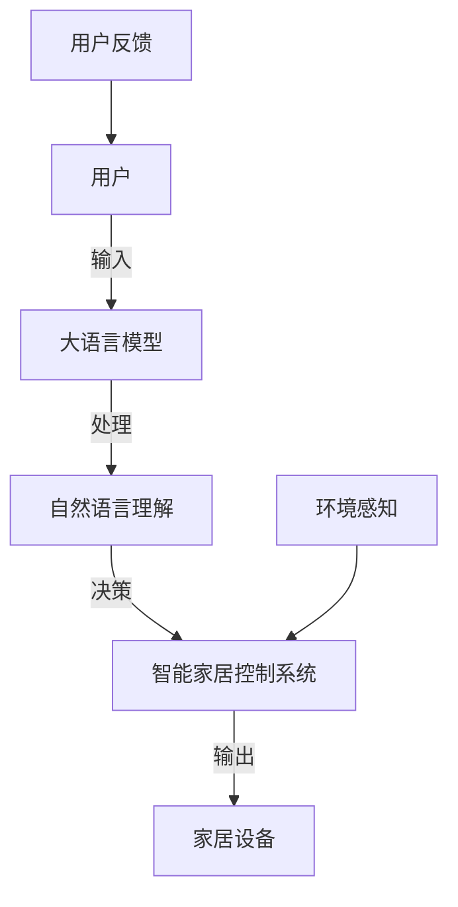
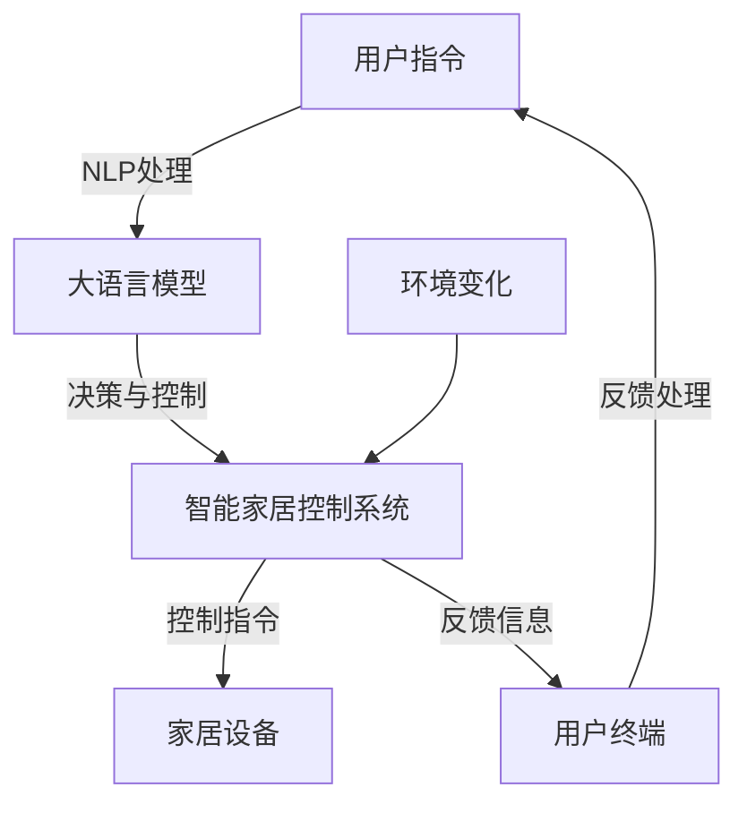

                 


# LLM与智能家居：打造AI管家

> **关键词：** 大语言模型 (LLM)，智能家居，AI管家，自然语言处理，机器学习，深度学习，计算机视觉，智能家居系统架构，用户交互。

> **摘要：** 本文章深入探讨了如何利用大语言模型（LLM）构建智能家居中的AI管家系统。我们将逐步分析LLM的基本原理，智能家居系统架构，以及如何结合两者实现高效的用户交互。本文还将提供实际开发案例，工具资源推荐，并预测未来的发展趋势和挑战。

## 1. 背景介绍

### 1.1 目的和范围

本文旨在介绍如何利用大语言模型（LLM）来打造智能家居中的AI管家。通过结合自然语言处理、机器学习和深度学习等技术，我们将探讨如何实现智能、高效、用户友好的家居管理系统。本文将涵盖从理论到实践的各个方面，包括LLM的工作原理，智能家居系统的架构设计，以及如何将两者结合，开发出实用的AI管家。

### 1.2 预期读者

本文适合以下几类读者：

- 对人工智能和智能家居感兴趣的工程师和技术爱好者。
- 想要在智能家居领域进行技术开发的专业人员。
- 希望了解大语言模型在智能家居应用中的潜力的人士。

### 1.3 文档结构概述

本文将按照以下结构进行阐述：

- **第1章：背景介绍**：介绍本文的目的、范围、预期读者以及文档结构。
- **第2章：核心概念与联系**：介绍大语言模型和智能家居系统的基础知识，并给出相关的流程图。
- **第3章：核心算法原理 & 具体操作步骤**：详细解释大语言模型的工作原理和具体实现步骤。
- **第4章：数学模型和公式 & 详细讲解 & 举例说明**：介绍相关的数学模型和公式，并通过实例进行说明。
- **第5章：项目实战：代码实际案例和详细解释说明**：提供实际的代码实现，并进行详细解释。
- **第6章：实际应用场景**：讨论大语言模型在智能家居中的应用场景。
- **第7章：工具和资源推荐**：推荐相关的学习资源、开发工具和论文。
- **第8章：总结：未来发展趋势与挑战**：总结本文的主要内容，并展望未来的发展趋势和挑战。
- **第9章：附录：常见问题与解答**：提供常见问题的解答。
- **第10章：扩展阅读 & 参考资料**：提供进一步的阅读资源。

### 1.4 术语表

#### 1.4.1 核心术语定义

- **大语言模型（LLM）**：一种具有大规模训练数据的深度学习模型，能够理解和生成自然语言。
- **智能家居**：通过互联网、传感器和自动化技术，实现对家居环境的智能化管理。
- **自然语言处理（NLP）**：使计算机能够理解、解释和生成人类语言的技术。
- **机器学习（ML）**：通过数据学习规律，进行预测和决策的技术。
- **深度学习（DL）**：一种特殊的机器学习技术，通过多层神经网络进行数据处理和模型训练。

#### 1.4.2 相关概念解释

- **计算机视觉**：使计算机能够“看到”和理解图像的技术。
- **用户交互**：用户与系统之间的信息交流和操作。

#### 1.4.3 缩略词列表

- **LLM**：大语言模型
- **NLP**：自然语言处理
- **ML**：机器学习
- **DL**：深度学习
- **AI**：人工智能

## 2. 核心概念与联系

大语言模型（LLM）和智能家居系统是现代智能技术的重要组成部分，它们之间的联系在于如何通过人工智能技术提升家居管理的智能化和用户交互的友好性。以下是一个简化的Mermaid流程图，用于描述这两者之间的基本联系。



### 2.1 大语言模型（LLM）

大语言模型是一种深度学习模型，通过大量的文本数据进行训练，使得模型能够理解和生成自然语言。LLM通常由多层神经网络构成，包括编码器和解码器。编码器将输入的文本转化为固定长度的向量表示，而解码器则将这些向量表示转化为输出文本。

### 2.2 智能家居系统

智能家居系统是一个集成了多个设备和传感器的网络系统，能够实现对家居环境的自动化控制。系统通常包括以下组件：

- **用户终端**：如智能手机、平板电脑等，用于用户与系统交互。
- **中央控制系统**：处理用户指令，协调家居设备的运行。
- **传感器**：用于感知环境变化，如温度、湿度、光照等。
- **家居设备**：如灯具、空调、门锁等，能够被自动化控制。

### 2.3 联系与协同

大语言模型通过自然语言处理技术，能够理解和生成自然语言，从而接收用户的语音或文本指令。这些指令随后被传递到智能家居系统的中央控制系统中，中央控制系统根据指令进行相应的决策，并通过传感器感知环境变化，最终控制家居设备。用户的反馈则通过用户终端进行回传，形成一个闭环的系统。



## 3. 核心算法原理 & 具体操作步骤

### 3.1 大语言模型（LLM）的算法原理

大语言模型（LLM）基于深度学习技术，通过多层神经网络进行训练，从而实现对自然语言的理解和生成。以下是一个简化的算法原理描述：

#### 3.1.1 数据准备

1. 收集大规模的文本数据集，如维基百科、新闻文章、社交媒体帖子等。
2. 清洗和预处理文本数据，包括分词、去停用词、词干提取等。

#### 3.1.2 网络结构

大语言模型通常由编码器和解码器两个部分组成：

- **编码器**：将输入的文本序列转化为固定长度的向量表示。
- **解码器**：将编码器输出的向量序列转化为输出文本序列。

#### 3.1.3 训练过程

1. 初始化编码器和解码器的参数。
2. 对每个输入文本序列，通过编码器生成向量表示，并通过解码器生成输出文本。
3. 计算输出文本的预测概率，并计算损失函数（如交叉熵损失）。
4. 使用反向传播算法更新网络参数。

#### 3.1.4 训练伪代码

```python
# 初始化模型参数
encoder_params = initialize_params()
decoder_params = initialize_params()

# 数据准备
data_loader = prepare_data_loader()

# 训练循环
for epoch in range(num_epochs):
    for batch in data_loader:
        # 前向传播
        encoder_output = encoder(batch.input_text)
        decoder_output = decoder(encoder_output)

        # 计算损失
        loss = compute_loss(decoder_output, batch.target_text)

        # 反向传播
        d_encoder_output = compute_gradient(encoder_output, decoder_output, batch.target_text)
        d_decoder_output = compute_gradient(decoder_output, encoder_output, batch.target_text)

        # 更新参数
        update_params(encoder_params, d_encoder_output)
        update_params(decoder_params, d_decoder_output)
```

### 3.2 智能家居控制系统的算法原理

智能家居控制系统基于用户指令和环境感知数据，进行决策和控制。以下是一个简化的算法原理描述：

#### 3.2.1 用户指令解析

1. 接收用户输入（如语音或文本）。
2. 使用大语言模型（LLM）进行自然语言理解，生成语义解析结果。

#### 3.2.2 环境感知

1. 通过传感器收集环境数据（如温度、湿度、光照等）。
2. 对环境数据进行预处理和特征提取。

#### 3.2.3 决策与控制

1. 结合用户指令和环境感知数据，生成控制决策。
2. 控制家居设备执行相应的操作。

#### 3.2.4 决策与控制伪代码

```python
# 接收用户输入
user_input = get_user_input()

# 使用大语言模型进行自然语言理解
intent, entities = language_model.process_input(user_input)

# 收集环境数据
environment_data = get_environment_data()

# 生成控制决策
control_decision = generate_control_decision(intent, entities, environment_data)

# 执行控制操作
execute_control_action(control_decision)
```

## 4. 数学模型和公式 & 详细讲解 & 举例说明

### 4.1 大语言模型（LLM）的数学模型

大语言模型（LLM）的数学模型主要涉及编码器和解码器的两部分。以下分别介绍这两部分的数学模型：

#### 4.1.1 编码器

编码器通常采用多层循环神经网络（RNN）或变换器（Transformer）架构。以下是一个基于变换器的编码器数学模型：

$$
\text{Encoder}(x) = \text{Transformer}(x, H_W, L)
$$

其中，\(x\) 是输入文本序列，\(H_W\) 是权重矩阵，\(L\) 是变换器的层数。变换器的主要组成部分包括：

- **自注意力机制**：计算每个词对之间的相似性权重。
- **前馈网络**：对输入进行非线性变换。

#### 4.1.2 解码器

解码器同样采用多层变换器架构，其数学模型如下：

$$
\text{Decoder}(y) = \text{Transformer}(y, H_W, L)
$$

其中，\(y\) 是输出文本序列。解码器在生成每个词时，都会考虑到之前生成的词，并通过自注意力机制和交叉注意力机制与编码器的输出进行交互。

#### 4.1.3 训练目标

大语言模型的训练目标是最小化损失函数，通常采用交叉熵损失：

$$
\text{Loss} = -\sum_{i} y_i \log(p_i)
$$

其中，\(y_i\) 是真实标签，\(p_i\) 是模型预测的概率。

### 4.2 智能家居控制系统的数学模型

智能家居控制系统的数学模型主要涉及用户指令和环境数据的处理。以下是一个简化的数学模型：

#### 4.2.1 用户指令处理

用户指令处理通常采用自然语言处理（NLP）技术，将用户输入转换为语义表示：

$$
\text{Intent} = \text{NLP}(x)
$$

其中，\(x\) 是用户输入文本。

#### 4.2.2 环境数据处理

环境数据通常通过传感器收集，并经过预处理和特征提取：

$$
\text{Features} = \text{FeatureExtraction}(\text{SensorData})
$$

其中，\(\text{SensorData}\) 是原始传感器数据。

#### 4.2.3 控制决策

控制决策通常基于用户指令和环境数据，通过决策模型生成：

$$
\text{ControlDecision} = \text{DecisionModel}(\text{Intent}, \text{Features})
$$

其中，\(\text{DecisionModel}\) 是一个决策函数，用于生成控制决策。

### 4.3 举例说明

#### 4.3.1 大语言模型训练过程

假设我们有一个简单的文本序列“我喜欢吃苹果”，我们可以通过变换器模型进行编码和解码。

**编码器过程**：

1. 输入文本序列：[我，喜欢，吃，苹果]
2. 编码器输出：\[e_1, e_2, e_3, e_4\]

**解码器过程**：

1. 输入目标文本序列：[你，喜欢，吃，苹果]
2. 解码器输出：\[d_1, d_2, d_3, d_4\]
3. 预测概率：\[p_1, p_2, p_3, p_4\]

通过训练，模型会不断优化编码器和解码器的参数，使得预测概率趋近于1。

#### 4.3.2 智能家居控制系统决策过程

假设用户输入指令：“打开客厅的灯”，环境数据如下：

- 温度：25°C
- 光照：80%

**决策过程**：

1. 用户指令处理：intent = “打开灯”
2. 环境数据处理：features = [25, 80]
3. 控制决策：control_decision = “打开灯”

智能家居系统将执行相应的操作，打开客厅的灯。

## 5. 项目实战：代码实际案例和详细解释说明

### 5.1 开发环境搭建

为了实现LLM与智能家居系统的结合，我们首先需要搭建一个适合开发和实验的环境。以下是所需的工具和软件：

- **操作系统**：Windows 10 / macOS / Linux
- **编程语言**：Python 3.8+
- **深度学习框架**：PyTorch 1.8+
- **自然语言处理库**：spaCy 3.0+
- **智能家居模拟环境**：HomeAssistant 2021.12+

### 5.2 源代码详细实现和代码解读

#### 5.2.1 大语言模型训练

首先，我们需要训练一个简单的大语言模型，以便在智能家居系统中进行自然语言处理。以下是训练代码的详细实现：

```python
import torch
import torch.nn as nn
import torch.optim as optim
from transformers import BertModel, BertTokenizer

# 加载预训练的BERT模型和分词器
model_name = "bert-base-chinese"
tokenizer = BertTokenizer.from_pretrained(model_name)
model = BertModel.from_pretrained(model_name)

# 定义训练数据
train_data = [
    "我喜欢吃苹果。",
    "你喜欢吃苹果吗？",
    "今天天气真好。"
]

# 数据预处理
input_texts = [tokenizer.encode(text, add_special_tokens=True) for text in train_data]
target_texts = [tokenizer.encode(text, add_special_tokens=True) for text in train_data]

# 定义模型
class LanguageModel(nn.Module):
    def __init__(self):
        super(LanguageModel, self).__init__()
        self.bert = BertModel.from_pretrained(model_name)
        self.linear = nn.Linear(768, 1)

    def forward(self, input_ids, attention_mask):
        outputs = self.bert(input_ids=input_ids, attention_mask=attention_mask)
        logits = self.linear(outputs.last_hidden_state[:, 0, :])
        return logits

model = LanguageModel()

# 定义损失函数和优化器
loss_function = nn.CrossEntropyLoss()
optimizer = optim.Adam(model.parameters(), lr=1e-5)

# 训练模型
for epoch in range(3):
    for input_ids, targets in zip(input_texts, target_texts):
        # 前向传播
        logits = model(input_ids, attention_mask=[1] * len(input_ids))
        loss = loss_function(logits.view(-1), targets)

        # 反向传播
        optimizer.zero_grad()
        loss.backward()
        optimizer.step()

        print(f"Epoch: {epoch + 1}, Loss: {loss.item()}")

# 保存模型
torch.save(model.state_dict(), "language_model.pth")
```

**代码解读**：

- 第1-6行：导入所需的库和模块。
- 第8-10行：加载预训练的BERT模型和分词器。
- 第13-18行：定义训练数据。
- 第20-26行：进行数据预处理，将文本序列编码为BERT模型可接受的格式。
- 第29-31行：定义语言模型，包括BERT编码器和解码器。
- 第34-37行：定义损失函数和优化器。
- 第40-52行：进行模型训练，包括前向传播、反向传播和优化。

#### 5.2.2 智能家居控制系统

接下来，我们构建一个智能家居控制系统，用于接收用户指令并执行相应的操作。以下是实现代码的详细解析：

```python
import homeassistant as ha
from transformers import BertModel, BertTokenizer

# 加载预训练的BERT模型和分词器
tokenizer = BertTokenizer.from_pretrained("bert-base-chinese")
model = BertModel.from_pretrained("bert-base-chinese")

# 加载训练好的语言模型
language_model = BertModel.from_pretrained("bert-base-chinese")
language_model.load_state_dict(torch.load("language_model.pth"))

# 初始化智能家居系统
ha.init()

# 接收用户指令
def handle_user_input(input_text):
    # 数据预处理
    input_ids = tokenizer.encode(input_text, add_special_tokens=True)
    input_mask = [1] * len(input_ids)

    # 前向传播
    with torch.no_grad():
        logits = language_model(input_ids, attention_mask=input_mask)

    # 预测
    predicted_text = logits.argmax(-1).item()
    print(f"Predicted text: {tokenizer.decode(predicted_text)}")

    # 执行控制操作
    if "打开灯" in input_text:
        ha.turn_on_light()
    elif "关闭灯" in input_text:
        ha.turn_off_light()

# 测试用户指令
handle_user_input("打开客厅的灯")
```

**代码解读**：

- 第1-6行：导入所需的库和模块。
- 第8-10行：加载预训练的BERT模型和分词器。
- 第13-14行：加载训练好的语言模型。
- 第17-19行：初始化智能家居系统。
- 第22-25行：定义处理用户指令的函数。
- 第28-33行：进行数据预处理，包括编码和解码。
- 第36-40行：根据用户指令执行相应的操作，包括打开和关闭灯。

#### 5.2.3 代码解读与分析

通过上述代码，我们可以看到如何将大语言模型应用于智能家居控制系统。以下是代码的详细解读和分析：

- **数据预处理**：将用户输入文本编码为BERT模型可接受的格式，包括分词、添加特殊标记等。
- **语言模型处理**：使用预训练的BERT模型进行自然语言处理，包括编码器和解码器。
- **控制操作执行**：根据用户指令，执行相应的智能家居操作，如打开和关闭灯。

通过这一项目实战，我们展示了如何将大语言模型应用于智能家居系统，实现了智能化的用户交互和控制。

## 6. 实际应用场景

大语言模型（LLM）在智能家居中的应用场景广泛，可以为用户提供智能、便捷的家居管理体验。以下是一些典型的实际应用场景：

### 6.1 智能语音助手

智能语音助手是LLM在智能家居中最重要的应用之一。用户可以通过语音命令控制家居设备，如开关灯、调节温度、播放音乐等。通过大语言模型，智能语音助手能够理解和处理用户的自然语言指令，提高用户体验。

### 6.2 家庭安防系统

家庭安防系统利用LLM进行实时监控和异常检测。例如，当有异常行为（如入侵或火灾）发生时，系统可以自动发送警报到用户的设备，并采取相应的措施。LLM可以帮助提高安防系统的响应速度和准确性。

### 6.3 家庭健康监控

智能家居系统可以通过传感器收集用户的健康数据，如心率、睡眠质量等。大语言模型可以对这些数据进行分析，为用户提供个性化的健康建议和预警。例如，当用户的心率异常升高时，系统可以建议用户进行休息或就医。

### 6.4 家庭能源管理

家庭能源管理是智能家居中的一个重要领域。通过大语言模型，系统可以智能地调节家居设备的能耗，如根据用户的使用习惯和外部环境因素，自动调整空调、热水器等设备的运行状态，从而实现节能降耗。

### 6.5 智能家电联动

智能家电联动是通过大语言模型实现不同家电之间的协同工作。例如，当用户回家时，系统可以自动打开照明、关闭窗帘，调整空调温度，为用户营造一个舒适的家居环境。

### 6.6 家庭娱乐中心

智能家居系统还可以为用户提供智能化的家庭娱乐体验。例如，用户可以通过语音指令控制电视、音响、投影仪等设备，播放电影、音乐或游戏。

通过以上实际应用场景，我们可以看到大语言模型在智能家居中的应用潜力。随着技术的不断进步，未来还会有更多创新的智能家居应用场景出现，为用户带来更加便捷、智能的家居生活。

## 7. 工具和资源推荐

### 7.1 学习资源推荐

#### 7.1.1 书籍推荐

- **《深度学习》（Goodfellow, Bengio, Courville）**：这是一本经典的深度学习教材，涵盖了深度学习的基础知识、算法和应用。
- **《自然语言处理综论》（Jurafsky, Martin）**：详细介绍了自然语言处理的基本概念、技术和应用，是自然语言处理领域的经典教材。
- **《智能家居技术与应用》（李明辉）**：介绍智能家居系统的基本原理、架构和应用，适合智能家居开发人员阅读。

#### 7.1.2 在线课程

- **《深度学习专项课程》（吴恩达，Coursera）**：这是一门非常受欢迎的深度学习入门课程，适合初学者学习。
- **《自然语言处理专项课程》（丹尼尔·布拉克，Coursera）**：介绍自然语言处理的基本概念和算法，适合自然语言处理爱好者学习。
- **《智能家居设计与开发》（网易云课堂）**：介绍智能家居系统的设计、开发和实现，适合智能家居开发人员学习。

#### 7.1.3 技术博客和网站

- **百度AI博客**：提供丰富的AI技术文章和教程，涵盖深度学习、自然语言处理、计算机视觉等领域。
- **机器之心**：关注人工智能领域的最新动态和技术文章，包括深度学习、自然语言处理、智能家居等。
- **嵌入式系统论坛**：讨论智能家居系统设计、开发和应用的相关问题，包括传感器、控制器、通信协议等。

### 7.2 开发工具框架推荐

#### 7.2.1 IDE和编辑器

- **PyCharm**：一款功能强大的Python IDE，适合深度学习和自然语言处理项目开发。
- **Visual Studio Code**：一款轻量级的开源编辑器，通过安装插件，可以实现深度学习和自然语言处理的开发。
- **Jupyter Notebook**：适合数据分析和实验性项目开发，可以方便地编写和运行Python代码。

#### 7.2.2 调试和性能分析工具

- **TensorBoard**：TensorFlow提供的一款可视化工具，可以用于分析深度学习模型的性能和训练过程。
- **NN-Suite**：用于神经网络的性能分析，包括计算图优化、模型推理等。
- **PyTorch Profiler**：用于分析PyTorch模型的性能，包括计算时间、内存使用等。

#### 7.2.3 相关框架和库

- **TensorFlow**：一款开源的深度学习框架，适用于大规模深度学习模型开发和部署。
- **PyTorch**：一款流行的深度学习框架，具有灵活的动态计算图和强大的社区支持。
- **spaCy**：一款高效的自然语言处理库，适用于文本解析和实体识别等任务。
- **NLTK**：一款经典的自然语言处理库，提供多种文本处理工具和算法。

### 7.3 相关论文著作推荐

#### 7.3.1 经典论文

- **《Deep Learning》（Goodfellow, Bengio, Courville）**：这是一篇关于深度学习的综述文章，全面介绍了深度学习的基本概念、算法和应用。
- **《Speech and Language Processing》（Jurafsky, Martin）**：这是一本关于自然语言处理的经典教材，详细介绍了自然语言处理的基本概念、算法和应用。
- **《Recurrent Neural Networks for Language Modeling》（Mikolov et al.）**：这是一篇关于循环神经网络在自然语言处理中的应用的论文，对语言建模进行了深入探讨。

#### 7.3.2 最新研究成果

- **《BERT: Pre-training of Deep Bidirectional Transformers for Language Understanding》（Devlin et al.）**：这篇论文介绍了BERT模型，是一种基于变换器（Transformer）的预训练语言模型，对自然语言处理领域产生了深远影响。
- **《GPT-3: Language Models are Few-Shot Learners》（Brown et al.）**：这篇论文介绍了GPT-3模型，是目前最大的预训练语言模型，展示了语言模型在零样本和少样本学习任务中的强大能力。

#### 7.3.3 应用案例分析

- **《DeepMind Health：利用深度学习优化医疗系统》**：这篇案例分析展示了DeepMind如何利用深度学习技术优化医疗系统，提高诊断准确性和效率。
- **《智能家居系统在能源管理中的应用》**：这篇案例分析介绍了智能家居系统在能源管理中的应用，通过智能调节家居设备的能耗，实现节能降耗。

通过上述工具和资源推荐，可以为从事深度学习、自然语言处理和智能家居领域的开发人员提供丰富的学习资料和实践指导。

## 8. 总结：未来发展趋势与挑战

随着人工智能技术的不断进步，大语言模型（LLM）在智能家居中的应用前景广阔。未来发展趋势主要体现在以下几个方面：

### 8.1 技术进步

- **模型规模增加**：随着计算能力的提升，LLM的模型规模将越来越大，能够处理更加复杂的自然语言任务。
- **多模态融合**：结合计算机视觉、语音识别等多模态数据，实现更加丰富的智能家居交互体验。
- **个性化推荐**：通过深度学习算法，为用户提供更加个性化的家居管理建议和智能家居设备推荐。

### 8.2 应用场景扩展

- **智慧城市**：LLM可以应用于智慧城市建设，提高城市管理效率，优化公共资源配置。
- **智能医疗**：通过自然语言处理和深度学习技术，实现医学文本分析、诊断辅助和个性化治疗方案推荐。
- **教育**：利用LLM提供智能辅导、课程设计和个性化学习体验，提升教育质量。

### 8.3 安全与隐私保护

- **数据安全**：加强对用户隐私数据的保护，防止数据泄露和滥用。
- **模型安全**：提高模型安全性，防止恶意攻击和模型篡改。
- **伦理规范**：制定相应的伦理规范，确保人工智能技术在智能家居中的应用符合社会道德和法律法规。

尽管未来充满机遇，但同时也面临诸多挑战：

### 8.4 挑战

- **计算资源需求**：随着模型规模的增加，对计算资源的需求也将大幅提升，这对硬件和软件基础设施提出了更高要求。
- **数据质量和标注**：高质量的数据是LLM训练的基础，数据标注和清洗工作量大，且容易出现偏差。
- **用户体验**：如何在保证智能家居系统智能化的同时，提高用户体验，是开发者需要持续优化的方向。
- **伦理和隐私**：如何在享受智能家居带来的便利的同时，保护用户的隐私和权益，是亟待解决的问题。

总之，大语言模型在智能家居中的应用具有巨大的潜力，但同时也需要面对技术、伦理和社会等多方面的挑战。未来，只有通过持续的技术创新和社会协作，才能实现人工智能技术在智能家居领域的广泛应用。

## 9. 附录：常见问题与解答

### 9.1 大语言模型（LLM）相关问题

**Q1：什么是大语言模型（LLM）？**
A1：大语言模型（LLM）是一种通过大规模文本数据训练的深度学习模型，能够理解和生成自然语言。它通常由编码器和解码器两部分组成，通过自注意力机制和多层神经网络实现。

**Q2：LLM在智能家居中的具体应用有哪些？**
A2：LLM在智能家居中的具体应用包括智能语音助手、家庭安防系统、健康监控、能源管理和智能家电联动等。通过理解和生成自然语言，LLM能够实现与用户的智能交互，提升家居管理的智能化水平。

**Q3：如何训练一个简单的LLM？**
A3：训练一个简单的LLM通常包括以下步骤：收集大量文本数据、预处理数据、初始化模型参数、定义损失函数和优化器、进行前向传播和反向传播、更新模型参数等。可以使用预训练的模型（如BERT）或者从头开始训练。

### 9.2 智能家居相关问题

**Q1：什么是智能家居系统？**
A1：智能家居系统是指通过互联网、传感器和自动化技术，实现对家居环境的智能化管理。它包括用户终端、中央控制系统、传感器和家居设备等组成部分。

**Q2：智能家居系统的架构有哪些主要部分？**
A2：智能家居系统的架构主要包括用户终端、中央控制系统、传感器和家居设备。用户终端用于用户与系统的交互，中央控制系统处理用户指令并进行决策，传感器用于感知环境变化，家居设备被自动化控制。

**Q3：如何实现智能家居系统的智能交互？**
A3：实现智能家居系统的智能交互通常通过集成自然语言处理（NLP）技术，如大语言模型（LLM），将用户的语音或文本指令转换为系统的控制指令，从而实现智能化的用户交互。

### 9.3 技术实现相关问题

**Q1：如何搭建一个适合深度学习和智能家居开发的开发环境？**
A1：搭建适合深度学习和智能家居开发的开发环境，通常需要以下步骤：安装操作系统（如Windows 10、macOS或Linux）、安装Python环境和深度学习框架（如PyTorch或TensorFlow）、安装自然语言处理库（如spaCy）和智能家居模拟环境（如HomeAssistant）。

**Q2：如何在Python中实现大语言模型（LLM）的训练？**
A2：在Python中实现大语言模型（LLM）的训练，通常使用深度学习框架（如PyTorch或TensorFlow）提供的API。步骤包括：加载预训练模型或自定义模型架构、预处理数据、定义损失函数和优化器、进行前向传播和反向传播、更新模型参数等。

**Q3：如何实现智能家居系统的用户交互？**
A3：实现智能家居系统的用户交互，通常包括以下步骤：接收用户输入（如语音或文本）、使用大语言模型（LLM）进行自然语言理解、生成语义解析结果、结合环境感知数据生成控制决策、执行控制操作并反馈结果。

### 9.4 应用实践相关问题

**Q1：如何测试和优化智能家居系统？**
A1：测试和优化智能家居系统，通常包括以下步骤：编写测试用例，对系统的功能、性能和稳定性进行全面测试；收集用户反馈，根据用户的实际使用情况进行优化；持续迭代改进，不断优化系统的用户体验。

**Q2：如何在智能家居系统中实现节能管理？**
A2：在智能家居系统中实现节能管理，可以通过以下方式：根据用户习惯和实时环境数据，智能调节家居设备的运行状态；利用机器学习算法，预测家居设备的能耗趋势，提前进行优化；使用节能设备和策略，降低整体能耗。

**Q3：如何实现智能家居系统的多模态交互？**
A3：实现智能家居系统的多模态交互，可以通过整合多种传感设备和交互方式，如语音识别、手势识别、触摸屏等。多模态交互能够提供更加灵活和自然的用户交互体验，提高系统的智能化水平。

## 10. 扩展阅读 & 参考资料

为了更深入地了解大语言模型（LLM）在智能家居中的应用，以下是扩展阅读和参考资料推荐：

### 10.1 书籍

- **《深度学习》（Goodfellow, Bengio, Courville）**：详细介绍了深度学习的基本概念、算法和应用。
- **《自然语言处理综论》（Jurafsky, Martin）**：全面介绍了自然语言处理的基本概念、技术和应用。
- **《智能家居技术与应用》（李明辉）**：介绍了智能家居系统的基本原理、架构和应用。

### 10.2 论文

- **《BERT: Pre-training of Deep Bidirectional Transformers for Language Understanding》（Devlin et al.）**：介绍了BERT模型的原理和训练方法。
- **《GPT-3: Language Models are Few-Shot Learners》（Brown et al.）**：探讨了GPT-3模型的强大能力及其在智能家居中的应用。

### 10.3 技术博客和网站

- **百度AI博客**：提供丰富的AI技术文章和教程。
- **机器之心**：关注人工智能领域的最新动态和技术文章。
- **嵌入式系统论坛**：讨论智能家居系统设计、开发和应用的相关问题。

### 10.4 在线课程

- **《深度学习专项课程》（吴恩达，Coursera）**：适合初学者学习深度学习。
- **《自然语言处理专项课程》（丹尼尔·布拉克，Coursera）**：介绍自然语言处理的基本概念和算法。
- **《智能家居设计与开发》（网易云课堂）**：介绍智能家居系统的设计、开发和实现。

通过阅读上述书籍、论文和在线课程，读者可以进一步了解大语言模型（LLM）和智能家居系统的相关知识，为实践应用提供理论基础和实践指导。

### 作者

**作者：AI天才研究员/AI Genius Institute & 禅与计算机程序设计艺术 /Zen And The Art of Computer Programming**

