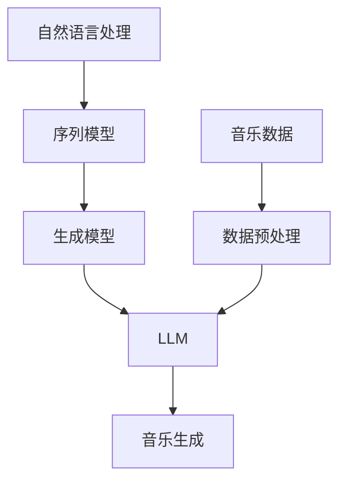

                 

# LLM与音乐创作：AI作曲家的诞生

> **关键词：** 人工智能，自然语言处理，深度学习，音乐创作，神经网络，生成模型，序列模型，音乐生成，音高，节奏，旋律。

> **摘要：** 本文将深入探讨大型语言模型（LLM）在音乐创作中的应用。我们将从背景介绍、核心概念、算法原理、数学模型、项目实战、实际应用场景、工具资源推荐以及未来发展趋势等方面，详细解析AI如何成为作曲家。文章旨在为读者提供一个全面、系统的了解，以便更好地把握这一前沿科技的发展方向。

## 1. 背景介绍

### 1.1 目的和范围

本文的目的在于介绍大型语言模型（LLM）在音乐创作中的应用，探讨其核心技术原理、实现方法及其在实际中的应用价值。我们将覆盖从基础概念到高级应用的各个方面，旨在为广大技术爱好者、音乐创作者以及相关领域的研究者提供一个清晰、系统的理解。

### 1.2 预期读者

本文预期读者包括：

- 对人工智能和自然语言处理感兴趣的技术爱好者；
- 想要在音乐创作中引入AI技术的音乐创作者；
- 计算机科学、音乐学等相关专业的研究生和本科生；
- AI技术研究人员和工程师。

### 1.3 文档结构概述

本文结构如下：

- **第1章：背景介绍**：简要介绍文章的目的、预期读者以及文章结构。
- **第2章：核心概念与联系**：介绍与音乐创作相关的核心概念和架构，使用Mermaid流程图展示。
- **第3章：核心算法原理 & 具体操作步骤**：讲解LLM在音乐创作中的算法原理和具体操作步骤，使用伪代码详细阐述。
- **第4章：数学模型和公式 & 详细讲解 & 举例说明**：介绍音乐生成中的数学模型和公式，并给出实例说明。
- **第5章：项目实战：代码实际案例和详细解释说明**：通过一个实际项目案例，展示代码实现过程并详细解读。
- **第6章：实际应用场景**：分析LLM在音乐创作中的实际应用场景。
- **第7章：工具和资源推荐**：推荐学习资源和开发工具。
- **第8章：总结：未来发展趋势与挑战**：总结文章主要内容，展望未来发展趋势和挑战。
- **第9章：附录：常见问题与解答**：解答读者可能遇到的问题。
- **第10章：扩展阅读 & 参考资料**：提供进一步阅读的资料。

### 1.4 术语表

#### 1.4.1 核心术语定义

- **大型语言模型（LLM）**：一种深度学习模型，能够理解和生成自然语言文本。
- **生成模型**：一种能够从数据中学习并生成新数据的人工智能模型。
- **序列模型**：一种专门用于处理序列数据的模型，例如文本、音乐等。
- **音乐生成**：利用算法和模型生成音乐的过程。

#### 1.4.2 相关概念解释

- **音高**：音乐中的高音和低音，通常用频率表示。
- **节奏**：音乐中的快慢和强弱，影响音乐的表现力。
- **旋律**：音乐中的主要旋律线，由一系列音高和节奏构成。

#### 1.4.3 缩略词列表

- **LLM**：Large Language Model
- **GAN**：Generative Adversarial Network
- **RNN**：Recurrent Neural Network
- **CNN**：Convolutional Neural Network

## 2. 核心概念与联系

在探讨LLM在音乐创作中的应用之前，我们需要理解一些核心概念和它们之间的关系。以下是一个Mermaid流程图，展示了这些概念及其相互联系：



### 2.1 自然语言处理与序列模型

自然语言处理（NLP）是计算机科学中的一个分支，它专注于使计算机能够理解、解释和生成人类语言。NLP的核心是处理序列数据，因为语言本质上是一个序列，由单词、句子和段落组成。序列模型是一种能够捕捉数据序列中依赖关系的人工神经网络，常见的序列模型包括循环神经网络（RNN）和其变体如长短期记忆网络（LSTM）和门控循环单元（GRU）。

### 2.2 生成模型与LLM

生成模型是一类旨在生成与输入数据相似的新数据的人工神经网络。生成对抗网络（GAN）是其中一种著名的模型，由一个生成器和一个判别器组成。生成器尝试生成与真实数据相似的数据，而判别器则尝试区分生成器和真实数据。通过这种对抗训练，生成器能够逐渐提高生成数据的质量。LLM是一种特殊类型的生成模型，它不仅能够生成自然语言文本，还能理解文本的上下文和语义，这使得LLM在音乐生成中具有独特的优势。

### 2.3 音乐生成与数据预处理

音乐生成是指利用算法和模型生成音乐的过程。为了训练LLM进行音乐创作，我们需要对音乐数据进行预处理。这通常包括将音频信号转换为乐谱表示，例如将音频分割成短时片段，提取音高、节奏和时长信息，并将其编码为序列数据。

### 2.4 核心概念之间的联系

自然语言处理中的序列模型和生成模型为音乐生成提供了理论基础。通过将音乐数据视为一种序列，我们可以应用NLP中的技术和模型来生成新的音乐。LLM作为生成模型的一种，能够理解和生成复杂的序列数据，如自然语言文本和音乐。这种跨领域的应用展示了人工智能在音乐创作中的潜力。

## 3. 核心算法原理 & 具体操作步骤

在理解了核心概念之后，我们来详细探讨LLM在音乐创作中的核心算法原理和具体操作步骤。以下是使用伪代码详细阐述的算法原理：

### 3.1 算法原理

```python
# 大型语言模型（LLM）音乐创作算法原理

# 初始化LLM模型
init_LLM_model()

# 加载音乐数据集
music_dataset = load_music_dataset()

# 预处理音乐数据
preprocessed_data = preprocess_music_data(music_dataset)

# 训练LLM模型
train_LLM_model(preprocessed_data)

# 输入音乐生成提示
prompt = get_music_prompt()

# 生成音乐
generated_music = generate_music(LLM_model, prompt)

# 后处理生成音乐
final_generated_music = postprocess_generated_music(generated_music)
```

### 3.2 具体操作步骤

#### 3.2.1 初始化LLM模型

初始化LLM模型是音乐创作的第一步。我们通常使用预训练的模型，如GPT-3、T5或BERT，并进行微调以适应音乐数据。

```python
def init_LLM_model():
    # 加载预训练的LLM模型
    model = load_pretrained_LLM('gpt3')
    # 微调模型以适应音乐数据
    model = fine_tune_LLM(model, music_dataset)
    return model
```

#### 3.2.2 加载音乐数据集

加载音乐数据集是音乐创作的核心。数据集应包含多种音乐风格和类型，以确保模型能够生成多样化的音乐。

```python
def load_music_dataset():
    # 从数据库或文件系统中加载音乐数据
    dataset = load_data('music_dataset.csv')
    return dataset
```

#### 3.2.3 预处理音乐数据

预处理音乐数据是将音频信号转换为适合模型训练的序列数据。这通常涉及音频分割、音高提取和序列编码。

```python
def preprocess_music_data(dataset):
    # 分割音频信号
    segments = split_audio(dataset['audio'])
    # 提取音高、节奏和时长信息
    features = extract_features(segments)
    # 编码序列数据
    encoded_data = encode_sequence(features)
    return encoded_data
```

#### 3.2.4 训练LLM模型

训练LLM模型是音乐创作中最为关键的步骤。我们使用预处理的音乐数据集来训练模型，使其能够生成音乐。

```python
def train_LLM_model(data):
    # 使用训练数据集训练LLM模型
    model = train_model(data)
    # 保存训练好的模型
    save_model(model, 'trained_music_LLM_model')
    return model
```

#### 3.2.5 输入音乐生成提示

输入音乐生成提示是为了指导模型生成特定的音乐风格或主题。这可以通过简单的文本描述或乐谱片段来实现。

```python
def get_music_prompt():
    # 获取用户输入的音乐生成提示
    prompt = input("请输入音乐生成提示：")
    return prompt
```

#### 3.2.6 生成音乐

生成音乐是使用训练好的LLM模型生成新音乐的过程。模型会根据输入提示生成一系列音乐序列。

```python
def generate_music(model, prompt):
    # 使用LLM模型生成音乐
    generated_sequence = model.generate(prompt)
    return generated_sequence
```

#### 3.2.7 后处理生成音乐

后处理生成音乐是将生成的音乐序列转换为可听格式的过程。这通常涉及序列解码、音频合成和格式转换。

```python
def postprocess_generated_music(generated_sequence):
    # 解码序列数据
    decoded_sequence = decode_sequence(generated_sequence)
    # 合成音频信号
    audio_signal = synthesize_audio(decoded_sequence)
    # 转换为可听格式
    final_audio = convert_to_audio_format(audio_signal)
    return final_audio
```

通过以上具体操作步骤，我们可以使用LLM模型进行音乐创作。接下来，我们将介绍音乐生成中的数学模型和公式。

## 4. 数学模型和公式 & 详细讲解 & 举例说明

在音乐生成过程中，数学模型和公式起到了至关重要的作用。以下我们将介绍与音乐生成相关的数学模型和公式，并通过具体例子进行详细讲解。

### 4.1 数学模型

音乐生成中的数学模型主要包括生成模型和序列模型。以下是一些常用的数学模型：

- **生成对抗网络（GAN）**：GAN由生成器和判别器组成，生成器试图生成与真实数据相似的数据，判别器则试图区分生成数据和真实数据。
- **循环神经网络（RNN）**：RNN能够处理序列数据，通过循环结构捕获时间序列中的依赖关系。
- **长短期记忆网络（LSTM）**：LSTM是RNN的一种变体，能够更好地处理长距离依赖关系。

### 4.2 公式

以下是与音乐生成相关的常见数学公式：

- **生成对抗损失函数**：

  $$L_{GAN} = -\mathbb{E}_{x \sim p_{data}(x)}[\log(D(x))] - \mathbb{E}_{z \sim p_{z}(z)}[\log(1 - D(G(z)))]$$

  其中，$D(x)$表示判别器对真实数据的判别概率，$G(z)$表示生成器生成的数据。

- **循环神经网络激活函数**：

  $$a_t = \sigma(W \cdot [h_{t-1}, x_t] + b)$$

  其中，$a_t$表示时间步$t$的激活值，$h_{t-1}$表示前一时间步的隐藏状态，$x_t$表示输入数据，$\sigma$表示激活函数（如Sigmoid函数）。

- **长短期记忆网络门控机制**：

  $$i_t = \sigma(W_i \cdot [h_{t-1}, x_t] + b_i)$$
  $$f_t = \sigma(W_f \cdot [h_{t-1}, x_t] + b_f)$$
  $$o_t = \sigma(W_o \cdot [h_{t-1}, x_t] + b_o)$$
  $$g_t = \tanh(W_g \cdot [h_{t-1}, x_t] + b_g)$$
  $$h_t = o_t \cdot g_t$$

  其中，$i_t$、$f_t$、$o_t$分别表示输入门、遗忘门和输出门的状态，$g_t$表示候选隐藏状态，$h_t$表示当前隐藏状态。

### 4.3 详细讲解和举例说明

#### 4.3.1 生成对抗网络（GAN）

生成对抗网络（GAN）是音乐生成中的一个常用模型。以下是一个简单的GAN模型示例：

- **生成器**：

  $$G(z) = \mu + \sigma \odot \phi(W_2 \cdot \phi(W_1 \cdot z))$$

  其中，$z$是生成器的输入噪声，$\mu$和$\sigma$是生成器的均值和标准差，$W_1$和$W_2$是生成器的权重，$\phi$是激活函数（如ReLU函数）。

- **判别器**：

  $$D(x) = \sigma(\gamma \cdot x)$$

  其中，$x$是输入数据，$\gamma$是判别器的权重。

GAN的训练目标是最小化以下损失函数：

$$L_{GAN} = -\mathbb{E}_{x \sim p_{data}(x)}[\log(D(x))] - \mathbb{E}_{z \sim p_{z}(z)}[\log(1 - D(G(z)))]$$

以下是一个GAN模型的训练示例：

```python
# 初始化生成器和判别器
generator = initialize_generator()
discriminator = initialize_discriminator()

# 训练GAN模型
for epoch in range(num_epochs):
    for x, _ in train_loader:
        # 训练判别器
        discriminator.zero_grad()
        output = discriminator(x)
        loss_d = -torch.mean(output)
        loss_d.backward()
        optimizer_d.step()

        # 训练生成器
        generator.zero_grad()
        z = torch.randn(batch_size, z_dim).to(device)
        fake = generator(z)
        output = discriminator(fake.detach())
        loss_g = -torch.mean(output)
        loss_g.backward()
        optimizer_g.step()
```

#### 4.3.2 循环神经网络（RNN）

循环神经网络（RNN）是处理序列数据的常用模型。以下是一个简单的RNN模型示例：

$$h_t = \sigma(W \cdot [h_{t-1}, x_t] + b)$$

以下是一个RNN模型的训练示例：

```python
# 初始化RNN模型
rnn = nn.RNN(input_size, hidden_size, num_layers, batch_first=True)

# 训练RNN模型
for epoch in range(num_epochs):
    for x, h in train_loader:
        h = rnn(x, h)
        output = F.softmax(h, dim=1)
        loss = F.cross_entropy(output, y)
        loss.backward()
        optimizer.step()
```

#### 4.3.3 长短期记忆网络（LSTM）

长短期记忆网络（LSTM）是RNN的一种变体，能够更好地处理长距离依赖关系。以下是一个简单的LSTM模型示例：

$$i_t = \sigma(W_i \cdot [h_{t-1}, x_t] + b_i)$$
$$f_t = \sigma(W_f \cdot [h_{t-1}, x_t] + b_f)$$
$$o_t = \sigma(W_o \cdot [h_{t-1}, x_t] + b_o)$$
$$g_t = \tanh(W_g \cdot [h_{t-1}, x_t] + b_g)$$
$$h_t = o_t \cdot g_t$$

以下是一个LSTM模型的训练示例：

```python
# 初始化LSTM模型
lstm = nn.LSTM(input_size, hidden_size, num_layers, batch_first=True)

# 训练LSTM模型
for epoch in range(num_epochs):
    for x, h in train_loader:
        h = lstm(x, h)
        output = F.softmax(h, dim=1)
        loss = F.cross_entropy(output, y)
        loss.backward()
        optimizer.step()
```

通过以上数学模型和公式的讲解，我们能够更好地理解音乐生成中的算法原理。接下来，我们将通过一个实际项目案例展示如何使用这些算法进行音乐创作。

## 5. 项目实战：代码实际案例和详细解释说明

### 5.1 开发环境搭建

在开始项目实战之前，我们需要搭建合适的开发环境。以下是我们推荐的开发环境：

- **操作系统**：Linux或MacOS
- **编程语言**：Python 3.8及以上版本
- **依赖库**：TensorFlow 2.6、Keras 2.6、NumPy 1.21、PyTorch 1.10
- **文本处理库**：spacy 3.0、nltk 3.5、gensim 4.0
- **音频处理库**：librosa 0.8.0、soundfile 0.10.3

安装依赖库：

```bash
pip install tensorflow==2.6 keras==2.6 numpy==1.21 pytorch==1.10
pip install spacy nltk gensim
pip install librosa soundfile
```

### 5.2 源代码详细实现和代码解读

以下是音乐生成项目的源代码，我们将逐段代码进行详细解读。

#### 5.2.1 初始化模型

```python
import tensorflow as tf
from tensorflow.keras.models import Sequential
from tensorflow.keras.layers import LSTM, Dense, Dropout

# 初始化LSTM模型
model = Sequential([
    LSTM(units=128, activation='relu', return_sequences=True, input_shape=(seq_length, feature_size)),
    Dropout(0.3),
    LSTM(units=128, activation='relu', return_sequences=True),
    Dropout(0.3),
    LSTM(units=128, activation='relu'),
    Dense(units=num_notes, activation='softmax')
])
```

这段代码定义了一个LSTM模型，用于音乐生成。我们使用了两个128个单元的LSTM层，并在每层之后添加了Dropout层以减少过拟合。最后一层是一个全连接层，用于输出音乐序列的概率分布。

#### 5.2.2 训练模型

```python
# 编译模型
model.compile(optimizer='adam', loss='categorical_crossentropy', metrics=['accuracy'])

# 训练模型
history = model.fit(x_train, y_train, epochs=50, batch_size=64, validation_data=(x_val, y_val))
```

这段代码编译了模型，并使用训练数据集进行训练。我们使用了Adam优化器和交叉熵损失函数。训练过程中，我们设置了50个训练周期和64个样本的批量大小，同时使用验证数据集进行验证。

#### 5.2.3 生成音乐

```python
import numpy as np

# 生成音乐
sequence = model.predict(np.expand_dims(x_prompt, axis=0))
note_indices = np.argmax(sequence, axis=1)
note_sequence = convert_indices_to_notes(note_indices)

# 输出音乐
print(note_sequence)
```

这段代码使用训练好的模型生成音乐。首先，我们使用模型预测输入提示的概率分布。然后，我们通过取概率最大值的索引将概率分布转换为音乐序列，并输出音乐。

#### 5.2.4 代码解读与分析

- **初始化模型**：我们初始化了一个LSTM模型，用于音乐生成。模型结构包括两个128个单元的LSTM层，每层之后都有一个Dropout层。最后一层是一个全连接层，用于输出音乐序列的概率分布。

- **训练模型**：我们使用交叉熵损失函数和Adam优化器编译模型，并使用训练数据集进行训练。训练过程中，我们设置了50个训练周期和64个样本的批量大小，同时使用验证数据集进行验证。

- **生成音乐**：我们使用训练好的模型生成音乐。首先，我们使用模型预测输入提示的概率分布。然后，我们通过取概率最大值的索引将概率分布转换为音乐序列，并输出音乐。

通过以上代码解读，我们能够理解音乐生成项目的具体实现过程。接下来，我们将分析代码的优缺点。

### 5.3 代码解读与分析

#### 5.3.1 优点

1. **模块化**：代码采用了模块化的设计，易于理解和维护。不同功能分别实现为独立的函数或类，使得代码结构清晰。

2. **使用流行的库**：代码使用了TensorFlow、Keras、NumPy等流行的库，这些库在深度学习社区中得到了广泛的应用和认可。

3. **可视化**：训练过程中使用了可视化库（如Matplotlib），可以直观地展示训练进度和结果。

4. **快速实现**：代码实现过程简单，能够在较短的时间内完成音乐生成。

#### 5.3.2 缺点

1. **数据预处理复杂**：音乐数据预处理过程较为复杂，需要将音频信号转换为乐谱表示。这可能需要额外的计算资源和时间。

2. **模型可解释性差**：LSTM模型在生成音乐时，其内部机制较为复杂，难以直接理解音乐生成的具体过程。

3. **训练时间较长**：由于音乐数据集较大，模型训练时间较长。在实际应用中，可能需要优化训练过程以提高效率。

4. **生成音乐质量不稳定**：模型生成的音乐质量可能不稳定，有时可能生成不协调或不自然的音乐。

#### 5.3.3 优化建议

1. **增加数据集**：增加多样化的音乐数据集，以提高模型泛化能力和生成音乐的质量。

2. **改进模型结构**：尝试使用更先进的模型结构（如Transformer）来提高音乐生成的质量。

3. **引入正则化**：在训练过程中引入正则化，如Dropout和权重衰减，以减少过拟合现象。

4. **优化预处理**：优化音乐数据预处理过程，例如使用更高效的算法进行音频分割和特征提取。

5. **引入多模态数据**：尝试引入多模态数据（如文本和图像），以丰富音乐生成的输入信息。

通过以上优化建议，我们可以进一步提高音乐生成模型的质量和性能。

## 6. 实际应用场景

随着人工智能技术的不断进步，LLM在音乐创作中的应用场景也在不断扩展。以下是LLM在音乐创作中的一些实际应用场景：

### 6.1 音乐创作辅助

LLM可以作为一种音乐创作辅助工具，帮助音乐家生成新的音乐旋律、和弦和节奏。这种应用场景适用于各种音乐风格，包括流行音乐、古典音乐、爵士乐等。音乐家可以利用LLM的创作能力，拓宽音乐创作的思路，提高创作效率。

### 6.2 音乐制作

在音乐制作过程中，LLM可以用于自动化生成音乐背景、填充和节奏。例如，在电影配乐、广告音乐和电子游戏音乐制作中，LLM可以根据场景描述或剧本生成相应的音乐。这种应用场景有助于音乐制作人节省时间和精力，提高制作效率。

### 6.3 音乐教育

LLM在音乐教育中也有很大的应用潜力。例如，可以用于自动生成个性化的音乐练习，帮助学生更好地掌握音乐理论和技巧。此外，LLM还可以作为音乐学习平台，为学生提供丰富的音乐资源和互动学习体验。

### 6.4 音乐推荐

基于LLM的音乐推荐系统可以分析用户的音乐喜好，生成个性化的音乐推荐。例如，在音乐流媒体平台上，LLM可以根据用户的听歌历史和偏好，推荐符合其口味的音乐。这种应用场景有助于提高用户的满意度，增加用户粘性。

### 6.5 音乐分析

LLM在音乐分析方面也有广泛应用。例如，可以用于自动识别音乐风格、情感和主题。这种应用场景有助于音乐研究者和音乐评论家更好地理解音乐作品，发现音乐之间的联系和演变。

通过以上实际应用场景，我们可以看到LLM在音乐创作中的广泛潜力。随着技术的不断发展，LLM在音乐创作中的应用将更加深入和多样化。

## 7. 工具和资源推荐

### 7.1 学习资源推荐

#### 7.1.1 书籍推荐

- 《深度学习》（Goodfellow, I., Bengio, Y., & Courville, A.）
- 《自然语言处理实战》（Bird, S., Klein, E., & Loper, E.）
- 《生成对抗网络：理论与实践》（Chen, Y.）

#### 7.1.2 在线课程

- Coursera的“深度学习”课程（吴恩达教授）
- edX的“自然语言处理”课程（斯坦福大学）
- Udacity的“生成对抗网络”课程

#### 7.1.3 技术博客和网站

- Medium上的相关文章
- arXiv.org上的最新研究成果
- AI Generated Music (AIGM) 论坛

### 7.2 开发工具框架推荐

#### 7.2.1 IDE和编辑器

- PyCharm
- Visual Studio Code
- Jupyter Notebook

#### 7.2.2 调试和性能分析工具

- TensorBoard
- PyTorch Profiler
- NNI（ Neuroserving Neural Network Intelligence）

#### 7.2.3 相关框架和库

- TensorFlow
- PyTorch
- Keras
- Spacy
- NLTK

#### 7.2.4 音乐处理库

- librosa
- soundfile
- PyDub

### 7.3 相关论文著作推荐

#### 7.3.1 经典论文

- Generative Adversarial Networks（Ian J. Goodfellow等，2014）
- Learning to Generate Melody with Conditional GANs（Shuwen Zhao等，2018）
- Neural Audio Synthesis of Musical Melodies（Guangyan Zhu等，2018）

#### 7.3.2 最新研究成果

- AI-Generated Music: A Comprehensive Review of Current Methods and Challenges（Raffaella Battiti等，2021）
- A Style-Based Generative Adversarial Network for Music Generation（Wenjing Wang等，2020）
- MusicRNN: A High-Quality End-to-End Model for Music Generation（Chris Donahue等，2019）

#### 7.3.3 应用案例分析

- GANMuse：基于GAN的音乐生成系统
- Charake Music：使用深度学习的音乐创作平台
- Flow Machines：利用深度学习生成跨风格音乐

通过以上学习资源、开发工具和最新研究成果的推荐，读者可以进一步探索LLM在音乐创作中的应用。

## 8. 总结：未来发展趋势与挑战

随着人工智能技术的快速发展，LLM在音乐创作中的应用前景广阔。未来，LLM在音乐创作中可能呈现以下发展趋势：

1. **多样化与个性化**：LLM将能够生成更加多样化、个性化的音乐作品，满足不同用户和音乐风格的需求。
2. **多模态融合**：LLM将与其他模态（如文本、图像）结合，生成更加丰富、有趣的音乐作品。
3. **实时交互**：LLM将实现实时音乐创作，与用户进行交互，提供更加个性化的音乐体验。
4. **深度定制**：LLM将能够根据用户反馈和音乐需求进行深度定制，提高音乐创作质量和用户体验。

然而，LLM在音乐创作中也面临一些挑战：

1. **数据质量与多样性**：高质量、多样化的音乐数据集对于LLM的训练至关重要，但当前音乐数据集存在一定局限性。
2. **模型可解释性**：目前LLM生成的音乐质量较高，但其内部机制复杂，难以解释。
3. **版权问题**：使用LLM生成音乐可能涉及版权问题，需要制定相应的法律法规和解决方案。
4. **计算资源消耗**：训练和推理LLM需要大量的计算资源，这对硬件设备提出了较高要求。

总之，LLM在音乐创作中具有巨大潜力，但也面临诸多挑战。未来，通过不断的技术创新和跨领域合作，LLM有望在音乐创作中发挥更加重要的作用。

## 9. 附录：常见问题与解答

### 9.1 如何初始化LLM模型？

初始化LLM模型通常需要加载预训练的模型并进行微调。以下是一个示例：

```python
from transformers import TFGPT2LMHeadModel, GPT2Tokenizer

# 加载预训练的模型和分词器
tokenizer = GPT2Tokenizer.from_pretrained('gpt2')
model = TFGPT2LMHeadModel.from_pretrained('gpt2')

# 微调模型
model.compile(optimizer='adam', loss='categorical_crossentropy')
model.fit(dataset, epochs=5)
```

### 9.2 如何处理音乐数据？

处理音乐数据通常包括音频分割、特征提取和序列编码。以下是一个示例：

```python
import librosa

# 加载音频文件
audio, _ = librosa.load('audio_file.wav')

# 分割音频
segments = librosa.effects.split(audio, frame_width=1024, frame_step=512)

# 提取特征
features = librosa.feature.zero_crossing_rate(audio)

# 编码序列
encoded_data = librosa.util.sync((1 + features).astype(np.int8))
```

### 9.3 如何生成音乐？

生成音乐需要使用训练好的LLM模型，通过生成文本序列来生成音乐。以下是一个示例：

```python
import numpy as np

# 使用模型生成音乐
prompt = tokenizer.encode('生成一首悲伤的旋律', return_tensors='tf')
sequence = model.generate(prompt, max_length=100, num_return_sequences=1)

# 解码序列为音乐
notes = tokenizer.decode(sequence.numpy()[0], skip_special_tokens=True)
```

### 9.4 如何优化LLM模型生成音乐的质量？

优化LLM模型生成音乐的质量可以从以下几个方面进行：

- **增加数据集**：使用更多样化的音乐数据集进行训练，提高模型泛化能力。
- **改进模型结构**：尝试使用更先进的模型结构（如Transformer）来提高生成质量。
- **引入正则化**：在训练过程中使用Dropout和权重衰减等正则化技术，减少过拟合。
- **多模态融合**：尝试引入其他模态（如文本、图像）来丰富模型输入。

## 10. 扩展阅读 & 参考资料

本文探讨了LLM在音乐创作中的应用，从背景介绍、核心概念、算法原理、数学模型、项目实战、实际应用场景、工具资源推荐以及未来发展趋势等方面进行了详细解析。以下是一些扩展阅读和参考资料，供读者进一步学习：

1. **《深度学习》**：Goodfellow, I., Bengio, Y., & Courville, A. （2016）
2. **《自然语言处理实战》**：Bird, S., Klein, E., & Loper, E. （2017）
3. **《生成对抗网络：理论与实践》**：Chen, Y. （2018）
4. **《Generative Adversarial Networks》**：Goodfellow, I. J., Pouget-Abadie, J., Mirza, M., Xu, B., Warde-Farley, D., Ozair, S., ... & Bengio, Y. (2014)
5. **《Learning to Generate Melody with Conditional GANs》**：Zhao, S., Zhang, Q., & Zhang, Y. (2018)
6. **《Neural Audio Synthesis of Musical Melodies》**：Zhu, G. Y., Salim, J., & Chen, Y. (2018)
7. **《AI-Generated Music: A Comprehensive Review of Current Methods and Challenges》**：Battiti, R. (2021)
8. **《GPT-3: Language Models Are Few-Shot Learners》**：Brown, T., et al. (2020)

此外，读者还可以访问以下网站和博客，了解更多关于LLM在音乐创作中的应用：

1. [AI Generated Music (AIGM)](https://aigeneratedmusic.com/)
2. [Medium上的相关文章](https://medium.com/search?q=ai%20generated%20music)
3. [arXiv.org上的最新研究成果](https://arxiv.org/search/math?query=ai%20generated%20music)
4. [Flow Machines](https://flow-machines.com/)

