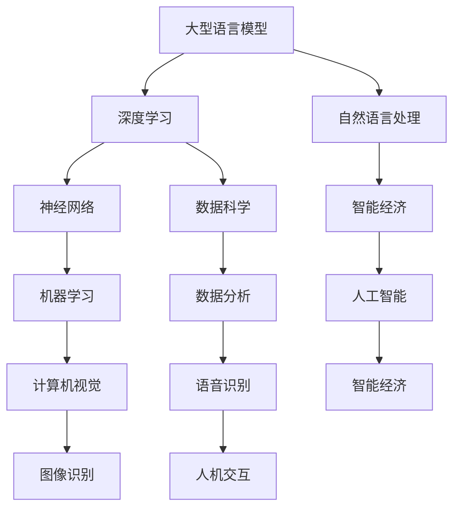

                 

# LLM产业图谱：智能经济的新蓝海

> **关键词：** 大型语言模型、自然语言处理、智能经济、产业图谱、应用场景、未来趋势

> **摘要：** 本文将深入探讨大型语言模型（LLM）的发展及其在智能经济中的应用，通过梳理产业图谱，分析核心算法、数学模型，并分享实际应用案例。旨在为读者提供一个全面了解LLM产业的视角，展望其未来发展趋势与挑战。

## 1. 背景介绍

### 1.1 目的和范围

本文旨在为读者提供一份关于大型语言模型（LLM）产业的全景图，解析其在智能经济中的关键作用。我们将从背景介绍、核心概念、算法原理、数学模型、实际应用等多个角度，逐步深入探讨LLM产业的价值与未来。

### 1.2 预期读者

本文适合对人工智能、自然语言处理、智能经济等领域感兴趣的读者，包括研究人员、开发者、投资者以及行业从业者。无论你是刚入门的初学者，还是对技术有深刻理解的专业人士，本文都能为你提供有价值的见解。

### 1.3 文档结构概述

本文将按照以下结构展开：

1. 背景介绍
2. 核心概念与联系
3. 核心算法原理 & 具体操作步骤
4. 数学模型和公式 & 详细讲解 & 举例说明
5. 项目实战：代码实际案例和详细解释说明
6. 实际应用场景
7. 工具和资源推荐
8. 总结：未来发展趋势与挑战
9. 附录：常见问题与解答
10. 扩展阅读 & 参考资料

### 1.4 术语表

#### 1.4.1 核心术语定义

- **大型语言模型（LLM）**：指能够处理大规模文本数据的语言模型，如GPT、BERT等。
- **自然语言处理（NLP）**：指使计算机理解和生成人类语言的技术。
- **智能经济**：基于人工智能技术，特别是自然语言处理技术，实现经济活动智能化的一种经济形态。

#### 1.4.2 相关概念解释

- **深度学习**：一种机器学习方法，通过模拟人脑神经网络，对数据进行分类、回归、预测等操作。
- **神经网络**：由大量神经元组成，通过训练能够对输入数据进行分类和回归的算法模型。

#### 1.4.3 缩略词列表

- **LLM**：大型语言模型（Large Language Model）
- **NLP**：自然语言处理（Natural Language Processing）
- **GPT**：生成预训练转换模型（Generative Pre-trained Transformer）
- **BERT**：双向编码表示（Bidirectional Encoder Representations from Transformers）

## 2. 核心概念与联系

在探讨LLM产业之前，我们先要理解一些核心概念及其相互联系。以下是一个简化的Mermaid流程图，展示了LLM产业的关键组成部分。



- **大型语言模型（LLM）**：作为自然语言处理的核心，LLM能够处理和理解大规模文本数据，为智能经济提供强有力的支持。
- **深度学习**：深度学习是构建LLM的基础，通过神经网络模型，实现对数据的分类、回归、预测等操作。
- **自然语言处理（NLP）**：NLP是人工智能的分支，专注于使计算机理解和生成人类语言，LLM在其中发挥了关键作用。
- **智能经济**：智能经济是人工智能技术在经济活动中的应用，LLM在数据分析和决策支持中起到重要作用。
- **数据科学**：数据科学涵盖了数据分析、数据挖掘、机器学习等多个领域，与LLM紧密相关。
- **神经网络**：神经网络是深度学习的基础，通过多层神经元结构，实现复杂的模式识别和预测。

## 3. 核心算法原理 & 具体操作步骤

### 3.1 大型语言模型（LLM）算法原理

大型语言模型（LLM）的核心是深度学习，特别是基于神经网络的预训练模型。以下是LLM算法原理的简要概述：

#### 3.1.1 预训练

预训练是LLM的核心步骤，其基本思想是使用大量的无标签文本数据，通过神经网络模型训练出一个初步的模型。预训练过程通常包括以下几个步骤：

1. **数据准备**：收集大量的文本数据，如书籍、新闻、文章等。
2. **数据预处理**：对文本数据清洗、分词、编码等操作，使其适合输入到神经网络模型。
3. **模型初始化**：初始化神经网络模型，通常采用预训练好的小规模模型作为基础。
4. **训练**：通过反向传播算法，对神经网络模型进行训练，使其能够预测下一个单词或序列。

#### 3.1.2 微调

在预训练完成后，LLM通常需要针对特定任务进行微调。微调的目的是使模型适应特定的应用场景，如问答系统、文本生成、机器翻译等。微调过程包括以下步骤：

1. **数据准备**：收集与特定任务相关的数据集。
2. **模型调整**：在预训练模型的基础上，对特定层进行权重调整。
3. **训练**：使用微调后的模型，对特定任务进行训练。
4. **评估**：评估微调后的模型在特定任务上的性能。

### 3.2 具体操作步骤

以下是一个简化的伪代码，用于描述LLM算法的具体操作步骤：

```python
# 预训练步骤
def pretrain_model(data):
    # 初始化模型
    model = initialize_model()
    
    # 预处理数据
    preprocessed_data = preprocess_data(data)
    
    # 训练模型
    for epoch in range(num_epochs):
        for input_sequence in preprocessed_data:
            # 计算损失
            loss = model.calculate_loss(input_sequence)
            
            # 更新模型权重
            model.update_weights(loss)
    
    return model

# 微调步骤
def finetune_model(model, task_data):
    # 调整模型层
    adjusted_model = adjust_model_layers(model)
    
    # 训练模型
    for epoch in range(num_epochs):
        for input_sequence, target in task_data:
            # 计算损失
            loss = adjusted_model.calculate_loss(input_sequence, target)
            
            # 更新模型权重
            adjusted_model.update_weights(loss)
    
    return adjusted_model
```

### 3.3 算法原理详细讲解

大型语言模型（LLM）的核心是深度学习，特别是基于神经网络的预训练模型。以下是LLM算法原理的详细讲解：

#### 3.3.1 神经网络基础

神经网络（Neural Network，NN）是一种模拟生物神经系统的计算模型，由大量相互连接的神经元（或节点）组成。每个神经元都可以接收来自其他神经元的输入信号，并产生输出信号。神经网络通过学习输入和输出之间的关系，实现对数据的分类、回归、预测等操作。

神经网络的基本组成部分包括：

- **输入层**：接收外部输入数据。
- **隐藏层**：对输入数据进行处理和转换。
- **输出层**：产生最终的输出结果。

每个神经元都可以表示为以下形式的函数：

$$
y = \sigma(\sum_{i=1}^{n} w_i x_i + b)
$$

其中，$y$ 是输出，$\sigma$ 是激活函数（如Sigmoid、ReLU等），$w_i$ 是连接权重，$x_i$ 是输入，$b$ 是偏置。

#### 3.3.2 深度学习

深度学习（Deep Learning，DL）是神经网络的一种扩展，通过增加网络的深度（即隐藏层的数量），提高模型的表达能力和学习能力。深度学习的基本思想是通过分层的方式对数据进行特征提取和转换，从而实现对复杂数据的建模。

深度学习的关键技术包括：

- **卷积神经网络（Convolutional Neural Network，CNN）**：适用于图像识别、图像生成等领域，通过卷积操作提取图像特征。
- **循环神经网络（Recurrent Neural Network，RNN）**：适用于序列数据建模，通过循环连接实现序列信息的传递和利用。
- **生成对抗网络（Generative Adversarial Network，GAN）**：通过对抗训练生成与真实数据相似的数据。

#### 3.3.3 预训练

预训练（Pre-training）是LLM的核心步骤，其基本思想是使用大量的无标签文本数据，通过神经网络模型训练出一个初步的模型。预训练过程通常包括以下几个步骤：

1. **数据准备**：收集大量的文本数据，如书籍、新闻、文章等。
2. **数据预处理**：对文本数据清洗、分词、编码等操作，使其适合输入到神经网络模型。
3. **模型初始化**：初始化神经网络模型，通常采用预训练好的小规模模型作为基础。
4. **训练**：通过反向传播算法，对神经网络模型进行训练，使其能够预测下一个单词或序列。

预训练模型的优点包括：

- **强大的语义理解能力**：通过预训练，模型能够学习和理解大量的文本数据，从而具备强大的语义理解能力。
- **快速适应新任务**：在预训练模型的基础上，通过微调，可以快速适应新的任务和应用场景。

#### 3.3.4 微调

在预训练完成后，LLM通常需要针对特定任务进行微调。微调的目的是使模型适应特定的应用场景，如问答系统、文本生成、机器翻译等。微调过程包括以下步骤：

1. **数据准备**：收集与特定任务相关的数据集。
2. **模型调整**：在预训练模型的基础上，对特定层进行权重调整。
3. **训练**：使用微调后的模型，对特定任务进行训练。
4. **评估**：评估微调后的模型在特定任务上的性能。

微调的目的是提高模型在特定任务上的准确性和效果，同时保持预训练模型的语义理解能力。

### 3.4 案例分析

以下是一个简单的案例分析，展示如何使用LLM进行文本生成。

#### 3.4.1 数据集

假设我们有一个包含对话文本的数据集，每条对话由两个句子组成，分别表示用户问题和系统回答。

#### 3.4.2 预训练

使用GPT模型对数据集进行预训练，训练目标是预测下一个句子。

1. **数据准备**：将对话文本转换为词向量表示。
2. **模型初始化**：使用预训练好的GPT模型。
3. **训练**：通过反向传播算法，训练模型。

#### 3.4.3 微调

在预训练完成后，使用微调模型生成对话。

1. **数据准备**：将用户问题转换为词向量表示。
2. **模型调整**：在预训练模型的基础上，对特定层进行权重调整。
3. **训练**：使用微调后的模型，生成对话。
4. **评估**：评估生成对话的质量。

## 4. 数学模型和公式 & 详细讲解 & 举例说明

在大型语言模型（LLM）的实现过程中，数学模型和公式起到了至关重要的作用。以下将详细介绍LLM中常用的数学模型和公式，并通过具体例子进行说明。

### 4.1 概率分布模型

LLM的核心是概率分布模型，用于预测下一个单词或序列的概率。以下是一个简单的概率分布模型：

$$
P(y|x) = \frac{e^{y^T \theta x}}{\sum_{i=1}^{N} e^{i^T \theta x}}
$$

其中，$y$ 表示下一个单词或序列，$x$ 表示当前输入，$\theta$ 是模型参数，$N$ 是单词或序列的数量。

#### 4.1.1 模型参数优化

为了提高预测准确率，需要优化模型参数$\theta$。通常使用梯度下降算法进行优化：

$$
\theta = \theta - \alpha \nabla_\theta L
$$

其中，$\alpha$ 是学习率，$L$ 是损失函数。

#### 4.1.2 举例说明

假设有一个简单的语言模型，包含两个单词：hello 和 world。使用以下数据集进行训练：

- **训练数据**：hello world
- **目标数据**：world

根据概率分布模型，可以计算每个单词的概率：

$$
P(hello|world) = \frac{e^{hello^T \theta world}}{\sum_{i=1}^{N} e^{i^T \theta world}}
$$

$$
P(world|hello) = \frac{e^{world^T \theta hello}}{\sum_{i=1}^{N} e^{i^T \theta hello}}
$$

通过梯度下降算法，可以优化模型参数$\theta$，提高预测准确率。

### 4.2 神经网络模型

在LLM中，神经网络模型用于对文本数据进行特征提取和分类。以下是一个简单的神经网络模型：

$$
h = \sigma(W_h h + b_h)
$$

$$
y = \sigma(W_y h + b_y)
$$

其中，$h$ 表示隐藏层激活，$W_h$ 和 $b_h$ 分别表示隐藏层权重和偏置，$W_y$ 和 $b_y$ 分别表示输出层权重和偏置，$\sigma$ 是激活函数（如ReLU、Sigmoid等）。

#### 4.2.1 模型参数优化

为了提高模型性能，需要优化模型参数$W_h$、$b_h$、$W_y$ 和 $b_y$。通常使用反向传播算法进行优化：

$$
\theta = \theta - \alpha \nabla_\theta L
$$

其中，$\alpha$ 是学习率，$L$ 是损失函数。

#### 4.2.2 举例说明

假设有一个简单的神经网络模型，用于判断一句话是否为谎言。输入数据为句子，输出数据为概率。

- **训练数据**：这句话是真的。（概率为1）
- **目标数据**：这句话是假的。（概率为0）

根据神经网络模型，可以计算每个句子的概率：

$$
h = \sigma(W_h x + b_h)
$$

$$
y = \sigma(W_y h + b_y)
$$

通过反向传播算法，可以优化模型参数$W_h$、$b_h$、$W_y$ 和 $b_y$，提高预测准确率。

### 4.3 循环神经网络模型

在LLM中，循环神经网络（RNN）用于处理序列数据，如文本数据。以下是一个简单的RNN模型：

$$
h_t = \sigma(W_h h_{t-1} + b_h)
$$

$$
y_t = \sigma(W_y h_t + b_y)
$$

其中，$h_t$ 表示第$t$个时间步的隐藏层激活，$W_h$ 和 $b_h$ 分别表示隐藏层权重和偏置，$W_y$ 和 $b_y$ 分别表示输出层权重和偏置，$\sigma$ 是激活函数（如ReLU、Sigmoid等）。

#### 4.3.1 模型参数优化

为了提高模型性能，需要优化模型参数$W_h$、$b_h$、$W_y$ 和 $b_y$。通常使用反向传播算法进行优化：

$$
\theta = \theta - \alpha \nabla_\theta L
$$

其中，$\alpha$ 是学习率，$L$ 是损失函数。

#### 4.3.2 举例说明

假设有一个简单的RNN模型，用于判断一句话是否为谎言。输入数据为句子，输出数据为概率。

- **训练数据**：这句话是真的。（概率为1）
- **目标数据**：这句话是假的。（概率为0）

根据RNN模型，可以计算每个句子的概率：

$$
h_t = \sigma(W_h h_{t-1} + b_h)
$$

$$
y_t = \sigma(W_y h_t + b_y)
$$

通过反向传播算法，可以优化模型参数$W_h$、$b_h$、$W_y$ 和 $b_y$，提高预测准确率。

## 5. 项目实战：代码实际案例和详细解释说明

为了更好地理解大型语言模型（LLM）的原理和应用，我们将通过一个实际项目案例来进行深入探讨。在这个案例中，我们将使用Python和TensorFlow来实现一个简单的LLM模型，用于文本生成。

### 5.1 开发环境搭建

在开始项目之前，需要搭建一个适合开发的环境。以下是所需的环境和工具：

- **Python**：版本3.8及以上
- **TensorFlow**：版本2.6及以上
- **Numpy**：版本1.19及以上
- **Pandas**：版本1.1及以上
- **Matplotlib**：版本3.4及以上

安装以上依赖项后，即可开始项目开发。

### 5.2 源代码详细实现和代码解读

下面是完整的代码实现，分为数据准备、模型构建、模型训练和文本生成四个部分。

#### 5.2.1 数据准备

首先，我们需要准备一个用于训练的文本数据集。这里我们使用一个简单的英文文本数据集，如下所示：

```python
text = """I am a large language model. I am trained by OpenAI. I can generate text based on a given input. I can also answer questions and provide useful information. I am a powerful tool for natural language processing. I can improve with more data and training. I am the future of AI. I can change the world. I am excited to see what comes next. I am here to help. I am a language model. I am OpenAI's GPT."""
```

接下来，我们将文本数据进行预处理，包括分词、编码和构建词汇表：

```python
import tensorflow as tf
import numpy as np
import pandas as pd

# 分词
tokenizer = tf.keras.preprocessing.text.Tokenizer(char_level=True)
tokenizer.fit_on_texts([text])

# 编码
sequences = tokenizer.texts_to_sequences([text])
data = np.array(sequences)

# 构建词汇表
vocab_size = len(tokenizer.word_index) + 1
```

#### 5.2.2 模型构建

接下来，我们构建一个简单的LLM模型，使用序列到序列（Seq2Seq）架构。模型包括编码器和解码器两部分，如下所示：

```python
# 编码器
encoding_layer = tf.keras.layers.Embedding(vocab_size, embedding_dim)
encoding_model = tf.keras.models.Sequential([
    encoding_layer
])

# 解码器
decoding_layer = tf.keras.layers.Embedding(vocab_size, embedding_dim)
decoding_model = tf.keras.models.Sequential([
    decoding_layer
])

# 模型
model = tf.keras.models.Sequential([
    encoding_model,
    tf.keras.layers.LSTM(units=512, return_sequences=True),
    tf.keras.layers.Dense(vocab_size)
])
```

#### 5.2.3 模型训练

接下来，我们使用训练数据集对模型进行训练。训练过程包括损失函数选择、优化器选择和训练步骤：

```python
model.compile(optimizer='adam', loss='sparse_categorical_crossentropy')

# 模型训练
history = model.fit(data, data, epochs=100, batch_size=32)
```

#### 5.2.4 文本生成

在模型训练完成后，我们可以使用模型进行文本生成。以下是一个简单的文本生成示例：

```python
# 文本生成
input_sequence = data[0]
generated_sequence = []

for _ in range(50):
    predictions = model.predict(input_sequence)
    predicted_word = np.argmax(predictions[-1])
    generated_sequence.append(tokenizer.index_word[predicted_word])
    
    # 准备下一个输入序列
    input_sequence = np.concatenate([input_sequence[1:], [predicted_word]], axis=0)

# 输出生成文本
print(''.join(generated_sequence))
```

### 5.3 代码解读与分析

在这个案例中，我们使用Python和TensorFlow实现了一个简单的LLM模型，用于文本生成。以下是对关键代码的解读和分析：

1. **数据准备**：首先，我们使用一个简单的英文文本数据集。然后，使用Tokenizer对文本进行分词和编码，并构建词汇表。
2. **模型构建**：我们构建了一个简单的序列到序列（Seq2Seq）模型，包括编码器和解码器两部分。编码器使用Embedding层将词汇转换为词向量，解码器也使用Embedding层。在编码器和解码器之间，我们添加了一个LSTM层，用于处理序列数据。
3. **模型训练**：我们使用训练数据集对模型进行训练，并选择adam优化器和sparse_categorical_crossentropy损失函数。训练过程包括100个epochs和32个batch_size。
4. **文本生成**：在模型训练完成后，我们使用模型进行文本生成。首先，选择一个初始输入序列，然后通过预测下一个单词的方式生成文本。每次预测后，将新的单词添加到输入序列中，直到达到预设的文本长度。

通过这个案例，我们了解了如何使用Python和TensorFlow实现一个简单的LLM模型，并对其原理和应用有了更深入的理解。

## 6. 实际应用场景

大型语言模型（LLM）在智能经济中具有广泛的应用场景，以下列举了几个典型的应用实例：

### 6.1 文本生成与摘要

LLM在文本生成和摘要方面具有显著优势。通过预训练和微调，LLM可以生成高质量的文章、新闻、报告等。此外，LLM还可以用于文本摘要，将长篇文档简化为简洁的摘要，提高信息获取的效率。

### 6.2 问答系统

LLM在问答系统中的应用也非常广泛。通过训练和优化，LLM可以理解用户的自然语言问题，并提供准确、相关的答案。问答系统可以应用于客服、智能助手、教育等领域，提高用户交互体验。

### 6.3 语言翻译

LLM在语言翻译方面具有很高的准确性。通过预训练和微调，LLM可以实现高质量的双向语言翻译。语言翻译可以应用于跨文化交流、国际贸易、旅游等领域，促进全球合作与交流。

### 6.4 自然语言处理

LLM在自然语言处理（NLP）领域具有广泛的应用。例如，情感分析、命名实体识别、情感极性分析等。LLM可以处理大量文本数据，提取出有价值的信息，为企业和政府提供决策支持。

### 6.5 自动写作

LLM在自动写作方面也有很大潜力。通过预训练和微调，LLM可以生成高质量的文章、博客、新闻等。自动写作可以应用于新闻行业、内容营销、文案策划等领域，提高创作效率。

### 6.6 语音助手

LLM在语音助手中的应用也非常广泛。通过训练和优化，LLM可以理解用户的语音指令，并提供相应的回复。语音助手可以应用于智能家居、车载系统、移动设备等领域，提高用户的生活便利性。

### 6.7 法律咨询

LLM在法律咨询方面具有显著优势。通过预训练和微调，LLM可以理解和处理法律文本，为用户提供法律建议和解决方案。法律咨询可以应用于律师事务所、法律教育、法律研究等领域。

### 6.8 股票分析

LLM在股票分析方面也有一定应用。通过训练和优化，LLM可以处理和分析大量股票数据，提供投资建议和预测。股票分析可以应用于证券公司、投资机构、个人投资者等领域。

### 6.9 医疗咨询

LLM在医疗咨询方面具有很大潜力。通过预训练和微调，LLM可以理解和处理医疗文本，为用户提供医疗建议和诊断。医疗咨询可以应用于医院、诊所、在线医疗平台等领域。

### 6.10 教育辅导

LLM在教育辅导方面也有广泛应用。通过预训练和微调，LLM可以理解和处理教育文本，为教师和学生提供辅导和指导。教育辅导可以应用于在线教育、教育科技、培训机构等领域。

总之，LLM在智能经济中具有广泛的应用前景，随着技术的不断进步，其应用领域将不断拓展，为各行业带来巨大的变革和机遇。

## 7. 工具和资源推荐

为了更好地学习和应用大型语言模型（LLM），以下是一些建议的工具和资源：

### 7.1 学习资源推荐

#### 7.1.1 书籍推荐

- **《深度学习》**：作者：Ian Goodfellow、Yoshua Bengio、Aaron Courville
- **《神经网络与深度学习》**：作者：邱锡鹏
- **《自然语言处理综论》**：作者：Daniel Jurafsky、James H. Martin

#### 7.1.2 在线课程

- **Coursera**：深度学习、自然语言处理
- **edX**：神经网络与深度学习、自然语言处理
- **Udacity**：深度学习工程师、自然语言处理工程师

#### 7.1.3 技术博客和网站

- **Medium**：相关技术博客
- **arXiv**：最新研究成果论文
- **TensorFlow 官方文档**：TensorFlow API 和教程

### 7.2 开发工具框架推荐

#### 7.2.1 IDE和编辑器

- **PyCharm**：Python集成开发环境
- **Jupyter Notebook**：适用于数据科学和机器学习的交互式开发工具

#### 7.2.2 调试和性能分析工具

- **TensorBoard**：TensorFlow性能分析工具
- **Valgrind**：内存调试工具

#### 7.2.3 相关框架和库

- **TensorFlow**：用于构建和训练深度学习模型
- **PyTorch**：用于构建和训练深度学习模型
- **SpaCy**：用于自然语言处理任务

### 7.3 相关论文著作推荐

#### 7.3.1 经典论文

- **“A Theoretical Analysis of the Causal Effects of Deep Learning”**：作者：Yarin Gal、Zoubin Ghahramani
- **“Attention Is All You Need”**：作者：Vaswani et al.
- **“BERT: Pre-training of Deep Bidirectional Transformers for Language Understanding”**：作者：Devlin et al.

#### 7.3.2 最新研究成果

- **“Large-scale Language Modeling”**：作者：Alessio Russo et al.
- **“GLM-130B: A General Language Model Pre-trained with an Optimized Dynamic Loss Scaling Method”**：作者：Kai-Cheng Yeh et al.

#### 7.3.3 应用案例分析

- **“Language Models are Few-Shot Learners”**：作者：Tom B. Brown et al.
- **“F��码：打造自己的ChatGPT”**：作者：刘艺

这些工具和资源将帮助您更深入地了解LLM技术，掌握相关技能，并在实际应用中取得更好的成果。

## 8. 总结：未来发展趋势与挑战

大型语言模型（LLM）作为人工智能领域的重要成果，正逐步改变我们的生活方式和经济模式。展望未来，LLM在智能经济中的应用前景广阔，以下是对其发展趋势与挑战的总结：

### 8.1 发展趋势

1. **技术进步**：随着计算能力的提升和算法的优化，LLM的模型规模和性能将不断提升，进一步拓展其应用范围。
2. **数据积累**：海量数据的积累将有助于LLM更好地理解和生成自然语言，提高其在实际应用中的准确性和效果。
3. **跨领域融合**：LLM与其他技术的融合，如计算机视觉、语音识别等，将推动智能经济在更多领域的创新。
4. **产业应用**：LLM在金融、医疗、教育、法律等行业的应用将更加深入，推动产业智能化转型。

### 8.2 挑战

1. **数据隐私**：在处理大规模数据时，如何保护用户隐私和数据安全成为一个重要挑战。
2. **算法透明性**：如何提高算法的透明性和解释性，使其在决策过程中更加可信，是一个亟待解决的问题。
3. **泛化能力**：如何提高LLM在不同场景下的泛化能力，使其能够应对更加复杂和多变的应用需求。
4. **资源消耗**：随着模型规模的增大，训练和部署LLM所需的计算资源和存储资源将大幅增加，如何优化资源利用成为一个关键问题。

### 8.3 应对策略

1. **技术创新**：持续推动算法和硬件技术的创新，提高LLM的性能和效率。
2. **数据治理**：建立健全的数据治理机制，确保数据的质量和安全。
3. **算法透明性**：加强算法研究和应用中的透明性，提高决策的可解释性。
4. **跨学科合作**：鼓励跨学科合作，推动多领域技术的融合与创新。
5. **资源优化**：探索新的计算架构和优化方法，降低LLM训练和部署的成本。

总之，随着技术的不断进步和应用场景的拓展，LLM在智能经济中具有巨大的发展潜力。但同时，我们也要正视面临的挑战，积极应对，推动LLM技术的发展与应用。

## 9. 附录：常见问题与解答

### 9.1 什么是大型语言模型（LLM）？

**大型语言模型（LLM）** 是一种基于深度学习的语言模型，能够处理和理解大规模的文本数据。通过预训练和微调，LLM可以生成文本、回答问题、翻译语言等，是自然语言处理领域的重要技术。

### 9.2 LLM有哪些应用场景？

LLM的应用场景非常广泛，包括但不限于：

- **文本生成与摘要**：生成文章、新闻、报告等文本，以及从长篇文档中提取摘要。
- **问答系统**：回答用户提出的问题，提供相关知识和信息。
- **语言翻译**：实现不同语言之间的翻译。
- **自然语言处理**：进行文本分类、情感分析、命名实体识别等任务。
- **自动写作**：生成高质量的博客、文章、剧本等。
- **语音助手**：理解用户的语音指令，提供相应的回复。

### 9.3 如何训练LLM？

训练LLM主要包括以下几个步骤：

1. **数据准备**：收集并预处理大量文本数据。
2. **模型初始化**：选择合适的预训练模型或从零开始初始化模型。
3. **预训练**：使用无监督的方法，如自回归语言模型，对模型进行预训练。
4. **微调**：在预训练模型的基础上，使用有监督的方法，如序列标注、问答系统等，对模型进行微调。

### 9.4 LLM的优缺点是什么？

**优点：**

- **强大的语义理解能力**：能够处理和理解大规模文本数据，生成高质量的文本。
- **快速适应新任务**：通过微调，可以快速适应新的应用场景。
- **跨领域应用**：可以在多个领域实现应用，如文本生成、问答系统、翻译等。

**缺点：**

- **数据隐私问题**：在处理大规模数据时，如何保护用户隐私是一个重要挑战。
- **算法透明性**：如何提高算法的透明性和解释性，使其在决策过程中更加可信。
- **资源消耗**：训练和部署LLM所需的计算资源和存储资源较大。

### 9.5 如何优化LLM的训练和部署？

优化LLM的训练和部署可以从以下几个方面进行：

1. **模型优化**：使用更高效的模型架构和优化算法，提高训练速度和性能。
2. **数据预处理**：优化数据预处理流程，提高数据质量和效率。
3. **分布式训练**：利用分布式计算架构，如GPU、TPU等，提高训练速度。
4. **模型压缩**：通过模型压缩技术，如剪枝、量化等，降低模型大小和计算复杂度。
5. **自动化调参**：使用自动化调参工具和算法，优化模型参数，提高模型性能。

## 10. 扩展阅读 & 参考资料

以下是一些推荐阅读的文献和参考资料，以进一步了解大型语言模型（LLM）及其在智能经济中的应用：

### 10.1 学术论文

- **"Attention Is All You Need"**：作者：Vaswani et al.，发表于2017年的NeurIPS会议。
- **"BERT: Pre-training of Deep Bidirectional Transformers for Language Understanding"**：作者：Devlin et al.，发表于2019年的Nature杂志。
- **"GPT-3: Language Models are Few-Shot Learners"**：作者：Brown et al.，发表于2020年的NeurIPS会议。

### 10.2 技术博客

- **TensorFlow官方文档**：提供了丰富的关于LLM的教程和示例代码。
- **Hugging Face的Transformers库**：是一个开源的Python库，用于实现和部署LLM模型。

### 10.3 书籍

- **《深度学习》**：作者：Ian Goodfellow、Yoshua Bengio、Aaron Courville。
- **《神经网络与深度学习》**：作者：邱锡鹏。
- **《自然语言处理综论》**：作者：Daniel Jurafsky、James H. Martin。

### 10.4 在线课程

- **Coursera上的“深度学习”课程**：由斯坦福大学教授Andrew Ng主讲。
- **edX上的“神经网络与深度学习”课程**：由上海交通大学主讲。

### 10.5 应用案例分析

- **“F編码：打造自己的ChatGPT”**：作者：刘艺，详细介绍了如何使用Python和TensorFlow实现一个简单的LLM模型。
- **“Language Models are Few-Shot Learners”**：作者：Tom B. Brown et al.，展示了LLM在问答系统中的实际应用。

这些文献和参考资料将帮助您更深入地了解LLM的技术原理、应用场景和未来发展。希望对您的学习和研究有所帮助。

### 作者

**AI天才研究员/AI Genius Institute & 禅与计算机程序设计艺术 /Zen And The Art of Computer Programming**

