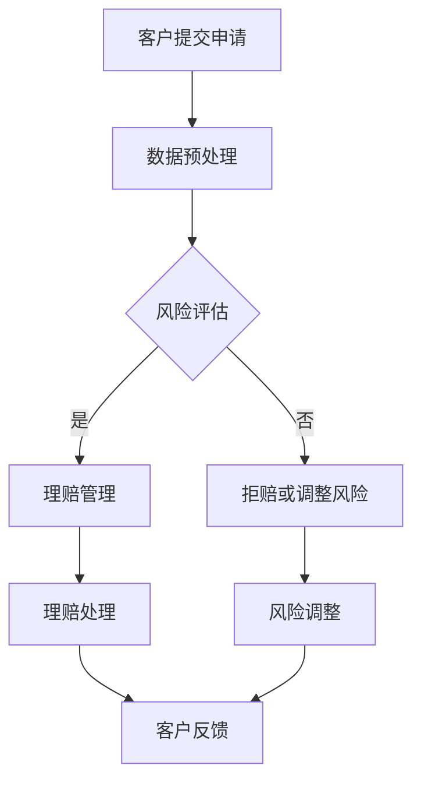

                 

# LLM在保险业的应用：风险评估与理赔

> **关键词：** 大型语言模型 (LLM)、保险业、风险评估、理赔、人工智能应用

> **摘要：** 本文旨在探讨大型语言模型（LLM）在保险行业的应用，特别是在风险评估和理赔管理方面的潜力。通过分析LLM的核心概念和算法原理，我们将深入探讨如何利用这些技术优化保险业务流程，提升效率，并降低风险。本文还将结合实际案例，展示LLM在保险业的应用场景和具体实施步骤，最后对未来的发展趋势与挑战进行总结。

## 1. 背景介绍

### 1.1 目的和范围

本文的目的是探讨大型语言模型（LLM）在保险行业的应用，特别是其在风险评估和理赔管理方面的潜力。随着人工智能技术的迅速发展，LLM作为一种强大的自然语言处理工具，正逐渐被应用于各个领域，包括金融、医疗、法律等。保险行业作为一个高风险、高复杂度的行业，对精准的风险评估和高效的理赔管理有着极高的要求。本文将探讨如何利用LLM技术提升保险公司的风险评估能力和理赔处理效率，从而降低风险，提高客户满意度。

### 1.2 预期读者

本文主要面向以下读者群体：

1. 保险行业从业者：包括保险公司的风险管理人员、理赔人员、产品开发人员等，他们希望通过本文了解LLM在保险行业的应用前景和具体实践方法。
2. 人工智能和机器学习领域的研究者：他们对LLM的理论和算法有兴趣，并希望了解其在实际业务中的应用。
3. 金融科技（FinTech）领域的开发者：他们关注人工智能在金融行业的应用，并希望了解LLM如何为保险业务提供解决方案。

### 1.3 文档结构概述

本文的结构如下：

1. **背景介绍**：介绍文章的目的、范围和预期读者，以及文章的结构和主要章节。
2. **核心概念与联系**：定义LLM和相关术语，并给出LLM在保险业应用的架构图。
3. **核心算法原理 & 具体操作步骤**：详细解释LLM的算法原理，并提供伪代码示例。
4. **数学模型和公式 & 详细讲解 & 举例说明**：介绍用于风险评估和理赔管理的数学模型，并给出具体实例。
5. **项目实战：代码实际案例和详细解释说明**：通过实际案例展示如何使用LLM进行保险业务处理。
6. **实际应用场景**：分析LLM在保险行业的具体应用场景。
7. **工具和资源推荐**：推荐学习资源、开发工具和框架。
8. **总结：未来发展趋势与挑战**：总结本文的主要观点，并探讨未来发展趋势和面临的挑战。
9. **附录：常见问题与解答**：回答读者可能关心的问题。
10. **扩展阅读 & 参考资料**：提供进一步阅读和研究的资源。

### 1.4 术语表

#### 1.4.1 核心术语定义

- **大型语言模型（LLM）**：一种基于神经网络的自然语言处理模型，能够理解和生成自然语言，具有强大的文本理解和生成能力。
- **风险评估**：对保险业务中潜在的风险进行量化分析，以帮助保险公司制定有效的风险管理策略。
- **理赔管理**：处理保险客户的索赔请求，确保在规定时间内完成赔偿流程。

#### 1.4.2 相关概念解释

- **自然语言处理（NLP）**：使计算机能够理解和处理自然语言的技术。
- **深度学习**：一种机器学习技术，通过模拟人脑神经网络进行数据分析和决策。
- **损失函数**：用于评估模型预测结果与实际结果之间差异的函数。

#### 1.4.3 缩略词列表

- **LLM**：大型语言模型
- **NLP**：自然语言处理
- **NLU**：自然语言理解
- **DNN**：深度神经网络

## 2. 核心概念与联系

在本节中，我们将首先介绍大型语言模型（LLM）的核心概念和原理，然后通过一个Mermaid流程图展示LLM在保险行业中的应用架构。

### 2.1 大型语言模型（LLM）

#### 核心概念

LLM是一种基于深度学习的自然语言处理模型，通常由多层神经网络组成。其核心思想是通过大量文本数据的学习，使模型能够理解和生成自然语言。LLM的关键特点包括：

1. **大规模训练数据**：LLM通常使用数十亿甚至数千亿个句子进行训练，这使得模型能够捕捉到语言的复杂结构和多样性。
2. **多任务学习**：LLM能够处理多种自然语言任务，如文本分类、问答系统、机器翻译等。
3. **上下文理解**：LLM能够理解句子之间的上下文关系，从而生成更加准确和自然的回答。

#### 工作原理

LLM的工作原理可以概括为以下几个步骤：

1. **输入编码**：将自然语言文本转换为计算机可以理解的向量表示。
2. **神经网络处理**：通过多层神经网络对输入向量进行处理，提取特征并进行决策。
3. **输出解码**：将处理后的结果转换为自然语言输出。

下面是一个简化的伪代码示例：

```python
# 输入编码
input_vector = encode_text(input_sentence)

# 神经网络处理
output_vector = neural_network.process(input_vector)

# 输出解码
output_sentence = decode_vector(output_vector)
```

### 2.2 LLM在保险行业中的应用架构

为了展示LLM在保险行业中的应用，我们通过Mermaid流程图来描述其整体架构。



在上述流程图中：

- **A（客户提交申请）**：客户向保险公司提交保险申请。
- **B（数据预处理）**：对客户提交的申请数据进行清洗、格式化等预处理。
- **C（风险评估）**：使用LLM对预处理后的数据进行风险评估。
- **D（理赔管理）**：根据风险评估结果，进行理赔管理。
- **E（拒赔或调整风险）**：如果风险评估结果显示高风险，则进行风险调整或拒赔。
- **F（理赔处理）**：处理理赔请求，确保在规定时间内完成赔偿流程。
- **G（风险调整）**：根据理赔处理结果，对风险进行适当调整。
- **H（客户反馈）**：收集客户反馈，用于持续优化保险产品和流程。

通过上述架构，我们可以看到LLM在保险行业中的关键作用，包括数据预处理、风险评估、理赔管理和客户反馈等环节。接下来，我们将进一步深入探讨LLM的核心算法原理和具体操作步骤。

