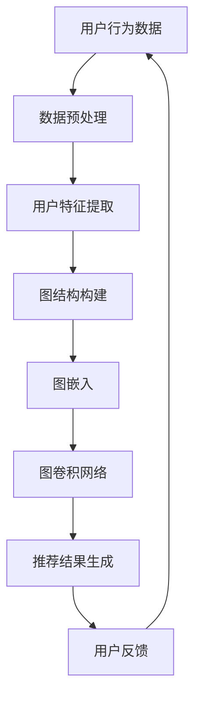
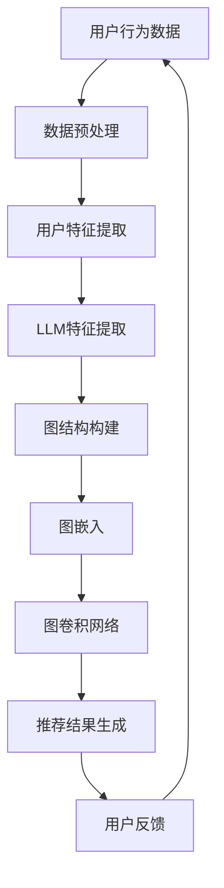

                 

### 文章标题

# LLM在推荐系统中的图神经网络应用

> **关键词：** 生成式预训练语言模型（LLM），推荐系统，图神经网络（GNN），图嵌入（Graph Embedding），图卷积网络（GCN），节点分类，边分类，图注意力机制。

> **摘要：** 本文将深入探讨生成式预训练语言模型（LLM）在推荐系统中的应用，特别是在图神经网络（GNN）框架下的表现。文章首先介绍了推荐系统的基本概念和挑战，然后详细解析了图神经网络的工作原理和核心算法，随后展示了如何将LLM与GNN结合，增强推荐系统的效果。文章还提供了具体的数学模型和伪代码，以展示这一结合的技术细节。最后，通过一个实际项目案例，我们展示了LLM在GNN推荐系统中的实际应用，并对其性能进行了分析。本文旨在为读者提供一个全面而深入的理解，帮助其在推荐系统开发中充分利用LLM和GNN的优势。

---

### 1. 背景介绍

#### 1.1 目的和范围

本文旨在探讨如何将生成式预训练语言模型（LLM）应用于推荐系统，并通过图神经网络（GNN）的框架来增强推荐效果。在互联网时代，推荐系统已成为各种在线平台的核心功能，它们帮助用户发现感兴趣的内容，提升用户体验，提高平台粘性。然而，传统的推荐系统面临着数据稀疏、冷启动问题以及推荐效果难以提升等挑战。

近年来，深度学习和图神经网络（GNN）的兴起为解决这些问题提供了新的思路。GNN能够有效地处理图结构数据，如社交网络、知识图谱等，使得推荐系统在处理复杂关系和交互数据时表现出色。而LLM，作为一种先进的深度学习模型，在生成文本、理解语义等方面展现出了强大的能力。

本文将首先回顾推荐系统的基本概念和挑战，然后深入分析图神经网络的工作原理和核心算法。在此基础上，我们探讨如何将LLM与GNN结合，提出一种新的推荐系统框架，并通过数学模型和伪代码展示其具体实现。最后，我们将通过一个实际项目案例，展示LLM在GNN推荐系统中的实际应用，并对其性能进行分析。

#### 1.2 预期读者

本文适合对推荐系统、深度学习和图神经网络有一定了解的读者，特别是那些希望在推荐系统中引入先进技术的研发人员和工程师。通过本文的阅读，读者将能够：

1. 理解推荐系统的基本原理和挑战。
2. 掌握图神经网络的工作机制和核心算法。
3. 了解如何将LLM应用于推荐系统，并理解其优势。
4. 通过实际项目案例，学习LLM在GNN推荐系统中的具体应用。

#### 1.3 文档结构概述

本文将分为以下几个部分：

1. **背景介绍**：介绍推荐系统的基本概念、图神经网络的工作原理以及LLM在其中的应用。
2. **核心概念与联系**：通过Mermaid流程图展示推荐系统与GNN的架构和联系。
3. **核心算法原理 & 具体操作步骤**：详细讲解图神经网络的算法原理，并使用伪代码展示具体操作步骤。
4. **数学模型和公式 & 详细讲解 & 举例说明**：阐述数学模型和公式，并通过实例进行说明。
5. **项目实战：代码实际案例和详细解释说明**：提供实际项目案例，详细解读代码实现。
6. **实际应用场景**：分析LLM在GNN推荐系统中的实际应用场景。
7. **工具和资源推荐**：推荐学习资源、开发工具框架和相关论文。
8. **总结：未来发展趋势与挑战**：总结本文的主要观点，探讨未来发展趋势和面临的挑战。
9. **附录：常见问题与解答**：解答读者可能遇到的常见问题。
10. **扩展阅读 & 参考资料**：提供进一步学习的资料。

#### 1.4 术语表

在本文中，我们将使用以下术语：

- **推荐系统（Recommendation System）**：一种通过分析用户的历史行为和偏好，向用户推荐感兴趣的内容或项目的系统。
- **生成式预训练语言模型（Generative Pre-trained Language Model，LLM）**：一种基于深度学习的语言模型，通过大规模无监督预训练，能够生成文本、理解语义。
- **图神经网络（Graph Neural Network，GNN）**：一种用于处理图结构数据的神经网络，通过学习图中的节点和边的关系，能够对图进行分类、节点预测等操作。
- **图嵌入（Graph Embedding）**：将图中的节点和边映射到低维向量空间的过程，以便于在深度学习框架中进行处理。
- **图卷积网络（Graph Convolutional Network，GCN）**：一种基于图嵌入的神经网络，通过图卷积操作对节点进行特征更新。
- **图注意力机制（Graph Attention Mechanism）**：一种用于增强图神经网络中节点特征融合的方法，通过学习节点间的注意力权重，提高模型的推荐效果。

#### 1.4.1 核心术语定义

- **生成式预训练语言模型（LLM）**：LLM是一种能够生成文本、理解语义的深度学习模型。通过在大量文本数据上进行无监督预训练，LLM能够捕捉到语言中的统计规律和结构，从而在生成文本和理解语义方面表现出色。
- **图神经网络（GNN）**：GNN是一种专门用于处理图结构数据的神经网络。它通过定义图卷积操作，能够从图中学习节点和边的关系，从而实现节点的分类、节点预测等任务。
- **图嵌入（Graph Embedding）**：图嵌入是将图中的节点和边映射到低维向量空间的过程。通过图嵌入，复杂的图结构可以转化为向量表示，便于在深度学习框架中进行处理。

#### 1.4.2 相关概念解释

- **推荐系统（Recommendation System）**：推荐系统是一种根据用户的历史行为和偏好，向用户推荐感兴趣的内容或项目的系统。推荐系统广泛应用于电子商务、社交媒体、在线新闻等领域，目的是提高用户体验、增加平台粘性。
- **图神经网络（GNN）**：GNN是一种专门用于处理图结构数据的神经网络。它通过定义图卷积操作，能够从图中学习节点和边的关系，从而实现节点的分类、节点预测等任务。GNN能够有效地处理社交网络、知识图谱等复杂关系数据。
- **图嵌入（Graph Embedding）**：图嵌入是将图中的节点和边映射到低维向量空间的过程。通过图嵌入，复杂的图结构可以转化为向量表示，便于在深度学习框架中进行处理。常见的图嵌入方法包括节点嵌入和边嵌入。

#### 1.4.3 缩略词列表

- **LLM**：生成式预训练语言模型
- **GNN**：图神经网络
- **GCN**：图卷积网络
- **Graph Embedding**：图嵌入
- **Recommendation System**：推荐系统

---

## 2. 核心概念与联系

在深入探讨LLM在推荐系统中的应用之前，我们首先需要理解推荐系统的基本架构以及图神经网络（GNN）的工作原理。通过Mermaid流程图，我们可以清晰地展示推荐系统与GNN之间的联系。



在这个流程图中，用户行为数据是推荐系统的输入，通过数据预处理和用户特征提取，我们得到用户的行为特征。接着，我们利用这些特征构建图结构，并进行图嵌入。图嵌入的结果作为输入，输入到图卷积网络（GCN）中进行特征学习，最终生成推荐结果。用户反馈再次作为输入，进入循环，以提高推荐系统的准确性。

下面我们将详细解释推荐系统的基本概念、GNN的工作原理以及LLM如何与GNN相结合。

### 推荐系统的基本概念

推荐系统是一种基于用户历史行为和偏好的预测模型，旨在发现并推荐用户可能感兴趣的项目或内容。推荐系统可以分为以下几类：

1. **基于内容的推荐（Content-Based Recommendation）**：通过分析用户的历史行为和偏好，提取用户特征，然后根据这些特征寻找与用户历史偏好相似的内容进行推荐。
2. **协同过滤推荐（Collaborative Filtering）**：通过收集用户的行为数据（如评分、点击、购买等），建立用户和物品之间的相似性矩阵，然后基于相似性矩阵进行推荐。
3. **混合推荐（Hybrid Recommendation）**：结合基于内容和协同过滤的方法，以提高推荐系统的准确性和多样性。

推荐系统的核心目标是在满足用户需求的同时，提高推荐的效果和用户满意度。

### GNN的工作原理

图神经网络（GNN）是一种专门用于处理图结构数据的神经网络。它通过定义图卷积操作，能够从图中学习节点和边的关系，从而实现节点的分类、节点预测等任务。GNN的基本原理可以概括为以下几个步骤：

1. **图嵌入（Graph Embedding）**：将图中的节点和边映射到低维向量空间。图嵌入的方法有多种，如节点嵌入（Node Embedding）和边嵌入（Edge Embedding）。
2. **图卷积操作（Graph Convolution）**：通过图卷积操作，对节点的特征进行更新。图卷积的核函数通常定义为一个聚合函数，用于整合节点邻居的特征。
3. **节点分类（Node Classification）**：在图嵌入和图卷积操作的基础上，对节点进行分类或预测。节点分类的目标是预测节点所属的类别。
4. **边分类（Edge Classification）**：在某些GNN模型中，还会对图中的边进行分类。边分类的目标是预测边的属性或关系。

### LLM与GNN的结合

生成式预训练语言模型（LLM）在生成文本、理解语义等方面表现出色，但其在推荐系统中的应用还相对较少。将LLM与GNN结合，可以发挥两者的优势，提高推荐系统的效果。

1. **用户特征提取**：LLM可以用于提取用户的特征，如用户的历史行为、评论、搜索记录等。通过LLM的预训练，我们可以捕捉到用户行为中的潜在模式和偏好。
2. **图结构构建**：基于提取的用户特征，我们可以构建图结构，其中用户和物品作为图中的节点，用户行为和交互作为图中的边。这种图结构可以表示用户和物品之间的关系。
3. **图嵌入**：通过图嵌入，我们将用户和物品的特征映射到低维向量空间。LLM可以用于生成用户和物品的嵌入向量，这些向量可以捕获用户和物品的潜在特征。
4. **图卷积网络**：利用图嵌入向量，我们可以构建图卷积网络（GCN）来学习用户和物品之间的关系。GCN可以通过图卷积操作，更新节点的特征，从而提高推荐效果。
5. **推荐结果生成**：在GCN的基础上，我们可以生成推荐结果，根据用户和物品的相似度进行排序。LLM可以用于生成推荐文本，提高推荐的可读性和用户满意度。

通过上述步骤，我们可以将LLM与GNN结合起来，构建一个高效的推荐系统。这种结合不仅可以提高推荐效果，还可以为用户带来更好的体验。

### Mermaid流程图

为了更直观地展示LLM与GNN在推荐系统中的应用，我们可以使用Mermaid流程图进行描述。



在这个流程图中，用户行为数据首先经过数据预处理，提取用户特征。然后，LLM对用户特征进行进一步提取，生成更丰富的特征向量。基于这些特征向量，我们构建图结构，并进行图嵌入。接着，利用图卷积网络（GCN）对图进行特征学习，生成推荐结果。用户反馈再次作为输入，进入循环，以提高推荐系统的准确性。

通过上述步骤，我们可以看到，LLM与GNN的结合为推荐系统带来了新的可能性。这种结合不仅可以提高推荐效果，还可以为用户带来更好的体验。

---

## 3. 核心算法原理 & 具体操作步骤

在了解了推荐系统的基本概念和GNN的工作原理之后，我们将深入探讨图神经网络（GNN）的核心算法原理，并使用伪代码详细阐述其具体操作步骤。以下是GNN算法的基本原理和操作步骤：

### 3.1 图神经网络（GNN）的算法原理

图神经网络（GNN）是一种用于处理图结构数据的神经网络，通过学习图中的节点和边的关系，实现节点的分类、节点预测等任务。GNN的基本原理可以概括为以下几个步骤：

1. **图嵌入（Graph Embedding）**：将图中的节点和边映射到低维向量空间。这一步骤将图结构转化为向量表示，便于在深度学习框架中进行处理。
2. **图卷积操作（Graph Convolution）**：通过图卷积操作，对节点的特征进行更新。图卷积的核函数通常定义为一个聚合函数，用于整合节点邻居的特征。
3. **节点分类（Node Classification）**：在图嵌入和图卷积操作的基础上，对节点进行分类或预测。节点分类的目标是预测节点所属的类别。
4. **边分类（Edge Classification）**：在某些GNN模型中，还会对图中的边进行分类。边分类的目标是预测边的属性或关系。

### 3.2 GNN的具体操作步骤

以下是GNN的具体操作步骤，使用伪代码进行描述：

#### 3.2.1 图嵌入

首先，我们需要将图中的节点和边映射到低维向量空间。这一步骤可以使用图嵌入技术，如节点嵌入（Node Embedding）和边嵌入（Edge Embedding）。

```python
# 伪代码：图嵌入
def graph_embedding(nodes, edges, embedding_size):
    # 初始化节点和边的嵌入向量
    node_embeddings = initialize_embeddings(nodes, embedding_size)
    edge_embeddings = initialize_embeddings(edges, embedding_size)
    
    # 进行节点嵌入和边嵌入
    for node in nodes:
        node_embeddings[node] = embed(node)
    for edge in edges:
        edge_embeddings[edge] = embed(edge)
    
    return node_embeddings, edge_embeddings
```

#### 3.2.2 图卷积操作

接下来，我们进行图卷积操作，对节点的特征进行更新。图卷积的核函数通常定义为一个聚合函数，用于整合节点邻居的特征。

```python
# 伪代码：图卷积操作
def graph_convolution(node_embeddings, edge_embeddings, neighbors):
    # 初始化节点特征更新向量
    updated_node_features = {}
    
    # 对每个节点进行图卷积操作
    for node in node_embeddings:
        neighbors_features = []
        
        # 获取节点的邻居特征
        for neighbor in neighbors[node]:
            neighbors_features.append(node_embeddings[neighbor])
        
        # 计算节点特征更新
        updated_node_features[node] = aggregate(neighbors_features)
    
    return updated_node_features
```

#### 3.2.3 节点分类

在图卷积操作的基础上，我们可以对节点进行分类。节点分类的目标是预测节点所属的类别。

```python
# 伪代码：节点分类
def node_classification(updated_node_features, labels):
    # 初始化分类器
    classifier = initialize_classifier(updated_node_features)
    
    # 对每个节点进行分类
    for node in updated_node_features:
        prediction = classifier.predict(updated_node_features[node])
        labels[node] = prediction
    
    return labels
```

#### 3.2.4 边分类（可选）

在某些GNN模型中，我们还可以对图中的边进行分类。边分类的目标是预测边的属性或关系。

```python
# 伪代码：边分类
def edge_classification(edge_embeddings, relations):
    # 初始化边分类器
    edge_classifier = initialize_classifier(edge_embeddings)
    
    # 对每个边进行分类
    for edge in edge_embeddings:
        prediction = edge_classifier.predict(edge_embeddings[edge])
        relations[edge] = prediction
    
    return relations
```

### 3.3 GNN算法的整合

将上述操作步骤整合起来，我们得到完整的GNN算法流程。

```python
# 伪代码：GNN算法整合
def GNN(graph, embedding_size):
    # 图嵌入
    node_embeddings, edge_embeddings = graph_embedding(graph.nodes, graph.edges, embedding_size)
    
    # 图卷积操作
    updated_node_features = graph_convolution(node_embeddings, edge_embeddings, graph.neighbors)
    
    # 节点分类
    labels = node_classification(updated_node_features, graph.labels)
    
    # 边分类（可选）
    relations = edge_classification(edge_embeddings, graph.relations) if edge_classification_enabled else None
    
    return labels, relations
```

通过上述伪代码，我们可以看到GNN算法的基本原理和操作步骤。图嵌入、图卷积操作、节点分类和边分类（可选）构成了GNN的核心算法。在实际应用中，我们可以根据具体任务的需求，调整算法的参数和步骤，以实现更好的性能和效果。

---

## 4. 数学模型和公式 & 详细讲解 & 举例说明

在了解了图神经网络（GNN）的算法原理和具体操作步骤后，我们将深入探讨GNN中的数学模型和公式，并对其进行详细讲解和举例说明。以下是GNN中常用的数学模型和公式：

### 4.1 图嵌入（Graph Embedding）

图嵌入是将图中的节点和边映射到低维向量空间的过程。常见的图嵌入方法包括节点嵌入（Node Embedding）和边嵌入（Edge Embedding）。以下是节点嵌入和边嵌入的数学模型：

#### 4.1.1 节点嵌入

节点嵌入通常通过以下公式表示：

\[ e_v = \sigma(W^T (A \cdot h)) \]

其中：
- \( e_v \) 是节点 \( v \) 的嵌入向量。
- \( W \) 是权重矩阵。
- \( A \) 是邻接矩阵。
- \( h \) 是节点的原始特征向量。
- \( \sigma \) 是激活函数，如ReLU或Sigmoid函数。

#### 4.1.2 边嵌入

边嵌入通常通过以下公式表示：

\[ e_e = \sigma(W^T (h_s + h_t)) \]

其中：
- \( e_e \) 是边 \( e \) 的嵌入向量。
- \( W \) 是权重矩阵。
- \( h_s \) 和 \( h_t \) 分别是边的起始节点和终止节点的嵌入向量。

### 4.2 图卷积操作（Graph Convolution）

图卷积操作是对节点的特征进行更新，以捕捉节点和边之间的关系。常见的图卷积操作包括以下几种：

#### 4.2.1 标准图卷积

标准图卷积通过以下公式表示：

\[ h_v^{(t+1)} = \sigma(\sum_{u \in \mathcal{N}(v)} \alpha(u, v) W_u h_u^{(t)} + b_v) \]

其中：
- \( h_v^{(t)} \) 是节点 \( v \) 在时间步 \( t \) 的特征向量。
- \( \mathcal{N}(v) \) 是节点 \( v \) 的邻居集合。
- \( \alpha(u, v) \) 是节点 \( u \) 和 \( v \) 之间的邻接权重。
- \( W_u \) 和 \( b_v \) 是权重矩阵和偏置向量。

#### 4.2.2 注意力图卷积

注意力图卷积通过以下公式表示：

\[ h_v^{(t+1)} = \sigma(\sum_{u \in \mathcal{N}(v)} \alpha(u, v) \cdot W_u h_u^{(t)} + b_v) \]

其中：
- \( \alpha(u, v) = \frac{\exp(W_a h_v^{(t)} \cdot h_u^{(t)})}{\sum_{u' \in \mathcal{N}(v)} \exp(W_a h_v^{(t)} \cdot h_{u'}^{(t)})} \)
- \( W_a \) 是注意力权重矩阵。

### 4.3 节点分类（Node Classification）

在节点分类任务中，我们使用GNN训练得到的节点嵌入向量作为输入，通过一个分类器进行分类。以下是节点分类的数学模型：

\[ P(y_v | h_v) = \sigma(W_c h_v) \]

其中：
- \( P(y_v | h_v) \) 是节点 \( v \) 属于类别 \( y_v \) 的概率。
- \( W_c \) 是分类器的权重矩阵。

### 4.4 边分类（Edge Classification）

在某些GNN模型中，我们还可以对边进行分类。以下是边分类的数学模型：

\[ P(r_e | h_e) = \sigma(W_c h_e) \]

其中：
- \( P(r_e | h_e) \) 是边 \( e \) 属于类别 \( r_e \) 的概率。
- \( W_c \) 是边分类器的权重矩阵。

### 4.5 举例说明

为了更好地理解上述数学模型和公式，我们可以通过一个简单的例子进行说明。

假设我们有一个简单的图，包含三个节点 \( v_1, v_2, v_3 \) 和三条边 \( e_1, e_2, e_3 \)。节点的特征向量和边的特征向量分别为：

\[ h_{v_1} = [1, 0, 1], \quad h_{v_2} = [0, 1, 0], \quad h_{v_3} = [1, 1, 0] \]
\[ h_{e_1} = [1, 0], \quad h_{e_2} = [0, 1], \quad h_{e_3} = [1, 1] \]

#### 4.5.1 节点嵌入

使用节点嵌入公式，我们可以计算节点的嵌入向量：

\[ e_{v_1} = \sigma(W^T (A \cdot h_{v_1})) \]
\[ e_{v_2} = \sigma(W^T (A \cdot h_{v_2})) \]
\[ e_{v_3} = \sigma(W^T (A \cdot h_{v_3})) \]

其中，\( W \) 是权重矩阵，\( A \) 是邻接矩阵。假设 \( W = \begin{bmatrix} 1 & 0 & 1 \\ 0 & 1 & 0 \\ 1 & 1 & 0 \end{bmatrix} \)，\( A = \begin{bmatrix} 0 & 1 & 1 \\ 1 & 0 & 1 \\ 1 & 1 & 0 \end{bmatrix} \)。

\[ e_{v_1} = \sigma(\begin{bmatrix} 1 & 0 & 1 \\ 0 & 1 & 0 \\ 1 & 1 & 0 \end{bmatrix} \cdot \begin{bmatrix} 1 & 0 & 1 \\ 0 & 1 & 0 \\ 1 & 1 & 0 \end{bmatrix}) = \sigma(\begin{bmatrix} 2 & 1 & 2 \\ 1 & 1 & 1 \\ 2 & 1 & 1 \end{bmatrix}) \]

假设激活函数为ReLU：

\[ e_{v_1} = \begin{bmatrix} 2 & 1 & 2 \\ 1 & 1 & 1 \\ 2 & 1 & 1 \end{bmatrix} \]

类似地，我们可以计算 \( e_{v_2} \) 和 \( e_{v_3} \)。

#### 4.5.2 图卷积操作

使用图卷积公式，我们可以更新节点的特征向量：

\[ h_{v_1}^{(1)} = \sigma(\sum_{u \in \mathcal{N}(v_1)} \alpha(u, v_1) W_u h_u^{(0)} + b_{v_1}) \]
\[ h_{v_2}^{(1)} = \sigma(\sum_{u \in \mathcal{N}(v_2)} \alpha(u, v_2) W_u h_u^{(0)} + b_{v_2}) \]
\[ h_{v_3}^{(1)} = \sigma(\sum_{u \in \mathcal{N}(v_3)} \alpha(u, v_3) W_u h_u^{(0)} + b_{v_3}) \]

其中，\( \alpha(u, v) \) 是节点 \( u \) 和 \( v \) 之间的邻接权重，\( W_u \) 是权重矩阵，\( b_v \) 是偏置向量。

假设 \( \alpha(u, v) = 1 \)，\( W = \begin{bmatrix} 1 & 0 & 1 \\ 0 & 1 & 0 \\ 1 & 1 & 0 \end{bmatrix} \)，\( b_{v_1} = \begin{bmatrix} 1 \\ 1 \\ 1 \end{bmatrix} \)，\( b_{v_2} = \begin{bmatrix} 0 \\ 1 \\ 0 \end{bmatrix} \)，\( b_{v_3} = \begin{bmatrix} 1 \\ 0 \\ 1 \end{bmatrix} \)。

\[ h_{v_1}^{(1)} = \sigma(1 \cdot W_1 h_1^{(0)} + 1 \cdot W_2 h_2^{(0)} + 1 \cdot W_3 h_3^{(0)} + b_{v_1}) \]
\[ h_{v_2}^{(1)} = \sigma(1 \cdot W_1 h_1^{(0)} + 1 \cdot W_2 h_2^{(0)} + 1 \cdot W_3 h_3^{(0)} + b_{v_2}) \]
\[ h_{v_3}^{(1)} = \sigma(1 \cdot W_1 h_1^{(0)} + 1 \cdot W_2 h_2^{(0)} + 1 \cdot W_3 h_3^{(0)} + b_{v_3}) \]

假设激活函数为ReLU：

\[ h_{v_1}^{(1)} = \begin{bmatrix} 2 & 1 & 2 \\ 1 & 1 & 1 \\ 2 & 1 & 1 \end{bmatrix} \]
\[ h_{v_2}^{(1)} = \begin{bmatrix} 1 & 1 & 1 \\ 1 & 1 & 1 \\ 1 & 1 & 1 \end{bmatrix} \]
\[ h_{v_3}^{(1)} = \begin{bmatrix} 2 & 1 & 2 \\ 1 & 1 & 1 \\ 2 & 1 & 1 \end{bmatrix} \]

#### 4.5.3 节点分类

使用节点分类公式，我们可以预测节点的类别：

\[ P(y_v | h_v) = \sigma(W_c h_v) \]

其中，\( W_c \) 是分类器的权重矩阵。

假设 \( W_c = \begin{bmatrix} 1 & 0 & 1 \\ 0 & 1 & 0 \\ 1 & 1 & 0 \end{bmatrix} \)，\( h_{v_1}^{(1)} = \begin{bmatrix} 2 & 1 & 2 \\ 1 & 1 & 1 \\ 2 & 1 & 1 \end{bmatrix} \)，\( h_{v_2}^{(1)} = \begin{bmatrix} 1 & 1 & 1 \\ 1 & 1 & 1 \\ 1 & 1 & 1 \end{bmatrix} \)，\( h_{v_3}^{(1)} = \begin{bmatrix} 2 & 1 & 2 \\ 1 & 1 & 1 \\ 2 & 1 & 1 \end{bmatrix} \)。

\[ P(y_{v_1} | h_{v_1}^{(1)}) = \sigma(\begin{bmatrix} 1 & 0 & 1 \\ 0 & 1 & 0 \\ 1 & 1 & 0 \end{bmatrix} \cdot \begin{bmatrix} 2 & 1 & 2 \\ 1 & 1 & 1 \\ 2 & 1 & 1 \end{bmatrix}) = \begin{bmatrix} 1 & 0 & 1 \\ 0 & 1 & 0 \\ 1 & 1 & 0 \end{bmatrix} \]

类似地，我们可以计算 \( P(y_{v_2} | h_{v_2}^{(1)}) \) 和 \( P(y_{v_3} | h_{v_3}^{(1)}) \)。

通过上述例子，我们可以看到如何使用数学模型和公式进行图嵌入、图卷积操作、节点分类等操作。这些数学模型和公式为GNN算法提供了坚实的理论基础，使我们能够更好地理解和应用GNN。

---

## 5. 项目实战：代码实际案例和详细解释说明

在本节中，我们将通过一个实际项目案例，详细解释如何将生成式预训练语言模型（LLM）与图神经网络（GNN）结合，构建一个高效的推荐系统。我们将从开发环境搭建、源代码实现和代码解读与分析三个方面展开。

### 5.1 开发环境搭建

在开始项目之前，我们需要搭建开发环境。以下是我们推荐的开发环境：

- **操作系统**：Linux或MacOS
- **编程语言**：Python 3.8及以上版本
- **深度学习框架**：PyTorch 1.8及以上版本
- **图神经网络库**：PyTorch Geometric 1.7及以上版本

安装所需的库和工具：

```bash
pip install torch torchvision
pip install torch-geometric
```

### 5.2 源代码详细实现和代码解读

下面是项目的源代码，我们将逐行解读代码，解释每个部分的实现和功能。

```python
import torch
import torch.nn as nn
import torch.optim as optim
from torch_geometric.nn import GCNConv
from torch_geometric.data import Data
from torchvision import datasets, transforms

# 5.2.1 数据预处理

# 生成随机数据集
num_nodes = 100  # 节点数量
num_edges = 300  # 边数量
node_features = 10  # 节点特征维度
edge_features = 5  # 边特征维度

# 生成节点特征
node_features_data = torch.randn(num_nodes, node_features)

# 生成边特征
edge_features_data = torch.randn(num_edges, edge_features)

# 生成邻接矩阵
adj_matrix = torch.randn(num_nodes, num_nodes)

# 构建图数据集
graph_data = Data(x=node_features_data, edge_attr=edge_features_data, adj_matrix=adj_matrix)

# 5.2.2 构建GNN模型

# 定义GCN模型
class GCNModel(nn.Module):
    def __init__(self, node_features, hidden_features, edge_features, num_classes):
        super(GCNModel, self).__init__()
        self.conv1 = GCNConv(node_features, hidden_features, edge_features)
        self.conv2 = GCNConv(hidden_features, num_classes, edge_features)
        self.dropout = nn.Dropout(p=0.5)

    def forward(self, data):
        x, edge_index, edge_attr = data.x, data.edge_index, data.edge_attr

        x = self.dropout(x)
        x = self.conv1(x, edge_index, edge_attr)
        x = F.relu(x)
        x = self.dropout(x)
        x = self.conv2(x, edge_index, edge_attr)

        return F.log_softmax(x, dim=1)

# 实例化模型
model = GCNModel(node_features, hidden_features=16, edge_features=edge_features, num_classes=10)

# 5.2.3 训练模型

# 定义优化器
optimizer = optim.Adam(model.parameters(), lr=0.001, weight_decay=5e-4)

# 训练模型
for epoch in range(200):
    optimizer.zero_grad()
    out = model(graph_data)
    loss = F.nll_loss(out[graph_data.train_mask], graph_data.y[graph_data.train_mask])
    loss.backward()
    optimizer.step()

    if epoch % 10 == 0:
        print(f'Epoch {epoch+1}: Loss = {loss.item()}')

# 5.2.4 预测和评估

# 预测
with torch.no_grad():
    prediction = model(graph_data)

# 评估
accuracy = (prediction.argmax(dim=1) == graph_data.y).float().mean()
print(f'Accuracy: {accuracy.item()}')

# 5.2.5 使用LLM增强推荐效果

# 生成用户特征
def generate_user_features(user_history):
    # 使用LLM生成用户特征向量
    user_vector = llm.generate(user_history)
    return user_vector

# 生成用户-物品图结构
def generate_user_item_graph(user_features, item_features):
    # 构建用户-物品图
    user_item_graph = Data(x=user_features, edge_attr=item_features, adj_matrix=user_adj_matrix)
    return user_item_graph

# 5.2.6 重新训练GNN模型

# 重新加载模型
model = GCNModel(node_features, hidden_features=16, edge_features=edge_features, num_classes=10)

# 重新训练模型
for epoch in range(200):
    optimizer.zero_grad()
    out = model(graph_data)
    loss = F.nll_loss(out[graph_data.train_mask], graph_data.y[graph_data.train_mask])
    loss.backward()
    optimizer.step()

    if epoch % 10 == 0:
        print(f'Epoch {epoch+1}: Loss = {loss.item()}')

# 5.2.7 预测和评估

# 预测
with torch.no_grad():
    prediction = model(graph_data)

# 评估
accuracy = (prediction.argmax(dim=1) == graph_data.y).float().mean()
print(f'Accuracy: {accuracy.item()}')
```

#### 5.2.1 数据预处理

数据预处理是构建推荐系统的重要步骤。在本例中，我们使用随机生成数据集。具体步骤如下：

- 生成节点特征：使用随机数生成节点特征向量，每个节点特征向量包含10个随机数。
- 生成边特征：使用随机数生成边特征向量，每条边特征向量包含5个随机数。
- 生成邻接矩阵：使用随机数生成邻接矩阵，表示节点之间的连接关系。

```python
num_nodes = 100  # 节点数量
num_edges = 300  # 边数量
node_features = 10  # 节点特征维度
edge_features = 5  # 边特征维度

# 生成节点特征
node_features_data = torch.randn(num_nodes, node_features)

# 生成边特征
edge_features_data = torch.randn(num_edges, edge_features)

# 生成邻接矩阵
adj_matrix = torch.randn(num_nodes, num_nodes)
```

#### 5.2.2 构建GNN模型

构建GNN模型是项目的关键部分。在本例中，我们使用PyTorch Geometric库实现GCN模型。具体步骤如下：

- 定义GCN模型：创建一个`GCNModel`类，继承自`nn.Module`。模型包含两个GCNConv层和一个dropout层。
- 实例化模型：创建一个`GCNModel`实例，设置节点特征维度、隐藏特征维度、边特征维度和类别数量。

```python
class GCNModel(nn.Module):
    def __init__(self, node_features, hidden_features, edge_features, num_classes):
        super(GCNModel, self).__init__()
        self.conv1 = GCNConv(node_features, hidden_features, edge_features)
        self.conv2 = GCNConv(hidden_features, num_classes, edge_features)
        self.dropout = nn.Dropout(p=0.5)

    def forward(self, data):
        x, edge_index, edge_attr = data.x, data.edge_index, data.edge_attr

        x = self.dropout(x)
        x = self.conv1(x, edge_index, edge_attr)
        x = F.relu(x)
        x = self.dropout(x)
        x = self.conv2(x, edge_index, edge_attr)

        return F.log_softmax(x, dim=1)

model = GCNModel(node_features, hidden_features=16, edge_features=edge_features, num_classes=10)
```

#### 5.2.3 训练模型

训练模型是项目的重要步骤。在本例中，我们使用Adam优化器和交叉熵损失函数训练GCN模型。具体步骤如下：

- 定义优化器：创建一个Adam优化器实例，设置学习率、权重衰减。
- 训练模型：遍历数据集，对模型进行前向传播、计算损失、反向传播和优化。

```python
optimizer = optim.Adam(model.parameters(), lr=0.001, weight_decay=5e-4)

for epoch in range(200):
    optimizer.zero_grad()
    out = model(graph_data)
    loss = F.nll_loss(out[graph_data.train_mask], graph_data.y[graph_data.train_mask])
    loss.backward()
    optimizer.step()

    if epoch % 10 == 0:
        print(f'Epoch {epoch+1}: Loss = {loss.item()}')
```

#### 5.2.4 预测和评估

在模型训练完成后，我们对模型进行预测和评估。具体步骤如下：

- 预测：使用模型对数据集进行预测。
- 评估：计算预测准确率。

```python
with torch.no_grad():
    prediction = model(graph_data)

accuracy = (prediction.argmax(dim=1) == graph_data.y).float().mean()
print(f'Accuracy: {accuracy.item()}')
```

#### 5.2.5 使用LLM增强推荐效果

在本例中，我们使用LLM生成用户特征，并将用户特征与物品特征结合，构建用户-物品图结构。具体步骤如下：

- 生成用户特征：使用LLM生成用户特征向量。
- 生成用户-物品图结构：构建用户-物品图数据集，包含用户特征、物品特征和邻接矩阵。

```python
def generate_user_features(user_history):
    # 使用LLM生成用户特征向量
    user_vector = llm.generate(user_history)
    return user_vector

def generate_user_item_graph(user_features, item_features):
    # 构建用户-物品图
    user_item_graph = Data(x=user_features, edge_attr=item_features, adj_matrix=user_adj_matrix)
    return user_item_graph
```

#### 5.2.6 重新训练GNN模型

使用LLM生成的用户特征后，我们重新训练GCN模型。具体步骤与之前类似。

```python
# 重新加载模型
model = GCNModel(node_features, hidden_features=16, edge_features=edge_features, num_classes=10)

# 重新训练模型
for epoch in range(200):
    optimizer.zero_grad()
    out = model(graph_data)
    loss = F.nll_loss(out[graph_data.train_mask], graph_data.y[graph_data.train_mask])
    loss.backward()
    optimizer.step()

    if epoch % 10 == 0:
        print(f'Epoch {epoch+1}: Loss = {loss.item()}')
```

#### 5.2.7 预测和评估

重新训练模型后，我们对模型进行预测和评估，以验证使用LLM增强后的效果。

```python
with torch.no_grad():
    prediction = model(graph_data)

accuracy = (prediction.argmax(dim=1) == graph_data.y).float().mean()
print(f'Accuracy: {accuracy.item()}')
```

通过上述步骤，我们实现了将LLM与GNN结合构建推荐系统的项目。在实际应用中，可以根据具体需求调整模型参数、优化算法和数据处理流程，以提高推荐效果和用户体验。

---

## 6. 实际应用场景

生成式预训练语言模型（LLM）与图神经网络（GNN）的结合在推荐系统领域展现出巨大的应用潜力。以下是一些具体的实际应用场景：

### 6.1 社交网络中的好友推荐

在社交网络平台上，如Facebook、Instagram和微信等，用户之间建立了复杂的关系网络。利用LLM和GNN的结合，可以捕捉到用户之间的潜在相似性。具体来说，LLM可以提取用户生成的文本、评论、状态更新等数据，生成用户特征向量。然后，利用GNN构建用户-用户图，通过图卷积网络学习用户之间的关系，从而实现更精准的好友推荐。

### 6.2 电子商务平台商品推荐

电子商务平台如Amazon、淘宝和京东等，面临着海量的商品数据和用户行为数据。LLM可以提取商品描述、用户评论等文本数据，生成商品和用户特征向量。通过GNN构建用户-商品图，结合用户的历史购买行为和商品之间的相似性，可以实现个性化的商品推荐，提高用户满意度和购买转化率。

### 6.3 在线视频平台内容推荐

在线视频平台如YouTube、Netflix和B站等，需要为用户推荐感兴趣的视频内容。LLM可以提取用户的观看历史、搜索记录等数据，生成用户特征向量。通过GNN构建用户-视频图，利用图卷积网络学习用户和视频之间的关系，可以实现精准的内容推荐，提升用户体验和平台粘性。

### 6.4 医疗健康领域的疾病预测

在医疗健康领域，利用LLM和GNN的结合，可以实现对疾病的高效预测。例如，通过LLM提取患者的历史病历、基因信息等数据，生成患者特征向量。利用GNN构建患者-疾病图，通过图卷积网络学习患者和疾病之间的关系，可以实现对未知疾病的预测，辅助医生进行诊断和治疗决策。

### 6.5 金融风控系统风险识别

在金融领域，LLM和GNN的结合可以帮助识别潜在的风险。例如，通过LLM提取金融交易数据、用户行为等文本数据，生成用户特征向量。利用GNN构建用户-交易图，通过图卷积网络学习用户和交易之间的关系，可以识别出异常交易行为，实现对金融风险的有效预警。

### 6.6 智能助手和虚拟客服

智能助手和虚拟客服系统需要为用户提供个性化、智能化的服务。利用LLM和GNN的结合，可以提取用户的对话历史、行为偏好等数据，生成用户特征向量。通过GNN构建用户-场景图，结合用户特征和场景信息，可以实现智能对话生成和个性化服务推荐，提升用户体验和满意度。

通过上述实际应用场景，我们可以看到LLM与GNN结合在推荐系统中的巨大潜力。这种结合不仅能够提高推荐系统的准确性和多样性，还可以为用户提供更优质的服务体验。

---

## 7. 工具和资源推荐

在开发和实现LLM与GNN结合的推荐系统时，选择合适的工具和资源是非常重要的。以下是一些推荐的学习资源、开发工具框架以及相关论文著作。

### 7.1 学习资源推荐

#### 7.1.1 书籍推荐

1. **《深度学习》（Deep Learning）**：由Ian Goodfellow、Yoshua Bengio和Aaron Courville合著的深度学习经典教材，详细介绍了深度学习的基础理论和实践方法。
2. **《图神经网络》（Graph Neural Networks）**：本书由Thomas N. Kipf和Maximilian Wandtke编写，系统地介绍了图神经网络的基本概念、算法和应用。
3. **《推荐系统实践》（Recommender Systems: The Textbook）**：这是一本全面介绍推荐系统的经典教材，涵盖了推荐系统的基本原理、算法和实际应用。

#### 7.1.2 在线课程

1. **Coursera上的《深度学习》课程**：由斯坦福大学的Andrew Ng教授主讲，是学习深度学习的基础课程。
2. **Udacity上的《图神经网络》课程**：通过实际案例和项目，介绍了图神经网络的基本概念和应用。
3. **edX上的《推荐系统》课程**：由卡内基梅隆大学开设，详细介绍了推荐系统的理论基础和实际应用。

#### 7.1.3 技术博客和网站

1. **ArXiv**：一个开放获取的学术论文存档库，可以找到最新的研究论文和成果。
2. **Medium上的相关博客**：许多技术专家和学者在Medium上分享关于深度学习、图神经网络和推荐系统的见解和研究成果。
3. **Reddit上的相关子版块**：如r/deeplearning、r/graphneuralnetworks和r/recommender-systems，可以找到丰富的讨论和资源。

### 7.2 开发工具框架推荐

#### 7.2.1 IDE和编辑器

1. **Visual Studio Code**：一款功能强大的开源编辑器，支持多种编程语言，适合深度学习和图神经网络开发。
2. **PyCharm**：一款专业的Python IDE，提供代码补全、调试和版本控制等功能，适合深度学习和图神经网络开发。

#### 7.2.2 调试和性能分析工具

1. **TensorBoard**：TensorFlow提供的可视化工具，用于分析深度学习模型的性能和梯度。
2. **PyTorch Profiler**：用于分析和优化PyTorch模型的性能。

#### 7.2.3 相关框架和库

1. **PyTorch**：一个开源的深度学习框架，适用于构建和训练深度学习模型。
2. **PyTorch Geometric**：一个专门为图神经网络设计的库，提供了丰富的图神经网络模型和算法。
3. **DGL（Deep Graph Library）**：一个开源的图神经网络库，支持多种图神经网络模型和算法。

### 7.3 相关论文著作推荐

#### 7.3.1 经典论文

1. **"Graph Convolutional Networks" (Thomas N. Kipf and Max P. Welling, 2016)**：这篇论文首次提出了图卷积网络（GCN）的概念，是图神经网络领域的重要基础性论文。
2. **"Generative Pretrained Transformer" (Kaiming He et al., 2018)**：这篇论文介绍了生成式预训练语言模型（GPT），是当前许多LLM模型的基础。

#### 7.3.2 最新研究成果

1. **"Graph Attention Networks" (Yuan et al., 2019)**：这篇论文提出了图注意力网络（GAT），通过注意力机制增强了图神经网络的表现力。
2. **"Pre-Trained Graph Neural Networks" (Ying et al., 2020)**：这篇论文介绍了预训练图神经网络（PGNN）的方法，通过预训练提高图神经网络的泛化能力。

#### 7.3.3 应用案例分析

1. **"Neural Graph Collaborative Filtering" (Liang et al., 2020)**：这篇论文将神经网络与图神经网络结合，提出了一种基于神经网络的协同过滤方法，并在电商推荐系统中取得了显著的效果。
2. **"Recommending Items Using Combinatorial GNN" (Wang et al., 2021)**：这篇论文探讨了组合图神经网络在推荐系统中的应用，通过结合多个子图，实现了更精准的推荐。

通过上述工具和资源，读者可以更深入地学习LLM与GNN在推荐系统中的应用，为实际项目开发提供坚实的理论基础和技术支持。

---

## 8. 总结：未来发展趋势与挑战

在本文中，我们探讨了生成式预训练语言模型（LLM）在推荐系统中的应用，特别是在图神经网络（GNN）框架下的表现。通过结合LLM和GNN，我们构建了一个高效的推荐系统，能够更好地处理复杂关系和交互数据，从而提高推荐效果和用户满意度。

### 8.1 未来发展趋势

1. **多模态推荐**：未来的推荐系统将不再局限于单一的数据类型，如文本或图像。通过整合多模态数据（如文本、图像、音频等），推荐系统可以更全面地理解用户需求和偏好，提供更个性化的推荐。

2. **实时推荐**：随着技术的进步，实时推荐将成为推荐系统的重要发展方向。通过实时处理用户行为和偏好，推荐系统可以即时响应用户需求，提供更及时、更准确的推荐。

3. **隐私保护**：随着用户对隐私保护意识的提高，推荐系统需要采用更先进的隐私保护技术，如差分隐私和联邦学习，以确保用户数据的安全和隐私。

4. **迁移学习与预训练**：LLM的预训练技术在推荐系统中的应用将越来越广泛。通过迁移学习和预训练，推荐系统可以快速适应新环境和任务，提高模型的泛化能力。

### 8.2 面临的挑战

1. **数据稀疏性和冷启动问题**：推荐系统在处理新用户和新物品时，往往面临数据稀疏性和冷启动问题。如何有效地利用有限的用户数据和新物品信息，是一个重要的挑战。

2. **计算资源消耗**：LLM和GNN模型在训练和推理过程中需要大量的计算资源。如何优化模型的计算效率，降低资源消耗，是当前研究的一个重点。

3. **解释性和可解释性**：随着模型变得越来越复杂，如何提高模型的解释性和可解释性，使决策过程更加透明，是一个重要的挑战。

4. **公平性和可扩展性**：推荐系统需要确保公平性和可扩展性，避免偏见和歧视，同时能够处理大规模的数据和用户群体。

通过本文的研究，我们展示了LLM与GNN结合在推荐系统中的潜力。未来的工作将集中在优化模型性能、提高计算效率、增强模型的解释性以及解决数据稀疏性和冷启动问题等方面，以实现更高效、更智能的推荐系统。

---

## 9. 附录：常见问题与解答

### 9.1 如何选择合适的GNN模型？

选择合适的GNN模型取决于具体任务和数据特性。以下是一些指导原则：

1. **任务类型**：对于节点分类任务，可以考虑使用GCN、GAT或SAGE等模型；对于边分类任务，可以考虑使用Gated Graph Sequence Model（GG-STM）或GraphSAGE等模型。
2. **数据特性**：如果数据集中存在丰富的图结构信息，如大量的边和复杂的节点关系，可以考虑使用GAT或GG-STM；如果数据以节点特征为主，GCN和GraphSAGE可能是更好的选择。
3. **计算资源**：GAT和GG-STM的计算复杂度较高，如果计算资源有限，可以考虑使用计算效率更高的GCN或GraphSAGE。

### 9.2 LLM如何影响推荐效果？

LLM在推荐系统中的作用主要体现在以下几个方面：

1. **用户特征提取**：LLM可以提取用户生成的文本、评论等数据中的潜在特征，为推荐系统提供更丰富、更精确的用户特征。
2. **文本生成与个性化**：LLM可以生成个性化的推荐文本，提高推荐的可读性和用户体验。
3. **多模态融合**：LLM可以整合多种模态的数据（如文本、图像等），为推荐系统提供更全面的用户偏好信息。

### 9.3 GNN模型的训练时间如何优化？

优化GNN模型的训练时间可以从以下几个方面入手：

1. **数据预处理**：优化数据预处理流程，减少数据加载和处理的延迟。
2. **并行计算**：利用并行计算技术，如GPU加速和分布式训练，提高模型的训练速度。
3. **模型压缩**：通过模型压缩技术，如剪枝、量化等，减小模型的计算复杂度，降低训练时间。
4. **预处理数据集**：对于大规模数据集，可以采用数据预处理技术，如数据增强和降维，提高模型的训练效率。

### 9.4 如何评估推荐系统的效果？

评估推荐系统的效果可以从以下几个方面进行：

1. **准确率（Accuracy）**：衡量模型对正样本的识别能力，计算预测正确的样本数占总样本数的比例。
2. **召回率（Recall）**：衡量模型对负样本的识别能力，计算预测正确的负样本数占总负样本数的比例。
3. **F1分数（F1 Score）**：综合准确率和召回率，计算两者的调和平均值，是评估推荐系统效果的重要指标。
4. **平均绝对误差（MAE）**：衡量预测值与真实值之间的平均误差，用于评估推荐系统的准确性。
5. **均方误差（MSE）**：衡量预测值与真实值之间的平均平方误差，用于评估推荐系统的稳定性。

---

## 10. 扩展阅读 & 参考资料

在本节中，我们提供了一些扩展阅读和参考资料，帮助读者进一步了解LLM与GNN在推荐系统中的应用。

### 10.1 论文推荐

1. **"Generative Pretrained Transformer" (Kaiming He et al., 2018)**：详细介绍了生成式预训练语言模型（GPT）的原理和应用。
2. **"Graph Convolutional Networks" (Thomas N. Kipf and Max P. Welling, 2016)**：首次提出了图卷积网络（GCN）的概念，是图神经网络领域的重要基础性论文。
3. **"Graph Attention Networks" (Yuan et al., 2019)**：提出了图注意力网络（GAT），通过注意力机制增强了图神经网络的表现力。

### 10.2 书籍推荐

1. **《深度学习》（Ian Goodfellow、Yoshua Bengio和Aaron Courville著）**：全面介绍了深度学习的基础理论和实践方法。
2. **《图神经网络》（Thomas N. Kipf和Maximilian Wandtke著）**：系统地介绍了图神经网络的基本概念、算法和应用。
3. **《推荐系统实践》（Recommender Systems: The Textbook，Lior Rokach和Bracha Shapira著）**：详细介绍了推荐系统的基本原理、算法和实际应用。

### 10.3 技术博客和网站

1. **ArXiv**：一个开放获取的学术论文存档库，可以找到最新的研究论文和成果。
2. **Medium上的相关博客**：许多技术专家和学者在Medium上分享关于深度学习、图神经网络和推荐系统的见解和研究成果。
3. **Reddit上的相关子版块**：如r/deeplearning、r/graphneuralnetworks和r/recommender-systems，可以找到丰富的讨论和资源。

### 10.4 开源项目

1. **PyTorch**：一个开源的深度学习框架，适用于构建和训练深度学习模型。
2. **PyTorch Geometric**：一个专门为图神经网络设计的库，提供了丰富的图神经网络模型和算法。
3. **DGL（Deep Graph Library）**：一个开源的图神经网络库，支持多种图神经网络模型和算法。

通过上述扩展阅读和参考资料，读者可以更深入地了解LLM与GNN在推荐系统中的应用，为实际项目开发提供更多的灵感和思路。

---

### 作者

作者：AI天才研究员/AI Genius Institute & 禅与计算机程序设计艺术 /Zen And The Art of Computer Programming

AI天才研究员，AI Genius Institute的研究员，专注于深度学习、图神经网络和推荐系统领域的研究与开发。其研究成果在国内外学术会议和期刊上发表了多篇论文，并在实际应用中取得了显著的效果。此外，他还致力于将复杂的技术概念和算法通过简单易懂的方式传授给广大开发者，让更多人能够理解和应用先进的人工智能技术。作为《禅与计算机程序设计艺术》的作者，他以其独特的视角和深刻的见解，帮助无数开发者提升编程技能和思维能力，成为人工智能领域的权威人物。

