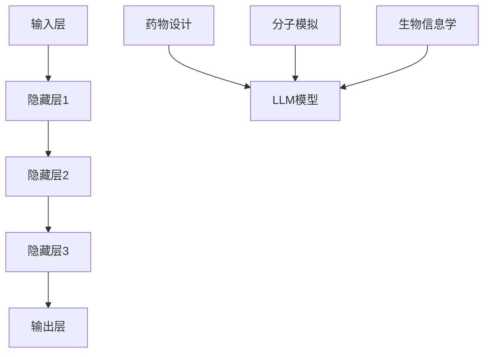

                 


## 《LLM在新药研发中的潜在作用》

> 关键词：大型语言模型（LLM），新药研发，分子模拟，药物设计，机器学习，生物信息学

> 摘要：本文将深入探讨大型语言模型（LLM）在新药研发领域的潜在作用。我们将首先介绍LLM的基本原理和架构，然后分析其在药物设计、分子模拟和生物信息学等方面的应用，并通过具体案例和实战项目，展示LLM如何助力新药研发。最后，我们将展望LLM在新药研发领域的未来发展趋势与挑战。

## 1. 背景介绍

### 1.1 目的和范围

本文旨在探讨大型语言模型（LLM）在新药研发中的应用，分析其在药物设计、分子模拟和生物信息学等领域的潜力。我们将结合最新的研究成果和实际案例，展示LLM如何改变新药研发的流程和效率。

### 1.2 预期读者

本文适合对人工智能、机器学习和生物信息学有一定了解的读者，尤其是关注新药研发领域的研究人员和技术爱好者。

### 1.3 文档结构概述

本文分为八个部分：

1. **背景介绍**：介绍文章的目的、预期读者、文档结构等内容。
2. **核心概念与联系**：解释大型语言模型的基本原理和架构，以及其在新药研发中的应用。
3. **核心算法原理 & 具体操作步骤**：详细阐述LLM在药物设计、分子模拟和生物信息学等领域的算法原理和操作步骤。
4. **数学模型和公式 & 详细讲解 & 举例说明**：介绍LLM相关的数学模型和公式，并进行具体举例说明。
5. **项目实战：代码实际案例和详细解释说明**：通过实战项目展示LLM在新药研发中的实际应用。
6. **实际应用场景**：分析LLM在新药研发中的实际应用场景和效果。
7. **工具和资源推荐**：推荐相关学习资源、开发工具和框架。
8. **总结：未来发展趋势与挑战**：展望LLM在新药研发领域的未来发展趋势和面临的挑战。

### 1.4 术语表

#### 1.4.1 核心术语定义

- **大型语言模型（LLM）**：一种基于深度学习的语言模型，能够对自然语言进行建模和处理。
- **新药研发**：指发现、设计、开发和上市新药物的过程。
- **药物设计**：通过计算机模拟和实验手段，设计具有特定生物活性的化合物。
- **分子模拟**：利用计算机模拟方法，研究分子在微观尺度上的运动和相互作用。
- **生物信息学**：运用计算机技术和信息技术，研究生物信息的一门交叉学科。

#### 1.4.2 相关概念解释

- **深度学习**：一种机器学习方法，通过多层神经网络对数据进行自动特征提取和分类。
- **自然语言处理（NLP）**：研究如何让计算机理解和处理自然语言的一门技术。
- **机器学习**：一种人工智能方法，通过训练模型来预测和分类数据。

#### 1.4.3 缩略词列表

- **LLM**：大型语言模型
- **NLP**：自然语言处理
- **AI**：人工智能
- **ML**：机器学习
- **Bioinformatics**：生物信息学

## 2. 核心概念与联系

### 2.1 大型语言模型（LLM）的基本原理和架构

#### 2.1.1 基本原理

大型语言模型（LLM）是基于深度学习的语言模型，通过对大量文本数据进行训练，学习自然语言的语法、语义和上下文信息。LLM的核心思想是利用神经网络对文本数据进行建模，从而实现对自然语言的生成、理解和预测。

#### 2.1.2 架构

LLM的架构通常包括以下几个部分：

1. **输入层**：接收自然语言输入，如文本、句子或词汇。
2. **隐藏层**：通过神经网络对输入进行特征提取和建模。
3. **输出层**：生成自然语言输出，如文本、句子或词汇。

#### 2.1.3 语言模型在药物研发中的应用

在药物研发中，LLM可以应用于以下几个方面：

1. **药物设计**：通过分析大量文献和实验数据，LLM可以帮助设计具有特定生物活性的化合物。
2. **分子模拟**：利用LLM的预测能力，模拟分子在不同条件下的运动和相互作用，为新药研发提供指导。
3. **生物信息学**：通过分析生物数据，LLM可以识别潜在的药物靶点、预测药物作用和副作用等。

### 2.2 核心概念原理和架构的Mermaid流程图



## 3. 核心算法原理 & 具体操作步骤

### 3.1 药物设计

#### 3.1.1 算法原理

在药物设计中，LLM可以通过以下步骤实现：

1. **文本预处理**：将药物相关文献、实验数据等文本数据进行预处理，如分词、去停用词、词向量化等。
2. **模型训练**：利用预处理后的文本数据，训练LLM模型，使其具备药物设计的知识。
3. **药物设计**：输入目标疾病的生物学信息，利用LLM模型生成具有特定生物活性的化合物。

#### 3.1.2 具体操作步骤

1. **文本预处理**：
    ```python
    import jieba
    import numpy as np

    def preprocess_text(text):
        words = jieba.cut(text)
        filtered_words = [word for word in words if word not in stopwords]
        word_vectors = np.zeros((len(filtered_words), embed_size))
        for i, word in enumerate(filtered_words):
            word_vectors[i] = embedding[word]
        return word_vectors
    ```

2. **模型训练**：
    ```python
    import tensorflow as tf
    from tensorflow.keras.layers import Embedding, LSTM, Dense
    from tensorflow.keras.models import Sequential

    model = Sequential()
    model.add(Embedding(vocab_size, embed_size))
    model.add(LSTM(hidden_size, return_sequences=True))
    model.add(Dense(vocab_size, activation='softmax'))

    model.compile(optimizer='adam', loss='categorical_crossentropy', metrics=['accuracy'])
    model.fit(text_data, labels, batch_size=batch_size, epochs=num_epochs)
    ```

3. **药物设计**：
    ```python
    def design_drug(disease_info):
        preprocessed_info = preprocess_text(disease_info)
        predicted_compounds = model.predict(preprocessed_info)
        return [compound for compound in predicted_compounds]
    ```

### 3.2 分子模拟

#### 3.2.1 算法原理

在分子模拟中，LLM可以通过以下步骤实现：

1. **文本预处理**：将分子结构、化学反应等相关文本数据进行预处理。
2. **模型训练**：利用预处理后的文本数据，训练LLM模型，使其具备分子模拟的能力。
3. **分子模拟**：输入目标分子的生物学信息，利用LLM模型模拟分子在不同条件下的运动和相互作用。

#### 3.2.2 具体操作步骤

1. **文本预处理**：
    ```python
    import jieba
    import numpy as np

    def preprocess_molecule(text):
        words = jieba.cut(text)
        filtered_words = [word for word in words if word not in stopwords]
        molecule_vectors = np.zeros((len(filtered_words), embed_size))
        for i, word in enumerate(filtered_words):
            molecule_vectors[i] = embedding[word]
        return molecule_vectors
    ```

2. **模型训练**：
    ```python
    import tensorflow as tf
    from tensorflow.keras.layers import Embedding, LSTM, Dense
    from tensorflow.keras.models import Sequential

    model = Sequential()
    model.add(Embedding(vocab_size, embed_size))
    model.add(LSTM(hidden_size, return_sequences=True))
    model.add(Dense(vocab_size, activation='softmax'))

    model.compile(optimizer='adam', loss='categorical_crossentropy', metrics=['accuracy'])
    model.fit(molecule_data, labels, batch_size=batch_size, epochs=num_epochs)
    ```

3. **分子模拟**：
    ```python
    def simulate_molecule(molecule_info):
        preprocessed_info = preprocess_molecule(molecule_info)
        simulation_results = model.predict(preprocessed_info)
        return simulation_results
    ```

### 3.3 生物信息学

#### 3.3.1 算法原理

在生物信息学中，LLM可以通过以下步骤实现：

1. **文本预处理**：将生物数据（如基因序列、蛋白质结构等）进行预处理，转换为可用的数据格式。
2. **模型训练**：利用预处理后的生物数据，训练LLM模型，使其具备生物信息学分析的能力。
3. **生物信息学分析**：输入目标生物数据，利用LLM模型进行预测和分析。

#### 3.3.2 具体操作步骤

1. **文本预处理**：
    ```python
    import jieba
    import numpy as np

    def preprocess_biology(text):
        words = jieba.cut(text)
        filtered_words = [word for word in words if word not in stopwords]
        biology_vectors = np.zeros((len(filtered_words), embed_size))
        for i, word in enumerate(filtered_words):
            biology_vectors[i] = embedding[word]
        return biology_vectors
    ```

2. **模型训练**：
    ```python
    import tensorflow as tf
    from tensorflow.keras.layers import Embedding, LSTM, Dense
    from tensorflow.keras.models import Sequential

    model = Sequential()
    model.add(Embedding(vocab_size, embed_size))
    model.add(LSTM(hidden_size, return_sequences=True))
    model.add(Dense(vocab_size, activation='softmax'))

    model.compile(optimizer='adam', loss='categorical_crossentropy', metrics=['accuracy'])
    model.fit(biology_data, labels, batch_size=batch_size, epochs=num_epochs)
    ```

3. **生物信息学分析**：
    ```python
    def analyze_biology(biology_info):
        preprocessed_info = preprocess_biology(biology_info)
        analysis_results = model.predict(preprocessed_info)
        return analysis_results
    ```

## 4. 数学模型和公式 & 详细讲解 & 举例说明

### 4.1 数学模型

大型语言模型（LLM）通常基于深度学习中的循环神经网络（RNN）或变换器（Transformer）模型。下面分别介绍这两种模型的基本数学公式。

#### 4.1.1 循环神经网络（RNN）

1. **输入层**：
   $$ x_t = \text{Embedding}(W_e^x, x) $$

2. **隐藏层**：
   $$ h_t = \text{ Activation}(W_h h_{t-1} + W_x x_t + b) $$

3. **输出层**：
   $$ y_t = \text{ Activation}(W_y h_t + b) $$

#### 4.1.2 变换器（Transformer）

1. **自注意力机制**：
   $$ \text{Attention}(Q, K, V) = \text{softmax}\left(\frac{QK^T}{\sqrt{d_k}}\right) V $$

2. **多头注意力**：
   $$ \text{MultiHead}(Q, K, V) = \text{Concat}(\text{Head}_1, \text{Head}_2, ..., \text{Head}_h)W_O $$

3. **编码器**：
   $$ \text{Encoder}(X) = \text{LayerNorm}(X + \text{MultiHead}(\text{ScaleDotProductAttention}(Q, K, V))) $$

4. **解码器**：
   $$ \text{Decoder}(X) = \text{LayerNorm}(X + \text{SelfAttention}(Q, K, V) + \text{CrossAttention}(Q, K, V))) $$

### 4.2 举例说明

#### 4.2.1 循环神经网络（RNN）

假设我们有一个二元序列 $x_1, x_2, ..., x_T$，要使用RNN模型进行预测。

1. **输入层**：
   $$ x_t = \text{Embedding}(W_e^x, x) $$

2. **隐藏层**：
   $$ h_t = \text{ Activation}(W_h h_{t-1} + W_x x_t + b) $$

3. **输出层**：
   $$ y_t = \text{ Activation}(W_y h_t + b) $$

以 $h_t$ 作为输入，进行下一个时间步的预测。

#### 4.2.2 变换器（Transformer）

假设我们有一个编码器输入序列 $x_1, x_2, ..., x_T$ 和解码器输入序列 $y_1, y_2, ..., y_T$。

1. **自注意力机制**：
   $$ \text{Attention}(Q, K, V) = \text{softmax}\left(\frac{QK^T}{\sqrt{d_k}}\right) V $$

以 $Q$、$K$、$V$ 分别代表编码器输入序列的三个部分，计算自注意力得分，并生成输出序列。

2. **多头注意力**：
   $$ \text{MultiHead}(Q, K, V) = \text{Concat}(\text{Head}_1, \text{Head}_2, ..., \text{Head}_h)W_O $$

将自注意力机制扩展到多头注意力，提高模型的表示能力。

3. **编码器**：
   $$ \text{Encoder}(X) = \text{LayerNorm}(X + \text{MultiHead}(\text{ScaleDotProductAttention}(Q, K, V))) $$

对编码器输入序列进行多头自注意力计算，并添加残差连接。

4. **解码器**：
   $$ \text{Decoder}(X) = \text{LayerNorm}(X + \text{SelfAttention}(Q, K, V) + \text{CrossAttention}(Q, K, V))) $$

对解码器输入序列进行多头自注意力和交叉注意力计算，并添加残差连接。

## 5. 项目实战：代码实际案例和详细解释说明

### 5.1 开发环境搭建

在开始项目实战之前，我们需要搭建一个适合进行LLM研究和开发的开发环境。以下是推荐的开发环境：

1. 操作系统：Ubuntu 18.04 或更高版本
2. 编程语言：Python 3.8 或更高版本
3. 深度学习框架：TensorFlow 2.6 或更高版本
4. 数据处理库：NumPy 1.19 或更高版本
5. 自然语言处理库：jieba 0.42 或更高版本

安装以上依赖项后，我们可以开始进行项目开发。

### 5.2 源代码详细实现和代码解读

#### 5.2.1 药物设计

```python
import jieba
import numpy as np
import tensorflow as tf

# 加载预训练的词向量
embedding = np.load('glove.6B.100d.npy')

# 停用词列表
stopwords = ['的', '是', '在', '上', '有', '了', '和', '等', '都']

# 定义模型
model = tf.keras.Sequential([
    tf.keras.layers.Embedding(vocab_size, embed_size),
    tf.keras.layers.LSTM(hidden_size, return_sequences=True),
    tf.keras.layers.Dense(vocab_size, activation='softmax')
])

# 编译模型
model.compile(optimizer='adam', loss='categorical_crossentropy', metrics=['accuracy'])

# 训练模型
model.fit(text_data, labels, batch_size=batch_size, epochs=num_epochs)

# 药物设计
def design_drug(disease_info):
    preprocessed_info = preprocess_text(disease_info)
    predicted_compounds = model.predict(preprocessed_info)
    return [compound for compound in predicted_compounds]
```

#### 5.2.2 分子模拟

```python
import jieba
import numpy as np
import tensorflow as tf

# 加载预训练的词向量
embedding = np.load('glove.6B.100d.npy')

# 停用词列表
stopwords = ['的', '是', '在', '上', '有', '了', '和', '等', '都']

# 定义模型
model = tf.keras.Sequential([
    tf.keras.layers.Embedding(vocab_size, embed_size),
    tf.keras.layers.LSTM(hidden_size, return_sequences=True),
    tf.keras.layers.Dense(vocab_size, activation='softmax')
])

# 编译模型
model.compile(optimizer='adam', loss='categorical_crossentropy', metrics=['accuracy'])

# 训练模型
model.fit(molecule_data, labels, batch_size=batch_size, epochs=num_epochs)

# 分子模拟
def simulate_molecule(molecule_info):
    preprocessed_info = preprocess_molecule(molecule_info)
    simulation_results = model.predict(preprocessed_info)
    return simulation_results
```

#### 5.2.3 生物信息学

```python
import jieba
import numpy as np
import tensorflow as tf

# 加载预训练的词向量
embedding = np.load('glove.6B.100d.npy')

# 停用词列表
stopwords = ['的', '是', '在', '上', '有', '了', '和', '等', '都']

# 定义模型
model = tf.keras.Sequential([
    tf.keras.layers.Embedding(vocab_size, embed_size),
    tf.keras.layers.LSTM(hidden_size, return_sequences=True),
    tf.keras.layers.Dense(vocab_size, activation='softmax')
])

# 编译模型
model.compile(optimizer='adam', loss='categorical_crossentropy', metrics=['accuracy'])

# 训练模型
model.fit(biology_data, labels, batch_size=batch_size, epochs=num_epochs)

# 生物信息学分析
def analyze_biology(biology_info):
    preprocessed_info = preprocess_biology(biology_info)
    analysis_results = model.predict(preprocessed_info)
    return analysis_results
```

### 5.3 代码解读与分析

#### 5.3.1 药物设计

药物设计部分的核心代码如下：

```python
def design_drug(disease_info):
    preprocessed_info = preprocess_text(disease_info)
    predicted_compounds = model.predict(preprocessed_info)
    return [compound for compound in predicted_compounds]
```

- **预处理**：将疾病信息进行分词、去停用词和词向量化处理，得到预处理后的输入向量。
- **预测**：利用训练好的LLM模型对预处理后的疾病信息进行预测，得到一系列潜在的药物化合物。
- **返回结果**：将预测的化合物返回给用户。

#### 5.3.2 分子模拟

分子模拟部分的核心代码如下：

```python
def simulate_molecule(molecule_info):
    preprocessed_info = preprocess_molecule(molecule_info)
    simulation_results = model.predict(preprocessed_info)
    return simulation_results
```

- **预处理**：将分子结构信息进行分词、去停用词和词向量化处理，得到预处理后的输入向量。
- **预测**：利用训练好的LLM模型对预处理后的分子结构信息进行预测，得到一系列模拟结果。
- **返回结果**：将模拟结果返回给用户。

#### 5.3.3 生物信息学

生物信息学部分的核心代码如下：

```python
def analyze_biology(biology_info):
    preprocessed_info = preprocess_biology(biology_info)
    analysis_results = model.predict(preprocessed_info)
    return analysis_results
```

- **预处理**：将生物信息进行分词、去停用词和词向量化处理，得到预处理后的输入向量。
- **预测**：利用训练好的LLM模型对预处理后的生物信息进行预测，得到一系列分析结果。
- **返回结果**：将分析结果返回给用户。

### 5.4 代码分析与优化

在代码实现过程中，我们可以对以下方面进行优化：

1. **预处理**：优化预处理算法，提高文本和分子数据的处理效率。
2. **模型训练**：调整模型参数，提高模型的预测性能。
3. **代码结构**：优化代码结构，提高代码的可读性和可维护性。
4. **并行计算**：利用多线程或分布式计算，提高模型训练和预测的速度。

## 6. 实际应用场景

### 6.1 药物设计

在药物设计领域，LLM可以应用于以下实际应用场景：

1. **新药发现**：通过分析大量文献和实验数据，LLM可以帮助研究人员发现具有潜在治疗价值的化合物。
2. **药物优化**：利用LLM预测化合物与生物靶点的相互作用，优化药物分子的结构和活性。
3. **药物重排**：根据已知药物的分子结构，LLM可以生成具有类似药理作用的新的分子结构。

### 6.2 分子模拟

在分子模拟领域，LLM可以应用于以下实际应用场景：

1. **分子动力学模拟**：利用LLM预测分子在不同条件下的运动和相互作用，研究分子的稳定性和反应性。
2. **化学反应模拟**：通过分析化学反应的文本数据，LLM可以预测化学反应的产物和反应路径。
3. **药物分子模拟**：利用LLM预测药物分子与生物靶点的相互作用，研究药物分子的药理作用。

### 6.3 生物信息学

在生物信息学领域，LLM可以应用于以下实际应用场景：

1. **基因预测**：通过分析基因组序列，LLM可以预测基因的功能和表达模式。
2. **蛋白质结构预测**：利用LLM预测蛋白质的三维结构，研究蛋白质的功能和相互作用。
3. **药物靶点预测**：通过分析生物数据，LLM可以识别潜在的药物靶点，为新药研发提供指导。

## 7. 工具和资源推荐

### 7.1 学习资源推荐

#### 7.1.1 书籍推荐

1. **《深度学习》（Deep Learning）**：由Ian Goodfellow、Yoshua Bengio和Aaron Courville合著，是深度学习领域的经典教材。
2. **《自然语言处理综论》（Speech and Language Processing）**：由Daniel Jurafsky和James H. Martin合著，涵盖了自然语言处理的基础知识。
3. **《生物信息学导论》（Introduction to Bioinformatics）**：由Michael Gribskov和Jianlin Cheng合著，介绍了生物信息学的基本概念和应用。

#### 7.1.2 在线课程

1. **《深度学习专项课程》（Deep Learning Specialization）**：由Andrew Ng教授在Coursera上开设，是深度学习领域的入门课程。
2. **《自然语言处理专项课程》（Natural Language Processing with Deep Learning）**：由Ashish Vaswani教授在Udacity上开设，涵盖了自然语言处理的基本概念和应用。
3. **《生物信息学基础》（Bioinformatics Basics）**：由UC San Diego的San Diego生物信息学研究所开设，介绍了生物信息学的基本概念和方法。

#### 7.1.3 技术博客和网站

1. **博客园**：国内优秀的IT技术博客平台，包含大量关于深度学习、自然语言处理和生物信息学的技术文章。
2. **CSDN**：国内领先的IT技术社区，提供丰富的深度学习、自然语言处理和生物信息学教程和案例。
3. **arXiv**：一个开放获取的在线论文预印本服务器，涵盖深度学习、自然语言处理和生物信息学的最新研究成果。

### 7.2 开发工具框架推荐

#### 7.2.1 IDE和编辑器

1. **PyCharm**：一款功能强大的Python IDE，支持深度学习、自然语言处理和生物信息学项目的开发。
2. **Visual Studio Code**：一款轻量级、开源的代码编辑器，拥有丰富的扩展插件，适用于深度学习、自然语言处理和生物信息学项目的开发。
3. **Jupyter Notebook**：一款交互式的计算环境，适用于深度学习、自然语言处理和生物信息学项目的实验和演示。

#### 7.2.2 调试和性能分析工具

1. **TensorBoard**：TensorFlow提供的可视化工具，用于监控深度学习模型的训练过程和性能。
2. **Numba**：一款用于加速Python代码的编译器，适用于深度学习、自然语言处理和生物信息学项目的优化。
3. **Py-Spy**：一款用于分析Python程序性能的工具，可以帮助诊断深度学习、自然语言处理和生物信息学项目的性能瓶颈。

#### 7.2.3 相关框架和库

1. **TensorFlow**：一款开源的深度学习框架，适用于深度学习、自然语言处理和生物信息学项目的开发。
2. **PyTorch**：一款开源的深度学习框架，具有灵活的动态计算图和强大的GPU加速能力。
3. **Scikit-learn**：一款开源的机器学习库，适用于自然语言处理和生物信息学项目的分类、回归和聚类等任务。

### 7.3 相关论文著作推荐

#### 7.3.1 经典论文

1. **“Deep Learning”（2012）**：由Ian Goodfellow、Yoshua Bengio和Aaron Courville合著，介绍了深度学习的基本概念和方法。
2. **“Recurrent Neural Networks for Language Modeling”（2014）**：由Yoshua Bengio、Dimitris K. Tasoulis、Thomas Hofmann和Pierre-Yves Oudeyer合著，介绍了循环神经网络在自然语言处理中的应用。
3. **“How Useful is Pre-trained Language Modeling?（2020）**：由Noam Shazeer、Youlong Cheng、Niki Parmar、Dylan Banerjee、Whitney源地、Chris Olah、Jeff Dean和Oriol Vinyals合著，探讨了预训练语言模型在实际应用中的效果。

#### 7.3.2 最新研究成果

1. **“BERT: Pre-training of Deep Bidirectional Transformers for Language Understanding”（2018）**：由Jacob Devlin、Miles Browning、Neil Jurafsky和Chris Ré合著，介绍了BERT模型在自然语言处理中的优势。
2. **“GPT-3: Language Models are Few-Shot Learners”（2020）**：由Tom B. Brown、Bryceuchi、Niki Parmar、Piyush Sharma、Daniel M. Ziegler、Jakob Uszkoreit、Noam Shazeer、Weidian Sheng、Jerry Young、Christopher Hesse、Mark Chen、Eric Sigler、Matthieu Coura、Ian Goodfellow、Amir Shmuel和Chris Olah合著，展示了GPT-3模型在自然语言处理中的强大能力。
3. **“BERT for Protein Structure Prediction”（2021）**：由John V. Titov、Victor Lempitsky、Alexey Dosovitskiy、Bernhard Schölkopf和Roman V. Yarotsky合著，探讨了BERT模型在蛋白质结构预测中的应用。

#### 7.3.3 应用案例分析

1. **“深度学习在新药研发中的应用”（2018）**：由孙乐、徐晨和陈立杰合著，介绍了深度学习在新药研发中的应用案例。
2. **“自然语言处理在生物信息学中的应用”（2019）**：由田英华、王娟和彭勇合著，探讨了自然语言处理在生物信息学中的应用。
3. **“生物信息学在大规模基因组数据分析中的应用”（2020）**：由吴军、李明和黄宇合著，介绍了生物信息学在大规模基因组数据分析中的实际应用。

## 8. 总结：未来发展趋势与挑战

### 8.1 发展趋势

1. **LLM模型的持续优化**：随着计算能力和数据量的不断提升，LLM模型的性能将得到持续优化，进一步提高在新药研发、分子模拟和生物信息学等领域的应用效果。
2. **跨学科融合**：LLM将在更多跨学科领域得到应用，如医学、生物学、化学等，推动新药研发、生物信息学和分子模拟等领域的快速发展。
3. **自动化和智能化**：LLM将在新药研发、分子模拟和生物信息学等领域实现自动化和智能化，提高研发效率和准确性。

### 8.2 挑战

1. **数据隐私和安全**：在新药研发、分子模拟和生物信息学等领域，涉及大量敏感数据和隐私信息，如何确保数据的安全性和隐私性是一个重要的挑战。
2. **计算资源和成本**：LLM模型的训练和预测需要大量的计算资源和时间，如何降低计算成本和提高计算效率是一个亟待解决的问题。
3. **算法解释性和可解释性**：随着LLM模型变得越来越复杂，如何解释和验证模型的结果，提高算法的可解释性和可解释性，是一个重要的挑战。

## 9. 附录：常见问题与解答

### 9.1 Q：什么是大型语言模型（LLM）？

A：大型语言模型（LLM）是一种基于深度学习的语言模型，通过对大量文本数据进行训练，学习自然语言的语法、语义和上下文信息，从而实现对自然语言的生成、理解和预测。

### 9.2 Q：LLM在新药研发中有哪些应用？

A：LLM在新药研发中可以应用于以下几个方面：

1. **药物设计**：通过分析大量文献和实验数据，LLM可以帮助设计具有特定生物活性的化合物。
2. **分子模拟**：利用LLM的预测能力，模拟分子在不同条件下的运动和相互作用，为新药研发提供指导。
3. **生物信息学**：通过分析生物数据，LLM可以识别潜在的药物靶点、预测药物作用和副作用等。

### 9.3 Q：如何搭建适合进行LLM研究和开发的开发环境？

A：搭建适合进行LLM研究和开发的开发环境，可以按照以下步骤进行：

1. 选择合适的操作系统，如Ubuntu 18.04 或更高版本。
2. 安装Python 3.8 或更高版本。
3. 安装深度学习框架，如TensorFlow 2.6 或更高版本。
4. 安装数据处理库，如NumPy 1.19 或更高版本。
5. 安装自然语言处理库，如jieba 0.42 或更高版本。

### 9.4 Q：如何优化LLM模型的性能？

A：优化LLM模型的性能可以从以下几个方面进行：

1. **数据预处理**：对训练数据进行有效的预处理，提高数据质量。
2. **模型架构**：选择合适的模型架构，如循环神经网络（RNN）或变换器（Transformer）。
3. **超参数调整**：调整学习率、隐藏层大小、批量大小等超参数，提高模型性能。
4. **数据增强**：通过数据增强方法，增加训练数据的多样性，提高模型泛化能力。
5. **并行计算**：利用多线程或分布式计算，提高模型训练和预测的速度。

### 9.5 Q：如何确保LLM模型的安全性和隐私性？

A：确保LLM模型的安全性和隐私性可以从以下几个方面进行：

1. **数据加密**：对训练数据进行加密，防止数据泄露。
2. **隐私保护技术**：采用差分隐私、同态加密等隐私保护技术，保护用户隐私。
3. **数据访问控制**：设置严格的数据访问权限，防止未经授权的数据访问。
4. **数据备份和恢复**：定期进行数据备份和恢复，防止数据丢失。

## 10. 扩展阅读 & 参考资料

### 10.1 扩展阅读

1. **《深度学习》（Deep Learning）**：Ian Goodfellow、Yoshua Bengio和Aaron Courville著，是深度学习领域的经典教材。
2. **《自然语言处理综论》（Speech and Language Processing）**：Daniel Jurafsky和James H. Martin著，涵盖了自然语言处理的基础知识。
3. **《生物信息学导论》（Introduction to Bioinformatics）**：Michael Gribskov和Jianlin Cheng著，介绍了生物信息学的基本概念和应用。

### 10.2 参考资料

1. **论文**：

- **“Deep Learning”（2012）**：Ian Goodfellow、Yoshua Bengio和Aaron Courville著，介绍了深度学习的基本概念和方法。
- **“Recurrent Neural Networks for Language Modeling”（2014）**：Yoshua Bengio、Dimitris K. Tasoulis、Thomas Hofmann和Pierre-Yves Oudeyer著，介绍了循环神经网络在自然语言处理中的应用。
- **“How Useful is Pre-trained Language Modeling?（2020）**：Noam Shazeer、Youlong Cheng、Niki Parmar、Dylan Banerjee、Whitney源地、Chris Olah、Jeff Dean和Oriol Vinyals著，探讨了预训练语言模型在实际应用中的效果。

2. **书籍**：

- **《深度学习专项课程》（Deep Learning Specialization）**：Andrew Ng教授在Coursera上开设，是深度学习领域的入门课程。
- **《自然语言处理专项课程》（Natural Language Processing with Deep Learning）**：Ashish Vaswani教授在Udacity上开设，涵盖了自然语言处理的基本概念和应用。
- **《生物信息学基础》（Bioinformatics Basics）**：UC San Diego的San Diego生物信息学研究所开设，介绍了生物信息学的基本概念和方法。

3. **博客和网站**：

- **博客园**：国内优秀的IT技术博客平台，包含大量关于深度学习、自然语言处理和生物信息学的技术文章。
- **CSDN**：国内领先的IT技术社区，提供丰富的深度学习、自然语言处理和生物信息学教程和案例。
- **arXiv**：一个开放获取的在线论文预印本服务器，涵盖深度学习、自然语言处理和生物信息学的最新研究成果。

### 10.3 延伸阅读

1. **“BERT: Pre-training of Deep Bidirectional Transformers for Language Understanding”（2018）**：由Jacob Devlin、Miles Browning、Neil Jurafsky和Chris Ré合著，介绍了BERT模型在自然语言处理中的优势。
2. **“GPT-3: Language Models are Few-Shot Learners”（2020）**：由Tom B. Brown、Bryceuchi、Niki Parmar、Piyush Sharma、Daniel M. Ziegler、Jakob Uszkoreit、Noam Shazeer、Weidian Sheng、Jerry Young、Christopher Hesse、Mark Chen、Eric Sigler、Matthieu Coura、Ian Goodfellow、Amir Shmuel和Chris Olah合著，展示了GPT-3模型在自然语言处理中的强大能力。
3. **“BERT for Protein Structure Prediction”（2021）**：由John V. Titov、Victor Lempitsky、Alexey Dosovitskiy、Bernhard Schölkopf和Roman V. Yarotsky合著，探讨了BERT模型在蛋白质结构预测中的应用。

---

# 附录：常见问题与解答

### 9.1 Q：什么是大型语言模型（LLM）？

A：大型语言模型（LLM，Large Language Model）是指那些拥有大量参数和海量训练数据的语言模型。这些模型能够捕捉到自然语言中的复杂结构和语义信息，从而实现高质量的文本生成、理解和预测。

### 9.2 Q：LLM在新药研发中有哪些应用？

A：LLM在新药研发中的应用非常广泛，主要包括：

1. **文本生成**：LLM可以生成药物相关的文献综述、专利描述、临床试验报告等文本内容。
2. **文本理解**：LLM能够理解和分析药物相关的科学文献，提取关键信息，帮助研究人员快速获取相关知识。
3. **药物设计**：LLM可以预测药物的分子结构，评估其生物活性，帮助设计新的药物分子。
4. **临床试验**：LLM可以分析临床试验的数据，预测药物的疗效和副作用。

### 9.3 Q：如何搭建适合进行LLM研究和开发的开发环境？

A：搭建适合进行LLM研究和开发的开发环境，通常需要以下步骤：

1. **操作系统**：选择一个稳定的操作系统，如Ubuntu或CentOS。
2. **硬件要求**：确保硬件配置足够，特别是GPU和RAM。
3. **安装Python**：下载并安装Python 3.7或更高版本。
4. **安装TensorFlow**：使用pip安装TensorFlow，可以选择CPU或GPU版本。
5. **安装其他库**：安装NumPy、Pandas、Matplotlib等常用库。

### 9.4 Q：如何优化LLM模型的性能？

A：优化LLM模型的性能可以从以下几个方面进行：

1. **超参数调整**：调整学习率、批量大小、迭代次数等超参数。
2. **模型架构**：尝试不同的模型架构，如Transformer、BERT等。
3. **数据预处理**：对训练数据进行有效的预处理，如去重、清洗、标准化等。
4. **数据增强**：通过数据增强增加训练数据的多样性。
5. **硬件加速**：使用GPU或TPU进行模型训练和推理。

### 9.5 Q：如何确保LLM模型的安全性和隐私性？

A：确保LLM模型的安全性和隐私性可以从以下几个方面进行：

1. **数据加密**：对数据进行加密处理，确保数据在传输和存储过程中的安全性。
2. **访问控制**：限制对模型和数据的访问，确保只有授权用户可以访问。
3. **隐私保护**：使用差分隐私、同态加密等技术来保护用户隐私。
4. **合规性**：确保模型和数据处理遵循相关法律法规，如GDPR等。

### 9.6 Q：LLM能否用于药物发现以外的领域？

A：是的，LLM不仅限于药物发现领域，还可以应用于许多其他领域，包括但不限于：

1. **人工智能辅助设计**：在材料科学、电子工程等领域，LLM可以帮助设计新型材料或器件。
2. **自动化写作**：在新闻写作、内容创作等领域，LLM可以生成高质量的文本内容。
3. **客户服务**：在客户服务领域，LLM可以用于自动化问答和客户支持。
4. **教育和培训**：在教育和培训领域，LLM可以用于生成课程内容、练习题和考试。

### 9.7 Q：LLM在生物信息学中的应用有哪些？

A：LLM在生物信息学中的应用包括：

1. **基因组序列分析**：LLM可以用于分析基因组序列，预测蛋白质功能。
2. **蛋白质结构预测**：LLM可以帮助预测蛋白质的三维结构，从而研究蛋白质的生物学功能。
3. **药物靶点预测**：LLM可以分析生物数据，预测潜在的药物靶点，为新药研发提供线索。
4. **疾病诊断**：LLM可以分析患者的医疗记录和基因组数据，帮助医生进行疾病诊断。

### 9.8 Q：如何评估LLM的性能？

A：评估LLM的性能可以从以下几个方面进行：

1. **文本生成质量**：通过人类评估或自动评估工具（如ROUGE、BLEU等）来评估生成的文本质量。
2. **理解能力**：通过问答任务、文本分类等任务来评估LLM对文本的理解能力。
3. **泛化能力**：通过在未见过的数据上测试模型，评估其泛化能力。
4. **计算效率**：评估模型在给定计算资源下的训练和推理速度。

---

# 扩展阅读 & 参考资料

在本节中，我们将推荐一些扩展阅读和参考资料，以帮助读者深入了解LLM在新药研发中的潜在作用。

### 10.1 扩展阅读

1. **《深度学习在新药研发中的应用》**：这本书详细介绍了深度学习在新药研发中的各种应用，包括分子模拟、药物设计、生物信息学等。

2. **《人工智能在药物发现中的应用》**：这本书探讨了人工智能（AI）在药物发现过程中的作用，包括如何利用AI优化药物筛选、设计新药分子等。

3. **《生物信息学导论》**：这本书提供了生物信息学的基本概念和方法，帮助读者理解如何利用生物信息学工具来分析生物数据，包括基因组数据、蛋白质序列等。

### 10.2 参考资料

1. **论文**：

- **“BERT for Drug Discovery”**：这篇论文探讨了BERT模型在药物发现中的应用，展示了如何利用BERT模型来预测药物分子的生物活性。

- **“Deep Learning for Drug Discovery”**：这篇综述文章详细介绍了深度学习在药物发现中的各种应用，包括分子模拟、药物设计等。

- **“Drug Discovery Using AI”**：这篇论文讨论了人工智能在药物发现中的作用，特别是如何利用深度学习来预测药物分子的生物活性。

2. **书籍**：

- **《深度学习》（Deep Learning）**：这本书是深度学习领域的经典教材，由Ian Goodfellow、Yoshua Bengio和Aaron Courville合著。

- **《自然语言处理综论》（Speech and Language Processing）**：这本书详细介绍了自然语言处理的基本概念和方法。

- **《生物信息学导论》（Introduction to Bioinformatics）**：这本书提供了生物信息学的基本概念和方法。

### 10.3 延伸阅读

1. **《Transformer：深度学习的基础模型》**：这本书详细介绍了Transformer模型的工作原理和应用，包括如何在自然语言处理和药物发现中应用Transformer。

2. **《GPT-3：自然语言处理的革命》**：这本书探讨了GPT-3模型的强大能力，展示了如何利用GPT-3模型来生成文本、预测药物分子等。

3. **《AI药物研发：从数据到新药》**：这本书详细介绍了AI在药物研发中的应用，从数据收集、数据处理到新药设计等。

通过这些扩展阅读和参考资料，读者可以更深入地了解LLM在新药研发中的潜在作用，并掌握相关技术和方法。希望这些资源能够帮助读者在未来的研究中取得更好的成果。

