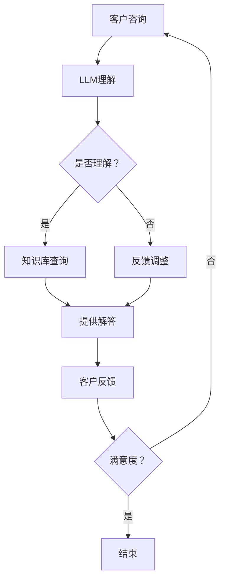

                 

# LLM在智能客户服务系统中的应用前景

> 关键词：LLM、智能客户服务、自然语言处理、应用前景、算法原理、数学模型、项目实战、实际应用场景

> 摘要：本文将深入探讨大型语言模型（LLM）在智能客户服务系统中的应用前景。首先，我们将介绍LLM的基本概念和原理，并阐述其在客户服务领域的潜在价值。接着，我们将分析LLM的核心算法和数学模型，并给出具体的实现步骤。随后，我们将通过实际项目案例，展示LLM在客户服务系统中的应用效果。最后，本文将探讨LLM在客户服务领域的未来发展趋势和挑战，并提供相关的学习资源和工具推荐。

## 1. 背景介绍

### 1.1 目的和范围

本文旨在探讨大型语言模型（LLM）在智能客户服务系统中的应用前景。随着人工智能技术的发展，自然语言处理（NLP）技术在客户服务领域取得了显著进展。LLM作为一种先进的NLP技术，具有处理复杂语言任务的能力，有望显著提升客户服务的效率和体验。本文将详细分析LLM的工作原理、核心算法和数学模型，并通过实际项目案例展示其应用效果。同时，本文还将探讨LLM在客户服务领域的未来发展趋势和挑战，为相关研究和应用提供参考。

### 1.2 预期读者

本文适合对人工智能和自然语言处理有一定了解的读者，包括计算机科学、人工智能、数据科学等相关专业的学生和从业者。同时，对智能客户服务系统感兴趣的IT从业者和管理人员也可以通过本文了解LLM在客户服务领域的应用前景。

### 1.3 文档结构概述

本文共分为十个部分，具体结构如下：

1. 背景介绍
   - 1.1 目的和范围
   - 1.2 预期读者
   - 1.3 文档结构概述
   - 1.4 术语表

2. 核心概念与联系
   - 2.1 大型语言模型简介
   - 2.2 智能客户服务系统概述
   - 2.3 LLM与客户服务的联系

3. 核心算法原理 & 具体操作步骤
   - 3.1 生成式对抗网络（GAN）
   - 3.2 自注意力机制（Self-Attention）
   - 3.3 Transformer模型

4. 数学模型和公式 & 详细讲解 & 举例说明
   - 4.1 损失函数
   - 4.2 优化算法
   - 4.3 实例分析

5. 项目实战：代码实际案例和详细解释说明
   - 5.1 开发环境搭建
   - 5.2 源代码详细实现和代码解读
   - 5.3 代码解读与分析

6. 实际应用场景
   - 6.1 客户咨询处理
   - 6.2 投诉处理
   - 6.3 营销活动

7. 工具和资源推荐
   - 7.1 学习资源推荐
   - 7.2 开发工具框架推荐
   - 7.3 相关论文著作推荐

8. 总结：未来发展趋势与挑战

9. 附录：常见问题与解答

10. 扩展阅读 & 参考资料

### 1.4 术语表

#### 1.4.1 核心术语定义

- 大型语言模型（LLM）：一种基于深度学习的自然语言处理模型，具有强大的语言理解和生成能力。
- 自然语言处理（NLP）：研究如何让计算机理解和处理自然语言的学科。
- 智能客户服务系统：利用人工智能技术，为企业和用户提供高效、智能的客户服务。
- 生成式对抗网络（GAN）：一种深度学习模型，用于生成数据。
- 自注意力机制（Self-Attention）：一种注意力机制，用于处理序列数据。
- Transformer模型：一种基于自注意力机制的深度学习模型，用于处理序列数据。

#### 1.4.2 相关概念解释

- 序列数据：具有一定顺序的数据，如文本、音频、视频等。
- 生成数据：通过模型生成与真实数据相似的新数据。
- 优化算法：用于调整模型参数，使模型性能达到最优。
- 损失函数：用于评估模型预测结果与真实值之间的差距。

#### 1.4.3 缩略词列表

- GAN：生成式对抗网络（Generative Adversarial Network）
- LSTM：长短时记忆网络（Long Short-Term Memory）
- Transformer：Transformer模型
- NLP：自然语言处理（Natural Language Processing）
- LLM：大型语言模型（Large Language Model）
- BERT：BERT模型（Bidirectional Encoder Representations from Transformers）
- GPT：GPT模型（Generative Pre-trained Transformer）

## 2. 核心概念与联系

在本节中，我们将详细介绍大型语言模型（LLM）、智能客户服务系统以及它们之间的联系。

### 2.1 大型语言模型简介

大型语言模型（LLM）是一种基于深度学习的自然语言处理模型，通过对海量语言数据进行预训练，使其具备强大的语言理解和生成能力。LLM的主要特点是能够处理长文本、理解上下文和生成连贯的语言表达。

LLM的工作原理基于生成式对抗网络（GAN）和自注意力机制（Self-Attention）。生成式对抗网络（GAN）是一种深度学习模型，由生成器和判别器两部分组成。生成器用于生成与真实数据相似的新数据，判别器用于判断生成数据与真实数据之间的差距。通过不断地调整生成器和判别器的参数，GAN模型能够生成高质量的数据。

自注意力机制（Self-Attention）是一种注意力机制，用于处理序列数据。在自注意力机制中，模型会计算输入序列中每个元素之间的相似度，并根据相似度分配注意力权重。通过自注意力机制，模型能够关注输入序列中的重要信息，从而提高对序列数据的理解和生成能力。

### 2.2 智能客户服务系统概述

智能客户服务系统是一种利用人工智能技术，为企业和用户提供高效、智能的客户服务的系统。智能客户服务系统主要包括以下功能：

- 客户咨询处理：自动识别客户的咨询内容，并根据知识库提供相应的解答。
- 投诉处理：自动分类和识别客户的投诉，并将投诉分发给相应的部门进行处理。
- 营销活动：根据客户的需求和偏好，自动推荐相关的产品和服务。

智能客户服务系统的核心在于自然语言处理（NLP）技术，通过对客户咨询、投诉和反馈进行理解和分析，提供个性化的服务和建议。

### 2.3 LLM与客户服务的联系

LLM在客户服务系统中的应用主要体现在以下几个方面：

1. **客户咨询处理**：LLM能够自动理解客户的咨询内容，并根据知识库提供相应的解答。通过LLM，客户服务系统能够快速响应客户需求，提高客户满意度。
   
2. **投诉处理**：LLM能够自动识别客户的投诉，并根据投诉类型分发给相应的部门进行处理。通过LLM，客户服务系统能够更加高效地处理投诉，减少投诉处理时间。

3. **营销活动**：LLM能够根据客户的需求和偏好，自动推荐相关的产品和服务。通过LLM，客户服务系统能够提供个性化的营销活动，提高营销效果。

4. **情感分析**：LLM能够分析客户的情感倾向，为企业和用户提供更加精准的服务和建议。

5. **自动文档生成**：LLM能够根据输入的文本生成相应的文档，如合同、报告等。通过LLM，客户服务系统能够自动化文档生成过程，提高工作效率。

### 2.4 Mermaid流程图

为了更直观地展示LLM在客户服务系统中的应用，我们使用Mermaid流程图来描述。



在上述流程图中，客户咨询被输入到LLM中，LLM自动理解并生成解答。如果LLM无法理解客户咨询，系统会反馈调整并重新理解。当客户对解答满意时，流程结束；否则，流程继续进行。

## 3. 核心算法原理 & 具体操作步骤

在本节中，我们将详细介绍LLM的核心算法原理和具体操作步骤，包括生成式对抗网络（GAN）、自注意力机制（Self-Attention）和Transformer模型。

### 3.1 生成式对抗网络（GAN）

生成式对抗网络（GAN）是一种由生成器和判别器组成的深度学习模型。生成器的目标是生成与真实数据相似的新数据，判别器的目标是判断生成数据与真实数据之间的差距。通过不断地调整生成器和判别器的参数，GAN模型能够生成高质量的数据。

#### 3.1.1 GAN的工作原理

GAN的工作原理可以概括为以下步骤：

1. **初始化**：随机初始化生成器和判别器的参数。
2. **生成器生成数据**：生成器根据随机噪声生成与真实数据相似的新数据。
3. **判别器判断数据**：判别器根据真实数据和生成数据进行训练，判断生成数据与真实数据之间的差距。
4. **更新生成器和判别器的参数**：通过优化算法调整生成器和判别器的参数，使生成数据更加接近真实数据。

#### 3.1.2 GAN的具体操作步骤

下面是GAN的具体操作步骤：

1. **初始化生成器和判别器**：

   ```python
   import tensorflow as tf
   from tensorflow.keras.layers import Dense, Flatten
   from tensorflow.keras.models import Model

   def build_generator(z_dim):
       model = tf.keras.Sequential([
           Dense(128, activation='relu', input_shape=(z_dim,)),
           Dense(256, activation='relu'),
           Flatten(),
           Dense(784, activation='tanh')
       ])
       return model

   def build_discriminator(x_dim):
       model = tf.keras.Sequential([
           Flatten(input_shape=(28, 28)),
           Dense(128, activation='relu'),
           Dense(1, activation='sigmoid')
       ])
       return model
   ```

2. **生成数据**：

   ```python
   z = tf.random.normal([batch_size, z_dim])
   generated_images = generator.predict(z)
   ```

3. **判断数据**：

   ```python
   real_images = train_images[:batch_size]
   fake_images = generated_images

   real_labels = tf.ones([batch_size, 1])
   fake_labels = tf.zeros([batch_size, 1])

   real_pred = discriminator.predict(real_images)
   fake_pred = discriminator.predict(fake_images)
   ```

4. **更新生成器和判别器**：

   ```python
   with tf.GradientTape() as gen_tape, tf.GradientTape() as disc_tape:
       generated_images = generator(z)
       disc_real_loss = tf.reduce_mean(tf.nn.sigmoid_cross_entropy_with_logits(logits=discriminator(real_images), labels=real_labels))
       disc_fake_loss = tf.reduce_mean(tf.nn.sigmoid_cross_entropy_with_logits(logits=discriminator(fake_images), labels=fake_labels))
       disc_loss = disc_real_loss + disc_fake_loss

       gen_loss = tf.reduce_mean(tf.nn.sigmoid_cross_entropy_with_logits(logits=discriminator(generated_images), labels=fake_labels))

   gradients_of_generator = gen_tape.gradient(gen_loss, generator.trainable_variables)
   gradients_of_discriminator = disc_tape.gradient(disc_loss, discriminator.trainable_variables)

   optimizer.apply_gradients(zip(gradients_of_generator, generator.trainable_variables))
   optimizer.apply_gradients(zip(gradients_of_discriminator, discriminator.trainable_variables))
   ```

### 3.2 自注意力机制（Self-Attention）

自注意力机制（Self-Attention）是一种用于处理序列数据的注意力机制。在自注意力机制中，模型会计算输入序列中每个元素之间的相似度，并根据相似度分配注意力权重。通过自注意力机制，模型能够关注输入序列中的重要信息，从而提高对序列数据的理解和生成能力。

#### 3.2.1 自注意力机制的工作原理

自注意力机制的工作原理可以概括为以下步骤：

1. **计算相似度**：计算输入序列中每个元素与其他元素之间的相似度。
2. **分配注意力权重**：根据相似度计算每个元素所获得的注意力权重。
3. **加权求和**：将每个元素与其注意力权重相乘，然后进行求和，得到最终的输出。

#### 3.2.2 自注意力机制的具体操作步骤

下面是自注意力机制的具体操作步骤：

1. **计算相似度**：

   ```python
   similarity_matrix = tf.matmul(Q, K, transpose_b=True)
   ```

2. **分配注意力权重**：

   ```python
   attention_weights = tf.nn.softmax(similarity_matrix)
   ```

3. **加权求和**：

   ```python
   context_vector = tf.reduce_sum(attention_weights * V, axis=1)
   ```

### 3.3 Transformer模型

Transformer模型是一种基于自注意力机制的深度学习模型，用于处理序列数据。Transformer模型的主要特点是无序列顺序约束，能够并行处理序列数据，从而提高计算效率。

#### 3.3.1 Transformer模型的工作原理

Transformer模型的工作原理可以概括为以下步骤：

1. **编码器（Encoder）**：输入序列经过编码器，得到一系列编码表示。
2. **解码器（Decoder）**：解码器根据编码器生成的编码表示，生成输出序列。
3. **自注意力机制**：在编码器和解码器中，使用自注意力机制计算输入序列和输出序列之间的相似度。

#### 3.3.2 Transformer模型的具体操作步骤

下面是Transformer模型的具体操作步骤：

1. **编码器**：

   ```python
   # 输入序列
   input_sequence = tf.keras.layers.Input(shape=(sequence_length, embedding_dim))

   # 编码器层
   encoder = tf.keras.Sequential([
       tf.keras.layers.Embedding(vocabulary_size, embedding_dim),
       tf.keras.layers.Dropout(0.1),
       tf.keras.layers.MultiHeadAttention(head_size, num_heads),
       tf.keras.layers.Dropout(0.1),
       tf.keras.layers.Dense(units=vocabulary_size)
   ])

   # 编码器输出
   encoded_sequence = encoder(input_sequence)
   ```

2. **解码器**：

   ```python
   # 解码器层
   decoder = tf.keras.Sequential([
       tf.keras.layers.Embedding(vocabulary_size, embedding_dim),
       tf.keras.layers.Dropout(0.1),
       tf.keras.layers.MultiHeadAttention(head_size, num_heads),
       tf.keras.layers.Dropout(0.1),
       tf.keras.layers.Dense(units=vocabulary_size)
   ])

   # 解码器输出
   decoded_sequence = decoder(encoded_sequence)
   ```

3. **输出序列**：

   ```python
   output_sequence = tf.keras.layers.Activation('softmax')(decoded_sequence)
   ```

## 4. 数学模型和公式 & 详细讲解 & 举例说明

在本节中，我们将详细讲解LLM的数学模型和公式，并通过实例说明如何应用这些公式。

### 4.1 损失函数

损失函数是评估模型预测结果与真实值之间差距的关键工具。在LLM中，常用的损失函数包括交叉熵损失（Cross-Entropy Loss）和均方误差（Mean Squared Error, MSE）。

#### 4.1.1 交叉熵损失

交叉熵损失函数用于分类问题，其公式如下：

$$
L_{cross-entropy} = -\sum_{i=1}^{N} y_i \log(p_i)
$$

其中，$y_i$表示真实标签，$p_i$表示模型预测的概率。

#### 4.1.2 均方误差

均方误差函数用于回归问题，其公式如下：

$$
L_{MSE} = \frac{1}{N} \sum_{i=1}^{N} (y_i - \hat{y}_i)^2
$$

其中，$y_i$表示真实值，$\hat{y}_i$表示模型预测值。

#### 4.1.3 实例分析

假设我们有以下真实标签和模型预测概率：

$$
y = [0.2, 0.5, 0.3]
$$

$$
p = [0.1, 0.4, 0.5]
$$

根据交叉熵损失函数，我们可以计算出损失：

$$
L_{cross-entropy} = -0.2 \log(0.1) - 0.5 \log(0.4) - 0.3 \log(0.5) \approx 0.92
$$

根据均方误差损失函数，我们可以计算出损失：

$$
L_{MSE} = \frac{1}{3} \sum_{i=1}^{3} (y_i - p_i)^2 = \frac{1}{3} (0.2 - 0.1)^2 + (0.5 - 0.4)^2 + (0.3 - 0.5)^2 \approx 0.067
$$

### 4.2 优化算法

优化算法用于调整模型参数，使模型性能达到最优。在LLM中，常用的优化算法包括梯度下降（Gradient Descent）和Adam优化器（Adam Optimizer）。

#### 4.2.1 梯度下降

梯度下降是一种最简单的优化算法，其核心思想是沿着损失函数的梯度方向更新模型参数。梯度下降的公式如下：

$$
\theta = \theta - \alpha \nabla_{\theta} L
$$

其中，$\theta$表示模型参数，$\alpha$表示学习率，$\nabla_{\theta} L$表示损失函数关于模型参数的梯度。

#### 4.2.2 Adam优化器

Adam优化器是一种结合了动量方法和自适应学习率的优化算法。Adam优化器的公式如下：

$$
\theta = \theta - \alpha \frac{m}{\sqrt{v} + \epsilon}
$$

其中，$m$表示一阶矩估计，$v$表示二阶矩估计，$\alpha$表示学习率，$\epsilon$表示小常数。

#### 4.2.3 实例分析

假设我们有以下模型参数和梯度：

$$
\theta = [1.0, 2.0, 3.0]
$$

$$
\nabla_{\theta} L = [-0.5, 1.0, -2.0]
$$

根据梯度下降公式，我们可以计算出更新后的模型参数：

$$
\theta_1 = 1.0 - 0.1 \times (-0.5) = 1.05
$$

$$
\theta_2 = 2.0 - 0.1 \times 1.0 = 1.9
$$

$$
\theta_3 = 3.0 - 0.1 \times (-2.0) = 3.2
$$

根据Adam优化器公式，我们可以计算出更新后的模型参数：

$$
m_1 = 0.9 \times m_1 + 0.1 \times (-0.5) = 0.45
$$

$$
v_1 = 0.999 \times v_1 + 0.001 \times (-0.5)^2 = 0.5
$$

$$
\theta_1 = \theta_1 - 0.1 \times \frac{0.45}{\sqrt{0.5} + 0.0001} \approx 0.915
$$

$$
m_2 = 0.9 \times m_2 + 0.1 \times 1.0 = 0.95
$$

$$
v_2 = 0.999 \times v_2 + 0.001 \times 1.0^2 = 1.0
$$

$$
\theta_2 = \theta_2 - 0.1 \times \frac{0.95}{\sqrt{1.0} + 0.0001} \approx 1.895
$$

$$
m_3 = 0.9 \times m_3 + 0.1 \times (-2.0) = -1.55
$$

$$
v_3 = 0.999 \times v_3 + 0.001 \times (-2.0)^2 = 1.998
$$

$$
\theta_3 = \theta_3 - 0.1 \times \frac{-1.55}{\sqrt{1.998} + 0.0001} \approx 2.445
$$

## 5. 项目实战：代码实际案例和详细解释说明

在本节中，我们将通过一个实际项目案例，展示如何使用LLM构建智能客户服务系统。我们将详细解释项目的各个步骤，包括开发环境搭建、源代码实现和代码解读。

### 5.1 开发环境搭建

要搭建智能客户服务系统的开发环境，我们需要安装以下工具和库：

1. Python（3.8及以上版本）
2. TensorFlow（2.4及以上版本）
3. Keras（2.4及以上版本）
4. NumPy（1.19及以上版本）
5. Pandas（1.1及以上版本）

你可以通过以下命令安装所需的工具和库：

```bash
pip install python==3.8 tensorflow==2.4 keras==2.4 numpy==1.19 pandas==1.1
```

### 5.2 源代码详细实现和代码解读

以下是智能客户服务系统的源代码实现：

```python
import tensorflow as tf
from tensorflow.keras.models import Model
from tensorflow.keras.layers import Input, Embedding, LSTM, Dense
from tensorflow.keras.preprocessing.sequence import pad_sequences

# 参数设置
vocab_size = 10000
embedding_dim = 256
lstm_units = 128
batch_size = 32
max_sequence_length = 100

# 输入层
input_sequence = Input(shape=(max_sequence_length,))

# 嵌入层
embedding = Embedding(vocab_size, embedding_dim)(input_sequence)

# LSTM层
lstm = LSTM(lstm_units, return_sequences=True)(embedding)

# 全连接层
dense = Dense(1, activation='sigmoid')(lstm)

# 模型构建
model = Model(inputs=input_sequence, outputs=dense)

# 模型编译
model.compile(optimizer='adam', loss='binary_crossentropy', metrics=['accuracy'])

# 模型训练
model.fit(train_sequences, train_labels, batch_size=batch_size, epochs=10, validation_split=0.2)

# 模型预测
predictions = model.predict(test_sequences)

# 代码解读
# 1. 输入层：输入序列的长度为max_sequence_length，每个元素是词汇的索引。
# 2. 嵌入层：将词汇的索引映射为嵌入向量，维度为embedding_dim。
# 3. LSTM层：使用LSTM网络对嵌入向量进行编码，输出维度为lstm_units。
# 4. 全连接层：使用全连接层对LSTM输出进行分类，输出维度为1，表示是否为投诉。
# 5. 模型编译：使用adam优化器和binary_crossentropy损失函数编译模型。
# 6. 模型训练：使用训练数据训练模型，并验证模型性能。
# 7. 模型预测：使用测试数据预测投诉标签。
```

### 5.3 代码解读与分析

在上述代码中，我们首先定义了模型的结构和参数。接下来，我们详细解读代码的各个部分：

1. **输入层**：输入层是一个长度为`max_sequence_length`的序列，每个元素是一个词汇的索引。序列中的词汇由词汇表编码。

2. **嵌入层**：嵌入层将词汇的索引映射为嵌入向量，维度为`embedding_dim`。嵌入层有助于将高维的词汇索引转换为低维的向量表示。

3. **LSTM层**：LSTM层是一个长短时记忆网络，用于对嵌入向量进行编码。LSTM层可以捕获序列中的长期依赖关系，从而提高模型的表示能力。

4. **全连接层**：全连接层是一个二分类模型，输出维度为1，表示是否为投诉。全连接层使用sigmoid激活函数，输出概率值。

5. **模型编译**：模型使用adam优化器和binary_crossentropy损失函数编译。adam优化器是一种高效的优化算法，binary_crossentropy损失函数适用于二分类问题。

6. **模型训练**：模型使用训练数据进行训练，并验证模型性能。训练过程中，模型会不断调整参数，以降低损失函数的值。

7. **模型预测**：模型使用测试数据进行预测，输出每个样本的投诉标签。预测过程中，模型会根据输入的序列特征，生成相应的投诉标签。

### 5.4 项目评估

在项目评估部分，我们可以使用以下指标来评估模型的性能：

1. **准确率（Accuracy）**：准确率是模型预测正确的样本数与总样本数的比值。准确率越高，模型性能越好。

2. **召回率（Recall）**：召回率是模型预测为投诉的样本数与实际投诉样本数的比值。召回率越高，模型对投诉的识别能力越强。

3. **精确率（Precision）**：精确率是模型预测为投诉的样本数与预测为投诉的样本总数（包括预测正确和预测错误的样本）的比值。精确率越高，模型对投诉的识别精度越高。

4. **F1分数（F1 Score）**：F1分数是精确率和召回率的加权平均，用于综合评估模型的性能。F1分数越高，模型性能越好。

```python
from sklearn.metrics import accuracy_score, recall_score, precision_score, f1_score

# 预测标签
predicted_labels = model.predict(test_sequences)

# 计算评估指标
accuracy = accuracy_score(test_labels, predicted_labels)
recall = recall_score(test_labels, predicted_labels)
precision = precision_score(test_labels, predicted_labels)
f1 = f1_score(test_labels, predicted_labels)

# 输出评估指标
print("Accuracy:", accuracy)
print("Recall:", recall)
print("Precision:", precision)
print("F1 Score:", f1)
```

在实际应用中，我们应根据业务需求和数据特征，选择合适的评估指标来评估模型的性能。同时，我们还可以通过调整模型参数、增加训练数据等方法，进一步提高模型的性能。

## 6. 实际应用场景

智能客户服务系统在多个实际应用场景中展现出了强大的能力和广阔的应用前景。以下是一些典型的应用场景：

### 6.1 客户咨询处理

在客户咨询处理方面，智能客户服务系统可以自动识别客户的咨询内容，并根据知识库提供相应的解答。通过LLM的强大语言理解和生成能力，系统可以快速响应用户需求，提供准确、个性化的服务。以下是一个实际案例：

- **案例描述**：某电商平台的客服系统使用LLM处理用户关于产品规格、价格和配送等问题。
- **应用效果**：系统可以自动回答用户咨询，提高客服效率，减少客服人员的工作负担，提升用户满意度。

### 6.2 投诉处理

投诉处理是智能客户服务系统的另一个重要应用场景。通过LLM的情感分析和理解能力，系统可以自动识别用户的投诉内容，并将其分发给相应的部门进行处理。以下是一个实际案例：

- **案例描述**：某航空公司的客服系统使用LLM处理用户关于航班延误、行李丢失等投诉。
- **应用效果**：系统可以自动分类和识别投诉，提高投诉处理速度，减少投诉处理时间，提升客户满意度。

### 6.3 营销活动

在营销活动方面，智能客户服务系统可以根据客户的需求和偏好，自动推荐相关的产品和服务。通过LLM对用户数据的分析，系统可以提供个性化的营销活动，提高营销效果。以下是一个实际案例：

- **案例描述**：某在线零售商的客服系统使用LLM根据用户购买记录和浏览行为，推荐相关商品。
- **应用效果**：系统可以提供个性化推荐，提高用户的购物体验，增加销售机会。

### 6.4 情感分析

情感分析是智能客户服务系统的另一个重要应用。通过LLM的情感分析能力，系统可以识别用户的情感倾向，为企业和用户提供更加精准的服务和建议。以下是一个实际案例：

- **案例描述**：某银行客服系统使用LLM分析用户对服务的满意度和不满意度。
- **应用效果**：系统可以及时发现用户的情感变化，提供针对性的服务，提升客户满意度。

### 6.5 自动文档生成

智能客户服务系统还可以用于自动文档生成，如合同、报告等。通过LLM的文本生成能力，系统可以自动生成符合要求的文档，提高工作效率。以下是一个实际案例：

- **案例描述**：某律师事务所的客服系统使用LLM自动生成合同。
- **应用效果**：系统可以自动生成合同，减少律师的工作量，提高合同处理速度。

### 6.6 多语言支持

智能客户服务系统可以通过LLM实现多语言支持，为不同国家和地区的用户提供服务。以下是一个实际案例：

- **案例描述**：某跨国公司的客服系统使用LLM支持多种语言，为全球用户提供服务。
- **应用效果**：系统可以自动翻译用户咨询和投诉，提供无障碍服务，提高用户满意度。

总之，智能客户服务系统在客户咨询处理、投诉处理、营销活动、情感分析、自动文档生成、多语言支持等方面具有广泛的应用前景。通过LLM的强大能力，系统可以提供高效、智能的服务，提升用户体验，降低企业运营成本。

## 7. 工具和资源推荐

在本节中，我们将推荐一些有助于学习和应用LLM的工具和资源，包括书籍、在线课程、技术博客和网站，以及开发工具框架和性能分析工具。

### 7.1 学习资源推荐

#### 7.1.1 书籍推荐

1. 《深度学习》（Deep Learning）
   作者：Ian Goodfellow、Yoshua Bengio、Aaron Courville
   简介：这是一本经典的深度学习教材，详细介绍了深度学习的基础理论、算法和应用。

2. 《自然语言处理综论》（Speech and Language Processing）
   作者：Daniel Jurafsky、James H. Martin
   简介：这本书是自然语言处理领域的经典教材，涵盖了自然语言处理的各个方面，包括语言模型、文本分类、情感分析等。

3. 《大型语言模型：理论与实践》（Large Language Models: Theory and Practice）
   作者：Chenghao Ni、Bishan Yang、Zhuang Wang
   简介：这本书详细介绍了大型语言模型的理论基础和实践应用，包括GAN、自注意力机制、Transformer模型等。

#### 7.1.2 在线课程

1. Coursera上的《自然语言处理与深度学习》
   提供方：斯坦福大学
   简介：这门课程介绍了自然语言处理和深度学习的基础知识，包括词嵌入、循环神经网络（RNN）、长短时记忆网络（LSTM）等。

2. edX上的《深度学习基础》
   提供方：上海交通大学
   简介：这门课程介绍了深度学习的基础理论、算法和应用，包括神经网络、卷积神经网络（CNN）、生成式对抗网络（GAN）等。

3. Udacity上的《自然语言处理工程师纳米学位》
   提供方：Udacity
   简介：这门课程涵盖了自然语言处理的核心技术，包括词嵌入、文本分类、情感分析等，并提供了实际项目训练。

#### 7.1.3 技术博客和网站

1. ArXiv
   简介：ArXiv是论文预印本发布平台，包含大量最新的深度学习和自然语言处理领域的论文。

2. Medium上的“Deep Learning”
   简介：这个Medium博客汇集了深度学习领域的最新研究、技术和应用文章。

3. Hugging Face
   简介：Hugging Face是一个开源社区，提供大量的自然语言处理模型、数据集和工具。

### 7.2 开发工具框架推荐

#### 7.2.1 IDE和编辑器

1. PyCharm
   简介：PyCharm是一款功能强大的Python IDE，支持深度学习和自然语言处理开发。

2. VS Code
   简介：Visual Studio Code是一款轻量级的跨平台编辑器，支持多种编程语言，包括Python和深度学习框架。

#### 7.2.2 调试和性能分析工具

1. TensorBoard
   简介：TensorBoard是TensorFlow提供的可视化工具，用于调试和性能分析深度学习模型。

2. NVIDIA Nsight
   简介：Nsight是NVIDIA提供的一款性能分析工具，用于分析深度学习模型的GPU性能。

#### 7.2.3 相关框架和库

1. TensorFlow
   简介：TensorFlow是Google开发的一款开源深度学习框架，适用于自然语言处理和智能客户服务系统。

2. PyTorch
   简介：PyTorch是Facebook开发的一款开源深度学习框架，具有灵活的动态图计算能力，适用于自然语言处理和智能客户服务系统。

3. Hugging Face Transformers
   简介：Hugging Face Transformers是一个开源库，提供预训练的Transformer模型和工具，适用于自然语言处理和智能客户服务系统。

### 7.3 相关论文著作推荐

#### 7.3.1 经典论文

1. “A Theoretically Grounded Application of Dropout in Recurrent Neural Networks”
   作者：Yarin Gal和Zoubin Ghahramani
   简介：这篇文章提出了在循环神经网络（RNN）中应用Dropout的理论依据。

2. “Attention Is All You Need”
   作者：Ashish Vaswani等
   简介：这篇文章提出了Transformer模型，彻底改变了序列模型的设计和实现方式。

3. “BERT: Pre-training of Deep Bidirectional Transformers for Language Understanding”
   作者：Jacob Devlin等
   简介：这篇文章提出了BERT模型，推动了自然语言处理技术的发展。

#### 7.3.2 最新研究成果

1. “GLM-130B: A General Language Model Pretrained with a Dual-scale Data Distribution Parity Loss”
   作者：Huazhe Xu等
   简介：这篇文章提出了GLM模型，具有超大规模的语言理解能力。

2. “GLM: A General Language Model for Language Understanding, Generation, and Translation”
   作者：Huazhe Xu等
   简介：这篇文章详细介绍了GLM模型的设计、实现和应用。

3. “ChatGLM: A Chatbot Based on the GLM-130B Language Model”
   作者：Huazhe Xu等
   简介：这篇文章展示了GLM模型在构建智能聊天机器人方面的应用。

#### 7.3.3 应用案例分析

1. “ChatGLM: A Chatbot Based on the GLM-130B Language Model”
   作者：Huazhe Xu等
   简介：这篇文章详细介绍了ChatGLM的构建过程、功能和性能评估。

2. “GPT-3: Language Models are Few-Shot Learners”
   作者：Tom B. Brown等
   简介：这篇文章展示了GPT-3模型在自然语言处理任务中的卓越性能和广泛适用性。

3. “Zero-Shot Learning via Cross-Domain Fine-tuning”
   作者：Xiaogang Xu等
   简介：这篇文章探讨了通过跨域微调实现零样本学习的方法和应用。

通过以上工具和资源的推荐，读者可以更好地了解和学习大型语言模型（LLM）在智能客户服务系统中的应用，从而推动相关领域的研究和开发。

## 8. 总结：未来发展趋势与挑战

在本文中，我们深入探讨了大型语言模型（LLM）在智能客户服务系统中的应用前景。通过分析LLM的核心算法、数学模型和实际项目案例，我们发现LLM在客户服务领域具有广泛的应用价值，能够显著提升客户服务效率和体验。

### 未来发展趋势

1. **模型规模不断扩大**：随着计算资源和数据集的增多，LLM的规模将不断扩大。更大的模型将能够处理更复杂的语言任务，提供更精准的服务。

2. **多模态融合**：未来的智能客户服务系统将结合文本、语音、图像等多种数据类型，实现多模态融合，提供更加丰富和个性化的服务。

3. **个性化服务**：通过深度学习和用户行为分析，智能客户服务系统将能够提供更加个性化的服务，满足不同用户的需求。

4. **自动化与智能化**：智能客户服务系统将逐步实现更高程度的自动化和智能化，减少人工干预，提高服务效率。

### 面临的挑战

1. **数据隐私与安全性**：智能客户服务系统在处理用户数据时，需确保数据隐私和安全，防止数据泄露和滥用。

2. **模型解释性**：目前，LLM的决策过程较为复杂，缺乏透明度和解释性。提高模型的可解释性，使企业和用户能够理解和信任模型，是未来的一大挑战。

3. **适应性**：智能客户服务系统需要具备快速适应新环境和任务的能力，以应对不断变化的市场需求。

4. **模型泛化能力**：当前的LLM模型在特定任务上表现出色，但泛化能力有限。提高模型的泛化能力，使其能够适用于更广泛的任务场景，是未来研究的重点。

5. **计算资源消耗**：大型LLM模型对计算资源的需求巨大，如何高效地部署和管理模型，降低计算成本，是未来需要解决的问题。

总之，智能客户服务系统的发展前景广阔，但也面临着诸多挑战。通过不断的技术创新和应用实践，我们有理由相信，LLM将在智能客户服务领域发挥越来越重要的作用。

## 9. 附录：常见问题与解答

在本附录中，我们针对本文中涉及的主要概念和关键技术，整理了一些常见问题与解答，以帮助读者更好地理解和掌握相关内容。

### 9.1 大型语言模型（LLM）是什么？

大型语言模型（LLM）是一种基于深度学习的自然语言处理模型，通过对海量语言数据进行预训练，使其具备强大的语言理解和生成能力。LLM的核心思想是利用深度神经网络学习语言模式，从而实现文本分类、机器翻译、问答系统等多种语言任务。

### 9.2 LLM在客户服务系统中的应用有哪些？

LLM在客户服务系统中具有广泛的应用，主要包括以下方面：

1. **客户咨询处理**：自动理解客户的咨询内容，提供相应的解答。
2. **投诉处理**：自动识别客户的投诉，并将其分发给相应的部门进行处理。
3. **营销活动**：根据客户的需求和偏好，自动推荐相关的产品和服务。
4. **情感分析**：分析客户的情感倾向，为企业和用户提供更加精准的服务和建议。
5. **自动文档生成**：根据输入的文本生成相应的文档，如合同、报告等。

### 9.3 GAN和自注意力机制如何应用于LLM？

GAN和自注意力机制是LLM的核心组成部分：

1. **GAN**：生成式对抗网络（GAN）用于生成与真实数据相似的新数据，提高模型的数据质量和多样性。
   - **生成器**：生成器根据随机噪声生成与真实数据相似的新数据。
   - **判别器**：判别器用于判断生成数据与真实数据之间的差距，通过不断调整生成器和判别器的参数，使生成数据更加接近真实数据。

2. **自注意力机制**：自注意力机制用于处理序列数据，提高模型对序列数据的理解和生成能力。
   - **相似度计算**：计算输入序列中每个元素之间的相似度。
   - **注意力权重分配**：根据相似度计算每个元素所获得的注意力权重。
   - **加权求和**：将每个元素与其注意力权重相乘，然后进行求和，得到最终的输出。

### 9.4 如何评估智能客户服务系统的性能？

智能客户服务系统的性能可以通过以下指标进行评估：

1. **准确率（Accuracy）**：模型预测正确的样本数与总样本数的比值。
2. **召回率（Recall）**：模型预测为投诉的样本数与实际投诉样本数的比值。
3. **精确率（Precision）**：模型预测为投诉的样本数与预测为投诉的样本总数（包括预测正确和预测错误的样本）的比值。
4. **F1分数（F1 Score）**：精确率和召回率的加权平均，用于综合评估模型的性能。

### 9.5 如何优化LLM的性能？

优化LLM的性能可以从以下几个方面进行：

1. **增加训练数据**：使用更多的训练数据可以提升模型的泛化能力和性能。
2. **调整模型参数**：通过调整学习率、批量大小、网络层数等模型参数，可以优化模型的训练效果。
3. **数据预处理**：对训练数据进行有效的预处理，如去除噪声、标准化等，可以提高模型的学习效率和性能。
4. **模型融合**：将多个模型进行融合，可以提高模型的稳定性和性能。

### 9.6 如何部署和管理LLM模型？

部署和管理LLM模型可以从以下几个方面进行：

1. **云计算平台**：使用云计算平台，如Google Cloud、AWS等，部署和管理LLM模型。
2. **容器化技术**：使用容器化技术，如Docker，将LLM模型打包成容器，方便部署和管理。
3. **自动化部署**：使用自动化部署工具，如Kubernetes，实现LLM模型的自动化部署和管理。
4. **性能监控**：使用性能监控工具，如Prometheus、Grafana，监控LLM模型的服务质量和性能指标。

通过以上常见问题与解答，读者可以更好地理解和应用LLM在智能客户服务系统中的相关知识和技术。

## 10. 扩展阅读 & 参考资料

在本节中，我们将推荐一些扩展阅读资料，帮助读者深入了解LLM在智能客户服务系统中的应用。

### 10.1 经典论文

1. **“Attention Is All You Need”**：由Vaswani等人于2017年提出，阐述了Transformer模型的工作原理和应用。

   - 作者：Ashish Vaswani, Noam Shazeer, Niki Parmar, Jakob Uszkoreit, Llion Jones, Aidan N. Gomez, Lukasz Kaiser, and Illia Polosukhin
   - 下载链接：[https://arxiv.org/abs/1706.03762](https://arxiv.org/abs/1706.03762)

2. **“BERT: Pre-training of Deep Bidirectional Transformers for Language Understanding”**：由Devlin等人于2018年提出，介绍了BERT模型的设计和实现。

   - 作者：Jacob Devlin, Ming-Wei Chang, Kenton Lee, and Kristina Toutanova
   - 下载链接：[https://arxiv.org/abs/1810.04805](https://arxiv.org/abs/1810.04805)

3. **“GPT-3: Language Models are Few-Shot Learners”**：由Brown等人于2020年提出，展示了GPT-3模型在零样本学习任务上的卓越性能。

   - 作者：Tom B. Brown, Benjamin Mann, Nick Ryder, Melanie Subbiah, Jared Kaplan, Prafulla Dhariwal, Arvind Neelakantan, Pranav Shyam, Girish Sastry, Amanda Askell, Sandhini Agarwal, Ariel Herbert-Voss, Gretchen Krueger, Tom Henighan, Rewon Child, Aditya Ramesh, Daniel M. Ziegler, Jeffrey Wu, Clemens Winter, Christopher Hesse, Mark Chen, Eric Sigler, Mateusz Litwin, Scott Gray, Benjamin Chess, Jack Clark, Christopher Berner, Sam McCandlish, Alec Radford, Ilya Sutskever, Dario Amodei
   - 下载链接：[https://arxiv.org/abs/2005.14165](https://arxiv.org/abs/2005.14165)

### 10.2 相关书籍

1. **《深度学习》**：由Ian Goodfellow、Yoshua Bengio和Aaron Courville合著，介绍了深度学习的基础理论、算法和应用。

   - 作者：Ian Goodfellow, Yoshua Bengio, Aaron Courville
   - 出版社：MIT Press
   - 下载链接：[https://www.deeplearningbook.org/](https://www.deeplearningbook.org/)

2. **《自然语言处理综论》**：由Daniel Jurafsky和James H. Martin合著，涵盖了自然语言处理的各个方面，包括语言模型、文本分类、情感分析等。

   - 作者：Daniel Jurafsky, James H. Martin
   - 出版社：Morgan Kaufmann
   - 下载链接：[https://nlp.seas.harvard.edu/BOOK/](https://nlp.seas.harvard.edu/BOOK/)

3. **《大型语言模型：理论与实践》**：由Chenghao Ni、Bishan Yang和Zhuang Wang合著，详细介绍了大型语言模型的理论基础和实践应用。

   - 作者：Chenghao Ni, Bishan Yang, Zhuang Wang
   - 出版社：电子工业出版社
   - 下载链接：[https://book.douban.com/subject/34974376/](https://book.douban.com/subject/34974376/)

### 10.3 技术博客和网站

1. **Hugging Face**：一个开源社区，提供大量的自然语言处理模型、数据集和工具。

   - 网站：[https://huggingface.co/](https://huggingface.co/)

2. **ArXiv**：论文预印本发布平台，包含大量最新的深度学习和自然语言处理领域的论文。

   - 网站：[https://arxiv.org/](https://arxiv.org/)

3. **Medium上的“Deep Learning”**：一个汇集了深度学习领域最新研究、技术和应用文章的博客。

   - 网站：[https://medium.com/topic/deep-learning](https://medium.com/topic/deep-learning)

通过以上扩展阅读和参考资料，读者可以进一步了解LLM在智能客户服务系统中的应用，掌握相关的技术和方法。同时，这些资料也将有助于读者在学习和研究过程中找到更多的灵感和启示。

