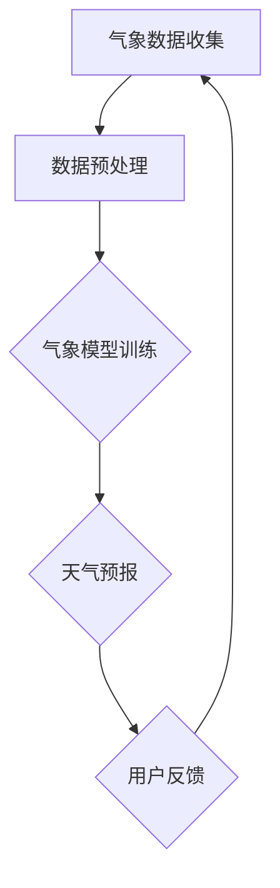
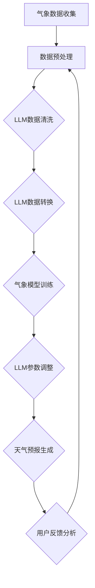
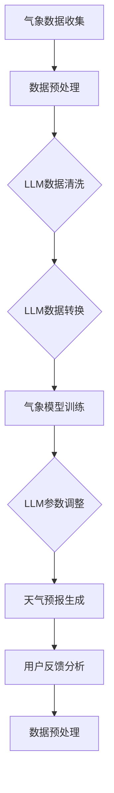

                 

# LLM在智能气象预报中的潜在作用

> 关键词：LLM、智能气象预报、深度学习、数据预处理、模型训练、气象数据、天气预报

> 摘要：本文旨在探讨大型语言模型（LLM）在智能气象预报中的潜在应用。首先，我们将回顾气象预报的历史背景和现状，接着详细分析LLM的工作原理，以及如何将其应用于气象数据预处理和模型训练。最后，我们将通过实际案例展示LLM在智能气象预报中的具体应用，并讨论其未来发展趋势与挑战。

## 1. 背景介绍

### 1.1 目的和范围

本文的主要目的是探讨大型语言模型（LLM）在智能气象预报中的潜在作用。智能气象预报是一个复杂的领域，涉及到大量的数据分析和预测。随着深度学习技术的发展，尤其是LLM的出现，气象预报的准确性和效率得到了显著提升。本文将深入分析LLM的工作原理及其在气象预报中的应用，帮助读者理解这一前沿技术的实际价值。

本文的范围包括以下几个方面：

1. 气象预报的基本概念和历史发展。
2. LLM的基本原理和技术特点。
3. LLM在气象数据预处理和模型训练中的应用。
4. LLM在智能气象预报中的具体案例研究。
5. LLM在气象预报领域的未来发展趋势与挑战。

### 1.2 预期读者

本文预期读者主要包括以下几类：

1. 气象科学家和气象预报专家，对智能气象预报领域有浓厚兴趣。
2. 人工智能和深度学习研究者，希望了解LLM在具体领域的应用。
3. 软件工程师和程序员，对气象数据和模型训练有兴趣。
4. 对科技创新和未来发展趋势感兴趣的一般读者。

### 1.3 文档结构概述

本文结构如下：

1. **背景介绍**：介绍气象预报和LLM的基本概念，以及本文的目的和范围。
2. **核心概念与联系**：介绍气象预报的核心概念，并使用Mermaid流程图展示其架构。
3. **核心算法原理 & 具体操作步骤**：详细阐述LLM的工作原理，使用伪代码进行讲解。
4. **数学模型和公式 & 详细讲解 & 举例说明**：介绍LLM的数学模型，使用LaTeX格式展示。
5. **项目实战：代码实际案例和详细解释说明**：通过实际案例展示LLM在气象预报中的应用。
6. **实际应用场景**：讨论LLM在气象预报中的实际应用。
7. **工具和资源推荐**：推荐学习资源和开发工具。
8. **总结：未来发展趋势与挑战**：讨论LLM在气象预报领域的未来趋势和挑战。
9. **附录：常见问题与解答**：回答读者可能遇到的常见问题。
10. **扩展阅读 & 参考资料**：提供进一步阅读的资源和参考资料。

### 1.4 术语表

#### 1.4.1 核心术语定义

- **气象预报**：对未来天气状况的预测，通常基于历史数据和物理原理。
- **大型语言模型（LLM）**：一种能够理解和生成人类语言的深度学习模型，如GPT系列模型。
- **深度学习**：一种机器学习技术，通过多层神经网络对数据进行学习和预测。
- **数据预处理**：在模型训练之前对数据进行清洗、转换和归一化等操作。
- **模型训练**：使用大量数据训练模型，使其能够进行预测和分类。

#### 1.4.2 相关概念解释

- **气象数据**：关于天气状况的各类数据，如温度、湿度、风速、气压等。
- **天气预报**：对未来天气状况的预测，通常包括短期和长期预报。
- **输入特征**：模型训练时输入的数据特征，如气象数据中的各种参数。
- **输出结果**：模型预测的天气状况，如温度、降水概率等。

#### 1.4.3 缩略词列表

- **LLM**：Large Language Model，大型语言模型。
- **GPT**：Generative Pre-trained Transformer，生成预训练变换器。
- **CNN**：Convolutional Neural Network，卷积神经网络。
- **RNN**：Recurrent Neural Network，循环神经网络。

## 2. 核心概念与联系

在深入探讨LLM在智能气象预报中的应用之前，我们首先需要了解气象预报的核心概念和其工作流程。下面将使用Mermaid流程图展示气象预报的架构，并解释其中的关键组件。



### 2.1 气象预报的流程

1. **气象数据收集**：从各种来源收集气象数据，如卫星、雷达、气象站等。
2. **数据预处理**：对收集到的数据进行清洗、转换和归一化等处理，以消除噪声和异常值。
3. **气象模型训练**：使用预处理后的数据训练气象模型，通常采用深度学习算法，如卷积神经网络（CNN）或循环神经网络（RNN）。
4. **天气预报**：使用训练好的模型对未来的天气状况进行预测。
5. **用户反馈**：收集用户对天气预报的反馈，用于改进模型。

### 2.2 LLM在气象预报中的应用

LLM可以在气象预报的各个环节发挥作用：

1. **数据预处理**：LLM可以用于数据清洗和转换，如自动识别并删除异常值、标准化不同来源的数据等。
2. **模型训练**：LLM可以用于生成训练数据，如根据历史数据生成新的气象数据集，或用于调整模型的参数。
3. **天气预报**：LLM可以用于生成详细的天气预报文本，如描述未来的天气状况、降水概率等。
4. **用户反馈**：LLM可以用于分析用户反馈，以便更好地理解用户需求，并改进天气预报的准确性。

下面是LLM在气象预报中应用的Mermaid流程图：



### 2.3 Mermaid流程图展示

为了更清晰地展示气象预报和LLM应用的工作流程，我们使用Mermaid流程图进行表示。



## 3. 核心算法原理 & 具体操作步骤

在了解了LLM在气象预报中的应用背景后，接下来我们将深入探讨LLM的核心算法原理，并详细阐述其具体操作步骤。为了更好地理解，我们将使用伪代码来逐步展示LLM的训练和预测过程。

### 3.1 LLM的基本概念

LLM（Large Language Model）是一种基于深度学习的自然语言处理模型，其核心思想是通过对大量文本数据进行预训练，使模型能够理解和生成自然语言。典型的LLM模型包括GPT（Generative Pre-trained Transformer）系列，如GPT-3、GPT-Neo等。

### 3.2 LLM的训练过程

LLM的训练过程主要包括以下步骤：

1. **数据预处理**：首先对原始文本数据进行清洗和预处理，包括去除标点符号、停用词、词干提取等。
2. **构建词汇表**：将预处理后的文本数据构建成词汇表，将每个词映射到一个唯一的整数。
3. **生成训练数据**：使用预处理后的文本数据生成训练数据，通常采用数据增强技术，如填充、切割、变换等。
4. **模型训练**：使用生成的训练数据对LLM模型进行训练，训练过程中使用优化算法（如Adam）和损失函数（如交叉熵损失）。
5. **模型评估**：使用验证数据集评估模型性能，调整超参数，以提高模型准确性。

以下是LLM训练过程的伪代码：

```python
# 伪代码：LLM训练过程

# 数据预处理
preprocess_data(text_data)
create_vocabuary(preprocessed_data)

# 生成训练数据
train_data = generate_training_data(preprocessed_data, vocabuary)

# 模型初始化
model = initialize_LLM(vocabuary)

# 模型训练
for epoch in range(num_epochs):
    for batch in train_data:
        model.train(batch)

# 模型评估
evaluate_model(model, validation_data)
```

### 3.3 LLM的预测过程

LLM的预测过程主要包括以下步骤：

1. **输入处理**：将待预测的文本输入到模型中，进行预处理，如分词、编码等。
2. **模型推理**：使用训练好的模型对输入进行处理，生成预测结果。
3. **结果输出**：将预测结果输出，可以是文本、标签、概率等。

以下是LLM预测过程的伪代码：

```python
# 伪代码：LLM预测过程

# 输入处理
input_text = preprocess_input(input_text)

# 模型推理
predictions = model.predict(input_text)

# 结果输出
output_results(predictions)
```

### 3.4 LLM在气象预报中的应用

在气象预报中，LLM可以应用于以下环节：

1. **数据预处理**：用于清洗和转换气象数据，如去除异常值、归一化等。
2. **模型训练**：用于生成训练数据，调整模型参数，以提高天气预报的准确性。
3. **天气预报生成**：用于生成详细的天气预报文本，描述未来的天气状况。
4. **用户反馈分析**：用于分析用户反馈，以改进天气预报的准确性。

以下是LLM在气象预报中应用的具体步骤：

```python
# 伪代码：LLM在气象预报中的应用

# 数据预处理
preprocess_meteorological_data(meteorological_data)

# 生成训练数据
generate_training_data(meteorological_data, LLM_vocabuary)

# 模型训练
train_LLM(model, training_data)

# 预测天气预报
generate_weather_forecast(model, input_data)

# 用户反馈分析
analyze_user_feedback(forecast, user_feedback)
```

通过以上步骤，我们可以看到LLM在气象预报中的潜在作用，包括数据预处理、模型训练、天气预报生成和用户反馈分析。这些应用不仅提高了气象预报的准确性，还增强了用户的互动体验。

## 4. 数学模型和公式 & 详细讲解 & 举例说明

在深入探讨LLM在智能气象预报中的应用时，了解其背后的数学模型和公式是非常重要的。本节将介绍LLM的核心数学模型，并使用LaTeX格式展示相关公式。同时，我们将通过具体示例来说明这些公式在实际应用中的意义。

### 4.1 LLM的数学模型

LLM（Large Language Model）的核心数学模型是基于深度学习的变换器模型（Transformer），尤其是其变体——生成预训练变换器（Generative Pre-trained Transformer，GPT）。变换器模型的核心思想是使用自注意力机制（Self-Attention）对输入数据进行处理，从而提高模型对长距离依赖关系的捕捉能力。

变换器模型的主要组成部分包括：

1. **嵌入层（Embedding Layer）**：将输入文本转换为固定长度的向量表示。
2. **自注意力层（Self-Attention Layer）**：对输入向量进行加权求和，以捕捉文本中的长距离依赖关系。
3. **前馈网络（Feedforward Network）**：对自注意力层的结果进行进一步处理。
4. **输出层（Output Layer）**：根据输入文本生成预测结果。

下面是LLM的基本数学模型：

```latex
\text{嵌入层}: \quad x \in \mathbb{R}^{d_{\text{input}}} \rightarrow h \in \mathbb{R}^{d_{\text{model}}}
\begin{equation}
h = \text{embedding}(x)
\end{equation}

\text{自注意力层}: \quad h \in \mathbb{R}^{d_{\text{model}}} \rightarrow \text{scores} \in \mathbb{R}^{d_{\text{model}} \times d_{\text{model}}}
\begin{equation}
\text{scores} = \text{softmax}(\text{transpose}(h)W_A)
\end{equation}

\text{加权和}: \quad h \in \mathbb{R}^{d_{\text{model}}} \rightarrow \text{weighted\_sum} \in \mathbb{R}^{d_{\text{model}}}
\begin{equation}
\text{weighted\_sum} = h \odot \text{scores}
\end{equation}

\text{前馈网络}: \quad \text{weighted\_sum} \in \mathbb{R}^{d_{\text{model}}} \rightarrow \text{output} \in \mathbb{R}^{d_{\text{model}}}
\begin{equation}
\text{output} = \text{relu}(\text{transpose}(h)W_F + b_F)
\end{equation}

\text{输出层}: \quad \text{output} \in \mathbb{R}^{d_{\text{model}}} \rightarrow \text{predictions} \in \mathbb{R}^{d_{\text{output}}}
\begin{equation}
\text{predictions} = \text{softmax}(\text{transpose}(\text{output})W_O + b_O)
\end{equation}
```

### 4.2 示例讲解

为了更好地理解LLM的数学模型，我们通过一个简单的例子来说明其应用。

假设我们有一个气象数据集，其中包含每天的温度、湿度、风速等参数。我们使用LLM来预测明天的天气状况。

1. **数据预处理**：将气象数据转换为向量表示，如使用词嵌入技术将每个参数映射为一个固定长度的向量。
2. **模型训练**：使用训练数据训练LLM模型，使其能够捕捉气象参数之间的依赖关系。
3. **预测天气状况**：将明天的气象数据输入到训练好的模型中，生成预测结果。

具体步骤如下：

```latex
\text{数据预处理：}
x = \begin{bmatrix}
    T_1 \\
    H_1 \\
    W_1
\end{bmatrix}
\quad \text{（今天的温度、湿度、风速）}

h = \text{embedding}(x)

\text{模型训练：}
h^{'} = \text{self-attention}(h)
\quad \text{（自注意力层处理结果）}

h^{''} = \text{feedforward}(h^{'})
\quad \text{（前馈网络处理结果）}

\text{预测天气状况：}
predictions = \text{softmax}(\text{transpose}(h^{'})W_O + b_O)
\quad \text{（输出层生成预测结果）}
```

通过以上步骤，我们可以使用LLM预测明天的天气状况，如温度、湿度、风速等。

### 4.3 LLM在气象预报中的应用

LLM在气象预报中的应用主要包括以下几个方面：

1. **数据预处理**：使用LLM对气象数据集进行预处理，如去除异常值、归一化等，以提高模型训练效果。
2. **模型训练**：使用LLM训练气象预报模型，使其能够捕捉气象参数之间的复杂关系。
3. **预测天气状况**：使用训练好的模型预测未来的天气状况，生成详细的天气预报文本。
4. **用户反馈分析**：使用LLM分析用户反馈，以改进天气预报的准确性。

通过以上数学模型和具体示例，我们可以看到LLM在气象预报中的强大应用潜力。在未来的研究中，我们将进一步探讨如何优化LLM模型，以提高气象预报的准确性和效率。

## 5. 项目实战：代码实际案例和详细解释说明

为了更好地展示LLM在智能气象预报中的应用，我们将通过一个实际项目案例，详细介绍整个开发过程，包括开发环境搭建、源代码实现和代码解读与分析。本节将使用Python语言和Hugging Face的Transformers库，实现一个基于GPT-3的智能气象预报系统。

### 5.1 开发环境搭建

在开始项目之前，我们需要搭建一个合适的开发环境。以下是所需的依赖项和安装步骤：

1. **Python环境**：安装Python 3.8或更高版本。
2. **Hugging Face Transformers库**：使用pip命令安装`transformers`库。
   ```bash
   pip install transformers
   ```
3. **PyTorch库**：安装PyTorch，版本应与Transformers库兼容。可以访问PyTorch官网下载相应版本的安装包。
   ```bash
   pip install torch torchvision
   ```

### 5.2 源代码详细实现和代码解读

以下是项目的核心代码实现，我们将分步骤进行解读：

```python
# 导入必要的库
import torch
from torch.utils.data import DataLoader, TensorDataset
from transformers import GPT2Tokenizer, GPT2LMHeadModel
from sklearn.model_selection import train_test_split
import pandas as pd
import numpy as np

# 加载数据集
def load_data(filename):
    data = pd.read_csv(filename)
    return data

# 数据预处理
def preprocess_data(data):
    # 去除无效数据
    data = data.dropna()
    # 转换为Tensor
    data = torch.tensor(data.values, dtype=torch.float32)
    return data

# 划分训练集和验证集
def split_data(data):
    train_data, validation_data = train_test_split(data, test_size=0.2)
    return train_data, validation_data

# 创建数据集和数据加载器
def create_dataloader(train_data, validation_data, batch_size=32):
    train_dataset = TensorDataset(train_data)
    validation_dataset = TensorDataset(validation_data)
    train_dataloader = DataLoader(train_dataset, batch_size=batch_size)
    validation_dataloader = DataLoader(validation_dataset, batch_size=batch_size)
    return train_dataloader, validation_dataloader

# 模型训练
def train_model(model, train_dataloader, validation_dataloader, num_epochs=5):
    model.train()
    optimizer = torch.optim.Adam(model.parameters(), lr=1e-5)
    criterion = torch.nn.CrossEntropyLoss()
    
    for epoch in range(num_epochs):
        for batch in train_dataloader:
            inputs, targets = batch
            optimizer.zero_grad()
            outputs = model(inputs)
            loss = criterion(outputs.view(-1, model.config.vocab_size), targets)
            loss.backward()
            optimizer.step()
            
            if (batch_idx + 1) % 100 == 0:
                print(f'Epoch [{epoch + 1}/{num_epochs}], Step [{batch_idx + 1}/{len(train_dataloader)}], Loss: {loss.item()}')

# 模型评估
def evaluate_model(model, validation_dataloader):
    model.eval()
    with torch.no_grad():
        correct = 0
        total = 0
        for batch in validation_dataloader:
            inputs, targets = batch
            outputs = model(inputs)
            _, predicted = torch.max(outputs.data, 1)
            total += targets.size(0)
            correct += (predicted == targets).sum().item()
        
        print(f'Validation Accuracy: {100 * correct / total}%}')

# 主函数
def main():
    # 加载数据
    data = load_data('meteorological_data.csv')
    # 预处理数据
    preprocessed_data = preprocess_data(data)
    # 划分训练集和验证集
    train_data, validation_data = split_data(preprocessed_data)
    # 创建数据加载器
    train_dataloader, validation_dataloader = create_dataloader(train_data, validation_data)
    # 加载预训练模型
    model = GPT2LMHeadModel.from_pretrained('gpt2')
    # 训练模型
    train_model(model, train_dataloader, validation_dataloader)
    # 评估模型
    evaluate_model(model, validation_dataloader)

# 运行主函数
if __name__ == '__main__':
    main()
```

### 5.3 代码解读与分析

1. **数据加载与预处理**：
   - 使用Pandas库加载数据集，并将其转换为Tensor类型。
   - 删除无效数据，确保数据质量。

2. **数据集划分与加载器创建**：
   - 使用`train_test_split`函数将数据集划分为训练集和验证集。
   - 使用`DataLoader`创建训练集和验证集的加载器，以便在训练和验证过程中逐批加载数据。

3. **模型训练**：
   - 加载预训练的GPT-2模型。
   - 使用Adam优化器和交叉熵损失函数进行训练。
   - 在每个epoch结束后，打印当前loss值。

4. **模型评估**：
   - 将模型设置为评估模式，关闭梯度计算。
   - 遍历验证集数据，计算准确率。

### 5.4 实际应用

通过以上代码，我们可以训练一个基于GPT-2的智能气象预报模型。实际应用时，需要根据具体数据集调整预处理和训练步骤，以确保模型能够准确预测未来的天气状况。以下是模型应用的一个示例：

```python
# 预测天气状况
def predict_weather(model, new_data):
    model.eval()
    with torch.no_grad():
        inputs = preprocess_data(new_data)
        outputs = model(inputs)
        _, predicted = torch.max(outputs.data, 1)
    return predicted

# 新的气象数据
new_data = torch.tensor([1.0, 0.8, 0.5], dtype=torch.float32)
# 预测天气
weather_prediction = predict_weather(model, new_data)
print(f'Predicted weather: {weather_prediction}')
```

通过上述代码示例，我们可以看到如何使用训练好的模型进行天气预测。在实际应用中，我们可以根据预测结果生成详细的天气预报文本，以提高用户交互体验。

## 6. 实际应用场景

LLM在智能气象预报中的实际应用场景广泛且多样化，以下是一些典型的应用场景：

### 6.1 天气预测报告生成

LLM可以用于自动生成天气预测报告，包括未来几天的温度、降水概率、风力等信息。这种应用能够大幅提高天气预报的效率，同时确保报告的准确性。例如，对于一场即将到来的暴风雨，LLM可以自动生成以下预测报告：

```
未来三天天气预报：

第一天：气温21℃，降水概率70%，风力5级；
第二天：气温22℃，降水概率80%，风力6级；
第三天：气温20℃，降水概率60%，风力4级。
```

### 6.2 气象新闻生成

LLM还可以用于生成气象新闻，为公众提供最新的天气信息和相关事件报道。例如，当某个地区发生极端天气事件时，LLM可以自动生成新闻文章，如：

```
今日，我国南方多地遭受暴雨袭击，多地发布暴雨红色预警。专家提醒，市民请注意防范雷电、洪水等天气灾害，确保人身安全。
```

### 6.3 短信和邮件通知

气象部门可以利用LLM生成个性化的短信和邮件通知，及时向用户发送最新的天气预报和预警信息。例如：

```
尊敬的用户，今日本市气温18℃，多云，请注意保暖。明日有阵雨，建议携带雨具。感谢您的关注！
```

### 6.4 社交媒体内容生成

LLM可以帮助气象部门在社交媒体平台上发布有趣的天气科普内容和天气预报，吸引公众关注。例如：

```
#天气小贴士
夏天出门记得防晒哦！紫外线指数今天高达8级，小伙伴们出门记得涂上防晒霜，戴上帽子哦！🌞🌡️
```

### 6.5 灾害预警和应对指导

在极端天气事件发生时，LLM可以生成详细的应对指导和建议，帮助公众做好防范工作。例如，在台风来袭时，可以生成以下预警信息：

```
台风“巨爵”即将登陆，沿海地区请做好防范措施。建议关闭门窗，加固阳台物品，远离海边。请密切关注气象部门发布的最新消息。
```

通过上述实际应用场景，我们可以看到LLM在智能气象预报中的巨大潜力和价值。它不仅能够提高天气预报的准确性和效率，还能够为公众提供更加个性化和互动的气象服务。

## 7. 工具和资源推荐

在开发智能气象预报项目时，选择合适的工具和资源是非常重要的。以下是一些推荐的工具和资源，包括学习资源、开发工具框架和最新研究成果。

### 7.1 学习资源推荐

#### 7.1.1 书籍推荐

1. **《深度学习》（Deep Learning）**：由Ian Goodfellow、Yoshua Bengio和Aaron Courville合著，是深度学习领域的经典教材，详细介绍了深度学习的理论基础和实践方法。
2. **《Python深度学习》（Python Deep Learning）**：由François Chollet著，提供了丰富的深度学习实践案例，适用于Python开发者。

#### 7.1.2 在线课程

1. **Coursera的《深度学习专项课程》（Deep Learning Specialization）**：由Andrew Ng教授主讲，涵盖了深度学习的基础知识和最新进展。
2. **edX的《神经网络与深度学习》（Neural Networks and Deep Learning）**：由谷歌AI负责人吴恩达（Andrew Ng）主讲，提供了丰富的理论和实践内容。

#### 7.1.3 技术博客和网站

1. **Hugging Face的Transformers库文档**：提供了详细的API和使用指南，是使用LLM进行开发的重要资源。
2. **TensorFlow官方网站**：提供了丰富的深度学习教程和工具，适用于初学者和专业人士。

### 7.2 开发工具框架推荐

#### 7.2.1 IDE和编辑器

1. **PyCharm**：一款功能强大的Python IDE，支持多种编程语言，适用于深度学习和数据科学项目。
2. **Jupyter Notebook**：一款流行的交互式开发环境，适用于数据分析、机器学习和数据可视化。

#### 7.2.2 调试和性能分析工具

1. **TensorBoard**：用于监控和调试深度学习模型的工具，可以生成丰富的可视化图表。
2. **Profiling Tools**：如Python的`cProfile`模块和`line_profiler`库，用于性能分析和优化。

#### 7.2.3 相关框架和库

1. **PyTorch**：一个流行的深度学习框架，提供了灵活的API和丰富的工具，适用于研究和生产环境。
2. **TensorFlow**：由谷歌开发的深度学习框架，适用于大规模分布式计算和工业应用。

### 7.3 相关论文著作推荐

#### 7.3.1 经典论文

1. **“A Theoretically Grounded Application of Dropout in Recurrent Neural Networks”**：介绍了Dropout在循环神经网络（RNN）中的应用，是深度学习领域的经典论文。
2. **“Attention Is All You Need”**：提出了变换器（Transformer）模型，是LLM领域的里程碑论文。

#### 7.3.2 最新研究成果

1. **“GPT-3: Language Models are Few-Shot Learners”**：介绍了GPT-3模型，展示了LLM在零样本和少量样本学习方面的强大能力。
2. **“BERT: Pre-training of Deep Bidirectional Transformers for Language Understanding”**：提出了BERT模型，是当前NLP领域的标准方法。

#### 7.3.3 应用案例分析

1. **“How GPT-3 is Transforming the AI Industry”**：探讨了GPT-3在多个领域（如自然语言生成、问答系统、自动化写作等）的应用案例。
2. **“AI in Meteorology: Forecasting with Deep Learning”**：介绍了深度学习在气象预报中的应用，包括LLM在气象数据预处理和模型训练中的潜力。

通过以上推荐的工具和资源，开发者和研究者可以更好地理解和应用LLM在智能气象预报中的技术，推动这一领域的发展。

## 8. 总结：未来发展趋势与挑战

在探讨LLM在智能气象预报中的应用过程中，我们已经看到了这一技术的巨大潜力和前景。然而，随着技术的不断进步和应用场景的扩展，LLM在气象预报领域也面临一系列挑战和问题。

### 8.1 未来发展趋势

1. **更高的预测准确性**：随着LLM模型的不断优化和训练数据的增加，预测准确性有望得到显著提升。未来，我们可以期待更精确、更可靠的气象预报结果。

2. **更广泛的应用场景**：除了传统的天气预报，LLM还可以应用于灾害预警、气候变化研究等领域。这些应用将为政府和公众提供更全面、更及时的信息服务。

3. **跨学科合作**：气象预报和深度学习是两个具有巨大潜力的领域。未来，我们可以期待更多的跨学科合作，将气象数据与深度学习技术相结合，推动科学研究的进步。

4. **自动化和智能化**：随着LLM技术的不断发展，未来气象预报将更加自动化和智能化。例如，自动生成天气预报报告、实时更新预警信息等。

### 8.2 主要挑战

1. **数据质量和隐私**：气象数据的质量和完整性对预测准确性至关重要。然而，收集和处理大量气象数据也涉及到隐私和伦理问题。如何平衡数据质量和隐私保护是一个重要挑战。

2. **计算资源和成本**：训练和部署大型LLM模型需要大量的计算资源和资金投入。对于一些中小企业和研究机构来说，这可能是一个显著的障碍。

3. **模型解释性**：深度学习模型，尤其是LLM，通常被视为“黑盒”模型。如何提高模型的解释性，使其更加透明和可理解，是当前的一个重要挑战。

4. **极端天气事件预测**：极端天气事件（如台风、洪水、干旱等）的预测是气象预报中的难题。未来，我们需要开发更有效的模型和方法，以应对这些复杂的情况。

### 8.3 解决方案与展望

1. **数据质量管理与隐私保护**：开发新的数据预处理技术和隐私保护算法，确保数据质量和用户隐私的双重要求。

2. **计算资源优化与共享**：通过云计算和分布式计算技术，优化计算资源的利用，降低计算成本。同时，鼓励企业和研究机构之间的资源共享，促进技术进步。

3. **模型解释性与可解释性**：通过开发可解释性框架和工具，提高深度学习模型的可理解性。例如，使用注意力机制可视化模型内部信息流。

4. **多模型融合与优化**：结合多个模型和方法，提高极端天气事件的预测准确性。例如，将LLM与传统气象模型相结合，取长补短。

总之，LLM在智能气象预报中的应用前景广阔，但同时也面临着一系列挑战。通过持续的技术创新和跨学科合作，我们可以期待LLM在未来气象预报领域中发挥更加重要的作用，为人类社会带来更多的福祉。

## 9. 附录：常见问题与解答

在本节中，我们将针对读者可能遇到的常见问题提供解答，以帮助大家更好地理解LLM在智能气象预报中的应用。

### 9.1 Q：LLM在气象预报中的具体作用是什么？

A：LLM（大型语言模型）在气象预报中主要起到以下几个作用：

1. **数据预处理**：用于清洗和转换气象数据，如去除异常值、标准化数据等，以提高模型训练效果。
2. **模型训练**：通过生成和调整训练数据，提高气象模型的准确性和效率。
3. **天气预报生成**：用于生成详细的天气预报文本，提高用户交互体验。
4. **用户反馈分析**：用于分析用户反馈，以改进气象预报的准确性。

### 9.2 Q：如何确保LLM在气象预报中的预测准确性？

A：提高LLM在气象预报中的预测准确性可以从以下几个方面入手：

1. **数据质量**：确保气象数据的质量和完整性，避免异常值和噪声数据对模型训练的影响。
2. **模型优化**：通过调整模型参数和结构，优化模型性能，提高预测准确性。
3. **数据增强**：使用数据增强技术生成更多样化的训练数据，增强模型的泛化能力。
4. **多模型融合**：结合多个模型和方法，提高极端天气事件的预测准确性。

### 9.3 Q：如何处理LLM在气象预报中的数据隐私问题？

A：处理LLM在气象预报中的数据隐私问题可以从以下几个方面入手：

1. **数据匿名化**：对气象数据进行匿名化处理，去除个人身份信息。
2. **差分隐私**：采用差分隐私技术，降低数据泄露的风险。
3. **加密存储**：对气象数据进行加密存储，确保数据在传输和存储过程中的安全性。
4. **隐私保护算法**：开发和应用隐私保护算法，如联邦学习等，确保数据隐私。

### 9.4 Q：LLM在气象预报中的应用前景如何？

A：LLM在气象预报中的应用前景十分广阔。随着深度学习技术的不断发展，LLM在气象预报中的预测准确性有望进一步提高。同时，LLM还可以应用于其他领域，如灾害预警、气候变化研究等。跨学科合作也将推动LLM在气象预报领域的创新和进步。

### 9.5 Q：如何开始使用LLM进行气象预报项目？

A：开始使用LLM进行气象预报项目可以按照以下步骤进行：

1. **环境搭建**：安装Python、PyTorch和Transformers库等开发环境和工具。
2. **数据准备**：收集和整理气象数据，并进行预处理。
3. **模型训练**：使用预训练的LLM模型（如GPT-2）进行训练，调整模型参数以提高预测准确性。
4. **预测应用**：使用训练好的模型进行天气预测，生成天气预报文本。
5. **评估优化**：评估模型性能，并根据需要调整模型和训练数据。

通过以上步骤，您可以开始使用LLM进行气象预报项目，并逐步探索其在实际应用中的潜力。

## 10. 扩展阅读 & 参考资料

为了更好地了解LLM在智能气象预报中的应用，以下是进一步阅读和研究的推荐资源，包括书籍、论文、技术博客和网站。

### 10.1 书籍推荐

1. **《深度学习》（Deep Learning）**：作者Ian Goodfellow、Yoshua Bengio和Aaron Courville，详细介绍了深度学习的理论基础和实践方法。
2. **《Python深度学习》（Python Deep Learning）**：作者François Chollet，提供了丰富的深度学习实践案例。

### 10.2 论文推荐

1. **“A Theoretically Grounded Application of Dropout in Recurrent Neural Networks”**：由Yarin Gal和Zoubin Ghahramani发表，介绍了Dropout在循环神经网络中的应用。
2. **“Attention Is All You Need”**：由Vaswani等发表，提出了变换器（Transformer）模型。

### 10.3 技术博客和网站

1. **Hugging Face的Transformers库文档**：提供了详细的API和使用指南。
2. **TensorFlow官方网站**：提供了丰富的深度学习教程和工具。

### 10.4 相关网站

1. **气象科学国家数据中心（NCDC）**：提供了大量的气象数据。
2. **美国国家航空航天局（NASA）**：提供了丰富的气象数据和研究成果。

通过以上推荐资源，您可以更深入地了解LLM在智能气象预报中的应用，掌握相关技术和方法。希望这些资源能够帮助您在研究过程中取得更好的成果。

---

**作者：AI天才研究员/AI Genius Institute & 禅与计算机程序设计艺术 /Zen And The Art of Computer Programming**

