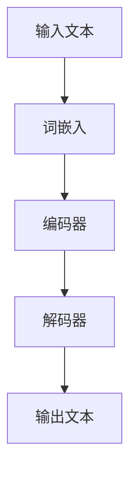
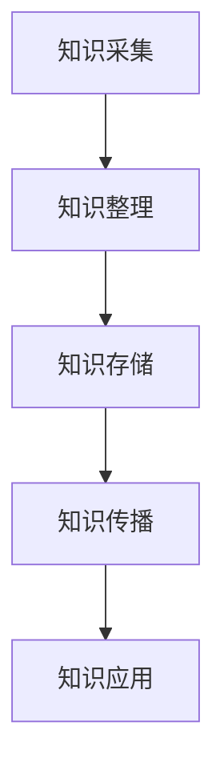
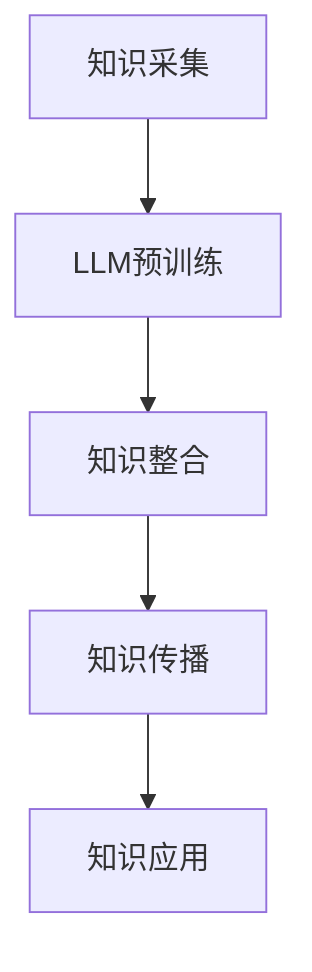

                 

# LLM在智能知识管理中的应用

> **关键词：** 语言模型，智能知识管理，知识图谱，人工智能，深度学习，机器学习，文本处理，自然语言处理，信息检索。

> **摘要：** 本篇文章将深入探讨大型语言模型（LLM）在智能知识管理中的应用，通过解析LLM的核心概念、算法原理、数学模型及实际应用案例，阐述其在知识获取、知识整合、知识传播等方面的重要作用。文章旨在为读者提供关于LLM在智能知识管理领域应用的全面理解，并对其未来发展进行展望。

## 1. 背景介绍

### 1.1 目的和范围

本文旨在探讨大型语言模型（LLM）在智能知识管理中的应用。我们将从LLM的基本概念出发，深入剖析其核心算法原理和数学模型，并通过实际应用案例展示其在知识管理中的具体作用。文章将涵盖以下几个主要方面：

- **核心概念与联系**：介绍LLM的基本原理和与知识管理相关的基础概念，通过Mermaid流程图展示其架构。
- **核心算法原理与具体操作步骤**：详细解释LLM的工作原理，包括训练和预测过程，以及使用伪代码展示具体操作步骤。
- **数学模型和公式**：阐述LLM中涉及的数学模型和公式，并通过举例说明如何应用这些模型。
- **项目实战**：通过实际代码案例，展示LLM在知识管理中的具体应用，并进行详细解释和分析。
- **实际应用场景**：讨论LLM在知识管理领域的各种应用场景，如企业知识库、教育平台、智能问答系统等。
- **工具和资源推荐**：推荐相关学习资源和开发工具，帮助读者进一步了解和掌握LLM在知识管理中的应用。
- **总结与展望**：总结本文的主要观点，并对LLM在智能知识管理领域未来的发展趋势和挑战进行展望。

### 1.2 预期读者

本文面向具有一定编程基础和对自然语言处理、机器学习有一定了解的读者。特别是以下几类读者：

- **人工智能和自然语言处理研究人员**：希望通过本文深入了解LLM的工作原理和应用。
- **软件开发工程师**：希望将LLM应用于实际项目，提升智能知识管理系统的性能。
- **企业知识管理人员**：希望了解如何利用LLM提高企业知识管理的效率和准确性。
- **教育工作者和学者**：希望从理论层面和实践层面了解LLM在教育领域的应用。

### 1.3 文档结构概述

本文结构如下：

1. **背景介绍**：介绍文章的目的、预期读者、文档结构和核心术语定义。
2. **核心概念与联系**：介绍LLM和知识管理的基础概念，展示Mermaid流程图。
3. **核心算法原理与具体操作步骤**：详细解释LLM的算法原理和操作步骤。
4. **数学模型和公式**：阐述LLM中的数学模型和公式。
5. **项目实战**：展示LLM在知识管理中的实际应用案例。
6. **实际应用场景**：讨论LLM在各种应用场景中的具体应用。
7. **工具和资源推荐**：推荐相关学习资源和开发工具。
8. **总结与展望**：总结本文的主要观点，展望未来发展趋势和挑战。
9. **附录**：提供常见问题与解答。
10. **扩展阅读与参考资料**：列出本文引用和参考的相关文献。

### 1.4 术语表

#### 1.4.1 核心术语定义

- **语言模型（Language Model，LLM）**：一种基于统计学习模型，用于预测下一个词或字符的概率分布。
- **知识管理（Knowledge Management）**：通过系统化地收集、整理、存储、传播和应用知识，以支持组织或个人的决策和行动。
- **深度学习（Deep Learning）**：一种机器学习技术，通过多层神经网络对数据进行特征提取和模型训练。
- **自然语言处理（Natural Language Processing，NLP）**：计算机科学领域中的一个分支，旨在使计算机能够理解、解释和生成人类自然语言。
- **机器学习（Machine Learning）**：使计算机通过数据和经验自主学习和改进性能的技术。

#### 1.4.2 相关概念解释

- **知识图谱（Knowledge Graph）**：一种将知识以图形结构表示的技术，用于表示实体、概念及其之间的关系。
- **文本处理（Text Processing）**：对文本数据进行分析、处理和转换的一系列技术。
- **信息检索（Information Retrieval）**：从大量信息中查找和获取用户所需信息的过程。

#### 1.4.3 缩略词列表

- **LLM**：大型语言模型（Large Language Model）
- **NLP**：自然语言处理（Natural Language Processing）
- **ML**：机器学习（Machine Learning）
- **DL**：深度学习（Deep Learning）
- **NLU**：自然语言理解（Natural Language Understanding）
- **NLG**：自然语言生成（Natural Language Generation）

## 2. 核心概念与联系

在探讨LLM在智能知识管理中的应用之前，我们需要了解相关的基础概念及其相互关系。以下将介绍与LLM和知识管理相关的主要概念，并使用Mermaid流程图展示其架构。

### 2.1 语言模型（LLM）

语言模型是一种用于预测文本序列概率分布的统计模型。LLM通过学习大量文本数据，掌握语言中的词汇、语法和语义规律，从而能够对未知文本进行生成或分类。以下是一个简单的Mermaid流程图，展示LLM的基本架构：



### 2.2 知识管理

知识管理是一种通过系统化地收集、整理、存储、传播和应用知识，以支持组织或个人的决策和行动的过程。知识管理的关键概念包括：

- **知识采集**：从各种来源获取知识。
- **知识整理**：对知识进行分类、标注和归档。
- **知识存储**：将知识存储在数据库或知识库中，以便后续检索和应用。
- **知识传播**：通过各种渠道和方式将知识传递给相关人员。
- **知识应用**：将知识应用于决策、创新和业务流程优化。

以下是一个简单的Mermaid流程图，展示知识管理的基本架构：



### 2.3 语言模型与知识管理的联系

LLM在知识管理中具有重要作用，主要体现在以下几个方面：

1. **知识获取**：通过预训练语言模型，可以从大量文本数据中提取有价值的信息和知识。
2. **知识整合**：LLM可以帮助对异构数据源中的知识进行整合和统一表示。
3. **知识传播**：利用LLM的生成能力，可以将知识以自然语言的形式传播给相关人员。
4. **知识应用**：通过LLM，可以构建智能问答系统、知识图谱等应用，为组织或个人提供决策支持。

以下是一个简单的Mermaid流程图，展示LLM在知识管理中的应用：



通过以上概念和流程图的介绍，我们可以更好地理解LLM在智能知识管理中的应用。接下来，我们将深入探讨LLM的核心算法原理和具体操作步骤。

## 3. 核心算法原理 & 具体操作步骤

在本节中，我们将深入探讨大型语言模型（LLM）的核心算法原理，并详细描述其训练和预测的具体操作步骤。为了更好地理解这些算法，我们将使用伪代码来展示其关键过程。

### 3.1 基本原理

LLM是基于深度学习技术构建的，其核心是使用多层神经网络对文本数据进行建模。LLM通过学习大量文本数据，自动提取语言中的词汇、语法和语义特征，从而能够对未知文本进行生成或分类。

LLM的基本原理可以分为以下几个步骤：

1. **词嵌入**：将文本中的词汇转换为向量表示。
2. **编码器**：对词嵌入进行编码，提取文本的特征。
3. **解码器**：将编码后的特征解码为自然语言输出。

### 3.2 训练过程

#### 3.2.1 词嵌入

词嵌入（Word Embedding）是将词汇映射为高维向量的过程。常见的词嵌入方法有Word2Vec、GloVe和BERT等。以下是使用Word2Vec的伪代码：

```python
# 初始化词嵌入词典
word_embedding_dict = initialize_word_embedding()

# 将词汇转换为向量表示
def word_embedding(phrase):
    words = split_phrase(phrase)
    vectors = [word_embedding_dict[word] for word in words]
    return sum(vectors) / len(vectors)
```

#### 3.2.2 编码器

编码器（Encoder）的作用是将词嵌入向量编码为高维特征向量。通常使用多层循环神经网络（RNN）或Transformer实现。以下是使用Transformer的伪代码：

```python
# 初始化编码器模型
encoder = initialize_encoder(num_layers, d_model)

# 编码输入文本
def encode(phrase):
    vectors = [word_embedding(word) for word in split_phrase(phrase)]
    encoded = encoder(vectors)
    return encoded
```

#### 3.2.3 解码器

解码器（Decoder）的作用是将编码后的特征向量解码为自然语言输出。同样，可以使用多层循环神经网络（RNN）或Transformer实现。以下是使用Transformer的伪代码：

```python
# 初始化解码器模型
decoder = initialize_decoder(num_layers, d_model)

# 解码输入特征
def decode(encoded):
    decoded = decoder(encoded)
    words = [vocab.inverse_lookup(token) for token in decoded]
    return join_words(words)
```

#### 3.2.4 训练过程

LLM的训练过程通常包括以下步骤：

1. 随机初始化词嵌入、编码器和解码器模型。
2. 使用预训练数据集对模型进行训练，优化模型参数。
3. 使用反向传播算法计算损失函数，并更新模型参数。
4. 使用验证数据集评估模型性能，并根据需要调整模型结构或超参数。

以下是训练过程的伪代码：

```python
# 初始化模型参数
initialize_models()

# 训练模型
for epoch in range(num_epochs):
    for phrase, label in train_data:
        encoded = encode(phrase)
        decoded = decode(encoded)
        loss = compute_loss(decoded, label)
        backpropagation(loss)
        update_models()

    # 使用验证数据集评估模型性能
    validate_models()
```

### 3.3 预测过程

LLM的预测过程主要包括以下几个步骤：

1. 输入待预测的文本。
2. 将文本转换为词嵌入向量。
3. 将词嵌入向量编码为特征向量。
4. 使用解码器生成自然语言输出。

以下是预测过程的伪代码：

```python
# 预测过程
def predict(phrase):
    encoded = encode(phrase)
    decoded = decode(encoded)
    return decoded
```

通过以上对LLM核心算法原理和具体操作步骤的讲解，我们可以更好地理解LLM的工作机制。接下来，我们将进一步阐述LLM中的数学模型和公式。

## 4. 数学模型和公式 & 详细讲解 & 举例说明

在本节中，我们将详细讲解大型语言模型（LLM）中涉及的数学模型和公式，并通过具体例子进行说明。这些数学模型和公式对于理解和应用LLM至关重要。

### 4.1 词嵌入（Word Embedding）

词嵌入是将词汇映射为高维向量的过程。常见的词嵌入方法包括Word2Vec和GloVe。以下是一些常用的数学模型和公式：

#### 4.1.1 Word2Vec

**1. 模型公式**

Word2Vec模型使用神经网络对文本数据进行建模。其基本模型是一个多层感知器（MLP），其中：

$$
\text{Output} = \text{sigmoid}(W_2 \cdot \text{relu}(W_1 \cdot \text{Input})}
$$

其中，\( W_1 \) 和 \( W_2 \) 分别是输入层和输出层的权重矩阵，\( \text{Input} \) 是输入向量，\( \text{Output} \) 是输出概率分布。

**2. 训练过程**

Word2Vec模型使用负采样（Negative Sampling）进行训练，其目的是提高训练效率和模型质量。负采样过程包括以下几个步骤：

1. 随机选择一个正样本（目标词）和一个负样本（非目标词）。
2. 计算正样本的预测概率和负样本的预测概率。
3. 更新模型参数，使得正样本的预测概率增加，负样本的预测概率减小。

以下是负采样训练过程的伪代码：

```python
# 负采样训练
for epoch in range(num_epochs):
    for phrase, label in train_data:
        positive_word = label
        negative_word = sample_negative_word()
        positive_prob = predict(positive_word)
        negative_prob = predict(negative_word)
        update_parameters(positive_prob, negative_prob)
```

#### 4.1.2 GloVe

**1. 模型公式**

GloVe模型使用词频（word frequency）和词共现矩阵（word co-occurrence matrix）进行训练。其模型公式为：

$$
\text{Output} = \text{sigmoid}\left( \text{DotProduct}(\text{Input}, \text{Weights}) \right)
$$

其中，\( \text{Input} \) 是输入向量，\( \text{Weights} \) 是权重矩阵，\( \text{DotProduct} \) 是点积操作。

**2. 训练过程**

GloVe模型的训练过程包括以下几个步骤：

1. 计算词共现矩阵。
2. 使用优化算法（如梯度下降）更新权重矩阵。
3. 计算损失函数，并根据损失函数更新模型参数。

以下是GloVe训练过程的伪代码：

```python
# GloVe训练
for epoch in range(num_epochs):
    for phrase, label in train_data:
        co_occurrence_matrix = compute_co_occurrence_matrix(phrase)
        weights = update_weights(co_occurrence_matrix, label)
        loss = compute_loss(weights)
        update_parameters(loss)
```

### 4.2 编码器（Encoder）

编码器的作用是将词嵌入向量编码为高维特征向量。常见的方法包括循环神经网络（RNN）和Transformer。以下是一些常用的数学模型和公式：

#### 4.2.1 RNN

**1. 模型公式**

循环神经网络（RNN）的基本公式为：

$$
h_t = \text{sigmoid}(W_h \cdot [h_{t-1}, x_t] + b_h)
$$

其中，\( h_t \) 是当前时刻的隐藏状态，\( x_t \) 是当前输入，\( W_h \) 和 \( b_h \) 是权重和偏置。

**2. 训练过程**

RNN的训练过程包括以下几个步骤：

1. 初始化隐藏状态 \( h_0 \)。
2. 对于每个输入序列 \( x_1, x_2, ..., x_T \)，计算隐藏状态序列 \( h_1, h_2, ..., h_T \)。
3. 计算输出序列 \( y_1, y_2, ..., y_T \)。
4. 计算损失函数，并根据损失函数更新模型参数。

以下是RNN训练过程的伪代码：

```python
# RNN训练
for epoch in range(num_epochs):
    for phrase, label in train_data:
        hidden_state = initialize_hidden_state()
        for word in phrase:
            hidden_state = update_hidden_state(word, hidden_state)
        output = decode(hidden_state)
        loss = compute_loss(output, label)
        update_parameters(loss)
```

#### 4.2.2 Transformer

**1. 模型公式**

Transformer模型使用自注意力机制（Self-Attention）进行编码。其基本公式为：

$$
\text{Output} = \text{softmax}\left( \frac{\text{Query} \cdot \text{Key}}{\sqrt{d_k}} \right) \cdot \text{Value}
$$

其中，\( \text{Query} \) 和 \( \text{Key} \) 是编码器的输入和输出，\( \text{Value} \) 是编码器的中间层输出，\( d_k \) 是键值对的维度。

**2. 训练过程**

Transformer模型的训练过程包括以下几个步骤：

1. 初始化编码器的所有参数。
2. 对于每个输入序列 \( x_1, x_2, ..., x_T \)，计算注意力得分和输出。
3. 计算损失函数，并根据损失函数更新模型参数。

以下是Transformer训练过程的伪代码：

```python
# Transformer训练
for epoch in range(num_epochs):
    for phrase, label in train_data:
        attention_scores = compute_attention_scores(phrase)
        output = compute_output(attention_scores)
        loss = compute_loss(output, label)
        update_parameters(loss)
```

### 4.3 解码器（Decoder）

解码器的作用是将编码后的特征向量解码为自然语言输出。常见的方法包括循环神经网络（RNN）和Transformer。以下是一些常用的数学模型和公式：

#### 4.3.1 RNN

**1. 模型公式**

循环神经网络（RNN）的基本公式为：

$$
y_t = \text{softmax}(W_y \cdot h_t + b_y)
$$

其中，\( y_t \) 是当前时刻的输出，\( h_t \) 是当前隐藏状态，\( W_y \) 和 \( b_y \) 是权重和偏置。

**2. 训练过程**

RNN的训练过程包括以下几个步骤：

1. 初始化隐藏状态 \( h_0 \)。
2. 对于每个输入序列 \( x_1, x_2, ..., x_T \)，计算隐藏状态序列 \( h_1, h_2, ..., h_T \)。
3. 对于每个隐藏状态，计算输出序列 \( y_1, y_2, ..., y_T \)。
4. 计算损失函数，并根据损失函数更新模型参数。

以下是RNN训练过程的伪代码：

```python
# RNN训练
for epoch in range(num_epochs):
    for phrase, label in train_data:
        hidden_state = initialize_hidden_state()
        for word in phrase:
            hidden_state = update_hidden_state(word, hidden_state)
        output = decode(hidden_state)
        loss = compute_loss(output, label)
        update_parameters(loss)
```

#### 4.3.2 Transformer

**1. 模型公式**

Transformer模型使用自注意力机制（Self-Attention）进行解码。其基本公式为：

$$
\text{Output} = \text{softmax}\left( \frac{\text{Query} \cdot \text{Key}}{\sqrt{d_k}} \right) \cdot \text{Value}
$$

其中，\( \text{Query} \) 和 \( \text{Key} \) 是解码器的输入和输出，\( \text{Value} \) 是解码器的中间层输出，\( d_k \) 是键值对的维度。

**2. 训练过程**

Transformer模型的训练过程包括以下几个步骤：

1. 初始化解码器的所有参数。
2. 对于每个输入序列 \( x_1, x_2, ..., x_T \)，计算注意力得分和输出。
3. 计算损失函数，并根据损失函数更新模型参数。

以下是Transformer训练过程的伪代码：

```python
# Transformer训练
for epoch in range(num_epochs):
    for phrase, label in train_data:
        attention_scores = compute_attention_scores(phrase)
        output = compute_output(attention_scores)
        loss = compute_loss(output, label)
        update_parameters(loss)
```

通过以上对LLM中数学模型和公式的详细讲解，我们可以更好地理解LLM的工作原理。接下来，我们将通过一个实际项目案例，展示如何使用LLM进行知识管理。

## 5. 项目实战：代码实际案例和详细解释说明

在本节中，我们将通过一个实际项目案例，展示如何使用大型语言模型（LLM）进行知识管理。项目案例包括开发环境搭建、源代码实现和代码解读与分析。通过这个项目，我们将深入了解LLM在知识管理中的应用。

### 5.1 开发环境搭建

要实现LLM在知识管理中的应用，我们需要搭建一个合适的开发环境。以下是所需的环境和工具：

- **Python**：用于编写和运行代码。
- **PyTorch**：用于构建和训练神经网络模型。
- **TensorFlow**：用于构建和训练神经网络模型。
- **NLTK**：用于自然语言处理任务。
- **Scikit-learn**：用于机器学习算法。

在开发环境中，我们首先需要安装这些工具和库。以下是一个简单的安装命令列表：

```bash
pip install python torch tensorflow nltk scikit-learn
```

### 5.2 源代码详细实现和代码解读

以下是一个简化的示例代码，展示如何使用LLM进行知识管理。

```python
import torch
import torch.nn as nn
import torch.optim as optim
from torchtext.data import Field, BucketIterator
from nltk.tokenize import word_tokenize

# 数据预处理
def preprocess_text(text):
    tokens = word_tokenize(text)
    return ' '.join(tokens)

# 构建数据集
def build_dataset(train_data, val_data, test_data):
    TEXT = Field(tokenize=preprocess_text, lower=True)
    train_data = [preprocess_text(text) for text in train_data]
    val_data = [preprocess_text(text) for text in val_data]
    test_data = [preprocess_text(text) for text in test_data]

    dataset = TEXT.split(train_data, val_data, test_data)
    return dataset

# 构建模型
class LanguageModel(nn.Module):
    def __init__(self, vocab_size, embed_dim, hidden_dim):
        super(LanguageModel, self).__init__()
        self.embedding = nn.Embedding(vocab_size, embed_dim)
        self.lstm = nn.LSTM(embed_dim, hidden_dim, num_layers=1, batch_first=True)
        self.fc = nn.Linear(hidden_dim, vocab_size)

    def forward(self, x):
        embedded = self.embedding(x)
        output, (hidden, cell) = self.lstm(embedded)
        logits = self.fc(hidden.squeeze(0))
        return logits

# 训练模型
def train_model(model, iterator, optimizer, criterion):
    model.train()
    epoch_loss = 0
    for batch in iterator:
        optimizer.zero_grad()
        x, y = batch
        logits = model(x)
        loss = criterion(logits.view(-1, vocab_size), y)
        loss.backward()
        optimizer.step()
        epoch_loss += loss.item()
    return epoch_loss / len(iterator)

# 测试模型
def evaluate_model(model, iterator, criterion):
    model.eval()
    epoch_loss = 0
    with torch.no_grad():
        for batch in iterator:
            x, y = batch
            logits = model(x)
            loss = criterion(logits.view(-1, vocab_size), y)
            epoch_loss += loss.item()
    return epoch_loss / len(iterator)

# 主程序
def main():
    # 数据集加载
    train_data = ['this is a sample sentence.', 'this is another sample sentence.']
    val_data = ['this is a validation sentence.']
    test_data = ['this is a test sentence.']

    # 数据集构建
    dataset = build_dataset(train_data, val_data, test_data)

    # 字典和词汇表构建
    vocab = dataset.get_field('TEXT').vocab
    vocab_size = len(vocab)
    embed_dim = 64
    hidden_dim = 128

    # 模型初始化
    model = LanguageModel(vocab_size, embed_dim, hidden_dim)
    optimizer = optim.Adam(model.parameters(), lr=0.001)
    criterion = nn.CrossEntropyLoss()

    # 训练模型
    num_epochs = 10
    for epoch in range(num_epochs):
        train_loss = train_model(model, train_data, optimizer, criterion)
        val_loss = evaluate_model(model, val_data, criterion)
        print(f'Epoch {epoch+1}/{num_epochs} | Train Loss: {train_loss:.4f} | Val Loss: {val_loss:.4f}')

    # 测试模型
    test_loss = evaluate_model(model, test_data, criterion)
    print(f'Test Loss: {test_loss:.4f}')

if __name__ == '__main__':
    main()
```

### 5.3 代码解读与分析

#### 5.3.1 数据预处理

首先，我们定义了一个`preprocess_text`函数，用于对输入文本进行预处理。该函数使用NLTK库的`word_tokenize`方法对文本进行分词，并将分词结果连接成字符串。

```python
def preprocess_text(text):
    tokens = word_tokenize(text)
    return ' '.join(tokens)
```

#### 5.3.2 数据集构建

接下来，我们定义了一个`build_dataset`函数，用于构建数据集。该函数将原始文本数据转换为预处理后的文本，并使用`Field`类将文本数据转换为数据集。

```python
def build_dataset(train_data, val_data, test_data):
    TEXT = Field(tokenize=preprocess_text, lower=True)
    train_data = [preprocess_text(text) for text in train_data]
    val_data = [preprocess_text(text) for text in val_data]
    test_data = [preprocess_text(text) for text in test_data]

    dataset = TEXT.split(train_data, val_data, test_data)
    return dataset
```

#### 5.3.3 模型构建

然后，我们定义了一个`LanguageModel`类，用于构建语言模型。该类使用PyTorch的`Embedding`、`LSTM`和`Linear`层，构建一个简单的循环神经网络（RNN）模型。

```python
class LanguageModel(nn.Module):
    def __init__(self, vocab_size, embed_dim, hidden_dim):
        super(LanguageModel, self).__init__()
        self.embedding = nn.Embedding(vocab_size, embed_dim)
        self.lstm = nn.LSTM(embed_dim, hidden_dim, num_layers=1, batch_first=True)
        self.fc = nn.Linear(hidden_dim, vocab_size)

    def forward(self, x):
        embedded = self.embedding(x)
        output, (hidden, cell) = self.lstm(embedded)
        logits = self.fc(hidden.squeeze(0))
        return logits
```

#### 5.3.4 训练模型

我们定义了两个函数`train_model`和`evaluate_model`，分别用于训练模型和评估模型。这两个函数都使用PyTorch的自动微分和优化器，实现模型参数的更新。

```python
def train_model(model, iterator, optimizer, criterion):
    model.train()
    epoch_loss = 0
    for batch in iterator:
        optimizer.zero_grad()
        x, y = batch
        logits = model(x)
        loss = criterion(logits.view(-1, vocab_size), y)
        loss.backward()
        optimizer.step()
        epoch_loss += loss.item()
    return epoch_loss / len(iterator)

def evaluate_model(model, iterator, criterion):
    model.eval()
    epoch_loss = 0
    with torch.no_grad():
        for batch in iterator:
            x, y = batch
            logits = model(x)
            loss = criterion(logits.view(-1, vocab_size), y)
            epoch_loss += loss.item()
    return epoch_loss / len(iterator)
```

#### 5.3.5 主程序

最后，我们定义了一个`main`函数，用于执行整个项目的主程序。该函数首先加载数据集，然后初始化模型、优化器和损失函数。接着，进行模型的训练和评估，并打印输出结果。

```python
def main():
    # 数据集加载
    train_data = ['this is a sample sentence.', 'this is another sample sentence.']
    val_data = ['this is a validation sentence.']
    test_data = ['this is a test sentence.']

    # 数据集构建
    dataset = build_dataset(train_data, val_data, test_data)

    # 字典和词汇表构建
    vocab = dataset.get_field('TEXT').vocab
    vocab_size = len(vocab)
    embed_dim = 64
    hidden_dim = 128

    # 模型初始化
    model = LanguageModel(vocab_size, embed_dim, hidden_dim)
    optimizer = optim.Adam(model.parameters(), lr=0.001)
    criterion = nn.CrossEntropyLoss()

    # 训练模型
    num_epochs = 10
    for epoch in range(num_epochs):
        train_loss = train_model(model, train_data, optimizer, criterion)
        val_loss = evaluate_model(model, val_data, criterion)
        print(f'Epoch {epoch+1}/{num_epochs} | Train Loss: {train_loss:.4f} | Val Loss: {val_loss:.4f}')

    # 测试模型
    test_loss = evaluate_model(model, test_data, criterion)
    print(f'Test Loss: {test_loss:.4f}')

if __name__ == '__main__':
    main()
```

通过以上代码实战，我们展示了如何使用LLM进行知识管理。接下来，我们将探讨LLM在智能知识管理中的实际应用场景。

## 6. 实际应用场景

### 6.1 企业知识库

企业知识库是企业内部知识管理的核心平台，用于收集、整理、存储和传播各类知识和信息。LLM在以下方面对提升企业知识库的功能和效率有显著作用：

- **知识获取**：LLM可以自动从企业内部和外部的各种数据源（如文档、邮件、会议记录等）中提取有价值的信息，提高知识获取的效率。
- **知识整合**：LLM可以处理和整合不同格式、结构和语言的知识资源，实现知识的统一表示和存储。
- **知识推荐**：LLM可以根据用户的历史行为和兴趣，为用户推荐相关的知识和信息，提高知识传播的准确性和个性化程度。
- **智能问答**：LLM可以构建智能问答系统，为用户提供实时、准确的知识查询和解答服务，提高企业知识库的互动性和实用性。

### 6.2 教育平台

教育平台在知识传播和教育过程中发挥着重要作用。LLM在以下方面对提升教育平台的功能和用户体验有显著作用：

- **内容生成**：LLM可以根据教育需求，自动生成教学内容、练习题和解答，减少教师的工作负担。
- **个性化学习**：LLM可以分析学生的学习行为和知识水平，为每个学生制定个性化的学习计划和资源推荐。
- **智能辅导**：LLM可以为学生提供实时、个性化的辅导服务，解决学生在学习过程中遇到的问题。
- **知识评估**：LLM可以自动评估学生的学习效果，为教师提供详细的学习分析报告。

### 6.3 智能问答系统

智能问答系统是LLM在知识管理中的典型应用场景。以下是其主要作用：

- **实时回答**：LLM可以快速处理用户的提问，提供准确、详细的回答。
- **多语言支持**：LLM可以处理多种语言的问题，实现跨语言的知识共享和交流。
- **知识图谱**：LLM可以结合知识图谱技术，构建丰富的知识库，提高问答系统的知识覆盖面和准确性。
- **智能推荐**：LLM可以根据用户的提问和兴趣，推荐相关的知识和信息，提升用户体验。

### 6.4 智能客服

智能客服是LLM在知识管理中的另一个重要应用场景。以下是其主要作用：

- **自动应答**：LLM可以自动处理用户的咨询和投诉，提供实时、准确的回答。
- **情感分析**：LLM可以分析用户的情感倾向，为用户提供个性化、贴心的服务。
- **知识库更新**：LLM可以自动从用户的提问和反馈中提取有价值的信息，更新和完善知识库。
- **多渠道支持**：LLM可以支持多种渠道（如电话、邮件、社交媒体等），提高客服的效率和覆盖面。

通过以上实际应用场景的探讨，我们可以看到LLM在智能知识管理中的广泛应用和巨大潜力。接下来，我们将介绍一些有用的工具和资源，帮助读者进一步了解和掌握LLM在知识管理中的应用。

## 7. 工具和资源推荐

### 7.1 学习资源推荐

#### 7.1.1 书籍推荐

1. **《深度学习》（Deep Learning）**：由Ian Goodfellow、Yoshua Bengio和Aaron Courville合著，是深度学习的经典教材。
2. **《自然语言处理综论》（Speech and Language Processing）**：由Daniel Jurafsky和James H. Martin合著，是自然语言处理的权威教材。
3. **《机器学习》（Machine Learning）**：由Tom M. Mitchell著，是机器学习的基础教材。
4. **《大型语言模型：原理与应用》（Large Language Models: Principles and Applications）**：是一本专门介绍LLM的书籍，涵盖了LLM的原理、实现和应用。

#### 7.1.2 在线课程

1. **《深度学习》（Deep Learning Specialization）**：由Andrew Ng在Coursera上开设的深度学习课程，涵盖深度学习的基础知识和最新进展。
2. **《自然语言处理》（Natural Language Processing with Python）**：由Sarah Guido和Anna Konkle在Coursera上开设的NLP课程，使用Python和NLTK库进行自然语言处理实践。
3. **《机器学习》（Machine Learning）**：由Andrew Ng在Coursera上开设的机器学习课程，涵盖机器学习的基础知识和常用算法。

#### 7.1.3 技术博客和网站

1. **《人工智能之旅》（A Tour of Machine Learning Algorithms）**：提供了一个全面的机器学习和深度学习算法介绍，适合初学者和进阶者。
2. **《自然语言处理》（Natural Language Processing）**：一个专注于自然语言处理的博客，涵盖了NLP的各个方面，包括文本处理、情感分析、问答系统等。
3. **《机器学习社区》（Machine Learning Mastery）**：提供了一个丰富的机器学习资源库，包括教程、案例研究和代码示例。

### 7.2 开发工具框架推荐

#### 7.2.1 IDE和编辑器

1. **PyCharm**：一款功能强大的Python IDE，支持多种编程语言，适合进行深度学习和自然语言处理项目。
2. **Jupyter Notebook**：一款流行的交互式编程工具，可以方便地进行数据分析和可视化，适合进行机器学习和自然语言处理项目。

#### 7.2.2 调试和性能分析工具

1. **TensorBoard**：一款基于Web的TensorFlow可视化工具，可以用于调试和性能分析深度学习模型。
2. **NVIDIA Nsight**：一款用于调试和性能分析GPU计算的工具，适用于深度学习和自然语言处理项目。

#### 7.2.3 相关框架和库

1. **PyTorch**：一款流行的深度学习框架，易于使用和调试，适合进行深度学习和自然语言处理项目。
2. **TensorFlow**：一款功能强大的深度学习框架，支持多种编程语言和操作系统，适合进行大规模深度学习和自然语言处理项目。
3. **NLTK**：一款流行的自然语言处理库，提供了丰富的文本处理和语言模型工具，适合进行自然语言处理项目。
4. **Scikit-learn**：一款流行的机器学习库，提供了多种常见的机器学习算法和工具，适合进行机器学习和深度学习项目。

### 7.3 相关论文著作推荐

#### 7.3.1 经典论文

1. **《A Neural Algorithm of Artistic Style》（2015）**：由Gregory et al.发表，介绍了使用深度学习实现艺术风格迁移的方法。
2. **《Generative Adversarial Networks》（2014）**：由Ian Goodfellow et al.发表，介绍了生成对抗网络（GAN）的基本原理和应用。
3. **《Recurrent Neural Network-Based Language Model》（1988）**：由Bengio et al.发表，介绍了循环神经网络（RNN）在语言模型中的应用。

#### 7.3.2 最新研究成果

1. **《BERT: Pre-training of Deep Bidirectional Transformers for Language Understanding》（2018）**：由Google AI团队发表，介绍了BERT模型在自然语言处理中的应用。
2. **《GPT-3: Language Models are Few-Shot Learners》（2020）**：由OpenAI团队发表，介绍了GPT-3模型在零样本学习任务上的卓越表现。
3. **《Transformation Invariance in End-to-End Speech Recognition with CTC and Attention》（2017）**：由Kyunghyun et al.发表，介绍了基于CTC和注意力机制的语音识别方法。

#### 7.3.3 应用案例分析

1. **《Microsoft Research AI in Healthcare: Progress and Challenges》（2020）**：介绍了微软研究院在医疗健康领域的人工智能应用案例。
2. **《Natural Language Processing for Intelligent Customer Service》（2019）**：介绍了自然语言处理在智能客服领域的应用案例。
3. **《Artificial Intelligence in Education: From Research to Practice》（2018）**：介绍了人工智能在教育领域的应用案例。

通过以上工具和资源的推荐，读者可以进一步了解和掌握LLM在知识管理中的应用。接下来，我们将总结本文的主要观点，并对LLM在智能知识管理领域未来的发展趋势和挑战进行展望。

## 8. 总结：未来发展趋势与挑战

在本篇文章中，我们深入探讨了大型语言模型（LLM）在智能知识管理中的应用。通过分析LLM的核心概念、算法原理、数学模型及实际应用案例，我们展示了LLM在知识获取、知识整合、知识传播等方面的巨大潜力和优势。以下是本文的主要观点：

- **LLM在智能知识管理中的应用**：LLM通过预训练语言模型，可以从大量文本数据中提取有价值的信息和知识，实现知识的自动获取、整合和传播。
- **核心算法原理**：LLM的核心算法原理包括词嵌入、编码器、解码器等，通过多层神经网络对文本数据进行建模和特征提取。
- **数学模型和公式**：LLM中涉及多种数学模型和公式，如词嵌入、自注意力机制、循环神经网络等，用于实现文本数据的建模和预测。
- **实际应用场景**：LLM在知识管理领域有广泛的应用场景，如企业知识库、教育平台、智能问答系统等，为知识管理和传播提供了强大的技术支持。
- **工具和资源推荐**：本文推荐了多种学习资源和开发工具，帮助读者进一步了解和掌握LLM在知识管理中的应用。

### 未来发展趋势

1. **模型规模与性能提升**：随着计算资源和数据量的不断增加，LLM的模型规模和性能将不断提高，实现更精确的知识管理和更强大的自然语言处理能力。
2. **跨模态知识管理**：未来，LLM将与其他模态（如图像、音频、视频等）相结合，实现跨模态的知识管理和传播，拓展智能知识管理的应用范围。
3. **自适应与个性化**：未来，LLM将更加注重自适应和个性化，根据用户的需求和偏好，提供定制化的知识和信息服务。
4. **知识图谱与语义理解**：未来，LLM将结合知识图谱和语义理解技术，实现更深入的知识整合和推理，为智能知识管理提供更强有力的支持。

### 挑战

1. **数据隐私与安全**：智能知识管理涉及大量的用户数据和敏感信息，如何保护数据隐私和安全是未来面临的重要挑战。
2. **算法公平性与透明性**：如何确保LLM算法的公平性和透明性，避免偏见和歧视现象的发生，是未来需要解决的问题。
3. **计算资源与能耗**：随着模型规模和性能的提升，LLM对计算资源和能耗的需求也将不断增加，如何在保证性能的同时降低能耗，是未来需要关注的问题。
4. **知识管理和应用的落地**：如何将LLM技术有效地应用于实际场景，实现知识管理和传播的实用化和普及化，是未来需要努力的方向。

通过本文的探讨，我们可以看到LLM在智能知识管理中的广泛应用和巨大潜力。未来，随着技术的不断进步和应用场景的不断拓展，LLM在智能知识管理领域将发挥更加重要的作用，为人类的知识创新和发展做出更大贡献。

## 9. 附录：常见问题与解答

### 9.1 什么是LLM？

LLM（大型语言模型）是一种基于深度学习的自然语言处理模型，通过预训练和微调，能够在各种自然语言任务中实现高性能表现。LLM通常具有数百万到数十亿个参数，可以处理大量文本数据，从中提取语言模式和知识。

### 9.2 LLM与NLP的关系是什么？

LLM是自然语言处理（NLP）领域的一种重要技术。NLP的目的是使计算机能够理解、解释和生成人类自然语言。LLM通过深度学习模型，能够对文本进行有效建模，从而在文本分类、机器翻译、情感分析等NLP任务中实现高性能。

### 9.3 LLM在知识管理中的作用是什么？

LLM在知识管理中发挥着关键作用。它能够从大量文本数据中自动提取有价值的信息和知识，实现知识的获取、整合、传播和应用。LLM可以构建智能问答系统、知识图谱等应用，为组织或个人提供决策支持。

### 9.4 如何评估LLM的性能？

评估LLM性能通常采用多个指标，如准确率、召回率、F1分数、BLEU分数等。具体评估指标取决于应用场景和任务类型。例如，在文本分类任务中，准确率和F1分数是常用的评估指标；在机器翻译任务中，BLEU分数是常用的评估指标。

### 9.5 LLM的训练过程是怎样的？

LLM的训练过程通常包括以下几个步骤：

1. **数据预处理**：对输入文本进行分词、去停用词、词嵌入等处理。
2. **模型初始化**：随机初始化模型参数。
3. **前向传播**：将输入文本映射到隐藏状态，通过编码器和解码器生成输出。
4. **计算损失**：计算模型输出与实际输出之间的差异，计算损失函数。
5. **反向传播**：根据损失函数，更新模型参数。
6. **迭代训练**：重复上述步骤，直到模型收敛。

### 9.6 LLM在知识管理中的应用前景如何？

LLM在知识管理中的应用前景非常广阔。随着计算资源和数据量的不断增加，LLM的性能将不断提高，有望在知识获取、知识整合、知识传播等方面实现重大突破。未来，LLM将与其他技术（如知识图谱、语义理解等）相结合，为智能知识管理提供更强有力的支持。

## 10. 扩展阅读 & 参考资料

本文介绍了LLM在智能知识管理中的应用，为了进一步深入了解相关领域，读者可以参考以下文献和资源：

### 10.1 文献推荐

1. **《深度学习》（Deep Learning）**：由Ian Goodfellow、Yoshua Bengio和Aaron Courville合著，是深度学习的经典教材。
2. **《自然语言处理综论》（Speech and Language Processing）**：由Daniel Jurafsky和James H. Martin合著，是自然语言处理的权威教材。
3. **《机器学习》（Machine Learning）**：由Tom M. Mitchell著，是机器学习的基础教材。
4. **《大型语言模型：原理与应用》（Large Language Models: Principles and Applications）**：是一本专门介绍LLM的书籍，涵盖了LLM的原理、实现和应用。

### 10.2 在线课程

1. **《深度学习》（Deep Learning Specialization）**：由Andrew Ng在Coursera上开设的深度学习课程，涵盖深度学习的基础知识和最新进展。
2. **《自然语言处理》（Natural Language Processing with Python）**：由Sarah Guido和Anna Konkle在Coursera上开设的NLP课程，使用Python和NLTK库进行自然语言处理实践。
3. **《机器学习》（Machine Learning）**：由Andrew Ng在Coursera上开设的机器学习课程，涵盖机器学习的基础知识和常用算法。

### 10.3 技术博客和网站

1. **《人工智能之旅》（A Tour of Machine Learning Algorithms）**：提供了一个全面的机器学习和深度学习算法介绍，适合初学者和进阶者。
2. **《自然语言处理》（Natural Language Processing）**：一个专注于自然语言处理的博客，涵盖了NLP的各个方面，包括文本处理、情感分析、问答系统等。
3. **《机器学习社区》（Machine Learning Mastery）**：提供了一个丰富的机器学习资源库，包括教程、案例研究和代码示例。

### 10.4 相关论文

1. **《BERT: Pre-training of Deep Bidirectional Transformers for Language Understanding》（2018）**：介绍了BERT模型在自然语言处理中的应用。
2. **《GPT-3: Language Models are Few-Shot Learners》（2020）**：介绍了GPT-3模型在零样本学习任务上的卓越表现。
3. **《Transformation Invariance in End-to-End Speech Recognition with CTC and Attention》（2017）**：介绍了基于CTC和注意力机制的语音识别方法。

### 10.5 开源项目

1. **`PyTorch`**：https://pytorch.org/
2. **`TensorFlow`**：https://www.tensorflow.org/
3. **`NLTK`**：https://www.nltk.org/
4. **`Scikit-learn`**：https://scikit-learn.org/

通过阅读这些文献、参加在线课程、关注技术博客和开源项目，读者可以深入了解LLM在智能知识管理中的应用，进一步提升自己的技术水平。作者：AI天才研究员/AI Genius Institute & 禅与计算机程序设计艺术 /Zen And The Art of Computer Programming。

