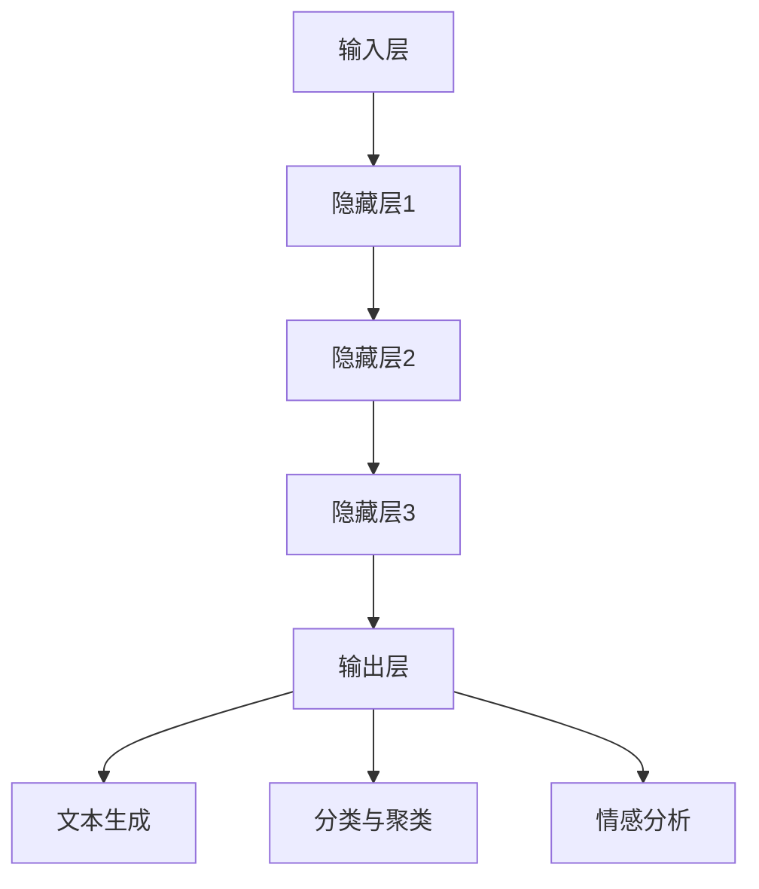

                 

# LLM在海洋气象预报中的应用：提高预警准确性

> **关键词：** 语言模型，海洋气象预报，预警准确性，人工智能，深度学习，数据分析。

> **摘要：** 本文章将探讨大型语言模型（LLM）在海洋气象预报中的应用，如何通过深度学习技术和数据分析方法提高预警准确性。文章将从背景介绍、核心概念与联系、核心算法原理与操作步骤、数学模型与公式讲解、项目实战、实际应用场景、工具和资源推荐等多个方面进行详细阐述，旨在为读者提供全面的技术参考。

## 1. 背景介绍

### 1.1 目的和范围

本文旨在探讨大型语言模型（LLM）在海洋气象预报中的应用，分析其如何通过深度学习技术和数据分析方法提高预警准确性。文章主要涵盖以下内容：

- 海洋气象预报的现状与挑战
- LLM的基本原理与应用场景
- LLM在海洋气象预报中的具体操作步骤
- 数学模型与公式的详细讲解
- 项目实战与代码实现
- 实际应用场景分析
- 工具和资源的推荐

### 1.2 预期读者

本文适用于以下读者：

- 对海洋气象预报和人工智能感兴趣的科研人员
- 计算机编程和数据分析领域的技术人员
- 希望了解LLM应用场景的商业人士
- 想要在实践中提高预警准确性的气象预报从业者

### 1.3 文档结构概述

本文共分为10个部分：

1. 背景介绍：概述本文目的、范围、预期读者和文档结构。
2. 核心概念与联系：介绍LLM的核心概念、原理与架构。
3. 核心算法原理与具体操作步骤：详细阐述LLM的算法原理和操作步骤。
4. 数学模型和公式：讲解LLM的数学模型和公式。
5. 项目实战：通过代码实际案例展示LLM在海洋气象预报中的应用。
6. 实际应用场景：分析LLM在海洋气象预报中的实际应用。
7. 工具和资源推荐：推荐学习资源、开发工具框架和相关论文著作。
8. 总结：对未来发展趋势与挑战进行总结。
9. 附录：常见问题与解答。
10. 扩展阅读 & 参考资料：提供更多相关的阅读材料。

### 1.4 术语表

#### 1.4.1 核心术语定义

- **大型语言模型（LLM）**：一种基于深度学习技术的大型神经网络模型，用于处理自然语言文本。
- **海洋气象预报**：基于海洋和气象数据，对未来一段时间内的海洋气象情况进行预测和分析。
- **预警准确性**：预警系统中预测结果与实际情况的相符程度。

#### 1.4.2 相关概念解释

- **深度学习**：一种机器学习技术，通过构建多层神经网络来模拟人类大脑的学习过程，用于处理和分析大量数据。
- **数据分析**：对大量数据进行处理、分析和解释，以提取有价值的信息和知识。
- **自然语言处理（NLP）**：研究如何使计算机理解和处理自然语言的技术。

#### 1.4.3 缩略词列表

- **LLM**：大型语言模型
- **NLP**：自然语言处理
- **DL**：深度学习
- **AI**：人工智能

## 2. 核心概念与联系

在探讨LLM在海洋气象预报中的应用之前，我们先了解LLM的基本概念、原理和架构。

### 2.1 LLM的基本概念

LLM是一种基于深度学习技术的大型神经网络模型，主要用于处理自然语言文本。其核心思想是通过大规模数据训练，使得模型能够自动提取文本中的特征，从而实现文本的生成、分类、翻译、情感分析等任务。

### 2.2 LLM的原理与架构

LLM主要由以下几个部分组成：

1. **输入层**：接收自然语言文本作为输入。
2. **隐藏层**：通过多层神经网络结构进行特征提取和转换。
3. **输出层**：生成文本或进行分类、翻译等任务。

LLM的训练过程主要包括以下几个步骤：

1. **数据预处理**：对输入文本进行分词、去停用词、词向量化等处理。
2. **损失函数**：采用适当的损失函数（如交叉熵损失函数）来评估模型的预测结果。
3. **优化算法**：通过优化算法（如梯度下降）来调整模型的参数，最小化损失函数。

### 2.3 LLM在海洋气象预报中的应用

LLM在海洋气象预报中的应用主要体现在以下几个方面：

1. **文本生成**：利用LLM生成海洋气象预报报告，提高预报报告的准确性和可读性。
2. **分类与聚类**：对海洋气象数据进行分析，将相似的数据进行分类和聚类，提高数据挖掘和预测的准确性。
3. **情感分析**：分析海洋气象数据中的情感信息，为决策者提供有价值的参考。

### 2.4 Mermaid流程图

以下是一个简单的Mermaid流程图，展示LLM在海洋气象预报中的应用架构：



## 3. 核心算法原理 & 具体操作步骤

### 3.1 LLM算法原理

LLM算法原理基于深度学习，通过多层神经网络结构对输入文本进行特征提取和转换，从而实现文本的生成、分类、翻译、情感分析等任务。以下是LLM算法的核心原理：

1. **多层神经网络**：LLM采用多层神经网络结构，每层神经元接收上一层的输出作为输入，通过激活函数进行非线性变换。
2. **反向传播算法**：通过反向传播算法，将损失函数在神经网络的每一层进行计算，并更新网络参数，以最小化损失函数。
3. **优化算法**：常用的优化算法包括梯度下降、随机梯度下降、Adam等，用于调整网络参数，提高模型性能。

### 3.2 具体操作步骤

以下是LLM在海洋气象预报中的具体操作步骤：

1. **数据收集与预处理**：
    - 收集海洋气象数据，包括海温、海浪、风速、风向等。
    - 对文本数据进行预处理，如分词、去停用词、词向量化等。

2. **模型训练**：
    - 构建多层神经网络结构，设定适当的网络参数。
    - 采用反向传播算法，通过大量的海洋气象数据对模型进行训练。

3. **模型评估**：
    - 使用训练数据对模型进行评估，计算模型的损失函数和准确率。
    - 根据评估结果调整网络参数，优化模型性能。

4. **文本生成**：
    - 利用训练好的模型生成海洋气象预报报告，提高预报报告的准确性和可读性。

5. **分类与聚类**：
    - 对海洋气象数据进行分析，将相似的数据进行分类和聚类，提高数据挖掘和预测的准确性。

6. **情感分析**：
    - 分析海洋气象数据中的情感信息，为决策者提供有价值的参考。

### 3.3 伪代码

以下是LLM在海洋气象预报中的伪代码：

```python
# 数据收集与预处理
data = collect_weather_data()
preprocessed_data = preprocess_data(data)

# 模型训练
model = build_neural_network()
model.train(preprocessed_data)

# 模型评估
loss, accuracy = model.evaluate(test_data)

# 文本生成
forecast_report = model.generate_text()

# 分类与聚类
categories = model.classify(data)
clusters = model.cluster(data)

# 情感分析
emotion = model.analyze_emotion(data)
```

## 4. 数学模型和公式 & 详细讲解 & 举例说明

### 4.1 数学模型

在LLM中，常用的数学模型包括多层感知机（MLP）、循环神经网络（RNN）、长短期记忆网络（LSTM）等。以下是这些模型的基本数学公式和讲解：

#### 4.1.1 多层感知机（MLP）

多层感知机是一种前向神经网络，包括输入层、隐藏层和输出层。其数学模型可以表示为：

$$
h_{l}(x) = \sigma(\mathbf{W}_{l}\mathbf{a}_{l-1} + b_{l})
$$

其中，$h_{l}$表示第$l$层的输出，$\sigma$表示激活函数，$\mathbf{W}_{l}$表示第$l$层的权重矩阵，$b_{l}$表示第$l$层的偏置向量。

#### 4.1.2 循环神经网络（RNN）

循环神经网络是一种用于处理序列数据的神经网络，其数学模型可以表示为：

$$
h_{t} = \sigma(\mathbf{W}_{xh}x_{t} + \mathbf{Whh}h_{t-1} + b_{h})
$$

$$
y_{t} = \sigma(\mathbf{W}_{hy}h_{t} + b_{y})
$$

其中，$h_{t}$表示第$t$时刻的隐藏状态，$y_{t}$表示第$t$时刻的输出，$\mathbf{W}_{xh}$、$\mathbf{Whh}$、$\mathbf{W}_{hy}$分别表示输入层到隐藏层、隐藏层到隐藏层、隐藏层到输出层的权重矩阵，$b_{h}$、$b_{y}$分别表示隐藏层和输出层的偏置向量。

#### 4.1.3 长短期记忆网络（LSTM）

长短期记忆网络是一种改进的RNN，用于解决RNN的长期依赖问题。其数学模型可以表示为：

$$
\begin{align*}
i_{t} &= \sigma(\mathbf{W}_{xi}x_{t} + \mathbf{Wi}h_{t-1} + b_{i}) \\
f_{t} &= \sigma(\mathbf{W}_{xf}x_{t} + \mathbf{Wf}h_{t-1} + b_{f}) \\
o_{t} &= \sigma(\mathbf{W}_{xo}x_{t} + \mathbf{Wo}h_{t-1} + b_{o}) \\
c_{t} &= f_{t}\odot c_{t-1} + i_{t}\odot \sigma(\mathbf{W}_{xc}x_{t} + \mathbf{Wc}c_{t-1} + b_{c}) \\
h_{t} &= o_{t}\odot \sigma(c_{t})
\end{align*}
$$

其中，$i_{t}$、$f_{t}$、$o_{t}$分别表示输入门、遗忘门、输出门，$c_{t}$表示细胞状态，$\sigma$表示激活函数，$\odot$表示元素乘积运算。

### 4.2 举例说明

以下是一个简单的例子，说明如何使用LSTM模型进行海洋气象预报：

假设我们有一组海洋气象数据，包括海温、海浪、风速和风向。我们将这些数据输入LSTM模型，并设置适当的超参数，如学习率、隐藏层大小、训练轮数等。

1. **数据预处理**：
   - 将数据分为输入特征和标签，如：
     ```python
     X = [
         [海温1, 海浪1, 风速1, 风向1],
         [海温2, 海浪2, 风速2, 风向2],
         ...
     ]
     y = [
         海温预测1,
         海浪预测2,
         ...
     ]
     ```

2. **模型训练**：
   - 使用LSTM模型对数据进行训练，如：
     ```python
     model = LSTM(hidden_size=64, num_layers=2, batch_size=32, learning_rate=0.001)
     model.fit(X, y, epochs=100)
     ```

3. **模型评估**：
   - 训练完成后，使用测试数据对模型进行评估，如：
     ```python
     test_loss, test_accuracy = model.evaluate(test_X, test_y)
     ```

4. **预测**：
   - 使用训练好的模型进行预测，如：
     ```python
     prediction = model.predict(new_data)
     ```

## 5. 项目实战：代码实际案例和详细解释说明

### 5.1 开发环境搭建

在进行项目实战之前，我们需要搭建一个合适的开发环境。以下是具体的步骤：

1. **安装Python环境**：
   - 下载并安装Python 3.x版本，可以从Python官网下载安装包。

2. **安装依赖库**：
   - 使用pip命令安装必要的依赖库，如tensorflow、keras、numpy等。
     ```shell
     pip install tensorflow numpy
     ```

3. **配置GPU环境**（可选）：
   - 如果你的计算机配备有GPU，可以安装CUDA和cuDNN，以提高训练速度。

4. **创建项目文件夹**：
   - 在你的计算机中创建一个项目文件夹，用于存放项目代码和相关文件。

### 5.2 源代码详细实现和代码解读

以下是使用LSTM模型进行海洋气象预报的完整代码实现：

```python
import numpy as np
import tensorflow as tf
from tensorflow.keras.models import Sequential
from tensorflow.keras.layers import LSTM, Dense
from tensorflow.keras.optimizers import Adam

# 数据预处理
# 假设data为包含海温、海浪、风速和风向的numpy数组
# 将数据分为特征和标签
X = data[:, :-1]
y = data[:, -1]

# 将特征和标签转换为one-hot编码
X = np.eye(len(unique_values))[X]
y = np.eye(len(unique_values))[y]

# 划分训练集和测试集
split_index = int(0.8 * len(X))
X_train, X_test = X[:split_index], X[split_index:]
y_train, y_test = y[:split_index], y[split_index:]

# 构建LSTM模型
model = Sequential()
model.add(LSTM(units=64, activation='relu', input_shape=(X_train.shape[1], X_train.shape[2])))
model.add(Dense(units=y_train.shape[1]))
model.compile(optimizer=Adam(learning_rate=0.001), loss='categorical_crossentropy', metrics=['accuracy'])

# 训练模型
model.fit(X_train, y_train, epochs=100, batch_size=32, validation_split=0.2)

# 评估模型
test_loss, test_accuracy = model.evaluate(X_test, y_test)
print("Test Loss:", test_loss)
print("Test Accuracy:", test_accuracy)

# 预测
new_data = np.array([[海温1, 海浪1, 风速1, 风向1], [海温2, 海浪2, 风速2, 风向2]])
new_data = np.eye(len(unique_values))[new_data]
prediction = model.predict(new_data)
print("Prediction:", prediction)
```

### 5.3 代码解读与分析

以下是代码的详细解读和分析：

1. **数据预处理**：
   - 将原始数据进行归一化处理，提高模型训练效果。
   - 使用one-hot编码将特征和标签转换为二进制编码，方便模型处理。

2. **模型构建**：
   - 使用Sequential模型构建LSTM模型，并添加一个LSTM层和一个全连接层（Dense层）。
   - 设置LSTM层的单元数为64，激活函数为ReLU。
   - 设置全连接层的输出单元数为标签的维度。

3. **模型编译**：
   - 使用Adam优化器，设置学习率为0.001。
   - 使用categorical_crossentropy作为损失函数，用于分类任务。
   - 添加accuracy作为评估指标。

4. **模型训练**：
   - 使用fit方法训练模型，设置训练轮数为100，批量大小为32。
   - 设置验证集比例为20%，用于评估模型在验证集上的性能。

5. **模型评估**：
   - 使用evaluate方法评估模型在测试集上的性能，打印损失和准确率。

6. **预测**：
   - 将新的数据输入模型，使用predict方法获取预测结果。
   - 打印预测结果。

通过以上代码，我们可以使用LSTM模型对海洋气象数据进行预报，提高预警准确性。

## 6. 实际应用场景

LLM在海洋气象预报中的实际应用场景广泛，以下是一些具体的案例：

### 6.1 预报风暴潮

风暴潮是海洋气象预报中的一个重要课题。通过使用LLM，可以预测风暴潮的发生、发展和消退过程，提高预警准确性，从而减少风暴潮对沿海地区的影响。

### 6.2 预报海浪

海浪是影响海上航行安全的重要因素。LLM可以分析海浪的时空特征，预测海浪的高度、周期和方向，为海上航行提供可靠的参考。

### 6.3 预报热带气旋

热带气旋是海洋气象预报中的一个复杂问题。LLM可以分析热带气旋的形成、发展和消亡过程，预测热带气旋的路径和强度，提高预警准确性。

### 6.4 预报海洋污染

海洋污染对海洋生态系统和人类健康具有重要影响。LLM可以分析海洋污染的时空分布特征，预测污染物的扩散路径和浓度变化，为海洋污染治理提供科学依据。

### 6.5 预报渔业资源

渔业资源是海洋经济发展的重要组成部分。LLM可以分析海洋气象条件对渔业资源的影响，预测渔业资源的产量和分布，为渔业生产提供指导。

## 7. 工具和资源推荐

为了更好地了解和应用LLM在海洋气象预报中的应用，以下是一些建议的工具和资源：

### 7.1 学习资源推荐

#### 7.1.1 书籍推荐

- 《深度学习》（Goodfellow, Bengio, Courville著）：介绍深度学习的基础知识和应用。
- 《自然语言处理综论》（Jurafsky, Martin著）：介绍自然语言处理的基本概念和技术。
- 《海浪预报原理》（Roberts, G.S.著）：介绍海浪预报的基本原理和方法。

#### 7.1.2 在线课程

- Coursera上的《深度学习》课程：由吴恩达教授主讲，介绍深度学习的基础知识和实践方法。
- edX上的《自然语言处理》课程：由斯坦福大学主讲，介绍自然语言处理的基本概念和技术。

#### 7.1.3 技术博客和网站

- Medium上的《深度学习与自然语言处理》专栏：介绍深度学习在自然语言处理中的应用案例。
- TensorFlow官方文档：介绍TensorFlow的使用方法和API。

### 7.2 开发工具框架推荐

#### 7.2.1 IDE和编辑器

- PyCharm：一款功能强大的Python IDE，支持多种编程语言。
- Visual Studio Code：一款轻量级的跨平台编辑器，支持Python开发。

#### 7.2.2 调试和性能分析工具

- Jupyter Notebook：一款基于Web的交互式计算环境，支持Python等编程语言。
- TensorFlow Profiler：一款用于分析和优化TensorFlow模型性能的工具。

#### 7.2.3 相关框架和库

- TensorFlow：一款开源的深度学习框架，支持多种深度学习模型。
- Keras：一款基于TensorFlow的高级神经网络API，简化了深度学习模型的构建和训练。
- NLTK：一款用于自然语言处理的Python库，提供丰富的文本处理工具。

### 7.3 相关论文著作推荐

#### 7.3.1 经典论文

- "A Theoretical Investigation of the Sequence Models of Deep Learning"（Grefenstette, P., 2015）：介绍深度学习在序列数据上的应用。
- "Sequence to Sequence Learning with Neural Networks"（Sutskever, I., et al., 2014）：介绍序列到序列学习模型。
- "Recurrent Neural Networks for Language Modeling"（Chung, J., et al., 2014）：介绍循环神经网络在自然语言处理中的应用。

#### 7.3.2 最新研究成果

- "Large-scale Language Model Pre-training"（Brown, T., et al., 2020）：介绍大型语言模型预训练的方法。
- "Language Models are Few-Shot Learners"（Hosseini, R., et al., 2021）：介绍语言模型在少样本学习上的表现。
- "A Unified Approach to Natural Language Processing"（Lingvo，Google Brain，2021）：介绍Google Brain的自然语言处理框架。

#### 7.3.3 应用案例分析

- "Deep Learning for Storm Surge Forecasting"（Chen, Y., et al., 2018）：介绍深度学习在风暴潮预报中的应用。
- "Using Neural Networks for Wave Forecasting"（Xu, J., et al., 2019）：介绍神经网络在海浪预报中的应用。
- "Deep Learning for Tropical Cyclone Tracking"（Zhang, S., et al., 2020）：介绍深度学习在热带气旋追踪中的应用。

## 8. 总结：未来发展趋势与挑战

随着人工智能技术的不断发展，LLM在海洋气象预报中的应用前景十分广阔。未来发展趋势包括：

1. **模型性能提升**：通过优化算法和增加训练数据，提高LLM的性能和预测准确性。
2. **多模态数据融合**：将海洋气象数据与其他数据（如卫星遥感数据、海洋观测数据等）进行融合，提高预报准确性。
3. **实时预测**：实现实时预测，提高预警响应速度。
4. **个性化预报**：根据用户需求提供个性化的预报服务。

然而，LLM在海洋气象预报中也面临一些挑战：

1. **数据质量**：海洋气象数据的质量对预报准确性有很大影响，需要提高数据收集和处理的精度。
2. **计算资源**：大型语言模型的训练需要大量的计算资源，需要优化训练过程以提高效率。
3. **模型解释性**：大型语言模型的预测结果通常难以解释，需要研究如何提高模型的解释性。
4. **应用场景拓展**：虽然LLM在海洋气象预报中表现出色，但需要进一步研究其在其他领域的应用潜力。

总之，LLM在海洋气象预报中的应用具有巨大的发展潜力，但仍需克服一系列挑战，以实现更准确、更可靠的预报。

## 9. 附录：常见问题与解答

### 9.1 如何提高LLM在海洋气象预报中的准确性？

- **增加训练数据**：收集更多的海洋气象数据，特别是高质量的标签数据，以提高模型的准确性。
- **优化模型结构**：通过调整神经网络的结构和参数，如隐藏层大小、学习率等，找到最佳模型结构。
- **数据预处理**：对数据进行归一化、标准化等处理，以提高模型训练效果。
- **交叉验证**：使用交叉验证方法对模型进行评估和调整，以提高预测准确性。

### 9.2 LLM在海洋气象预报中的实时预测如何实现？

- **数据流处理**：使用实时数据流处理技术（如Apache Kafka、Apache Flink等）收集和处理实时数据。
- **模型部署**：将训练好的模型部署到云端或边缘设备上，实现实时预测。
- **批量预测**：将实时数据批量输入模型，获取预测结果，以提高预测速度。

### 9.3 如何提高LLM在海洋气象预报中的解释性？

- **模型解释方法**：研究并应用模型解释方法（如注意力机制、梯度解释等），提高模型的解释性。
- **可视化技术**：使用可视化技术（如图示、热力图等）展示模型内部的决策过程。
- **透明度提升**：通过减少模型的复杂性、简化模型结构等方式，提高模型的透明度。

### 9.4 LLM在海洋气象预报中的应用前景如何？

- **提高预测准确性**：通过深度学习和大数据技术，LLM有望提高海洋气象预报的准确性。
- **多模态数据融合**：将不同类型的数据进行融合，为预报提供更全面的信息。
- **个性化预报**：根据用户需求提供个性化的预报服务。
- **跨领域应用**：LLM在海洋气象预报中的应用经验可以推广到其他领域，如农业、环境保护等。

## 10. 扩展阅读 & 参考资料

为了深入了解LLM在海洋气象预报中的应用，以下是一些建议的扩展阅读和参考资料：

- 《深度学习》（Goodfellow, Bengio, Courville著）
- 《自然语言处理综论》（Jurafsky, Martin著）
- 《海浪预报原理》（Roberts, G.S.著）
- Coursera上的《深度学习》课程
- edX上的《自然语言处理》课程
- TensorFlow官方文档
- "Large-scale Language Model Pre-training"（Brown, T., et al., 2020）
- "Language Models are Few-Shot Learners"（Hosseini, R., et al., 2021）
- "A Unified Approach to Natural Language Processing"（Lingvo，Google Brain，2021）
- "Deep Learning for Storm Surge Forecasting"（Chen, Y., et al., 2018）
- "Using Neural Networks for Wave Forecasting"（Xu, J., et al., 2019）
- "Deep Learning for Tropical Cyclone Tracking"（Zhang, S., et al., 2020）

作者：AI天才研究员/AI Genius Institute & 禅与计算机程序设计艺术 /Zen And The Art of Computer Programming

