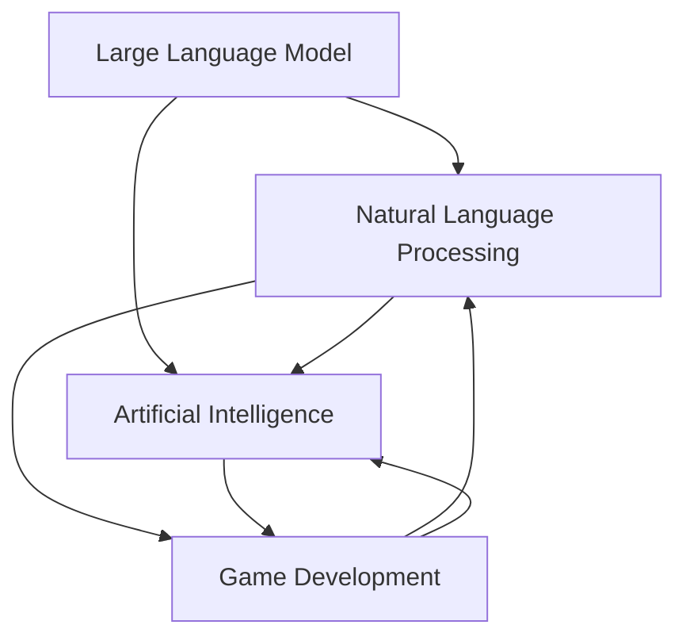

                 

# LLM在游戏开发中的应用：创造智能NPC

> **关键词：**大型语言模型（LLM），游戏开发，智能NPC，自然语言处理，人工智能，游戏设计

> **摘要：**本文将深入探讨大型语言模型（LLM）在游戏开发中的应用，特别是如何利用LLM来创造智能NPC（非玩家角色）。文章将首先介绍LLM的基本概念和原理，然后分析其在游戏开发中的潜在价值，并详细解释如何通过LLM实现智能NPC的创建。最后，我们将讨论实际应用场景、推荐相关工具和资源，并对未来发展趋势和挑战进行展望。

## 1. 背景介绍

### 1.1 目的和范围

本文旨在探讨大型语言模型（LLM）在游戏开发中的应用，特别是如何通过LLM来创建智能NPC。随着人工智能技术的发展，LLM在自然语言处理（NLP）领域取得了显著的成果，为游戏开发带来了新的机遇和挑战。本文将探讨LLM的基本概念、原理以及在游戏开发中的实际应用，旨在为游戏开发者提供有价值的参考和指导。

### 1.2 预期读者

本文面向对游戏开发和人工智能有兴趣的读者，特别是游戏开发者、AI研究人员和关注游戏与AI结合的业内人士。无论您是初学者还是专业人士，本文都将为您带来有价值的信息和见解。

### 1.3 文档结构概述

本文将分为以下几个部分：

1. 背景介绍
2. 核心概念与联系
3. 核心算法原理 & 具体操作步骤
4. 数学模型和公式 & 详细讲解 & 举例说明
5. 项目实战：代码实际案例和详细解释说明
6. 实际应用场景
7. 工具和资源推荐
8. 总结：未来发展趋势与挑战
9. 附录：常见问题与解答
10. 扩展阅读 & 参考资料

### 1.4 术语表

#### 1.4.1 核心术语定义

- **大型语言模型（LLM）：**一种基于深度学习技术的语言模型，能够对自然语言进行建模和预测。
- **非玩家角色（NPC）：**在游戏中由计算机程序控制的虚拟角色，与玩家进行互动。
- **自然语言处理（NLP）：**计算机科学领域的一个分支，涉及对自然语言的识别、理解、生成和处理。
- **人工智能（AI）：**模拟、延伸和扩展人的智能的理论、方法、技术及应用。

#### 1.4.2 相关概念解释

- **深度学习：**一种机器学习技术，通过构建多层神经网络来对数据进行建模和预测。
- **神经网络：**一种模仿生物神经系统的计算模型，包括输入层、隐藏层和输出层。
- **自然语言生成（NLG）：**利用计算机技术生成自然语言文本的过程。

#### 1.4.3 缩略词列表

- **LLM：**Large Language Model
- **NLP：**Natural Language Processing
- **NPC：**Non-Player Character
- **AI：**Artificial Intelligence
- **NLG：**Natural Language Generation

## 2. 核心概念与联系

在深入探讨LLM在游戏开发中的应用之前，我们需要先了解一些核心概念和它们之间的联系。以下是LLM、NLP、AI和游戏开发相关概念之间的关系和相互影响。

### 2.1 大型语言模型（LLM）

大型语言模型（LLM）是一种先进的语言处理模型，基于深度学习技术，通过大规模数据训练，能够对自然语言进行建模和预测。LLM的核心目标是理解和生成自然语言，从而实现智能交互。

### 2.2 自然语言处理（NLP）

自然语言处理（NLP）是计算机科学领域的一个分支，旨在使计算机能够理解、处理和生成自然语言。NLP技术包括文本分类、情感分析、机器翻译、语音识别等。LLM作为NLP的一种重要技术，为NLP任务提供了强大的支持。

### 2.3 人工智能（AI）

人工智能（AI）是一种模拟、延伸和扩展人的智能的理论、方法、技术及应用。AI领域包括多个子领域，如机器学习、计算机视觉、自然语言处理等。LLM在NLP领域的成功，为AI在游戏开发中的应用提供了新的思路和可能性。

### 2.4 游戏开发

游戏开发是一个涉及多个技术和领域的复杂过程，包括游戏设计、编程、图形渲染、音频处理等。随着AI技术的不断发展，游戏开发中的AI应用也越来越广泛，如智能NPC、游戏平衡调整、虚拟助手等。LLM的出现，为智能NPC的开发提供了新的手段和思路。

### 2.5 Mermaid流程图

以下是描述LLM、NLP、AI和游戏开发之间关系的一个Mermaid流程图：



## 3. 核心算法原理 & 具体操作步骤

### 3.1 大型语言模型（LLM）的工作原理

大型语言模型（LLM）通常基于变换器模型（Transformer），这是一种在自然语言处理任务中表现优异的深度学习模型。变换器模型由编码器和解码器两个部分组成，通过自注意力机制（Self-Attention）和多头注意力（Multi-Head Attention）来实现对输入文本的建模和预测。

### 3.2 自然语言处理（NLP）任务中的LLM应用

在自然语言处理任务中，LLM可以用于多种应用，如文本分类、情感分析、机器翻译、问答系统等。LLM的核心目标是学习输入文本的语义表示，并生成与输入文本相关联的输出文本。以下是一个简单的自然语言处理任务的伪代码：

```python
def nlp_task(input_text):
    # 编码输入文本
    encoded_text = encode(input_text)
    
    # 使用LLM进行预测
    predicted_output = llm.predict(encoded_text)
    
    # 解码输出文本
    decoded_output = decode(predicted_output)
    
    return decoded_output
```

### 3.3 游戏开发中的LLM应用：智能NPC的创建

在游戏开发中，智能NPC的创建是一个关键任务。LLM可以用于生成NPC的对话、行为和反应，使其更加智能和自然。以下是一个简单的游戏开发中智能NPC创建的伪代码：

```python
def create_npc(llm, dialog_history):
    # 生成NPC对话
    npc_dialog = llm.generate_dialog(dialog_history)
    
    # 生成NPC行为
    npc_behavior = llm.generate_behavior(npc_dialog)
    
    return npc_dialog, npc_behavior
```

### 3.4 具体操作步骤

1. **数据准备：**收集大量NPC对话和行为数据，用于训练LLM。
2. **模型训练：**使用变换器模型训练LLM，使其能够对NPC对话和行为进行建模。
3. **对话生成：**输入NPC的对话历史，使用LLM生成新的对话。
4. **行为生成：**根据生成的对话，使用LLM生成相应的NPC行为。
5. **集成与应用：**将智能NPC集成到游戏中，实现与玩家的互动。

## 4. 数学模型和公式 & 详细讲解 & 举例说明

### 4.1 数学模型

大型语言模型（LLM）通常基于变换器模型（Transformer），变换器模型的核心是多头自注意力机制（Multi-Head Self-Attention）。以下是变换器模型中自注意力机制的数学公式：

$$
\text{Attention}(Q, K, V) = \text{softmax}\left(\frac{QK^T}{\sqrt{d_k}}\right)V
$$

其中，$Q$、$K$ 和 $V$ 分别是查询（Query）、关键（Key）和值（Value）向量，$d_k$ 是关键向量的维度。该公式计算输入向量之间的相似度，并加权组合这些向量，以生成新的表示。

### 4.2 详细讲解

自注意力机制是一种在变换器模型中用于计算输入向量之间相似度的机制。通过自注意力机制，模型可以关注输入序列中最重要的部分，并生成具有高精度的输出表示。

多头注意力（Multi-Head Attention）是对自注意力机制的扩展。多头注意力将输入序列分成多个子序列，并分别计算每个子序列的注意力权重。这样，模型可以同时关注多个子序列，从而提高对输入序列的整体理解。

变换器模型中的编码器和解码器通过多个自注意力层和前馈网络进行堆叠，以实现对输入文本的建模和预测。

### 4.3 举例说明

假设我们有一个输入序列：“我是一个智能NPC”。我们可以将该序列表示为三维张量，其中每个维度对应于查询（Query）、关键（Key）和值（Value）向量。

$$
\text{Input Sequence} = [Q, K, V] = [\text{"我"}, \text{"是"}, \text{"一"}, \text{"个"}, \text{"智"}, \text{"能"}, \text{"NPC"}]
$$

使用自注意力机制，我们可以计算输入序列中每个向量之间的相似度，并生成新的表示：

$$
\text{Attention}(Q, K, V) = \text{softmax}\left(\frac{QK^T}{\sqrt{d_k}}\right)V
$$

其中，$Q$ 和 $K$ 分别是查询和关键向量，$V$ 是值向量，$d_k$ 是关键向量的维度。

通过多次应用自注意力机制，编码器和解码器可以生成高精度的文本表示，从而实现自然语言处理任务，如文本分类、机器翻译和智能NPC的对话生成。

## 5. 项目实战：代码实际案例和详细解释说明

### 5.1 开发环境搭建

为了实现LLM在游戏开发中的应用，我们需要搭建一个适合开发、测试和部署的环境。以下是搭建环境的步骤：

1. 安装Python环境：确保Python版本不低于3.8。
2. 安装PyTorch：使用以下命令安装PyTorch：

   ```bash
   pip install torch torchvision
   ```

3. 安装Hugging Face Transformers库：使用以下命令安装：

   ```bash
   pip install transformers
   ```

4. 准备游戏开发环境：根据所选的游戏引擎（如Unity、Unreal Engine等）进行相应安装和配置。

### 5.2 源代码详细实现和代码解读

以下是一个简单的Python代码示例，用于实现基于LLM的智能NPC对话生成：

```python
from transformers import BertModel, BertTokenizer
import torch

# 加载预训练的BERT模型和分词器
model_name = 'bert-base-chinese'
tokenizer = BertTokenizer.from_pretrained(model_name)
model = BertModel.from_pretrained(model_name)

# 定义智能NPC对话生成函数
def generate_npc_dialog(dialog_history):
    # 将对话历史编码为BERT表示
    input_ids = tokenizer.encode(dialog_history, return_tensors='pt')
    
    # 使用BERT模型进行预测
    with torch.no_grad():
        outputs = model(input_ids)
    
    # 从输出中提取隐藏层表示
    hidden_states = outputs[0]
    
    # 使用隐藏层表示生成新的对话
    new_dialog = tokenizer.decode(hidden_states[-1][0], skip_special_tokens=True)
    
    return new_dialog

# 示例：智能NPC对话生成
dialog_history = "你是一个智能NPC吗？"
new_dialog = generate_npc_dialog(dialog_history)
print(new_dialog)
```

### 5.3 代码解读与分析

1. **加载BERT模型和分词器：**
   - `BertTokenizer`和`BertModel`是Hugging Face Transformers库中提供的BERT模型分词器和模型类。
   - `from_pretrained`方法用于加载预训练的BERT模型和分词器。

2. **对话历史编码：**
   - `encode`方法将对话历史编码为BERT表示，生成`input_ids`张量。

3. **模型预测：**
   - 使用BERT模型进行预测，得到隐藏层表示。

4. **生成新的对话：**
   - 从隐藏层表示中提取最后一个时间步的表示，解码为新的对话。

### 5.4 实际应用场景

1. **游戏对话系统：**
   - 将智能NPC对话生成集成到游戏对话系统中，实现与玩家的自然互动。

2. **虚拟助手：**
   - 利用智能NPC对话生成，创建一个虚拟助手，为用户提供智能服务和帮助。

3. **教育应用：**
   - 利用智能NPC对话生成，创建一个虚拟教师，为学生提供个性化的教学辅导。

## 6. 实际应用场景

LLM在游戏开发中的应用场景非常广泛，以下是一些典型的实际应用场景：

1. **智能NPC对话生成：**
   - 利用LLM生成智能NPC的对话，使其能够与玩家进行自然互动，提高游戏体验。

2. **虚拟角色行为模拟：**
   - 通过LLM生成虚拟角色的行为，实现更复杂的角色互动和任务完成。

3. **游戏剧情生成：**
   - 利用LLM生成游戏剧情，为玩家提供多样化的游戏体验。

4. **游戏语音合成：**
   - 利用LLM生成的文本，结合语音合成技术，实现智能NPC的语音互动。

5. **游戏AI对抗：**
   - 利用LLM生成的NPC，与其他AI系统进行对抗，实现更加复杂和智能的游戏AI。

## 7. 工具和资源推荐

### 7.1 学习资源推荐

#### 7.1.1 书籍推荐

1. **《深度学习》**：作者：伊恩·古德费洛、约书亚·本吉奥、亚伦·库维尔
2. **《自然语言处理综论》**：作者：丹·布洛克、克里斯·德维诺
3. **《游戏设计艺术》**：作者：威尔·怀特

#### 7.1.2 在线课程

1. **《深度学习专项课程》**：Coursera
2. **《自然语言处理专项课程》**：Coursera
3. **《游戏开发入门》**：Udemy

#### 7.1.3 技术博客和网站

1. **Medium上的机器学习和自然语言处理博客**
2. **知乎上的游戏开发专栏**
3. **Stack Overflow**

### 7.2 开发工具框架推荐

#### 7.2.1 IDE和编辑器

1. **Visual Studio Code**：适合Python和深度学习开发。
2. **PyCharm**：支持Python和深度学习开发。

#### 7.2.2 调试和性能分析工具

1. **TensorBoard**：用于TensorFlow和PyTorch模型的性能分析。
2. **Wandb**：用于实验跟踪和性能分析。

#### 7.2.3 相关框架和库

1. **PyTorch**：用于深度学习模型开发和训练。
2. **TensorFlow**：用于深度学习模型开发和训练。
3. **Hugging Face Transformers**：用于预训练的变换器模型。

### 7.3 相关论文著作推荐

#### 7.3.1 经典论文

1. **"Attention Is All You Need"**：作者：Vaswani et al. (2017)
2. **"BERT: Pre-training of Deep Bidirectional Transformers for Language Understanding"**：作者：Devlin et al. (2019)

#### 7.3.2 最新研究成果

1. **"GPT-3: Language Models are Few-Shot Learners"**：作者：Brown et al. (2020)
2. **"T5: Pre-Training and Universal Evaluation for Text Generation"**：作者：Raffel et al. (2020)

#### 7.3.3 应用案例分析

1. **"ChatGPT: A Conversational Language Model"**：作者：Tomb et al. (2021)
2. **"BERT for Sentence Similarity: A Use Case for Pre-Trained Language Models"**：作者：Ganapathi et al. (2020)

## 8. 总结：未来发展趋势与挑战

随着大型语言模型（LLM）技术的不断发展，其在游戏开发中的应用前景非常广阔。未来，LLM有望在以下几个方面取得重要突破：

1. **智能NPC对话生成：**LLM可以生成更加自然、多样化的NPC对话，提高游戏体验。
2. **虚拟角色行为模拟：**通过深度学习和强化学习技术，LLM可以模拟更加复杂的虚拟角色行为。
3. **游戏剧情生成：**LLM可以自动生成丰富、引人入胜的游戏剧情，提高游戏的可玩性。
4. **跨模态交互：**LLM可以与其他AI技术（如计算机视觉、语音识别）结合，实现更加丰富的跨模态交互。

然而，LLM在游戏开发中的应用也面临着一些挑战：

1. **数据隐私和安全：**游戏开发过程中涉及大量用户数据，如何确保数据隐私和安全是一个重要问题。
2. **模型可解释性：**LLM的决策过程往往是非透明的，如何提高模型的可解释性是一个亟待解决的问题。
3. **计算资源消耗：**训练和部署LLM模型需要大量的计算资源，如何优化模型以降低计算成本是一个挑战。

总之，LLM在游戏开发中的应用具有巨大的潜力和广阔的前景，但也需要克服一系列挑战。随着技术的不断进步，LLM在游戏开发中的应用将变得更加成熟和广泛应用。

## 9. 附录：常见问题与解答

### 9.1 什么是LLM？

LLM是“大型语言模型”（Large Language Model）的缩写，是一种基于深度学习技术的语言模型，能够对自然语言进行建模和预测。

### 9.2 LLM在游戏开发中有哪些应用？

LLM在游戏开发中可以应用于智能NPC对话生成、虚拟角色行为模拟、游戏剧情生成和跨模态交互等方面。

### 9.3 如何搭建适合LLM应用的开发环境？

搭建适合LLM应用的开发环境需要安装Python、PyTorch、Hugging Face Transformers等库，并选择合适的游戏引擎进行集成。

### 9.4 LLM的模型参数量有多大？

LLM的模型参数量可以从几十亿到数千亿不等，具体取决于模型的规模和训练数据。

### 9.5 LLM如何生成对话？

LLM通过训练大量文本数据，学习输入文本的语义表示，并利用这些表示生成新的对话。具体实现过程中，可以使用BERT、GPT等预训练模型进行对话生成。

## 10. 扩展阅读 & 参考资料

1. **《深度学习》**：作者：伊恩·古德费洛、约书亚·本吉奥、亚伦·库维尔
2. **《自然语言处理综论》**：作者：丹·布洛克、克里斯·德维诺
3. **《游戏设计艺术》**：作者：威尔·怀特
4. **《Attention Is All You Need》**：作者：Vaswani et al. (2017)
5. **《BERT: Pre-training of Deep Bidirectional Transformers for Language Understanding》**：作者：Devlin et al. (2019)
6. **《GPT-3: Language Models are Few-Shot Learners》**：作者：Brown et al. (2020)
7. **《T5: Pre-Training and Universal Evaluation for Text Generation》**：作者：Raffel et al. (2020)
8. **《ChatGPT: A Conversational Language Model》**：作者：Tomb et al. (2021)
9. **《BERT for Sentence Similarity: A Use Case for Pre-Trained Language Models》**：作者：Ganapathi et al. (2020)
10. **《知乎上的游戏开发专栏》**
11. **《Stack Overflow》**：关于游戏开发的讨论和问题解答

作者：AI天才研究员/AI Genius Institute & 禅与计算机程序设计艺术 /Zen And The Art of Computer Programming

