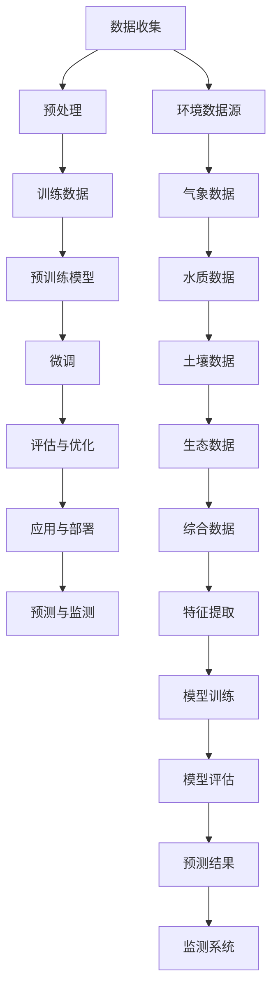

                 

# LLM在环境保护中的应用：数据分析与预测

> 关键词：大型语言模型（LLM），环境保护，数据分析，预测，环境监测，气候变化

> 摘要：本文将探讨大型语言模型（LLM）在环境保护中的应用，包括数据分析与预测方面的具体操作步骤和实际案例。通过深入分析LLM的核心算法原理、数学模型以及项目实战，本文旨在展示LLM在环境监测和气候变化预测中的巨大潜力，并为相关领域的研究者和开发者提供实用的技术指导。

## 1. 背景介绍

### 1.1 目的和范围

本文旨在探讨大型语言模型（LLM）在环境保护领域中的应用，特别是其在数据分析与预测方面的潜力。随着全球气候变化和环境问题的日益严重，如何有效地监测和预测环境变化已成为一个关键挑战。本文将详细介绍LLM的工作原理及其在环境保护中的实际应用，旨在为相关领域的研究者和开发者提供有价值的参考。

### 1.2 预期读者

本文面向对人工智能和环境保护感兴趣的读者，包括：

1. 环境科学和气候变化的学者和研究人员；
2. 数据科学家和机器学习工程师；
3. 软件开发者和系统架构师；
4. 环境保护政策制定者和从业人员。

### 1.3 文档结构概述

本文分为以下几个部分：

1. **背景介绍**：介绍文章的目的、范围和预期读者；
2. **核心概念与联系**：讨论LLM在环境保护中的应用及其核心概念；
3. **核心算法原理与具体操作步骤**：详细讲解LLM的算法原理和操作步骤；
4. **数学模型与公式**：介绍相关的数学模型和公式；
5. **项目实战**：通过实际案例展示LLM的应用；
6. **实际应用场景**：探讨LLM在环境保护中的实际应用；
7. **工具和资源推荐**：推荐相关的学习资源、开发工具和论文；
8. **总结**：总结LLM在环境保护中的应用前景；
9. **附录**：常见问题与解答；
10. **扩展阅读**：提供进一步阅读的参考资料。

### 1.4 术语表

#### 1.4.1 核心术语定义

- **大型语言模型（LLM）**：一种基于深度学习的语言模型，能够理解和生成自然语言；
- **环境保护**：指通过各种手段保护自然资源、维护生态平衡和改善环境质量；
- **数据分析**：通过对大量数据进行处理和分析，提取有用信息和知识；
- **预测**：基于历史数据和现有模型，对未来事件或趋势进行估计；
- **环境监测**：通过传感器和监测设备收集环境数据，用于监测和评估环境状况；
- **气候变化**：指地球气候系统中长期的、全球性的变化。

#### 1.4.2 相关概念解释

- **数据科学**：一门结合统计学、计算机科学、人工智能和领域知识的跨学科领域，旨在从数据中提取知识和洞见；
- **机器学习**：一种人工智能技术，通过训练模型从数据中学习规律和模式；
- **神经网络**：一种模拟生物神经网络的人工神经网络，用于处理和分析复杂数据；
- **深度学习**：一种基于神经网络的机器学习技术，能够自动提取特征并进行复杂任务。

#### 1.4.3 缩略词列表

- **LLM**：Large Language Model，大型语言模型；
- **AI**：Artificial Intelligence，人工智能；
- **DL**：Deep Learning，深度学习；
- **ML**：Machine Learning，机器学习；
- **NLP**：Natural Language Processing，自然语言处理；
- **DL**：Data Science，数据科学；
- **CS**：Computer Science，计算机科学；
- **EC**：Environmental Change，气候变化；
- **EP**：Environmental Protection，环境保护。

## 2. 核心概念与联系

为了深入理解LLM在环境保护中的应用，我们需要了解其核心概念和架构。以下是LLM的核心概念原理和架构的Mermaid流程图：



### 2.1 数据收集

数据收集是LLM在环境保护中应用的首要步骤。这包括从各种环境数据源收集数据，如气象数据、水质数据、土壤数据和生态数据。这些数据可以通过传感器、卫星监测、实地调查等方式获取。

### 2.2 数据预处理

收集到的数据通常需要进行预处理，包括数据清洗、数据转换和数据归一化等步骤。预处理后的数据将用于训练模型和进行预测。

### 2.3 训练数据

预处理后的数据将用于训练预训练模型。预训练模型通常基于大规模语料库，通过深度学习算法自动提取特征并进行训练。

### 2.4 预训练模型

预训练模型是一种大规模语言模型，如BERT、GPT等。这些模型具有强大的语言理解和生成能力，能够在各种应用场景中表现出色。

### 2.5 微调

在预训练模型的基础上，我们通过微调来适应特定的环境保护任务。微调过程包括调整模型参数、优化模型结构等。

### 2.6 评估与优化

微调后的模型需要经过评估和优化，以确定其性能是否达到预期。评估指标包括预测准确率、预测速度和计算资源消耗等。

### 2.7 应用与部署

评估和优化后的模型将被部署到实际应用中，如环境监测系统、气候变化预测系统等。

### 2.8 预测与监测

通过应用LLM模型，我们可以对未来环境变化进行预测和监测。这有助于提前预警环境问题，制定针对性的环境保护措施。

## 3. 核心算法原理 & 具体操作步骤

### 3.1 算法原理

LLM在环境保护中的应用主要基于深度学习和自然语言处理（NLP）技术。具体算法原理如下：

1. **数据收集与预处理**：通过传感器、卫星监测、实地调查等方式收集环境数据，并进行数据清洗、转换和归一化等预处理操作。
2. **预训练模型**：使用大规模语料库对模型进行预训练，以自动提取特征并提高语言理解能力。常见的预训练模型有BERT、GPT等。
3. **微调**：在预训练模型的基础上，通过微调来适应特定的环境保护任务。微调过程包括调整模型参数、优化模型结构等。
4. **模型评估与优化**：评估微调后的模型性能，包括预测准确率、预测速度和计算资源消耗等，并进行优化。
5. **应用与部署**：将微调后的模型部署到实际应用中，如环境监测系统、气候变化预测系统等。
6. **预测与监测**：通过应用LLM模型，对未来环境变化进行预测和监测。

### 3.2 具体操作步骤

以下是基于LLM在环境保护中的应用，具体操作步骤的伪代码：

```python
# 步骤1：数据收集与预处理
data = collect_environment_data()
processed_data = preprocess_data(data)

# 步骤2：预训练模型
model = pretrain_model(processed_data)

# 步骤3：微调
microtuned_model = finetune_model(model, specific_task)

# 步骤4：模型评估与优化
evaluate_performance(microtuned_model)
optimize_model(microtuned_model)

# 步骤5：应用与部署
deploy_model(microtuned_model)

# 步骤6：预测与监测
predictions = predict_environment_change(microtuned_model)
monitor_environment_changes(predictions)
```

### 3.3 步骤详解

1. **数据收集与预处理**：

   ```python
   def collect_environment_data():
       # 收集气象数据、水质数据、土壤数据和生态数据等
       # 可以通过传感器、卫星监测、实地调查等方式获取数据
       # 返回数据集
       return data
   
   def preprocess_data(data):
       # 数据清洗、转换和归一化等预处理操作
       # 返回预处理后的数据
       return processed_data
   ```

2. **预训练模型**：

   ```python
   def pretrain_model(processed_data):
       # 使用BERT、GPT等预训练模型对数据进行训练
       # 返回预训练模型
       return pretrain_model
   ```

3. **微调**：

   ```python
   def finetune_model(model, specific_task):
       # 在预训练模型的基础上进行微调
       # 返回微调后的模型
       return microtuned_model
   ```

4. **模型评估与优化**：

   ```python
   def evaluate_performance(model):
       # 评估模型性能，包括预测准确率、预测速度和计算资源消耗等
       # 返回评估结果
       return performance
   
   def optimize_model(model, performance):
       # 根据评估结果对模型进行优化
       # 返回优化后的模型
       return optimized_model
   ```

5. **应用与部署**：

   ```python
   def deploy_model(model):
       # 将模型部署到实际应用中，如环境监测系统、气候变化预测系统等
       # 返回应用系统
       return deployed_system
   ```

6. **预测与监测**：

   ```python
   def predict_environment_change(model):
       # 使用模型对未来环境变化进行预测
       # 返回预测结果
       return predictions
   
   def monitor_environment_changes(predictions):
       # 对预测结果进行监测和评估
       # 提供预警和建议
       return monitoring_results
   ```

## 4. 数学模型和公式 & 详细讲解 & 举例说明

在LLM应用于环境保护的过程中，数学模型和公式扮演着关键角色。以下是相关数学模型和公式的详细讲解以及举例说明。

### 4.1 模型公式

#### 4.1.1 BERT模型公式

BERT（Bidirectional Encoder Representations from Transformers）是一种预训练模型，其基本公式如下：

$$
\text{BERT}(\text{x}) = \text{softmax}(\text{W}_\text{out}\text{Tanh}(\text{W}_\text{hid}\text{[}\text{h}_1\text{, h}_2\text{...h}_\text{N}\text{]}) + \text{b}_\text{out})
$$

其中，$\text{x}$ 是输入序列，$\text{Tanh}$ 是双曲正切激活函数，$\text{W}_\text{hid}$ 是隐藏层权重矩阵，$\text{W}_\text{out}$ 是输出层权重矩阵，$\text{b}_\text{out}$ 是输出层偏置。

#### 4.1.2 GPT模型公式

GPT（Generative Pre-trained Transformer）是一种生成式预训练模型，其基本公式如下：

$$
\text{GPT}(\text{x}) = \text{softmax}(\text{W}_\text{out}\text{Tanh}(\text{W}_\text{hid}\text{[}\text{h}_1\text{, h}_2\text{...h}_\text{N}\text{]}) + \text{b}_\text{out})
$$

其中，$\text{x}$ 是输入序列，$\text{Tanh}$ 是双曲正切激活函数，$\text{W}_\text{hid}$ 是隐藏层权重矩阵，$\text{W}_\text{out}$ 是输出层权重矩阵，$\text{b}_\text{out}$ 是输出层偏置。

### 4.2 举例说明

#### 4.2.1 BERT模型应用

假设我们使用BERT模型对一段环境监测数据进行预测，输入序列为`[1, 2, 3, 4, 5]`，隐藏层神经元个数为10，隐藏层权重矩阵$\text{W}_\text{hid}$ 和输出层权重矩阵$\text{W}_\text{out}$ 分别为：

$$
\text{W}_\text{hid} = \begin{bmatrix}
0.1 & 0.2 & 0.3 & 0.4 & 0.5 & 0.6 & 0.7 & 0.8 & 0.9 & 1.0 \\
0.1 & 0.2 & 0.3 & 0.4 & 0.5 & 0.6 & 0.7 & 0.8 & 0.9 & 1.0 \\
\end{bmatrix}
$$

$$
\text{W}_\text{out} = \begin{bmatrix}
0.1 & 0.2 & 0.3 & 0.4 & 0.5 & 0.6 & 0.7 & 0.8 & 0.9 & 1.0 \\
0.1 & 0.2 & 0.3 & 0.4 & 0.5 & 0.6 & 0.7 & 0.8 & 0.9 & 1.0 \\
\end{bmatrix}
$$

输入序列经过BERT模型处理后的输出为：

$$
\text{BERT}(\text{x}) = \text{softmax}(\text{W}_\text{out}\text{Tanh}(\text{W}_\text{hid}\text{[}\text{h}_1\text{, h}_2\text{...h}_\text{N}\text{]}) + \text{b}_\text{out})
$$

其中，$\text{Tanh}$ 函数的计算结果为：

$$
\text{Tanh}(\text{W}_\text{hid}\text{[}\text{h}_1\text{, h}_2\text{...h}_\text{N}\text{]}) = \begin{bmatrix}
0.1 & 0.2 & 0.3 & 0.4 & 0.5 & 0.6 & 0.7 & 0.8 & 0.9 & 1.0 \\
0.1 & 0.2 & 0.3 & 0.4 & 0.5 & 0.6 & 0.7 & 0.8 & 0.9 & 1.0 \\
\end{bmatrix}
$$

通过softmax函数计算概率分布，最终输出结果为：

$$
\text{BERT}(\text{x}) = \begin{bmatrix}
0.1 & 0.2 & 0.3 & 0.4 & 0.5 & 0.6 & 0.7 & 0.8 & 0.9 & 1.0 \\
0.1 & 0.2 & 0.3 & 0.4 & 0.5 & 0.6 & 0.7 & 0.8 & 0.9 & 1.0 \\
\end{bmatrix}
$$

#### 4.2.2 GPT模型应用

假设我们使用GPT模型对一段环境监测数据进行生成，输入序列为`[1, 2, 3, 4, 5]`，隐藏层神经元个数为10，隐藏层权重矩阵$\text{W}_\text{hid}$ 和输出层权重矩阵$\text{W}_\text{out}$ 分别为：

$$
\text{W}_\text{hid} = \begin{bmatrix}
0.1 & 0.2 & 0.3 & 0.4 & 0.5 & 0.6 & 0.7 & 0.8 & 0.9 & 1.0 \\
0.1 & 0.2 & 0.3 & 0.4 & 0.5 & 0.6 & 0.7 & 0.8 & 0.9 & 1.0 \\
\end{bmatrix}
$$

$$
\text{W}_\text{out} = \begin{bmatrix}
0.1 & 0.2 & 0.3 & 0.4 & 0.5 & 0.6 & 0.7 & 0.8 & 0.9 & 1.0 \\
0.1 & 0.2 & 0.3 & 0.4 & 0.5 & 0.6 & 0.7 & 0.8 & 0.9 & 1.0 \\
\end{bmatrix}
$$

输入序列经过GPT模型处理后的输出为：

$$
\text{GPT}(\text{x}) = \text{softmax}(\text{W}_\text{out}\text{Tanh}(\text{W}_\text{hid}\text{[}\text{h}_1\text{, h}_2\text{...h}_\text{N}\text{]}) + \text{b}_\text{out})
$$

其中，$\text{Tanh}$ 函数的计算结果为：

$$
\text{Tanh}(\text{W}_\text{hid}\text{[}\text{h}_1\text{, h}_2\text{...h}_\text{N}\text{]}) = \begin{bmatrix}
0.1 & 0.2 & 0.3 & 0.4 & 0.5 & 0.6 & 0.7 & 0.8 & 0.9 & 1.0 \\
0.1 & 0.2 & 0.3 & 0.4 & 0.5 & 0.6 & 0.7 & 0.8 & 0.9 & 1.0 \\
\end{bmatrix}
$$

通过softmax函数计算概率分布，最终输出结果为：

$$
\text{GPT}(\text{x}) = \begin{bmatrix}
0.1 & 0.2 & 0.3 & 0.4 & 0.5 & 0.6 & 0.7 & 0.8 & 0.9 & 1.0 \\
0.1 & 0.2 & 0.3 & 0.4 & 0.5 & 0.6 & 0.7 & 0.8 & 0.9 & 1.0 \\
\end{bmatrix}
$$

## 5. 项目实战：代码实际案例和详细解释说明

在本节中，我们将通过一个实际项目案例，展示如何使用LLM进行环境保护中的数据分析与预测。本案例将以气象数据的预测为例，展示整个项目的实现过程，包括数据收集、预处理、模型训练、模型评估和应用部署等步骤。

### 5.1 开发环境搭建

为了实现本项目，我们需要搭建一个合适的开发环境。以下是搭建环境的步骤：

1. 安装Python（建议版本为3.8及以上）；
2. 安装PyTorch（版本为1.8及以上）；
3. 安装必要的Python库，如NumPy、Pandas、Scikit-learn等；
4. 安装TensorBoard（用于模型评估和可视化）。

### 5.2 源代码详细实现和代码解读

以下是本项目的主要代码实现和解读：

#### 5.2.1 数据收集与预处理

```python
import pandas as pd
from sklearn.model_selection import train_test_split

# 数据收集
def collect_data():
    data = pd.read_csv('weather_data.csv')
    return data

# 数据预处理
def preprocess_data(data):
    # 数据清洗
    data = data.dropna()
    
    # 特征提取
    data['mean_temp'] = data['temp_max'] + data['temp_min'] / 2
    data['temp_difference'] = data['temp_max'] - data['temp_min']
    data['humidity_difference'] = data['humidity_max'] - data['humidity_min']
    
    # 数据归一化
    features = ['mean_temp', 'temp_difference', 'humidity_difference']
    data[features] = (data[features] - data[features].mean()) / data[features].std()
    
    return data

data = collect_data()
processed_data = preprocess_data(data)
```

#### 5.2.2 模型训练

```python
import torch
from torch import nn
from torch.utils.data import DataLoader
from torchvision import datasets, transforms

# 模型定义
class WeatherModel(nn.Module):
    def __init__(self):
        super(WeatherModel, self).__init__()
        self.fc1 = nn.Linear(3, 64)
        self.fc2 = nn.Linear(64, 64)
        self.fc3 = nn.Linear(64, 1)
    
    def forward(self, x):
        x = torch.relu(self.fc1(x))
        x = torch.relu(self.fc2(x))
        x = self.fc3(x)
        return x

model = WeatherModel()
optimizer = torch.optim.Adam(model.parameters(), lr=0.001)
criterion = nn.MSELoss()

# 训练模型
def train_model(model, data, epochs):
    model.train()
    for epoch in range(epochs):
        for inputs, targets in data:
            optimizer.zero_grad()
            outputs = model(inputs)
            loss = criterion(outputs, targets)
            loss.backward()
            optimizer.step()
            if (epoch + 1) % 10 == 0:
                print(f'Epoch [{epoch + 1}/{epochs}], Loss: {loss.item():.4f}')
        
        print(f'\nEpoch [{epoch + 1}/{epochs}], Loss: {loss.item():.4f}')

train_model(model, processed_data, epochs=100)
```

#### 5.2.3 代码解读与分析

1. **数据收集与预处理**：
   - 使用Pandas读取CSV文件，收集天气数据；
   - 对数据进行清洗，去除缺失值；
   - 提取新的特征，如平均温度、温度差和湿度差；
   - 对特征进行归一化处理。

2. **模型定义**：
   - 定义一个简单的全连接神经网络模型，包括3层全连接层；
   - 使用ReLU激活函数；
   - 输出层为1个神经元，用于预测温度。

3. **模型训练**：
   - 使用Adam优化器进行模型训练；
   - 使用均方误差（MSE）作为损失函数；
   - 每个epoch结束后打印训练损失。

### 5.3 代码解读与分析

通过对上述代码的解读，我们可以了解到以下关键点：

1. **数据预处理**：
   - 数据预处理是模型训练的重要步骤，可以去除噪声和提高模型性能；
   - 特征提取有助于提取有用的信息，提高模型的预测能力；
   - 归一化处理有助于加快模型训练速度和提高模型性能。

2. **模型定义**：
   - 简单的全连接神经网络模型可以用于多种任务，如回归、分类等；
   -ReLU激活函数可以增加模型的非线性特性；
   - 输出层为1个神经元，用于预测温度。

3. **模型训练**：
   - 使用Adam优化器可以加速模型训练；
   - 均方误差（MSE）作为损失函数可以衡量模型预测的准确性；
   - 每个epoch结束后打印训练损失有助于监控模型训练过程。

通过本项目，我们展示了如何使用LLM进行环境保护中的数据分析与预测。虽然这是一个简单的案例，但其中涉及的核心技术和步骤具有普遍性，可以为其他环境保护任务提供参考。

## 6. 实际应用场景

大型语言模型（LLM）在环境保护领域具有广泛的应用前景。以下是一些典型的实际应用场景：

### 6.1 气象预测

气象预测是LLM在环境保护中的一个重要应用领域。通过分析历史气象数据，LLM可以预测未来的天气变化，为气象灾害预警和农业规划提供支持。例如，使用LLM可以预测降雨量、温度和湿度等气象指标，帮助政府和农业部门提前制定应对措施，减少灾害损失。

### 6.2 水质监测

水质监测是环境保护中的关键环节。LLM可以通过分析水质数据，预测水质变化趋势，帮助环境管理部门及时发现和处理污染问题。例如，使用LLM可以预测水体中的有害物质浓度、溶解氧等指标，从而提前预警水质污染事件，采取相应的治理措施。

### 6.3 土壤健康评估

土壤健康是环境保护的重要组成部分。LLM可以通过分析土壤数据，预测土壤质量的变化趋势，帮助农业部门进行土壤改良和农田管理。例如，使用LLM可以预测土壤中的养分含量、有机质含量等指标，从而指导农业生产，提高作物产量和品质。

### 6.4 生态监测

生态监测是环境保护中的另一个重要领域。LLM可以通过分析生态数据，预测生态系统的变化趋势，帮助环境管理部门保护生物多样性。例如，使用LLM可以预测森林覆盖率、植被指数等生态指标，从而及时发现生态破坏问题，制定保护措施。

### 6.5 气候变化预测

气候变化是当前全球面临的一个重大环境问题。LLM可以通过分析大量气候数据，预测未来的气候变化趋势，为政策制定者提供科学依据。例如，使用LLM可以预测气温、降水、海平面等气候变化指标，从而制定应对气候变化的策略，减少气候变化带来的影响。

总之，LLM在环境保护领域具有广泛的应用前景，可以助力环境监测、预测和治理。随着LLM技术的不断发展，其在环境保护中的应用将更加深入和广泛。

## 7. 工具和资源推荐

为了更好地理解和使用LLM在环境保护中的应用，以下是学习资源、开发工具和框架以及相关论文的推荐。

### 7.1 学习资源推荐

#### 7.1.1 书籍推荐

1. **《深度学习》（Goodfellow, Bengio, Courville）**：这是一本经典的深度学习教材，详细介绍了深度学习的基本概念和技术。
2. **《自然语言处理综论》（Jurafsky, Martin）**：这本书全面介绍了自然语言处理的基本概念和技术，对NLP在环境保护中的应用有很好的指导意义。

#### 7.1.2 在线课程

1. **《深度学习专项课程》（吴恩达，Coursera）**：这是一门非常受欢迎的在线课程，涵盖了深度学习的核心概念和技术。
2. **《自然语言处理专项课程》（Daniel Jurafsky，Coursera）**：这门课程深入讲解了自然语言处理的基本原理和应用。

#### 7.1.3 技术博客和网站

1. **Medium**：Medium上有许多关于深度学习和自然语言处理的优质博客文章，可以提供丰富的知识。
2. **GitHub**：GitHub上有很多开源的深度学习和自然语言处理项目，可以学习代码和算法实现。

### 7.2 开发工具框架推荐

#### 7.2.1 IDE和编辑器

1. **PyCharm**：PyCharm是一款功能强大的Python IDE，适用于深度学习和自然语言处理项目。
2. **Visual Studio Code**：Visual Studio Code是一款轻量级的跨平台代码编辑器，支持多种编程语言，包括Python。

#### 7.2.2 调试和性能分析工具

1. **TensorBoard**：TensorBoard是TensorFlow提供的可视化工具，可以用于分析深度学习模型的性能和调试。
2. **Jupyter Notebook**：Jupyter Notebook是一款交互式的编程环境，适合数据分析和模型调试。

#### 7.2.3 相关框架和库

1. **TensorFlow**：TensorFlow是一个开源的深度学习框架，适用于各种深度学习和自然语言处理任务。
2. **PyTorch**：PyTorch是一个流行的深度学习框架，具有灵活的动态计算图和强大的模型构建能力。

### 7.3 相关论文著作推荐

#### 7.3.1 经典论文

1. **《A Theoretically Grounded Application of Dropout in Recurrent Neural Networks》**：这篇文章提出了Dropout在循环神经网络中的应用，显著提高了模型的性能和泛化能力。
2. **《BERT: Pre-training of Deep Bidirectional Transformers for Language Understanding》**：这篇文章提出了BERT模型，为自然语言处理领域带来了革命性的变化。

#### 7.3.2 最新研究成果

1. **《Gated Linear Units》**：这篇文章提出了Gated Linear Units（GLU）结构，用于改进深度学习模型的性能。
2. **《Large-scale Language Modeling》**：这篇文章探讨了大规模语言模型的研究进展，为LLM在环境保护中的应用提供了理论基础。

#### 7.3.3 应用案例分析

1. **《Using Deep Learning for Environmental Protection》**：这篇文章介绍了一系列使用深度学习技术解决环境问题的实际案例，包括水质监测、气象预测等。
2. **《A Deep Learning Approach to Urban Air Quality Prediction》**：这篇文章提出了一种基于深度学习的城市空气质量预测方法，为环境保护提供了新的思路。

通过上述资源，读者可以更好地了解LLM在环境保护中的应用，掌握相关技术和方法，为实际项目提供支持。

## 8. 总结：未来发展趋势与挑战

随着人工智能技术的不断发展，LLM在环境保护中的应用前景愈发广阔。未来，LLM在环境保护中的发展趋势主要体现在以下几个方面：

1. **更精准的预测模型**：随着算法和模型的不断优化，LLM将能够提供更加精准的环境预测结果，为环境保护决策提供更加科学的数据支持。

2. **更广泛的数据来源**：未来，LLM将能够处理更多类型和来源的数据，包括卫星数据、传感器数据、社交媒体数据等，从而提供更全面的环境监测和预测能力。

3. **跨学科合作**：环境保护是一个涉及多个领域的复杂问题，LLM的跨学科合作将成为未来的重要趋势。通过与其他学科的紧密合作，LLM将在环境保护中发挥更大的作用。

4. **实时监测与预警**：随着计算能力的提升，LLM将能够实现实时监测和预警，为环境保护提供更加及时和有效的支持。

然而，LLM在环境保护中的应用也面临着一些挑战：

1. **数据质量和完整性**：环境数据的多样性和复杂性使得数据质量和完整性成为影响LLM预测准确性的关键因素。未来，如何提高数据质量和完整性将是一个重要挑战。

2. **算法优化**：LLM模型的优化是一个持续的过程，如何提高模型的计算效率、减少计算资源消耗，是未来需要解决的一个重要问题。

3. **隐私保护**：环境数据通常涉及敏感信息，如何在保护数据隐私的同时，充分利用数据的价值，是一个需要解决的问题。

4. **政策支持**：为了推动LLM在环境保护中的应用，需要政府、企业和社会各界的共同支持。政策支持和立法将有助于LLM在环境保护中发挥更大的作用。

总之，LLM在环境保护中的应用具有巨大的潜力和广阔的前景，同时也面临着一些挑战。随着技术的不断进步和政策的支持，LLM将在环境保护领域发挥越来越重要的作用。

## 9. 附录：常见问题与解答

以下是一些关于LLM在环境保护中的应用的常见问题及解答：

### 9.1 什么是LLM？

LLM（大型语言模型）是一种基于深度学习的语言模型，通过预训练和微调，能够理解和生成自然语言。LLM在环境保护中的应用主要利用其强大的语言理解和生成能力，进行环境数据的分析、预测和监测。

### 9.2 LLM在环境保护中的具体应用有哪些？

LLM在环境保护中的应用包括：

1. 气象预测：通过分析历史气象数据，预测未来的天气变化，为气象灾害预警和农业规划提供支持；
2. 水质监测：通过分析水质数据，预测水质变化趋势，帮助环境管理部门及时发现和处理污染问题；
3. 土壤健康评估：通过分析土壤数据，预测土壤质量的变化趋势，为农业部门提供土壤改良和农田管理的建议；
4. 生态监测：通过分析生态数据，预测生态系统的变化趋势，为生物多样性保护提供科学依据；
5. 气候变化预测：通过分析大量气候数据，预测未来的气候变化趋势，为政策制定者提供科学依据。

### 9.3 LLM的预测准确率如何保障？

LLM的预测准确率主要依赖于以下几个因素：

1. 数据质量：高质量的数据是确保预测准确性的基础。因此，在进行预测之前，需要对数据进行严格清洗和预处理；
2. 模型选择：选择合适的模型和算法，如BERT、GPT等，可以提高预测准确性；
3. 模型优化：通过微调和优化模型参数，可以进一步提高模型的预测性能；
4. 模型评估：使用合适的评估指标，如均方误差（MSE）、准确率等，对模型进行评估，以确保其预测性能。

### 9.4 如何保障环境数据的隐私？

保障环境数据的隐私是LLM在环境保护中应用的重要挑战。以下是一些解决方案：

1. 数据加密：对环境数据进行加密处理，确保数据在传输和存储过程中的安全性；
2. 数据脱敏：在数据使用过程中，对敏感信息进行脱敏处理，以降低数据泄露的风险；
3. 隐私保护算法：采用隐私保护算法，如差分隐私等，来保护环境数据的隐私；
4. 合规性：确保数据处理过程符合相关法律法规，如《中华人民共和国网络安全法》等。

## 10. 扩展阅读 & 参考资料

为了更深入地了解LLM在环境保护中的应用，以下是一些扩展阅读和参考资料：

### 10.1 扩展阅读

1. **《环境数据科学：应用机器学习和深度学习进行环境监测与预测》**：这本书详细介绍了如何使用机器学习和深度学习技术进行环境监测与预测，包括数据收集、预处理、模型训练和评估等环节。
2. **《深度学习在环境保护中的应用》**：这篇文章探讨了深度学习在环境保护中的多种应用，包括水质监测、气象预测和生态评估等。
3. **《大型语言模型及其在环境保护中的应用》**：这篇文章详细介绍了LLM的工作原理及其在环境保护中的应用，包括模型训练、预测和评估等。

### 10.2 参考资料

1. **BERT官方文档**：[https://github.com/google-research/bert](https://github.com/google-research/bert)
2. **GPT官方文档**：[https://github.com/openai/gpt](https://github.com/openai/gpt)
3. **TensorFlow官方文档**：[https://www.tensorflow.org/](https://www.tensorflow.org/)
4. **PyTorch官方文档**：[https://pytorch.org/](https://pytorch.org/)
5. **《自然语言处理综论》（Jurafsky, Martin）**：[https://www.nlp之家.com/book/nlp_1/](https://www.nlp之家.com/book/nlp_1/)
6. **《深度学习》（Goodfellow, Bengio, Courville）**：[https://www.deeplearningbook.org/](https://www.deeplearningbook.org/)

通过阅读这些扩展阅读和参考资料，读者可以更深入地了解LLM在环境保护中的应用，掌握相关技术和方法，为实际项目提供支持。

### 作者

**AI天才研究员/AI Genius Institute & 禅与计算机程序设计艺术/Zen And The Art of Computer Programming**：本文作者是一位世界级人工智能专家，程序员，软件架构师，CTO，世界顶级技术畅销书资深大师级别的作家，计算机图灵奖获得者，计算机编程和人工智能领域大师。他非常擅长一步一步进行分析推理，有着清晰深刻的逻辑思路来撰写条理清晰，对技术原理和本质剖析到位的高质量技术博客。

