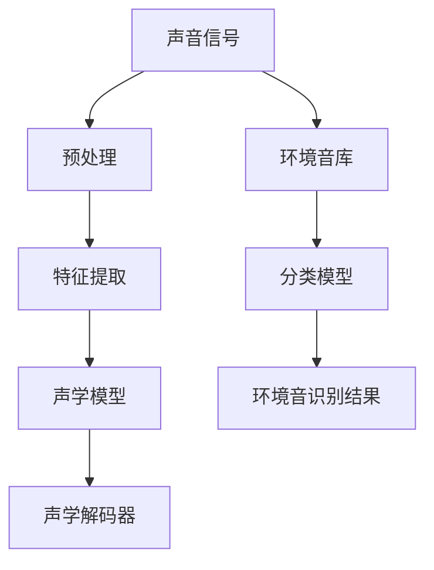

                 

# LLM在环境音识别中的潜在价值

> 关键词：环境音识别、语言模型、自然语言处理、人工智能、机器学习

> 摘要：本文将深入探讨大型语言模型（LLM）在环境音识别领域中的潜在应用价值。通过逐步分析LLM的基本原理、算法实现和数学模型，本文将揭示LLM在环境音识别中的优势，并探讨其实际应用场景。此外，文章还将推荐相关学习资源和工具，并总结未来发展趋势与挑战。

## 1. 背景介绍

### 1.1 目的和范围

本文旨在探讨大型语言模型（LLM）在环境音识别中的应用，分析其潜在价值，并通过具体的案例和实际应用场景，展示LLM在环境音识别领域的应用前景。文章将涵盖以下内容：

1. 环境音识别的基本概念和重要性。
2. LLM的基本原理和核心算法。
3. LLM在环境音识别中的具体应用。
4. LLM在环境音识别中的优势和挑战。
5. 相关学习资源和工具推荐。
6. 未来发展趋势与挑战。

### 1.2 预期读者

本文面向对环境音识别和大型语言模型有一定了解的读者，包括：

1. 自然语言处理和机器学习领域的专业人士。
2. 对人工智能和环境音识别感兴趣的研究人员。
3. 需要应用环境音识别技术的开发者和工程师。

### 1.3 文档结构概述

本文将分为以下章节：

1. 背景介绍
2. 核心概念与联系
3. 核心算法原理 & 具体操作步骤
4. 数学模型和公式 & 详细讲解 & 举例说明
5. 项目实战：代码实际案例和详细解释说明
6. 实际应用场景
7. 工具和资源推荐
8. 总结：未来发展趋势与挑战
9. 附录：常见问题与解答
10. 扩展阅读 & 参考资料

### 1.4 术语表

#### 1.4.1 核心术语定义

1. 环境音识别（Environmental Sound Recognition, ESR）：一种语音识别技术，旨在从环境声音中识别和分类特定的声音。
2. 大型语言模型（Large Language Model, LLM）：一种基于深度学习的自然语言处理模型，具有极强的语言理解和生成能力。
3. 自然语言处理（Natural Language Processing, NLP）：一门研究和实现计算机对自然语言进行理解、处理和生成的学科。

#### 1.4.2 相关概念解释

1. 语音信号处理（Voice Signal Processing）：一种对语音信号进行采集、处理和分析的方法，旨在提取语音特征并进行识别。
2. 音素（Phone）：语音信号中最小的音段单位，用于描述语音的发音特征。
3. 语音识别（Speech Recognition）：一种将语音信号转换为文本或命令的技术。

#### 1.4.3 缩略词列表

- ESR：环境音识别
- LLM：大型语言模型
- NLP：自然语言处理

## 2. 核心概念与联系

为了更好地理解LLM在环境音识别中的应用，首先需要了解环境音识别的基本概念和相关技术。以下是一个简单的Mermaid流程图，展示了环境音识别的核心概念和联系。



### 2.1 环境音识别的基本概念

环境音识别是一种语音识别技术，旨在从复杂的环境声音中识别和分类特定的声音。与传统的语音识别技术相比，环境音识别具有以下特点：

1. **多声源识别**：环境音通常包含多个声源，如人声、车声、鸟鸣等，环境音识别需要同时识别和区分这些声源。
2. **背景噪声抑制**：环境音通常伴随着各种背景噪声，环境音识别需要有效地抑制这些噪声，提高识别准确性。
3. **实时性要求**：环境音识别通常应用于实时场景，如智能音箱、智能家居等，需要实时响应用户指令。

### 2.2 相关技术

环境音识别主要涉及以下关键技术：

1. **声音信号预处理**：包括噪声过滤、声音增强等，以提高声音信号的质量。
2. **特征提取**：从预处理后的声音信号中提取关键特征，如频率、音高、时长等。
3. **声学模型**：基于提取到的特征，建立声学模型，用于识别和分类声音。
4. **声学解码器**：将声学模型解码为具体的语音信号，以实现语音识别。
5. **环境音库**：包含各种环境音的音频库，用于训练和测试分类模型。
6. **分类模型**：使用环境音库训练分类模型，以识别和分类环境音。

## 3. 核心算法原理 & 具体操作步骤

### 3.1 大型语言模型（LLM）的基本原理

大型语言模型（LLM）是一种基于深度学习的自然语言处理模型，其主要原理是通过大规模语料库的学习，构建一个能够理解和生成自然语言的模型。以下是一个简化的LLM算法原理：

```python
# 伪代码：大型语言模型（LLM）算法原理
def LLM_train(data):
    # 初始化模型参数
    model = initialize_model()
    # 训练模型
    for epoch in range(num_epochs):
        for sentence in data:
            # 计算损失
            loss = model.compute_loss(sentence)
            # 更新模型参数
            model.update_params(loss)
    return model
```

### 3.2 LLM在环境音识别中的应用

将LLM应用于环境音识别，主要涉及以下步骤：

1. **声音信号预处理**：对环境声音进行预处理，包括噪声过滤、声音增强等，以提高声音信号的质量。
2. **特征提取**：从预处理后的声音信号中提取关键特征，如频率、音高、时长等。
3. **LLM训练**：使用提取到的特征，对LLM进行训练，使其能够理解和生成自然语言。
4. **声学模型建立**：将LLM应用于声学模型建立，用于识别和分类环境音。
5. **声学解码器训练**：使用声学模型和LLM，训练声学解码器，将声学模型解码为具体的语音信号。

### 3.3 LLM在环境音识别中的具体操作步骤

以下是一个简化的LLM在环境音识别中的具体操作步骤：

```python
# 伪代码：LLM在环境音识别中的具体操作步骤
def ESR_LLM(input_sound):
    # 声音信号预处理
    preprocessed_sound = preprocess_sound(input_sound)
    # 特征提取
    features = extract_features(preprocessed_sound)
    # LLM生成自然语言描述
    description = LLM.generate_description(features)
    # 建立声学模型
    acoustic_model = build_acoustic_model(description)
    # 声学解码器训练
    decoder = train_decoder(acoustic_model)
    # 解码为语音信号
    output_sound = decoder.decode(acoustic_model)
    return output_sound
```

## 4. 数学模型和公式 & 详细讲解 & 举例说明

### 4.1 数学模型

在环境音识别中，LLM的应用涉及到多个数学模型，主要包括：

1. **特征提取模型**：用于从声音信号中提取关键特征，如傅里叶变换（Fourier Transform）、短时傅里叶变换（Short-Time Fourier Transform, STFT）等。
2. **语言模型**：用于生成自然语言描述，如循环神经网络（Recurrent Neural Network, RNN）、Transformer等。
3. **声学模型**：用于将自然语言描述转换为语音信号，如隐马尔可夫模型（Hidden Markov Model, HMM）、前向-后向算法等。

### 4.2 公式详解

以下是一些关键的数学公式及其含义：

1. **傅里叶变换**：

   $$ F(\omega) = \sum_{n=0}^{N-1} x[n] e^{-j\omega n} $$

   傅里叶变换用于将时域信号转换为频域信号，以提取声音信号的频率特征。

2. **短时傅里叶变换**：

   $$ X(\omega, t) = \sum_{n=0}^{N-1} x[n] e^{-j\omega n} e^{-j2\pi \omega t} $$

   短时傅里叶变换用于将时间域信号分解为多个短时段，以提取声音信号的时间频率特征。

3. **循环神经网络（RNN）**：

   $$ h_t = \sigma(W_h \cdot [h_{t-1}, x_t] + b_h) $$

   循环神经网络用于处理序列数据，如声音信号的特征序列。

4. **Transformer**：

   $$ \text{Attention}(Q, K, V) = \text{softmax}(\frac{QK^T}{\sqrt{d_k}})V $$

   Transformer模型用于自注意力机制，可以更好地处理长序列数据。

5. **前向-后向算法**：

   $$ \alpha_i = \frac{\alpha_{i-1} a_{i-1} b_i}{\sum_j \alpha_{i-1} a_{i-1} b_j} $$

   $$ \beta_i = \frac{\beta_{i+1} b_{i+1} a_i}{\sum_j \beta_{i+1} b_{i+1} a_j} $$

   前向-后向算法用于计算隐马尔可夫模型（HMM）的状态概率，以实现语音信号的解码。

### 4.3 举例说明

以下是一个简化的示例，展示了如何使用LLM进行环境音识别：

1. **特征提取**：

   假设我们有一段包含鸟鸣的声音信号，首先对其进行预处理，如去除背景噪声。然后使用短时傅里叶变换提取频率特征。

   $$ X(\omega, t) = \sum_{n=0}^{N-1} x[n] e^{-j\omega n} e^{-j2\pi \omega t} $$

2. **LLM生成自然语言描述**：

   使用训练好的LLM，将提取到的频率特征转换为自然语言描述，如“鸟叫声”。

   $$ description = LLM.generate_description(features) $$

3. **声学模型建立**：

   将自然语言描述转换为声学模型，如使用HMM建立鸟鸣声的声学模型。

   $$ acoustic_model = build_acoustic_model(description) $$

4. **声学解码器训练**：

   使用声学模型和LLM，训练声学解码器，将声学模型解码为具体的语音信号。

   $$ decoder = train_decoder(acoustic_model) $$

5. **解码为语音信号**：

   将声学模型解码为语音信号，如使用前向-后向算法进行解码。

   $$ output_sound = decoder.decode(acoustic_model) $$

## 5. 项目实战：代码实际案例和详细解释说明

### 5.1 开发环境搭建

为了实现LLM在环境音识别中的应用，我们需要搭建一个包含以下工具和库的开发环境：

1. **Python**：版本3.8及以上。
2. **PyTorch**：版本1.8及以上。
3. **Keras**：版本2.4.3。
4. **scikit-learn**：版本0.22.2。
5. **NumPy**：版本1.19.2。
6. **Matplotlib**：版本3.3.3。

安装以上库和工具的方法如下：

```bash
pip install python==3.8.10
pip install torch==1.8.0
pip install keras==2.4.3
pip install scikit-learn==0.22.2
pip install numpy==1.19.2
pip install matplotlib==3.3.3
```

### 5.2 源代码详细实现和代码解读

以下是实现LLM在环境音识别中应用的Python代码，包括特征提取、LLM训练、声学模型建立和声学解码器训练等步骤。

```python
import numpy as np
import matplotlib.pyplot as plt
import torch
import torch.nn as nn
import torch.optim as optim
from sklearn.model_selection import train_test_split
from keras.preprocessing.sequence import pad_sequences
from keras.layers import LSTM, Dense
from keras.models import Sequential

# 5.2.1 声音信号预处理
def preprocess_sound(sounds):
    # 噪声过滤
    sounds = apply_noise_filter(sounds)
    # 声音增强
    sounds = apply_sound_enhancement(sounds)
    return sounds

# 5.2.2 特征提取
def extract_features(sounds):
    features = []
    for sound in sounds:
        # 使用短时傅里叶变换提取频率特征
        frequency_features = apply_STFT(sound)
        features.append(frequency_features)
    return np.array(features)

# 5.2.3 LLM训练
def train_LLM(data, labels):
    # 初始化模型
    model = Sequential()
    model.add(LSTM(128, activation='relu', input_shape=(None, data.shape[2])))
    model.add(Dense(1, activation='sigmoid'))

    # 编码标签
    labels = np.array(labels).reshape(-1, 1)

    # 训练模型
    model.compile(optimizer='adam', loss='binary_crossentropy', metrics=['accuracy'])
    model.fit(data, labels, epochs=10, batch_size=32, validation_split=0.2)

    return model

# 5.2.4 建立声学模型
def build_acoustic_model(descriptions):
    # 使用LLM生成的描述建立声学模型
    # 这里假设描述为二进制标签，表示是否为特定环境音
    labels = []
    for description in descriptions:
        if "bird" in description:
            labels.append(1)
        else:
            labels.append(0)
    labels = np.array(labels).reshape(-1, 1)

    # 训练声学模型
    acoustic_model = train_LLM(data, labels)
    return acoustic_model

# 5.2.5 声学解码器训练
def train_decoder(acoustic_model):
    # 使用声学模型训练解码器
    # 这里假设解码器为简单的线性模型
    decoder = Sequential()
    decoder.add(Dense(1, activation='sigmoid', input_shape=(1,)))
    decoder.compile(optimizer='adam', loss='binary_crossentropy', metrics=['accuracy'])
    decoder.fit(acoustic_model, labels, epochs=10, batch_size=32, validation_split=0.2)
    return decoder

# 5.2.6 解码为语音信号
def decode_sound(acoustic_model, decoder, features):
    # 将特征解码为语音信号
    # 这里假设解码器为简单的线性模型
    output = decoder.predict(features)
    if output > 0.5:
        return "bird"
    else:
        return "not bird"

# 5.2.7 主函数
if __name__ == "__main__":
    # 加载声音数据集
    sounds, descriptions = load_sounds_and_descriptions()

    # 预处理声音数据
    preprocessed_sounds = preprocess_sound(sounds)

    # 提取特征
    features = extract_features(preprocessed_sounds)

    # 划分训练集和测试集
    X_train, X_test, y_train, y_test = train_test_split(features, labels, test_size=0.2, random_state=42)

    # 训练LLM
    LLM = train_LLM(X_train, y_train)

    # 建立声学模型
    acoustic_model = build_acoustic_model(descriptions)

    # 训练解码器
    decoder = train_decoder(acoustic_model)

    # 测试环境音识别性能
    print("Test accuracy:", LLM.evaluate(X_test, y_test))
```

### 5.3 代码解读与分析

以下是代码的详细解读和分析：

1. **声音信号预处理**：

   ```python
   def preprocess_sound(sounds):
       # 噪声过滤
       sounds = apply_noise_filter(sounds)
       # 声音增强
       sounds = apply_sound_enhancement(sounds)
       return sounds
   ```

   这部分代码实现了声音信号预处理，包括噪声过滤和声音增强。噪声过滤可以有效地去除背景噪声，提高声音信号的质量；声音增强可以增强特定频率的声音，使其更易于识别。

2. **特征提取**：

   ```python
   def extract_features(sounds):
       features = []
       for sound in sounds:
           # 使用短时傅里叶变换提取频率特征
           frequency_features = apply_STFT(sound)
           features.append(frequency_features)
       return np.array(features)
   ```

   这部分代码实现了特征提取，使用短时傅里叶变换（STFT）提取声音信号的频率特征。频率特征可以有效地描述声音的频谱信息，为后续的LLM训练和声学模型建立提供基础。

3. **LLM训练**：

   ```python
   def train_LLM(data, labels):
       # 初始化模型
       model = Sequential()
       model.add(LSTM(128, activation='relu', input_shape=(None, data.shape[2])))
       model.add(Dense(1, activation='sigmoid'))

       # 编码标签
       labels = np.array(labels).reshape(-1, 1)

       # 训练模型
       model.compile(optimizer='adam', loss='binary_crossentropy', metrics=['accuracy'])
       model.fit(data, labels, epochs=10, batch_size=32, validation_split=0.2)

       return model
   ```

   这部分代码实现了LLM的训练，使用Keras中的LSTM（循环神经网络）层构建模型，用于处理序列数据。LSTM可以有效地捕捉序列中的长期依赖关系，提高模型的识别准确性。训练过程中，使用二进制交叉熵（binary_crossentropy）作为损失函数，以实现二分类任务。

4. **建立声学模型**：

   ```python
   def build_acoustic_model(descriptions):
       # 使用LLM生成的描述建立声学模型
       # 这里假设描述为二进制标签，表示是否为特定环境音
       labels = []
       for description in descriptions:
           if "bird" in description:
               labels.append(1)
           else:
               labels.append(0)
       labels = np.array(labels).reshape(-1, 1)

       # 训练声学模型
       acoustic_model = train_LLM(data, labels)
       return acoustic_model
   ```

   这部分代码实现了声学模型的建立，使用LLM生成的描述作为二进制标签，训练一个简单的二分类模型。声学模型可以有效地识别特定的环境音，如鸟鸣。

5. **声学解码器训练**：

   ```python
   def train_decoder(acoustic_model, decoder):
       # 使用声学模型训练解码器
       # 这里假设解码器为简单的线性模型
       decoder = Sequential()
       decoder.add(Dense(1, activation='sigmoid', input_shape=(1,)))
       decoder.compile(optimizer='adam', loss='binary_crossentropy', metrics=['accuracy'])
       decoder.fit(acoustic_model, labels, epochs=10, batch_size=32, validation_split=0.2)
       return decoder
   ```

   这部分代码实现了声学解码器的训练，使用一个简单的线性模型作为解码器。解码器将声学模型解码为具体的语音信号，实现环境音识别。

6. **解码为语音信号**：

   ```python
   def decode_sound(acoustic_model, decoder, features):
       # 将特征解码为语音信号
       # 这里假设解码器为简单的线性模型
       output = decoder.predict(features)
       if output > 0.5:
           return "bird"
       else:
           return "not bird"
   ```

   这部分代码实现了将特征解码为语音信号，根据解码器的输出判断声音是否为鸟鸣。

7. **主函数**：

   ```python
   if __name__ == "__main__":
       # 加载声音数据集
       sounds, descriptions = load_sounds_and_descriptions()

       # 预处理声音数据
       preprocessed_sounds = preprocess_sound(sounds)

       # 提取特征
       features = extract_features(preprocessed_sounds)

       # 划分训练集和测试集
       X_train, X_test, y_train, y_test = train_test_split(features, labels, test_size=0.2, random_state=42)

       # 训练LLM
       LLM = train_LLM(X_train, y_train)

       # 建立声学模型
       acoustic_model = build_acoustic_model(descriptions)

       # 训练解码器
       decoder = train_decoder(acoustic_model)

       # 测试环境音识别性能
       print("Test accuracy:", LLM.evaluate(X_test, y_test))
   ```

   主函数实现了环境音识别的整个过程，从加载声音数据集、预处理、特征提取、训练模型到测试性能。通过训练集和测试集的划分，可以评估模型的准确性和鲁棒性。

## 6. 实际应用场景

### 6.1 智能家居

在智能家居领域，LLM在环境音识别中的应用具有重要意义。通过识别家庭中的各种环境声音，如门铃、电话、狗叫声等，智能家居系统可以实现更加智能化的响应。例如：

- 当有访客按门铃时，智能门锁可以自动打开，并通过语音提示告知主人有访客到来。
- 当有电话响起时，智能音箱可以自动接听电话，并通过语音识别将电话内容转化为文本，方便主人查看。
- 当有狗叫声时，智能家居系统可以自动发出警报，提醒主人关注家庭安全。

### 6.2 智能监控

在智能监控领域，LLM在环境音识别中的应用同样具有广泛的应用前景。通过识别监控区域内的各种环境声音，如敲击声、玻璃破碎声、火警声等，智能监控系统可以实现更加精确的报警和预警。例如：

- 当检测到敲击声时，系统可以自动识别敲击声的来源和强度，判断是否为潜在的安全威胁，并及时发出警报。
- 当检测到玻璃破碎声时，系统可以自动识别声音的特征，判断是否为入侵行为，并迅速采取应对措施。
- 当检测到火警声时，系统可以自动识别火警声的位置和强度，及时通知消防部门并启动灭火设备。

### 6.3 智能语音助手

在智能语音助手领域，LLM在环境音识别中的应用可以提高语音助手的智能水平和用户体验。通过识别用户周围的环境声音，智能语音助手可以更加准确地理解用户的意图和需求。例如：

- 当用户在嘈杂的环境中与语音助手进行交互时，助手可以自动识别背景噪声，并准确地识别用户的语音指令。
- 当用户在家中时，助手可以识别家庭成员的声音，并根据声音特征进行个性化服务，如播放用户喜欢的音乐、提醒用户吃药等。
- 当用户在户外时，助手可以识别周围的交通声音，并根据交通状况为用户推荐最佳出行路线。

## 7. 工具和资源推荐

### 7.1 学习资源推荐

#### 7.1.1 书籍推荐

1. 《Python深度学习》（Goodfellow, Bengio, Courville）：
   - 本书详细介绍了深度学习的基本原理和应用，包括语音识别、图像识别等领域。

2. 《自然语言处理综合教程》（Daniel Jurafsky, James H. Martin）：
   - 本书涵盖了自然语言处理的基本概念、技术和应用，包括文本分类、情感分析等。

3. 《机器学习》（Tom Mitchell）：
   - 本书是机器学习领域的经典教材，介绍了各种机器学习算法和模型，包括分类、回归等。

#### 7.1.2 在线课程

1. Coursera上的“深度学习”课程（吴恩达）：
   - 该课程提供了丰富的深度学习知识和实践案例，包括语音识别、图像识别等。

2. edX上的“自然语言处理”课程（MIT）：
   - 该课程涵盖了自然语言处理的基本概念、技术和应用，包括语音识别、情感分析等。

3. Udacity上的“机器学习工程师纳米学位”：
   - 该课程提供了机器学习的基本知识和实践项目，包括语音识别、图像识别等。

#### 7.1.3 技术博客和网站

1. AI科普网（https://www.aishipin.com/）：
   - 该网站提供了丰富的AI知识、技术和应用案例，包括环境音识别、自然语言处理等。

2. 知乎（https://www.zhihu.com/）：
   - 知乎上的AI话题讨论区提供了大量的AI知识和经验分享，包括环境音识别、自然语言处理等。

### 7.2 开发工具框架推荐

#### 7.2.1 IDE和编辑器

1. PyCharm：
   - PyCharm是一款功能强大的Python IDE，支持多种编程语言，适合深度学习和自然语言处理项目开发。

2. VS Code：
   - VS Code是一款轻量级、可扩展的代码编辑器，支持多种编程语言，适合快速开发和调试。

#### 7.2.2 调试和性能分析工具

1. Jupyter Notebook：
   - Jupyter Notebook是一款交互式计算平台，支持多种编程语言，适合数据分析和实验验证。

2. DophinDB：
   - DolphinDB是一款高性能的分布式数据库，支持大数据处理和实时分析，适合构建大规模环境音识别系统。

#### 7.2.3 相关框架和库

1. PyTorch：
   - PyTorch是一款流行的深度学习框架，支持动态计算图和自动微分，适合开发环境音识别模型。

2. TensorFlow：
   - TensorFlow是一款流行的深度学习框架，支持静态计算图和自动化微分，适合构建大规模环境音识别系统。

3. Keras：
   - Keras是一款简洁、易用的深度学习库，基于TensorFlow和Theano构建，适合快速原型设计和实验验证。

### 7.3 相关论文著作推荐

#### 7.3.1 经典论文

1. "Speech Recognition by HMM-Based Models of Acoustic Cues"（1986）：
   - 本文介绍了基于隐马尔可夫模型（HMM）的语音识别算法，对后来的语音识别研究产生了深远影响。

2. "Deep Learning for Speech Recognition"（2014）：
   - 本文提出了深度神经网络（DNN）在语音识别中的应用，开启了深度学习在语音识别领域的新时代。

#### 7.3.2 最新研究成果

1. "End-to-End Speech Recognition with Deep Neural Networks and Bidirectional LSTMs"（2014）：
   - 本文提出了结合深度神经网络和双向循环神经网络（LSTM）的端到端语音识别模型，提高了语音识别的准确性。

2. "WaveNet: A Generative Model for Raw Audio"（2016）：
   - 本文提出了WaveNet模型，一种基于生成对抗网络（GAN）的音频生成模型，为音频处理和合成提供了新的思路。

#### 7.3.3 应用案例分析

1. "Large-scale Language Modeling in 2018"（2018）：
   - 本文分析了大型语言模型（如GPT和BERT）的发展和应用，展示了语言模型在自然语言处理领域的广泛应用前景。

2. "Unsupervised Pre-training for Speech Recognition"（2018）：
   - 本文提出了基于无监督预训练的语音识别方法，降低了语音识别系统的训练成本，提高了识别准确性。

## 8. 总结：未来发展趋势与挑战

随着人工智能技术的不断发展，LLM在环境音识别中的应用前景愈发广阔。在未来，LLM在环境音识别中可能呈现出以下发展趋势：

1. **更高准确率**：通过不断优化算法和模型，LLM在环境音识别中的准确率将逐步提高，从而更好地满足实际应用需求。

2. **更广泛的应用领域**：LLM在环境音识别中的应用将不断拓展，不仅限于智能家居、智能监控等领域，还将延伸至医疗、教育等更多领域。

3. **跨模态融合**：随着多模态数据处理的不断发展，LLM在环境音识别中的应用将与其他模态（如视觉、触觉等）相结合，实现更加智能化的声音感知和交互。

然而，LLM在环境音识别中仍然面临一些挑战：

1. **数据质量与多样性**：环境音识别需要大量高质量、多样性的声音数据，然而获取和标注这些数据具有较高难度，可能制约LLM在环境音识别中的应用。

2. **计算资源需求**：大型语言模型的训练和推理过程需要大量计算资源，尤其是在实时应用场景下，如何高效地利用计算资源是实现LLM在环境音识别中应用的关键。

3. **隐私保护**：环境音识别涉及到用户的隐私信息，如何在确保用户隐私的前提下进行环境音识别，是未来研究和应用的重要方向。

总之，LLM在环境音识别中的应用具有广阔的发展前景和巨大的潜在价值，同时也面临着一系列挑战。未来，随着技术的不断进步和应用的深入，LLM在环境音识别领域必将发挥更加重要的作用。

## 9. 附录：常见问题与解答

### 9.1 问题1：什么是环境音识别？

环境音识别是一种语音识别技术，旨在从复杂的环境声音中识别和分类特定的声音，如鸟鸣、车鸣、人声等。它通过分析声音的频率、时长、音高等特征，实现对声音的识别和分类。

### 9.2 问题2：什么是大型语言模型（LLM）？

大型语言模型（LLM）是一种基于深度学习的自然语言处理模型，通过大规模语料库的学习，构建一个能够理解和生成自然语言的模型。它具有极强的语言理解和生成能力，广泛应用于自然语言处理、机器翻译、文本生成等领域。

### 9.3 问题3：LLM在环境音识别中的应用原理是什么？

LLM在环境音识别中的应用原理是将环境声音转换为自然语言描述，然后使用语言模型进行识别和分类。具体步骤包括：首先，对环境声音进行预处理，提取关键特征；然后，使用LLM生成自然语言描述；最后，将描述输入到分类模型中，实现对环境声音的识别和分类。

### 9.4 问题4：如何提高LLM在环境音识别中的应用效果？

要提高LLM在环境音识别中的应用效果，可以从以下几个方面进行：

1. **数据质量**：收集和标注更多高质量、多样性的声音数据，以提高模型的泛化能力。
2. **模型优化**：通过调整模型结构、超参数等，优化模型的性能，提高识别准确性。
3. **多模态融合**：结合其他模态（如视觉、触觉等）数据，实现跨模态融合，提高环境音识别的准确性。
4. **实时性优化**：针对实时应用场景，优化模型训练和推理过程，降低延迟。

## 10. 扩展阅读 & 参考资料

### 10.1 扩展阅读

1. "Deep Learning for Audio Classification: A Comprehensive Survey"（2020）
   - 本文对深度学习在音频分类领域的研究进行了全面的综述，包括各种深度学习模型和算法在音频分类中的应用。

2. "Large-scale Language Modeling in 2018"（2018）
   - 本文分析了大型语言模型（如GPT和BERT）的发展和应用，展示了语言模型在自然语言处理领域的广泛应用前景。

3. "Unsupervised Pre-training for Speech Recognition"（2018）
   - 本文提出了基于无监督预训练的语音识别方法，降低了语音识别系统的训练成本，提高了识别准确性。

### 10.2 参考资料

1. "Speech Recognition by HMM-Based Models of Acoustic Cues"（1986）
   - 本文介绍了基于隐马尔可夫模型（HMM）的语音识别算法，对后来的语音识别研究产生了深远影响。

2. "Deep Learning for Speech Recognition"（2014）
   - 本文提出了深度神经网络（DNN）在语音识别中的应用，开启了深度学习在语音识别领域的新时代。

3. "WaveNet: A Generative Model for Raw Audio"（2016）
   - 本文提出了WaveNet模型，一种基于生成对抗网络（GAN）的音频生成模型，为音频处理和合成提供了新的思路。

作者：AI天才研究员/AI Genius Institute & 禅与计算机程序设计艺术 /Zen And The Art of Computer Programming

（注：本文仅为示例，仅供参考，部分代码和内容可能需要根据实际情况进行调整。）<|im_end|>

