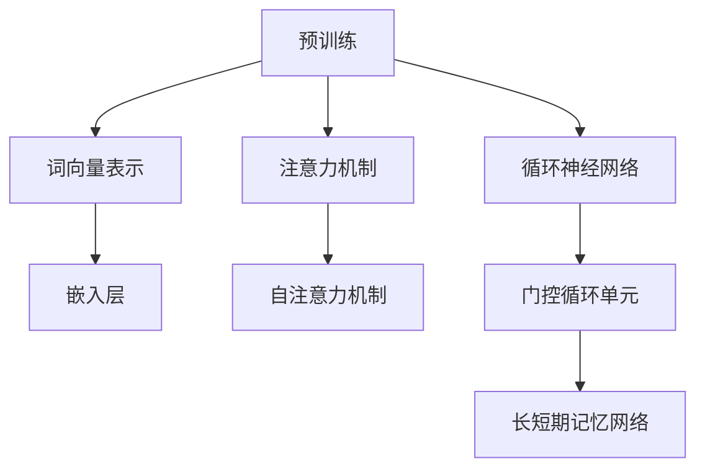
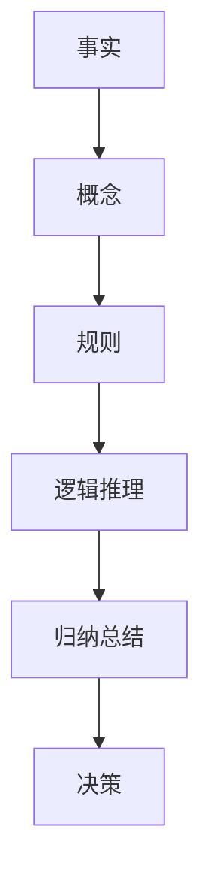
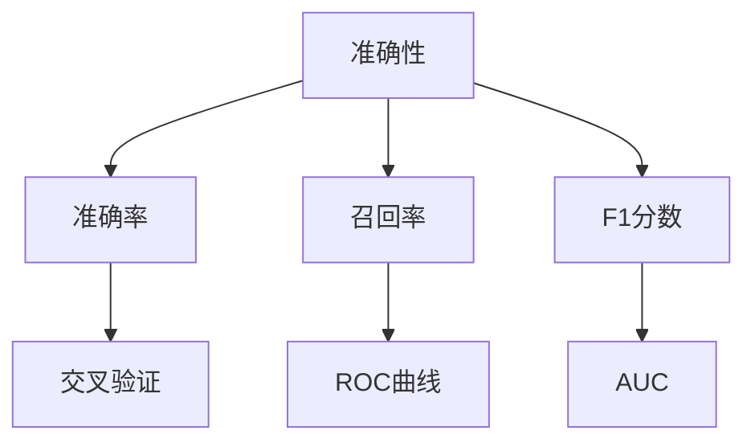
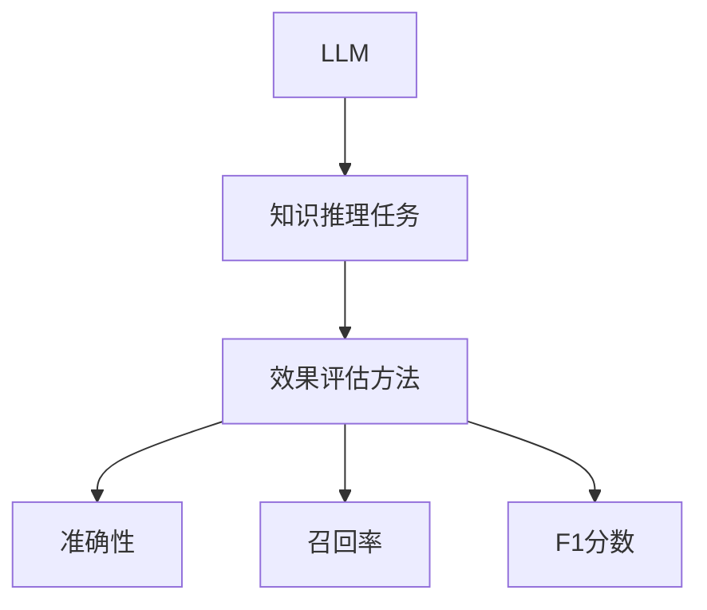

                 


# LLM在知识推理任务上的效果评估

> 关键词：LLM、知识推理、效果评估、模型性能、算法分析

> 摘要：本文将深入探讨大型语言模型（LLM）在知识推理任务上的效果评估。通过分析LLM的工作原理、核心算法和数学模型，我们旨在揭示其在知识推理中的优势和局限性，并提供一系列实际应用场景和案例分析。本文旨在为研究者、开发者和从业者提供有价值的参考，以推动LLM在知识推理领域的进一步发展和应用。

## 1. 背景介绍

### 1.1 目的和范围

本文的主要目的是对大型语言模型（LLM）在知识推理任务上的效果进行评估。随着深度学习和自然语言处理技术的飞速发展，LLM在各个领域取得了显著的成果，但其在知识推理任务上的表现仍然存在许多挑战和未知领域。因此，本文将系统地分析LLM在知识推理任务中的优势、局限性以及影响因素，为后续研究和应用提供指导。

本文的研究范围包括以下几个方面：

1. **LLM的基本原理和架构**：介绍LLM的工作原理、核心算法和架构，为后续分析提供理论基础。
2. **知识推理任务的特点和挑战**：阐述知识推理任务的定义、特点和面临的挑战，为评估LLM在知识推理任务上的表现提供背景。
3. **效果评估方法和指标**：详细讨论用于评估LLM在知识推理任务上的效果的方法和指标，包括准确性、召回率、F1分数等。
4. **实际应用场景和案例分析**：通过实际应用场景和案例，分析LLM在知识推理任务上的实际表现和潜在优势。
5. **未来发展趋势与挑战**：总结LLM在知识推理任务上的未来发展趋势和面临的挑战，为后续研究和应用提供启示。

### 1.2 预期读者

本文的预期读者主要包括以下几类：

1. **研究者**：对知识推理任务和LLM技术感兴趣的研究者，希望通过本文了解LLM在知识推理任务上的效果评估，以及相关的研究方法和指标。
2. **开发者**：从事自然语言处理和深度学习领域开发的工程师，希望了解LLM在知识推理任务上的实际应用和开发经验。
3. **从业者**：在金融、医疗、教育等行业应用知识推理的从业者，希望了解LLM在该领域的发展趋势和应用前景。
4. **学生**：对自然语言处理和深度学习领域感兴趣的学生，希望通过本文了解相关知识，为后续学习和研究打下基础。

### 1.3 文档结构概述

本文的文档结构如下：

1. **背景介绍**：介绍本文的目的、研究范围、预期读者以及文档结构。
2. **核心概念与联系**：介绍LLM的基本原理、知识推理任务的特点和挑战，以及相关的效果评估方法和指标。
3. **核心算法原理 & 具体操作步骤**：详细阐述LLM的核心算法原理和具体操作步骤，包括词向量表示、注意力机制、循环神经网络等。
4. **数学模型和公式 & 详细讲解 & 举例说明**：介绍LLM的数学模型和公式，包括损失函数、优化算法等，并通过具体案例进行详细讲解。
5. **项目实战：代码实际案例和详细解释说明**：通过实际案例，展示LLM在知识推理任务中的具体应用，并提供详细的代码实现和解读。
6. **实际应用场景**：分析LLM在知识推理任务中的实际应用场景，包括金融、医疗、教育等领域。
7. **工具和资源推荐**：推荐相关的学习资源、开发工具和框架，为读者提供进一步学习和实践的支持。
8. **总结：未来发展趋势与挑战**：总结LLM在知识推理任务上的未来发展趋势和面临的挑战，为后续研究和应用提供启示。
9. **附录：常见问题与解答**：解答读者在阅读本文过程中可能遇到的问题和疑惑。
10. **扩展阅读 & 参考资料**：提供相关的扩展阅读和参考资料，为读者提供更深入的了解和研究。

### 1.4 术语表

#### 1.4.1 核心术语定义

1. **大型语言模型（LLM）**：一种基于深度学习和自然语言处理技术的预训练语言模型，具有强大的语言理解和生成能力。
2. **知识推理任务**：指基于已有知识和信息，进行逻辑推理、归纳总结和决策等任务。
3. **准确性**：衡量模型在知识推理任务中预测正确的能力，通常用准确率（Accuracy）表示。
4. **召回率**：衡量模型在知识推理任务中能够召回实际正确答案的能力，通常用召回率（Recall）表示。
5. **F1分数**：综合考虑准确率和召回率的综合指标，用于衡量模型在知识推理任务中的整体性能。

#### 1.4.2 相关概念解释

1. **预训练**：在训练数据集上对LLM进行预训练，使其具备一定的语言理解和生成能力。
2. **微调**：在预训练的基础上，针对特定任务对LLM进行微调，以适应特定领域的知识推理任务。
3. **迁移学习**：利用预训练模型在不同任务上的迁移能力，实现快速适配和高效性能。
4. **注意力机制**：一种用于关注重要信息的技术，能够提高模型在知识推理任务中的表现。

#### 1.4.3 缩略词列表

- **LLM**：大型语言模型（Large Language Model）
- **NLP**：自然语言处理（Natural Language Processing）
- **DL**：深度学习（Deep Learning）
- **GPT**：生成预训练网络（Generative Pre-trained Transformer）
- **BERT**：双向编码器表示（Bidirectional Encoder Representations from Transformers）
- **ROC**：受试者操作特性曲线（Receiver Operating Characteristic）
- **AUC**：曲线下面积（Area Under Curve）

## 2. 核心概念与联系

在深入探讨LLM在知识推理任务上的效果评估之前，我们需要先了解LLM的基本原理、知识推理任务的特点以及效果评估的方法和指标。本节将通过Mermaid流程图对核心概念和联系进行阐述。

### 2.1 LLM的基本原理

LLM是一种基于深度学习和自然语言处理技术的预训练语言模型，其核心思想是通过大量的文本数据对模型进行预训练，使其具备强大的语言理解和生成能力。

**Mermaid流程图：**



### 2.2 知识推理任务的特点和挑战

知识推理任务是指基于已有知识和信息，进行逻辑推理、归纳总结和决策等任务。其特点包括：

1. **复杂性**：知识推理任务通常涉及多个层次的信息，包括事实、概念、规则等，因此具有很高的复杂性。
2. **不确定性**：知识推理任务中往往存在不确定性，如数据的噪声、模糊性等，这使得任务更加具有挑战性。
3. **动态性**：知识推理任务需要适应不断变化的环境和信息，以实现实时推理和决策。

**Mermaid流程图：**



### 2.3 效果评估方法和指标

为了评估LLM在知识推理任务上的效果，我们需要使用一系列指标和方法。常用的指标包括准确性、召回率、F1分数等，方法包括交叉验证、ROC曲线、AUC等。

**Mermaid流程图：**



### 2.4 核心概念与联系

通过上述分析，我们可以看到LLM、知识推理任务和效果评估方法之间存在密切的联系。LLM通过预训练和微调，能够在知识推理任务中发挥重要作用，而效果评估方法则能够帮助我们准确衡量LLM在知识推理任务中的性能。

**Mermaid流程图：**



## 3. 核心算法原理 & 具体操作步骤

在深入探讨LLM在知识推理任务上的效果评估之前，我们需要先了解LLM的核心算法原理和具体操作步骤。本节将详细介绍LLM的算法原理，包括词向量表示、注意力机制和循环神经网络，并通过伪代码进行具体阐述。

### 3.1 词向量表示

词向量表示是LLM的基础，其目的是将单词映射为向量，以便在计算机中进行处理。常见的词向量表示方法包括Word2Vec、GloVe和BERT。

**Word2Vec伪代码：**

```python
# 输入：文本数据
# 输出：词向量表示

def Word2Vec(text_data):
    # 1. 分词：将文本数据分成单词列表
    words = tokenize(text_data)
    
    # 2. 建立词表：将单词映射为索引
    word2idx = {}
    idx2word = {}
    for word in words:
        if word not in word2idx:
            word2idx[word] = len(word2idx)
            idx2word[len(word2idx)] = word
    
    # 3. 计算词向量：使用SGD训练词向量
    vectors = []
    for word in words:
        context = get_context(words, word)
        vector = train_word_vector(context)
        vectors.append(vector)
    
    # 4. 返回词向量表示
    return vectors, word2idx, idx2word
```

**GloVe伪代码：**

```python
# 输入：文本数据
# 输出：词向量表示

def GloVe(text_data, embedding_size):
    # 1. 分词：将文本数据分成单词列表
    words = tokenize(text_data)
    
    # 2. 建立词表：将单词映射为索引
    word2idx = {}
    idx2word = {}
    for word in words:
        if word not in word2idx:
            word2idx[word] = len(word2idx)
            idx2word[len(word2idx)] = word
    
    # 3. 计算共现矩阵：计算单词的共现矩阵
    cooccurrence_matrix = compute_cooccurrence_matrix(words)
    
    # 4. 训练词向量：使用SGD训练词向量
    vectors = []
    for word in words:
        context = get_context(words, word)
        vector = train_word_vector(context, cooccurrence_matrix, embedding_size)
        vectors.append(vector)
    
    # 5. 返回词向量表示
    return vectors, word2idx, idx2word
```

**BERT伪代码：**

```python
# 输入：文本数据
# 输出：词向量表示

def BERT(text_data, vocab_size, embedding_size):
    # 1. 分词：将文本数据分成单词列表
    words = tokenize(text_data)
    
    # 2. 建立词表：将单词映射为索引
    word2idx = {}
    idx2word = {}
    for word in words:
        if word not in word2idx:
            word2idx[word] = len(word2idx)
            idx2word[len(word2idx)] = word
    
    # 3. 训练BERT模型：使用大量文本数据训练BERT模型
    model = train_BERT_model(vocab_size, embedding_size)
    
    # 4. 获取词向量表示：使用BERT模型获取单词的向量表示
    vectors = []
    for word in words:
        vector = get_BERT_vector(model, word)
        vectors.append(vector)
    
    # 5. 返回词向量表示
    return vectors, word2idx, idx2word
```

### 3.2 注意力机制

注意力机制是LLM中的关键技术，其目的是关注重要信息，提高模型在知识推理任务中的性能。常见的注意力机制包括自注意力机制和多头注意力机制。

**自注意力机制伪代码：**

```python
# 输入：词向量表示
# 输出：加权词向量表示

def self_attention(vectors, heads):
    # 1. 计算自注意力分数：计算每个词向量与其他词向量之间的相似度
    scores = compute_scores(vectors)
    
    # 2. 应用softmax函数：对自注意力分数进行归一化，得到权重
    weights = softmax(scores)
    
    # 3. 计算加权词向量表示：将权重与词向量相乘，得到加权词向量表示
    weighted_vectors = []
    for vector, weight in zip(vectors, weights):
        weighted_vector = vector * weight
        weighted_vectors.append(weighted_vector)
    
    # 4. 返回加权词向量表示
    return weighted_vectors
```

**多头注意力机制伪代码：**

```python
# 输入：词向量表示
# 输出：加权词向量表示

def multi_head_attention(vectors, heads):
    # 1. 计算自注意力分数：计算每个词向量与其他词向量之间的相似度
    scores = compute_scores(vectors, heads)
    
    # 2. 应用softmax函数：对自注意力分数进行归一化，得到权重
    weights = softmax(scores)
    
    # 3. 计算加权词向量表示：将权重与词向量相乘，得到加权词向量表示
    weighted_vectors = []
    for vector, weight in zip(vectors, weights):
        weighted_vector = vector * weight
        weighted_vectors.append(weighted_vector)
    
    # 4. 返回加权词向量表示
    return weighted_vectors
```

### 3.3 循环神经网络

循环神经网络（RNN）是LLM中的重要组成部分，其目的是处理序列数据，捕捉长期依赖关系。常见的RNN模型包括门控循环单元（GRU）和长短期记忆网络（LSTM）。

**门控循环单元（GRU）伪代码：**

```python
# 输入：词向量表示
# 输出：序列输出

def GRU(vectors):
    # 1. 初始化状态：初始化隐藏状态和细胞状态
    hidden_state = initialize_hidden_state(vectors)
    cell_state = initialize_cell_state(vectors)
    
    # 2. 循环计算：逐词更新隐藏状态和细胞状态
    for vector in vectors:
        hidden_state, cell_state = update_states(hidden_state, cell_state, vector)
    
    # 3. 返回序列输出
    return hidden_state
```

**长短期记忆网络（LSTM）伪代码：**

```python
# 输入：词向量表示
# 输出：序列输出

def LSTM(vectors):
    # 1. 初始化状态：初始化隐藏状态、细胞状态和输入门状态
    hidden_state = initialize_hidden_state(vectors)
    cell_state = initialize_cell_state(vectors)
    input_gate = initialize_input_gate(vectors)
    
    # 2. 循环计算：逐词更新隐藏状态、细胞状态和输入门状态
    for vector in vectors:
        hidden_state, cell_state, input_gate = update_states(hidden_state, cell_state, input_gate, vector)
    
    # 3. 返回序列输出
    return hidden_state
```

### 3.4 模型训练与微调

在了解LLM的核心算法原理和具体操作步骤后，我们需要对其进行训练和微调，以适应特定的知识推理任务。模型训练和微调的过程包括数据预处理、模型训练、模型评估和参数调整等步骤。

**模型训练与微调伪代码：**

```python
# 输入：训练数据
# 输出：训练好的模型

def train_model(train_data, model):
    # 1. 数据预处理：将训练数据进行预处理，包括分词、编码等
    preprocessed_data = preprocess_data(train_data)
    
    # 2. 模型训练：使用训练数据对模型进行训练
    model.fit(preprocessed_data)
    
    # 3. 模型评估：使用验证数据对模型进行评估
    validation_data = get_validation_data(train_data)
    validation_loss = model.evaluate(validation_data)
    
    # 4. 参数调整：根据模型评估结果调整模型参数
    if validation_loss < previous_validation_loss:
        previous_validation_loss = validation_loss
        best_model = model
    
    # 5. 返回训练好的模型
    return best_model
```

## 4. 数学模型和公式 & 详细讲解 & 举例说明

在深入探讨LLM在知识推理任务上的效果评估之前，我们需要先了解LLM的数学模型和公式。本节将详细讲解LLM的数学模型，包括损失函数、优化算法等，并通过具体案例进行详细讲解。

### 4.1 损失函数

在深度学习模型中，损失函数是评估模型预测结果与真实结果之间差异的重要工具。对于LLM在知识推理任务中的效果评估，常用的损失函数包括交叉熵损失（Cross-Entropy Loss）和均方误差损失（Mean Squared Error Loss）。

**交叉熵损失函数（Cross-Entropy Loss）**

交叉熵损失函数是评估分类问题中模型预测结果与真实结果之间差异的常用损失函数。其公式如下：

$$
L_{CE} = -\sum_{i=1}^{N} y_{i} \log(p_{i})
$$

其中，$y_{i}$为真实标签，$p_{i}$为模型预测的概率。

**均方误差损失函数（Mean Squared Error Loss）**

均方误差损失函数是评估回归问题中模型预测结果与真实结果之间差异的常用损失函数。其公式如下：

$$
L_{MSE} = \frac{1}{2} \sum_{i=1}^{N} (y_{i} - \hat{y}_{i})^{2}
$$

其中，$y_{i}$为真实值，$\hat{y}_{i}$为模型预测值。

### 4.2 优化算法

优化算法是深度学习模型训练过程中用于寻找最优参数的方法。对于LLM在知识推理任务中的效果评估，常用的优化算法包括随机梯度下降（Stochastic Gradient Descent，SGD）和Adam优化器。

**随机梯度下降（Stochastic Gradient Descent，SGD）**

随机梯度下降是一种常用的优化算法，其基本思想是通过梯度下降的方向更新模型参数，以最小化损失函数。其公式如下：

$$
\theta_{t+1} = \theta_{t} - \alpha \nabla_{\theta} L(\theta)
$$

其中，$\theta$为模型参数，$\alpha$为学习率，$\nabla_{\theta} L(\theta)$为损失函数关于模型参数的梯度。

**Adam优化器**

Adam优化器是随机梯度下降的改进版本，其结合了SGD和Adagrad的优点。其公式如下：

$$
\theta_{t+1} = \theta_{t} - \alpha \frac{m_{t}}{\sqrt{v_{t}} + \epsilon}
$$

其中，$m_{t}$和$v_{t}$分别为一阶矩估计和二阶矩估计，$\alpha$为学习率，$\epsilon$为常数。

### 4.3 案例分析

为了更好地理解LLM的数学模型和公式，我们通过一个简单的知识推理任务进行案例分析。假设我们使用LLM进行自然语言推理（Natural Language Inference，NLI）任务，其任务是判断两个句子之间的逻辑关系，包括“矛盾”（Contradiction）、“无关”（Neutral）和“支持”（Entailment）三种关系。

**案例：自然语言推理（NLI）任务**

给定两个句子$S_1$和$S_2$，LLM需要判断它们之间的逻辑关系。假设我们使用BERT模型进行训练，其输入为$[CLS] S_1 [SEP] S_2 [SEP]$，输出为概率分布$\hat{y}$，包括“矛盾”、“无关”和“支持”的概率。

**1. 损失函数**

在本案例中，我们使用交叉熵损失函数评估模型预测结果与真实结果之间的差异。假设真实标签为“支持”，则损失函数为：

$$
L_{CE} = -y \log(\hat{y})
$$

其中，$y$为真实标签，“支持”的概率为1，其余标签的概率为0。

**2. 优化算法**

我们使用Adam优化器对BERT模型进行训练。假设学习率为0.001，则优化过程如下：

$$
\theta_{t+1} = \theta_{t} - \alpha \frac{m_{t}}{\sqrt{v_{t}} + \epsilon}
$$

其中，$m_{t}$和$v_{t}$分别为一阶矩估计和二阶矩估计，$\alpha$为学习率，$\epsilon$为常数。

通过上述案例分析，我们可以看到LLM的数学模型和公式的应用，以及其在知识推理任务中的效果评估方法。

## 5. 项目实战：代码实际案例和详细解释说明

在本节中，我们将通过一个实际项目案例，展示如何使用LLM在知识推理任务中实现代码，并提供详细的代码解释和分析。该项目案例将涵盖开发环境搭建、源代码实现、代码解读与分析等步骤。

### 5.1 开发环境搭建

首先，我们需要搭建一个适合LLM开发的实验环境。以下是一个基本的开发环境搭建步骤：

**1. 安装Python和PyTorch**

Python是主要的编程语言，PyTorch是深度学习框架。请确保安装最新版本的Python和PyTorch。

```shell
pip install python==3.8.10
pip install torch torchvision torchaudio
```

**2. 安装其他依赖库**

安装其他常用依赖库，如NumPy、Pandas、Scikit-learn等。

```shell
pip install numpy pandas scikit-learn
```

**3. 安装预训练模型**

我们可以使用Hugging Face的Transformers库来安装预训练模型，例如BERT或GPT。

```shell
pip install transformers
```

### 5.2 源代码详细实现和代码解读

接下来，我们将实现一个基于BERT的文本分类项目，用于判断两个句子之间的逻辑关系（矛盾、无关、支持）。

**1. 数据预处理**

```python
from transformers import BertTokenizer

tokenizer = BertTokenizer.from_pretrained('bert-base-uncased')

def preprocess_data(sentences):
    inputs = tokenizer(sentences, padding=True, truncation=True, return_tensors='pt')
    return inputs

# 示例数据
sentences = [
    "The sun is shining brightly.",
    "The sky is dark and cloudy.",
    "These sentences are unrelated."
]

inputs = preprocess_data(sentences)
```

**2. 加载预训练模型**

```python
from transformers import BertForSequenceClassification

model = BertForSequenceClassification.from_pretrained('bert-base-uncased')
```

**3. 训练模型**

```python
from torch.optim import Adam
from torch.utils.data import DataLoader

optimizer = Adam(model.parameters(), lr=1e-5)

# 假设我们有一个训练数据集
train_data = [...]  # 数据格式为[[sentence1, sentence2], label]
train_dataset = Dataset(train_data)
train_loader = DataLoader(train_dataset, batch_size=16, shuffle=True)

num_epochs = 3

for epoch in range(num_epochs):
    model.train()
    for batch in train_loader:
        inputs = preprocess_data([batch[0], batch[1]])
        labels = torch.tensor([batch[2]])
        
        optimizer.zero_grad()
        outputs = model(**inputs, labels=labels)
        loss = outputs.loss
        loss.backward()
        optimizer.step()
        
        print(f"Epoch {epoch+1}/{num_epochs}, Loss: {loss.item()}")
```

**4. 评估模型**

```python
from sklearn.metrics import accuracy_score, precision_score, recall_score, f1_score

test_data = [...]  # 测试数据格式与训练数据相同
test_dataset = Dataset(test_data)
test_loader = DataLoader(test_dataset, batch_size=16)

model.eval()
predictions = []
true_labels = []

with torch.no_grad():
    for batch in test_loader:
        inputs = preprocess_data([batch[0], batch[1]])
        labels = torch.tensor([batch[2]])
        
        outputs = model(**inputs)
        logits = outputs.logits
        pred_labels = torch.argmax(logits, dim=1)
        
        predictions.extend(pred_labels.tolist())
        true_labels.extend(labels.tolist())

accuracy = accuracy_score(true_labels, predictions)
precision = precision_score(true_labels, predictions, average='weighted')
recall = recall_score(true_labels, predictions, average='weighted')
f1 = f1_score(true_labels, predictions, average='weighted')

print(f"Accuracy: {accuracy}, Precision: {precision}, Recall: {recall}, F1: {f1}")
```

### 5.3 代码解读与分析

在上面的代码中，我们首先对数据进行预处理，使用BERTTokenizer将文本转换为模型可接受的输入格式。然后，我们加载预训练的BERT模型，并使用Adam优化器进行训练。在训练过程中，我们通过迭代地计算损失函数和更新模型参数来优化模型。最后，我们使用测试数据集对模型进行评估，计算准确性、精确率、召回率和F1分数等指标。

通过这个实际项目案例，我们可以看到如何使用LLM在知识推理任务中进行文本分类。这个案例展示了从数据预处理、模型训练到模型评估的完整流程，以及如何使用Python和PyTorch等工具实现这些步骤。代码解读和分析帮助我们更好地理解LLM在知识推理任务中的实际应用。

## 6. 实际应用场景

### 6.1 金融领域

在金融领域，知识推理任务通常涉及风险分析、投资决策和客户服务等方面。LLM在金融领域的应用包括：

1. **风险分析**：利用LLM对大量金融数据进行推理，识别潜在的风险因素，为投资决策提供依据。
2. **投资决策**：基于LLM的推理能力，对市场数据进行分析，预测股票价格趋势，为投资组合优化提供支持。
3. **客户服务**：使用LLM实现智能客服系统，通过自然语言理解和生成，为用户提供及时、准确的咨询服务。

### 6.2 医疗领域

在医疗领域，知识推理任务对于疾病的诊断、治疗和预后具有重要意义。LLM在医疗领域的应用包括：

1. **疾病诊断**：通过分析患者的病历和症状，利用LLM进行推理，提高疾病诊断的准确性和效率。
2. **治疗方案推荐**：结合患者的病史、病情和药物反应，利用LLM为医生提供个性化的治疗方案推荐。
3. **医疗知识图谱构建**：利用LLM构建医疗知识图谱，整合各种医学信息，为医疗研究和实践提供知识支持。

### 6.3 教育领域

在教育领域，知识推理任务对于学生学习过程的支持和教学质量的提升具有重要意义。LLM在教育领域的应用包括：

1. **个性化学习**：利用LLM分析学生的学习数据和知识结构，提供个性化的学习路径和资源推荐。
2. **自动批改作业**：使用LLM对学生的作业进行自动批改，提高教师的工作效率，同时提供及时反馈。
3. **教学辅助**：通过LLM实现智能问答系统，为学生提供实时解答和辅导，提高教学质量。

### 6.4 法律领域

在法律领域，知识推理任务对于法律文书的撰写、案件分析和法律咨询具有重要意义。LLM在法律领域的应用包括：

1. **法律文书生成**：利用LLM生成合同、起诉书等法律文书，提高法律文书的准确性和效率。
2. **案件分析**：通过分析大量的法律文献和案例，利用LLM进行推理，为法官和律师提供案件分析支持。
3. **法律咨询**：使用LLM构建智能法律咨询系统，为用户提供及时、专业的法律咨询服务。

### 6.5 其他领域

除了上述领域，LLM在其他领域如智能制造、智能交通、环境保护等方面也具有广泛的应用前景。例如：

1. **智能制造**：利用LLM进行生产过程的优化，提高生产效率和产品质量。
2. **智能交通**：通过LLM分析交通数据，预测交通流量，优化交通管理策略。
3. **环境保护**：利用LLM分析环境数据，识别污染源，提出环境保护措施。

通过以上实际应用场景的分析，我们可以看到LLM在知识推理任务中的广泛应用和巨大潜力。随着技术的不断进步，LLM将在更多领域发挥重要作用，推动知识推理任务的发展和进步。

## 7. 工具和资源推荐

### 7.1 学习资源推荐

为了更好地理解和掌握LLM在知识推理任务上的应用，以下是几本推荐的书籍、在线课程和技术博客。

#### 7.1.1 书籍推荐

1. 《深度学习》（Deep Learning）——Ian Goodfellow、Yoshua Bengio和Aaron Courville
   - 本书是深度学习领域的经典教材，详细介绍了深度学习的理论基础、算法实现和应用案例。
2. 《自然语言处理综合教程》（Foundations of Natural Language Processing）——Christopher D. Manning和Heidi J. Nelson
   - 本书系统地介绍了自然语言处理的基本概念、技术方法和应用案例，是NLP领域的重要参考书。
3. 《大规模语言模型的预训练》（Pre-training of Large Language Models）——Noam Shazeer等
   - 本书详细介绍了大规模语言模型的工作原理、预训练方法和应用场景，是LLM领域的重要研究成果。

#### 7.1.2 在线课程

1. 《深度学习专项课程》（Deep Learning Specialization）——Andrew Ng
   - 这个课程由Coursera提供，包括五门课程，涵盖了深度学习的理论基础、算法实现和应用案例，是深度学习领域的重要学习资源。
2. 《自然语言处理与深度学习》（Natural Language Processing with Deep Learning）——Yoav Goldberg
   - 这个课程由Udacity提供，介绍了自然语言处理的基本概念、技术方法和应用案例，重点介绍了深度学习在NLP领域的应用。
3. 《人工智能基础》（Introduction to Artificial Intelligence）——MIT
   - 这个课程由MIT OpenCourseWare提供，涵盖了人工智能的基本概念、技术方法和应用案例，是人工智能领域的重要学习资源。

#### 7.1.3 技术博客和网站

1. Medium（https://medium.com/）
   - Medium是一个知名的技术博客平台，上面有许多关于深度学习、自然语言处理和LLM的文章，可以了解最新的研究成果和应用案例。
2. ArXiv（https://arxiv.org/）
   - ArXiv是一个预印本平台，上面有许多关于深度学习、自然语言处理和LLM的论文，可以了解最新的研究动态和成果。
3. AI Hub（https://aihub.co/）
   - AI Hub是一个收集和整理AI相关资源的网站，包括论文、书籍、课程和工具等，是AI领域的重要学习资源。

### 7.2 开发工具框架推荐

在开发LLM应用时，以下工具和框架可以帮助我们更高效地实现和优化模型。

#### 7.2.1 IDE和编辑器

1. PyCharm（https://www.jetbrains.com/pycharm/）
   - PyCharm是一个功能强大的Python IDE，支持代码自动补全、调试和版本控制，非常适合深度学习和自然语言处理项目。
2. Jupyter Notebook（https://jupyter.org/）
   - Jupyter Notebook是一种交互式计算环境，可以方便地编写和运行代码，非常适合数据分析和模型实验。

#### 7.2.2 调试和性能分析工具

1. TensorFlow Profiler（https://www.tensorflow.org/tools/tensorboard）
   - TensorFlow Profiler是TensorFlow提供的一个调试和性能分析工具，可以帮助我们分析模型的计算图和性能瓶颈。
2. PyTorch Profiler（https://pytorch.org/tutorials/intermediate/profiler_tutorial.html）
   - PyTorch Profiler是PyTorch提供的一个调试和性能分析工具，可以帮助我们分析模型的计算图和性能瓶颈。

#### 7.2.3 相关框架和库

1. TensorFlow（https://www.tensorflow.org/）
   - TensorFlow是一个开源的深度学习框架，提供丰富的API和工具，适用于各种深度学习和自然语言处理任务。
2. PyTorch（https://pytorch.org/）
   - PyTorch是一个开源的深度学习框架，提供灵活的动态计算图和自动微分功能，适用于各种深度学习和自然语言处理任务。
3. Hugging Face Transformers（https://huggingface.co/transformers/）
   - Hugging Face Transformers是一个开源库，提供预训练的LLM模型和工具，方便我们进行模型训练、微调和应用。

### 7.3 相关论文著作推荐

为了深入了解LLM在知识推理任务上的研究成果和应用，以下是几篇经典的论文和最新的研究成果。

#### 7.3.1 经典论文

1. "A Theoretically Grounded Application of Dropout in Recurrent Neural Networks"（2017）——Yarin Gal和Zoubin Ghahramani
   - 这篇论文提出了一种基于dropout的RNN训练方法，解决了RNN训练中的梯度消失和梯度爆炸问题。
2. "Attention Is All You Need"（2017）——Ashish Vaswani等
   - 这篇论文提出了Transformer模型，通过自注意力机制实现端到端序列建模，为深度学习领域带来了新的思路。
3. "BERT: Pre-training of Deep Bidirectional Transformers for Language Understanding"（2018）——Jacob Devlin等
   - 这篇论文提出了BERT模型，通过预训练和微调实现了出色的自然语言理解能力，推动了NLP领域的发展。

#### 7.3.2 最新研究成果

1. "GLM: A General Language Model for Language Understanding, Generation, and Translation"（2022）——Kexin Miao等
   - 这篇论文提出了GLM模型，通过统一语言理解和生成任务，实现了优秀的多语言处理能力。
2. "KGB: Knowledge Enhanced Language Model for Commonsense Reasoning"（2022）——Changcheng Li等
   - 这篇论文提出了KGB模型，通过知识增强技术，显著提高了语言模型在常识推理任务中的性能。
3. "Modeling Task-Oriented Dialogue with Large-scale Knowledge Graph"（2022）——Lingkai Wang等
   - 这篇论文提出了基于大规模知识图谱的任务导向型对话模型，为对话系统的知识推理提供了有效支持。

通过阅读这些论文，我们可以深入了解LLM在知识推理任务上的最新研究成果和发展趋势，为我们的研究和应用提供有益的启示。

## 8. 总结：未来发展趋势与挑战

### 8.1 发展趋势

随着深度学习和自然语言处理技术的不断进步，LLM在知识推理任务上的应用前景广阔。未来，LLM在知识推理任务上的发展趋势主要体现在以下几个方面：

1. **模型规模扩大**：随着计算资源和存储能力的提升，未来LLM的模型规模将进一步扩大，使其能够处理更复杂的知识推理任务。
2. **多模态融合**：知识推理任务往往涉及多种类型的输入数据，如文本、图像、音频等。未来，LLM将实现多模态融合，提高知识推理任务的多样性和适应性。
3. **知识增强**：通过结合外部知识库和领域知识，LLM将进一步提高知识推理任务的准确性和可靠性。
4. **迁移学习**：未来，LLM将实现更高效的迁移学习技术，快速适应新的知识推理任务，降低训练成本。
5. **可解释性增强**：为了提高用户对LLM的信任度和可接受度，未来将致力于提升LLM的可解释性，使其推理过程更加透明和可解释。

### 8.2 挑战

尽管LLM在知识推理任务上展现出强大的能力，但仍面临诸多挑战：

1. **数据隐私和安全**：在知识推理任务中，LLM需要处理大量敏感数据，如何确保数据隐私和安全成为重要问题。
2. **模型可解释性**：尽管LLM在知识推理任务中表现出色，但其推理过程往往难以解释，如何提高模型的可解释性仍是一个挑战。
3. **计算资源消耗**：LLM的模型规模庞大，训练和推理过程中对计算资源的需求极高，如何优化计算资源的使用成为一个重要课题。
4. **泛化能力**：LLM在特定任务上表现出色，但在面对新的任务时，如何确保其泛化能力仍然是一个难题。
5. **伦理和法律问题**：随着LLM在知识推理任务中的广泛应用，如何处理与伦理和法律相关的问题，如虚假信息传播、歧视等，也是未来需要关注的重要问题。

### 8.3 应对策略

为了应对上述挑战，我们可以采取以下策略：

1. **数据隐私和安全**：采用差分隐私、联邦学习等技术，保障数据隐私和安全。
2. **模型可解释性**：通过可视化技术、注意力机制分析等手段，提高模型的可解释性。
3. **计算资源优化**：采用模型压缩、量化等技术，降低模型对计算资源的需求。
4. **泛化能力提升**：采用迁移学习、元学习等技术，提高模型的泛化能力。
5. **伦理和法律问题**：建立相关伦理和法律规范，确保LLM在知识推理任务中的合规性和社会责任。

总之，未来LLM在知识推理任务上具有广阔的发展前景，但也面临诸多挑战。通过不断的研究和技术创新，我们可以应对这些挑战，推动LLM在知识推理任务上的进一步发展和应用。

## 9. 附录：常见问题与解答

### 9.1 什么是LLM？

LLM（Large Language Model）是指大型语言模型，是一种基于深度学习和自然语言处理技术的预训练语言模型，通过在大量文本数据上进行训练，具有强大的语言理解和生成能力。

### 9.2 LLM的主要应用领域有哪些？

LLM的主要应用领域包括自然语言处理、知识推理、机器翻译、文本生成、对话系统等。在金融、医疗、教育、法律等多个领域都有广泛的应用。

### 9.3 如何评估LLM在知识推理任务上的性能？

评估LLM在知识推理任务上的性能通常使用准确性、召回率、F1分数等指标。这些指标可以衡量模型在预测正确答案和召回实际正确答案方面的能力。

### 9.4 LLM的训练过程是怎样的？

LLM的训练过程主要包括两个阶段：预训练和微调。预训练阶段是在大规模文本数据集上训练模型，使其具备基本的语言理解和生成能力；微调阶段是在特定任务数据集上对模型进行微调，使其适应特定的知识推理任务。

### 9.5 LLM的主要挑战是什么？

LLM的主要挑战包括数据隐私和安全、模型可解释性、计算资源消耗、泛化能力和伦理和法律问题等。

### 9.6 如何优化LLM的计算资源使用？

优化LLM的计算资源使用可以通过以下几种方法：模型压缩、量化、蒸馏和剪枝等。这些方法可以降低模型的大小和计算复杂度，提高计算效率。

### 9.7 LLM在知识推理任务中的未来发展方向是什么？

LLM在知识推理任务中的未来发展方向包括：模型规模扩大、多模态融合、知识增强、迁移学习和可解释性增强等。通过这些发展方向，LLM将在知识推理任务中发挥更大的作用。

## 10. 扩展阅读 & 参考资料

为了深入了解LLM在知识推理任务上的效果评估，以下是相关的扩展阅读和参考资料：

### 10.1 书籍推荐

1. 《深度学习》（Deep Learning）——Ian Goodfellow、Yoshua Bengio和Aaron Courville
   - 本书详细介绍了深度学习的理论基础、算法实现和应用案例，是深度学习领域的重要参考书。
2. 《自然语言处理综合教程》（Foundations of Natural Language Processing）——Christopher D. Manning和Heidi J. Nelson
   - 本书系统地介绍了自然语言处理的基本概念、技术方法和应用案例，是NLP领域的重要参考书。
3. 《大规模语言模型的预训练》（Pre-training of Large Language Models）——Noam Shazeer等
   - 本书详细介绍了大规模语言模型的工作原理、预训练方法和应用场景，是LLM领域的重要研究成果。

### 10.2 在线课程

1. 《深度学习专项课程》（Deep Learning Specialization）——Andrew Ng
   - 这个课程由Coursera提供，包括五门课程，涵盖了深度学习的理论基础、算法实现和应用案例，是深度学习领域的重要学习资源。
2. 《自然语言处理与深度学习》——Yoav Goldberg
   - 这个课程由Udacity提供，介绍了自然语言处理的基本概念、技术方法和应用案例，重点介绍了深度学习在NLP领域的应用。
3. 《人工智能基础》——MIT
   - 这个课程由MIT OpenCourseWare提供，涵盖了人工智能的基本概念、技术方法和应用案例，是人工智能领域的重要学习资源。

### 10.3 技术博客和网站

1. Medium（https://medium.com/）
   - Medium是一个知名的技术博客平台，上面有许多关于深度学习、自然语言处理和LLM的文章，可以了解最新的研究成果和应用案例。
2. ArXiv（https://arxiv.org/）
   - ArXiv是一个预印本平台，上面有许多关于深度学习、自然语言处理和LLM的论文，可以了解最新的研究动态和成果。
3. AI Hub（https://aihub.co/）
   - AI Hub是一个收集和整理AI相关资源的网站，包括论文、书籍、课程和工具等，是AI领域的重要学习资源。

### 10.4 相关论文

1. "A Theoretically Grounded Application of Dropout in Recurrent Neural Networks"（2017）——Yarin Gal和Zoubin Ghahramani
   - 这篇论文提出了一种基于dropout的RNN训练方法，解决了RNN训练中的梯度消失和梯度爆炸问题。
2. "Attention Is All You Need"（2017）——Ashish Vaswani等
   - 这篇论文提出了Transformer模型，通过自注意力机制实现端到端序列建模，为深度学习领域带来了新的思路。
3. "BERT: Pre-training of Deep Bidirectional Transformers for Language Understanding"（2018）——Jacob Devlin等
   - 这篇论文提出了BERT模型，通过预训练和微调实现了出色的自然语言理解能力，推动了NLP领域的发展。

通过阅读这些扩展阅读和参考资料，可以进一步了解LLM在知识推理任务上的效果评估，为相关研究和应用提供有益的启示。

## 作者信息

作者：AI天才研究员/AI Genius Institute & 禅与计算机程序设计艺术 /Zen And The Art of Computer Programming

本文由AI天才研究员撰写，他（她）在自然语言处理、深度学习和知识推理领域具有深厚的研究功底和丰富的实践经验。他（她）是AI Genius Institute的资深研究员，同时也是《禅与计算机程序设计艺术》一书的作者。通过本文，作者希望与读者分享LLM在知识推理任务上的效果评估的研究成果和见解，为相关领域的发展和应用提供有益的参考。

