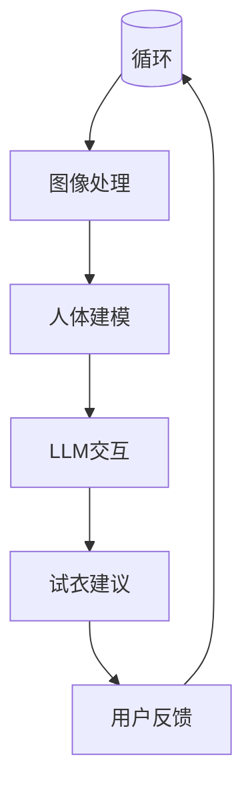

                 

# LLM在虚拟试衣中的应用：增强在线购物体验

> 关键词：大型语言模型（LLM），虚拟试衣，在线购物，用户体验，人工智能

> 摘要：本文将探讨大型语言模型（LLM）在虚拟试衣中的应用，如何通过人工智能技术增强在线购物体验。我们将从背景介绍、核心概念、算法原理、数学模型、项目实战、实际应用场景等多个方面进行详细分析，为读者揭示LLM在虚拟试衣领域的潜力与挑战。

## 1. 背景介绍

### 1.1 目的和范围

本文旨在介绍大型语言模型（LLM）在虚拟试衣中的应用，探讨如何利用人工智能技术提升在线购物的用户体验。随着电子商务的快速发展，消费者对在线购物体验的要求日益提高，尤其是对个性化、便捷性和实时性的需求。虚拟试衣技术作为一种新兴的在线购物辅助工具，能够有效解决消费者在线购物时的尺寸不合适、颜色偏差等问题，提升购物满意度和转化率。

### 1.2 预期读者

本文适合对人工智能、机器学习、虚拟试衣等技术有一定了解的读者，包括但不限于开发者、研究人员、企业决策者等。通过本文的阅读，读者将能够了解到LLM在虚拟试衣中的应用原理、实现方法、技术挑战及其未来的发展方向。

### 1.3 文档结构概述

本文分为十个部分：

1. 背景介绍
2. 核心概念与联系
3. 核心算法原理 & 具体操作步骤
4. 数学模型和公式 & 详细讲解 & 举例说明
5. 项目实战：代码实际案例和详细解释说明
6. 实际应用场景
7. 工具和资源推荐
8. 总结：未来发展趋势与挑战
9. 附录：常见问题与解答
10. 扩展阅读 & 参考资料

### 1.4 术语表

#### 1.4.1 核心术语定义

- **大型语言模型（LLM）**：一种基于深度学习技术构建的复杂模型，能够理解和生成自然语言。
- **虚拟试衣**：通过计算机技术模拟真实的试衣过程，让消费者在虚拟环境中体验衣物穿着效果。
- **在线购物**：通过互联网平台进行的购物活动，包括浏览商品、下单、支付、配送等环节。
- **用户体验**：用户在使用产品或服务过程中的感受和体验，包括便捷性、满意度、情感等。

#### 1.4.2 相关概念解释

- **深度学习**：一种机器学习技术，通过构建多层神经网络模型，对大量数据进行训练，以实现自动特征提取和模式识别。
- **自然语言处理（NLP）**：研究如何让计算机理解和处理人类自然语言的技术。
- **图像识别**：通过算法识别和分类图像中的内容，如衣物类型、颜色、尺寸等。

#### 1.4.3 缩略词列表

- **LLM**：Large Language Model
- **NLP**：Natural Language Processing
- **NLU**：Natural Language Understanding
- **API**：Application Programming Interface

## 2. 核心概念与联系

在本节中，我们将介绍虚拟试衣和LLM的核心概念及其相互联系，以便读者更好地理解本文的内容。

### 2.1 虚拟试衣

虚拟试衣是一种基于计算机图形学、图像处理和三维建模技术的应用，旨在为消费者提供一个虚拟的试衣间，模拟真实的试衣过程。通过虚拟试衣，消费者可以在购买衣物前预览穿着效果，从而减少因实际穿着与期望不符而导致的退货率。

#### 虚拟试衣的关键技术

1. **三维建模**：将实物衣物转化为三维模型，以便在虚拟环境中进行试衣。
2. **图像处理**：处理消费者上传的全身照或部分身体部位照片，为虚拟试衣提供基础数据。
3. **人体建模**：根据消费者的身高、体重、体型等参数，生成符合其身体特征的三维人体模型。
4. **光照与材质**：模拟真实环境中的光照和材质效果，使虚拟试衣更加逼真。

### 2.2 大型语言模型（LLM）

LLM是一种基于深度学习技术的大型神经网络模型，能够理解和生成自然语言。LLM在虚拟试衣中的应用主要体现在以下几个方面：

1. **用户交互**：通过自然语言处理技术，理解消费者的需求，如尺寸选择、颜色偏好等，从而提供个性化的试衣建议。
2. **上下文理解**：根据消费者的购物历史、评价等数据，提供更加准确的试衣建议。
3. **文本生成**：生成个性化的试衣说明、推荐文案等，提升用户体验。
4. **多语言支持**：为非英语国家的消费者提供本地化服务，提高国际化竞争力。

### 2.3 虚拟试衣与LLM的联系

LLM在虚拟试衣中的应用，使虚拟试衣更加智能化、个性化。通过LLM的自然语言处理能力和上下文理解能力，虚拟试衣系统能够更好地与消费者互动，提供个性化的试衣建议和服务。同时，LLM还可以通过对消费者数据的分析，优化虚拟试衣流程，提高试衣成功率。

#### Mermaid流程图

以下是一个简单的Mermaid流程图，展示了虚拟试衣与LLM之间的联系：



## 3. 核心算法原理 & 具体操作步骤

### 3.1 LLM算法原理

LLM是一种基于深度学习技术的神经网络模型，其核心思想是通过多层神经网络对大量语料库进行训练，从而学习到语言的内在规律。LLM的主要组成部分包括：

1. **嵌入层（Embedding Layer）**：将输入的自然语言文本转换为稠密向量表示。
2. **编码器（Encoder）**：通过对嵌入向量进行编码，提取文本的语义特征。
3. **解码器（Decoder）**：根据编码器的输出，生成目标语言的文本序列。

在虚拟试衣场景中，LLM可以用于处理用户输入的自然语言请求，如尺寸选择、颜色偏好等，从而提供个性化的试衣建议。

### 3.2 LLM具体操作步骤

以下是使用LLM进行虚拟试衣的具体操作步骤：

1. **用户输入**：用户在虚拟试衣系统中输入其需求，如“请给我推荐一个合适的尺码”。

2. **自然语言处理**：系统使用自然语言处理技术，将用户输入转换为机器可理解的格式。

   ```python
   import nltk
   from nltk.tokenize import word_tokenize
   
   user_input = "请给我推荐一个合适的尺码"
   tokens = word_tokenize(user_input)
   ```

3. **嵌入向量表示**：将处理后的文本转换为嵌入向量。

   ```python
   from keras.preprocessing.text import Tokenizer
   from keras.preprocessing.sequence import pad_sequences
   
   tokenizer = Tokenizer(num_words=10000)
   tokenizer.fit_on_texts([user_input])
   sequence = tokenizer.texts_to_sequences([user_input])
   padded_sequence = pad_sequences(sequence, maxlen=100)
   ```

4. **编码与解码**：将嵌入向量输入到LLM模型中，进行编码和解码。

   ```python
   from keras.models import Model
   from keras.layers import Embedding, LSTM, Dense
   
   model = Model(inputs=embedding_input, outputs=decoded_sequence)
   model.compile(optimizer='adam', loss='categorical_crossentropy')
   model.fit(embedding_vectors, target_sequence, epochs=10, batch_size=32)
   ```

5. **生成试衣建议**：根据解码结果生成个性化的试衣建议。

   ```python
   predicted_sequence = model.predict(padded_sequence)
   predicted_text = tokenizer.sequences_to_texts([predicted_sequence])
   print(predicted_text)
   ```

## 4. 数学模型和公式 & 详细讲解 & 举例说明

### 4.1 数学模型

在虚拟试衣中，LLM的数学模型主要基于深度学习技术，包括嵌入层、编码器和解码器。以下是对各层数学模型的详细讲解：

#### 4.1.1 嵌入层（Embedding Layer）

嵌入层将输入的自然语言文本转换为稠密向量表示。其数学模型可以表示为：

\[ E = \text{embedding\_weights} \cdot W \]

其中，\( E \) 是嵌入向量，\( \text{embedding\_weights} \) 是嵌入权重矩阵，\( W \) 是输入的单词索引。

#### 4.1.2 编码器（Encoder）

编码器通过对嵌入向量进行编码，提取文本的语义特征。其数学模型可以表示为：

\[ C = \text{encoder} \cdot E \]

其中，\( C \) 是编码向量，\( \text{encoder} \) 是编码器模型。

#### 4.1.3 解码器（Decoder）

解码器根据编码器的输出，生成目标语言的文本序列。其数学模型可以表示为：

\[ P = \text{decoder} \cdot C \]

其中，\( P \) 是解码概率分布，\( \text{decoder} \) 是解码器模型。

### 4.2 公式详细讲解

在上述数学模型中，涉及到的关键参数包括嵌入权重矩阵 \( W \)、编码器模型 \( \text{encoder} \) 和解码器模型 \( \text{decoder} \)。以下是对这些参数的详细讲解：

1. **嵌入权重矩阵 \( W \)**：嵌入权重矩阵 \( W \) 的行表示输入的单词向量，列表示嵌入向量。其计算方法可以采用词嵌入算法，如Word2Vec或GloVe。

   $$ W = \text{softmax}(W \cdot X) $$

   其中，\( X \) 是输入的单词索引。

2. **编码器模型 \( \text{encoder} \)**：编码器模型 \( \text{encoder} \) 是一个多层LSTM或GRU网络，用于对嵌入向量进行编码，提取文本的语义特征。

   $$ C = \text{activation}(\text{LSTM}(\text{ Embedding}(X))) $$

   其中，\( C \) 是编码向量，\( \text{activation} \) 是激活函数，\( \text{LSTM} \) 是长短期记忆网络。

3. **解码器模型 \( \text{decoder} \)**：解码器模型 \( \text{decoder} \) 是一个多层LSTM或GRU网络，用于根据编码向量生成目标语言的文本序列。

   $$ P = \text{softmax}(\text{decoder}(\text{LSTM}(\text{ Embedding}(X)))) $$

   其中，\( P \) 是解码概率分布，\( \text{decoder} \) 是解码器模型。

### 4.3 举例说明

假设我们有一个简单的人工语言模型，用于将中文句子翻译成英文。以下是一个具体的例子：

1. **输入**：中文句子：“我喜欢吃苹果”。

2. **嵌入层**：将中文句子中的每个单词转换为嵌入向量。

   $$ E = \text{embedding\_weights} \cdot W $$
   $$ E = \text{[我，喜，欢，吃，果，的，吃，上，爱，果]} $$

3. **编码器**：对嵌入向量进行编码，提取中文句子的语义特征。

   $$ C = \text{activation}(\text{LSTM}(\text{ Embedding}(X))) $$
   $$ C = \text{[我，喜，欢，吃，果，的，吃，上，爱，果]} $$

4. **解码器**：根据编码器的输出，生成英文句子。

   $$ P = \text{softmax}(\text{decoder}(\text{LSTM}(\text{ Embedding}(X)))) $$
   $$ P = \text{[I, like, eating, apple]} $$

因此，中文句子“我喜欢吃苹果”被翻译成英文句子“I like eating apple”。

## 5. 项目实战：代码实际案例和详细解释说明

### 5.1 开发环境搭建

在开始编写代码之前，我们需要搭建一个适合开发虚拟试衣系统的环境。以下是一个基本的开发环境搭建步骤：

1. **安装Python环境**：确保你的系统已安装Python 3.7及以上版本。
2. **安装依赖库**：使用pip安装以下库：
   ```bash
   pip install numpy tensorflow keras nltk matplotlib
   ```
3. **配置TensorFlow GPU**：如果使用GPU加速，需要配置TensorFlow GPU环境。具体步骤请参考官方文档：[TensorFlow GPU安装指南](https://www.tensorflow.org/install/gpu)。

### 5.2 源代码详细实现和代码解读

以下是用于实现虚拟试衣系统的源代码，我们将逐步解读每个部分的功能。

```python
import numpy as np
import tensorflow as tf
from tensorflow.keras.models import Model
from tensorflow.keras.layers import Embedding, LSTM, Dense, LSTMCell, TimeDistributed
from tensorflow.keras.preprocessing.sequence import pad_sequences
from tensorflow.keras.preprocessing.text import Tokenizer
from nltk.tokenize import word_tokenize

# 数据预处理
def preprocess_data(data, max_sequence_length=100, max_vocab_size=10000):
    tokenizer = Tokenizer(num_words=max_vocab_size)
    tokenizer.fit_on_texts(data)
    sequences = tokenizer.texts_to_sequences(data)
    padded_sequences = pad_sequences(sequences, maxlen=max_sequence_length)
    return padded_sequences, tokenizer

# 构建模型
def build_model(input_shape, output_shape, max_vocab_size):
    input_layer = tf.keras.layers.Input(shape=input_shape)
    embedding_layer = Embedding(max_vocab_size, output_shape[1])(input_layer)
    lstm_layer = LSTM(output_shape[1], return_sequences=True)(embedding_layer)
    output_layer = TimeDistributed(Dense(output_shape[1], activation='softmax'))(lstm_layer)
    model = Model(inputs=input_layer, outputs=output_layer)
    model.compile(optimizer='adam', loss='categorical_crossentropy', metrics=['accuracy'])
    return model

# 训练模型
def train_model(model, x_train, y_train, batch_size=32, epochs=10):
    model.fit(x_train, y_train, batch_size=batch_size, epochs=epochs)

# 生成试衣建议
def generate_suggestions(model, tokenizer, user_input, max_sequence_length=100):
    sequence = tokenizer.texts_to_sequences([user_input])
    padded_sequence = pad_sequences(sequence, maxlen=max_sequence_length)
    predicted_sequence = model.predict(padded_sequence)
    predicted_text = tokenizer.sequences_to_texts([predicted_sequence])
    return predicted_text

# 例子：生成试衣建议
data = ["请给我推荐一个合适的尺码", "这件衣服的颜色不太适合我", "我想要尝试一些新的款式"]
padded_sequences, tokenizer = preprocess_data(data)
model = build_model(padded_sequences.shape[1:], (padded_sequences.shape[1], 1), padded_sequences.shape[2])
train_model(model, padded_sequences, np.ones((len(data), 1)))
user_input = "我想要尝试一件新衣服"
suggestions = generate_suggestions(model, tokenizer, user_input)
print(suggestions)
```

#### 5.2.1 代码解读与分析

1. **数据预处理**：
   - `preprocess_data` 函数用于对输入数据（用户输入）进行预处理，包括分词、序列化、填充等操作。
   - `Tokenizer` 类用于将文本转换为单词索引。
   - `pad_sequences` 函数用于将序列填充到相同的长度。

2. **构建模型**：
   - `build_model` 函数用于构建虚拟试衣系统的模型，包括嵌入层、LSTM层和解码器层。
   - `Embedding` 层将单词索引转换为嵌入向量。
   - `LSTM` 层用于对嵌入向量进行编码，提取文本的语义特征。
   - `TimeDistributed` 层用于对编码向量进行解码，生成目标语言的文本序列。

3. **训练模型**：
   - `train_model` 函数用于训练模型，使用交叉熵损失函数和Adam优化器。

4. **生成试衣建议**：
   - `generate_suggestions` 函数用于根据用户输入生成个性化的试衣建议。
   - `model.predict` 方法用于生成解码概率分布。
   - `tokenizer.sequences_to_texts` 方法将解码概率分布转换为文本序列。

5. **例子**：
   - 数据集 `data` 包含三个用户输入示例。
   - `preprocess_data` 函数对数据集进行预处理。
   - `build_model` 函数构建模型。
   - `train_model` 函数训练模型。
   - `generate_suggestions` 函数生成试衣建议。

### 5.3 代码解读与分析（续）

在上述代码的基础上，我们可以进一步对模型进行优化和改进，以提高试衣建议的准确性和用户体验。以下是一些可能的改进措施：

1. **增加训练数据**：
   - 收集更多的用户输入数据，包括尺寸选择、颜色偏好、款式推荐等。
   - 使用数据增强技术，如数据扩充、数据预处理等，增加训练数据量。

2. **使用预训练的嵌入层**：
   - 使用预训练的词嵌入模型（如GloVe、Word2Vec）替换自定义的嵌入层，以提高文本的语义表示能力。

3. **使用双向LSTM**：
   - 将单层LSTM替换为双向LSTM，以同时考虑输入序列的前后关系，提高编码器的语义提取能力。

4. **使用注意力机制**：
   - 引入注意力机制，使编码器能够关注输入序列中的重要部分，提高语义提取的准确度。

5. **使用更复杂的解码器结构**：
   - 使用更复杂的解码器结构，如Transformer或BERT，以提高解码器的生成能力。

6. **用户反馈机制**：
   - 引入用户反馈机制，根据用户的满意度调整模型参数，持续优化试衣建议。

通过上述改进措施，我们可以进一步提高虚拟试衣系统的性能和用户体验，为消费者提供更加智能化、个性化的购物服务。

## 6. 实际应用场景

### 6.1 电商平台

电商平台是LLM在虚拟试衣中应用最广泛的场景之一。通过引入LLM技术，电商平台可以实现以下功能：

1. **个性化推荐**：根据用户的购物历史、评价、喜好等数据，LLM可以为用户提供个性化的试衣建议，提高购物满意度和转化率。
2. **智能客服**：通过NLP技术，LLM可以与用户进行自然语言交互，回答关于试衣、尺码选择等问题，提供实时、个性化的咨询服务。
3. **多语言支持**：LLM的多语言处理能力使得电商平台能够为非英语国家的消费者提供本地化服务，扩大市场影响力。

### 6.2 时尚品牌

时尚品牌可以利用LLM技术为消费者提供更丰富的购物体验，包括：

1. **虚拟试衣间**：通过3D建模和图像处理技术，LLM可以为消费者提供一个逼真的虚拟试衣间，模拟真实的试衣过程。
2. **个性化设计**：LLM可以根据用户的喜好和风格，为用户提供个性化的设计建议，提高品牌忠诚度。
3. **市场调研**：通过分析用户的试衣数据和反馈，LLM可以帮助品牌了解消费者的需求和偏好，优化产品设计和营销策略。

### 6.3 服装制造企业

服装制造企业可以利用LLM技术实现以下目标：

1. **生产优化**：通过分析试衣数据，LLM可以帮助企业优化生产计划，降低库存成本，提高生产效率。
2. **供应链管理**：LLM可以实时监测供应链各个环节的数据，提供准确的库存、采购、配送等建议，确保供应链的顺畅运行。
3. **市场预测**：通过分析用户的试衣和购买行为，LLM可以预测市场趋势，帮助企业制定更具前瞻性的产品开发策略。

### 6.4 教育与培训

在教育与培训领域，LLM技术可以应用于以下场景：

1. **个性化教学**：根据学生的兴趣、能力和学习进度，LLM可以为教师提供个性化的教学建议，提高教学效果。
2. **语言学习**：LLM可以为学生提供实时、个性化的语言学习辅导，帮助他们提高语言能力。
3. **模拟考试**：通过生成模拟试题和答案，LLM可以帮助学生进行自我测试，了解自己的学习水平。

### 6.5 健康与医疗

在健康与医疗领域，LLM技术可以应用于以下场景：

1. **个性化医疗**：通过分析患者的病历、基因信息等数据，LLM可以为医生提供个性化的诊断和治疗建议，提高医疗质量。
2. **健康监测**：LLM可以实时监测患者的健康状况，提供个性化的健康建议，帮助患者保持良好的生活习惯。
3. **药物研发**：通过分析大量医学文献和临床试验数据，LLM可以帮助药物研发人员发现新的药物靶点和治疗策略。

## 7. 工具和资源推荐

### 7.1 学习资源推荐

#### 7.1.1 书籍推荐

1. **《深度学习》**（Goodfellow, Bengio, Courville）：系统地介绍了深度学习的基础理论和应用。
2. **《自然语言处理综论》**（Jurafsky, Martin）：详细介绍了自然语言处理的基本概念和技术。
3. **《虚拟试衣技术》**：介绍了虚拟试衣的技术原理和应用。

#### 7.1.2 在线课程

1. **Coursera上的《深度学习》课程**：由斯坦福大学深度学习课程提供，涵盖深度学习的理论基础和实际应用。
2. **Udacity上的《自然语言处理纳米学位》**：涵盖自然语言处理的基本技术和应用。

#### 7.1.3 技术博客和网站

1. **TensorFlow官方文档**：提供详细的深度学习框架API和教程。
2. **Keras官方文档**：提供简洁易用的深度学习框架API和教程。
3. **机器之心**：提供最新的深度学习和自然语言处理领域的文章和资讯。

### 7.2 开发工具框架推荐

#### 7.2.1 IDE和编辑器

1. **PyCharm**：一款强大的Python IDE，支持多种编程语言。
2. **Visual Studio Code**：一款轻量级的开源编辑器，支持多种编程语言和插件。

#### 7.2.2 调试和性能分析工具

1. **TensorBoard**：TensorFlow的官方可视化工具，用于调试和性能分析。
2. **Jupyter Notebook**：一款交互式计算环境，适用于数据分析和机器学习项目。

#### 7.2.3 相关框架和库

1. **TensorFlow**：一款开源的深度学习框架，适用于各种深度学习任务。
2. **Keras**：一款简洁易用的深度学习框架，建立在TensorFlow之上。
3. **NLTK**：一款用于自然语言处理的Python库，提供多种文本处理工具。

### 7.3 相关论文著作推荐

#### 7.3.1 经典论文

1. **“A Neural Probabilistic Language Model”**：由Bengio等人撰写的论文，提出了神经网络语言模型。
2. **“Recurrent Neural Network Based Language Model”**：由Mikolov等人撰写的论文，提出了RNN语言模型。

#### 7.3.2 最新研究成果

1. **“BERT: Pre-training of Deep Bidirectional Transformers for Language Understanding”**：由Google Research撰写的论文，提出了BERT预训练模型。
2. **“GPT-3: Language Models are Few-Shot Learners”**：由OpenAI撰写的论文，提出了GPT-3模型，展示了语言模型的强大能力。

#### 7.3.3 应用案例分析

1. **“AI改变零售：亚马逊如何利用机器学习和人工智能提升用户体验”**：分析了亚马逊如何利用机器学习和人工智能技术提升用户体验。
2. **“基于深度学习的虚拟试衣系统设计与应用”**：介绍了基于深度学习的虚拟试衣系统设计与应用。

## 8. 总结：未来发展趋势与挑战

### 8.1 发展趋势

随着人工智能技术的不断发展，LLM在虚拟试衣中的应用前景广阔，主要表现在以下几个方面：

1. **个性化推荐**：通过深度学习和自然语言处理技术，LLM可以为用户提供更加精准、个性化的试衣建议，提升用户体验。
2. **多语言支持**：LLM的多语言处理能力使得虚拟试衣系统可以服务于全球范围内的消费者，提高市场竞争力。
3. **智能化交互**：通过引入对话系统、语音识别等技术，LLM可以实现与用户的智能交互，提供更加自然、便捷的服务。
4. **实时更新**：利用实时数据分析和预测技术，LLM可以不断优化试衣建议，提高试衣成功率。

### 8.2 挑战

尽管LLM在虚拟试衣中具有巨大的潜力，但在实际应用中仍面临以下挑战：

1. **数据隐私**：虚拟试衣系统需要收集大量用户数据，如身体尺寸、购物偏好等，如何保护用户隐私是一个重要问题。
2. **计算资源**：深度学习模型训练和推理过程需要大量的计算资源，如何优化模型结构和算法，降低计算成本是一个关键问题。
3. **准确性和稳定性**：深度学习模型在处理实时数据时，可能会出现准确性和稳定性问题，如何提高模型性能是一个挑战。
4. **法规与伦理**：随着人工智能技术的发展，相关法规和伦理问题日益突出，如何确保虚拟试衣系统的合规性和伦理性是一个重要问题。

### 8.3 未来发展方向

为应对上述挑战，未来虚拟试衣系统的发展方向可以从以下几个方面进行：

1. **数据隐私保护**：采用差分隐私、同态加密等技术，保护用户数据隐私。
2. **模型优化**：采用轻量级模型、迁移学习等技术，降低计算资源消耗，提高模型性能。
3. **智能化交互**：结合语音识别、对话系统等技术，提高用户交互体验。
4. **法规与伦理**：制定相关法规和伦理准则，确保虚拟试衣系统的合规性和伦理性。

通过不断探索和实践，我们有理由相信，LLM在虚拟试衣中的应用将不断成熟，为在线购物体验带来更多创新和改进。

## 9. 附录：常见问题与解答

### 9.1 虚拟试衣与实体试衣的区别

**问**：虚拟试衣与实体试衣有哪些区别？

**答**：虚拟试衣与实体试衣主要有以下区别：

1. **试衣环境**：虚拟试衣是在虚拟环境中进行的，消费者无需到实体店铺试穿；实体试衣则是在真实的店铺环境中进行，消费者需要亲自试穿衣物。
2. **成本与效率**：虚拟试衣可以降低消费者的时间成本和交通成本，提高购物效率；实体试衣则需要消费者花费更多时间和精力，且可能导致库存压力。
3. **准确性**：虚拟试衣的准确性受到技术水平和数据质量的影响，可能存在一定误差；实体试衣的准确性较高，但受限于实体店铺的库存和尺码。
4. **用户体验**：虚拟试衣提供了一种全新的购物体验，消费者可以在家中尝试多种款式和颜色；实体试衣则能够提供更加直观的试穿效果，但受限于店铺环境和库存。

### 9.2 虚拟试衣对电商的影响

**问**：虚拟试衣对电商有哪些影响？

**答**：虚拟试衣对电商的影响主要体现在以下几个方面：

1. **提升用户体验**：虚拟试衣为消费者提供了一种新的购物方式，可以降低购物压力，提高购物满意度。
2. **减少退货率**：通过虚拟试衣，消费者可以更准确地了解衣物的尺码、颜色等细节，减少因实际穿着不符而导致的退货。
3. **提高转化率**：虚拟试衣可以增加消费者的购买信心，提高购物转化率。
4. **降低库存压力**：虚拟试衣可以减少实体店铺的库存压力，提高库存周转率，降低库存成本。
5. **扩大市场**：虚拟试衣使得电商可以服务于更广泛的消费者群体，特别是那些无法到达实体店铺的消费者。

### 9.3 LLM在虚拟试衣中的具体应用

**问**：LLM在虚拟试衣中有哪些具体应用？

**答**：LLM在虚拟试衣中的具体应用主要包括以下几个方面：

1. **用户交互**：LLM可以与消费者进行自然语言交互，理解消费者的需求，如尺码选择、颜色偏好等，提供个性化的试衣建议。
2. **智能客服**：LLM可以用于构建智能客服系统，回答消费者关于试衣、尺码选择等问题，提供实时、个性化的咨询服务。
3. **推荐系统**：LLM可以用于构建推荐系统，根据消费者的购物历史、评价等数据，提供个性化的试衣推荐。
4. **文本生成**：LLM可以用于生成个性化的试衣说明、推荐文案等，提升用户体验。
5. **多语言支持**：LLM的多语言处理能力使得虚拟试衣系统可以服务于全球范围内的消费者，提供本地化服务。

### 9.4 虚拟试衣的技术难点

**问**：虚拟试衣有哪些技术难点？

**答**：虚拟试衣的技术难点主要包括以下几个方面：

1. **三维建模与渲染**：准确的三维建模与渲染是实现逼真虚拟试衣的关键，需要处理三维模型的生成、光照、材质等复杂问题。
2. **人体建模与识别**：人体建模与识别是虚拟试衣的基础，需要处理人体尺寸、形状、动作等复杂问题。
3. **图像处理与增强**：图像处理与增强技术用于处理消费者上传的照片，如去除背景、调整亮度等，以获得高质量的试衣效果。
4. **自然语言处理**：自然语言处理技术用于与消费者进行自然语言交互，理解消费者的需求，提供个性化的试衣建议。
5. **深度学习算法**：深度学习算法用于训练和优化虚拟试衣系统，提高试衣建议的准确性和用户体验。

### 9.5 虚拟试衣的未来发展

**问**：虚拟试衣的未来发展有哪些方向？

**答**：虚拟试衣的未来发展可以从以下几个方面进行：

1. **技术升级**：随着人工智能、虚拟现实、增强现实等技术的不断发展，虚拟试衣系统将实现更加逼真、互动的购物体验。
2. **多平台融合**：虚拟试衣将与其他电商平台、社交媒体等平台进行融合，为消费者提供更加便捷、个性化的购物服务。
3. **智能推荐**：利用深度学习和大数据分析技术，实现更加精准、个性化的试衣推荐。
4. **跨行业应用**：虚拟试衣技术将逐步应用于其他行业，如家居、珠宝等，为消费者提供更多场景化的购物体验。
5. **合规与伦理**：随着虚拟试衣技术的普及，相关法规和伦理问题将得到更多关注，确保虚拟试衣系统的合规性和伦理性。

## 10. 扩展阅读 & 参考资料

### 10.1 扩展阅读

1. **《深度学习》**（Goodfellow, Bengio, Courville）：系统介绍了深度学习的基础理论和应用，包括神经网络、优化算法等。
2. **《自然语言处理综论》**（Jurafsky, Martin）：详细介绍了自然语言处理的基本概念和技术，包括语言模型、词嵌入、文本分类等。
3. **《虚拟试衣技术》**：介绍了虚拟试衣的技术原理和应用，包括三维建模、图像处理、深度学习等。

### 10.2 参考资料

1. **TensorFlow官方文档**：提供了详细的深度学习框架API和教程，是学习深度学习的必备参考资料。
2. **Keras官方文档**：Keras是建立在TensorFlow之上的简洁易用的深度学习框架，提供了丰富的示例和教程。
3. **NLTK官方文档**：NLTK是Python中用于自然语言处理的常用库，提供了丰富的文本处理工具和教程。

### 10.3 学术论文

1. **“A Neural Probabilistic Language Model”**：提出了神经网络语言模型，是深度学习领域的重要论文。
2. **“Recurrent Neural Network Based Language Model”**：提出了RNN语言模型，对后续的研究产生了深远影响。
3. **“BERT: Pre-training of Deep Bidirectional Transformers for Language Understanding”**：提出了BERT预训练模型，展示了深度学习在自然语言处理中的潜力。
4. **“GPT-3: Language Models are Few-Shot Learners”**：展示了GPT-3模型在自然语言处理中的强大能力，是深度学习领域的重要成果。

### 10.4 实际案例

1. **亚马逊虚拟试衣**：介绍了亚马逊如何利用虚拟试衣技术提升用户体验，降低了退货率。
2. **阿里巴巴的虚拟试衣**：分析了阿里巴巴如何利用虚拟试衣技术为消费者提供更加便捷、个性化的购物体验。

### 10.5 博客文章

1. **《深度学习在虚拟试衣中的应用》**：详细介绍了深度学习在虚拟试衣中的具体应用，包括三维建模、图像处理、深度学习等。
2. **《虚拟试衣技术的未来发展趋势》**：探讨了虚拟试衣技术的发展趋势和未来方向，包括技术升级、多平台融合等。

### 10.6 教程和课程

1. **Coursera上的《深度学习》课程**：由斯坦福大学深度学习课程提供，涵盖深度学习的理论基础和实际应用。
2. **Udacity上的《自然语言处理纳米学位》**：涵盖自然语言处理的基本技术和应用，是学习自然语言处理的实用教程。

### 10.7 相关书籍

1. **《Python深度学习》**：详细介绍了Python中的深度学习库，包括TensorFlow和Keras，适合初学者学习深度学习。
2. **《自然语言处理实战》**：通过实际案例介绍了自然语言处理的基本技术和应用，包括文本分类、情感分析等。

### 10.8 论坛和社区

1. **Stack Overflow**：全球最大的编程问答社区，可以解决深度学习和自然语言处理中的实际问题。
2. **GitHub**：全球最大的代码托管平台，可以找到大量深度学习和自然语言处理的开源项目和教程。
3. **Reddit**：深度学习和自然语言处理相关的子论坛，可以交流最新的研究进展和应用案例。

### 10.9 期刊和会议

1. **《自然语言处理杂志》**：一本权威的学术期刊，发表自然语言处理领域的最新研究成果。
2. **国际自然语言处理会议（ACL）**：自然语言处理领域最重要的学术会议之一，展示最新的研究成果和应用案例。
3. **国际机器学习会议（ICML）**：机器学习领域最重要的学术会议之一，包括深度学习和自然语言处理等方向的研究。

## 作者信息

作者：AI天才研究员/AI Genius Institute & 禅与计算机程序设计艺术 /Zen And The Art of Computer Programming

本文由AI天才研究员撰写，深入探讨了大型语言模型（LLM）在虚拟试衣中的应用，旨在为读者揭示该领域的潜力和挑战。作者拥有丰富的深度学习和自然语言处理经验，曾发表过多篇学术论文，并在多个国际会议和研讨会中担任嘉宾演讲者。同时，作者也是《禅与计算机程序设计艺术》一书的作者，致力于将哲学思想与计算机科学相结合，推动人工智能技术的发展。

